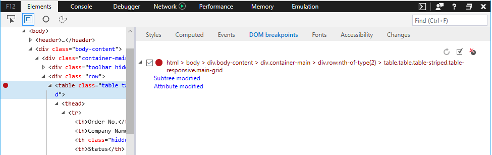
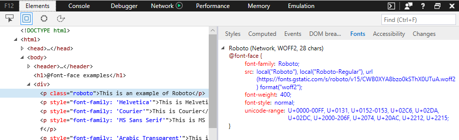
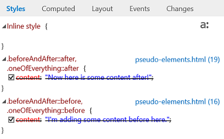
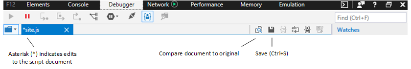
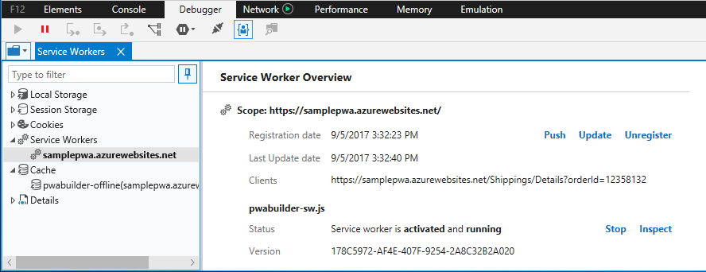

# What's new in the Windows 10 Fall Creators Update (EdgeHTML 16)

With this release we started a major F12 DevTools refactoring effort for improved robustness and performance, and also added a bunch of new features you can start using today! 

Here are the latest Microsoft Edge F12 DevTools features coming with the [Windows 10 Fall Creators Update](https://www.microsoft.com/en-us/windows/upcoming-features) and available now on [Windows Insider Preview](https://insider.windows.com/en-us/) builds.

## Ancestor event listeners 

The **Events** pane now adds the option to view event listeners registered on any ancestor of the currently selected element (in the **Elements** panel), in addition to those on the element itself. Additionally, you can now group the event listener display by either *Event* or *Element*. 

## DOM mutation breakpoints

You can now set DOM mutation breakpoints to break into the Debugger whenever a selected element node changes. From the **Elements** panel, rt-click on any element in the DOM tree view and select one or more of the following:

 - Break on Node removed
 - Break on Subtree modified
 - Break on Attribute modified

You can manage your mutation breakpoints from the **DOM breakpoints** pane in the **Elements** or **Debugger** panels.

## CSS at-rule support

CSS "at" (@) rules are now represented among other CSS rule declarations on the **Styles** pane, including animation `@keyframes` rules (currently limited to read-only), `@supports` feature queries, and `@media` queries.

## CSS fonts pane

CSS `@font-face` rules now have their own dedicated **Fonts** pane that displays where the font is loaded from (*Local* or *Network*) and how many characters are using it. If a font is loaded from the network, F12 DevTools will display the rule that imported it along with its alias and font type.

## CSS pseudo-element support

The **Styles** pane now groups pseudo-elements under their own headings and no longer displays their content as crossed out.

**Before:**

**After:**

## Console improvements

The **Console** panel got a UX overhaul for improved usability and a faster, richer Intellisense experience.

**Before:**

**After:**

We also added these improvements:

 -  Use `Shift + Enter` to add an additional line to a command before executing it with `Enter`. (Formerly there was a *Switch to multiline/single-line mode* toggle button.)

 - The following new APIs are supported:
    - [**console.table(***object***)**](./console/console-api.md#organizing-log-output) method
    - [**getEventListeners(***object***)**](./console/command-line.md#event-listeners) command
    - [**keys(***object***)**](./console/command-line.md#object-inspection) command
    - [**values(***object***)**](./console/command-line.md#object-inspection) command
    - [**$x(***xpath expression***)**](./console/command-line.md#dom-selectors) selector

 - The [**%c()**](./console/console-api.md#logging-custom-messages) formatting parameter is now supported

## Debugging improvements

In addition to a suite of new features for debugging your [PWA service workers and cache](#progressive-web-app-debugging), the Debugger added these features:

### Consolidated debugging for shared resources

Even when a resource, such as a file loaded from CDN, is referenced multiple times throughout your code, F12 DevTools will now provide a single debugging instance for that file where you can then set common breakpoints which will be hit regardless of where that file is referenced. (Previously each script reference was considered a unique resource would map to a separate set of breakpoints.)

### Live edit JavaScript with *Edit-on-idle*

You can now edit your JavaScript live during a debugging session. This feature was experimentally available (behind a flag) in the [previous](https://blogs.windows.com/buildingapps/2017/04/05/windows-10-creators-update-creators-update-sdk-released/#MMhK2OdcrR12Vi6u.97) (*Windows 10 Creators Update*) release and now its a permanent feature. Simply select any script file from the **Debugger** panel, edit, then click **Save** (or `Ctrl+S`) to test your changes next time that section of code runs. 

 

Click the **Compare document to original** button to view the diff of what you changed.

 

Please be aware of the following constraints:

- Script editing only works in external *.js* files (and not embedded `<script>` within *.html*)
- Edits are saved in memory and flushed when the document is reloaded, thus you won’t be able to run edits inside a `DOMContentLoaded` handler, for example
- Currently there’s no way (such as a **Save As** option) to save your edits to disk from F12 DevTools

## Shortcuts

You can now launch F12 DevTools to the last viewed panel (`Ctrl+Shift+I`) or directly to the Console (`Ctrl+Shift+J`) just like you would on other major browsers.

## Progressive Web App debugging

Test out the experimental support for Progressive Web Apps (PWAs) in Microsoft Edge and F12 DevTools by selecting the **Enable service workers** option from `about:flags` (and restarting Microsoft Edge). If a site makes use of **Service Workers** and/or the **Cache** API, F12 will populate entries in the **Debugger** panel for each origin, similar to how web storage and cookie inspection work:

Clicking on a specific service worker entry will open up the **Service Worker Overview**, where you can manage the service worker registration for the given scope and force a test push notification. You can also **Stop**/**Start** individual service workers and **Inspect** them from a separate debugger window:

Please note the following about service worker debugging:

 - Debugging a service worker will launch a new instance of the F12 DevTools separate from the page's tools because service workers can be shared across multiple tabs. 
 - The [Elements](./elements.md) and [Emulation](./emulation.md) panels are absent from the service worker debugger, given that service workers run in the background and do not directly control the front-end of your app.
 - Currently network traffic for a service worker is only reported from the F12 DevTools debugging instance for that worker, and not from the central instance for the page itself.

Clicking on a specific cache entry will open up the **Cache** manager, where you can inspect and optionally delete cache entries (*Request* and *Response* key/value pairs):

