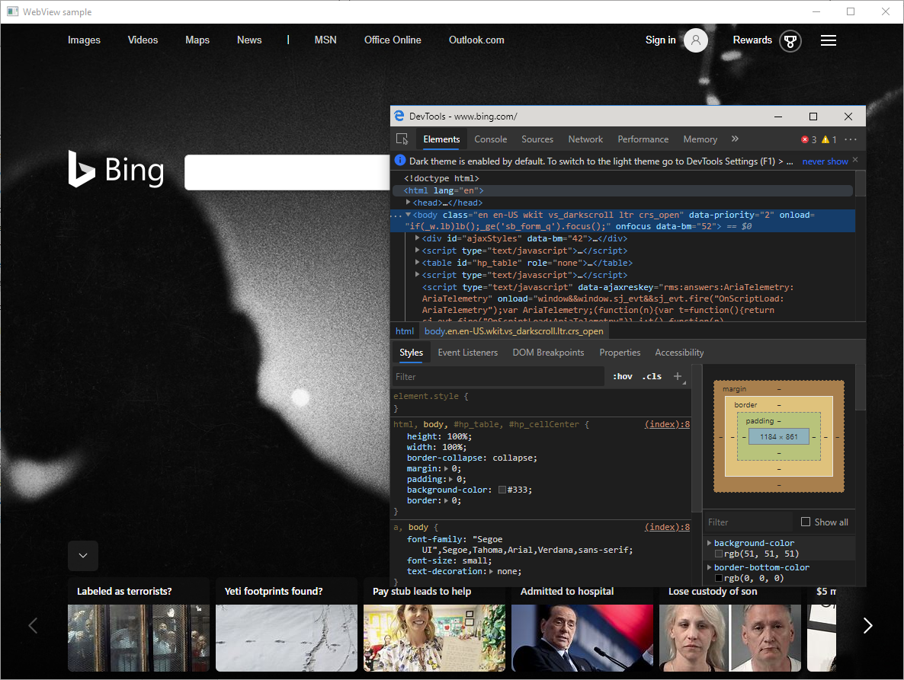

# Microsoft Edge WebView2 (developer preview)

The Microsoft Edge WebView2 control enables you to host web content in your application using [Microsoft Edge (Chromium)](https://www.microsoftedgeinsider.com/en-us/) as the rendering engine.

The WebView2 control is currently in developer preview, during which you can prototype your solutions and share feedback with us to shape the future stable API. There will likely be some breaking changes as we evolve the API during preview, and when this happens, you will need to have both the WebView2 SDK and the Microsoft Edge (Chromium) browser updated. Breaking changes will be noted in the [release notes](webview2/ReleaseNotes) of the SDK. This will lock down as WebView2 approaches beta and stable.

## Supported Platforms

Developer preview is available for Win32 C++ on Windows 10, Windows 8.1, Windows 8, and Windows 7. In the future, we plan to support WebView2 on .NET, and XAML.  

## Getting Started

To build and test your application using the WebView2 control, you need to have both [Microsoft Edge (Chromium)]( https://www.microsoftedgeinsider.com/en-us/download/) and the [WebView2 SDK](https://aka.ms/webviewnuget) installed. See [Getting Started](webview2/gettingstarted) for detailed instructions, [WebView2 API Sample](https://github.com/MicrosoftEdge/WebView2Samples/tree/master/WebView2APISample) for an interactive guide, [API reference](webview2/reference-webview2) to learn about the API, and [Release Notes](webview2/ReleaseNotes) for changes made between releases.

## WebView2 Samples

The [WebView2 Samples](https://github.com/MicrosoftEdge/WebView2Samples) repository contains samples that demonstrate all of the WebView2 SDK's features and their API use patterns. As we add more features to the WebView2 SDK, we will regularly update our sample applications.

## Feedback

Help us build a richer WebView2 experience by sharing your feedback! Visit our [feedback repo](https://aka.ms/webviewfeedback) to submit feature requests or bug reports. It’s also a good place to search for known issues.
During developer preview, we will also be collecting telemetry data to help us build a better WebView. Users can turn off WebView data collection by navigating to edge://settings/privacy in the browser and turning off browser data collection.

## Evergreen vs. Bring-your-own

The WebView2 control relies on the Microsoft Edge (Chromium) browser and currently has an evergreen distribution model – instead of packaging a browser in the app bundle, apps use the evergreen browser installed on users’ machines. The evergreen browser updates itself on a regular cadence, therefore apps targeting the evergreen WebView2 automatically get the latest feature and security updates for hosted web content. The WebView2 SDK is updated separately as new APIs become available. This is the recommended model for most developers.
In the future, there will be a second bring-your-own (BYO) option that allows developers to bundle a redistributable version of the browser with their apps. BYO brings a locked platform, but requires a larger disk footprint for the packaged browser and developers will have to take on the responsibility of servicing and updating the control themselves.

## Browser Channels

Developers can target different [channels](https://www.microsoftedgeinsider.com/en-us/download/) of the Microsoft Edge (Chromium) browser to power the WebView2 control. In most cases, production applications should target the Stable channel, but developers often need to test on Beta, Dev, or Canary to ensure their applications continue to work in the near future. The WebView2 API allows developers to programmatically target either the most stable or the least stable channel installed on users’ machine. Alternatively, developers can also use the below registry key to enforce a channel. See more details in [CreateWebView2EnvironmentWithDetails](webview2/reference/webview2.idl.md) function.

## Debugging WebView2

### DevTools

You can use [Microsoft Edge (Chromium) Developer Tools](https://docs.microsoft.com/microsoft-edge/devtools-guide-chromium) to debug web content displayed in WebView, just as you would in the browser. While having focus on the WebView window, press `F12`, or press `Ctrl` + `Shift` + `I`, or Right Click + choose `Inspect` to open Developer Tools.

**Note when debugging application in Visual Studio with the native debugger attached, `F12` may trigger the native debugger instead of Developer Tools. Use `Ctrl` + `Shift` + `I`, or Right Click + `Inspect` to avoid potential hotkey conflict.**

### Visual Studio

You can use the script debugger in Visual Studio 2019 (minimum version 16.4 Preview 2) to debug your script within WebView2 right from the IDE. Make sure the **JavaScript diagnostics** component in **Desktop development with C++** workload is installed.

Right click on your project and select **Properties**. Under **Configuration Properties** > **Debugging** > **Debugger Type**,  choose the **JavaScript (WebView2)** option to enable WebView2 script debugging. More details to follow soon.

### Visual Studio Code

You can also use Visual Studio Code to debug your script within the WebView2 right from the IDE. For more details click [here](https://github.com/microsoft/vscode-edge-debug2/blob/master/README.md#microsoft-edge-chromium-webview-applications).