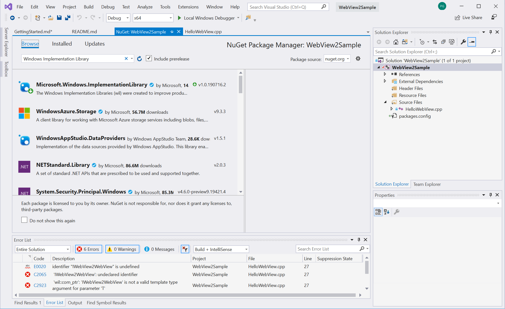
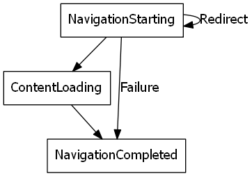
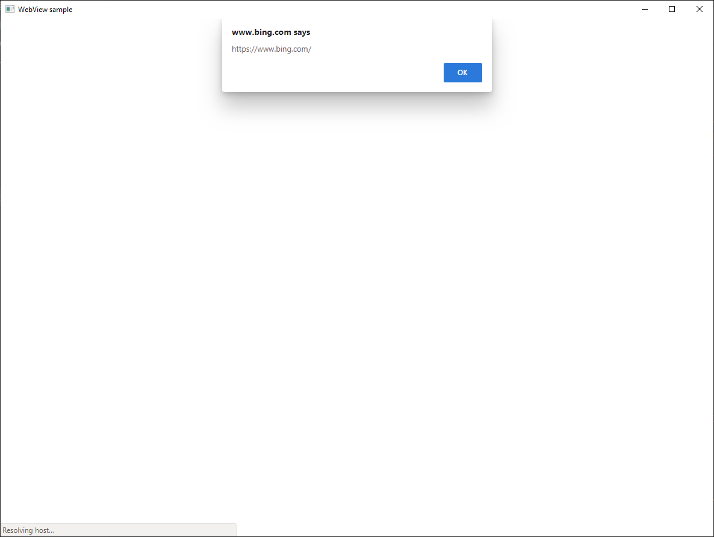

# Getting Started with WebView2 (developer preview)

This walkthrough goes over the commonly used functionalities of [WebView2 (developer preview)](https://aka.ms/webview) and gets you started on creating your first WebView2 app. Visit [API reference](reference-webview2.md) to learn more about individual APIs.  

## Prerequisites

* [Microsoft Edge (Chromium)](https://www.microsoftedgeinsider.com/download/) installed on supported OS (currently Windows 10, Windows 8.1, and Windows 7). **We recommend using the Canary channel and the minimum required version is 78.0.270.0**.
* [Visual Studio](https://visualstudio.microsoft.com/) 2015 or later with C++ support installed.

## Step 1 - Create a single window win32 app

We will start with a basic desktop project containing a single main window. As this is not the main focus of this walkthrough, we will simply use modified sample code from [Walkthrough: Create a traditional Windows Desktop application (C++)](/cpp/windows/walkthrough-creating-windows-desktop-applications-cpp?view=vs-2019). [Download](https://aka.ms/HelloWebView) the modified sample to get started.

Open **WebView2Sample.sln** in Visual Studio. If you are using an older version of Visual Studio, right click on the **WebView2Sample** project and click **Properties**. Under **Configuration Properties** > **General**, modify **Windows SDK Version** and **Platform Toolset** to use the Win10 SDK and VS toolset available to you.


Visual Studio may show some errors due to missing WebView2 header file, which should go away once Step 2 is completed.

## Step 2 - Install WebView2 SDK

Now let's add the WebView2 SDK into the project. For the developer preview, you can install the Win32 SDK via Nuget.

1. Right click the project and click **Manage Nuget Packages**.


2. Enter **Microsoft.Windows.ImplementationLibrary** in the search bar, click **Microsoft.Windows.ImplementationLibrary** from the results, and click **Install** inthe right hand side window and install the latest SDK. Nuget will download the SDK to your machine. While we use [Windows Implementation Library](https://github.com/Microsoft/wil) and [Windows Runtime C++ Template Library](/cpp/cppcx/wrl/windows-runtime-cpp-template-library-wrl?view=vs-2019) to make working with COM easier in this walkthrough, they are completely optional.



3. Enter **Microsoft.Web.WebView2** in the search bar, click **Microsoft.Web.WebView2** from the results, and click **Install** in the right hand side window and install the latest SDK. Nuget will download the SDK to your machine.


4. Include the WebView2 header. In **HelloWebView.cpp**, add `#include "WebView2.h"` below the lines of `#include`s.

```cpp
...
#include <wrl.h>
#include <wil/com.h>
// include WebView2 header
#include "WebView2.h"
```

You are all set to use and build against the WebView2 API. Press F5 to build and run the sample app. You should see an app displaying an empty window.


## Step 3 - Create a single WebView within the parent window

Now let's add a WebView to the main window. We'll use `CreateWebView2Environment` to set up the environment and locate the Microsoft Edge (Chromium) browser powering the control. You can also use `CreateWebView2EnvironmentWithDetails` if you want to specify browser location, user folder, browser flags, etc., instead of using the default setting. Upon the completion of `CreateWebView2Environment`, you'll be able to call `IWebView2Environment::CreateWebView` inside the `IWebView2CreateWebView2EnvironmentCompletedHandler` callback.

In the callback, let's also set a few settings, resize the WebView to take 100% of the parent window, and navigate to Bing.

Copy the following code to **HelloWebView.cpp** between `// <-- WebView2 sample code starts here -->` and `// <-- WebView2 sample code ends here -->`.

```cpp
// Step 3 - Create a single WebView within the parent window
// Locate the browser and set up the environment for WebView
CreateWebView2EnvironmentWithDetails(nullptr, nullptr, nullptr,
    Callback<IWebView2CreateWebView2EnvironmentCompletedHandler>(
        [hWnd](HRESULT result, IWebView2Environment* env) -> HRESULT {

            // Create a WebView, whose parent is the main window hWnd
            env->CreateWebView(hWnd, Callback<IWebView2CreateWebViewCompletedHandler>(
                [hWnd](HRESULT result, IWebView2WebView* webview) -> HRESULT {
                if (webview != nullptr) {
                    webviewWindow = webview;
                }

                // Add a few settings for the webview
                // this is a redundant demo step as they are the default settings values
                IWebView2Settings* Settings;
                webviewWindow->get_Settings(&Settings);
                Settings->put_IsScriptEnabled(TRUE);
                Settings->put_AreDefaultScriptDialogsEnabled(TRUE);
                Settings->put_IsWebMessageEnabled(TRUE);

                // Resize WebView to fit the bounds of the parent window
                RECT bounds;
                GetClientRect(hWnd, &bounds);
                webviewWindow->put_Bounds(bounds);

                // Schedule an async task to navigate to Bing
                webviewWindow->Navigate(L"https://www.bing.com/");

                // Step 4 - Navigation events


                // Step 5 - Scripting


                // Step 6 - Communication between host and web content


                return S_OK;
            }).Get());
        return S_OK;
    }).Get());
```

Press F5 to build and run the app. Now you have a WebView window displaying Bing.


## Step 4 - Navigation events

We already covered navigating to URL using `IWebView2WebView::Navigate` in the last step. During navigation, WebView fires a sequence of events that the host can listen to - `NavigationStarting`, `ContentLoading` and then `NavigationCompleted`.



In error cases there may or may not be a ContentLoading event depending on whether the navigation is continued to an error page. In case of an HTTP redirect, there will be multiple `NavigationStarting` events in a row.

As an example of utilizing those events, let's register a handler for `NavigationStarting` to cancel any non-https requests. Copy the following code to **HelloWebView.cpp** below `// Step 4 - Navigation events`.

```cpp
// register an IWebView2NavigationStartingEventHandler to cancel any non-https navigation
EventRegistrationToken token;
webviewWindow->add_NavigationStarting(Callback<IWebView2NavigationStartingEventHandler>(
    [](IWebView2WebView* webview, IWebView2NavigationStartingEventArgs * args) -> HRESULT {
        PWSTR uri;
        args->get_Uri(&uri);
        std::wstring source(uri);
        if (source.substr(0, 5) != L"https") {
            args->put_Cancel(true);
        }
        CoTaskMemFree(uri);
        return S_OK;
    }).Get(), &token);
```

Now the app will not navigate to any non-https sites. You can use similar mechanism to accomplish other tasks, such as restricting navigation to within your own domain.

## Step 5 - Scripting

The hosting app can also inject JavaScript into WebView. You can task WebView to execute arbitrary JavaScript or add initialization scripts. Added initialization scripts apply to all future top level document and child frame navigation until removed, and run after the global object has been created and before any other script included by the HTML document is executed.

Copy the following code below `// Step 5 - Scripting`.

```cpp
// Schedule an async task to add initialization script that freezes the Object object
webviewWindow->AddScriptToExecuteOnDocumentCreated(L"Object.freeze(Object);", nullptr);
// Schedule an async task to get the document URL
webviewWindow->ExecuteScript(L"window.document.URL;", Callback<IWebView2ExecuteScriptCompletedHandler>(
    [](HRESULT errorCode, LPCWSTR resultObjectAsJson) -> HRESULT {
        LPCWSTR URL = resultObjectAsJson;
        //doSomethingWithURL(URL);
        return S_OK;
    }).Get());
```

Now WebView will always freeze the Object object and return the page document once.

**Note that these script injection APIs (and some other WebView2 APIs) are asynchronous, you should use callbacks if code is to be executed in a particular order.**

## Step 6 - Communication between host and web content

The host and the web content can also communicate with each other through `postMessage`. The web content running within a WebView can post to the host through `window.chrome.webview.postMessage`, and the message would be handled by any registered `IWebView2WebMessageReceivedEventHandler` on the host. Likewise, the host can message the web content through `IWebView2WebView::PostWebMessageAsString` or `IWebView2WebView::PostWebMessageAsJSON`, which would be caught by handlers added from `window.chrome.webview.addEventListener`. The communication mechanism allows the web content to utilize native capabilities by passing messages to ask the host to call native APIs.

As an example to understand the mechanism, let's try printing out the document URL in WebView with a little detour,

1. the host registers a handler to return received message back to the web content
2. the host injects a script to the web content that registers a handler to print message from the host
3. the host injects a script to the web content that posts the URL to the host
4. the host's handler is triggered and returns the message (the URL) to the web content
5. the web content's handler is triggered and prints the host's message (the URL)

Copy the following code below `// Step 6 - Communication between host and web content`,

```cpp
// Set an event handler for the host to return received message back to the web content
webviewWindow->add_WebMessageReceived(Callback<IWebView2WebMessageReceivedEventHandler>(
    [](IWebView2WebView* webview, IWebView2WebMessageReceivedEventArgs * args) -> HRESULT {
        PWSTR message;
        args->get_WebMessageAsString(&message);
        // processMessage(&message);
        webview->PostWebMessageAsString(message);
        CoTaskMemFree(message);
        return S_OK;
    }).Get(), &token);

// Schedule an async task to add initialization script that
// 1) Add an listener to print message from the host
// 2) Post document URL to the host
webviewWindow->AddScriptToExecuteOnDocumentCreated(
    L"window.chrome.webview.addEventListener(\'message\', event => alert(event.data));" \
    L"window.chrome.webview.postMessage(window.document.URL);",
nullptr);
```

Press F5 to build and run the app. It will now show URLs before navigating to pages.



Congratulations, you've just built your first WebView2 app! 

## Next Steps
There are plenty of WebView2 functionalities that are not covered in this walkthrough. 

To learn more:
- Checkout [WebView2 API Sample](https://github.com/MicrosoftEdge/WebView2Samples/tree/master/WebView2APISample) for a comprehensive example of our SDKs capabilities.
- Checkout [WebView2Browser](https://github.com/MicrosoftEdge/WebView2Browser) an application built using WebView2.
- Please explore [API reference](reference-webview2.md) for detailed information about out API.  

## Feedback

Help us build a richer WebView2 experience by sharing your feedback! Visit our [feedback repo](https://aka.ms/webviewfeedback) to submit feature requests or bug reports or search for known issues.
