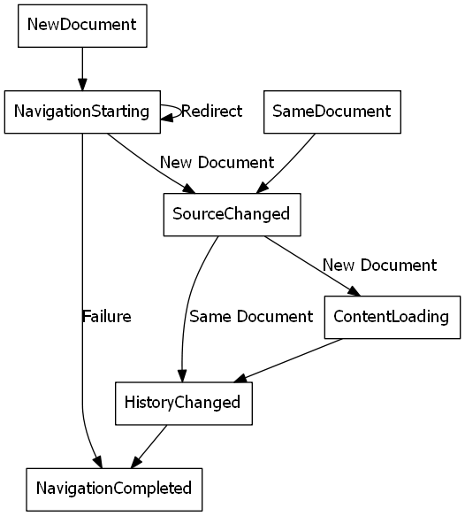

# interface IWebView2WebView 

```
interface IWebView2WebView
  : public IUnknown
```

WebView2 enables you to host web content using the latest Edge web browser technology.

## Summary

 Members                        | Descriptions
--------------------------------|---------------------------------------------
[get_Settings](#get_settings) | The [IWebView2Settings](IWebView2Settings.md#interface_i_web_view2_settings) object contains various modifiable settings for the running WebView.
[get_Source](#get_source) | The URI of the current top level document.
[Navigate](#navigate) | Cause a navigation of the top level document to the specified URI.
[MoveFocus](#movefocus) | Move focus into WebView.
[NavigateToString](#navigatetostring) | Initiates a navigation to htmlContent as source HTML of a new document.
[add_NavigationStarting](#add_navigationstarting) | Add an event handler for the NavigationStarting event.
[remove_NavigationStarting](#remove_navigationstarting) | Remove an event handler previously added with add_NavigationStarting.
[add_DocumentStateChanged](#add_documentstatechanged) | Add an event handler for the DocumentStateChanged event.
[remove_DocumentStateChanged](#remove_documentstatechanged) | Remove an event handler previously added with add_DocumentStateChanged.
[add_NavigationCompleted](#add_navigationcompleted) | Add an event handler for the NavigationCompleted event.
[remove_NavigationCompleted](#remove_navigationcompleted) | Remove an event handler previously added with add_NavigationCompleted.
[add_FrameNavigationStarting](#add_framenavigationstarting) | Add an event handler for the FrameNavigationStarting event.
[remove_FrameNavigationStarting](#remove_framenavigationstarting) | Remove an event handler previously added with add_FrameNavigationStarting.
[add_MoveFocusRequested](#add_movefocusrequested) | Add an event handler for the MoveFocusRequested event.
[remove_MoveFocusRequested](#remove_movefocusrequested) | Remove an event handler previously added with add_MoveFocusRequested.
[add_GotFocus](#add_gotfocus) | Add an event handler for the GotFocus event.
[remove_GotFocus](#remove_gotfocus) | Remove an event handler previously added with add_GotFocus.
[add_LostFocus](#add_lostfocus) | Add an event handler for the LostFocus event.
[remove_LostFocus](#remove_lostfocus) | Remove an event handler previously added with add_LostFocus.
[add_WebResourceRequested](#add_webresourcerequested) | Add an event handler for the WebResourceRequested event.
[remove_WebResourceRequested](#remove_webresourcerequested) | Remove an event handler previously added with add_WebResourceRequested.
[add_ScriptDialogOpening](#add_scriptdialogopening) | Add an event handler for the ScriptDialogOpening event.
[remove_ScriptDialogOpening](#remove_scriptdialogopening) | Remove an event handler previously added with add_ScriptDialogOpening.
[add_ZoomFactorChanged](#add_zoomfactorchanged) | Add an event handler for the ZoomFactorChanged event.
[remove_ZoomFactorChanged](#remove_zoomfactorchanged) | Remove an event handler previously added with add_ZoomFactorChanged.
[add_PermissionRequested](#add_permissionrequested) | Add an event handler for the PermissionRequested event.
[remove_PermissionRequested](#remove_permissionrequested) | Remove an event handler previously added with add_PermissionRequested.
[add_ProcessFailed](#add_processfailed) | Add an event handler for the ProcessFailed event.
[remove_ProcessFailed](#remove_processfailed) | Remove an event handler previously added with add_ProcessFailed.
[AddScriptToExecuteOnDocumentCreated](#addscripttoexecuteondocumentcreated) | Add the provided JavaScript to a list of scripts that should be executed after the global object has been created, but before the HTML document has been parsed and before any other script included by the HTML document is executed.
[RemoveScriptToExecuteOnDocumentCreated](#removescripttoexecuteondocumentcreated) | Remove the corresponding JavaScript added via AddScriptToExecuteOnDocumentCreated.
[ExecuteScript](#executescript) | Execute JavaScript code from the javascript parameter in the current top level document rendered in the WebView.
[CapturePreview](#capturepreview) | Capture an image of what WebView is displaying.
[Reload](#reload) | Reload the current page.
[get_Bounds](#get_bounds) | The webview bounds.
[put_Bounds](#put_bounds) | Set the Bounds property.
[get_ZoomFactor](#get_zoomfactor) | The zoom factor for the current page in the WebView.
[put_ZoomFactor](#put_zoomfactor) | Set the ZoomFactor property.
[get_IsVisible](#get_isvisible) | The IsVisible property determines whether to show or hide the webview.
[put_IsVisible](#put_isvisible) | Set the IsVisible property.
[PostWebMessageAsJson](#postwebmessageasjson) | Post the specified webMessage to the top level document in this [IWebView2WebView](#interface_i_web_view2_web_view).
[PostWebMessageAsString](#postwebmessageasstring) | This is a helper for posting a message that is a simple string rather than a JSON string representation of a JavaScript object.
[add_WebMessageReceived](#add_webmessagereceived) | This event fires when the IsWebMessageEnabled setting is set and the top level document of the webview calls `window.chrome.webview.postMessage`.
[remove_WebMessageReceived](#remove_webmessagereceived) | Remove an event handler previously added with add_WebMessageReceived.
[Close](#close) | Closes the webview and cleans up the underlying browser instance.
[CallDevToolsProtocolMethod](#calldevtoolsprotocolmethod) | Call an asynchronous DevToolsProtocol method.
[add_DevToolsProtocolEventReceived](#add_devtoolsprotocoleventreceived) | Subscribe to a DevToolsProtocol event.
[remove_DevToolsProtocolEventReceived](#remove_devtoolsprotocoleventreceived) | Remove an event handler previously added with add_DevToolsProtocolEventReceived.
[get_BrowserProcessId](#get_browserprocessid) | The process id of the browser process that hosts the WebView.
[get_CanGoBack](#get_cangoback) | Can navigate the webview to the previous page in the navigation history.
[get_CanGoForward](#get_cangoforward) | Can navigate the webview to the next page in the navigation history.
[GoBack](#goback) | Navigates the webview to the previous page in the navigation history.
[GoForward](#goforward) | Navigates the webview to the next page in the navigation history.
[WEBVIEW2_CAPTURE_PREVIEW_IMAGE_FORMAT](#webview2_capture_preview_image_format) | Image format used by the [IWebView2WebView::CapturePreview](#interface_i_web_view2_web_view_1a1d04f117ee7a3f8828bdaad7eecc6668) method.
[WEBVIEW2_SCRIPT_DIALOG_KIND](#webview2_script_dialog_kind) | Kind of JavaScript dialog used in the [IWebView2ScriptDialogOpeningEventHandler](IWebView2ScriptDialogOpeningEventHandler.md#interface_i_web_view2_script_dialog_opening_event_handler) interface.
[WEBVIEW2_PROCESS_FAILED_KIND](#webview2_process_failed_kind) | Kind of process failure used in the [IWebView2ProcessFailedEventHandler](IWebView2ProcessFailedEventHandler.md#interface_i_web_view2_process_failed_event_handler) interface.
[WEBVIEW2_PERMISSION_TYPE](#webview2_permission_type) | The type of a permission request.
[WEBVIEW2_PERMISSION_STATE](#webview2_permission_state) | Response to a permission request.
[WEBVIEW2_MOVE_FOCUS_REASON](#webview2_move_focus_reason) | Reason for moving focus.
[WEBVIEW2_WEB_ERROR_STATUS](#webview2_web_error_status) | Error status values for web navigations.
[WEBVIEW2_WEB_RESOURCE_CONTEXT](#webview2_web_resource_context) | Enum for resourceContextFilter of WebResourceRequested event.
[WEBVIEW2_CAPTURE_PREVIEW_IMAGE_FORMAT](#webview2_capture_preview_image_format) | Image format used by the [IWebView2WebView::CapturePreview](#interface_i_web_view2_web_view_1a1d04f117ee7a3f8828bdaad7eecc6668) method.
[WEBVIEW2_SCRIPT_DIALOG_KIND](#webview2_script_dialog_kind) | Kind of JavaScript dialog used in the [IWebView2ScriptDialogOpeningEventHandler](IWebView2ScriptDialogOpeningEventHandler.md#interface_i_web_view2_script_dialog_opening_event_handler) interface.
[WEBVIEW2_PROCESS_FAILED_KIND](#webview2_process_failed_kind) | Kind of process failure used in the [IWebView2ProcessFailedEventHandler](IWebView2ProcessFailedEventHandler.md#interface_i_web_view2_process_failed_event_handler) interface.
[WEBVIEW2_PERMISSION_TYPE](#webview2_permission_type) | The type of a permission request.
[WEBVIEW2_PERMISSION_STATE](#webview2_permission_state) | Response to a permission request.
[WEBVIEW2_MOVE_FOCUS_REASON](#webview2_move_focus_reason) | Reason for moving focus.
[WEBVIEW2_WEB_ERROR_STATUS](#webview2_web_error_status) | Error status values for web navigations.
[WEBVIEW2_WEB_RESOURCE_CONTEXT](#webview2_web_resource_context) | Enum for resourceContextFilter of WebResourceRequested event.

## Navigation events

The normal sequence of navigation events is NavigationStarting, DocumentStateChanged and then NavigationCompleted.



In error cases there may or may not be a DocumentStateChanged event depending on whether the navigation is continued to an error page. In case of an HTTP redirect, there will be multiple NavigationStarting events in a row, with ones following the first will have their IsRedirect flag set.

For subframes inside WebView, the only navigation event fired is the NavigationStarting event which gives host the ability to block subframe navigations.

## Process model

WebView2 uses the same process model as the Edge web browser. There is one Edge browser process per specified user data directory in a user session that will serve any WebView2 calling process that specifies that user data directory. This means one Edge browser process may be serving multiple calling processes and one calling process may be using multiple Edge browser processes.


Off of a browser process there will be some number of renderer processes. These are created as necessary to service potentially multiple frames in different WebViews. The number of renderer processes varies based on the site isolation browser feature and the number of distinct disconnected origins rendered in associated WebViews.


You can react to crashes and hangs in these browser and renderer processes using the ProcessFailure event.

You can safely shutdown associated browser and renderer processes using the Close method.

## Threading model

The WebView2 must be created on a UI thread. Specifically a thread with a message pump. All callbacks will occur on that thread and calls into the WebView must be done on that thread. It is not safe to use the WebView from another thread.

Callbacks including event handlers and completion handlers execute serially. That is, if you have an event handler running and begin a message loop no other event handlers or completion callbacks will begin executing reentrantly.

## Security

Always check the Source property of the WebView before using ExecuteScript, PostWebMessageAsJson, PostWebMessageAsString, or any other method to send information into the WebView. The WebView may have navigated to another page via the end user interacting with the page or script in the page causing navigation. Similarly, be very careful with AddScriptToExecuteOnDocumentCreated. All future navigations will run this script and if it provides access to information intended only for a certain origin, any HTML document may have access.

When examining the result of an ExecuteScript method call, a WebMessageReceived event, always check the Source of the sender, or any other mechanism of receiving information from an HTML document in a WebView validate the URI of the HTML document is what you expect.

When constructing a message to send into a WebView, prefer using PostWebMessageAsJson and construct the JSON string parameter using a JSON library. This will avoid any potential accidents of encoding information into a JSON string or script and ensure no attacker controlled input can modify the rest of the JSON message or run arbitrary script.

## String types

String out parameters are LPWSTR null terminated strings. The callee allocates the string using CoTaskMemAlloc. Ownership is transferred to the caller and it is up to the caller to free the memory using CoTaskMemFree.

String in parameters are LPCWSTR null terminated strings. The caller ensures the string is valid for the duration of the synchronous function call. If the callee needs to retain that value to some point after the function call completes, the callee must allocate its own copy of the string value.

## URI and JSON parsing

Various methods provide or accept URIs and JSON as strings. Please use your own preferred library for parsing and generating these strings.

If WinRT is available for your app you can use `RuntimeClass_Windows_Data_Json_JsonObject` and `IJsonObjectStatics` to parse or produce JSON strings or `RuntimeClass_Windows_Foundation_Uri` and `IUriRuntimeClassFactory` to parse and produce URIs. Both of these work in Win32 apps.

If you use IUri and CreateUri to parse URIs you may want to use the following URI creation flags to have CreateUri behavior more closely match the URI parsing in the WebView: `Uri_CREATE_ALLOW_IMPLICIT_FILE_SCHEME | Uri_CREATE_NO_DECODE_EXTRA_INFO`

## Debugging

Open DevTools with the normal shortcuts: `F12` or `Ctrl+Shift+I`. You can use the `--auto-open-devtools-for-tabs` command argument switch to have the DevTools window open immediately when first creating a WebView. See CreateWebView documentation for how to provide additional command line arguments to the browser process. Check out the LoaderOverride registry key for trying out different builds of WebView2 without modifying your application in the CreateWebView documentation.

## Versioning

After you've used a particular version of the SDK to build your app, your app may end up running with an older or newer version of installed browser binaries. Until version 1.0.0.0 of WebView2 there may be breaking changes during updates that will prevent your SDK from working with different versions of installed browser binaries. After version 1.0.0.0 different versions of the SDK can work with different versions of the installed browser by following these best practices:

To account for breaking changes to the API be sure to check for failure when calling the DLL export CreateWebView2Environment and when calling QueryInterface on any WebView2 object. A return value of E_NOINTERFACE can indicate the SDK is not compatible with the Edge browser binaries.

Checking for failure from QueryInterface will also account for cases where the SDK is newer than the version of the Edge browser and your app attempts to use an interface of which the Edge browser is unaware.

When an interface is unavailable, you can consider disabling the associated feature if possible, or otherwise informing the end user they need to update their browser.

## Members

#### get_Settings 

The [IWebView2Settings](IWebView2Settings.md#interface_i_web_view2_settings) object contains various modifiable settings for the running WebView.

> public HRESULT [get_Settings](#interface_i_web_view2_web_view_1a8396b542d0a061ded4145618642b945a)([IWebView2Settings](IWebView2Settings.md#interface_i_web_view2_settings) ** settings)

#### get_Source 

The URI of the current top level document.

> public HRESULT [get_Source](#interface_i_web_view2_web_view_1aa4f33567666a5019de3348e432c68d54)(LPWSTR * uri)

This value potentially changes as a part of the DocumentStateChanged event firing for some cases such as navigating to a different site or fragment navigations. It will remain the same for other types of navigations such as page reloads or history.pushState with the same URL as the current page.

```cpp
    // Register a handler for the DocumentStateChanged event.
    // This handler will read the webview's source URI and update
    // the app's address bar.
    CHECK_FAILURE(m_webView->add_DocumentStateChanged(
        Callback<IWebView2DocumentStateChangedEventHandler>(
            [this](IWebView2WebView* sender,
                   IWebView2DocumentStateChangedEventArgs* args) -> HRESULT
    {
        wil::unique_cotaskmem_string uri;
        sender->get_Source(&uri);
        if (wcscmp(uri.get(), L"about:blank") == 0)
        {
            uri = wil::make_cotaskmem_string(L"");
        }
        SetWindowText(m_addressbarWindow, uri.get());

        return S_OK;
    }).Get(), &m_documentStateChangedToken));
```

#### Navigate 

Cause a navigation of the top level document to the specified URI.

> public HRESULT [Navigate](#interface_i_web_view2_web_view_1a85859f22509648a1b928ddf7065fee45)(LPCWSTR uri)

See the navigation events for more information. Note that this starts a navigation and the corresponding NavigationStarting event will fire sometime after this Navigate call completes.

```cpp
void AppWindow::NavigateToAddressBar()
{
    WCHAR addressbarText[2048] = L"";
    GetWindowText(m_addressbarWindow, addressbarText, ARRAYSIZE(addressbarText));
    m_webView->Navigate(addressbarText);
}
```

#### MoveFocus 

Move focus into WebView.

> public HRESULT [MoveFocus](#interface_i_web_view2_web_view_1ad5fa39dc1bcfee27d040fccc631995f4)([WEBVIEW2_MOVE_FOCUS_REASON](#interface_i_web_view2_web_view_1a094339e235eb7a1e0512c26e09f16af3) reason)

WebView will get focus and focus will be set to correspondent element in the page hosted in the WebView. For Programmatic reason, focus is set to previously focused element or the default element if there is no previously focused element. For Next reason, focus is set to the first element. For Previous reason, focus is set to the last element. WebView can also got focus through user interaction like clicking into WebView or Tab into it. For tabbing, the app can call MoveFocus with Next or Previous to align with tab and shift+tab respectively when it decides the WebView is the next tabbable element. Or, the app can call IsDialogMessage as part of its message loop to allow the platform to auto handle tabbing. The platform will rotate through all windows with WS_TABSTOP. When the WebView gets focus from IsDialogMessage, it will internally put the focus on the first or last element for tab and shift+tab respectively.

```cpp
    while (GetMessage(&msg, nullptr, 0, 0))
    {
        if (!TranslateAccelerator(msg.hwnd, hAccelTable, &msg))
        {
            // Calling IsDialogMessage handles Tab traversal automatically. If the
            // app wants the platform to auto handle tab, then call IsDialogMessage
            // before calling TranslateMessage/DispatchMessage. If the app wants to
            // handle tabbing itself, then skip calling IsDialogMessage and call
            // TranslateMessage/DispatchMessage directly.
            if (!AppWindow::s_autoTabHandle ||
                !IsDialogMessage(GetAncestor(msg.hwnd, GA_ROOT), &msg))
            {
                TranslateMessage(&msg);
                DispatchMessage(&msg);
            }
        }
    }
```

```cpp
    SetWindowLongPtr(m_addressbarWindow, GWLP_USERDATA,
                     reinterpret_cast<LONG_PTR>(this));
    m_originalAddressBarWndProc = (WNDPROC)SetWindowLongPtr(
        m_addressbarWindow, GWLP_WNDPROC, (LONG_PTR)ChildWndProcStatic);
    SetWindowLongPtr(m_GoWindow, GWLP_USERDATA, reinterpret_cast<LONG_PTR>(this));
    m_originalGoWndProc = (WNDPROC)SetWindowLongPtr(m_GoWindow, GWLP_WNDPROC,
                                                    (LONG_PTR)ChildWndProcStatic);
```

```cpp
// Handle window messages sent to child windows, such as the address bar and the Go button
LRESULT CALLBACK AppWindow::ChildWndProcStatic(HWND hWnd,
                                               UINT message,
                                               WPARAM wParam,
                                               LPARAM lParam)
{
    AppWindow* app =
        reinterpret_cast<AppWindow*>(GetWindowLongPtr(hWnd, GWLP_USERDATA));

    if (app != nullptr)
    {
        return app->ChildWndProc(hWnd, message, wParam, lParam);
    }
    else
    {
        return DefWindowProc(hWnd, message, wParam, lParam);
    }
}

LRESULT CALLBACK AppWindow::ChildWndProc(HWND hWnd,
                                         UINT message,
                                         WPARAM wParam,
                                         LPARAM lParam)
{
    bool handled = false;
    // If not calling IsDialogMessage to handle tab traversal automatically,
    // detect tab traversal and cycle focus through address bar, go button, and
    // elements in WebView.
    if (message == WM_KEYDOWN)
    {
        if (wParam == VK_TAB)
        {
            handled = true;
            BOOL shift = (GetKeyState(VK_SHIFT) < 0);
            if (hWnd == m_addressbarWindow)
            {
                if (shift)
                {
                    // When Shift-Tab at address bar, tab backwards into WebView.
                    m_webView->MoveFocus(WEBVIEW2_MOVE_FOCUS_REASON_PREVIOUS);
                }
                else
                {
                    // When Tab at address bar, move focus to next control.
                    SetFocus(m_GoWindow);
                }
            }
            else if (hWnd == m_GoWindow)
            {
                if (shift)
                {
                    // When Shift-Tab at address bar, tab backwards to previous control.
                    SetFocus(m_addressbarWindow);
                }
                else
                {
                    // When Tab at Go button, tab forwards into WebView
                    m_webView->MoveFocus(WEBVIEW2_MOVE_FOCUS_REASON_NEXT);
                }
            }
        }
        else if ((wParam == VK_RETURN) && (hWnd == m_addressbarWindow))
        {
            NavigateToAddressBar();
            handled = true;
        }
        else
        {
            // If bit 30 is set, it means the WM_KEYDOWN message is autorepeated.
            // We want to ignore it in that case.
            if (!(lParam & (1 << 30)))
            {
                if (handled = WillHandleAcceleratorKey(wParam))
                {
                    HandleAcceleratorKey(wParam);
                }
            }
        }
    }
    else if ((message == WM_CHAR) &&
        ((wParam == VK_TAB) || (wParam == VK_RETURN)))
    {
        // Ignore Tab and return char messages to avoid the ding sound.
        handled = true;
    }
    else if ((message == WM_GETDLGCODE) &&
        (wParam == VK_RETURN))
    {
        // When calling IsDialogMessage to handle tab traversal automatically, tell
        // the system that we want to handle the VK_RETURN. This let's the app to
        // Navigate the WebView when Enter is pressed in the address bar.
        return DLGC_WANTALLKEYS;
    }

    if (handled)
        return 0;

    // continue with original Window proc for any other messages
    return CallWindowProc((hWnd == m_addressbarWindow)
                              ? m_originalAddressBarWndProc
                              : m_originalGoWndProc,
                          hWnd, message, wParam, lParam);
}
```

#### NavigateToString 

Initiates a navigation to htmlContent as source HTML of a new document.

> public HRESULT [NavigateToString](#interface_i_web_view2_web_view_1a3d905c5be9d866c56eeefac440a6d863)(LPCWSTR htmlContent)

The htmlContent parameter may not be larger than 2 MB of characters. The origin of the new page will be about:blank.

```cpp
                static const PCWSTR htmlContent =
                    L"<h1>Domain Blocked</h1>"
                    L"<p>You've attempted to navigate to a domain in the blocked "
                    L"sites list. Press back to return to the previous page.</p>";
                CHECK_FAILURE(sender->NavigateToString(htmlContent));
```

#### add_NavigationStarting 

Add an event handler for the NavigationStarting event.

> public HRESULT [add_NavigationStarting](#interface_i_web_view2_web_view_1a746fdc399efb935857bd13a7114bdaca)([IWebView2NavigationStartingEventHandler](IWebView2NavigationStartingEventHandler.md#interface_i_web_view2_navigation_starting_event_handler) * eventHandler,EventRegistrationToken * token)

NavigationStarting fires when the WebView main frame is requesting permission to navigate to a different URI. This will fire for redirects as well.

```cpp
    // Register a handler for the NavigationStarting event.
    // This handler will check the domain being navigated to, and if the domain
    // matches a list of blocked sites, it will cancel the navigation and
    // possibly display a warning page.  It will also disable JavaScript on
    // selected websites.
    CHECK_FAILURE(m_webView->add_NavigationStarting(
        Callback<IWebView2NavigationStartingEventHandler>(
            [this](IWebView2WebView* sender,
                   IWebView2NavigationStartingEventArgs* args) -> HRESULT
    {
        wil::unique_cotaskmem_string uri;
        CHECK_FAILURE(args->get_Uri(&uri));

        if (ShouldBlockUri(uri.get()))
        {
            CHECK_FAILURE(args->put_Cancel(true));

            // If the user clicked a link to navigate, show a warning page.
            BOOL userInitiated;
            CHECK_FAILURE(args->get_IsUserInitiated(&userInitiated));
            if (userInitiated)
            {
                static const PCWSTR htmlContent =
                    L"<h1>Domain Blocked</h1>"
                    L"<p>You've attempted to navigate to a domain in the blocked "
                    L"sites list. Press back to return to the previous page.</p>";
                CHECK_FAILURE(sender->NavigateToString(htmlContent));
            }
        }
        // Changes to settings will apply at the next navigation, which includes the
        // navigation after a NavigationStarting event.  We can use this to change
        // settings according to what site we're visiting.
        if (ShouldBlockScriptForUri(uri.get()))
        {
            m_settings->put_IsScriptEnabled(FALSE);
        }
        else
        {
            m_settings->put_IsScriptEnabled(m_isScriptEnabled);
        }
        return S_OK;
    }).Get(), &m_navigationStartingToken));
```

#### remove_NavigationStarting 

Remove an event handler previously added with add_NavigationStarting.

> public HRESULT [remove_NavigationStarting](#interface_i_web_view2_web_view_1a727b83dc3ec5c191bdb1002c61be9185)(EventRegistrationToken token)

#### add_DocumentStateChanged 

Add an event handler for the DocumentStateChanged event.

> public HRESULT [add_DocumentStateChanged](#interface_i_web_view2_web_view_1a989f9806a6736bac9a003319e16f6e48)([IWebView2DocumentStateChangedEventHandler](IWebView2DocumentStateChangedEventHandler.md#interface_i_web_view2_document_state_changed_event_handler) * eventHandler,EventRegistrationToken * token)

DocumentStateChanged fires when new content has started loading on the webview's main frame or if a same page navigation occurs (such as through fragment navigations or history.pushState navigations). This follows the NavigationStarting event and precedes the NavigationCompleted event.

```cpp
    // Register a handler for the DocumentStateChanged event.
    // This handler will read the webview's source URI and update
    // the app's address bar.
    CHECK_FAILURE(m_webView->add_DocumentStateChanged(
        Callback<IWebView2DocumentStateChangedEventHandler>(
            [this](IWebView2WebView* sender,
                   IWebView2DocumentStateChangedEventArgs* args) -> HRESULT
    {
        wil::unique_cotaskmem_string uri;
        sender->get_Source(&uri);
        if (wcscmp(uri.get(), L"about:blank") == 0)
        {
            uri = wil::make_cotaskmem_string(L"");
        }
        SetWindowText(m_addressbarWindow, uri.get());

        return S_OK;
    }).Get(), &m_documentStateChangedToken));
```

#### remove_DocumentStateChanged 

Remove an event handler previously added with add_DocumentStateChanged.

> public HRESULT [remove_DocumentStateChanged](#interface_i_web_view2_web_view_1ae6d508d6107db968f00dfbf058b07cd4)(EventRegistrationToken token)

#### add_NavigationCompleted 

Add an event handler for the NavigationCompleted event.

> public HRESULT [add_NavigationCompleted](#interface_i_web_view2_web_view_1a5a46b92e792debdb4be4ff2e132d6f0f)([IWebView2NavigationCompletedEventHandler](IWebView2NavigationCompletedEventHandler.md#interface_i_web_view2_navigation_completed_event_handler) * eventHandler,EventRegistrationToken * token)

NavigationCompleted event fires when the WebView has completely loaded (body.onload has fired) or loading stopped with error.

```cpp
    // Register a handler for the NavigationCompleted event.
    // If the navigation was successful, update the back and forward buttons.
    CHECK_FAILURE(m_webView->add_NavigationCompleted(
        Callback<IWebView2NavigationCompletedEventHandler>(
            [this](IWebView2WebView* sender,
                IWebView2NavigationCompletedEventArgs* args) -> HRESULT
    {
        BOOL success;
        CHECK_FAILURE(args->get_IsSuccess(&success));
        if (success)
        {
            BOOL canGoBack;
            BOOL canGoForward;
            sender->get_CanGoBack(&canGoBack);
            sender->get_CanGoForward(&canGoForward);
            EnableWindow(m_backWindow, canGoBack);
            EnableWindow(m_forwardWindow, canGoForward);
        }
        else
        {
            WEBVIEW2_WEB_ERROR_STATUS webErrorStatus;
            CHECK_FAILURE(args->get_WebErrorStatus(&webErrorStatus));
            if (webErrorStatus == WEBVIEW2_WEB_ERROR_STATUS_DISCONNECTED)
            {
                // Do something here if you want to handle a specific error case.
                // In most cases this isn't necessary, because the WebView will
                // display its own error page automatically.
            }
        }
        return S_OK;
    }).Get(), &m_navigationCompletedToken));
```

#### remove_NavigationCompleted 

Remove an event handler previously added with add_NavigationCompleted.

> public HRESULT [remove_NavigationCompleted](#interface_i_web_view2_web_view_1afb94a5aad18ea6cd0f2a9d6d317b4b9e)(EventRegistrationToken token)

#### add_FrameNavigationStarting 

Add an event handler for the FrameNavigationStarting event.

> public HRESULT [add_FrameNavigationStarting](#interface_i_web_view2_web_view_1a552b52140a8ab6d43f8d69a2329eeabc)([IWebView2NavigationStartingEventHandler](IWebView2NavigationStartingEventHandler.md#interface_i_web_view2_navigation_starting_event_handler) * eventHandler,EventRegistrationToken * token)

FrameNavigationStarting fires when a child frame in the WebView requesting permission to navigate to a different URI. This will fire for redirects as well.

```cpp
    // Register a handler for the FrameNavigationStarting event.
    // This handler will prevent a frame from navigating to a blocked domain.
    CHECK_FAILURE(m_webView->add_FrameNavigationStarting(
        Callback<IWebView2NavigationStartingEventHandler>(
            [this](IWebView2WebView* sender,
                   IWebView2NavigationStartingEventArgs* args) -> HRESULT
    {
        wil::unique_cotaskmem_string uri;
        CHECK_FAILURE(args->get_Uri(&uri));

        if (ShouldBlockUri(uri.get()))
        {
            CHECK_FAILURE(args->put_Cancel(true));
        }
        return S_OK;
    }).Get(), &m_frameNavigationStartingToken));
```

#### remove_FrameNavigationStarting 

Remove an event handler previously added with add_FrameNavigationStarting.

> public HRESULT [remove_FrameNavigationStarting](#interface_i_web_view2_web_view_1ac51a862e0737a1e7c5ac7fc0ccba64d6)(EventRegistrationToken token)

#### add_MoveFocusRequested 

Add an event handler for the MoveFocusRequested event.

> public HRESULT [add_MoveFocusRequested](#interface_i_web_view2_web_view_1af1e669775645817e281fa83db66d4995)([IWebView2MoveFocusRequestedEventHandler](IWebView2MoveFocusRequestedEventHandler.md#interface_i_web_view2_move_focus_requested_event_handler) * eventHandler,EventRegistrationToken * token)

MoveFocusRequested fires when user tries to tab out of the WebView. The WebView's focus has not changed when this event is fired.

```cpp
    // Register a handler for the MoveFocusRequested event.
    // This event will be fired when the user tabs out of the webview.
    // The handler will focus another window in the app, depending on which
    // direction the focus is being shifted.
    CHECK_FAILURE(m_webView->add_MoveFocusRequested(
        Callback<IWebView2MoveFocusRequestedEventHandler>(
            [this](
                IWebView2WebView* sender,
                IWebView2MoveFocusRequestedEventArgs* args) -> HRESULT
    {
        if (!s_autoTabHandle)
        {
            WEBVIEW2_MOVE_FOCUS_REASON reason;
            CHECK_FAILURE(args->get_Reason(&reason));

            if (reason == WEBVIEW2_MOVE_FOCUS_REASON_NEXT)
            {
                SetFocus(m_addressbarWindow);
            }
            else if (reason == WEBVIEW2_MOVE_FOCUS_REASON_PREVIOUS)
            {
                SetFocus(m_GoWindow);
            }
            CHECK_FAILURE(args->put_Handled(TRUE));
        }
        return S_OK;
    }).Get(), &m_moveFocusRequestedToken));
```

#### remove_MoveFocusRequested 

Remove an event handler previously added with add_MoveFocusRequested.

> public HRESULT [remove_MoveFocusRequested](#interface_i_web_view2_web_view_1a62df3bca9979178c4ac5b4f5ecb3b941)(EventRegistrationToken token)

#### add_GotFocus 

Add an event handler for the GotFocus event.

> public HRESULT [add_GotFocus](#interface_i_web_view2_web_view_1accf1ba18fdb97e5bfe27f0520f18b017)([IWebView2FocusChangedEventHandler](IWebView2FocusChangedEventHandler.md#interface_i_web_view2_focus_changed_event_handler) * eventHandler,EventRegistrationToken * token)

GotFocus fires when WebView got focus.

#### remove_GotFocus 

Remove an event handler previously added with add_GotFocus.

> public HRESULT [remove_GotFocus](#interface_i_web_view2_web_view_1aaca016ea0de908dc1e027f4ca4f6b8d0)(EventRegistrationToken token)

#### add_LostFocus 

Add an event handler for the LostFocus event.

> public HRESULT [add_LostFocus](#interface_i_web_view2_web_view_1af8c148d397519f901ff06f03edb3f372)([IWebView2FocusChangedEventHandler](IWebView2FocusChangedEventHandler.md#interface_i_web_view2_focus_changed_event_handler) * eventHandler,EventRegistrationToken * token)

LostFocus fires when WebView lost focus. In the case where MoveFocusRequested event is fired, the focus is still on WebView when MoveFocusRequested event fires. Lost focus only fires afterwards when app's code or default action of MoveFocusRequested event set focus away from WebView.

#### remove_LostFocus 

Remove an event handler previously added with add_LostFocus.

> public HRESULT [remove_LostFocus](#interface_i_web_view2_web_view_1a96ebfe46ab2d2b382716356a091c5906)(EventRegistrationToken token)

#### add_WebResourceRequested 

Add an event handler for the WebResourceRequested event.

> public HRESULT [add_WebResourceRequested](#interface_i_web_view2_web_view_1a03a2b5f82defb29dc480326e6460816f)(LPCWSTR *const urlFilter,[WEBVIEW2_WEB_RESOURCE_CONTEXT](#interface_i_web_view2_web_view_1a84d836ed6f6e803de309300b344a3152) *const resourceContextFilter,SIZE_T filterLength,[IWebView2WebResourceRequestedEventHandler](IWebView2WebResourceRequestedEventHandler.md#interface_i_web_view2_web_resource_requested_event_handler) * eventHandler,EventRegistrationToken * token)

Fires when the WebView has performs any HTTP request. Use urlFilter to pass in a list with size filterLength of urls to listen for. Each url entry also supports wildcards: '*' matches zero or more characters, and '?' matches exactly one character. For each urlFilter entry, provide a matching resourceContextFilter as a bit vector representing the types of resources for which WebResourceRequested should fire. If filterLength is 0, the event will fire for all network requests. The supported resource contexts are: Document, Stylesheet, Image, Media, Font, Script, XHR, Fetch.

```cpp
        if (m_blockImages)
        {
            // Register a handler for the WebResourceRequested event.
            // This handler blocks all resources that are in an image context, such
            // as  elements and CSS background-image properties.
            PCWSTR matchAllUris[] = { L"*" };
            WEBVIEW2_WEB_RESOURCE_CONTEXT imagesFilter[] = {
                WEBVIEW2_WEB_RESOURCE_CONTEXT_IMAGE };
            CHECK_FAILURE(m_webView->add_WebResourceRequested(
                matchAllUris, imagesFilter, 1,
                Callback<IWebView2WebResourceRequestedEventHandler>(
                    [this](IWebView2WebView* sender,
                           IWebView2WebResourceRequestedEventArgs* args)
            {
                // Override the response with an empty one to block the image.
                // If put_Response is not called, the request will continue as normal.
                wil::com_ptr<IWebView2WebResourceResponse> response;
                CHECK_FAILURE(m_webViewEnvironment->CreateWebResourceResponse(
                    nullptr, 200, L"OK", L"",
                    &response));
                CHECK_FAILURE(args->put_Response(response.get()));
                return S_OK;
            }).Get(), &m_webResourceRequestedTokenForImageBlocking));
        }
        else
        {
            CHECK_FAILURE(m_webView->remove_WebResourceRequested(
                m_webResourceRequestedTokenForImageBlocking));
        }
```

#### remove_WebResourceRequested 

Remove an event handler previously added with add_WebResourceRequested.

> public HRESULT [remove_WebResourceRequested](#interface_i_web_view2_web_view_1aafcacea7a669055ad5f895cdfb5d8838)(EventRegistrationToken token)

#### add_ScriptDialogOpening 

Add an event handler for the ScriptDialogOpening event.

> public HRESULT [add_ScriptDialogOpening](#interface_i_web_view2_web_view_1a09b052357bb9c498f21124b4113184e0)([IWebView2ScriptDialogOpeningEventHandler](IWebView2ScriptDialogOpeningEventHandler.md#interface_i_web_view2_script_dialog_opening_event_handler) * eventHandler,EventRegistrationToken * token)

The event fires when a JavaScript dialog (alert, confirm, or prompt) will show for the webview. This event only fires if the IWebView2Settings::AreDefaultScriptDialogsEnabled property is set to false.

```cpp
    // Register a handler for the ScriptDialogOpening event.
    // This handler will set up a custom prompt dialog for the user,
    // and may defer the event if the setting to defer dialogs is enabled.
    CHECK_FAILURE(m_webView->add_ScriptDialogOpening(
        Callback<IWebView2ScriptDialogOpeningEventHandler>(
            [this](
                IWebView2WebView* sender,
                IWebView2ScriptDialogOpeningEventArgs* args) -> HRESULT
    {
        wil::com_ptr<IWebView2ScriptDialogOpeningEventArgs> eventArgs = args;
        auto showDialog = [this, eventArgs]
        {
            wil::unique_cotaskmem_string uri;
            WEBVIEW2_SCRIPT_DIALOG_KIND type;
            wil::unique_cotaskmem_string message;
            wil::unique_cotaskmem_string defaultText;

            CHECK_FAILURE(eventArgs->get_Uri(&uri));
            CHECK_FAILURE(eventArgs->get_Kind(&type));
            CHECK_FAILURE(eventArgs->get_Message(&message));
            CHECK_FAILURE(eventArgs->get_DefaultText(&defaultText));

            TextInputDialog inputDialog(m_hInst, m_mainWindow);
            std::wstring prompt = std::wstring(L"The page at '")
                + uri.get() + L"' says:";
            inputDialog.SetUserInput(defaultText.get());
            inputDialog.SetReadOnly(type != WEBVIEW2_SCRIPT_DIALOG_KIND_PROMPT);

            if (inputDialog.Show(L"Script Dialog", prompt.c_str(), message.get()) == IDOK)
            {
                CHECK_FAILURE(eventArgs->put_ResultText(inputDialog.GetUserInput()));
                CHECK_FAILURE(eventArgs->Accept());
            }
        };

        if (m_deferScriptDialogs)
        {
            wil::com_ptr<IWebView2Deferral> deferral;
            CHECK_FAILURE(args->GetDeferral(&deferral));
            m_completeDeferredDialog = [showDialog, deferral]
            {
                showDialog();
                CHECK_FAILURE(deferral->Complete());
            };
        }
        else
        {
            showDialog();
        }

        return S_OK;
    }).Get(), &m_scriptDialogOpeningToken));
```

#### remove_ScriptDialogOpening 

Remove an event handler previously added with add_ScriptDialogOpening.

> public HRESULT [remove_ScriptDialogOpening](#interface_i_web_view2_web_view_1af1e7612ba89a977f7c700d0459fe05b1)(EventRegistrationToken token)

#### add_ZoomFactorChanged 

Add an event handler for the ZoomFactorChanged event.

> public HRESULT [add_ZoomFactorChanged](#interface_i_web_view2_web_view_1a62e83d8913e3eb899cade17cd17b206c)([IWebView2ZoomFactorChangedEventHandler](IWebView2ZoomFactorChangedEventHandler.md#interface_i_web_view2_zoom_factor_changed_event_handler) * eventHandler,EventRegistrationToken * token)

The event fires when the ZoomFactor property of the WebView changes. The event could fire because the caller modified the ZoomFactor property, or due to the user manually modifying the zoom. When it is modified by the caller via the ZoomFactor property, the internal zoom factor is updated immediately and there will be no ZoomFactorChanged event. WebView associates the last used zoom factor for each site. Therefore, it is possible for the zoom factor to change when navigating to a different page. When the zoom factor changes due to this, the ZoomFactorChanged event fires right after the DocumentStateChanged event.

```cpp
    // Register a handler for the ZoomFactorChanged event.
    // This handler just announces the new level of zoom on the window's title bar.
    CHECK_FAILURE(m_webView->add_ZoomFactorChanged(
        Callback<IWebView2ZoomFactorChangedEventHandler>(
            [this](IWebView2WebView* sender,
                IUnknown* args) -> HRESULT
    {
        double zoomFactor;
        CHECK_FAILURE(sender->get_ZoomFactor(&zoomFactor));

        std::wstring message = L"WebViewSampleApp (Zoom: "
                             + std::to_wstring(int(zoomFactor * 100))
                             + L"%)";
        SetWindowText(m_mainWindow, message.c_str());
        return S_OK;
    }).Get(), &m_zoomFactorChangedToken));
```

#### remove_ZoomFactorChanged 

Remove an event handler previously added with add_ZoomFactorChanged.

> public HRESULT [remove_ZoomFactorChanged](#interface_i_web_view2_web_view_1aea548ed385ec6da89a45acec9257d003)(EventRegistrationToken token)

#### add_PermissionRequested 

Add an event handler for the PermissionRequested event.

> public HRESULT [add_PermissionRequested](#interface_i_web_view2_web_view_1a56d5be170335da55302e94dc4f98dd3f)([IWebView2PermissionRequestedEventHandler](IWebView2PermissionRequestedEventHandler.md#interface_i_web_view2_permission_requested_event_handler) * eventHandler,EventRegistrationToken * token)

Fires when content in a WebView requests permission to access some privileged resources.

```cpp
    // Register a handler for the PermissionRequested event.
    // This handler prompts the user to allow or deny the request.
    CHECK_FAILURE(m_webView->add_PermissionRequested(
        Callback<IWebView2PermissionRequestedEventHandler>(
            [this](
                IWebView2WebView* sender,
                IWebView2PermissionRequestedEventArgs* args) -> HRESULT
    {
        wil::unique_cotaskmem_string uri;
        WEBVIEW2_PERMISSION_TYPE type = WEBVIEW2_PERMISSION_TYPE_UNKNOWN_PERMISSION;
        BOOL userInitiated = FALSE;

        CHECK_FAILURE(args->get_Uri(&uri));
        CHECK_FAILURE(args->get_PermissionType(&type));
        CHECK_FAILURE(args->get_IsUserInitiated(&userInitiated));

        std::wstring message = L"Do you want to grant permission for ";
        message += NameOfPermissionType(type);
        message += L" to the website at ";
        message += uri.get();
        message += L"?\n\n";
        message += (userInitiated
            ? L"This request came from a user gesture."
            : L"This request did not come from a user gesture.");

        int response = MessageBox(nullptr, message.c_str(), L"Permission Request",
                                   MB_YESNOCANCEL | MB_ICONWARNING);

        WEBVIEW2_PERMISSION_STATE state =
              response == IDYES ? WEBVIEW2_PERMISSION_STATE_ALLOW
            : response == IDNO  ? WEBVIEW2_PERMISSION_STATE_DENY
            :                     WEBVIEW2_PERMISSION_STATE_DEFAULT;
        CHECK_FAILURE(args->put_State(state));

        return S_OK;
    }).Get(), &m_permissionRequestedToken));
```

#### remove_PermissionRequested 

Remove an event handler previously added with add_PermissionRequested.

> public HRESULT [remove_PermissionRequested](#interface_i_web_view2_web_view_1a49c139ce73d56b74a44046a2a94df455)(EventRegistrationToken token)

#### add_ProcessFailed 

Add an event handler for the ProcessFailed event.

> public HRESULT [add_ProcessFailed](#interface_i_web_view2_web_view_1ae368d9f3f5ea52af860808df53de21aa)([IWebView2ProcessFailedEventHandler](IWebView2ProcessFailedEventHandler.md#interface_i_web_view2_process_failed_event_handler) * eventHandler,EventRegistrationToken * token)

Fires when a WebView process terminated unexpectedly or become unresponsive.

```cpp
    // Register a handler for the ProcessFailed event.
    // This handler checks if the browser process failed, and asks the user if
    // they want to recreate the webview.
    CHECK_FAILURE(m_webView->add_ProcessFailed(
        Callback<IWebView2ProcessFailedEventHandler>(
            [this](IWebView2WebView* sender,
                IWebView2ProcessFailedEventArgs* args) -> HRESULT
    {
        WEBVIEW2_PROCESS_FAILED_KIND failureType;
        CHECK_FAILURE(args->get_ProcessFailedKind(&failureType));
        if (failureType == WEBVIEW2_PROCESS_FAILED_KIND_BROWSER_PROCESS_EXITED)
        {
            int button = MessageBox(
                nullptr,
                L"Browser process exited unexpectedly.  Recreate webview?",
                L"Browser process exited",
                MB_YESNO);
            if (button == IDYES)
            {
                ReinitializeWebView();
            }
        }
        return S_OK;
    }).Get(), &m_processFailedToken));
```

#### remove_ProcessFailed 

Remove an event handler previously added with add_ProcessFailed.

> public HRESULT [remove_ProcessFailed](#interface_i_web_view2_web_view_1a4426b79e7d5373db1253e04b09765a8f)(EventRegistrationToken token)

#### AddScriptToExecuteOnDocumentCreated 

Add the provided JavaScript to a list of scripts that should be executed after the global object has been created, but before the HTML document has been parsed and before any other script included by the HTML document is executed.

> public HRESULT [AddScriptToExecuteOnDocumentCreated](#interface_i_web_view2_web_view_1a1a103e2a19f6cf5fb31e2e99f2dda652)(LPCWSTR javaScript,[IWebView2AddScriptToExecuteOnDocumentCreatedCompletedHandler](IWebView2AddScriptToExecuteOnDocumentCreatedCompletedHandler.md#interface_i_web_view2_add_script_to_execute_on_document_created_completed_handler) * handler)

The injected script will apply to all future top level document and child frame navigations until removed with RemoveScriptToExecuteOnDocumentCreated. This is applied asynchronously and you must wait for the completion handler to run before you can be sure that the script is ready to execute on future navigations.

Note that if an HTML document has sandboxing of some kind via [sandbox](https://developer.mozilla.org/en-US/docs/Web/HTML/Element/iframe#attr-sandbox) properties or the [Content-Security-Policy HTTP header](https://developer.mozilla.org/en-US/docs/Web/HTTP/Headers/Content-Security-Policy) this will affect the script run here. So, for example, if the 'allow-modals' keyword is not set then calls to the `alert` function will be ignored.

```cpp
// Prompt the user for some script and register it to execute whenever a new page loads.
void AppWindow::AddInitializeScript()
{
    TextInputDialog inputDialog(m_hInst, m_mainWindow);
    PCWSTR title = L"Add Initialize Script";
    PCWSTR prompt = L"Script:";
    PCWSTR description =
        L"Enter the JavaScript code to run as the initialization script that "
        L"runs before any script in the HTML document.";
    // This example script stops child frames from opening new windows.  Because
    // the initialization script runs before any script in the HTML document, we
    // can trust the results of our checks on window.parent and window.top.
    inputDialog.SetUserInput(
        L"if (window.parent !== window.top) {\r\n"
        L"    delete window.open;\r\n"
        L"}");

    if (inputDialog.Show(title, prompt, description) == IDOK)
    {
        PCWSTR script = inputDialog.GetUserInput();

        m_webView->AddScriptToExecuteOnDocumentCreated(
            script,
            Callback<IWebView2AddScriptToExecuteOnDocumentCreatedCompletedHandler>(
                [this](HRESULT error, PCWSTR id) -> HRESULT
        {
            m_lastInitializeScriptId = id;
            MessageBox(nullptr, id, L"AddScriptToExecuteOnDocumentCreated Id", MB_OK);
            return S_OK;
        }).Get());

    }
}
```

#### RemoveScriptToExecuteOnDocumentCreated 

Remove the corresponding JavaScript added via AddScriptToExecuteOnDocumentCreated.

> public HRESULT [RemoveScriptToExecuteOnDocumentCreated](#interface_i_web_view2_web_view_1a5f05f00c324ad3a1b773039ca7941d9b)(LPCWSTR id)

#### ExecuteScript 

Execute JavaScript code from the javascript parameter in the current top level document rendered in the WebView.

> public HRESULT [ExecuteScript](#interface_i_web_view2_web_view_1a815441aceb1588264e801761085de322)(LPCWSTR javaScript,[IWebView2ExecuteScriptCompletedHandler](IWebView2ExecuteScriptCompletedHandler.md#interface_i_web_view2_execute_script_completed_handler) * handler)

This will execute asynchronously and when complete, if a handler is provided in the ExecuteScriptCompletedHandler parameter, its Invoke method will be called with the result of evaluating the provided JavaScript. The result value is a JSON encoded string. If the result is undefined, contains a reference cycle, or otherwise cannot be encoded into JSON, the JSON null value will be returned as the string 'null'. Note that a function that has no explicit return value returns undefined. If the executed script throws an unhandled exception, then the result is also 'null'. This method is applied asynchronously. If the call is made while the webview is on one document, and a navigation occurs after the call is made but before the JavaScript is executed, then the script will not be executed and the handler will be called with E_FAIL for its errorCode parameter. ExecuteScript will work even if IsScriptEnabled is set to FALSE.

```cpp
// Prompt the user for some script and then execute it.
void AppWindow::InjectScript()
{
    TextInputDialog inputDialog(m_hInst, m_mainWindow);
    PCWSTR title = L"Inject Script";
    PCWSTR prompt = L"Enter script code:";
    PCWSTR description = L"Enter the JavaScript code to run in the webview.";
    inputDialog.SetUserInput(
        L"window.getComputedStyle(document.body).backgroundColor");

    if (inputDialog.Show(title, prompt, description) == IDOK)
    {
        PCWSTR script = inputDialog.GetUserInput();

        m_webView->ExecuteScript(script,
            Callback<IWebView2ExecuteScriptCompletedHandler>(
                [](HRESULT error, PCWSTR result) -> HRESULT
        {
            if (error != S_OK) {
                ShowFailure(error, L"ExecuteScript failed");
            }
            MessageBox(nullptr, result, L"ExecuteScript Result", MB_OK);
            return S_OK;
        }).Get());
    }
}
```

#### CapturePreview 

Capture an image of what WebView is displaying.

> public HRESULT [CapturePreview](#interface_i_web_view2_web_view_1a1d04f117ee7a3f8828bdaad7eecc6668)([WEBVIEW2_CAPTURE_PREVIEW_IMAGE_FORMAT](#interface_i_web_view2_web_view_1a10b47cc3a871007318b235771b8d1f9c) imageFormat,IStream * imageStream,[IWebView2CapturePreviewCompletedHandler](IWebView2CapturePreviewCompletedHandler.md#interface_i_web_view2_capture_preview_completed_handler) * handler)

Specify the format of the image with the imageFormat parameter. The resulting image binary data is written to the provided imageStream parameter. When CapturePreview finishes writing to the stream, the Invoke method on the provided handler parameter is called.

```cpp
// Show the user a file selection dialog, then save a screenshot of the WebView
// to the selected file.
void AppWindow::SaveScreenshot()
{
    OPENFILENAME openFileName = {};
    openFileName.lStructSize = sizeof(openFileName);
    openFileName.hwndOwner = nullptr;
    openFileName.hInstance = nullptr;
    WCHAR fileName[MAX_PATH] = L"WebView2_Screenshot.png";
    openFileName.lpstrFile = fileName;
    openFileName.lpstrFilter = L"PNG File\0*.png\0";
    openFileName.nMaxFile = ARRAYSIZE(fileName);
    openFileName.Flags = OFN_OVERWRITEPROMPT;

    if (GetSaveFileName(&openFileName))
    {
        wil::com_ptr<IStream> stream;
        CHECK_FAILURE(SHCreateStreamOnFileEx(
            fileName,
            STGM_READWRITE | STGM_CREATE,
            FILE_ATTRIBUTE_NORMAL,
            TRUE,
            nullptr,
            &stream));

        CHECK_FAILURE(m_webView->CapturePreview(
            WEBVIEW2_CAPTURE_PREVIEW_IMAGE_FORMAT_PNG,
            stream.get(),
            Callback<IWebView2CapturePreviewCompletedHandler>(
                [](HRESULT error_code) -> HRESULT
        {
            CHECK_FAILURE(error_code);

            MessageBox(nullptr, L"Preview Captured", L"Preview Captured",
                        MB_OK);
            return S_OK;
        }).Get()));
    }
}
```

#### Reload 

Reload the current page.

> public HRESULT [Reload](#interface_i_web_view2_web_view_1af12695d21d3d16fb6593424411b89c3c)()

This is similar to navigating to the URI of current top level document including all navigation events firing and respecting any entries in the HTTP cache. But, the back/forward history will not be modified.

#### get_Bounds 

The webview bounds.

> public HRESULT [get_Bounds](#interface_i_web_view2_web_view_1a18657afad7fd4f184854d90a89986ce8)(RECT * bounds)

Bounds are relative to the parent HWND. The app has two ways it can position a WebView:

1. Create a child HWND that is the WebView parent HWND. Position this window where the WebView should be. In this case, use (0, 0) for the WebView's Bound's top left corner (the offset).

1. Use the app's top most window as the WebView parent HWND. Set the WebView's Bound's top left corner so that the WebView is positioned correctly in the app. The Bound's values are in the host's coordinate space.

#### put_Bounds 

Set the Bounds property.

> public HRESULT [put_Bounds](#interface_i_web_view2_web_view_1abdd3b3f3f40ec9b5fb40550674dec528)(RECT bounds)

```cpp
// Update the bounds of the WebView window to fit available space.
void WebViewContainer::ResizeWebView()
{
    RECT desiredBounds = m_webViewBounds;
    desiredBounds.bottom =
        (m_webViewBounds.bottom - m_webViewBounds.top) * m_webViewRatio + m_webViewBounds.top;
    desiredBounds.right =
        (m_webViewBounds.right - m_webViewBounds.left) * m_webViewRatio + m_webViewBounds.left;

    m_webView->put_Bounds(desiredBounds);
}
```

#### get_ZoomFactor 

The zoom factor for the current page in the WebView.

> public HRESULT [get_ZoomFactor](#interface_i_web_view2_web_view_1a7da9d85461e2908a8fe2042ba982ee32)(double * zoomFactor)

The zoom factor is persisted per site. Note that changing zoom factor could cause `window.innerWidth/innerHeight` and page layout to change. When WebView navigates to a page from a different site, the zoom factor set for the previous page will not be applied. If the app wants to set the zoom factor for a certain page, the earliest place to do it is in the DocumentStateChanged event handler. Note that if it does that, it might receive a ZoomFactorChanged event for the persisted zoom factor before receiving the ZoomFactorChanged event for the specified zoom factor. Specifying a zoomFactor less than or equal to 0 is not allowed. WebView also has an internal supported zoom factor range. When a specified zoom factor is out of that range, it will be normalized to be within the range, and a ZoomFactorChanged event will be fired for the real applied zoom factor. When this range normalization happens, the ZoomFactor property will report the zoom factor specified during the previous modification of the ZoomFactor property until the ZoomFactorChanged event is received after webview applies the normalized zoom factor.

#### put_ZoomFactor 

Set the ZoomFactor property.

> public HRESULT [put_ZoomFactor](#interface_i_web_view2_web_view_1a51a93b00b7c94c5c1d9e2a37b9ef6df3)(double zoomFactor)

#### get_IsVisible 

The IsVisible property determines whether to show or hide the webview.

> public HRESULT [get_IsVisible](#interface_i_web_view2_web_view_1a828193b6c1d597f1a589afc54c49bd3a)(BOOL * isVisible)

If IsVisible is set to false, the webview will be transparent and will not be rendered. However, this will not affect the window containing the webview (the HWND parameter that was passed to CreateWebView). If you want that window to disappear too, call ShowWindow on it directly in addition to modifying the IsVisible property. WebView as a child window won't get window messages when the top window is minimized or restored. For performance reason, developer should set IsVisible property of the WebView to false when the app window is minimized and back to true when app window is restored. App window can do this by handling SC_MINIMIZE and SC_RESTORE command upon receiving WM_SYSCOMMAND message.

```cpp
void WebViewContainer::ToggleVisibility()
{
    BOOL visible;
    m_webView->get_IsVisible(&visible);
    m_isVisible = !visible;
    m_webView->put_IsVisible(m_isVisible);
}
```

#### put_IsVisible 

Set the IsVisible property.

> public HRESULT [put_IsVisible](#interface_i_web_view2_web_view_1a7fd9470d593cdd63b3cf46066f5b5bcc)(BOOL isVisible)

```cpp
void WebViewContainer::AppMinimized()
{
    // Hide the webview when the app window is minimized.
    if (m_webView)
    {
        m_webView->put_IsVisible(FALSE);
    }
}

void WebViewContainer::AppRestored()
{
    // When the app window is restored, show the webview
    // (unless the user has toggle visibility off).
    if (m_webView && m_isVisible)
    {
        m_webView->put_IsVisible(TRUE);
    }
}
```

#### PostWebMessageAsJson 

Post the specified webMessage to the top level document in this [IWebView2WebView](#interface_i_web_view2_web_view).

> public HRESULT [PostWebMessageAsJson](#interface_i_web_view2_web_view_1aa89c9b6074f9b0d70fe20d963c4cb15e)(LPCWSTR webMessageAsJson)

The top level document's window.chrome.webview's message event fires. JavaScript in that document may subscribe and unsubscribe to the event via the following: 
```cpp
window.chrome.webview.addEventListener('message', handler)
window.chrome.webview.removeEventListener('message', handler)
```
 The event args is an instance of `MessageEvent`. The IWebView2Settings::IsWebMessageEnabled setting must be true or this method will fail with E_INVALIDARG. The event arg's data property is the webMessage string parameter parsed as a JSON string into a JavaScript object. The event arg's source property is a reference to the `window.chrome.webview` object. See SetWebMessageReceivedEventHandler for information on sending messages from the HTML document in the webview to the host. This message is sent asynchronously. If a navigation occurs before the message is posted to the page, then the message will not be sent.

```cpp
    // Setup the web message received event handler before navigating to
    // ensure we don't miss any messages.
    CHECK_FAILURE(m_webview->add_WebMessageReceived(
        Microsoft::WRL::Callback<IWebView2WebMessageReceivedEventHandler>(
            [this](IWebView2WebView* sender, IWebView2WebMessageReceivedEventArgs* args)
    {
        wil::unique_cotaskmem_string uri;
        CHECK_FAILURE(args->get_Source(&uri));

        // Always validate that the origin of the message is what you expect.
        if (uri.get() != m_sampleUri)
        {
            return S_OK;
        }
        wil::unique_cotaskmem_string messageRaw;
        CHECK_FAILURE(args->get_WebMessageAsString(&messageRaw));
        std::wstring message = messageRaw.get();

        if (message.compare(0, 13, L"SetTitleText ") == 0)
        {
            m_appWindow->SetTitleText(message.substr(13).c_str());
        }
        else if (message.compare(L"GetWindowBounds") == 0)
        {
            RECT bounds = m_appWindow->GetWindowBounds();
            std::wstring reply =
                L"{\"WindowBounds\":\"Left:" + std::to_wstring(bounds.left)
                + L"\\nTop:" + std::to_wstring(bounds.top)
                + L"\\nRight:" + std::to_wstring(bounds.right)
                + L"\\nBottom:" + std::to_wstring(bounds.bottom)
                + L"\"}";
            CHECK_FAILURE(sender->PostWebMessageAsJson(reply.c_str()));
        }
        return S_OK;
    }).Get(), &m_webMessageReceivedToken));
```

#### PostWebMessageAsString 

This is a helper for posting a message that is a simple string rather than a JSON string representation of a JavaScript object.

> public HRESULT [PostWebMessageAsString](#interface_i_web_view2_web_view_1a6b45a3bf0135e9a32014f759bdeef7cb)(LPCWSTR webMessageAsString)

This behaves in exactly the same manner as PostWebMessageAsJson but the `window.chrome.webview` message event arg's data property will be a string with the same value as webMessageAsString. Use this instead of PostWebMessageAsJson if you want to communicate via simple strings rather than JSON objects.

#### add_WebMessageReceived 

This event fires when the IsWebMessageEnabled setting is set and the top level document of the webview calls `window.chrome.webview.postMessage`.

> public HRESULT [add_WebMessageReceived](#interface_i_web_view2_web_view_1ab141e100936bb17a246f4c0af2ebc125)([IWebView2WebMessageReceivedEventHandler](IWebView2WebMessageReceivedEventHandler.md#interface_i_web_view2_web_message_received_event_handler) * handler,EventRegistrationToken * token)

The postMessage function is `void postMessage(object)` where object is any object supported by JSON conversion.

```cpp
        window.chrome.webview.addEventListener('message', arg => {
            if ("SetColor" in arg.data) {
                document.getElementById("colorable").style.color = arg.data.SetColor;
            }
            if ("WindowBounds" in arg.data) {
                document.getElementById("window-bounds").value = arg.data.WindowBounds;
            }
        });

        function SetTitleText() {
            let titleText = document.getElementById("title-text");
            window.chrome.webview.postMessage(`SetTitleText ${titleText.value}`);
        }
        function GetWindowBounds() {
            window.chrome.webview.postMessage("GetWindowBounds");
        }
```
 When postMessage is called, the [IWebView2WebMessageReceivedEventHandler](IWebView2WebMessageReceivedEventHandler.md#interface_i_web_view2_web_message_received_event_handler) set via this SetWebMessageReceivedEventHandler method will be invoked with the postMessage's object parameter converted to a JSON string.

```cpp
    // Setup the web message received event handler before navigating to
    // ensure we don't miss any messages.
    CHECK_FAILURE(m_webview->add_WebMessageReceived(
        Microsoft::WRL::Callback<IWebView2WebMessageReceivedEventHandler>(
            [this](IWebView2WebView* sender, IWebView2WebMessageReceivedEventArgs* args)
    {
        wil::unique_cotaskmem_string uri;
        CHECK_FAILURE(args->get_Source(&uri));

        // Always validate that the origin of the message is what you expect.
        if (uri.get() != m_sampleUri)
        {
            return S_OK;
        }
        wil::unique_cotaskmem_string messageRaw;
        CHECK_FAILURE(args->get_WebMessageAsString(&messageRaw));
        std::wstring message = messageRaw.get();

        if (message.compare(0, 13, L"SetTitleText ") == 0)
        {
            m_appWindow->SetTitleText(message.substr(13).c_str());
        }
        else if (message.compare(L"GetWindowBounds") == 0)
        {
            RECT bounds = m_appWindow->GetWindowBounds();
            std::wstring reply =
                L"{\"WindowBounds\":\"Left:" + std::to_wstring(bounds.left)
                + L"\\nTop:" + std::to_wstring(bounds.top)
                + L"\\nRight:" + std::to_wstring(bounds.right)
                + L"\\nBottom:" + std::to_wstring(bounds.bottom)
                + L"\"}";
            CHECK_FAILURE(sender->PostWebMessageAsJson(reply.c_str()));
        }
        return S_OK;
    }).Get(), &m_webMessageReceivedToken));
```

#### remove_WebMessageReceived 

Remove an event handler previously added with add_WebMessageReceived.

> public HRESULT [remove_WebMessageReceived](#interface_i_web_view2_web_view_1aa88405e6ca157207ea1ad67eb90d477b)(EventRegistrationToken token)

#### Close 

Closes the webview and cleans up the underlying browser instance.

> public HRESULT [Close](#interface_i_web_view2_web_view_1ab89c2d6cf7e33606791af1907d34c9d6)()

Cleaning up the browser instace will release the resources powering the webview. The browser instance will be shut down if there are no other webviews using it.

After calling Close, all method calls will fail and event handlers will stop firing. Specifically, the WebView will release its references to its event handlers when Close is called.

Close is implicitly called when the WebView loses its final reference and is destructed. But it is best practice to explicitly call Close to avoid any accidental cycle of references between the WebView and the app code. Specifically, if you capture a reference to the WebView in an event handler you will create a reference cycle between the WebView and the event handler. Close will break this cycle by releasing all event handlers. But to avoid this situation it is best practice to both explicitly call Close on the WebView and to not capture a reference to the WebView to ensure the WebView can be cleaned up correctly.

```cpp
// Close the WebView and deinitialize related state.  This doesn't close the app window.
void AppWindow::CloseWebView()
{
    m_activeScenarios.clear();
    m_webViewContainer.SetWebView(nullptr);
    if (m_webView)
    {
        m_webView->Close();
        m_webView = nullptr;
    }
    m_webViewEnvironment = nullptr;
}
```

#### CallDevToolsProtocolMethod 

Call an asynchronous DevToolsProtocol method.

> public HRESULT [CallDevToolsProtocolMethod](#interface_i_web_view2_web_view_1a2f423dcdc6d712f18fbebaad47dad4ca)(LPCWSTR methodName,LPCWSTR parametersAsJson,[IWebView2CallDevToolsProtocolMethodCompletedHandler](IWebView2CallDevToolsProtocolMethodCompletedHandler.md#interface_i_web_view2_call_dev_tools_protocol_method_completed_handler) * handler)

See the [DevTools Protocol Viewer](https://aka.ms/DevToolsProtocolDocs) for a list and description of available methods. The methodName parameter is the full name of the method in the format `{domain}.{method}`. The parametersAsJson parameter is a JSON formatted string containing the parameters for the corresponding method. The handler's Invoke method will be called when the method asynchronously completes. Invoke will be called with the method's return object as a JSON string.

```cpp
// Prompt the user for the name and parameters of a CDP method, then call it.
void AppWindow::CallCdpMethod()
{
    TextInputDialog inputDialog(m_hInst, m_mainWindow);
    PCWSTR title = L"Call CDP Method";
    PCWSTR prompt = L"CDP method name:";
    PCWSTR description = L"Enter the CDP method name to call, followed by a space,\r\nfollowed by the parameters in JSON format.";
    inputDialog.SetUserInput(L"Runtime.evaluate {\"expression\":\"alert(\\\"test\\\")\"}");

    if (inputDialog.Show(title, prompt, description) == IDOK)
    {
        std::wstring cdpMethodAndParams = inputDialog.GetUserInput();
        size_t delimiterPos = cdpMethodAndParams.find(L' ');
        std::wstring methodName = cdpMethodAndParams.substr(0, delimiterPos);
        std::wstring methodParams =
            (delimiterPos < cdpMethodAndParams.size()
                ? cdpMethodAndParams.substr(delimiterPos + 1)
                : L"{}");

        m_webView->CallDevToolsProtocolMethod(
            methodName.c_str(),
            methodParams.c_str(),
            Callback<IWebView2CallDevToolsProtocolMethodCompletedHandler>(
                [](HRESULT error, PCWSTR resultJson) -> HRESULT
                {
                    MessageBox(nullptr, resultJson, L"CDP Method Result", MB_OK);
                    return S_OK;
                }).Get());
    }
}
```

#### add_DevToolsProtocolEventReceived 

Subscribe to a DevToolsProtocol event.

> public HRESULT [add_DevToolsProtocolEventReceived](#interface_i_web_view2_web_view_1a36d94c59be8b0154e368831fc54edee9)(LPCWSTR eventName,[IWebView2DevToolsProtocolEventReceivedEventHandler](IWebView2DevToolsProtocolEventReceivedEventHandler.md#interface_i_web_view2_dev_tools_protocol_event_received_event_handler) * handler,EventRegistrationToken * token)

See the [DevTools Protocol Viewer](https://aka.ms/DevToolsProtocolDocs) for a list and description of available events. The eventName parameter is the full name of the event in the format `{domain}.{event}`. The handler's Invoke method will be called whenever the corresponding DevToolsProtocol event fires. Invoke will be called with the an event args object containing the CDP event's parameter object as a JSON string.

```cpp
// Prompt the user to name a CDP event, and then subscribe to that event.
void AppWindow::SubscribeToCdpEvent()
{
    TextInputDialog inputDialog(m_hInst, m_mainWindow);
    PCWSTR title = L"Subscribe to CDP Event";
    PCWSTR prompt = L"CDP event name:";
    PCWSTR description = L"Enter the name of the CDP event to subscribe to.\r\n"
                         L"You may also have to call the \"enable\" method of the\r\n"
                         L"event's domain to receive events (for example \"Log.enable\").\r\n";
    inputDialog.SetUserInput(L"Log.entryAdded");

    if (inputDialog.Show(title, prompt, description) == IDOK)
    {
        std::wstring eventName = inputDialog.GetUserInput();
        auto preexistingToken = m_devToolsProtocolEventReceivedTokenMap.find(eventName);
        if (preexistingToken != m_devToolsProtocolEventReceivedTokenMap.end())
        {
            CHECK_FAILURE(m_webView->remove_DevToolsProtocolEventReceived(
                eventName.c_str(),
                preexistingToken->second));
        }

        CHECK_FAILURE(m_webView->add_DevToolsProtocolEventReceived(
            eventName.c_str(),
            Callback<IWebView2DevToolsProtocolEventReceivedEventHandler>(
                [eventName](IWebView2WebView* sender,
                            IWebView2DevToolsProtocolEventReceivedEventArgs* args)
                -> HRESULT
        {
            wil::unique_cotaskmem_string parameterObjectAsJson;
            CHECK_FAILURE(args->get_ParameterObjectAsJson(&parameterObjectAsJson));
            MessageBox(nullptr, parameterObjectAsJson.get(),
                       (L"CDP Event Fired: " + eventName).c_str(), MB_OK);
            return S_OK;
        }).Get(), &m_devToolsProtocolEventReceivedTokenMap[eventName]));
    }
}
```

#### remove_DevToolsProtocolEventReceived 

Remove an event handler previously added with add_DevToolsProtocolEventReceived.

> public HRESULT [remove_DevToolsProtocolEventReceived](#interface_i_web_view2_web_view_1a1985b336b13e00958e014ab690823374)(LPCWSTR eventName,EventRegistrationToken token)

#### get_BrowserProcessId 

The process id of the browser process that hosts the WebView.

> public HRESULT [get_BrowserProcessId](#interface_i_web_view2_web_view_1a42ac0f40e782f3739678a54f02041ea6)(UINT32 * value)

#### get_CanGoBack 

Can navigate the webview to the previous page in the navigation history.

> public HRESULT [get_CanGoBack](#interface_i_web_view2_web_view_1a74df1fb0e0a9eb64c97b7a09773293a6)(BOOL * canGoBack)

get_CanGoBack change value with the DocumentStateChanged event.

#### get_CanGoForward 

Can navigate the webview to the next page in the navigation history.

> public HRESULT [get_CanGoForward](#interface_i_web_view2_web_view_1a82515d39dc69f1b1832db2590284a788)(BOOL * canGoForward)

get_CanGoForward change value with the DocumentStateChanged event.

#### GoBack 

Navigates the webview to the previous page in the navigation history.

> public HRESULT [GoBack](#interface_i_web_view2_web_view_1a5cc0cfe51007a8f55ee7fbf32867bbaf)()

#### GoForward 

Navigates the webview to the next page in the navigation history.

> public HRESULT [GoForward](#interface_i_web_view2_web_view_1aca830d498dc98d8226d85b8040349f6e)()

#### WEBVIEW2_CAPTURE_PREVIEW_IMAGE_FORMAT 

Image format used by the [IWebView2WebView::CapturePreview](#interface_i_web_view2_web_view_1a1d04f117ee7a3f8828bdaad7eecc6668) method.

> enum [WEBVIEW2_CAPTURE_PREVIEW_IMAGE_FORMAT](#interface_i_web_view2_web_view_1a10b47cc3a871007318b235771b8d1f9c)

 Values                         | Descriptions
--------------------------------|---------------------------------------------
WEBVIEW2_CAPTURE_PREVIEW_IMAGE_FORMAT_PNG            | PNG image format.
WEBVIEW2_CAPTURE_PREVIEW_IMAGE_FORMAT_JPEG            | JPEG image format.

#### WEBVIEW2_SCRIPT_DIALOG_KIND 

Kind of JavaScript dialog used in the [IWebView2ScriptDialogOpeningEventHandler](IWebView2ScriptDialogOpeningEventHandler.md#interface_i_web_view2_script_dialog_opening_event_handler) interface.

> enum [WEBVIEW2_SCRIPT_DIALOG_KIND](#interface_i_web_view2_web_view_1a6180fcb980ca62aeebdccb0511b32a78)

 Values                         | Descriptions
--------------------------------|---------------------------------------------
WEBVIEW2_SCRIPT_DIALOG_KIND_ALERT            | A dialog invoked via the window.alert JavaScript function.
WEBVIEW2_SCRIPT_DIALOG_KIND_CONFIRM            | A dialog invoked via the window.confirm JavaScript function.
WEBVIEW2_SCRIPT_DIALOG_KIND_PROMPT            | A dialog invoked via the window.prompt JavaScript function.

#### WEBVIEW2_PROCESS_FAILED_KIND 

Kind of process failure used in the [IWebView2ProcessFailedEventHandler](IWebView2ProcessFailedEventHandler.md#interface_i_web_view2_process_failed_event_handler) interface.

> enum [WEBVIEW2_PROCESS_FAILED_KIND](#interface_i_web_view2_web_view_1ab39b04c165e6bd9b41044070f4addc5f)

 Values                         | Descriptions
--------------------------------|---------------------------------------------
WEBVIEW2_PROCESS_FAILED_KIND_BROWSER_PROCESS_EXITED            | Indicates the browser process terminated unexpectedly.
WEBVIEW2_PROCESS_FAILED_KIND_RENDER_PROCESS_EXITED            | Indicates the render process terminated unexpectedly.
WEBVIEW2_PROCESS_FAILED_KIND_RENDER_PROCESS_UNRESPONSIVE            | Indicates the render process becomes unresponsive.

#### WEBVIEW2_PERMISSION_TYPE 

The type of a permission request.

> enum [WEBVIEW2_PERMISSION_TYPE](#interface_i_web_view2_web_view_1a92fe308a93a24813da9ca0ba84c412d6)

 Values                         | Descriptions
--------------------------------|---------------------------------------------
WEBVIEW2_PERMISSION_TYPE_UNKNOWN_PERMISSION            | Unknown permission.
WEBVIEW2_PERMISSION_TYPE_MICROPHONE            | Permission to capture audio.
WEBVIEW2_PERMISSION_TYPE_CAMERA            | Permission to capture video.
WEBVIEW2_PERMISSION_TYPE_GEOLOCATION            | Permission to access geolocation.
WEBVIEW2_PERMISSION_TYPE_NOTIFICATIONS            | Permission to send web notifications.
WEBVIEW2_PERMISSION_TYPE_OTHER_SENSORS            | Permission to access generic sensor.
WEBVIEW2_PERMISSION_TYPE_CLIPBOARD_READ            | Permission to read system clipboard without a user gesture.

#### WEBVIEW2_PERMISSION_STATE 

Response to a permission request.

> enum [WEBVIEW2_PERMISSION_STATE](#interface_i_web_view2_web_view_1aeffb35b30ac1903baac33c0b971b441e)

 Values                         | Descriptions
--------------------------------|---------------------------------------------
WEBVIEW2_PERMISSION_STATE_DEFAULT            | Use default browser behavior, which normally prompt users for decision.
WEBVIEW2_PERMISSION_STATE_ALLOW            | Grant the permission request.
WEBVIEW2_PERMISSION_STATE_DENY            | Deny the permission request.

#### WEBVIEW2_MOVE_FOCUS_REASON 

Reason for moving focus.

> enum [WEBVIEW2_MOVE_FOCUS_REASON](#interface_i_web_view2_web_view_1a094339e235eb7a1e0512c26e09f16af3)

 Values                         | Descriptions
--------------------------------|---------------------------------------------
WEBVIEW2_MOVE_FOCUS_REASON_PROGRAMMATIC            | Code setting focus into WebView.
WEBVIEW2_MOVE_FOCUS_REASON_NEXT            | Moving focus due to Tab traversal forward.
WEBVIEW2_MOVE_FOCUS_REASON_PREVIOUS            | Moving focus due to Tab traversal backward.

#### WEBVIEW2_WEB_ERROR_STATUS 

Error status values for web navigations.

> enum [WEBVIEW2_WEB_ERROR_STATUS](#interface_i_web_view2_web_view_1a0438e7212af8c0d59acb658442cd69fb)

 Values                         | Descriptions
--------------------------------|---------------------------------------------
WEBVIEW2_WEB_ERROR_STATUS_UNKNOWN            | An unknown error occurred.
WEBVIEW2_WEB_ERROR_STATUS_CERTIFICATE_COMMON_NAME_IS_INCORRECT            | The SSL certificate common name does not match the web address.
WEBVIEW2_WEB_ERROR_STATUS_CERTIFICATE_EXPIRED            | The SSL certificate has expired.
WEBVIEW2_WEB_ERROR_STATUS_CLIENT_CERTIFICATE_CONTAINS_ERRORS            | The SSL client certificate contains errors.
WEBVIEW2_WEB_ERROR_STATUS_CERTIFICATE_REVOKED            | The SSL certificate has been revoked.
WEBVIEW2_WEB_ERROR_STATUS_CERTIFICATE_IS_INVALID            | The SSL certificate is invalid.
WEBVIEW2_WEB_ERROR_STATUS_SERVER_UNREACHABLE            | The host is unreachable.
WEBVIEW2_WEB_ERROR_STATUS_TIMEOUT            | The connection has timed out.
WEBVIEW2_WEB_ERROR_STATUS_ERROR_HTTP_INVALID_SERVER_RESPONSE            | The server returned an invalid or unrecognized response.
WEBVIEW2_WEB_ERROR_STATUS_CONNECTION_ABORTED            | The connection was aborted.
WEBVIEW2_WEB_ERROR_STATUS_CONNECTION_RESET            | The connection was reset.
WEBVIEW2_WEB_ERROR_STATUS_DISCONNECTED            | The Internet connection has been lost.
WEBVIEW2_WEB_ERROR_STATUS_CANNOT_CONNECT            | Cannot connect to destination.
WEBVIEW2_WEB_ERROR_STATUS_HOST_NAME_NOT_RESOLVED            | Could not resolve provided host name.
WEBVIEW2_WEB_ERROR_STATUS_OPERATION_CANCELED            | The operation was canceled.
WEBVIEW2_WEB_ERROR_STATUS_REDIRECT_FAILED            | The request redirect failed.
WEBVIEW2_WEB_ERROR_STATUS_UNEXPECTED_ERROR            | An unexpected error occurred.

#### WEBVIEW2_WEB_RESOURCE_CONTEXT 

Enum for resourceContextFilter of WebResourceRequested event.

> enum [WEBVIEW2_WEB_RESOURCE_CONTEXT](#interface_i_web_view2_web_view_1a84d836ed6f6e803de309300b344a3152)

 Values                         | Descriptions
--------------------------------|---------------------------------------------
WEBVIEW2_WEB_RESOURCE_CONTEXT_ALL            | Filter all resource types.
WEBVIEW2_WEB_RESOURCE_CONTEXT_DOCUMENT            | Filter document requests.
WEBVIEW2_WEB_RESOURCE_CONTEXT_STYLESHEET            | Filter CSS resources.
WEBVIEW2_WEB_RESOURCE_CONTEXT_IMAGE            | Filter image resources.
WEBVIEW2_WEB_RESOURCE_CONTEXT_MEDIA            | Filter other media types such as videos.
WEBVIEW2_WEB_RESOURCE_CONTEXT_FONT            | Filter fonts.
WEBVIEW2_WEB_RESOURCE_CONTEXT_SCRIPT            | Filter scripts.
WEBVIEW2_WEB_RESOURCE_CONTEXT_XML_HTTP_REQUEST            | Filter XML HTTP requests.
WEBVIEW2_WEB_RESOURCE_CONTEXT_FETCH            | Filter fetch requests.

#### WEBVIEW2_CAPTURE_PREVIEW_IMAGE_FORMAT 

Image format used by the [IWebView2WebView::CapturePreview](#interface_i_web_view2_web_view_1a1d04f117ee7a3f8828bdaad7eecc6668) method.

> typedef [WEBVIEW2_CAPTURE_PREVIEW_IMAGE_FORMAT](#interface_i_web_view2_web_view_1a33cd5016f65d6f1e49c4fdfa609591a6)

#### WEBVIEW2_SCRIPT_DIALOG_KIND 

Kind of JavaScript dialog used in the [IWebView2ScriptDialogOpeningEventHandler](IWebView2ScriptDialogOpeningEventHandler.md#interface_i_web_view2_script_dialog_opening_event_handler) interface.

> typedef [WEBVIEW2_SCRIPT_DIALOG_KIND](#interface_i_web_view2_web_view_1a694fef62045c5aea87498c3f1bfc2b4b)

#### WEBVIEW2_PROCESS_FAILED_KIND 

Kind of process failure used in the [IWebView2ProcessFailedEventHandler](IWebView2ProcessFailedEventHandler.md#interface_i_web_view2_process_failed_event_handler) interface.

> typedef [WEBVIEW2_PROCESS_FAILED_KIND](#interface_i_web_view2_web_view_1a347fade2e5e46f339434e7a4ad4ef524)

#### WEBVIEW2_PERMISSION_TYPE 

The type of a permission request.

> typedef [WEBVIEW2_PERMISSION_TYPE](#interface_i_web_view2_web_view_1a0c8c94bd81ee9279ef68a140168d06fb)

#### WEBVIEW2_PERMISSION_STATE 

Response to a permission request.

> typedef [WEBVIEW2_PERMISSION_STATE](#interface_i_web_view2_web_view_1ad6eb3fe3e9955a3f77dd6138006f8785)

#### WEBVIEW2_MOVE_FOCUS_REASON 

Reason for moving focus.

> typedef [WEBVIEW2_MOVE_FOCUS_REASON](#interface_i_web_view2_web_view_1a91d4545f559914ff5cbeca2d973d5ed3)

#### WEBVIEW2_WEB_ERROR_STATUS 

Error status values for web navigations.

> typedef [WEBVIEW2_WEB_ERROR_STATUS](#interface_i_web_view2_web_view_1a2700d86cabe3a40cff79266ae7d01077)

#### WEBVIEW2_WEB_RESOURCE_CONTEXT 

Enum for resourceContextFilter of WebResourceRequested event.

> typedef [WEBVIEW2_WEB_RESOURCE_CONTEXT](#interface_i_web_view2_web_view_1a0e254cac9552ef10ad2c277dc6950e8a)

