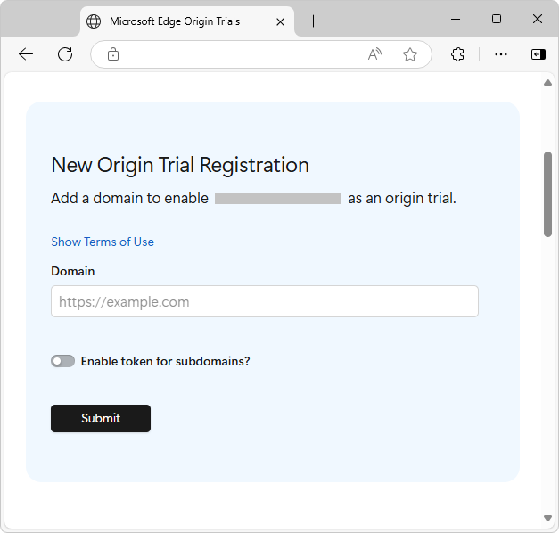
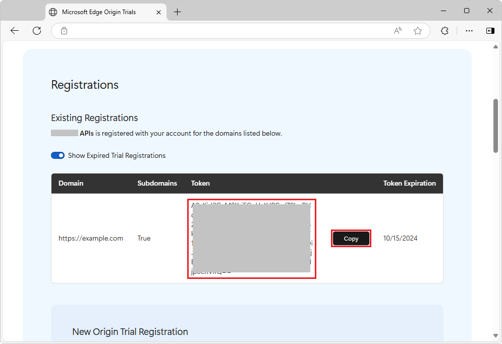
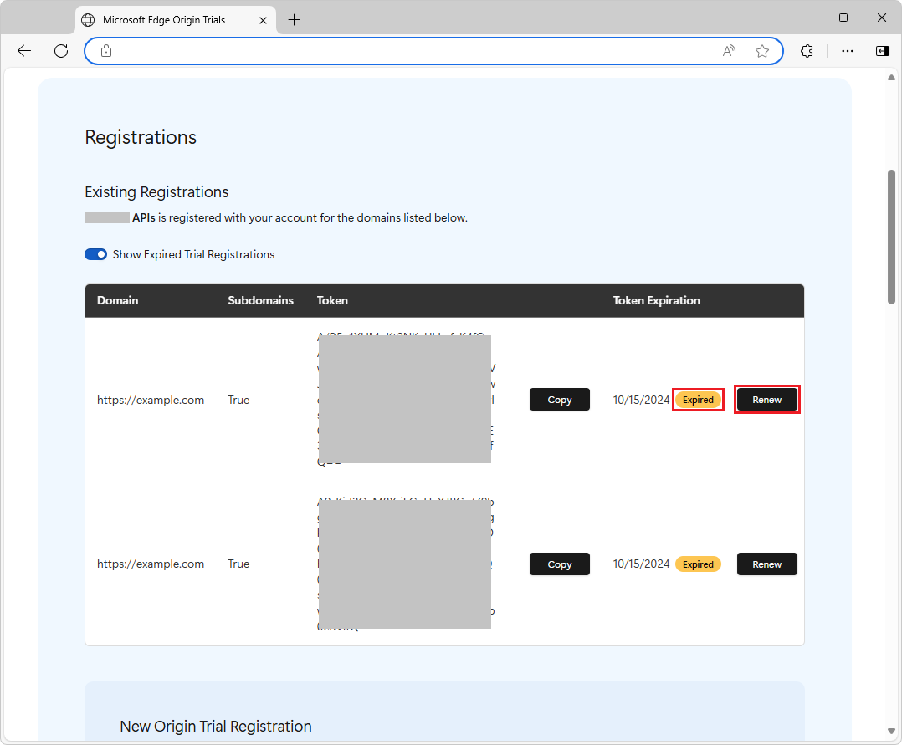

# Use origin trials of experimental APIs in Microsoft Edge

Use origin trials to try out experimental APIs on your own live site for a limited period of time.  When using origin trials, users of Microsoft Edge that visit your site can run code that uses experimental APIs.

To see a list of the available origin trials and register your origin to try out any of the origin trials, see [Microsoft Edge Origin Trials](https://developer.microsoft.com/microsoft-edge/origin-trials).  To assess the suitability of using the experimental APIs on your website, check the minimum version requirements for Microsoft Edge, and check the trial expiration date.

You can provide feedback to browser feature engineers and the web standards community about the design of the feature's API, your use-cases, or your experience with using the feature's API, by using the **Issues** tab in the browser feature's repo.

<!-- ------------------------------ -->
#### How the origin trial token works

The origin-trials mechanism allows a user of your webpage to use the origin trial's experimental feature API in their Microsoft Edge browser, despite the feature's off-by-default state.  The user's Microsoft Edge browser detects the origin trial's token, and then automatically turns on the browser's feature flag that corresponds to the origin trial for which the token is valid.  The user doesn't need to set any `edge://flags` in Microsoft Edge.

To support using an origin trial's experimental APIs in your website:

1. Register the origin domain that you want to use the experimental feature on (for example, `https://example.com`), and then an origin trial token is generated for you.

1. Copy the token to your webpage within a `<head>/<meta>` element, or in an `Origin-Trial` HTTP server response header.

1. When a Microsoft Edge user visits your webpage and the browser finds an origin-trial token, the browser turns on the associated origin-trial feature.

<!-- ====================================================================== -->
## Registering for an origin trial
<!-- fwlink that points to this anchor/ article section heading: pending -->
<!-- if no fwlink is defined & used at portal: don't change wording of heading, b/c the "Register for an experiment" card at https://developer.microsoft.com/microsoft-edge/origin-trials links to this heading/anchor -->

To register for an origin trial:

1. Go to [Microsoft Edge Origin Trials](https://developer.microsoft.com/microsoft-edge/origin-trials).

1. Select an active trial.

1. Click the **I Accept the Terms of Use** button.

1. If you are prompted to, sign in.  For example, sign in to GitHub, and then authorize the **Microsoft Edge Origin Trials** page to use the account sign-in.

   The **New Origin Trial Registration** form opens:

   

1. In the **Domain** text box, enter a domain URL (such as `https://example.com`) or a subdomain URL (such as `https://beta.example.com`).

   You can configure the origin trial token to support any of the following:
   * A single domain, such as `https://example.com`, without supporting its subdomains.
   * A single subdomain, such as `https://beta.example.com`.
   * A domain, such as `https://example.com`, and its subdomains, such as `https://beta.example.com`.

   Trailing paths and query parameters aren't supported.  If a URI is entered that has a trailing path or a query parameter, such as `https://example.com/path/new-feature`, the root domain (such as `https://example.com`) or subdomain will be registered, ignoring any trailing path or query parameters.

1. Set the **Enable token for subdomains?** toggle.

   * To enable using the origin trial at a domain (such as `https://example.com`) without supporting its subdomains (such as `https://beta.example.com`), make sure the **Enable token for subdomains?** toggle is turned off.

   * To enable using the origin trial only at a specific subdomain (such as `https://beta.example.com`), make sure the **Enable token for subdomains?** toggle is turned off.

   * To enable using the origin trial at a domain (such as `https://example.com`) and its subdomains (such as `https://beta.example.com`), turn on the **Enable token for subdomains?** toggle.

1. Click the **Submit** button.

   An origin trial token is generated, and is displayed in the **Registrations** section near the **New Origin Trial Registration** form:

   

1. Click the **Copy** button, and then paste the origin trial token into a safe place, noting which domain it's for.  You can also view this information in this webpage later.

<!-- ====================================================================== -->
## Using the origin trial token at your website
<!-- fwlink that points to this anchor/ article section heading: pending -->
<!-- if no fwlink is defined & used at portal: don't change wording of heading, b/c the "Enable the Origin Trial in your site's code" card at https://developer.microsoft.com/microsoft-edge/origin-trials links to this heading/anchor -->

Use the token at your website in either of the following ways:

<!-- ------------------------------ -->
#### Option 1: A \<meta\> tag within the \<head\> element of a webpage

Within the `<head>` element of a webpage, include the following `<meta>` tag:

`<meta http-equiv="origin-trial" content="EXAMPLE_TOKEN">`

Replace `EXAMPLE_TOKEN` by your token.

<!-- ------------------------------ -->
#### Option 2: An HTTP header in your HTTP server response

In your HTTP server response, add the following HTTP header:

`Origin-Trial: EXAMPLE_TOKEN`

Replace `EXAMPLE_TOKEN` by your token.

<!-- ------------------------------ -->
#### Opting out of an origin trial experiment

To opt out of an experiment (origin trial) that you're enrolled in, remove the origin trial token from the `<meta>` tag or from the server response headers.

<!-- ====================================================================== -->
## Performing feature detection and providing graceful fallback

Treat origin trials as experimental.  As a best practice, in your website code, perform feature detection and provide graceful fallback for these cases:
* If the experimental feature API isn't available in the user's browser.
* If the origin-trial token expires.
* If the Microsoft Edge feature team ends the origin trial.

See [Implementing feature detection](https://developer.mozilla.org/docs/Learn/Tools_and_testing/Cross_browser_testing/Feature_detection) at MDN.

<!-- ====================================================================== -->
## Testing an origin trial at `localhost`

To test an origin-trial feature at `localhost`, go to `edge://flags` and turn on the appropriate feature flag.

The mechanism that detects and uses Microsoft Edge origin-trial tokens is only supported for SSL-enabled domains, not for `localhost`.

<!-- ====================================================================== -->
## Renewing an origin trial token

Origin trial tokens expire in 6 weeks, by default<!-- todo: strike or clarify -->.  When the origin trial token expires, you must renew the token, which means generating a fresh, new token for this origin trial.  You can renew the token before it expires.

To renew an origin trial token:

1. Go to [Microsoft Edge Origin Trials](https://developer.microsoft.com/microsoft-edge/origin-trials).

1. In the **My Registered Trials** section, select an origin trial.

1. In the **Registrations** section, in a token row that contains an **Expired** badge, click the **Renew** button:

   

   A fresh token is generated and displayed.

1. In the row that contains the new token, click the **Copy** button, and then paste the fresh token into your code.

<!-- ====================================================================== -->
## Duration of an origin trial

An origin trial may last until the planned expiration date, or may end early.

<!-- ------------------------------ -->
#### Scheduled expiration date

After you register for a trial, your token remains valid until the trial expiration date shown on the origin trial's informational card.  After the origin trial's expiration date, the token will no longer function, and the feature that's associated with the origin trial will be considered ready to ship, or the feature will be withheld for further development.

<!-- ------------------------------ -->
#### Early end

A Microsoft Edge feature team may decide to end an experiment early, before the trial expiration date; for example:
* If a security incident is caused by the feature.
* If the feature team has collected enough feedback and has concluded that the currently proposed API doesn't meet the needs of web developers, and a major redesign needs to happen.

If an experiment ends early, the feature team that owns the origin trial sends emails to all developers who are enrolled in the experiment.

<!-- ====================================================================== -->
## Providing feedback about an origin trial

Please provide feedback about the experimental feature.  The **Issues** tab of the feature's GitHub repo allows public discourse about the usability and stability of the feature.

To provide feedback about an origin trial:

1. Go to [Microsoft Edge Origin Trials](https://developer.microsoft.com/microsoft-edge/origin-trials).

1. Select an active trial.

1. Click the **Feedback** button.  The **Issues** tab of the product's GitHub repo opens.

1. View the issues.

1. If a new issue is needed, click the **New issue** button.

<!-- ====================================================================== -->
## See also
<!-- all links in the article -->

* [Microsoft Edge Origin Trials](https://developer.microsoft.com/microsoft-edge/origin-trials) - Developer.microsoft.com.

External:
* [Implementing feature detection](https://developer.mozilla.org/docs/Learn/Tools_and_testing/Cross_browser_testing/Feature_detection) - MDN.
