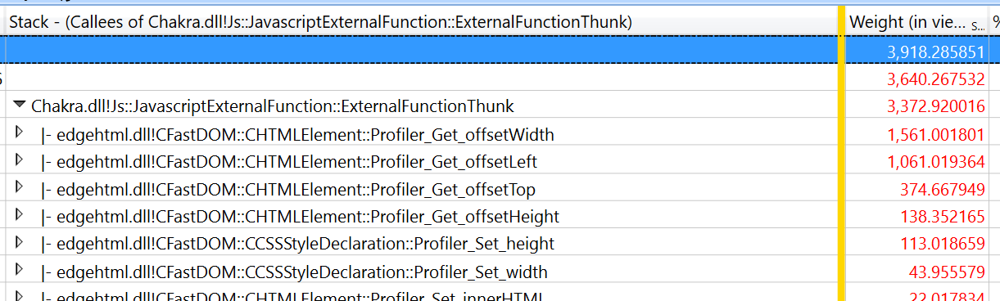

---
description: Learn how to analyze your web scenario performance data using the Windows Performance Analyzer.
title: Performance analysis - Analyzing a trace
author: erikadoyle
ms.author: edoyle
ms.date: 02/08/2017
ms.topic: article
ms.prod: microsoft-edge
keywords: edge, web development, html, css, javascript, developer
---

# Analyzing a trace

Here's how to analyze your web scenario performance data using the *Windows Performance Analyzer (WPA)*.

## 1. Open Windows Performance Analyzer (WPA)
Launch Windows Performance Analyzer and open the *.etl* file to be analyzed (**File** > **Open...**).

## 2. Load symbols and apply the *HTML analysis* profile
**WARNING:** Loading symbols for the first time will require a large download and will take a significant amount of time on a typical internet connection.

Load your symbols by selecting **Trace** > **Load Symbols** from the menu. The symbols will be cached to disk and future traces will load symbols much faster.

You can load symbols significantly faster by restricting the loading to Microsoft Edge and the web apps host. Select **Trace** > **Configure Symbols** and restrict the **Load Settings** to only *MicrosoftEdgeCP.exe* and *WWAHost.exe*.



 After symbols begin loading, apply the *Html Analysis Profile* (**Profiles** > **Apply...** > **Browse Catalog...** > **HtmlResponsivenessAnalysis.wpaProfile**)

  The profile will load several graphs and tables to for your analysis. For nearly all web site investigations, we recommend starting with this profile.



## 3. Zoom to remove trace rundown
You can focus in on your analysis by removing the empty trailing *Trace Rundown* sections of your graphs. From any of the graphs currently showing:
 - Left-click at the start of the graph data you wish to investigate
 - Hold, drag and release to select the desired region
 - Right-click and select **Zoom**

 The zoom will apply to all graphs and charts on the active tab.



#### The Html Responsiveness Analysis Profile
The *Html Responsiveness* analysis profile provides four tabs:

**Big Picture** - This is useful for confirming that there are no unexpected sources of CPU activity and the browser is indeed using all available resources. Check your CPU usage and verify that no processes contribute significantly to CPU usage other than the browser.

**Frame Analysis** - This section is used for basic analysis. The *CPU Usage (Attributed)* graph enables a quick glance for understanding of the subsystems responsible for CPU usage. Breaking down the samples in the *CPU Usage (Sampled)* table on the *HTML UI Thread* is helpful for identifying critical performance bottlenecks.

**Trace Markers** - This section shows all tracing markers coming from the browser (Microsoft Edge), including *msWriteProfilerMark*, which provides precise points for measuring code. To see *msWriteProfilerMark* tracing, scroll down to the  *Generic Events* graph and select **HTML msWriteProfilerMark** from the drop-down menu.

**Thread Delay Analysis** - This tab is often used by Microsoft Edge developers to investigate when one thread is blocked and waiting on another. On rare occasions it might also be useful to web developers.

## 4. Investigate what's taking up CPU cycles
 The **CPU Usage (Sampled)** table in the *Frame Analysis* tab is where most of your analysis will likely happen. You can expand the various processes to identify the most compute intensive JavaScript and browser code. Often a single bit of JavaScript is responsible for a performance issue, and taking the time to optimize it can make a significant difference.

### 5. Drill into any slow-running JavaScript code
Bottom up DOM call analysis can be useful for identifying the JavaScript responsible for taking up the majority of time during the scenario. This is especially helpful when many top level calls are re-using the same JavaScript libraries.

Start by looking at *CPU Usage (Sampled) Breakdown by Process, Thread, Activity, Stack*. Click on any cell in **Stack** column. Press *Ctrl+F* and search for *ExternalFunctionThunk*. **NOTE:** This only works if you have successfully loaded symbols.



Investigate any lines with *ExternalFunctionThunk*. This is the interface from the Chakra JavaScript engine to the Microsoft Edge engine. It shows where code bridges from the browser to JavaScript execution. Right-click on the line and select **View Callees** > **By Module** to see a weighted list of longest running browser engine functions.



To identify all the JavaScript calling a specific API, right-click on it and select **View Callers** > **By Function** and expand the tree to view and compare the relative weights.
