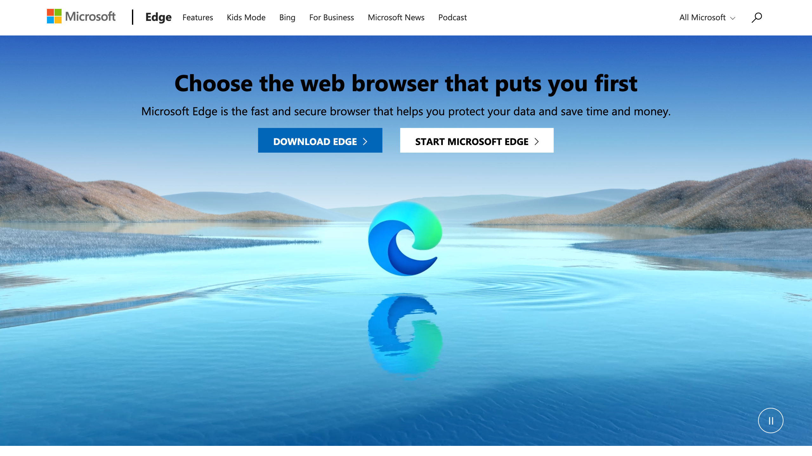

# Use Playwright to automate and test in Microsoft Edge

The Playwright library provides cross-browser automation through a single API.

[Playwright](https://playwright.dev/docs/intro) is a [Node.js](https://nodejs.org) library to automate [Chromium](https://www.chromium.org/Home), [Firefox](https://www.mozilla.org/firefox), and [WebKit](https://webkit.org) with a single API.  Playwright is built to enable cross-browser web automation that is evergreen, capable, reliable, and fast.  Because [Microsoft Edge is built on the open-source Chromium web platform](https://blogs.windows.com/windowsexperience/2018/12/06/microsoft-edge-making-the-web-better-through-more-open-source-collaboration), Playwright is also able to automate Microsoft Edge.

Playwright launches [headless browsers](https://wikipedia.org/wiki/Headless_browser) by default.  Headless browsers don't display a UI, so instead you must use the command line.  You can also configure Playwright to run full (non-headless) Microsoft Edge as well.


<!-- ====================================================================== -->
## Install Playwright and browsers

> [!NOTE]
> [Playwright](https://playwright.dev/docs/intro) requires Node.js version 12 or above. Run `node -v` from the command line to make sure you have a compatible version of Node.js.  The browser binaries for Chromium, Firefox and WebKit work across Windows, macOS, and Linux. For more information, see [Playwright System Requirements](https://playwright.dev/docs/library#system-requirements).

First, install [Playwright Test](https://playwright.dev/docs/intro) to test your website or app:

```console
npm i -D @playwright/test
```

To install browsers, run the following command, which downloads [Chromium](https://www.chromium.org/Home), [Firefox](https://www.mozilla.org/firefox), and [WebKit](https://webkit.org):

```console
npx playwright install 
```


<!-- ====================================================================== -->
## Run a basic test

The approach used by Playwright will be familiar to users of other browser-testing frameworks, such as [WebDriver](../webdriver-chromium/index.md) or [Puppeteer](../puppeteer/index.md).  You can create an instance of the browser, open a page in the browser, and then manipulate the page by using the [Playwright API](https://playwright.dev/docs/api/class-playwright).

[Playwright Test](https://playwright.dev/docs/intro), which is Playwright's test-runner, launches a browser and context for you. An isolated page is then passed into every test, as shown in the following, basic test:

```typescript
// tests/foo.spec.ts
import { test, expect } from '@playwright/test';

test('basic test', async ({ page }) => {
  await page.goto('https://playwright.dev/');
  const title = page.locator('.navbar__inner .navbar__title');
  await expect(title).toHaveText('Playwright');
});
```

Now run your tests, as follows:

```console
npx playwright test
```

For more information about running tests, see [Playwright > Getting started](https://playwright.dev/docs/intro).


<!-- ====================================================================== -->
## Run tests in Microsoft Edge

To run your tests in Microsoft Edge, you need to create a config file for Playwright Test, such as `playwright.config.ts`.  Inside the config file, create one project, using Microsoft Edge.

```typescript
// playwright.config.ts
import { PlaywrightTestConfig } from '@playwright/test';

const config: PlaywrightTestConfig = {
  projects: [
    {
      name: 'Microsoft Edge',
      use: {
        // Supported Microsoft Edge channels are: msedge, msedge-beta, msedge-dev, msedge-canary
        channel: 'msedge',
      },
    },
  ],
};

export default config
```

If Microsoft Edge isn't already installed on your system, install it through Playwright, as follows:

```console
npx playwright install msedge
```

When using the above `playwright.config.ts` file, Playwright Test uses Microsoft Edge to run your tests, as follows:

```console
npx playwright test --headed
```


<!-- ====================================================================== -->
## Use Playwright as a library

You can also consume Playwright as a library, as shown in the following code.  This approach allows you to use a different test-runner.

```javascript
// example.js
const playwright = require('playwright');

(async () => {
  const browser = await playwright.chromium.launch({
    channel: 'msedge',
  });
  const context = await browser.newContext();
  const page = await context.newPage();
  await page.goto('https://www.microsoft.com/edge');
  await page.screenshot({ path: 'example.png' });

  await browser.close();
})();
```



`example.js` is a simple demonstration of the automation and testing scenarios that are enabled by Playwright.  To take screenshots in other web browsers, change the above code from `await playwright.chromium.launch` to the following code:

Firefox: 

```javascript
  const browser = await playwright.firefox.launch({
```

WebKit: 

```javascript
  const browser = await playwright.webkit.launch({
```

For more information about Playwright and Playwright Test, go to the [Playwright website](https://playwright.dev/docs/intro).  Check out the [Playwright repo](https://github.com/microsoft/playwright) on GitHub.  To share your feedback on automating and testing your website or app with Playwright, [file an issue](https://github.com/microsoft/playwright/issues/new/choose).


<!-- ====================================================================== -->
## See also

* [Use Playwright to automate and test in WebView2](../webview2/how-to/playwright.md)
