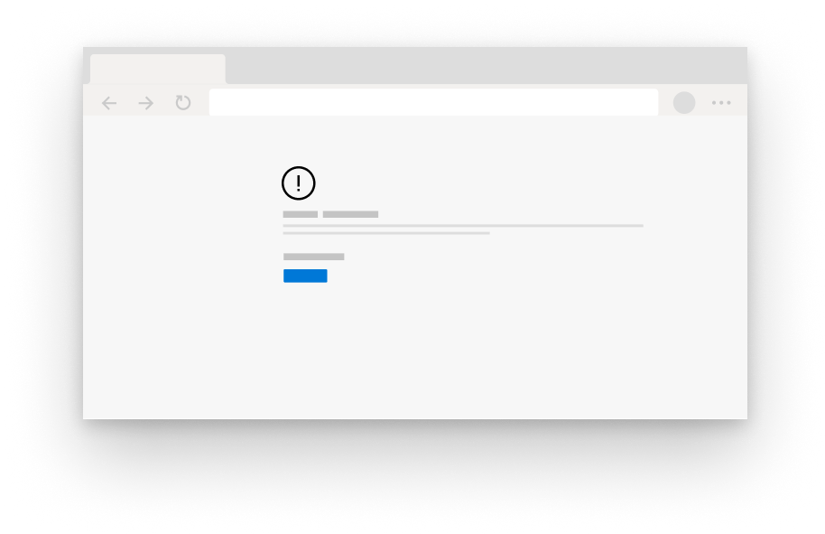
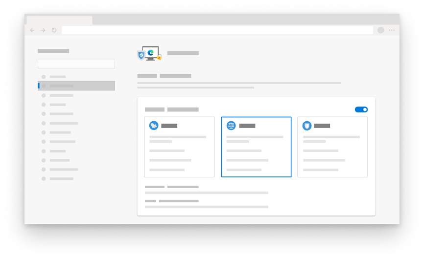

# Microsoft Edge Privacy Whitepaper  

Our browser privacy promise is to provide you with the protection, transparency, control and respect you deserve.  To uphold commitments to give you transparency into Microsoft products, the Microsoft Edge team provided a privacy whitepaper that explains how Microsoft Edge features and services work and how each may affect your privacy.  The goal of the Microsoft Edge team is to give you a full understanding into how your data is used, how to control the different features, and how to manage your collected data, so you have the info you need to make the right privacy decisions for you.  

In certain sections of the paper, the Microsoft Team provide steps to go to Microsoft Edge settings and other pages.  For consistency, the Microsoft edge team used a shortened format throughout the whitepaper: You should see URLs that begin with `edge://` such as `edge://favorites` or `edge://settings/privacy`.  To go to the pages, type the bolded text directly into the Microsoft Edge address bar.  These pages are only be viewable in Microsoft Edge.  

The whitepaper focuses on the desktop version of Microsoft Edge, and parts of the paper may include features or experiences that are not available for all users.  In addition, the whitepaper discusses features and services that exist in the product today, but may be subject to change in the future.  Microsoft practices data collection minimization, which means your data is kept for the minimum amount of time, but retention times may vary depending on the feature or service being used and may change over time.  

## Address bar and suggestions  

The address bar allows you to enter website URLs and search the web.  By default, the address bar provides search and site suggestions using the characters you type.  You should see suggestions from your favorites, browsing history, previous searches, and default search provider.  

  

To make browsing and searching faster, as you type in the address bar, the typed characters are sent to your default search provider for the search provider to send back suggested search queries.  The address bar categorizes your entry as a URL, search, or unknown.  This information, along with which suggestion you select, position of selection, and other address bar data is sent to your default search provider.  If your search provider is Bing, a resettable identifier unique to your browser is sent with this data to understand the search query and query session.  Other autosuggest service identifiers are sent to your default search engine to complete the search suggestions.  Your IP address and cookies are sent to your default search provider to increase the relevance of the search results.  A signal is sent to your default search provider when you select the address bar, to signal to the provider to get ready to provide suggestions.  The typed characters and search queries are not sent to Microsoft unless your search provider is Bing.  This data is only sent to your default search provider if you have the **Show me search and site suggestions using my typed characters** setting turned on.  Turning off this feature stops your typed characters from being sent to the default search provider.  Your search queries are still sent to your default search provider to provide search results.  If Microsoft Edge detects that your typing in the address bar may contain sensitive information, such as authentication credentials, local file names, or URL data that is normally encrypted, it does not send the typed text.  If you have **Improve Microsoft products by sending crash reports and data about how you use the browser** setting turned on, Microsoft Edge collects diagnostic data about the address bar, such as how many queries were offered, regardless of your search provider.  

Keystrokes and the websites you visit are stored locally on the device per profile.  You may delete this data in `edge://settings/clearBrowserData`, selecting the check box for **Browsing history**, and selecting **Clear now**.  If Bing is your default search provider and you are signed in-to Bing, you may delete your searches through the [Microsoft privacy dashboard](https://account.microsoft.com/account/privacy?ref=privacy-edge-browse&ru=https%3A%2F%2Faccount.microsoft.com%2Fprivacy%2Fbrowse%3Fref%3Dprivacy-edge-browse&destrt=privacy-dashboard).  You may clear your browsing history in `edge://history` to delete those websites from appearing as suggestions in the address bar.  On Windows 10, you may clear the data Microsoft collects from the address bar and search suggestions features by going to **Start** > **Settings** > **Privacy** > **Diagnostics \& feedback**, and selecting **Delete** under **Delete diagnostic data**.  All other data is deleted after 36 months.  

If you are signed into Microsoft Edge with a Microsoft work or school account, and Microsoft Search is available, an anonymized token representing your account is sent with the query to provide account-specific functionality such as results specific to your company.  

All data is transmitted securely over HTTPS.  If [Bing](https://bing.com) is your default search provider, the searches and types characters are saved for up to 6 months.  

If you search for a single word in the address box, Microsoft Edge may send this word to your DNS server to see whether it corresponds to a host on your network, and may try to connect to the corresponding host.  This gives you the option to navigate to that host instead of searching.  For example, if your router goes by the hostname `router` and you type `router` in the address bar, you are given the option to navigate to `https://router/`, as well as to search for the word `router` with your default search provider.  This feature is not controlled by the **Show me search and site suggestions using my typed characters** setting since it does not involve sending data to your default search engine.  

You may turn off the **Show me search and site suggestions using my typed characters** setting and change your default search engine in `edge://settings/search`.  While browsing InPrivate or in Guest mode, autosuggestions are turned off.  InPrivate shows suggestions from your local browsing such as browsing history or past searches, but no typed characters are sent to your default search engine.  Guest mode does not display any suggestions or send typed characters to your default search engine.  

Data collected by other search providers follow the privacy policy of their company.  

## Autofill  

Autofill in Microsoft Edge helps you be more productive by letting you save passwords, payment info, addresses, and other form entry data.  When you visit a site and start to fill out a form, Microsoft Edge uses form fill info to match your saved autofill data to the form.  Microsoft Edge offers form entry data you previously saved when you encounter similar forms.  Passwords and credit card info are only saved with your explicit permission for each password and card.  

Addresses and other form entries are saved by default.  However, you may turn off saving and autofill of address and other form data in `edge://settings/addresses`.  

Prevent Microsoft Edge from prompting you to save passwords by turning off the **Offer to save passwords** setting in `edge://settings/passwords`.  If you do not want Microsoft Edge to autofill existing saved passwords, you may delete your saved passwords in `edge://settings/passwords`  To delete all autofill data go to the **Clear browsing data** setting in Microsoft Edge Privacy and services settings.  Select **Autofill form data**, the desired time range and then **Clear now**.  

If you have turned on sync for your profile, your autofill data is synced across all versions of Microsoft Edge where you are signed into the same credentials.  When sync is turned on, all autofill data is stored on encrypted Microsoft servers.  The autofill data stored on Microsoft servers is only used for sync purposes.  You may turn off syncing of your autofill data in `edge://settings/profiles/sync`.  If you turned on sync for autofill, deleting autofill data from a device where you are signed into Microsoft Edge removes the autofill data from other devices where you are signed-in.  

When you visit a webpage and submit a form, Microsoft Edge sends info about the form such as a hash of the hostname and autofill entry types \(for example, box 1 is looking for an email address, box 2 is looking for a password, and so on\) to the Microsoft form fill service.  No user-entered info or user identifiers are sent to the service.  This info helps Microsoft Edge correctly identify forms across different webpages.  This data is used to help match your saved autofill data to the form.  

When you use guest mode, autofill is not available and new autofill entries are not added.  When you browse InPrivate, Microsoft Edge offers autofill entries, but new autofill entries are not added.  

## Cast  

Cast in Microsoft Edge allows you to display your media to another screen using Google Cast.  You may access this feature from **Settings and more (...)** > **More tools** > **Cast media to device**.  Cast does not use any Microsoft or Google services. 

## Collections  

You may collect sites, text and images on the web, and organize the content with Collections in Microsoft Edge.  All collections data is stored locally on the device and organized per Microsoft Edge profile.  If you have sync turned on for Collections, your collections created, including any notes or comments, are available across all signed-in and syncing versions of Microsoft Edge.  

Every 24 hours Microsoft Edge downloads a list of supported sites for which special entity extraction templates exists.  The templates are specific to each website.  When you create a new item in your collection, Microsoft Edge verifies that the site from which you are creating the new collection item is on the list of supported sites.  If the site is on the list, Microsoft Edge pings the entity extraction service for the specific sites template.  No user identifiers are associated with this request to the service.  This template attempts to identify the name, price, ratings, primary image, and other data about the item being collected.  If the site from which you are creating a new collection item is not on the supported list site, Microsoft Edge does not download a template.  The templates enable all collection items to be created locally on the device.  No data about the collection items are sent to the service to create the collection.  

The templates stored on the device may be deleted by clearing the cache data under the **Clear browsing data** setting in `edge://settings/privacy`.

If you've turned on **Show suggestions from Pinterest in Collections**, Collections will perform a Microsoft Bing search using the title of your collection to find relevant Pinterest Topic pages.  Microsoft Edge will not send data about your collections to Pinterest.  You can remove these suggestions and stop searches for Pinterest Topic pages by going to `edge://settings/privacy` and turning off **Show suggestions from Pinterest in Collections**.  

Collections is not available when using InPrivate browsing or Guest mode.  

## Crashes  

If optional diagnostic data including crash reports are turned on, Microsoft collects diagnostic data when Microsoft Edge crashes or encounters other reliability problems.  This diagnostic data is used to diagnose and fix reliability problems of Microsoft Edge and other Microsoft products and services.  

  

The diagnostic data collected is in the form of crash dumps, which contains device and software state captured at the time Microsoft Edge encountered the reliability problem.  The crash dump contains information about what was happening at the time of the reliability problem.  Information such as the website you were visiting at the time of the crash or your CPU usage may be included in this diagnostic data.  The crash diagnostic data is stored locally on the device and sent to Microsoft via an encrypted link when crash reporting is turned on.  Each crash dump contains an identifier unique to your device, a resettable identifier unique to your browser and extra diagnostic data \(such as the URL, CPU usage, and network usage\) to help identify the problem.  This extra diagnostic data is attached to the crash dump to help diagnose the reliability problem, such as understanding how many devices are encountering the problem and the severity.  

Crash dumps are sent to Microsoft and stored on secure Microsoft servers for up to 30 days and then deleted.  Request to delete this diagnostic data on Windows 10 devices by going to **Start** > **Settings** > **Privacy** > **Diagnostics \& feedback** and selecting **Delete** under the **Delete diagnostic data** setting.  Aggregated crash information such as a count of types of crashes occurring are stored for reporting and product improvement purposes.  

Crash diagnostic data stored locally on the device may be cleared from the file system in `edge://crashes`.  

To turn off crash diagnostic data collection on Windows 10, go to **Diagnostics \& feedback** in Windows Diagnostics \& feedback settings.  For versions of Microsoft Edge on all other platforms go to `edge://settings/privacy` and turn off the **Improve Microsoft products by sending crash reports and data about how you use the browser** setting.  This diagnostic data collection may also be turned off for enterprises through [group policies managed by your organization](/deployedge/microsoft-edge-privacy-policy).  

## Diagnostic data about how you use the browser  

Microsoft uses diagnostic data to improve our products and services, keep our products secure and up to date, and help us better understand how our products are performing. Whenever the Microsoft Edge team collect data, the decision is verified as the right choice for you.  Microsoft believes in and practices information collection minimization.  The Microsoft Edge team strives to gather only the info that is needed and is stored only for as long as it is needed to improve Microsoft products and services.  

As you use features and services in Microsoft Edge and other applications that use the Microsoft Edge web platform, diagnostic data about how you use those features is sent to Microsoft.  This diagnostic data includes information like your installation of Microsoft Edge, feature usage, performance, and memory usage.  For example, if you favorite a website, the Microsoft Edge team receives info that the favorite button was clicked and a favorite was successfully added, but not which site was set as a favorite.  This diagnostic data also includes performance information, such as how many milliseconds it took to open a new tab.  The features and services mentioned in this whitepaper collect diagnostic data.  

  

In addition, Microsoft Edge collects a set of required diagnostic data necessary to keep the product up to date, secure and performing properly.  This includes device connectivity and configuration information about the current data collection consent setting, app version, and installation state.  This is only able to be turned off with group policies managed by your organization.  [Learn more about diagnostic data in your organization](/windows/privacy/configure-windows-diagnostic-data-in-your-organization).  

Microsoft Edge generates this diagnostic data, stores it locally, and periodically sends it to Microsoft.  The diagnostic data is sent via HTTPS and stored on Microsoft servers.  This diagnostic data is associated with an identifier unique to your device and a resettable identifier unique to your browser.  The identifiers do not contain your personal information.  To reset the identifier unique to your browser on Windows 10 devices, go to **Start** > **Settings** > **Privacy** > **Diagnostics \& feedback** and select **Delete** under the **Delete diagnostic data** setting or change your setting under **Diagnostic data** from **Full** to **Basic**.  On other platforms, the resettable identifier unique to your browser is generated again whenever you change the **Improve Microsoft products by sending data about how you use the browser** setting in `edge://settings/privacy` from **on** to **off**.  This reset functionality may be different for devices managed with group policies set by your organization.  

If you are using Windows 10 version 1803 \(April 2018 Update\) or above, you may view product data shared with Microsoft in the Diagnostic Data Viewer by going to **Start** > **Settings** > **Privacy** > **Diagnostics \& feedback** and selecting **Open Diagnostic Data Viewer** under the **View diagnostic data** setting.  

For other platforms or versions of Windows 10 lower than version 1803, go to `edge://data-viewer` to view this diagnostic data.  Data is sent to Microsoft periodically, and `edge://data-viewer` only shows data that has been sent to Microsoft since the last time the viewer was opened.  You might need to refresh the viewer to see what data has been sent to Microsoft for your given session.  The data used to populate `edge://data-viewer` is stored locally on the device.  To clear this data in the viewer, simply close the `edge://data-viewer` tab.  

The diagnostic data is stored on Microsoft servers for up to 18 months.  On Windows 10 you may delete the diagnostic data by going to **Start** > **Settings** > **Privacy** > **Diagnostics \& feedback** and selecting **Delete** under the **Delete diagnostic data** setting.  The Delete diagnostic data functionality is only supported on Windows 10, April 2018 update and newer.  For more information see [Diagnostics, feedback, and privacy in Windows 10](https://support.microsoft.com/help/4468236/diagnostics-feedback-and-privacy-in-windows-10-microsoft-privacy).  

For Microsoft Edge on Windows 10, this setting is determined by your Windows diagnostic data setting.  This is reflected in your Microsoft Edge Privacy and services settings.  Change this Windows settings by going to **Start** > **Settings** > **Privacy** > **Diagnostics \& feedback**.  On all other channels and platforms, you may control this diagnostic data collection in `edge://settings/privacy` and turning on or off the **Improve Microsoft products by sending crash reports and data about how you use the browser** setting.  This setting is the same for all profiles associated with the installation of Microsoft Edge on your device.  This setting is not synced across devices.  The setting applies to InPrivate browsing and Guest mode.  If your device is managed with group policies set by your organization, this is reflected in `edge://settings/privacy`.  

## Digital Rights Management and Media Licenses  

When a website offers media content that is protected by Digital Rights Management \(DRM\), Microsoft Edge uses a secure playback pipeline to ensure the content is not copied or accessed improperly.  As part of this feature, Microsoft Edge may store DRM-related data on your device, including a unique identifier and media licenses, and may transmit that unique identifier to a media licensing server specified by the content provider.  When you use the website, Microsoft Edge retrieves the DRM info to make sure you have permission to use the content.  This data helps to validate access to the protected content and ensure a seamless media experience.  

Microsoft Edge supports DRM via the Encrypted Media Extensions API \(EME API\) for HTML5 sites.  The EME API allows websites to communicate with a DRM provider called a Content Decryption Module \(CDM\).  Different DRM systems, such as Widevine by Google or PlayReady by Microsoft, may be supported by their own CDM implementation.  Content providers may choose to support one or more potential DRM systems and may utilize the functionality of the EME API to decide which DRM system to use for a specific client.  [Learn more about EME privacy](https://w3.org/TR/encrypted-media/#privacy).  

Microsoft Edge supports PlayReady DRM only on Windows 10.  PlayReady is an DRM implementation to deliver media experiences such as 4K video and Dolby Atmos audio.  Microsoft Edge uses the Windows Platform Media Foundation APIs to support PlayReady.  To validate access to protected content, Microsoft Edge utilizes the Windows 10 operating system which uses a unique identifier and communicates that with the PlayReady service.  All EME, CDM, and browser data for PlayReady that persists on the device is stored and maintained on Microsoft Edge.  [Learn more about PlayReady](/playready/overview/simple-end-to-end-system).  

Microsoft Edge supports Widevine by Google DRM and this option is on by default.  Microsoft Edge periodically fetches updates for Widevine from Google servers.  The use of Widevine may include communications to Google.  Users may opt-out of using Widevine in Microsoft Edge by disabling the Widevine DRM flag in `edge://flags/#edge-widevine-drm`.  Widevine has the capability to create a unique device identifier and transmit it to Google.  For more specific information on Widevine and privacy, see the Google privacy policy.  

Microsoft Edge supports the Flash Access DRM by Adobe, which is used by some sites instead of HTML5.  You must give permission to allow Adobe Flash when a site requests it.  When a site uses the Flash Access DRM by Adobe, Microsoft Edge gives Adobe access to a unique device identifier.  You may clear and reset any locally stored instances of this identifier in `edge://settings/privacy`.  Under **Clear browsing data**, select **Choose what to clear**, select the check box for **Cookies and other site data**, and select **Clear now** to remove any stored identifiers.  Stop Adobe Flash DRM from ever being used in `edge://settings/content/flash`.  

When you request access to encrypted HTML5 media like an online movie, Microsoft Edge creates a license request to decrypt the media.  The CDM being used creates the license request that contains a request ID.  This request is sent to the license server.  No part of the license request contains any personally identifiable information, and the license request is not stored on the device.  

When returning the media license, a media identifier is created which is unique to the user and the site.  This ID is not shared between sites and is different for each site.  A session ID, used to identify a playback session, is sent with the media identifier to decrypt the media.  The media identifier is stored locally on the device and may be stored with the content provider.  

All DRM and content protections may be turned off in `edge://settings/content/protectedContent`.  

- Turning off the **Allow sites to play protected content** setting disables playback for CDM-based DRM systems such as PlayReady and Widevine, but not for non-CDM-based systems like Flash Access DRM.  Flash is managed by a separate site permission in `edge://settings/content/flash`.  Turning off this setting causes media functionality to stop working properly.  
- Turning off the **Allow identifiers for protected content** setting prevents the creation of identifiers for Flash Access DRM and prevents Widevine from periodically fetching updates from Google.  This may cause some media functionality on some sites to stop working properly.  

## Do Not Track  

When you turn on the **Send "Do Not Track" requests** setting in `edge://settings/privacy`, Microsoft Edge sends a DNT:1 HTTP header with your outgoing HTTP, HTTPS and SPDY browsing traffic requests to websites you visit to request that each does not use trackers.  However, turning on the **Send "Do Not Track" requests** setting does not guarantee that websites are not able to track you.  Some sites might honor this request by showing you ads not based on any previous browsing.  Microsoft Edge does not have control if this request is honored or not.  To help prevent websites from tracking you, change your **Tracking prevention** setting in `edge://settings/privacy` to **Balanced** or **Strict**.  

When you use guest mode, Microsoft Edge does not send "Do Not Track" requests.  When you use InPrivate browsing, Microsoft Edge only sends "Do Not Track" requests if the **Send "Do Not Track" requests** setting is turned on for the profile you are using.  

## Downloads  

Microsoft Edge lets you download files safely and securely.  You may choose where files are downloaded on your device in `edge://settings/downloads`.  If SmartScreen is enabled, info about your file, such as the file name and URL, are sent to SmartScreen to check the reputation of the file.  This helps you avoid accidentally downloading known malware that is known to hurt your device.  You may turn on or off SmartScreen in `edge://settings/privacy`.  [Learn more about SmartScreen](#smartscreen).  

A history of your previous downloads may be viewed in `edge://downloads`.  Clearing your browsing data in `edge://settings/clearBrowserData` may be used to delete your browsing data, including your download history.  Deleting your download history from Microsoft Edge does not remove the files from your device.  Deleting downloaded files from your device does not remove the files from your download history.  When you use InPrivate browsing or Guest mode, the download history from that session is cleared when you close the InPrivate or Guest windows, but the files are saved on the device.  

## Extensions and Microsoft Edge Add-ons  

You can install extensions in Microsoft Edge that add functionality to the browser.  When you install an extension from the Microsoft Edge Add-ons website or another extension store, Microsoft collects information about the extensions to help developers and Microsoft understand how they’re used.  Microsoft Edge will collect aggregated data including the number of times an extension has been downloaded and information about how it’s performing, such as crash data.  Microsoft shares this aggregated data with the developers of the extensions.  Comments and reviews from users are public on the Add-ons website and are also shared with the developers. If you’re signed in to Microsoft Edge, installed extensions from Microsoft Edge Add-ons website will be associated with your account and provide extension recommendations.  This data is used in aggregate to understand the popularity of extensions.   

If you’ve turned on sync for extensions in your profile settings, your extensions and preferences for those extensions will be synced across all your signed-in syncing versions of Microsoft Edge.   

Installing extensions is optional, and all extensions can be uninstalled at any time by going to `edge://extensions` in Microsoft Edge.  When an extension is installed, it will specify what user data it needs to access, and Microsoft Edge will ask for your permission before installing the extension.  Always make sure an extension is credible and secure before installing it and review the developer’s privacy policy for that extension.  

Extensions are updated using the Microsoft Edge update service.  Microsoft Edge sends a list of the installed extensions to the update service to check if an update is available.  If you install an extension from the Chrome Web Store, requests will be sent to the Chrome Web Store at regular intervals to check for extension updates.  The extension identifier, extension version, and info about Microsoft Edge are included in the request looking for updates.  To stop requests to the Chrome Web Store, uninstall extensions under **From other sources** in ‘edge://extensions’.   

When importing extensions from other browsers like Google Chrome, if an extension is available in the Microsoft Edge Add-ons website, we will automatically install that extension from the Microsoft Edge Add-ons website and turn it on if you previously had the extension on.  If the extension is not available from the Microsoft Edge Add-ons website, we will locally copy and install your extension from Google Chrome without turning it on or connecting to the Chrome Web Store.  We will ask for your permission to turn on that extension and allow extensions from other stores.  If you’ve granted permission, we will allow extensions to be installed from other stores and will update your extensions via the Chrome Web Store.  You can turn on or off **Allow extensions from other stores** at `edge://extensions`.

## Family safety  

Microsoft offers a number of tools to help families stay connected and keep kids safer on Windows 10, Xbox, and Android devices running Microsoft Launcher.  

Within a family group, there are family settings that should be enabled for children while using Microsoft Edge.  The family group organizer must enable these settings for users in the group.  The three main features offered to a family group are web filtering, activity reporting, and safe search.  

Web filtering protects children in the family group from going to mature websites or websites specifically blocked by the family organizer.  

Activity reporting records info about the websites children visit, as well as searches, screen time, devices used, and attempts to visit blocked sites.  The family group organizer may see this info at [family.microsoft.com](https://family.microsoft.com).  This data is collected, encrypted in transit, and sent to Microsoft and stored on secure Microsoft storage servers.  This data is collected with the child's Microsoft account so it is able to be managed.  Activity reports are stored on [family.microsoft.com](https://family.microsoft.com) for up to 30 days and then deleted after.  

Safe search adds a safe keyword to the header request to search engines.  Bing reads this keyword and filters search results returned to the child.  Other search engines may return filtered results due to this keyword as well.  All of the child's searches are collected and made available for the family organizer to view in activity reports or at [family.microsoft.com](https://family.microsoft.com).  This data is collected with the child's Microsoft account so it may be properly managed.  

The child's browsing data is stored on Microsoft-secured servers and made available to parents for up to 30 days, then immediately deleted.  This data may be deleted at any time from the [Microsoft privacy dashboard](https://account.microsoft.com/account/privacy).  Browsing data stored locally on a device must be Clear browsing data from Microsoft Edge in `edge://settings/clearBrowserData`.  

The child must be signed into Windows 10 with their Microsoft account, and the activity reporting setting must be turned on by the family organizer, for this data to be collected and shared with the family group organizer.  The child does not need to be signed into Microsoft Edge for this data to be collected.  If family safety features are not available on your version of Windows 10, you may update to the most recent version of Windows to get these features.  

Guest mode and InPrivate browsing are disabled if web filtering or activity reporting is turned on.  

The family group organizer may stop this data collection from the family safety portal.  [Learn more about Microsoft family safety features](https://support.microsoft.com/help/12413/microsoft-account-what-is-family-group).  

## Feedback  

The Microsoft Edge team is always listening to customers and value your feedback.  To provide feedback in Microsoft Edge, select the **Settings and more** > **Help and feedback** > **Send feedback**.  For Progressive Web Apps \(PWA\), select the **Settings and more ...** > **Send feedback to Microsoft**.  You must provide details about the feedback, but all other information is optional.  If an email is detected from your Microsoft Edge profile it is pre-populated along with the current URL of the site you are on and relevant diagnostic data.  The diagnostic data may include data about the features you turned on and your usage of the browser.  A screenshot, file from your device, and recording of your browser may also be optionally included.  The optional additional recording you provide may include personally identifiable information.  This data is only used for diagnostic and product improvement purposes.  

User feedback is securely sent to Microsoft via HTTPS and stored on secure Microsoft servers.  If you include your email address and  the **Improve Microsoft products by sending crash reports and data about how you use the browser** setting is turned on in your Microsoft Edge privacy settings, an identifier unique to your browser installation on your device is associated with your feedback.  All diagnostic data including diagnostic logs, recordings, and attachments are stored for up to 30 days.  The remaining feedback data including an optional screenshot is stored for up to 15 months.  Make a [request](https://www.microsoft.com/concern/privacy) to delete your feedback if you provided an email with your feedback item.  

## Geolocation  

Microsoft Edge supports the [Geolocation API](https://w3.org/TR/geolocation-api), which allows websites to access your location information with your permission.  Websites may ask for your location, for example, when trying to find the closet coffee shop to you.  Microsoft Edge always asks for your permission before granting websites access to your location.  To manage this permission or to always block sites from accessing your location, go to `edge://settings/content/location`.  

On the right side of the address bar, Microsoft Edge indicates when your location is or is not being shared.  

  

If you allow your location to be shared with a site, Microsoft Edge sends local network information such as your IP address and nearby Wi-Fi access points to the Microsoft location service.  The Microsoft service uses this info to estimate your geolocation coordinates.  This geolocation estimate is then shared with the site with which you agreed to share your location.  On Windows 10, Microsoft Edge only uses the Microsoft location service if you turned on your [Windows location setting](https://support.microsoft.com/help/4468240/windows-10-location-service-and-privacy).  

A new randomly generated ID is used when making requests to the Microsoft location service.  Microsoft Edge location service does not store your geolocation coordinates for any period of time.  

InPrivate browsing uses the location permission setting of the profile from which the InPrivate session was launched.  Guest mode always asks you for permission before granting the site your location.  

## Import browser data  

Microsoft Edge offers an interactive and seamless experience when you launch the browser for the first time.  As part of this experience, you have the option to import your browser data to Microsoft Edge from another browser.  During the import experience you may either keep your imported data or delete it and start fresh.  This data includes your favorites, browsing history, autofill data, extensions, settings, and other browsing data.  Your browsing data from older versions of Microsoft Edge is automatically included when you update to the new Microsoft Edge.  With your confirmation, Microsoft Edge imports browser data from other browsers such as Google Chrome, Mozilla Firefox and Internet Explorer and is determined based on your most used browser defined by your OS.  Importing your data is all completed locally on your device, stored locally and is not sent to Microsoft unless you agree to syncing your browsing data.  

  

When importing your extensions from a different browser such as Google Chrome, Microsoft Edge imports a local copy and asks for permission before it is turned on.  The permissions for some of the extensions may have changed.  To review the extension permissions, go to `edge://extensions`.  

You may choose to import data from another browser at any time in `edge://settings/importData`.  

## Install and update  

You may download and install Microsoft Edge on platforms such as Windows and macOS.  Microsoft Edge uses the updater service to keep your version of Microsoft Edge up to date and secure.  

When you download and install Microsoft Edge, information about your device, such as your release channel, basic hardware information, update identifiers, an identifier unique to your device and a resettable identifier unique to your browser are sent to Microsoft during the installation process.  The IP address of the device is sent to the updater service, but the last decimal is scrubbed for added privacy protections.  During each browsing session, a newly randomly generated token is created to install updated versions of Microsoft Edge.  The token is not associated with any personal information and is only used for the installation and update process and to improve the updater service.  

Microsoft Edge pings the Microsoft Edge updater service about the stages of installation and update.  If an installation or update fails and crash reporting is turned on, a log is created and sent to Microsoft.  [Learn about sending crash reports to Microsoft](#crashes).  Microsoft collects info about how you downloaded Microsoft Edge, the success of the installation, and any un-installations to better understand the success of Microsoft Edge downloads.  

Automatic updates are turned on by default for all Microsoft Edge users.  On all platforms, Microsoft Edge checks for updates on startup and periodically while running.  On MacOS devices, Microsoft AutoUpdate checks for updates for Microsoft products periodically as well.  Additional controls and configurations are available for organizations.  [Learn more about additional controls and configurations](/deployedge/microsoft-edge-update-policies#update).  

## Internet Explorer mode  

Microsoft Edge offers a simplified experience with the integration of Internet Explorer \(IE\).  Microsoft Edge only supports IE 11, and IE mode and is only available on Windows.  This feature is available for organizations through group policies.  The administrator chooses a list of sites to be opened in IE mode in Microsoft Edge.  

  

Microsoft Edge downloads the list of sites from a location defined by the admin through a policy, and caches the file to determine which sites need to be opened in IE mode.  Depending on your Windows or IE 11 settings, Microsoft Edge collects diagnostic data about the use of IE mode, such as which sites users go to, performance data, reliability data, and feature usage data.  On Windows 10, this diagnostic data is collected according to your Windows Diagnostic data setting.  On Windows 8.1, website info is collected if the user has opted into the Flip Ahead or Suggested Sites feature in IE.  IE mode may not follow the same data collection toggles in the Microsoft Edge Privacy and services settings.  

If your administrator turned on Enterprise Site Discovery, browsing history data is collected to help administrators review the sites that users visit periodically and ensure that any system upgrades continue to support those sites.  [Learn more about Enterprise Site Discovery in IE11](/internet-explorer/ie11-deploy-guide/collect-data-using-enterprise-site-discovery).  

Internet Explorer browsing is stored locally in Microsoft Edge and Internet Explorer.  This data may be cleared from Clear browsing data and Clear browsing data for Internet Explorer in `edge://settings/privacy`.  

## Intrusive ads  

To provide a better browsing experience, Microsoft Edge offers Ads Blocking, which prevents advertisements from loading on sites that show intrusive or misleading ads.  When Ads Blocking is turned on, Microsoft Edge periodically downloads, from Microsoft servers, the most recent list of sites that show intrusive or misleading ads and stores it locally on your device.  No user identifiers are included in the download request.  If you visit a site that is on this list, Microsoft Edge blocks all ads on that site, and you should see the message "Ads blocked".  Allow ads on this site, by managing Ads settings in `edge://settings/content/ads`.  Other than downloading the list of sites with intrusive ads, the Ads Blocking feature does not send additional information to Microsoft or request additional information from Microsoft while you are browsing the web.  

## Jump list  

The jump list in Microsoft Edge lets you easily find your most recently closed sites by right-clicking on the Microsoft Edge icon in the task bar.  The last three closed tabs are stored locally for each profile.  You may delete sites from the jump list by right-clicking on each in Windows 10.  If you do not want your recently closed tabs to be visible in the jump list, you may either [Clear your browsing data](https://support.microsoft.com/help/10607) or change your settings to Clear browsing data when you close the browser.  When using an InPrivate window, Microsoft Edge does not add closed tab information to the jump list.  When using Guest mode, the jump list is not available.  

## Network time  

Microsoft Edge uses a Microsoft network time service to track time from an external source like a time server.  At random intervals or when Microsoft Edge encounters an expired SSL certificate, Microsoft Edge may send requests to Microsoft to obtain the time from a trusted source.  These requests occur more frequently if Microsoft Edge detects the system clock is inaccurate.  This happens if the user changes the time on the operating system and that conflicts with the correct time zone.  The Microsoft network time service is used to get the Coordinated Universal Time \(UTC\).  These requests contain no cookies or user identifiers, and no data is logged.  

## New tab page  

Microsoft Edge provides an engaging and user centric new tab page experience with a search box powered by [Bing.com](https://bing.com), quick link tiles for the sites you visit most frequently, and relevant content from Microsoft News or Office 365.  Customize the appearance of the new tab page by selecting the customize button.  Your new tab page preferences are set for each profile and stored locally on your device, and these preferences are not synced across devices.  

  

### Microsoft News  

To tailor content to your interactions and preferences, the new tab page in Microsoft Edge stores cookies with randomly generated identifiers on the device.  A scrubbed version of your IP address is also used to tailor the content to your general region.  The cookies persist on your device until cleared in `edge://settings/siteData`.  

Prevent ads from being personalized by going to [Ad settings](https://account.microsoft.com/privacy/ad-settings/signedout?ru=https:%2F%2Faccount.microsoft.com%2Fprivacy%2Fad-settings) on the Microsoft privacy dashboard and turning off the **See personalized ads in your browser** setting.  You may also turn off the quick link tiles by selecting the **customize button** > **Custom** and turn off the **Show quick links** setting.  Microsoft Edge uses your local browsing history to personalize the quick link tiles, and you may delete or create new tiles.  This data is only stored locally on the device, per profile.  

The search box on the new tab page performs a Bing search based on the search query you type.  To automatically provide search suggestions and results, Microsoft Edge shares your typed characters, search query, IP address, and search identifiers with Bing.  The search box may be configured with group policies to provide search results from Microsoft Search, returning information from your organization such as documents and intranet content.  To provide an integrated search experience, Microsoft Edge stores cookies locally on the device.  

If you are signed into Microsoft Edge with your Microsoft account, you may manage your browsing activity associated with the new tab page from the [Microsoft privacy dashboard](https://account.microsoft.com/privacy/ad-settings/signedout?ru=https:%2F%2Faccount.microsoft.com%2Fprivacy%2Fad-settings).  

Microsoft Edge collects diagnostic data about how you use the new tab page, such as interactions with the search box and clicks on quick link tiles, if the **Improve Microsoft products by sending crash reports and data about how you use the browser** setting is turned on in `edge://settings/privacy`.  The browser sends diagnostic data about how you use the Microsoft News page to Microsoft to help us understand user interactions with news content and improve Microsoft products.  You may turn off Microsoft News content by selecting the customize button on the new tab page.  News data is sent to Microsoft via HTTPS and stored for up to 13 months, after which it is aggregated and made anonymous.  

The new tab page also allows you to add a custom image to be the background.  This image is stored locally on the device and may be deleted by removing the image or uploading a new image.  No info about the image is sent to Microsoft.  

### Office 365  

If you are signed into Microsoft Edge with a work or school account, your organization may turn on Office 365 as an option for page content on the new tab page.  This feature is currently available only for commercial customers, and is governed under the [Microsoft Online Services Terms (OST)](https://www.microsoft.com/licensing/product-licensing/products).  [Learn more about privacy for Office 365](/deployoffice/privacy/overview-privacy-controls).  

InPrivate browsing and Guest mode offer alternative new tab page experiences.  

## On startup  

Microsoft Edge lets you pick up your browsing where you left off by opening your last open tabs from your previous browsing session.  If you choose the **Continue where you left off** setting in `edge://settings/onStartup`, information from your previous session, including session cookies, remains available on startup to restore tabs from your previous session and keep you signed into sites you visited.  If you clear browsing data each time you close the browser but selected the **Continue where you left off** setting, the data you specified is deleted but the URL persists for the next session.  

You may also set Microsoft Edge to open specific pages on startup.  The pages you specify are stored locally on your device and are profile specific.  If you turned on sync for Settings in `edge://settings/profiles/sync`, the specified pages are synced across all versions of Microsoft Edge where you are signed-in.  

InPrivate and guest tabs are not restored on startup.  

## Password Monitor
Microsoft Edge is committed to keeping you safe on the web.  To help keep your personal information private and secure, if you’re signed in to Microsoft Edge, Password Monitor can alert you if your credentials have been exposed in a third-party data breach.  If Password Monitor is turned on, your saved credentials are hashed and encrypted locally on your device, sent to Microsoft servers over HTTPS, and compared against an encrypted list of known breached credentials.  Your signed-in account identifier is securely sent along with your hashed and encrypted credentials to the Password Monitor service.  If a credential is found in the list of known breached credentials, Microsoft sends an encrypted response back to your version of Microsoft Edge to warn you that your credential was detected as part of a hack or breach.  No data is stored on Microsoft servers after the check is complete.   

This feature is only available for users signed in to Microsoft Edge.  Microsoft Edge will ask for your permission to turn on Password Monitor.  To turn Password Monitor on or off, go to `edge://passwords`.

## Payments  

Microsoft Edge helps you be more productive by letting you save your payment info to your browser profile and offering to automatically fill in payment forms with this info when you need it while browsing.  When you encounter a similar payment form, Microsoft Edge offers to fill in the form with this saved info.  Credit card and other payment info is only saved with your explicit permission.  

Microsoft Edge ask you if you want to store your payment info, if payment autofill is turned on.  This info is encrypted locally on your device.  You may delete any saved payment info in `edge://settings/payments`.  When you delete saved payment info, that info no longer appears as an autofill suggestion.  You may choose not to save any payment info by turning off this feature in `edge://settings/payments`.  

Microsoft Edge supports the PaymentRequest API by letting you pay for purchases with payment info you previously saved using autofill.  PaymentRequest API allows the merchant to request the following information: credit card number, credit card expiration, full name, billing address, email address, phone number, and shipping address.  The API tells the merchant that the user has credit card info saved but does not share any info with the merchant until you agree.  You may turn off this feature in `edge://settings/privacy`.  

If you previously saved payment info to your Microsoft account, it is also available for autofill in the browser.  Payment info stored in your Microsoft account syncs across devices.  If you previously made any Xbox or Microsoft Store purchases, you might already have payment info saved to your Microsoft account.  During payment autofill, a card from your Microsoft account is masked and is only fully revealed after two-factor authentication.  This provides additional security while retrieving your payment info.  

## Personalizing advertising, search, news and other Microsoft services  

If you allowed personalization, the Microsoft Edge team collects and uses your Microsoft Edge browsing history to personalize experiences and advertising on `Bing.com`, Microsoft News, and other Microsoft services.  This provides more relevant and useful search results, ads, and news content.  For example, if the Microsoft Edge team infers based on your browsing that you prefer shopping at a particular store, the ads you see may be tailored to products on that store.  Similarly, if you frequently look at travel blogs and read travel articles, your news feed may include more relevant news content about traveling.  
 
This feature is only available for users with a non-child Microsoft account.  This feature is not available for users signed into Microsoft Edge with a work account.  

Your browsing history is collected and used for personalization only if all four conditions are met:  

*   The user is signed into a non-child Microsoft account   
*   The user has granted permission for the collection and use of this data for personalization.  
*   The user's group policies managed by the organization \(employer, school, and so on\) allows personalization.  
*   The user is not using the browser in Guest mode or InPrivate mode.  

Your browsing history and other relevant data is transferred over HTTPS and attached to your Microsoft account info.  Your browsing history is stored on secure Microsoft servers.  You may view and delete previously shared browsing history by going to the [Microsoft privacy dashboard](https://account.microsoft.com/account/privacy?ref=privacy-edge-browse&ru=https%3A%2F%2Faccount.microsoft.com%2Fprivacy%2Fbrowse%3Fref%3Dprivacy-edge-browse&destrt=privacy-dashboard).  Your browsing history is stored on secure Microsoft servers for up to 45 days.  After 45 days this data is deleted and not used for personalization.  

You may modify your interests or opt-out of personalized ads from the [Microsoft privacy dashboard ad settings](https://account.microsoft.com/privacy/ad-settings/signedout?ru=https:%2F%2Faccount.microsoft.com%2Fprivacy%2Fad-settings).  

> [!NOTE]
> Opting out of personalized ads on the Microsoft privacy dashboard does not turn off the collection and use of your browsing history for personalization of search results and content in your news feed.  To turn off the collection and use of your Microsoft Edge browsing history for personalized search results and news, go to `edge://settings/privacy` and turn off the **Improve your web experience by allowing Microsoft to use your browsing history from this account for personalizing advertising, search, news and other Microsoft services** setting under **Personalize your web experience**.  If you stop sharing this data, Microsoft no longer collects and uses your browsing history to personalize ads, search results, and news.  [Learn more about personalization in Microsoft Edge](https://support.microsoft.com/help/4532583/microsoft-edge-browsing-history-personalized-advertising?ocid=EdgeUI-PersonalizedAds).  

## Print  

Microsoft Edge lets you print webpages, PDF files, or other content using a variety of devices and applications.  When you print to a printer, application, or PDF, Microsoft Edge sends the commands and file info to the operating system of your device.  This info is not sent to Microsoft, and all data sent to the operating system of your device for printing is deleted immediately after printing is completed or cancelled.  To change your printing destination, go to `edge://settings/printing`.  

You may also print webpages and files to PDF format using Microsoft Print to PDF, which does not send any data about the file back to Microsoft.  Any annotations made to the PDF file are saved locally to the file itself.  

## Profiles  

Profiles in Microsoft Edge allow you to separate your browsing data into independent profiles.  Data associated with one profile is separate from data associated with other profiles.  Your personal favorites and history, for example, are not synchronized with your work account if you set each up in different profiles.  

However, users are able to easily switch between existing profiles in Microsoft Edge without the need for passwords.  If users have access to the same device, users may create to another profile on the same version of Microsoft Edge without the permission of the profile owner.  Removing the profile from Microsoft Edge settings permanently deletes browsing data stored on the device like browsing history, favorites, form fill data, and passwords.  Data synced to your account may still be stored in the Microsoft cloud and may be cleared from the [Microsoft privacy dashboard](https://support.microsoft.com/help/4532583/microsoft-edge-browsing-history-personalized-advertising?ocid=EdgeUI-PersonalizedAds).  

Guest mode is a temporary instance of a fresh profile.  It allows you to browse on another user's device without modifying the signed-in profile.  Browsing data from Guest mode such as favorites, browsing history, passwords, and form fill data does not persist after you close all Guest mode windows.  Downloads are stored on the device, but the history of the downloads are deleted.  Guest mode allows you to browse the web without being signed into other sites automatically.  Microsoft Edge does not send websites any info to indicate that the user is browsing in Guest mode.  When you use Guest mode, permission to collect diagnostic data about how you use the browser and websites you visit is taken from the profile of Microsoft Edge from which the Guest mode session was launched.  All browsing data for that Guest mode session is cleared after all Guest windows are closed.  

InPrivate browsing is a private browsing mode in which no browsing history, download history, cookies and site data, and form fill data are remembered.  Microsoft Edge saves downloaded files as well as any new favorites created while browsing InPrivate.  By default, while browsing InPrivate, Microsoft does not collect any info about websites you visit for product improvement purposes.  Your school, workplace, or internet service provider might still be able to see your browsing activity.  Browsing data for that InPrivate session is cleared after all InPrivate windows are closed.  When using the Windows Input Method Editor (IME) keyboard for typing and inking, data may be collected to improve language recognition and suggestion capabilities.  To stop inking and typing data from being collected by Microsoft while using the Windows IME keyboard in InPrivate and normal browsing windows, go to Windows settings > Privacy > Inking & typing personalization.  [Learn more about InPrivate Browsing](https://support.microsoft.com/help/4533513).  
  

## Read aloud  

Microsoft Edge offers Read aloud, which reads the content of a webpage to the user.  Start Read aloud from either the right-click context menu on a page or by going to **Settings and more (...)** > **Read aloud**.  Read Aloud offers multiple voices that may be used to read the webpage content.  If you are using voices that are [installed on Windows 10](https://support.office.com/article/download-voices-for-immersive-reader-read-mode-and-read-aloud-4c83a8d8-7486-42f7-8e46-2b0fdf753130) under the **Time \& Language** section of Windows 10 Settings, any voices you previously used are stored in the local cache and may be cleared in `edge://settings/clearBrowserData`.  

When you start Read aloud, Microsoft Edge uses the [Web Speech API](https://wicg.github.io/speech-api/).  Depending on the voice you select, the content of the page are converted from text to speech using either a platform-supplied, client-side library \(for example, one specific to your operating system\) or a server-side library powered by Microsoft Cognitive Services.  If your content is converted to speech using a client-side library, no information are sent to Microsoft servers.  If your content is converted to speech using Microsoft Cognitive Services \(as indicated by the word "Online" in any of the voice names\), the text, along with a randomly generated token, is sent to Microsoft.  Once conversion is complete, the service returns the spoken text in an audio file to your device.  All data is encrypted while being transferred from your device to Microsoft and vice versa.  The text that is sent to Microsoft and the audio file that is generated are both deleted immediately after conversion occurs; no other data about your web content is stored for any period of time.  

## Releasing new functionality  

To improve Microsoft Edge, the Microsoft Edge team is always learning from users.  As part of this learning, some users may experience new functionality before it is made available to everyone.  To enable new functionality for randomly selected users, Microsoft Edge regularly sends required info about your operating system, channel, version, country or region, and other device configuration data to the Microsoft Edge configuration service.  This data is sent with a resettable identifier unique to your browser.  Data is transmitted to the service over HTTPS.  This data is used for receiving updates to enable new functionality, to keep Microsoft Edge up to date and performing properly, and to improve our products and services.  Additional controls and configurations are available for organizations.  [Learn more about additional controls and configurations for organizations](/deployedge/edge-configuration-and-experiments).  

As a user, you are not able to turn off the browser updates controlled or configured by your organization, but you may control whether your product usage data is sent to Microsoft in `edge://settings/privacy` and changing the settings under the **Help improve Microsoft Edge** setting.  

To understand how new functionality affects Microsoft Edge and Microsoft services, Microsoft Edge sends a resettable identifier unique to your browser and a functionality tag that encodes what new functionality was enabled to Microsoft Edge and Microsoft services.  This helps us build experiences and the best browser for everyone.  The functionality tag is not unique to your installation of Microsoft Edge and is shared across all Microsoft Edge installations that share the same set of functionality being enabled.  Microsoft Edge sends this information in a HTTPS header to only Microsoft services.  The browser does not send this header when you browse InPrivate or in Guest mode.  You may prevent this data from being sent in `edge://settings/privacy` and turning off the **Improve Microsoft products by sending crash reports and data about how you use the browser** setting.  [Learn how to reset the identifier unique to your browser](#diagnostic-data-about-how-you-use-the-browser).  

## Resolve navigation errors  

If Microsoft Edge detects SSL connection timeouts, certificate errors,or other network issues that might be caused by a captive portal \(for example, a Wi-Fi network at a hotel or airport\), Microsoft Edge sends a requests to `http://edge.microsoft.com/captiveportal/generate_204` and check the response code.  If the request is redirected to another URL, Microsoft Edge opens that URL in a new tab, assuming that it is a sign-in page.  Requests to the captive portal detection page is a stateless service, and requests are not logged and cookies are not sent or saved.  On Windows platforms, Microsoft Edge uses a Windows captive portal service.  Otherwise, the Microsoft Edge captive portal service is used.  To turn this service off, go to `edge://settings/privacy` and turn off the **Use a web service to help resolve navigation errors** setting.  

## Sign in and Identity  

Signing into Microsoft Edge provides additional features to make the browser more productive for you.  To sign you in seamlessly, when you first launch Microsoft Edge, the Microsoft Edge team attempts to detect your identity from the operating system.  If the Microsoft Edge team detects your identity from the operating system but you do not want to remain signed into Microsoft Edge, go to your Microsoft Edge profile settings and either sign out or remove your profile.  If the Microsoft Edge team does not detect your identity from the operating system, you may sign into Microsoft Edge from your profile.  

If a new identity is added to the operating system and your Microsoft Edge profile does not currently have an identity, Microsoft Edge adds that identity to your profile.  If you sign into Microsoft Edge with a Microsoft account or a work or school account and do not have an identity on your Windows 10 profile, that account is added to your Windows 10 profile unless you specifically choose to not add it to Windows 10 while signing-in.  

Your signed-in profile does not begin syncing your data without your explicit permission while either launching Microsoft Edge for the first time or signing into the browser.  

Being signed into Microsoft Edge enables single sign-on \(you are signed-in when you visit sites such as `Bing.com\`) and other identity-powered experiences such as sync.  If you want to only sign into Microsoft Edge and not to other Microsoft sites such as [Bing.com](https://bing.com), you may sign out of the specific site.  The Microsoft Edge team creates a sign-out cookie that tells Microsoft Edge to not sign into that site for future visits.  You may sign into that again site by either entering your user name and password or clearing your cookies from Microsoft Edge settings.  [Learn more about clearing browsing data](https://support.microsoft.com/help/10607).  

To prevent any identity from being associated with Microsoft Edge, remove your Microsoft Edge profile or sign out of Microsoft Edge.  To delete all data associated with your Microsoft Edge profile on your device, you must remove your Microsoft Edge profile.  Deleting all data does not delete previously synced data associated with the identity.  

Your identity in Microsoft Edge on MacOS is shared between Microsoft apps.  This allows you to sign into a Microsoft app without having to separately enter your credentials if you are signed into another Microsoft app on the device.  On MacOS, you are not automatically signed into Microsoft Edge based on your authentication state in another Microsoft app.  When you try to sign into Microsoft Edge, the Microsoft Edge team offers to use the credentials from another Microsoft app to sign into Microsoft Edge seamlessly.  Similarly, when you are signed into an account to Microsoft Edge, if you try to sign into other Microsoft apps, your Microsoft Edge credentials may be used to help you sign into the other Microsoft apps on the device without requiring you to enter your credentials again.  

You are not able to sign into Microsoft Edge when using Guest mode or InPrivate browsing.  

## SmartScreen  

SmartScreen is designed to help you safely browse the web.  When you go to websites or download files, SmartScreen checks the reputation of the URL or file.  If SmartScreen determines that the site or file is malicious, it blocks you from going to the site or downloading the file.  

  

As you browse the web, SmartScreen categorizes websites and downloads as top traffic, dangerous, or unknown.  Top traffic is popular sites that SmartScreen has determined are trustworthy.  If you go to a site marked as dangerous, SmartScreen immediately blocks you from accessing the site.  When you go to an unknown site, SmartScreen checks its reputation to determine if you should access the site.  

SmartScreen uses three types of reputation checks.  First, SmartScreen checks the URL of sites you visit against a local list to determine if the site is part of top traffic or is a known dangerous site.  When you visit a top traffic site, SmartScreen does not send the URL to the SmartScreen service.  If the URL is on the local list of dangerous sites, SmartScreen blocks it, which prevents any portion of the malicious web content from loading.  Microsoft Edge periodically downloads an updated list of top traffic and dangerous sites to the device.  The second type of URL check is an asynchronous reputation check to the SmartScreen service.  SmartScreen performs this check on all URLs that are not categorized as top traffic.  Microsoft Edge passes the URL, relevant info about the site, an identifier unique to your device, and general location to the SmartScreen service to determine the safety of the site.  This allows the service to identify new dangerous sites and stay up to date with the latest security threats.  The results of URL checks are stored locally on the device and are automatically cleared at the end of the browser session.  All requests to the SmartScreen service are made with TLS encryption.  

Third, SmartScreen checks downloaded files to help prevent harm your device.  SmartScreen performs a binary file reputation check synchronously as your download completes.  Microsoft Edge sends info about the file such as the file hash, file name, download URI and an identifier unique to your device is sent to SmartScreen to perform the reputation check.  All SmartScreen requests are made with TLS encryption.  The SmartScreen service sends back the result of the check which allows the file to either fully download or not.  These results are stored locally on the device.  

The SmartScreen service stores data about the reputation checks and builds a database of known malicious URLs and files.  This data is stored on secure Microsoft servers and is only used for Microsoft security services.  This data is never used to identify or target you in any way.  Clearing your browsing cache clears all locally stored SmartScreen URL data.  Clearing your download history removes any locally stored SmartScreen data about file downloads.  

SmartScreen is turned on by default for Microsoft Edge.  To turn off SmartScreen, under **Services** > **Microsoft Defender SmartScreen** in `edge://settings/privacy`.  This setting is the same for all profiles associated with the installation of Microsoft Edge on your device.  This setting is not synced across devices.  The setting applies to InPrivate browsing and Guest mode.  If your device is managed with group policies set by your organization, this is reflected in `edge://settings/privacy`.  [Learn more about SmartScreen](https://support.microsoft.com/help/17443).  

### Block potentially unwanted apps  

Optionally, SmartScreen checks the URL of files you download to see if it is categorized as potentially unwanted apps.  Blocking potentially unwanted apps helps deliver more productive, performant, and delightful Windows experiences.  This setting is turned off by default and is only available on Windows 10 devices.  You may turn on the **Block potentially unwanted apps** setting in `edge://settings/privacy`.  Learn [how potentially unwanted apps are categorized](/windows/security/threat-protection/intelligence/criteria#potentially-unwanted-application-pua) or how to [configure](/windows/security/threat-protection/windows-defender-antivirus/detect-block-potentially-unwanted-apps-windows-defender-antivirus) this setting.  

## Spellcheck  

Microsoft Edge checks your spelling as you type in the browser.  The spellcheck service is completed locally on the device—Microsoft Edge does not send info about your typing to Microsoft for spellcheck.  You may turn off spellcheck in `edge://settings/languages`.  

When you add a new language to Microsoft Edge, the browser downloads the dictionary for the new language to the device via HTTPS.  The dictionary is used for the built-in spellcheck service.  You may also add or remove words to your local dictionary in `edge://settings/languages`.  Deleting the language from your Microsoft Edge settings deletes the dictionary from the device.  Guest mode does not use the custom dictionary from the profile or any added languages.  

## Suggest similar sites  

To help resolve URL typos in the address bar that result in a website error, Microsoft Edge may recommend a corrected URL.  When a website navigation error occurs, Microsoft Edge sends the domain of the web address to the Microsoft service to suggest a corrected URL.  Microsoft Edge does not include identifiers or tokens with the domain.  If the service finds a suggestion, it returns the suggested URL.  Microsoft stores the incorrect domain and suggested domain to help improve the service.  To help you navigate to the correct sites, this feature is turned on by default.  To turn off this feature, go to `edge://settings/privacy` and turn off Suggest similar sites when a website is not able to be found.  

## Sync  

Signing into Microsoft Edge with a Microsoft account allows you to sync your browsing data across all your signed-in versions of Microsoft Edge.  You may sync your favorites, settings, form fill data \(addresses and more\), and passwords.  You must allow permission to turn on sync in Microsoft Edge, and each synced data type may be turned on or off individually.  Favorites includes any tabs you previously set aside in the legacy version of Microsoft Edge, and syncs along with your favorites.  Deleting or modifications to favorites, and other data types from one signed-in version of Microsoft Edge syncs to all other signed-in versions of Microsoft Edge where sync is turned on.  Sync configurations may be managed in `edge://settings/profiles/sync`.  

  

For sync to function, there is additional device connectivity and config data such as name of your device, make and model, necessary to provide the sync experience.  This data may be deleted from the [Microsoft device dashboard](https://account.microsoft.com/devices/).  You may manage synced favorites in `edge://favorites`.  All other data types may be managed from your Microsoft Edge profile settings in `edge://settings/profiles`.  

All synced data is encrypted in transit over HTTPS when transferred between the browser and Microsoft servers.  The synced data is also stored in an encrypted state in Microsoft servers.  Sensitive data types such as addresses and passwords are further encrypted on the device before being synced.  If you are using a work account, all data types are further encrypted before being synced using Microsoft Information Protection.  All other synced data types are stored until you delete the data, the account is deleted, or the account becomes inactive.  An account ID is attached to all synced data—this is necessary to perform sync across multiple devices.  

InPrivate and Guest mode browsing data does not sync to your Microsoft account.  However, favorites created during InPrivate sessions are synced across your signed-in versions of Microsoft Edge where sync is turned on.  

## Tracking prevention  

Microsoft Edge is designed to detect and block known trackers.  Users may choose from three levels of tracking prevention—Basic, Balanced, and Strict.  To protect user's privacy, balanced is selected by default.  Microsoft Edge detects trackers before any are load on the page by using an open source list of known trackers.  This list is downloaded on to the device periodically as the list is updated.  The number of trackers blocked and names of those trackers are stored locally on the device for statistical purposes.  This data may be cleared in `edge://settings/privacy/blockedTrackers`.  The detection and blocking of trackers occurs locally on the device.  You may turn off tracking prevention in `edge://settings/privacy`.  [Learn more about Tracking prevention](https://support.microsoft.com/help/4533959).  

You may turn off list updates via the group policy: [Enable component updates in Microsoft Edge](/deployedge/microsoft-edge-policies#componentupdatesenabled).  

  

## Translate  

In Microsoft Edge, you may browse the web and translate webpages into a language of your choice.  The built-in translation feature uses a service on your device that takes random portions of a webpage to detect the original language.  If the detected language is not one of your default languages, Microsoft Edge offers to translate the webpage to your displayed language or another language you choose.  Microsoft Edge does not translate a webpage without your permission.  You may also translate a webpage by right-clicking the page and selecting **Translate**.  To translate the webpage, Microsoft Edge sends the content of the page and a randomly generated token to the Microsoft Azure translation service over a secure SSL connection.  The content of the page is not stored for any purposes.  To stop Microsoft Edge from offering to translate webpages, go to `edge://settings/languages` and turn off **Offer to translate pages that are not in a language you read**.  

## Web apps and Pinned sites  

Microsoft Edge allows you to install web apps made by website developers and pin your favorite sites.  

When you pin a site, it is added to your taskbar or dock.  This data is stored locally on your device.  For some sites, info about whether the site has been pinned is shared with the site, so the site knows not to prompt to be pinned.  You may manage your pinned sites from the taskbar or dock.  Pinned sites open in Microsoft Edge windows and use the same site permissions and diagnostic data about how you use the browser and sites you visit as that version of Microsoft Edge.  

## WebView

Microsoft Edge WebView allows app developers to host web content in their native applications on Windows 10 and Windows 7.  The applications hosting the Microsoft Edge WebView may send diagnostic data about how you use the Microsoft Edge web platform and sites you visit in the application to Microsoft.  This diagnostic data collection is determined by your **Help improve Microsoft Edge** settings in Microsoft Edge Privacy and services settings.  To turn off this diagnostic data collection for Microsoft Edge on Windows 10, go to Windows diagnostic data settings.  To turn off this diagnostic data collection for all other platforms, go to `edge://settings/privacy` in a normal browsing session and turn off both the **Improve Microsoft products by sending crash reports and data about how you use the browser** and **Make searches and Microsoft products better by sending info about websites you visit in Microsoft Edge** settings.  The applications hosting the Microsoft Edge WebView may collect other data and have their own data collection management and privacy policies.  

## Websites you visit for product and service improvement  

If you chose to improve searches and other Microsoft products and services, Microsoft Edge sends info about websites you visit to Microsoft.  This diagnostic data is used in aggregate to improve Microsoft products and services for all users and is not collected or stored with your Microsoft account.  Sending info about sites you visit in Microsoft Edge helps us understand how quickly sites load and increases the relevance of search results.  

This diagnostic data includes the URL of the page you visit, website metrics, title of the page, how you accessed the page, info about the page content, and other relevant info about the page navigation.  Some diagnostic data is attached with an identifier unique to your device.  Otherwise the diagnostic data is associated with a resettable identifier unique to your browser.  These identifiers do not contain your personal information.  The Microsoft Edge team respects the sensitivity of the diagnostic data by restricting data access and/or scrubbing of personally identifiable information.  To reset the identifier unique to your browser on Windows 10 devices, you may change your setting under **Diagnostic data** from **Full** to **Basic**.  On other platforms, the resettable identifier unique to your browser is generated again whenever you change the **Make searches and Microsoft products better by sending info about websites you visit in Microsoft Edge** setting in `edge://settings/privacy` from **on** to **off**.  This reset functionality may be different for devices managed with group policies set by your organization.  

For Microsoft Edge on Windows 10, this setting is determined by your Windows diagnostic data setting.  This is reflected in your Microsoft Edge Privacy and services settings.  You may change this Windows settings by going to **Start** > **Settings** > **Privacy** > **Diagnostics \& feedback**.  On all other platforms, you may control this diagnostic data collection in `edge://settings/privacy` and turning on or off the **Make searches and Microsoft products better by sending info about websites you visit in Microsoft Edge** setting.  This setting is the same for all profiles associated with the installation of Microsoft Edge on your device.  This setting is not synced across devices.  If your device is managed with group policies set by your organization, this is reflected in `edge://settings/privacy`.  

This diagnostic data is encrypted in transit and stored on secure Microsoft servers in raw form for up to 30 days.  After the diagnostic data is de-identified and aggregated or the raw diagnostic data is deleted.  The de-identified and aggregated diagnostic data is stored for up to 2 years to continue to improve Microsoft products and services.  Because this diagnostic data is not collected from or stored with your Microsoft account, this diagnostic data may not be viewed or deleted from your Microsoft privacy dashboard.  On Windows 10 devices, you may request to delete the diagnostic data associated with your device by going to **Start** > **Settings** > **Privacy** > **Diagnostics \& feedback** and selecting **Delete** under **Delete diagnostic data**.  On other platforms this diagnostic data is deleted or fully aggregated and made anonymous within 30 days.  

View diagnostic data being collected on Windows 10 via the Diagnostic data viewer by going to **Start** > **Settings** > **Privacy** > **Diagnostics \& feedback** > **View diagnostic data**.  On other platforms, you may view this data in `edge://data-viewer`, if you turned on **Make searches and Microsoft products better by sending info about websites you visit in Microsoft Edge** setting in `edge://settings/privacy`.  

This diagnostic data is never sent while browsing InPrivate or in Guest mode.  

## Windows Defender Application Guard  

Windows Defender Application Guard \(WDAG\) is a feature available for organizations.  When Windows Defender Application Guard is turned on, Microsoft Edge opens untrusted sites inside an isolated container to protect the resources in your organization from malicious sites or phishing attacks.  This feature is only be turned on with group policies managed by your organization  and is only available on recent versions of Windows 10 devices.  WDAG collects product improvement diagnostic data about opening untrusted sites in the isolated container, such as how long it takes to open a new Application Guard window.  

With your permission, WDAG also collects info about how you use the browser and information about sites you visit.  To turn off this diagnostic data collection for Microsoft Edge on Windows 10, go to Windows diagnostic data settings.  To turn off this diagnostic data collection for all other platforms, go to `edge://settings/privacy` in a normal browsing session and turn off both the **Improve Microsoft products by sending crash reports and data about how you use the browser** and **Make searches and Microsoft products better by sending info about websites you visit in Microsoft Edge** settings.  

## Windows Information Protection  

Windows Information Protection \(WIP\) helps prevent the accidental leaking of corporate information.  It is only available for organizations through  group policies managed by your organization.  WIP is enabled for those sites that are identified as corporate assets.  Identify which sites are corporate assets from the management icon in the address bar.  WIP enforces features such as preventing copying and pasting from the browser or uploading certain files to sites outside your organization.  

  

If WIP is turned on for your version of Microsoft Edge, the browser collects event logs and sends them to your organization.  [Learn more about the event logs captured by WIP](/windows/security/information-protection/windows-information-protection/collect-wip-audit-event-logs).  If WIP is turned on, you are not able to opt-out of this data collection.  WIP is only available on releases of Windows 10 from August 2016 and newer.  

## Thank you!  

Microsoft Edge is made possible by the [Chromium](https://www.chromium.org/) open source project and other open source software `edge://credits/`.  [Google Chrome's Privacy Whitepaper](https://www.google.com/chrome/privacy/whitepaper.html) was used as a source for gathering related information about the Chromium open source project.  

Microsoft Edge is committed to protecting and respecting your privacy, while giving the transparency and control you deserve.  Reach out to [@MSEdgeDev](https://twitter.com/MSEdgeDev) on Twitter or submit feedback by going to **Settings and more (...)** > **Help and feedback** > **Send feedback** with questions or comments.  
