# Microsoft Edge Privacy Whitepaper

Our browser privacy promise is to provide you with the protection, transparency, control, and respect you deserve.  To uphold commitments to give you transparency into Microsoft products, the Microsoft Edge team provides this privacy whitepaper. It explains how Microsoft Edge features and services work and how each may affect your privacy.  The goal of the Microsoft Edge team is to give you a full understanding of how your data is used, how to control the different features, and how to manage your collected data. After reading this document, you will have the information needed to make the right privacy decisions for you.

This document provides links to go to Microsoft Edge settings and other pages.  The shortcuts URLs start with `edge://` such as `edge://favorites` and `edge://settings/privacy`.  To go to the pages, type the bolded text directly into the Microsoft Edge address bar.  The pages are only viewable in Microsoft Edge.

This whitepaper focuses on the desktop version of Microsoft Edge. Parts of the document may include features or experiences that aren't available for all users.  This whitepaper also discusses features and services that exist in the product today, but subject to change in the future.  Microsoft practices data collection minimization. Your data is kept for the minimum amount of time.  Retention times vary depending on the feature or service and may change over time.

<!-- ====================================================================== -->
## Address bar and suggestions

The address bar allows you to enter website URLs and search the web.  By default, the address bar provides search and site suggestions using the characters you type.  Suggestions come from your favorites, browsing history, previous searches, and default search provider.

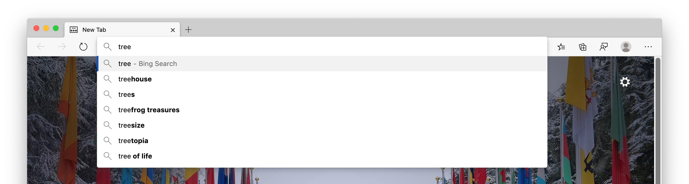

To speed up browsing and searching, characters you type into the address bar are sent to your default search provider. The search provider returns suggested search queries.

The address bar categorizes entries as a URL, search, or unknown.  This information, along with which suggestion you select, position of selection, and other address bar data is sent to your default search provider.

If your search provider is Bing, a resettable identifier unique to your browser is sent with the data. It helps Bing understand the search query and query session. Other autosuggest service identifiers are sent to your default search engine to complete the search suggestions. Your IP address and cookies are sent to your default search provider to increase the relevance of the search results.

When you select the address bar, a signal is sent to your default search provider. The signal tells the provider to prepare suggestions.  The typed characters and search queries aren't sent to Microsoft unless your search provider is Bing.  To enable sending data to your default search provider, go to `edge://settings/privacy`. In **Services**, select **Address bar** and turn on the **Show me search and site suggestions using my typed characters** setting.  If you turn off the setting, your typed characters are no longer sent to your default search provider.  Your search queries are still sent to your default search provider to provide search results.

<!-- The Privacy settings have been updated from what is described here -->

If Microsoft Edge detects typing in the address bar that might contain sensitive information, it does not send the typed text. Sensitive information includes authentication credentials, local file names, or URL data that is normally encrypted.

You can configure Microsoft Edge to collect diagnostic data about the address bar. Collected data includes the number of offered queries for all search providers. Go to `edge://settings/privacy`. In **Personalize your web experience** turn on the **Improve your web experience by allowing Microsoft to use your browsing history from this account for personalizing advertising, search, news, and other Microsoft services** setting.

Typed characters and the websites you visit are stored locally on the device per profile.  To delete the data, go to `edge://settings/clearBrowserData`. In the **Clear browsing data** window, select the **Browsing history** checkbox, and select the **Clear now** button.

If Bing is your default search provider and you are signed in, you may delete your searches through the [Microsoft Privacy dashboard](https://account.microsoft.com/privacy/).  You can clear your browsing history and delete websites from appearing as suggestions in the address bar. Go to `edge://history`, and select **Clear browsing data**.  You can delete the data Microsoft collects from the address bar and search suggestions features on Windows 10 and later. Open **Start** > **Settings** > **Privacy** > **Diagnostics & feedback**. In **Delete diagnostic data**, select **Delete**.  All other data is deleted after 36 months.

<!-- Deleting diagnostic data could use rewrite -->

Account-specific search functions are available if you are signed in to Microsoft Edge with a Microsoft work or school account, and Microsoft Search is available. Microsoft may send an anonymous token with your query, to provide account-specific functions, such as results specific to your company.

All data is transmitted securely over HTTPS.  If [Bing](https://bing.com) is your default search provider, the searches and typed characters are saved for up to six months.

If you search for a single word in the address box, Microsoft Edge may send the single word to your DNS server. Sending a single word is a check to see whether it corresponds to a host on your network. If so, Microsoft Edge may try to connect to the corresponding host. This option lets you go to the specific host instead of searching.  For example, if your router uses the hostname `router` and you type `router` in the address bar, you can go to `https://router`, or search for the word `router`.  The feature is not controlled by the **Show me search and site suggestions using my typed characters** setting because it does not involve sending data to your default search engine.

You can control whether or not typed characters are sent to your default search provider. Go to `edge://settings/search`. Toggle the **Show me search and site suggestions using my typed characters** setting.

<!-- The Search settings seem different from what is described here -->

You can change your default search engine. Go to `edge://settings/search`.  Select the **Search engine used in the address bar** dropdown menu.  If you are browsing while using **InPrivate** or **Guest** mode, your autosuggestions are turned off.  **InPrivate** shows suggestions from your local browsing, such as browsing history and past searches. No typed characters are sent to your default search engine.  **Guest** mode does not display any suggestions or send typed characters to your default search engine.

Data collected by other search providers follow the privacy policy of the company.

<!-- ====================================================================== -->
## Autofill

Autofill in Microsoft Edge lets you save form entry data. Form entry data includes passwords, payment information, addresses, and other data such as birthdays. When you visit a site and start to fill out a form, Microsoft Edge uses form fill information to match your saved autofill data to the form.  Microsoft Edge offers form entry data you previously saved when you open similar forms.  Passwords and credit card information are only saved with your explicit permission for each password and card.

Addresses and other form entries are saved by default.  To control saving and autofill of address and other form data, go to `edge://settings/profiles`. Select **Personal info** and toggle the **Save and fill personal info** setting.

<!-- The addresses settings have been moved to Profiles and updated from what is described here -->

You can prevent Microsoft Edge from prompting you to save passwords. Go to `edge://settings/passwords`. Toggle off the **Offer to save passwords** setting.  You can prevent Microsoft Edge from using autofill for saved passwords and delete saved passwords. Go to `edge://settings/passwords` and select **Saved passwords**.  To delete all autofill data, go to `edge://settings/clearBrowserData`, select **Autofill form data**, select the desired time range, and then select **Clear now**.

If you are signed in and syncing, your autofill data is synced across all versions of Microsoft Edge where you are signed in with the same credentials.  When syncing, all autofill data is stored on encrypted Microsoft servers.  The autofill data stored on Microsoft servers is used only for sync purposes.  You can turn off syncing of your autofill data. Go to `edge://settings/profiles/sync` and turn off the **Basic info** toggle. If sync is on for autofill, deleting autofill data from a device while you are signed in to Microsoft Edge removes the data from all other devices that you are signed in to with the same credentials.

When you visit a webpage and submit a form, Microsoft Edge sends information about the form to the Microsoft form fill service. This information includes a hash of the hostname and autofill entry types. For example, text box 1 expects an email address, text box 2 expects a password, and so on.  No user-entered information or user identifiers are sent to the service.  The information helps Microsoft Edge correctly identify forms across different webpages.  The data is used to help match your saved autofill data to the form.

In **Guest** mode, autofill is not available and new autofill entries aren't added.  For **InPrivate** mode, Microsoft Edge offers autofill entries, but new autofill entries aren't added.

<!-- ====================================================================== -->
## Copilot in Microsoft Edge sidebar

In Copilot in the Microsoft Edge sidebar, you can ask complex questions, find comprehensive answers, get summarized information, and find inspiration to build upon, in a side-by-side view, with no need to flip between tabs.

To open Copilot in the Microsoft Edge sidebar, click the **Copilot** () icon (**Ctrl+Shift+.**) in the upper right of the Microsoft Edge toolbar: 

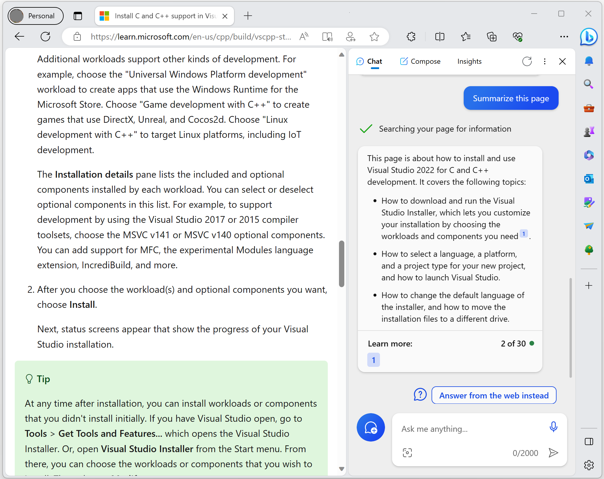 

<!-- --------------------------------------------------------------------- -->
#### Data and consent used by Copilot in Microsoft Edge 

Microsoft Edge determines what data to send to Copilot based on the user's **query** and their consent to share data with Microsoft.  For questions that don't need **browsing context**, such as "Help me plan a trip to Cannon Beach", Microsoft Edge shares the URL, page title, user's query, and previous conversation history to help Copilot answer their query effectively.

For questions that need **browsing context**, such as when the user asks Copilot to summarize a large page of text, Microsoft Edge requests permission from the user to access page information:

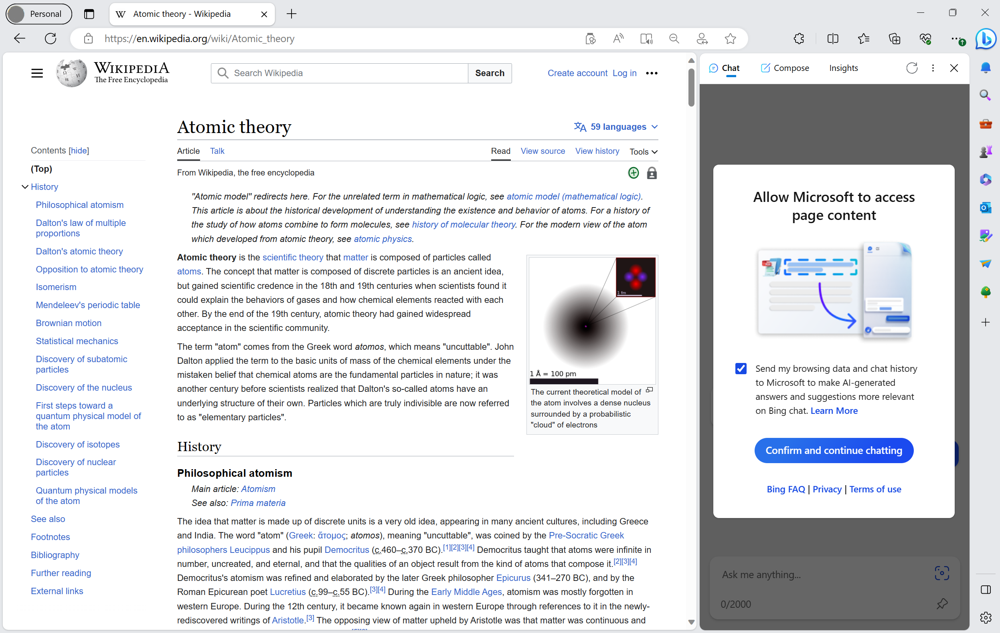 <!-- Update Bing chat screenshot-->

When the user grants permission to share page information, Microsoft Edge sends the full **browsing context** in addition to the user's **query** and previous **conversation history** to Copilot, to help generate a meaningful **response**.

The user can modify this permission anytime by going to Microsoft Edge > **Settings** > **Sidebar** > **App and notification settings** > **App specific settings** > **Copilot** and then turning on or off the **Allow access to any webpage or PDF** toggle.

<!-- ---------------------------------------------------------------------- -->
#### Duration of storage of conversation history

* **Conversation history** is a history of all queries and responses from Copilot.  **Conversation history** is stored for 90 days.  This is independent of whether using Copilot in Bing or Copilot in the Microsoft Edge sidebar or by visiting `www.bing.com/chat`.

   * Users can delete a specific conversation or all the conversations from Copilot in Bing by going to `www.bing.com/chat`, and then deleting the specific conversations in the **Recent activity** section:

     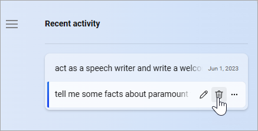

* **Page content** from public **pages on the Bing index** – Copilot uses publicly available information from the Bing search engine to summarize pages that are available on the Bing search index.  To answer questions from public pages, Microsoft Edge doesn't need to share this page content with Copilot.

* **Page content** from **non-Bing index pages** – information that's used to summarize a non-Bing index page is deleted after 6 hours, and it is only used to answer the query.

<!-- ---------------------------------------------------------------------- -->
#### Our commitment to responsible AI

Copilot has numerous protective measures in place that are constantly evolving.  For details, see [The new Bing: Our approach to Responsible AI](https://blogs.microsoft.com/wp-content/uploads/prod/sites/5/2023/04/RAI-for-the-new-Bing-April-2023.pdf).

<!-- ---------------------------------------------------------------------- -->
#### Glossary of terms for Copilot

| Term | Definition |
|---|---|
| _query_ | A question that a user types in the **Ask me anything** text box in Copilot. |
| _Bing index page_ | Any website URL that is publicly available on the internet for Bing to search and can be reached via a URL that starts with `http://` or `https://`. |
| _non-Bing index page_ | Any webpage or local file that is not available publicly for Bing to search, but is open in Microsoft Edge. |
| _grounding_ | Centering the response that's provided to a user's query or prompt on high-ranking content from the web, and providing links to websites so that users can learn more.  Bing ranks web search content by heavily weighting features such as relevance, quality, credibility, and freshness. |
| _response_ | The text that Copilot in Bing outputs in response to a prompt.  Synonyms: _completion_, _generation_, _answer_. |
| _conversation history_ | A combination of user query and response in the Copilot format. |
| _browsing context_ | The page URL and page content that's open in the active tab of the Microsoft Edge browser. These could be webpages, local PDFs, Microsoft Word documents, or other local files.  For example, the user can ask **Summarize this page** while they are browsing a long topic or webpage.  Copilot in Microsoft Edge uses the page context (such as the page URL) and the page content to summarize the topic for the user. |
| _page information_ | The webpage content, or the content of the document, that's open in the active tab of the Microsoft Edge browser. |

<!-- ====================================================================== -->
## Cast

Cast in Microsoft Edge lets you display your media to another screen using Google Cast.  To access Cast, open **Settings and more (...)** > **More tools** > **Cast media to device**.  Cast relies on the Media Router extension not automatically installed with Microsoft Edge.  When you first use Cast, Microsoft Edge prompts for permission to install the Media Router extension.

Select **restart** to install the Media Router extensions from the Chrome Web Store. On startup and at regular intervals, Microsoft Edge sends update requests to the Chrome Web Store. Update requests include basic data about your version of Microsoft Edge. Regular update requests keep the Media Router extension up to date.

Google may collect some data associated with the Media Router extension. To uninstall the Media Router extension, go to `edge://flags#edge-on-demand-media-router` and change the setting. Uninstalling also stops updates from the Chrome Web Store. The extension is hidden and does not appear on the **Installed extensions** list. For the **Installed extensions** list, go to `edge://extensions`.

<!-- ====================================================================== -->
## Collections

The Collections feature in Microsoft Edge allows you to save web pages, text, images, and videos from the web. You can organize the content based on the projects, events, and interests that matter to you. You can also save notes in your collections and add notes to individual items as well. Collections uses the Microsoft Edge Entity Extraction service to enrich the content that you collect by including thumbnails and metadata, such as price and star rating. For more information, see [Entity extraction](#entity-extraction) below.

The Collections feature is not available in **Guest** mode or Kids Mode.

Collections storage and feature availability depend on your Microsoft Edge Sign-in and Sync settings.

<!-- ------------------------------ -->
#### Signed in with a personal account

When you sign in to Microsoft Edge with a personal Microsoft Account (MSA), your collections, saved items, notes, and images are automatically saved on Microsoft cloud for free. You can access your collections from Microsoft Edge on any device where you're signed in. You can even view and manage your collections online in any browser by visiting the [Collections portal](https://www.bing.com/saves) at Bing.com. Collections also enhance your experience with a personalized interest feed, if your personalization settings support this feature.

If you want to disable Collections for a signed-in profile using a personal account, go to `edge://settings/privacy`, scroll down to the **Services** section, and then turn off the toggle for **Show Collections and follow content creators in Microsoft Edge**.

When you sign in with a personal account and Sync for Collections is disabled, all collections data is stored locally on the device, organized per Microsoft Edge profile.

You cannot access Collections from an InPrivate window while signed in with a personal account.

<!-- ------------------------------ -->
#### Signed in with a work or school account

If you're signed in with a work or school account and are syncing Collections, your collections, saved items, notes, and images are synced across devices. If you want to stop syncing your Collections, you can turn off Sync for Collections from `edge://settings/profiles/sync`.

When you sign in with a work or school account and Sync for Collections is disabled, all collections data is stored locally on the device, organized per Microsoft Edge profile.

You can access Collections from an InPrivate window while signed in with a work or school account.

<!-- ------------------------------ -->
#### Signed-out

When you don't sign in to Microsoft Edge, all collections data is stored locally on the device, organized per Microsoft Edge profile.

You can access Collections from an InPrivate window when using a signed-out profile.

<!-- ====================================================================== -->
## Compose

In the Copilot pane, the Compose tool uses AI to write for you, starting from a short prompt and **Tone**, **Format**, and **Length** selections. Text that's generated by Compose can be copied or inserted into the webpage directly.

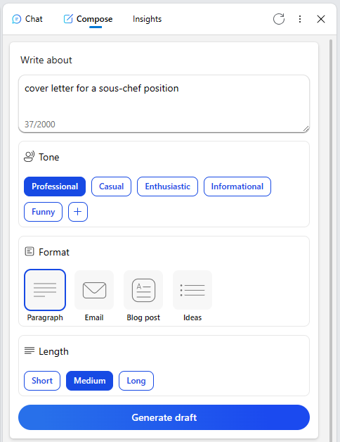

To access Compose, click the **Copilot** () icon (**Ctrl+Shift+.**) in the upper right of Microsoft Edge, and then select **Compose**. Text and selections that you enter are sent to an internal Microsoft Large Language Model (LLM). 

Requests for Compose are sent over a secure HTTPS connection. Each request contains the input prompt, formatting selections, and IDs that are associated with your Microsoft Edge profile and device, to reference for subsequent requests.

To change settings for the sidebar or Copilot pane, go to `edge://settings/sidebar`, and then select **App and notification settings** > **Copilot**.

<!-- ====================================================================== -->
## Crashes

If optional diagnostic data, including crash reports, are turned on, diagnostic data is collected when Microsoft Edge crashes or closes unexpectedly. The diagnostic data is used to diagnose and fix problems with Microsoft Edge and other Microsoft products and services.

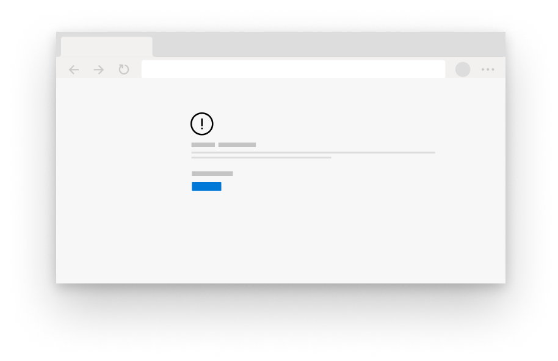

Collected diagnostic data is in the form of crash dumps, which contain device and software state captured at the time Microsoft Edge crashed or closed. The crash dump contains information about what was happening at the time of the problem. Information such as the website you were visiting at the time of the crash or your CPU usage may be included in the diagnostic data. If crash reporting is turned on, the crash dump is stored locally on the device and sent to Microsoft using an encrypted link.

Each crash dump contains an identifier unique to the device and a resettable identifier unique to your browser. It also includes extra diagnostic data such as the URL, CPU usage, and network usage, to help identify the problem. The extra diagnostic data helps Microsoft determine how many devices are encountering the problem and the severity.

Crash dumps are stored on secure Microsoft servers for up to 30 days, and then deleted.  You can request to delete the diagnostic data on Windows 10 and later devices. Open **Start** > **Settings** > **Privacy** > **Diagnostics & feedback**. In **Delete diagnostic data**, select **Delete**. Collected crash information, such as a count of crash types, are stored for reporting and product improvement purposes.

You can clear the crash diagnostic data stored locally on a device. Go to `edge://crashes` and select the **Clear all** button.

To turn off crash diagnostic data collection on Windows 10 and later, open **Start** > **Settings** > **Privacy** and select **Diagnostics & feedback**.  For versions of Microsoft Edge on all other platforms, go to `edge://settings/privacy` and turn off the **Help improve Microsoft products by sending optional diagnostic data about how you use the browser, websites you visit, and crash reports** setting. You can manage diagnostic data collection at the enterprise level. See [group policies managed by your organization](/deployedge/microsoft-edge-enterprise-privacy-settings).

<!-- ====================================================================== -->
## Developer tools

Microsoft Edge Developer Tools help with website debugging and testing. Open **Settings and more (...)** > **More tools** and select **Developer tools**. When you turn on certain features in Developer Tools, Microsoft Edge requests modules from Microsoft servers and downloads them to your device. The request is sent over a secure HTTPS connection and contains a non-unique identifier representing the version of Microsoft Edge. Specific experiences that require remote download include 3D View and the Elements tool Accessibility pane. Webhint integration requires a remote module that is automatically requested when you open Developer Tools.

<!-- ====================================================================== -->
## Diagnostic data

Microsoft uses diagnostic data to improve products and services. Diagnostic data is also used to keep products secure, up to date, and performing as expected. Microsoft believes in and practices information collection minimization. We strive to gather only the information we need, and to store it for only as long as needed to improve products and services.

Microsoft Edge collects a set of required diagnostic data needed to keep the product secure, up to date, and performing properly. The required diagnostic data includes device connectivity, configuration information, software setup, and inventory. Microsoft uses this diagnostic data to troubleshoot issues and keep Microsoft products and services reliable, secure, and operating normally. For more information about diagnostic data on managed devices, see [Configure Windows diagnostic data in your organization](/windows/privacy/configure-windows-diagnostic-data-in-your-organization) and [Microsoft Edge diagnostic data group policy](/deployedge/microsoft-edge-enterprise-privacy-settings).

You may also choose to share optional diagnostic data. As you use Microsoft Edge features and services, or other applications that use the Microsoft Edge web platform, Microsoft Edge sends optional diagnostic data about how you use those features and the websites you visit. With your permission, this optional diagnostic data is sent to Microsoft to improve products and services for everyone. This data is not collected or stored with your Microsoft account.

Optional diagnostic data includes feature usage, performance data, site load times, memory usage, and websites you visit. For example, if you choose a website as a favorite, optional diagnostic data is sent. It includes that the favorite button was selected, and a favorite was successfully added, but not which site was set as a favorite.

Information about websites you visit in Microsoft Edge helps us understand how quickly sites load and increases the relevance of search results for all users. The data includes information about the website such as the URL of the page you visit, website metrics, title of the page, how you accessed the page, information about the content of the page, and other relevant information about the page navigation.

Diagnostic data is sent using HTTPS and stored on Microsoft servers. On Windows devices, diagnostic data is sent with an identifier unique to your device. On other devices, the diagnostic data is associated with a resettable identifier unique to your browser. The identifier is randomly generated and does not contain your personal information.

The Microsoft Edge team respects the sensitivity of diagnostic data by restricting data access or removing personal information. To reset the identifier unique to your browser on Windows 10 and later devices, select **Start** > **Settings** > **Privacy** > **Diagnostics & feedback**, and then select **Delete** under **Delete diagnostic data**, or change your setting under **Diagnostic data** from **Full** to **Basic** or turn off **Optional diagnostic data**.

On other platforms, to generate a new resettable identifier (ID) that is unique to your browser, go to `edge://settings/privacy` and turn off the **Help improve Microsoft products by sending optional diagnostic data about how you use the browser, websites you visit, and crash reports** setting. The reset (ID) functionality may be different for devices managed with group policies set by your organization.

If you're using Windows 10 version 1803 (April 2018 Update) or later, to view product data shared with Microsoft in the Diagnostic Data Viewer, select **Start** > **Settings** > **Privacy** > **Diagnostics & feedback**, and then select **Open Diagnostic Data Viewer** under **View diagnostic data**.

For other platforms or versions of Windows 10 version 1803 and earlier, go to `edge://data-viewer` to view diagnostic data. To view the data that's periodically sent to Microsoft since the last time the viewer was opened, go to `edge://data-viewer`. To see what data has been sent to Microsoft for your specific session, refresh the viewer. The data used to populate `edge://data-viewer` is stored locally on the device. To clear the data in the viewer, close the `edge://data-viewer` tab.

To help us improve Microsoft products and services, diagnostic data is aggregated, with personal identifiers removed, and stored for up to two years. Because the diagnostic data is not collected from or stored with your Microsoft account, the diagnostic data may not be viewed or deleted from your [Microsoft privacy dashboard](https://account.microsoft.com/privacy/). To delete the diagnostic data on Windows 10 and later, select **Start** > **Settings** > **Privacy** > **Diagnostics & feedback**, and then select **Delete** under **Delete diagnostic data**. The delete diagnostic data functionality is only supported on Windows 10 version 1803 or later. For more information, see [Diagnostics, feedback, and privacy in Windows 10 and later](https://support.microsoft.com/help/4468236).

For Microsoft Edge on Windows 10 and later, sending Optional diagnostic data is determined by your Windows diagnostic data setting. The setting is reflected in `edge://settings/privacy`. Change the Windows settings by going to **Start** > **Settings** > **Privacy** > **Diagnostics & feedback**. On all other platforms, to control the collection of diagnostic data, go to `edge://settings/privacy` and turn on or off **Help improve Microsoft products by sending optional diagnostic data about how you use the browser, websites you visit, and crash reports**. The setting is used for all profiles associated with the installation of Microsoft Edge on your device.  The setting is not synced across devices. The setting applies to **InPrivate** browsing and Guest mode. Information about websites you visit is never sent while browsing **InPrivate** or in **Guest** mode. If your device is managed with group policies set by your organization, it is described in `edge://settings/privacy`.

As of March 6, 2024, Microsoft Edge diagnostic data is collected separately from Windows diagnostic data on Windows 10 (version 22H2 and newer) and Windows 11 (version 23H2 and newer) devices in the European Economic Area. For these versions of Windows, the diagnostic data setting for Microsoft Edge is controlled through `edge://settings/privacy`, rather than being a Windows setting that's reflected there.

<!-- ====================================================================== -->
## Digital Rights Management and Media Licenses

When a website offers media content that is protected by Digital Rights Management (DRM), Microsoft Edge uses a secure playback pipeline to make sure the content is not improperly viewed or copied. As part of the feature, Microsoft Edge may store DRM-related data on your device, including a unique identifier and media licenses. Microsoft Edge may also transmit the unique identifier to a media licensing server specified by the content provider. When you use the website, Microsoft Edge retrieves the DRM information to make sure you have permission to use the content. The data helps to validate access to the protected content and ensure a seamless media experience.

Microsoft Edge supports DRM using the Encrypted Media Extensions API (EME API) for HTML5 sites.  The EME API allows websites to communicate with a DRM provider called a Content Decryption Module (CDM). Different DRM systems, such as Widevine by Google or PlayReady by Microsoft, may be supported by the CDM implementation of the developer.  Content providers may choose to support one or more potential DRM systems. Providers may use the function of the EME API to decide which DRM system to use for a specific client. For more information about EME privacy, see [Encrypted Media Extensions Privacy](https://w3.org/TR/encrypted-media#privacy).

Microsoft Edge supports PlayReady DRM only on Windows 10 and later. PlayReady is a DRM implementation to deliver media experiences such as 4K video and Dolby Atmos audio.  Microsoft Edge uses the Windows Platform Media Foundation APIs to support PlayReady.  To validate access to protected content, Microsoft Edge uses the Windows 10 or Windows 11 operating system. Windows uses a unique identifier (ID) and communicates the ID with the PlayReady service.  All EME, CDM, and browser data for PlayReady that persists on the device is stored and maintained on Microsoft Edge.  For more information about PlayReady, see [Simple End to End System](/playready/overview/simple-end-to-end-system).

Microsoft Edge supports Widevine by Google DRM and the option is on by default.  Microsoft Edge periodically fetches updates for Widevine from Google servers.  The use of Widevine may include communications to Google.  To opt-out of using Widevine in Microsoft Edge, go to `edge://flags/#edge-widevine-drm` and turn off the Widevine DRM setting.  Widevine has the capability to create a unique device identifier and transmit it to Google.  For more specific information on Widevine and privacy, see the Google privacy policy.

Microsoft Edge supports the Flash Access DRM by Adobe, which is used by some sites instead of HTML5. You are prompted to allow Adobe Flash when a site requests it.  When a site uses the Flash Access DRM by Adobe, Microsoft Edge gives Adobe access to a unique device identifier.  You can clear and reset any locally stored instances of the identifier. Go to `edge://settings/privacy`. In **Clear browsing data**. select **Choose what to clear**, select the checkbox for **Cookies and other site data**, and select **Clear now** to remove any stored identifiers. To stop Adobe Flash DRM from ever being used, go to `edge://settings/content/flash`.

When you request access to encrypted HTML5 media such as an online movie, Microsoft Edge creates a license request to decrypt the media. The CDM in use creates the license request containing a request ID. The request is sent to the license server.  No part of the license request contains any personal data, and the license request is not stored on the device.

When returning the media license, a media identifier is created which is unique to the user and the site.  The ID is not shared between sites and is different for each site.  A session ID, used to identify a playback session, is sent with the media identifier to decrypt the media.  The media identifier is stored locally on the device and may be stored with the content provider.

To control DRM and content protections, go to `edge://settings/content/protectedContent`. Toggle the **Allow sites to play protected content (recommended)** and **Allow identifiers for protected content (computer restart may be required)** settings.

*   The **Allow sites to play protected content** setting controls playback for CDM-based DRM systems such as PlayReady and Widevine, but not for non-CDM-based systems like Flash Access DRM.  To manage Flash site permissions, go to `edge://settings/content/flash`.  Turning off the setting causes media functions to stop working properly.
*   Turning off the **Allow identifiers for protected content** setting prevents the creation of identifiers for Flash Access DRM and prevents Widevine from periodically fetching updates from Google.  Turning off the setting may cause media functions on some sites to stop working properly.

<!-- ====================================================================== -->
## Do Not Track

You can enable **Do Not Track** on Microsoft Edge. Go to `edge://settings/privacy`. Turn on the **Send "Do Not Track" requests** setting.  If you enable the **Do Not Track** feature, Microsoft Edge sends a `DNT:1 HTTP` header with your outgoing HTTP, HTTPS, and SPDY browsing traffic requests. This feature tells websites you visit not to use trackers. However, enabling the **Send "Do Not Track" requests** setting does not guarantee that the websites aren't able to track you. Some sites may honor the request by showing you ads not based on any previous browsing. Microsoft Edge does not control whether or not the request is honored. You can help prevent websites from tracking you. Go to `edge://settings/privacy`. Change the **Tracking prevention** setting to **Balanced** or **Strict**.

When you use **Guest** mode, Microsoft Edge does not send **Do Not Track** requests.  When you use **InPrivate** browsing, Microsoft Edge only sends **Do Not Track** requests if the **Send "Do Not Track" requests** setting is turned on for the profile you are using.

<!-- ====================================================================== -->
## Downloads

Microsoft Edge lets you download files safely and securely.  To choose where files are downloaded on your device, go to `edge://settings/downloads`.  If SmartScreen is enabled, information about your file, such as the file name and URL, are sent to SmartScreen to check the reputation of the file. The reputation check helps you avoid accidentally downloading known malware that is known to hurt your device.  To change SmartScreen settings, go to `edge://settings/privacy` and toggle SmartScreen. For more information about SmartScreen, see the [SmartScreen](#smartscreen) section.

To view the history of your previous downloads, go to `edge://downloads`.  To clear your browsing data and delete your download history, go to `edge://settings/clearBrowserData`.  Deleting your download history from Microsoft Edge does not remove the files from your device.  Deleting downloaded files from your device does not remove the files from your download history.  When you use **InPrivate** browsing or **Guest** mode, the download history from the session is cleared when you close the **InPrivate** or **Guest** windows. The files remain saved on the device.

<!-- ====================================================================== -->
## Enterprise security and compliance

Microsoft Edge supports a variety of first-party enterprise security and compliance features, including:

| Feature | Article |
|---|---|
| Windows Information Protection | [Protect your enterprise data using Windows Information Protection (WIP)](/windows/security/information-protection/windows-information-protection/protect-enterprise-data-using-wip) |
| Microsoft Defender Application Guard | [Microsoft Defender Application Guard overview](/windows/security/threat-protection/microsoft-defender-application-guard/md-app-guard-overview) |
| Microsoft Endpoint Data Loss Prevention (DLP) | [Learn about Endpoint data loss prevention](/microsoft-365/compliance/endpoint-dlp-learn-about) |
| Microsoft Defender for Cloud Apps (Preview) | [Session policies](/defender-cloud-apps/session-policy-aad) |
| Microsoft Insider Risk Management | [Insider risk management](/microsoft-365/compliance/insider-risk-management-solution-overview)|
| Microsoft Edge management service | [Microsoft Edge management service](/deployedge/microsoft-edge-management-service) |

<!-- todo (Aug 2023): when the forthcoming anchor link section like https://learn.microsoft.com/defender-cloud-apps/session-policy-aad#integration-with-microsoft-edge-for-business-preview exists in destination page, replace the "Microsoft Defender for Cloud Apps (Preview)" row by:
| Microsoft Defender for Cloud Apps | [Integration with Microsoft Edge for business preview](/defender-cloud-apps/session-policy-aad#integration-with-microsoft-edge-for-business-preview) in _Session policies_ |
-->

These features become functional only on enterprise-managed devices by acquiring the right license for the feature or by the administrator deploying specific policies on the device.

When these enterprise features are on, the browser sends auditing and diagnostic data to the administrator as per the feature's requirement to function, manage or diagnose properly. This data collection is controlled by the enterprise administrator and end user is not able to opt-out.

Please contact your enterprise administrator to understand your company's policies for such data collection.

<!-- ====================================================================== -->
## Entity extraction

Microsoft Edge uses entity extraction templates that are specific to a list of supported websites to identify the name, price, ratings, primary image, and other data about the item being collected locally. When creating the collection, no user identifiers or other data are sent to Microsoft services.

If you want to delete such templates stored on the device, go to `edge://settings/clearBrowserData`, select the desired time range and type of data, and then click the **Clear now** button.

<!-- ====================================================================== -->
## Extensions and Microsoft Edge Add-ons

You may install extensions in Microsoft Edge to add functions to the browser. When you install an extension from the Microsoft Edge Add-ons website or another extension store, Microsoft collects information about the extension to help developers and Microsoft understand how the extension is used. Microsoft Edge collects aggregated data including the number of times an extension was downloaded and information about how it is performing, such as crash data. Microsoft shares the aggregated data with the developers of the extension.

Comments and reviews from users are public on the Add-ons website and are also shared with the developers. If you are signed in to Microsoft Edge, installed extensions from the Microsoft Edge Add-ons website are associated with your account to provide extension recommendations. The data is used in aggregate to understand the popularity of extensions.

You can sync extensions and preferences across all your signed-in syncing versions of Microsoft Edge. Go to `edge://settings/profiles/sync`, and select the **Sign in to sync data** button.

Installing extensions is optional. To uninstall any extension at any time, go to `edge://extensions`. When an extension is installed, it specifies what user data it needs to access. Microsoft Edge asks for your permission before installing the extension. Make sure an extension is credible and secure before installing it. Review the privacy policy of the developer for the specific extension.

Extensions are updated using the Microsoft Edge update service.  Microsoft Edge sends a list of installed extensions to the update service to check for updates.  If you install an extension from the Chrome Web Store, requests are sent to the Chrome Web Store at regular intervals to check for extension updates. The extension identifier, extension version, and information about Microsoft Edge are included in the request for updates. You can stop requests to the Chrome Web Store. Go to `edge://extensions`. Turn off the **From other sources** toggle to uninstall extensions.

You can import extensions from other browsers like Google Chrome. If an imported extension is available in the Microsoft Edge Add-ons website, Microsoft Edge automatically installs the extension from the Microsoft Edge Add-ons website. If you previously had the extension turned on, Microsoft Edge automatically turns it on for you.

If an extension is not available from the Microsoft Edge Add-ons website, Microsoft Edge locally copies and installs your extension from Google Chrome without turning it on or connecting to the Chrome Web Store.  Microsoft Edge asks for your permission to turn on the extension and to allow extensions from other stores.  If you granted permission, Microsoft Edge allows installation of extensions from other stores and updates to your extensions using the Chrome Web Store.  You can control the option to allow extensions from other stores. Go to `edge://extensions`. Toggle the **Allow extensions from other stores** setting.

<!-- ====================================================================== -->
## Family safety

Microsoft offers tools to help families stay connected and keep kids safer on Windows, Xbox, and Android devices running Microsoft Launcher.

Within a family group, there are family settings that should be enabled for children while using Microsoft Edge.  The family group organizer must enable the settings for users in the group.  The three main features offered to a family group are web filtering, activity reporting, and safe search.

Web filtering protects children in the family group from going to mature websites or websites blocked by the family organizer.

Activity reporting records information about the websites children visit. Records also include searches, screen time, devices used, and attempt to visit blocked sites. The family group organizer may see the information at [family.microsoft.com](https://account.microsoft.com/family). The data is collected, encrypted in transit, sent to Microsoft, and stored on secure Microsoft storage servers. The data is collected with the child's Microsoft account so it may be properly managed. Activity reports are stored on [family.microsoft.com](https://account.microsoft.com/family) for up to 30 days and then deleted after.

Safe search adds a safe keyword to the header request to search engines. Bing reads the safe keyword and filters search results returned to the child. Other search engines may return filtered results due to the keyword. All of the child's searches are collected and made available for the family organizer to view in activity reports or at [family.microsoft.com](https://account.microsoft.com/family). The data is collected with the child's Microsoft account so it may be properly managed.

The child account's health status is also monitored.  When a child needs to take action to log back into their account, such as when a password has changed or expired, their parent is informed.  This data is collected, encrypted in transit, and sent to Microsoft and stored on secure Microsoft storage servers. The account health status is stored on [family.microsoft.com](https://account.microsoft.com/family) for up to 30 days and then is deleted afterwards.

The child's browsing data is stored on secure Microsoft servers and made available to parents for up to 30 days, then immediately deleted.  The data may be deleted at any time from the [Microsoft privacy dashboard](https://account.microsoft.com/privacy/). To clear browsing data stored locally on a device, go to `edge://settings/clearBrowserData`.  Choose a **Time range**, select checkboxes as needed, then select **Clear now**.

Collecting child browsing data and sharing it with the family group organizer requires two things. 1.\) The child must be signed in to Windows 10 and later with a Microsoft account. 2.\) The activity reporting setting must be turned on by the family organizer. The child does not need to be signed in to Microsoft Edge to collect browsing data. If family safety features aren't available on your version of Windows, update to the most recent version of Windows.

**Guest** mode and **InPrivate** browsing aren't available if web filtering or activity reporting is turned on.

The family group organizer may stop the data collection from the family safety portal.  For more information about Microsoft family safety features, see [What is a Microsoft family group?](https://support.microsoft.com/help/12413)

<!-- ====================================================================== -->
## Find on page 

Use the "Find on page" feature to search a webpage for key words.  In a webpage, press **Ctrl+F** (Windows, Linux) or **Command+F** (macOS).  Or, click **Settings** (**..**), and then select **Find on page**.  A search box opens.  Enter a word, phrase, or other string into this search box.  As you type, all occurrences of the string in the page are highlighted. You can then move through the search results by clicking the **Previous result** and **Next result** buttons.

By default, the **Include related matches in Find on page** feature allows **Find on page** to find other related matches, including synonyms and alternate spellings.

When the **Include related matches in Find on page** toggle is turned on, Microsoft Edge sends the text of the webpage, your search terms, and a service token to a Microsoft cloud service over a secure HTTPS connection. The service token doesn't contain any user-identifiable information. A Microsoft cloud service then processes the text to find results on the page that are related to your search. The webpage text and search terms that are sent to Microsoft are deleted immediately after processing occurs.

Related matches in **Find on page** aren't available when using InPrivate browsing.

To stop Microsoft Edge from finding related matches in **Find on page**:

1. Select **Settings and more** (**...**) > **Settings** > **Privacy, search, and services**, and then scroll down to the **Services** section.  Or, go to `edge://settings/privacy`, and then scroll down to the **Services** section.

1. Turn off the **Include related matches in Find on page** toggle.

<!-- ====================================================================== -->
## Geolocation

While you browse the web, websites can request your device's location from Microsoft Edge. Data about your device's location can be either precise or imprecise. For example, a precise location is needed to provide driving directions to or from your specific location. An imprecise location might be used to provide search results, news, and weather relevant to your general area.

Microsoft Edge supports the [Geolocation API](https://w3.org/TR/geolocation-api), which provides websites access to your device's location. By default, Microsoft Edge asks for your permission before granting a site access to your precise location. To manage site permissions or to always block sites from accessing your precise location, go to `edge://settings/content/location`.

Microsoft Edge provides the site with a location using your device's location services when they're turned on. For more information about how to enable location services on Windows, see [Windows location service and privacy](https://support.microsoft.com/help/4468240). 
If your device's location services are turned off, Microsoft Edge tries to estimate your location by sending local network information (which might contain nearby Wi-Fi access point information and your device's IP address) to a Microsoft service. 

When the site you are on has access to your location, Microsoft Edge shows a location icon in the address bar. You can select this icon to get more information and to manage the location access permissions for this site.

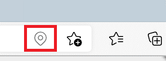

Microsoft Edge doesn't collect or store the location data that is shared with the site, and generates a new random identifier for each request.

When you browse the web using **InPrivate**, the **Ask** and **Block** permissions, which control accessing your precise location, are inherited from the profile that you used to open the **InPrivate** window. However, the **Allow** permissions are not automatically inherited, and Microsoft Edge asks for your permission again before granting the site access to your precise location.  In **Guest** mode, Microsoft Edge always asks for permission before granting a site access to your precise location.

<!-- ====================================================================== -->
## History

History supports views to display images of your web navigations and enhance your history experience.  All history data is stored locally on the device, and is organized per Microsoft Edge profile.  Images are saved for the duration the history exists (90 days).

If you want Microsoft Edge not to capture images for your history, select the **Turn off images** button in the history hub.  Or, go to `edge://settings/privacy`, scroll down to the **Services** section, and then turn off the toggle for **Save screenshots of site for History**.  All previously saved images will be erased.

<!-- ====================================================================== -->
## Image descriptions

When browsing the web in Microsoft Edge, screen reader users may encounter images that are not annotated with alt text. Without alt text to describe these images, they are effectively invisible to screen reader users. When Image Descriptions is turned on, Microsoft Edge will detect these images without alt text and send them to Azure Cognitive Services to generate captions. The generated captions are then announced to screen reader users. Even when **Get image descriptions from Microsoft for screen readers** is turned on, images are only sent to the service when a screen reader (or other assistive technology) is connected to Microsoft Edge. 

Only raw image data is sent to Azure Cognitive Services. Images are sent un-encrypted, to reduce latency. No user identifiers are included in the requests to the service. Images aren't stored or saved on Microsoft servers; images are discarded immediately after the captions are generated.

To control Image Descriptions, go to `edge://settings/accessibility`. Toggle the **Get image descriptions from Microsoft for screen readers** setting. 

Image Descriptions can be turned on for the current web page without enabling for all web pages. While using a screen reader, right-click the webpage, and select **Get image descriptions from Microsoft** > **Just once**. The current web page will be scanned for all images without alt text and send those to the service for descriptions. The Image Description feature will remain off for other pages and future browsing. 

<!-- ====================================================================== -->
## Import browser data

Microsoft Edge offers an interactive and seamless experience when you launch the browser for the first time. You can import your browser data to Microsoft Edge from another browser. The data includes your favorites, browsing history, cookies, autofill data, extensions, settings, and other browsing data.

With your confirmation, Microsoft Edge imports browser data from other browsers such as Google Chrome, Mozilla Firefox, or Internet Explorer. Microsoft Edge imports data from your most used browser as defined by your operating system.  If you choose to regularly import your browsing data, browsing data will be imported each time Microsoft Edge is launched.

Importing your data is completed locally on your device and is stored locally.  The imported data is sent to Microsoft only after you do at least one of the following actions: 

* Sign into Microsoft Edge with a Microsoft account, and turn on sync'ing of your browsing data across all signed-in devices.

* In Microsoft Edge settings, turn on the toggle **Privacy, search, and services** > **Personalization & advertising** > **Allow Microsoft to save your browsing activity including history, usage, favorites, web content, and other browsing data to personalize Microsoft Edge and Microsoft services like ads, search, shopping and news**.

You can manage your browsing history that's stored on Microsoft servers by visiting [https://account.microsoft.com](https://account.microsoft.com).

You can manage your import preferences any time from `edge://settings/profiles/importBrowsingData`.

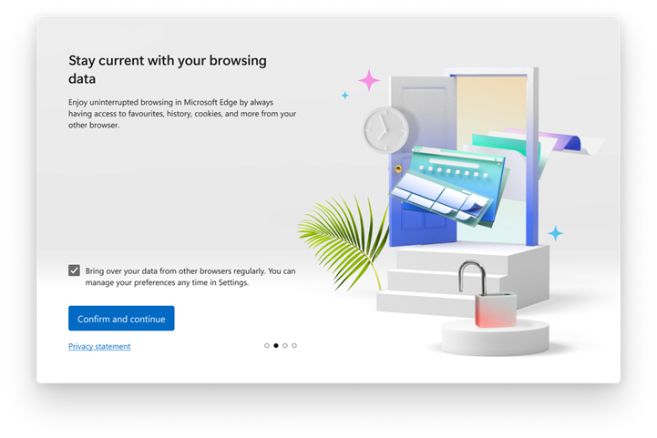

When importing extensions, if the extension is not available on the Microsoft Edge Add-ons website, Microsoft Edge imports a local copy and asks for permission before starting. The permissions for some of the extensions may have changed. To review the extension permissions, go to `edge://extensions`.

Your browsing data from older versions of Microsoft Edge is automatically imported when you update Microsoft Edge. 

<!-- ====================================================================== -->
## Install and update

You may download and install Microsoft Edge on platforms such as Windows and macOS.  Microsoft Edge uses the updater service to keep your version of Microsoft Edge up to date and secure.

When you install or update Microsoft Edge, device information is sent to Microsoft. Device information includes your release channel, basic hardware information, update identifiers, an identifier unique to your device, and a resettable identifier unique to your browser. The IP address of the device is sent to the updater service, but the last decimal is scrubbed for added privacy protection. During each browsing session, a new randomly generated token is created to install updated versions of Microsoft Edge. The token is not associated with any personal information and is only used for the installation and update process and to improve the updater service.

Microsoft Edge pings the Microsoft Edge updater service about the progress of installation and update.  If an installation or update fails and crash reporting is turned on, a log is created and sent to Microsoft.  For more information about sending crash reports to Microsoft, see the [Crashes](#crashes) section.  Microsoft collects information about how you downloaded Microsoft Edge, the success of the installation, and any uninstalls to better understand the success of Microsoft Edge downloads.

Automatic updates are turned on by default for all Microsoft Edge users.  On all platforms, Microsoft Edge checks for updates on startup and periodically while running.  On macOS devices, Microsoft AutoUpdate checks for updates for Microsoft products periodically as well.  More controls and configurations are available for organizations.  For more information about controls and configurations, see [Update](/deployedge/microsoft-edge-update-policies#update).

<!-- ====================================================================== -->
## Internet Explorer mode

Microsoft Edge offers a simplified experience with the integration of Internet Explorer (IE).  Microsoft Edge only supports IE 11, and IE mode is only available on Windows.  The IE mode feature is available for organizations through group policies.  The administrator chooses to open certain sites in IE mode in Microsoft Edge.

> [!div class="mx-imgBorder"]
> 

Microsoft Edge downloads the list of sites from a location defined by the administrator through a policy, and caches the file that determines which sites must be opened in IE mode.  Depending on your Windows or IE 11 settings, Microsoft Edge collects diagnostic data about the use of IE mode. Collected data includes which sites users visit, performance data, reliability data, and feature usage data.  On Windows 10 and later, the diagnostic data is collected according to your Windows Diagnostic data setting.  On Windows 8.1, website information is collected if the user has opted into the Flip Ahead or Suggested Sites feature in IE.  IE mode may not follow the same data collection settings in the Microsoft Edge Privacy settings.

If your administrator turned on Enterprise Site Discovery, browsing history data is collected periodically to help administrators review the sites that users visit and ensure that system upgrades continue to support those sites.  For more information about Enterprise Site Discovery in IE11, see [Collect data using Enterprise Site Discovery](/internet-explorer/ie11-deploy-guide/collect-data-using-enterprise-site-discovery).

Non-enterprise users on Windows devices may also access IE mode.  To turn on IE mode, go to `edge://settings/defaultBrowser` and select the **Allow sites to be reloaded in Internet Explorer mode** setting.  To open tabs in IE mode, open **Settings and more (...)** > **More tools** and select **Reload in Internet Explorer mode**.  After you turn on IE mode, Microsoft Edge periodically requests a list of unsupported sites from a Microsoft service.  The request is sent over HTTPS and does not contain any identifiers.

Internet Explorer browsing data is stored locally in Microsoft Edge and Internet Explorer.  To delete browsing data while browsing in IE mode, go to `edge://settings/privacy` and clear the data from both **Clear browsing data** and **Clear browsing data for Internet Explorer**.

<!-- ====================================================================== -->
## Intrusive ads

To provide a better browsing experience, Microsoft Edge offers to block advertisements from loading on sites that show intrusive or misleading ads. When Ads Blocking is turned on, Microsoft Edge periodically downloads from Microsoft servers the most recent list of sites that show intrusive or misleading ads and stores it locally on your device.  No user identifiers are included in the download request.  If you visit a site that is on the list, Microsoft Edge blocks all ads on the site and you should see the `Ads blocked` message.  To allow ads for the site, go to `edge://settings/content/ads` and change the settings. Other than downloading the list of sites with intrusive ads, the Ads Blocking feature does not send additional information to Microsoft or request additional information from Microsoft while you are browsing the web.

<!-- ====================================================================== -->
## Jump list

The jump list in Microsoft Edge lets you easily find your most recently closed sites. Hover on the Microsoft Edge icon in the task bar and right-click. The last three closed tabs are stored locally for each profile.  To delete sites from the jump list in Windows 10 and later, right-click the site, and then select **Remove from this list**.

You can clear or change the display of your recently closed tabs in the jump list. Go to `edge://settings/privacy`, and select the **Choose what to clear every time you close the browser** setting. When using an **InPrivate** window, Microsoft Edge does not add closed tab information to the jump list.  When using **Guest** mode, the jump list is not available.  For more information about clearing your browsing data, see [View and delete browser history in Microsoft Edge](https://support.microsoft.com/help/10607).

<!-- ====================================================================== -->
## Kids Mode

Kids Mode is a convenient browsing mode designed for kids inside Microsoft Edge.  With the kid-friendly features and safety guardrails in place, Kids Mode is a great place for children to safely explore the web.  Kids Mode includes features like custom browser themes, kid-friendly content, browsing based on an allowlist, Bing SafeSearch set to strict, and a password requirement to exit.  Kids Mode doesn't require a child account or profile, therefore you aren't able to sign into Kids Mode.

Browsing in Kids Mode is limited to a default list of kid-friendly websites.  Upon navigation, the website is compared to a local list of allowed websites.  The websites visited in Kids Mode are not viewable on [family.microsoft.com](https://account.microsoft.com/family) since the browsing in Kids Mode is not associated with any account.  Allowed website exceptions may be added through the profile in which Kids Mode was launched.  Those exceptions are synced to the profile in which Kids Mode was launched, if that user is signed in.

To enhance the Kids Mode experience, Microsoft Edge adds a safe keyword to the header request to Microsoft Bing and Microsoft News.  The safe keyword helps filter out inappropriate search results and news.  Kids Mode sets preferences for Microsoft Edge settings such as setting tracking prevention to Strict to block most trackers on websites.  Clear browsing data on close has also been turned on which clears things like Cookies and other website data when Kids Mode closes.  To clear browsing data at any time within Kids Mode, complete the following actions.

1.  Choose **Settings** > **Privacy**.
1.  Choose **Choose what to clear**.

Kids Mode does not collect data for personalization of the news feed or other Microsoft services.  You may not change the privacy settings for Kids Mode.  Other settings like Windows Defender SmartScreen and diagnostic data are configured according to the profile in which Kids Mode was launched.  For more information about diagnostic data about how you use the browser and Windows Defender SmartScreen, see the [Diagnostic Data](#diagnostic-data) and [SmartScreen](#smartscreen) sections.

<!-- ====================================================================== -->
## Microsoft Edge WebDriver

Microsoft Edge WebDriver allows developers to drive the Microsoft Edge browser using the [WebDriver protocol](https://www.w3.org/TR/webdriver2/).  The Microsoft Edge WebDriver is an executable file `msedgedriver.exe` separate from Microsoft Edge. Developers can call the driver from  client code, such as a test script.  By default, Microsoft Edge WebDriver sends diagnostic data such as the status of the [New Session WebDriver command](https://www.w3.org/TR/webdriver2/#new-session) to Microsoft.  To turn off the diagnostic data collection for Microsoft Edge WebDriver, set the `MSEDGEDRIVER_TELEMETRY_OPTOUT` environment variable to `1`.  For more information about Microsoft Edge WebDriver, see [Use WebDriver to automate Microsoft Edge automation](/microsoft-edge/webdriver-chromium).

<!-- ====================================================================== -->
## Network time

Microsoft Edge uses a Microsoft network time service to track time from an external source such as a time server.  At random intervals or when Microsoft Edge encounters an expired SSL certificate, Microsoft Edge may send requests to Microsoft to obtain the time from a trusted source.  The requests occur more frequently if Microsoft Edge detects the system clock is inaccurate.  A system clock inaccuracy happens if the user changes the time on the operating system and that conflicts with the correct time zone.  The Microsoft network time service is used to get the Coordinated Universal Time (UTC).  The requests contain no cookies or user identifiers, and no data is logged.

<!-- ====================================================================== -->
## New tab page

Microsoft Edge provides an engaging and user-centric new tab page with a search box powered by [Bing](https://bing.com). Microsoft Edge also provides quick link tiles for the sites you visit most frequently, and relevant content from Microsoft News or Microsoft 365. You can change the appearance of the new tab page by selecting the **customize** button. Your new tab page preferences are set for each profile and stored locally on your device. The preferences aren't synced across devices.

To speed up load times for the Microsoft Edge new tab page, the page may be loaded in the background. The content that is loaded might include cookies, if you allow cookies. You can turn off background loading for the Microsoft new tab page. Go to `edge://settings/newTabPage` and turn off the **Preload the new tab page for a faster experience** setting.

#### Microsoft News

To tailor content to your interactions and preferences, the new tab page in Microsoft Edge stores cookies with randomly generated identifiers on the device.  A scrubbed version of your IP address is also used to tailor the content to your general region.  TO clear the cookies that persist on your device, go to `edge://settings/siteData`.

To prevent ads from being personalized, see [Ad settings](https://account.microsoft.com/privacy/ad-settings) on the [Microsoft privacy dashboard](https://account.microsoft.com/privacy/). Turn off the **See personalized ads in your browser** setting.  To turn off the quick link tiles, open **customize button** > **Custom** and turn off the **Show quick links** setting. Microsoft Edge uses your local browsing history to personalize the quick link tiles. You can delete or create new tiles. The data is only stored locally on the device, per profile.

The search box on the new tab page runs a Bing search based on the query you type.  To automatically provide search suggestions and results, Microsoft Edge shares your typed characters, search query, IP address, and search identifiers with Bing. The search box may be configured with group policies to provide search results from Microsoft Search. The results can include information from your organization such as documents and intranet content. To provide an integrated search experience, Microsoft Edge stores cookies locally on the device.

If you are signed in to Microsoft Edge with your Microsoft account, you may manage your browsing activity associated with the new tab page from the [Microsoft privacy dashboard](https://account.microsoft.com/privacy/ad-settings).

Microsoft Edge collects diagnostic data about how you use the new tab page, such as interactions with the search box and selections on quick link tiles.  To enable collection of diagnostic data about how you use the new tab page, go to `edge://settings/privacy` and turn on the **Help improve Microsoft products by sending optional diagnostic data about how you use the browser, websites you visit, and crash reports** setting.  The browser sends diagnostic data about how you use the Microsoft News page to Microsoft to help understand user interactions with news content and improve Microsoft products.  You may turn off Microsoft News content by selecting the **customize** button on the new tab page.  News data is sent to Microsoft using HTTPS and stored for up to 13 months, after which it is aggregated and the personal identifiers are removed.

The new tab page also lets you set a custom image as the background. The image is stored locally on the device and may be deleted by removing the image or uploading a new image. No information about the image is sent to Microsoft.

#### Microsoft 365

If you are signed in to Microsoft Edge with a work or school account, your organization may turn on Microsoft 365 as an option for page content on the new tab page. The feature is currently available only for commercial customers under the [Microsoft Online Services Terms (OST)](https://www.microsoft.com/licensing/product-licensing/products). For more information about privacy for Microsoft 365, see [Overview of privacy controls for Microsoft 365 Apps for enterprise](/deployoffice/privacy/overview-privacy-controls).

**InPrivate** browsing and **Guest** mode offer alternative new tab page experiences.

<!-- ====================================================================== -->
## On startup

Microsoft Edge lets you pick up your browsing where you left off. It opens your last open tabs from your previous browsing session, including session cookies. This feature remains available on startup to restore tabs from your previous session and keep you signed in to sites you visited.  You can configure Microsoft to edge display the open tabs from your previous browsing session. Go to `edge://settings/onStartup` and turn on the **Continue where you left off** setting. If you select the **Continue where you left off** setting and clear browsing data each time you close the browser, the data you specified is deleted but the URL persists for the next session.

You may set Microsoft Edge to open specific pages on startup. The pages you specify are stored locally on your device and are profile-specific.  If you turned on sync for settings, the specified pages are synced across all versions of Microsoft Edge where you are signed-in.  To enable syncing your settings, go to `edge://settings/profiles/sync` and turn on **Settings**.

**InPrivate** and **Guest** mode tabs aren't restored on startup.

<!-- ====================================================================== -->
## Password Monitor

Microsoft Edge is committed to keeping you safe on the web. If you are signed in to Microsoft Edge, Password Monitor alerts you if your credentials have been exposed in a third-party data breach. If Password Monitor is turned on, your saved credentials are hashed and encrypted locally on your device.

Saved credentials are sent to Microsoft servers over HTTPS, and compared against an encrypted list of known breached credentials. Your account identifier is securely sent along with your hashed and encrypted credentials to the Password Monitor service.

If a credential is found in the list of known breached credentials, Microsoft sends an encrypted response back to your version of Microsoft Edge. The message warns you that your credential was detected as part of a hack or breach. No data is stored on Microsoft servers after the check is complete.

The feature is only available for users signed in to Microsoft Edge. Microsoft Edge asks for your permission to turn on Password Monitor.  To manage Password Monitor, go to `edge://passwords`.

<!-- ====================================================================== -->
## Payments

Microsoft Edge helps you be more productive by letting you save your payment info to your browser profile and offering to automatically fill in payment forms with the info when you need it while browsing.  When you encounter a similar payment form, Microsoft Edge offers to fill in the form with the saved info.  Credit cards and other payment info is only saved with your explicit permission.

Microsoft Edge asks you if you want to store your payment info if payment autofill is turned on.  The info is encrypted locally on your device.  To delete saved payment information, go to `edge://settings/payments`.  When you delete saved payment info, the info no longer appears as an autofill suggestion.  To not save any payment information, go to `edge://settings/payments` and turn off the feature.

Microsoft Edge lets you save your payment information to your browser profile. Microsoft Edge offers to automatically fill in payment forms when needed. Whenever you encounter a similar payment form, Microsoft Edge offers to fill in the form.  Credit card and other payment information are only saved with your explicit permission.

Microsoft Edge asks you if you want to store your payment information if payment autofill is turned on. The information is encrypted locally on your device. To manage payment information, go to `edge://settings/payments`.  When you delete saved payment information, it no longer appears as an autofill suggestion.

Microsoft Edge also supports saving your payment information to your Microsoft account if you are signed in and syncing, which makes the information available across devices. To save payment information to your Microsoft account, credit card verification (CVV) may be required, depending on your current region. CVV is only used for authorization and will not be stored by Microsoft. 

Microsoft Edge supports the PaymentRequest API. The API lets you pay for purchases with payment information you previously saved using autofill. The PaymentRequest API allows the merchant to request the following information: credit card number, credit card expiration, full name, billing address, email address, phone number, and shipping address. The API tells the merchant that you have credit card information saved, but does not share any information with the merchant unless you allow it. To turn off the Payments feature, go to `edge://settings/privacy`.

If you previously saved payment information to your Microsoft account, it is also available for autofill in the browser. Payment information stored in your Microsoft account syncs across devices. If you previously made any Xbox or Microsoft Store purchases, you may already have payment information saved to your Microsoft account.  During payment autofill, a card from your Microsoft account is masked and is only fully revealed after two-factor authentication. The masking provides added security when retrieving your payment information.

The feature is only available for users with a non-child Microsoft account.  The feature is not available for users signed into Microsoft Edge with a work or school account.

<!-- ====================================================================== -->
## Personalization

If you allow personalization, the Microsoft Edge team collects and uses your Microsoft Edge browsing history to personalize experiences and advertising on [Bing](https://bing.com), Microsoft News, and other Microsoft services.  Personalization provides more relevant and useful search results, ads, and news content.  For example, if the Microsoft Edge team determines based on your browsing that you prefer a particular store, the ads you see may be for that store.  Similarly, if you frequently look at travel blogs and read travel articles, your news feed may include news content about traveling.

The personalization feature is only available for users with a non-child Microsoft account. The feature is not available for users signed in to Microsoft Edge with a work or school account.

Your browsing history is collected and used for personalization only if all four conditions are met.

* You are signed in to a non-child Microsoft account.
* You gave permission for the collection and use of the data for personalization.
* Your group policies managed by an organization (employer, school, and so on) allow personalization.
* You not using the browser in **Guest** or **InPrivate** modes.

Your browsing history and other data are transferred over HTTPS and attached to your Microsoft account information.  Your browsing history is stored on secure Microsoft servers.  You may view and delete previously shared browsing history by going to the [Microsoft privacy dashboard](https://account.microsoft.com/privacy/).  Your browsing history is stored on secure Microsoft servers for up to 180 days.  After 180 days, the data is deleted and not used for personalization.

You may modify your interests or opt-out of personalized ads from the [Ad settings](https://account.microsoft.com/privacy/ad-settings) on the [Microsoft privacy dashboard](https://account.microsoft.com/privacy/).

Opting out of personalized ads on the [Microsoft privacy dashboard](https://account.microsoft.com/privacy/) does not turn off the collection and use of your browsing history for personalization of search results and content in your news feed. You can turn off the collection and use of your Microsoft Edge browsing history for personalized search results and news. Go to `edge://settings/privacy`. In **Personalize your web experience** turn off the **Improve your web experience by allowing Microsoft to use your browsing history from the account for personalizing advertising, search, news and other Microsoft services** setting. If you stop sharing the data, Microsoft no longer collects and uses your browsing history to personalize ads, search results, and news. For more information about personalization in Microsoft Edge, see [Microsoft Edge browsing history for personalized advertising and experiences](https://support.microsoft.com/help/4532583).

<!-- ====================================================================== -->
## Print

Microsoft Edge lets you print webpages, PDF files, or other content using devices and applications. When you print to a printer, application, or PDF, Microsoft Edge sends the commands and file information to the operating system of your device. The information is not sent to Microsoft. All data sent to the operating system of your device for printing is deleted immediately after printing is completed or canceled. To change your printing destination, go to `edge://settings/printing`.

You may also print webpages and files to a PDF using Microsoft Print to PDF, which does not send any data about the file back to Microsoft.  Any annotations made to the PDF file are saved locally to the file.

<!-- ====================================================================== -->
## Profiles

Profiles in Microsoft Edge allow you to separate your browsing data into independent profiles.  Data associated with one profile is separate from data associated with other profiles.  Your personal favorites and history, for example, aren't synchronized with your work account if you set each up in different profiles.

However, users can easily switch between existing profiles in Microsoft Edge without the need for passwords.  If users have access to the same device, users may create another profile on the same version of Microsoft Edge without the permission of the current profile owner.  Removing the profile from Microsoft Edge settings permanently deletes browsing data for the specific profile stored on the device, such as browsing history, favorites, form fill data, and passwords.  Data synced to your account may still be stored in the Microsoft cloud and may be cleared from the [Microsoft privacy dashboard](https://account.microsoft.com/privacy/).

<!-- ------------------------------ -->
#### Guest mode

**Guest** mode is a temporary instance of a fresh profile.  It allows you to browse on another user's device without modifying the signed-in profile. Browsing data from **Guest** mode such as favorites, browsing history, passwords, and form fill data does not persist after you close all **Guest** mode windows.  Downloaded files are stored on the device, but the history of the downloads is deleted.

**Guest** mode allows you to browse the web without being signed in to other sites automatically.  Microsoft Edge does not send websites any information to indicate that the user is browsing in **Guest** mode.  When you use **Guest** mode, permission to collect diagnostic data about how you use the browser and websites you visit is taken from the profile of Microsoft Edge from which the **Guest** mode session was launched.  All browsing data for the specific **Guest** mode session is cleared after all **Guest** windows are closed.

<!-- ------------------------------ -->
#### InPrivate browsing

**InPrivate** browsing is a private browsing mode. No browsing history, download history, cookies and site data, nor form fill data are remembered. Microsoft Edge saves downloaded files and any new favorites created while browsing **InPrivate**.

By default, while browsing **InPrivate**, Microsoft does not collect any information about websites you visit for product improvement purposes. Your school, workplace, or internet service provider may still be able to see your browsing activity.

Browsing data for the specific **InPrivate** session is cleared after all **InPrivate** windows are closed.  When using the Windows Input Method Editor (IME) keyboard for typing and inking, data may be collected to improve language recognition and suggestion capabilities.

To stop inking and typing data from being collected by Microsoft while using the Windows IME keyboard during **InPrivate** and normal browsing, open **Start** > **Settings** > **Privacy**, and then turn off **Inking & typing personalization**.  For more information about **InPrivate** browsing, see [Browse InPrivate in Microsoft Edge](https://support.microsoft.com/help/4533513).

<!-- ------------------------------ -->
#### Data privacy when using a work profile

When a user is signed in with a work profile, the user's organization has access to the following data:

* The identity of the user in the profile.
* The user's operating system, browser, and browser version.
* The URLs that are accessed by the user.
* The file names of files that the user attempts to download or upload.
* The content of files that the user attempts to download or upload.
* Any attempted actions by the user, such as cut, copy, print, download, or upload.

For example, when a user is signed in with the work profile user1@contoso.com, Contoso can see this data.

<!-- ====================================================================== -->
## Read aloud

Microsoft Edge offers Read aloud, which reads the content of a webpage to the user.  To start Read aloud, right-click the webpage or open **Settings and more (...)** and select **Read aloud**.  Read aloud offers multiple voices to read the webpage content.  If you are using voices that are [installed on Windows 10 and later](https://support.office.com/article/4c83a8d8-7486-42f7-8e46-2b0fdf753130) under the **Time & Language** section of Windows Settings and want to clear the local cache for any voices you previously used, go to `edge://settings/clearBrowserData`.

When you start Read aloud, Microsoft Edge uses the [Web Speech API](https://wicg.github.io/speech-api). Depending on the voice you select, the contents of the page are converted from text to speech using either a platform-supplied, client-side library (for example, one specific to your operating system) or a server-side library powered by Azure Cognitive Services.

If your content is converted to speech using a client-side library, no information is sent to Microsoft servers. If your content is converted to speech using Azure Cognitive Services (as indicated by the word "Online" in any of the voice names), the text, along with a randomly generated token, is sent to Microsoft.  Once conversion is complete, the service returns the spoken text in an audio file to your device.  All data is encrypted while being transferred from your device to Microsoft and vice versa.  The text that is sent to Microsoft and the audio file that is generated are both deleted immediately after conversion occurs; no other data about your web content is stored for any period of time.

<!-- ====================================================================== -->
## Releasing new functionality

To improve Microsoft Edge, the Microsoft Edge team is always learning from users.  As part of the learning, some users may experience a new function before it is made available to everyone.

To enable new functions for randomly selected users, Microsoft Edge regularly sends required information about your operating system, channel, version, country or region, and other device configuration data to the Microsoft Edge configuration service.  The data is sent with a resettable identifier unique to your browser.  Data is transmitted to the service over HTTPS.  The data is used for receiving updates to enable new functionality, to keep Microsoft Edge up to date and performing properly, and to improve Microsoft products and services.

More controls and configurations are available for organizations.  For more information about controls and configurations for organizations, see [Microsoft Edge configurations and experimentation](/deployedge/edge-configuration-and-experiments).

As a user, you aren't able to turn off the browser updates controlled or configured by your organization. You can control whether your product usage data is sent to Microsoft. Go to `edge://settings/privacy`, and change the **Optional diagnostic data** settings.

Microsoft developers need to understand how new functions affect Microsoft Edge and Microsoft services. Microsoft Edge sends a resettable identifier unique to your browser and a functions tag that encodes which new functions were enabled for Microsoft Edge and Microsoft services. New functions help build the best experiences and the best browser for everyone.

The functions tag is not unique to your installation of Microsoft Edge. The tag is shared across all Microsoft Edge instances that share the same set of new functions.  Microsoft Edge sends the information via HTTPS to Microsoft services. The browser does not send the information when you browse **InPrivate** or in **Guest** mode. You can prevent the data from being sent. Go to `edge://settings/privacy`, and turn off the **Help improve Microsoft products by sending optional diagnostic data about how you use the browser, websites you visit, and crash reports** setting. For more information about how to reset the identifier unique to your browser, see the [Diagnostic data about how you use the browser](#diagnostic-data) section.

<!-- ====================================================================== -->
## Resolve navigation errors

If Microsoft Edge detects SSL connection timeouts, certificate errors, or other network issues that may be caused by a captive portal, it sends a request to `http://edge.microsoft.com/captiveportal/generate_204` and checks the response code. Captive portals include a Wi-Fi network at a hotel or airport. If the request is redirected to another URL, Microsoft Edge opens the URL in a new tab, assuming that it is a sign-in page.  Requests to the captive portal detection page are a stateless service. Requests aren't logged, and cookies aren't sent or saved.  On Windows platforms, Microsoft Edge uses a Windows captive portal service. Otherwise, the Microsoft Edge captive portal service is used. You can turn off the service. Go to `edge://settings/privacy`, and turn off the **Use a web service to help resolve navigation errors** setting.

<!-- ====================================================================== -->
## Rewards

Microsoft Rewards (the "Program") enables you to earn redeemable points for activities such as qualified searches, acquisitions, and other offers from Microsoft. These points can then be redeemed for gift cards or non-profit donations or automatic contributions to subscriptions. Microsoft Edge has built-in support for all existing avenues for earning points, and also introduces new and exclusive means to earn more points. You can track your points, and you can stay up-to-date with limited period offers to get the most out of the program.

For non-members, Microsoft Edge presents personalized joining offers based on the page you're on. Once you engage and choose to enroll, Microsoft Edge uses your Microsoft account identity to sign you up and start the rewards service.  The rewards service automatically adds points to your account for searching, playing, and shopping on Microsoft Edge. Microsoft Edge doesn't send your personal information or browsing data to any third-party services.

The Rewards dashboard (`rewards.bing.com`):

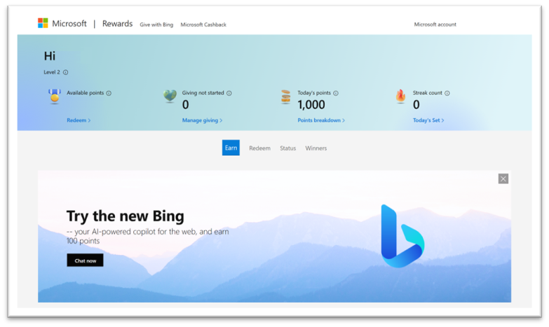

Rewards is an opt-in program. To turn off all Rewards experiences and data sharing, go to `edge://settings/profiles/rewards`, and turn off the **Earn Microsoft Rewards in Microsoft Edge** setting.

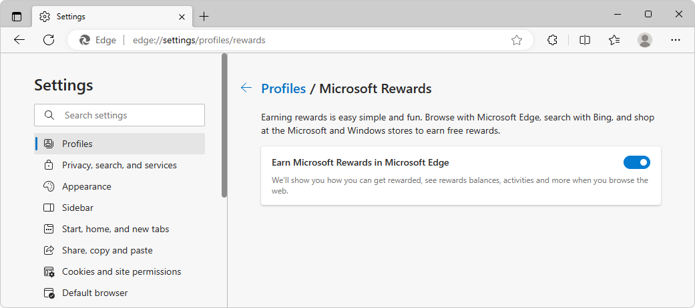

Offers may vary by market. 

#### How to earn

Microsoft Edge provides the greatest number of avenues to earn rewards points while browsing the web.

A _search_ is the act of an individual user manually entering text for the good faith purpose of obtaining Bing search results for the user's own research purposes, and does not include any query that's entered by a bot, macro, or other automated or fraudulent means of any kind ("Search").

An _acquisition_ is the process of purchasing goods or downloading and acquiring a license for digital content from Microsoft, whether free or paid ("Acquisition"). Rewards points are not offered for every purchase from Microsoft. Microsoft may offer additional opportunities to earn points from time to time, and each point-earning offer will not be available in perpetuity.

#### Redeeming your points

To redeem your points or contribute points to a listed nonprofit organization, go to the [redeem page](https://aka.ms/redeemrewards). You can also sign up for automatic contributions to non-profit organizations through a giving program.

#### Cancelling your participation

If you no longer want to participate in the Microsoft Rewards program, follow the instructions on the [opt out page](https://account.microsoft.com/rewards/optout?confirm=false). If you opt out, you will immediately lose all of your available points. 

See also:
* [Learn about Microsoft Rewards](https://support.microsoft.com/topic/learn-about-microsoft-rewards-c5ab735d-c6d9-4bb9-30ad-d828e954b6a9).
* The **Microsoft Rewards** section in the [Microsoft Services Agreement](https://www.microsoft.com/servicesagreement/).

<!-- ====================================================================== -->
## Search results data for product improvement 

In order to improve your experience in Microsoft Edge, Microsoft Bing, Microsoft News, and other Microsoft services, when the setting for this feature is enabled, Microsoft Edge will collect and use data from your web searches in Microsoft Edge. Microsoft will use your search results activity to make everyone's web and search experience better, more relevant, and useful. The data Microsoft collects is from searches you do across the web, including sites Microsoft doesn't own or operate.

* Microsoft Edge will scrub and de-identify the data by removing data identifying the person or device from which it was collected. 

* Microsoft doesn't use any information we collect to personalize or provide ads to you. 

* The data Microsoft collects is never associated with your account or your device. 

* This data collection and setting is not available on managed devices. 

The data Microsoft collects may include the search query, the search results that are displayed to you, and the interaction you have with those search results, such as the links you click. Microsoft may also collect demographic data. 

To manage the collection and use of your search results activity for product improvement, do the following: 

1. Open Microsoft Edge.

1. Select **Settings and more** > **Settings**. 

1. Select **Privacy, search, and services**. 

1. Under **Search and service improvement**, turn on or off the setting for **Help improve Microsoft products by sending the results from searches on the web**. 

If you stop sharing your data, Microsoft may continue to use previously collected search results data, but it will still be de-identified and not associated with you or your device.

<!-- ====================================================================== -->
## Secure DNS

When navigating to a website, the browser needs to look up the network address, such as `93.184.216.34`, to resolve the host name, such as `example.com`. Secure DNS performs this lookup using a service over an HTTPS connection to the DNS service provider. Secure DNS protects the lookups from modification or eavesdropping by attackers on the network.

By default, your current DNS service provider is used to avoid disruptions to your browsing. Not all service providers offer secure DNS. To avoid delays in browsing, if the secure DNS connection fails, Microsoft Edge attempts a DNS lookup with your current DNS service provider that is not encrypted.

Microsoft Edge allows you to use a specific secure DNS provider. If a secure DNS provider is selected, then Microsoft Edge does not fall back to regular DNS lookup if the secure lookup fails. You can control your secure DNS settings in `edge://setting/privacy`.

Secure DNS is `off` by default for managed machines that are part of an organization. It can be configured using administrative policies. **InPrivate** browsing uses the secure DNS setting of the profile from which the **InPrivate** session was launched. Guest mode will always use your current service provider.

<!-- ====================================================================== -->
## Shopping

Microsoft Edge helps you find coupons, rebates, and better prices while shopping online. To help you find coupons or the best price while shopping online, Microsoft Edge downloads a list of shopping domains locally to the client from the Microsoft shopping service.

When you go to a website, or save an item to your Collections, Microsoft Edge locally determines if the website you're on is a shopping domain or product detail webpage.  If the website is identified as a shopping webpage, Microsoft Edge sends the URL with personal data removed to the Microsoft shopping service.

Microsoft also sends the product price, product image, product name, ratings, and reviews, along with information about Microsoft Edge and your operating system version to the service.  The data is sent over HTTPS with a randomly generated identifier and cookies if cookies are allowed.

The Microsoft Edge shopping feature requires sharing of cookie information with Bing.  For example, the cookies may be used for debugging, fraud detection, and analytics.  The Microsoft shopping service returns prices from other retailers, historical price trends, and any available coupons for that website.

To help you find and keep track of coupons in your inbox, Microsoft Edge may optionally scan your connected email account for coupons in promotional emails. The Microsoft shopping service extracts coupons from promotional emails that are sent by supported retailers. The extracted coupons are stored and managed by the Microsoft shopping service and are accessible to you. Inbox coupons don't appear when using **Guest mode** or **InPrivate**.

The following steps assume that you have already connected your inbox.

To control which retailers' emails are scanned by Microsoft Edge:

1. In Microsoft Edge, click the **Settings and more** (**...**) button, and then select **Shopping**.  The **Shopping** sidebar appears.

1.  Click the **Your Shopping** tab.

1.  In the **Inbox coupons** card, click the **Settings** (**...**) button:

    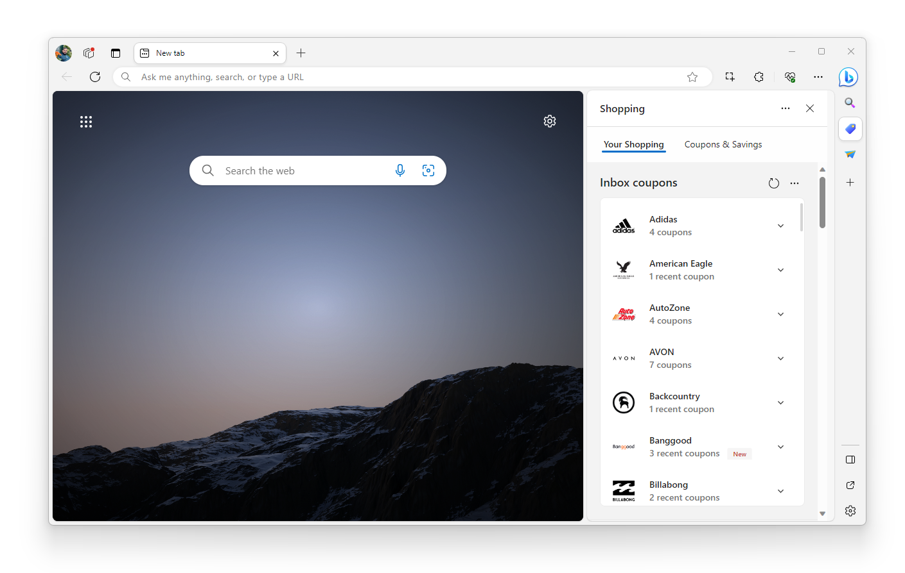

1.  In the **Retailers in your inbox** section, expand the section for a retailer, and then turn the toggle on or off:

    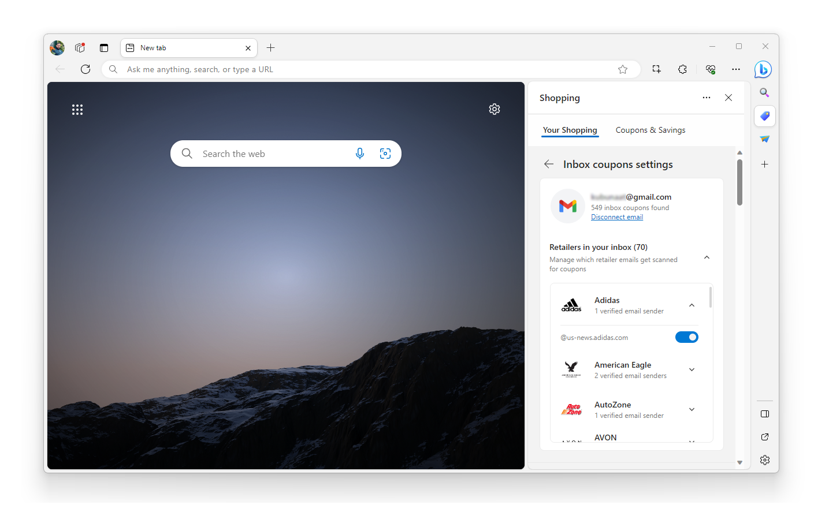

To turn off Inbox coupons:

1.  On the **Shopping** sidebar, click the **Your Shopping** tab.

1.  In the **Inbox coupons** card, click the **Settings** (**...**) button.

1.  Select an email account, and then click the **Settings** link.

1.  Click the **Disconnect email** button.

When you're applying coupons, cookies are stored on your device to correctly attribute the coupon provider.  Cookies are saved by Microsoft-trusted coupon providers only after a coupon is successfully applied on the cart.  After the coupons are applied, information about the success of the coupons is sent back to the Microsoft shopping service to help understand which coupons succeeded or failed.

Data sent to the Microsoft shopping service is sent over HTTPS with a randomly generated identifier that changes per coupon lookup. Microsoft Edge partners with Bing Shopping to provide coupons relevant to the user's query. In some instances, Microsoft may receive revenue for use of the coupons. Whether a revenue share payment may be received is not factored into the ranking of coupons shown to users.

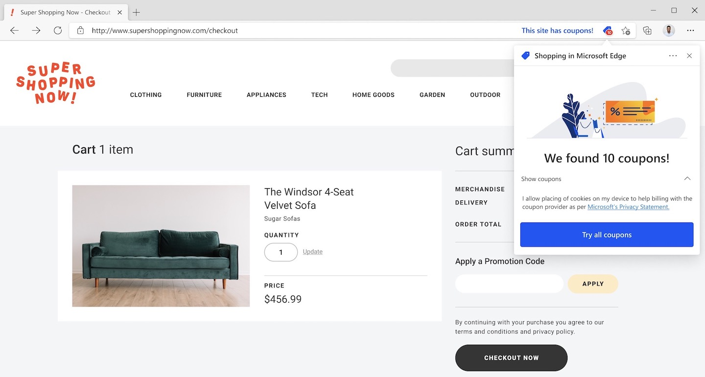

If you visit a shopping domain and you are an existing Bing Rebates user, Microsoft Edge sends the domain along with cookies to the Microsoft shopping service to retrieve your Bing Rebates profile and cash back offers for the domain.  If you choose to activate cash back, Microsoft Edge sends your URL to the Microsoft shopping service to receive an affiliate URL.  Cookies may be stored on your device to correctly attribute the rebates provider.

The shopping service is turned on by default for all users.  To change the shopping setting in Microsoft Edge, complete the following actions.

1.  Go to `edge://settings/privacy`.
1.  Turn off the **Save time and money with Shopping in Microsoft Edge** setting.

**InPrivate** browsing uses the shopping setting of the profile that launched the **InPrivate** session.

<!-- ====================================================================== -->
## Sign in and Identity

Signing in to Microsoft Edge provides many features to make the browser more productive. To sign in seamlessly when you first launch Microsoft Edge, it attempts to detect your identity from the operating system. If Microsoft Edge detects your identity from the operating system but you do not want to remain signed in to Microsoft Edge, go to `edge://settings/profiles` and either sign out or remove your profile.

If a new identity is added to the operating system and your Microsoft Edge profile does not currently have an identity, Microsoft Edge adds the specific identity to your profile. If you sign into Microsoft Edge with a Microsoft account or a work or school account and do not have an identity on your Windows profile, the account is added to your Windows profile unless you choose to not add it to Windows while signing in.

Being signed in to Microsoft Edge enables single sign-on. You are automatically signed in to certain websites such as Bing, and other identity-powered experiences such as Sync. If you want to limit automatic sign-in to Microsoft sites such as [Bing](https://bing.com), you may sign out of the browser.

To sign into specific sites again using your user name and password or clear your cookies, go to `edge://settings/privacy`. For more information about clearing browsing data, see [View and delete browser history in Microsoft Edge](https://support.microsoft.com/help/10607).

To prevent any identity from being associated with Microsoft Edge, remove your Microsoft Edge profile or sign out of Microsoft Edge. To delete all data associated with your Microsoft Edge profile from your device, you must remove your Microsoft Edge profile. Deleting all data does not delete previously synced data associated with the identity.

Your identity in Microsoft Edge on macOS is shared between Microsoft apps. A shared identity allows you to sign into a Microsoft app without having to separately enter your credentials if you are signed in to another Microsoft app on the device. On macOS, you aren't automatically signed in to Microsoft Edge based on your authentication state in another Microsoft app. When you try to sign into Microsoft Edge, it offers to use the credentials from another Microsoft app on the device to sign into Microsoft Edge seamlessly.  Similarly, when you are signed in to an account to Microsoft Edge, if you try to sign into other Microsoft apps, your Microsoft Edge credentials may be used to help you sign into the other Microsoft app on the device without requiring you to enter your credentials again.

You aren't able to sign into Microsoft Edge when using **Guest** mode or **InPrivate**.

<!-- ====================================================================== -->
## SmartScreen

SmartScreen is designed to help you safely browse the web.  When you go to websites or download files, SmartScreen checks the reputation of the URL or file.  If SmartScreen determines that the site or file is malicious, it blocks you from going to the site or downloading the file.

As you browse the web, SmartScreen categorizes websites and downloads as top traffic, dangerous, or unknown.  Top traffic is popular sites that SmartScreen has determined are trustworthy.  If you go to a site marked as dangerous, SmartScreen immediately blocks you from accessing the site.  When you go to an unknown site, SmartScreen checks the reputation to determine if you should access the site.

SmartScreen uses three types of reputation checks.

1. SmartScreen checks the URL of sites you visit against a local list to determine if the site is part of top traffic or is a known dangerous site. When you visit a top traffic site, SmartScreen does not send the URL to the SmartScreen service.  If the URL is on the local list of dangerous sites, SmartScreen blocks it, which prevents any portion of the malicious web content from loading.  Microsoft Edge periodically downloads an updated list of top traffic and dangerous sites to the device.

2. SmartScreen performs a synchronous reputation check of the URL.  SmartScreen checks on all URLs that aren't categorized as top traffic.  Microsoft Edge passes the URL, relevant information about the site, an identifier unique to your device, and general location information to the SmartScreen service to determine the safety of the site.  The information provided by Microsoft Edge allows the service to identify new dangerous sites and stay up to date with the latest security threats.  The results of URL checks are stored locally on the device and are automatically cleared at the end of the browser session.  All requests to the SmartScreen service are made with HTTPS encryption.

3. SmartScreen checks downloaded files to help prevent harm to your device.  SmartScreen performs a binary file reputation check synchronously as your download completes.  Microsoft Edge sends information about the file such as the file hash, file name, download URI, and an identifier unique to your device to SmartScreen to perform the reputation check.  All SmartScreen requests are made with HTTPS encryption.  The SmartScreen service sends back the result of the check, which allows the file to either fully download or not.  The results are stored locally on the device.

The SmartScreen service stores data about the reputation checks and builds a database of known malicious URLs and files.  The data is stored on secure Microsoft servers and is used only for Microsoft security services.  The data is never used to identify or target you in any way.  Clearing your browsing cache clears all locally stored SmartScreen URL data.  Clearing your download history removes any locally stored SmartScreen data about file downloads.

SmartScreen is turned on by default for Microsoft Edge.  To disable SmartScreen, go to `edge://settings/privacy` and under **Security** turn off the **Microsoft Defender SmartScreen** setting.  The setting is the same for all profiles associated with the installation of Microsoft Edge on your device.  The setting is not synced across devices.  The setting applies to InPrivate browsing and Guest mode.  If your device is managed with group policies set by your organization, the setting is reflected in Microsoft Edge.  To view the setting, go to `edge://settings/privacy`.  For more information about SmartScreen, see [SmartScreen: FAQ](https://support.microsoft.com/help/17443).

Optionally, SmartScreen checks the URLs of files you download to see if any are categorized as potentially unwanted apps.  Blocking potentially unwanted apps helps deliver more productive, performant, and delightful Windows experiences.  The setting is turned off by default and is only available on Windows 10 and later devices.  To enable the feature, go to `edge://settings/privacy` and turn on the **Block potentially unwanted apps** setting.  For more information about how potentially unwanted apps are categorized, see [Potentially unwanted application (PUA)](/windows/security/threat-protection/intelligence/criteria#potentially-unwanted-application-pua).  For more information about how to configure the setting, see [Detect and block potentially unwanted applications](/windows/security/threat-protection/windows-defender-antivirus/detect-block-potentially-unwanted-apps-windows-defender-antivirus).

<!-- ====================================================================== -->
## Speech recognition

To convert your speech into text, Microsoft Edge supports the [Web Speech API](https://wicg.github.io/speech-api).  If a website includes a web feature that requires capture and translation of your speech to text and requests access to your microphone, Microsoft Edge sends the captured audio to a Microsoft service where it is translated into text.  The recorded audio is sent with a randomly generated token over a secure HTTPS connection to the Microsoft Azure Cognitive Services.  The recorded audio content is not stored for any purposes.  The text is sent back to your device and then sent to the website.

To turn off speech translated to text, you may deny microphone access from any site that prompts for permission.  To turn off the Microphone permission for all sites, go to `edge://settings/content/microphone`.

<!-- ====================================================================== -->
## Suggest similar sites

To help resolve URL typos in the address bar that result in a website error, Microsoft Edge may recommend a corrected URL.  When a website navigation error occurs, Microsoft Edge sends the domain of the web address to the Microsoft service to suggest a corrected URL.  Microsoft Edge does not include identifiers or tokens with the domain.  If the service finds a suggestion, it returns the suggested URL.  Microsoft stores the incorrect domain, and suggested domain, to help improve the service.  To help you go to the correct sites, the feature is turned on by default.  To turn off the feature, go to `edge://settings/privacy` and under the **Services** turn off the **Suggest similar sites when a website can't be found** setting.

<!-- ====================================================================== -->
## Support nonprofits

Microsoft Edge allows you to support nonprofit organizations using Microsoft Rewards points or cash while browsing. When you are signed in to Microsoft Edge with your Microsoft account and navigate to a nonprofit website, the **Support nonprofits** icon appears on the right side of the Address bar. You can then click this icon to donate to the nonprofit organization.

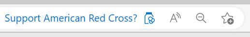
 
To control this feature, go to `edge://settings/privacy` and turn on or off the **Show opportunities to support causes and nonprofits you care about** setting.
 
Supporting nonprofits is not available when using **InPrivate** or **Guest** modes.

<!-- ====================================================================== -->
## Sync

Signing into Microsoft Edge with a Microsoft account will enable syncing your browsing data across all signed-in versions of Microsoft Edge. You can sync your browsing history, favorites, settings, form fill data including addresses and more, passwords, extensions, open tabs, and collections. Each synced data type may be turned on or off individually.

Favorites include any tabs you previously set aside in previous versions of Microsoft Edge, which sync along with the rest of your favorites. Deleted or modified favorites or other data from one signed-in version of Microsoft Edge sync to all other signed-in versions of Microsoft Edge where sync is turned on.  To manage sync configurations, go to `edge://settings/profiles/sync`.  Your sync settings may be managed by your organization.

For sync to function, all device connectivity and configuration data needed to provide the sync experience is sent to Microsoft. Sync data includes the name of your device, make, and model. To delete sync data, see [Microsoft device dashboard](https://account.microsoft.com/devices). To manage your synced favorites, go to `edge://favorites`. To manage all other data types, go to `edge://settings/profiles`.

When you sign into Microsoft Edge with your Microsoft account or work or school account, Microsoft Edge will store your preferences for your data privacy settings in Microsoft's servers. Microsoft Edge will only use the stored settings to make it easier for you to migrate your experience when you start using Microsoft Edge on a different device, or when you sign in to Microsoft Edge.

All synced data is encrypted in transit over HTTPS when transferred between the browser and Microsoft servers.  The synced data is also stored in an encrypted state in Microsoft servers.  Sensitive data types such as addresses and passwords are further encrypted on the device before being synced.  If you are using a work or school account, all data types are further encrypted before being synced using Microsoft Purview Information Protection.  All other synced data types are stored until you delete the data, the account is deleted, or the account becomes inactive.  An account ID is attached to all synced data, as the ID is necessary to perform sync across multiple devices.

InPrivate and Guest mode browsing data does not sync to your Microsoft account.  However, favorites created during InPrivate sessions are synced across your signed-in versions of Microsoft Edge.

<!-- ====================================================================== -->
## Tab organization

Microsoft Edge offers helpful suggestions on how to organize tabs to save you time and keep you focused on the web content you care about. These suggestions augment the Tab Grouping feature that's built into Microsoft Edge.

When two or more tabs are grouped together, Microsoft Edge sends information about the tabs, including the Title and URL, to the Tabs service over HTTPS.  This information is used to generate a relevant name for the Tab Group.

You can also choose to have Microsoft Edge auto-group all of your tabs, by using the **Group Similar Tabs** feature from the **Tab Action** menu.  In addition to the Title and URL, Microsoft Edge also sends information about which tabs opened another tab, and a timestamp of when a tab was opened.  This additional data allows the service to more accurately suggest Tab Groups, to organize your tabs.

All tab information that's sent to Microsoft is deleted immediately after processing occurs. No data is stored for any period of time. 

The Microsoft Edge Tab organization behavior is turned on by default. To turn this behavior off, go to `edge://settings/privacy` and under **Services** turn off the **Let Microsoft Edge help keep your tabs organized** setting:

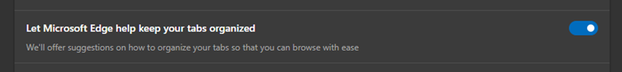

When the Tab Organization service is turned off, new Tab groups are given a generic name such as **Group 1**, and you can then rename the Tab group to be more descriptive.  The option to automatically **Group Similar Tabs within the Tab Action Menu** will be turned off.

See also:
* [Tab groups](https://www.microsoft.com/edge/features/tab-groups)

<!-- ====================================================================== -->
## Tips and recommendations

Microsoft Edge wants to provide you with relevant tips and recommendations to get the best experience using the browser.  Microsoft Edge uses available device connectivity and configuration data to provide relevant tips and recommendations.  This data will consist of your operating system, locale, browser settings, and other device connectivity and configuration data.  This data is sent over a secure HTTPS connection with a resettable identifier unique to your browser.  For Windows 10 and later devices while Microsoft Edge is being set up, we honor tailored experiences in Windows.  [Learn more about tailored experiences in Windows](https://support.microsoft.com/help/4468236/diagnostics-feedback-and-privacy-in-windows-10-microsoft-privacy).

This data is not sent during InPrivate browsing or Guest mode.

<!-- ====================================================================== -->
## Tracking prevention

Microsoft Edge is designed to detect and block known trackers.  Users may choose from three levels of tracking prevention: Basic, Balanced, and Strict.  To protect user privacy, Balanced is selected by default.  Microsoft Edge detects trackers before any are loaded on the page by using an open-source list of known trackers.  The list is downloaded to the device periodically as the list is updated.  The number of trackers blocked and names of those trackers are stored locally on the device for statistical purposes.  To clear the data, go to `edge://settings/privacy/blockedTrackers`.  The detection and blocking of trackers occurs locally on the device.  To disable tracking prevention, go to `edge://settings/privacy`.  For more information about Tracking prevention, see [Learn about tracking prevention in Microsoft Edge](https://support.microsoft.com/help/4533959).

You may turn off list updates using the following group policy, [Enable component updates in Microsoft Edge](/deployedge/microsoft-edge-policies#componentupdatesenabled).

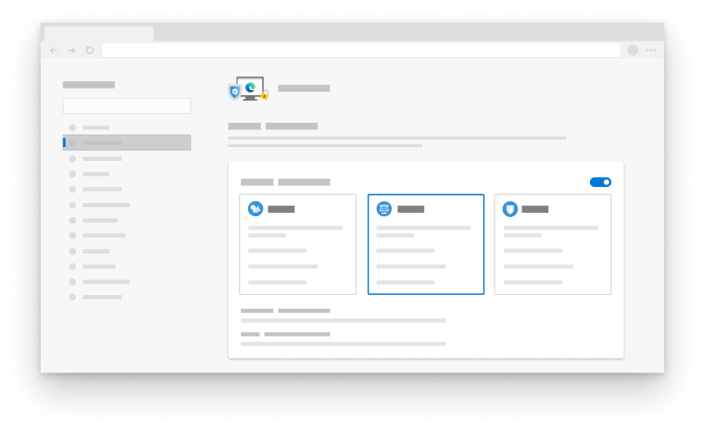

<!-- ====================================================================== -->
## Translate

In Microsoft Edge, you can browse the web and translate webpages into a language of your choice. Microsoft Edge uses [Microsoft Translator](https://azure.microsoft.com/services/cognitive-services/speech-translation/) to translate web pages. This feature at first uses a library on your device that samples certain visible portions of a webpage to detect the original language. If the detected language is not one of your preferred languages, Microsoft Edge offers to translate the webpage to your preferred language or another language you choose. You can then translate the page by selecting **Translate**. You can autotranslate all pages in that language by choosing the **Always translate the pages from \<a language\>** checkbox.

Microsoft Edge does not translate a webpage without your permission. If you do decide to translate, Microsoft Edge sends the text of the webpage you want to translate, along with the *to* and *from* language and a service token to Microsoft Translator over a secure HTTPS connection. The service token doesn't contain any user identifiable information. [Microsoft Translator](https://azure.microsoft.com/services/cognitive-services/speech-translation/) then processes the text to remove any identifiers (such as email or phone number) and stores the text for service improvement purposes. The details of this communication are covered under [Microsoft Privacy Statement – Microsoft privacy](https://privacy.microsoft.com/privacystatement).

If you want to stop Microsoft Edge from offering to translate webpages, complete the following steps.

1. Go to `edge://settings/languages`.
1. Turn off the **Offer to translate pages that aren't in a language you read** toggle and close the webpage.

<!-- ====================================================================== -->
## Web apps and Pinned sites

Microsoft Edge lets you install web apps made by website developers and pin your favorite sites.

When you pin a site, it is added to your taskbar or dock.  The data is stored locally on your device.  For some sites, information about whether the site has been pinned is shared with the site, so the site knows not to prompt to pin.  You may manage your pinned sites from the taskbar or dock.  Pinned sites open in Microsoft Edge windows and use the same site permissions and diagnostic data settings as the specific version of Microsoft Edge.

<!-- ====================================================================== -->
## WebView

Microsoft Edge WebView controls allow app developers to host web content in native applications on Windows 7, Windows 10, and later; and selected non-Windows platforms. The applications hosting the WebView2 instance may send diagnostic data with its own identifier to Microsoft. Diagnostic data can include how you use the Microsoft Edge, and sites you visit.

To enable diagnostic data collection, go to `edge://settings/privacy`. Turn on the **Optional diagnostic data** setting. To turn off diagnostic data collection for Microsoft Edge on Windows 10 and later, open **Start** > **Settings** > **Privacy** and select **Diagnostics & feedback**. To turn off diagnostic data collection for all other platforms, go to `edge://settings/privacy`. Turn off the **Help improve Microsoft products by sending optional diagnostic data about how you use the browser, websites you visit, and crash reports** setting. The applications hosting Microsoft Edge WebView may collect other data that is governed by the data collection management of the developer and relevant privacy policies.

<!-- ====================================================================== -->
## Workspaces

The Microsoft Edge Workspaces feature allows you to easily organize and share your browsing tasks with collaborators via customizable, shareable browsing windows. Each workspace shares favorites, a set of workspace tabs, and history, all created and curated by you and your collaborators. Workspace data is automatically saved, kept up-to-date, and stored in OneDrive/SharePoint.

Microsoft Edge Workspaces shares tabs, favorites, and history with collaborators in real-time. Collaborators' profile pictures are used to indicate which workspace tab they are using and which workspace tabs they have opened, changed, or closed. Collaborators cannot see how you interact with a webpage (workspaces don't screen-share).

Collaborators cannot see password-protected content unless they sign in and they have access via their own credentials. Microsoft Edge Workspaces doesn't store or share browsing data from non-workspace browsing sessions. If you leave a workspace, the stored contents remain available for other collaborators. If you delete a workspace, the stored contents are deleted for all collaborators.

Microsoft Edge Workspaces is only available for enterprise customers who are signed into Microsoft Edge with a Microsoft Entra ID account.  Workspaces aren't available when using Guest mode or InPrivate browsing. 

<!-- ====================================================================== -->
## Writing assistance

To help you write faster and with fewer mistakes on the web, Microsoft Edge provides writing assistance tools, including spell checking, grammar checking, and text prediction. 

By default, Microsoft Edge provides spelling and grammar checking using **Microsoft Editor**. When using **Microsoft Editor**, Microsoft Edge sends your typed text and a service token to a Microsoft cloud service over a secure HTTPS connection. The service token doesn't contain any user-identifiable information. A Microsoft cloud service then processes the text to detect spelling and grammar errors in your text. All your typed text that's sent to Microsoft is deleted immediately after processing occurs. No data is stored for any period of time.

If you select **Basic** instead of **Microsoft Editor**, Microsoft Edge will perform only local spellchecking on the device, and no data will be sent to the cloud for spellchecking services.

To use **Basic** spelling and grammar checking: 
1. Go to `edge://settings/languages`.
1. In the **Use writing assistance** section, select **Basic**.

To turn off all spelling and grammar capabilities:
1. Go to `edge://settings/languages`.
1. Turn off the **Use writing assistance** toggle.

<!-- ------------------------------ -->
#### Languages

When you add a new language to Microsoft Edge, the browser downloads the dictionary for the new language to the device over HTTPS. The dictionary is used for the basic spellcheck service or for languages that aren't supported by Microsoft Editor spelling and grammar checking. Deleting the language from your Microsoft Edge settings deletes the dictionary from the device. 
 

<!-- ------------------------------ -->
#### Text prediction 

Microsoft Edge automatically provides word and sentence predictions in certain text boxes on the web. These predictions are only visible to you and are not inserted into the text box until you press **Tab** or the **Right Arrow** key to accept them. Password fields will not offer text predictions.

To turn off text predictions in Microsoft Edge: 

1. Go to `edge://settings/languages`.

2. Turn off the **Use text prediction** toggle.

If the **Use text prediction** toggle is turned on, Microsoft Edge sends the text in the text box, your top language from the browser setting, and a text box identifier to a Microsoft cloud service over a secure HTTPS connection. The text box identifier is not associated with your account. The Microsoft cloud service processes the text to generate a relevant text prediction. Typed characters and text predictions are cached for up to 30 days, for service quality and performance improvement purposes only.  

If you are browsing while using **InPrivate** or **Guest** mode, text prediction is turned off. Text prediction does not run when you are editing a password field.

If your device is managed by using group policies set by your organization, the feature may be disabled depending on the administrator's policies of your organization.  

Text prediction is only available in select languages and regions.

<!-- ------------------------------ -->
#### Windows Ink

Windows Ink allows you to write with a digital pen directly into an input field on Windows 11 touch devices.  This helps you stay in your workflow by reducing the need to switch back and forth between the keyboard and a digital pen.  Supported fields include text boxes, `contenteditable` elements, and the Address bar.  Password fields are not supported.

Windows Ink supports the following writing tasks:

| Task | How to accomplish | Before | After |
|---|---|---|---|
| Insert text | Write in or near the text box. |  | 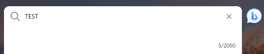 |
| Delete text | Scribble over the words that you want to delete. | 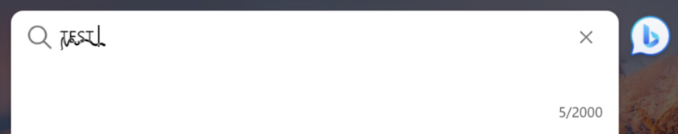 | |
| Add space | Draw a vertical line where you want a space to be inserted. |  | 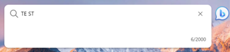 |
| Remove space | Draw a vertical line on the space that you want to remove. | 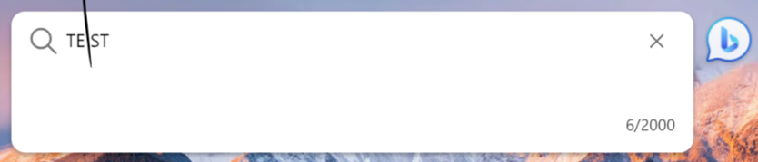 | 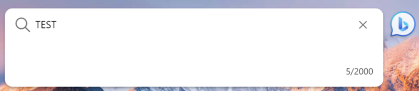 |
| Select text | Draw a horizontal line across the text to select. |  |  |
| Add newline | Draw a "backwards L" at the end of a line of text. |  |  |

Aggregate feature usage data is collected to measure frequency of usage and latency.  Text that you've inputted and personal identifiers are not sent to Microsoft.

To opt out of Windows Ink for Microsoft Edge, go to `edge://settings/content/HandwritingToText`, and then in the **Site permissions > Handwriting To Text** section, turn off the **Turn handwriting into text on input fields** toggle.

To disable Windows Ink for an entire Windows device, go to **Settings > Bluetooth & devices > Pen & Windows Ink > Shell Handwriting**, and then turn off the **Use your handwriting to enter text** toggle.

<!-- ====================================================================== -->
## Thank you!

Microsoft Edge is made possible by the [Chromium](https://www.chromium.org) open-source project and other open-source software.  To view all of the software credits, go to `edge://credits`.  [Google Chrome Privacy Whitepaper](https://www.google.com/chrome/privacy/whitepaper.html) was used as a source for gathering related information about the Chromium open-source project.

<!-- ====================================================================== -->
## Getting in touch with the Microsoft Edge team

The Microsoft Edge team is always listening to customers and values your feedback.  To provide feedback in Microsoft Edge, open **Settings and more** > **Help and feedback** and select **Send feedback**.  For Progressive Web Apps (PWAs), open **Settings and more (...)** and select **Send feedback to Microsoft**.  Provide details about the feedback, but all other information is optional.

If an email is detected from your Microsoft Edge profile, it is pre-populated with the URL of the current site and relevant diagnostic data. The diagnostic data can include data about Microsoft Edge features you turned on and your browser use. You may optionally include a screenshot, files from your device, and recording of your browser may also be optionally included. If you provide optional content, it can include personal data. The data is only used for diagnostic and product improvement purposes.

User feedback is securely sent to Microsoft using HTTPS and stored on secure Microsoft servers.  If you include your email address and the **Help improve Microsoft products by sending optional diagnostic data about how you use the browser, websites you visit, and crash reports** setting is turned on in your Microsoft Edge privacy settings, an identifier unique to your browser installation on your device is associated with your feedback.  If you're signed in to Microsoft Edge with your Microsoft account, your feedback is associated with your account.  All diagnostic data, including diagnostic logs, recordings, and attachments, are stored for up to 30 days.  The remaining feedback data, including an optional screenshot, is stored for up to 15 months.  Make a [request](https://www.microsoft.com/concern/privacy) to delete your feedback if you provided an email with your feedback item.
