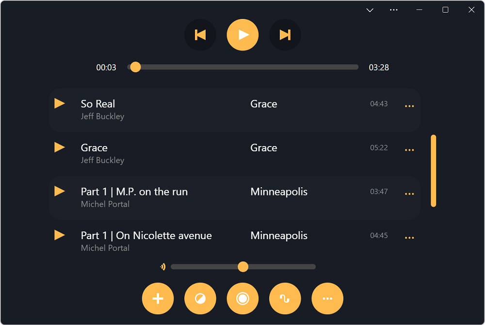
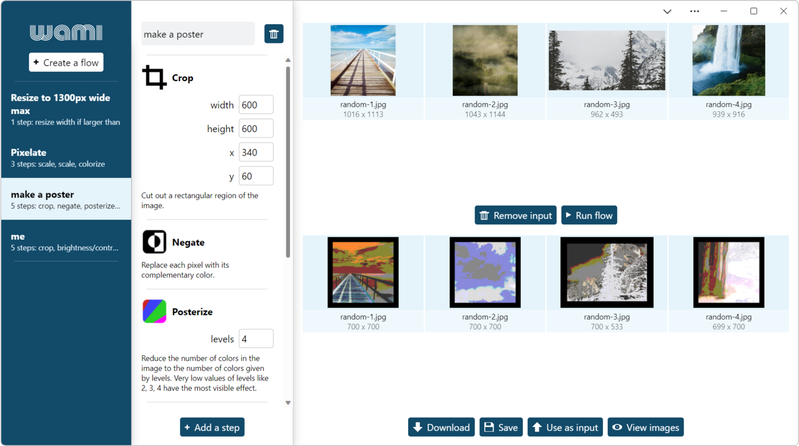
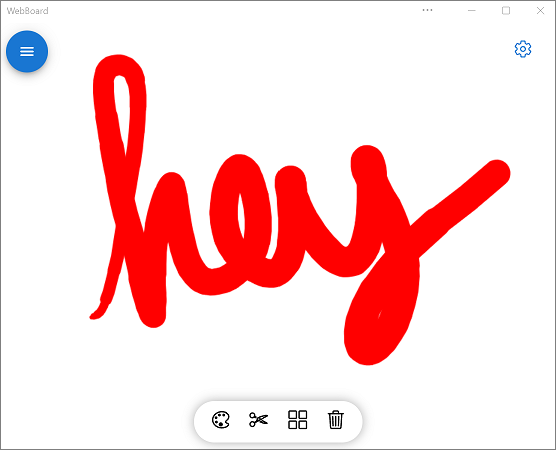
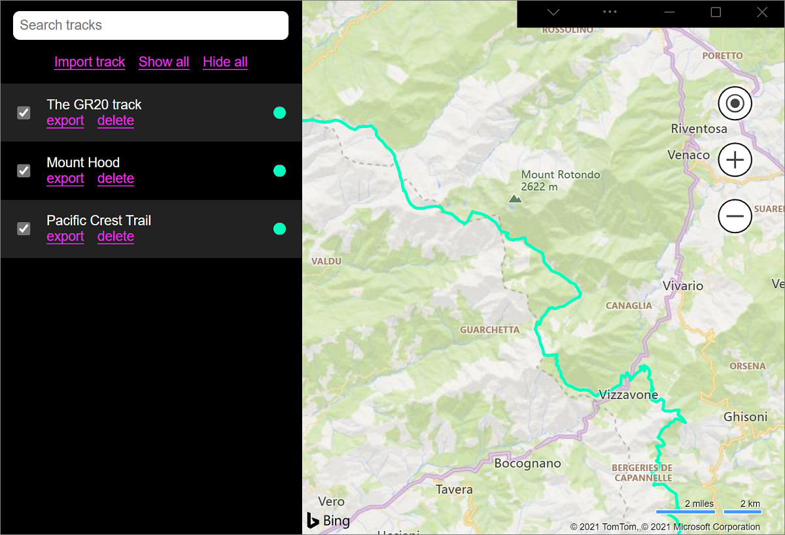
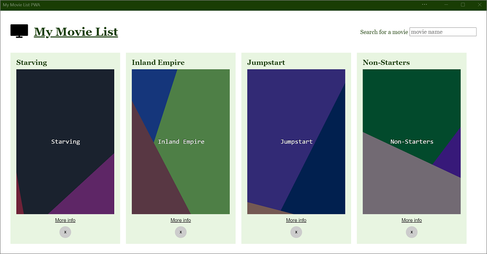
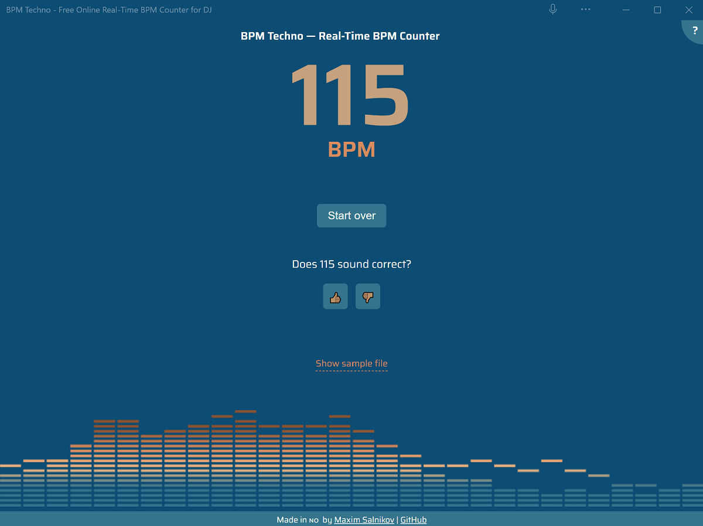
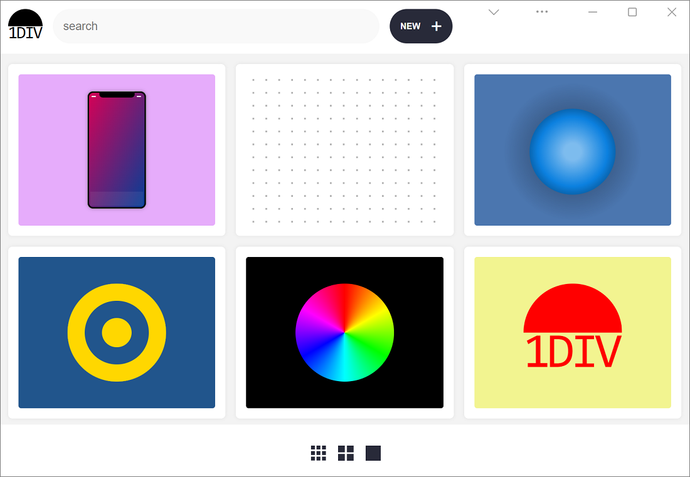

# Progressive Web App demos

Refer to these demo PWAs to learn how to use features and APIs that can progressively enhance your apps when installed on devices.

<!-- ====================================================================== -->
## PWAmp

PWAmp is a desktop music player that plays local and remote audio files.

[App](https://microsoftedge.github.io/Demos/pwamp/), [source code and Readme file](https://github.com/MicrosoftEdge/Demos/tree/main/pwamp).

PWAmp uses the following features:

| Feature | Description | Documentation |
|:--- |:--- |:--- |
| Window Controls Overlay | The space normally reserved to the title bar can be used by PWAmp to display a visualization of the current song. | [Display content in the title bar](how-to/window-controls-overlay.md) |
| Protocol Handling | Links that start with `web+amp:` can be used to share remote songs. | [Handle protocols in Progressive Web Apps](how-to/handle-protocols.md) |
| File Handling | Audio files can be opened with PWAmp directly. Right-click on a file ending with `.mp3` for example and click **Open with**. | [Handle files in Progressive Web Apps](how-to/handle-files.md) |
| Web Share | Songs can be shared with other apps through the operating system sharing dialog. | [Sharing content](how-to/share.md#sharing-content) |
| Share Target | Other apps can share audio files with PWAmp, through the operating system sharing dialog. | [Receiving shared content](how-to/share.md#receiving-shared-content) |
| Widget | A mini-player Widget can be installed in Windows 11 Widgets dashboard to see the current song. | [Build PWA-driven Widgets](how-to/widgets.md) |
| Sidebar | PWAmp can be pinned to the sidebar in Microsoft Edge. | [Build Microsoft Edge sidebar PWAs](how-to/sidebar.md) |

<!-- ====================================================================== -->
## Wami

Wami can apply a sequence of image manipulation steps such as cropping, resizing, rotating, or adding effects on batch of images.

[App](https://microsoftedge.github.io/Demos/wami/), [source code and Readme file](https://github.com/MicrosoftEdge/Demos/tree/main/wami).

Wami uses the following features:

| Feature | Description | Documentation |
|:--- |:--- |:--- |
| Window Controls Overlay | The space normally reserved to the title bar can be used by wami. | [Display content in the title bar](how-to/window-controls-overlay.md) |
| File System Access | Wami can save transformed images back to disk. | [File System Access API](https://developer.mozilla.org/docs/Web/API/File_System_Access_API) |

<!-- ====================================================================== -->
## Webboard

Webboard is a drawing application.

[App](https://webboard.app/), [source code and Readme file](https://github.com/pwa-builder/web-whiteboard).

Webboard uses the following features:

| Feature | Description | Documentation |
|:--- |:--- |:--- |
| Web Share | Drawings can be shared with other apps through the operating system sharing dialog. | [Sharing content](how-to/share.md#sharing-content) |

<!-- ====================================================================== -->
## My Tracks

My Tracks is useful for visualizing GPS tracks (`*.gpx` files) on a map.

[App](https://captainbrosset.github.io/mytracks/), [source code and Readme file](https://github.com/captainbrosset/mytracks).

My Tracks uses the following features:

| Feature | Description | Documentation |
|:--- |:--- |:--- |
| Window Controls Overlay | The space normally reserved to the title bar is used by My Tracks to display its own search bar. | [Display content in the title bar](how-to/window-controls-overlay.md) |
| Protocol Handling | My Tracks handles URIs that start with the `geo:` protocol to show locations on the map. | [Handle protocols in Progressive Web Apps](how-to/handle-protocols.md) |
| File Handling | My Tracks natively handles `*.gpx` files. | [Handle files in Progressive Web Apps](how-to/handle-files.md) |
| Shortcuts | My Tracks defines shortcuts to easily hide and show all tracks from the map. | [Define app shortcuts](how-to/shortcuts.md) |

<!-- ====================================================================== -->
## My Movies

This simple PWA demo lets you search for made up movies and store them locally.

[App](https://quirky-rosalind-ac1e65.netlify.app/), [source code](https://github.com/captainbrosset/movies-db-pwa).<!-- todo: link to readme -->

My Movies uses the following features:

| Feature | Description | Documentation |
|:--- |:--- |:--- |
| Background Sync | If the user is offline when displaying more information about a movie, the app uses Background Sync to retrieve the information later when the user is back online. | [Use the Background Sync API to synchronize data with the server](how-to/background-syncs.md#use-the-background-sync-api-to-synchronize-data-with-the-server) |
| Notifications | When the information about a movie is retrieved, a notification is sent so the user can re-engage with the app. | [Display notifications in the action center](how-to/notifications-badges.md#display-notifications-in-the-action-center) |

<!-- ====================================================================== -->
## BPM Techno

BPM Techno analyzes audio via the device microphone and displays a real-time beats-per-minute (BPM) counter.

[App](https://bpmtech.no/), [source code and Readme file](https://github.com/webmaxru/bpm-counter).

BPM Techno uses the following features:

| Feature | Description | Documentation |
|:--- |:--- |:--- |
| Shortcuts | BPM Techno defines a shortcut that lets users upload an audio file in the app. | [Define app shortcuts](how-to/shortcuts.md) |
| File Handling | BPM Techno natively handles `*.mp3` files. | [Handle files in Progressive Web Apps](how-to/handle-files.md) |
| Share Target | Other apps can share audio files with BPM Techno, through the operating system sharing dialog. | [Receiving shared content](how-to/share.md#receiving-shared-content) |
| Protocol Handling | The app handles `web+bpm:` URIs which can be used to send links to a song to be analyzed. | [Handle protocols in Progressive Web Apps](how-to/handle-protocols.md) |

<!-- ====================================================================== -->
## 1DIV

1DIV is a CSS editor that lets users create drawings with just one HTML element and CSS code.

[App](https://microsoftedge.github.io/Demos/1DIV/dist/), [source code and Readme file](https://github.com/MicrosoftEdge/Demos/tree/main/1DIV).

1DIV uses the following features:

| Feature | Description | Documentation |
|:--- |:--- |:--- |
| Window Controls Overlay | 1DIV uses the space normally reserved by the title bar to display a logo, search field, and button. | [Display content in the title bar](how-to/window-controls-overlay.md) |

<!-- ====================================================================== -->
## See also

* [Download or clone the Demos repo](../devtools-guide-chromium/sample-code/sample-code.md#download-or-clone-the-demos-repo) in _Sample code for DevTools_.
