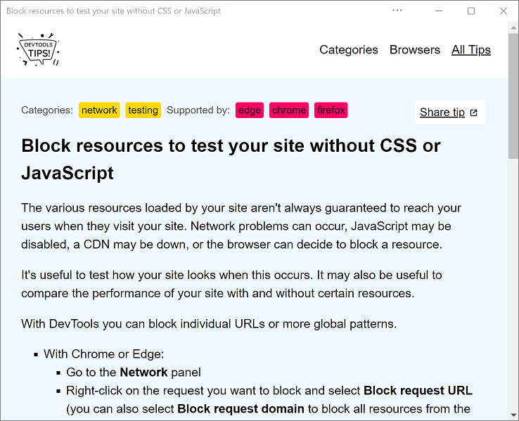

# Sample PWAs

Use these sample Progressive Web Apps (PWAs) to learn how to use features and APIs for PWAs.

<!-- ====================================================================== -->
## PWAmp

A desktop music player app.

[App](https://microsoftedge.github.io/Demos/pwamp/), [source code and Readme file](https://github.com/MicrosoftEdge/Demos/tree/main/pwamp).

Features:

*  [Window Controls Overlay](how-to/window-controls-overlay.md)
*  [Protocol handling](how-to/handle-protocols.md)
*  [File handling](how-to/handle-files.md)
*  [Web Share](how-to/share.md#sharing-content)
*  [Share Target](how-to/share.md#receiving-shared-content)

<!-- ====================================================================== -->
## Webboard

An intelligent whiteboarding app.

[App](https://webboard.app/), [source code and Readme file](https://github.com/pwa-builder/web-whiteboard).

Features:

*  [Shortcuts](how-to/shortcuts.md)
*  [Web Share](how-to/share.md#sharing-content)
*  [Share Target](how-to/share.md#receiving-shared-content)

<!-- ====================================================================== -->
## DevTools Tips

Displays a list of tips and tricks for DevTools.

[App](https://devtoolstips.org), [source code and Readme file](https://github.com/captainbrosset/devtools-tips).

Features:

*  [Web Share](how-to/share.md#sharing-content)
*  [URL handling](how-to/handle-urls.md)
*  [Background sync](how-to/background-syncs.md#use-the-background-sync-api-to-synchronize-data-with-the-server)
*  [Periodic background sync](how-to/background-syncs.md#use-the-periodic-background-sync-api-to-regularly-get-fresh-content)
*  [Notifications](how-to/notifications-badges.md#display-notifications-in-the-action-center)

<!-- ====================================================================== -->
## My Tracks

A Progressive Web App for visualizing GPS tracks.

[App](https://captainbrosset.github.io/mytracks/), [source code and Readme file](https://github.com/captainbrosset/mytracks).

Features:

*  [Window Controls Overlay](how-to/window-controls-overlay.md)
*  [Protocol handling](how-to/handle-protocols.md)
*  [Shortcuts](how-to/shortcuts.md)
*  [File handling](how-to/handle-files.md)

<!-- ====================================================================== -->
## My Movies

A Progressive Web App to search and store movies.

[App](https://quirky-rosalind-ac1e65.netlify.app/), [source code](https://github.com/captainbrosset/movies-db-pwa).<!-- todo: link to readme -->

Features:

*  [Background sync](how-to/background-syncs.md#use-the-background-sync-api-to-synchronize-data-with-the-server)
*  [Notifications](how-to/notifications-badges.md#display-notifications-in-the-action-center)

<!-- ====================================================================== -->
## BPM Techno

A real-time beats-per-minute (BPM) counter.

[App](https://bpmtech.no/), [source code and Readme file](https://github.com/webmaxru/bpm-counter).

Features:

*  [Shortcuts](how-to/shortcuts.md)
*  [URL handling](how-to/handle-urls.md)
*  [File handling](how-to/handle-files.md)
*  [Protocol handling](how-to/handle-protocols.md)
*  [Share Target](how-to/share.md#receiving-shared-content)

<!-- ====================================================================== -->
## 1DIV

A CSS playground.

[App](https://microsoftedge.github.io/Demos/1DIV/dist/), [source code and Readme file](https://github.com/MicrosoftEdge/Demos/tree/main/1DIV).

Features:

*  [Window Controls Overlay](how-to/window-controls-overlay.md)

