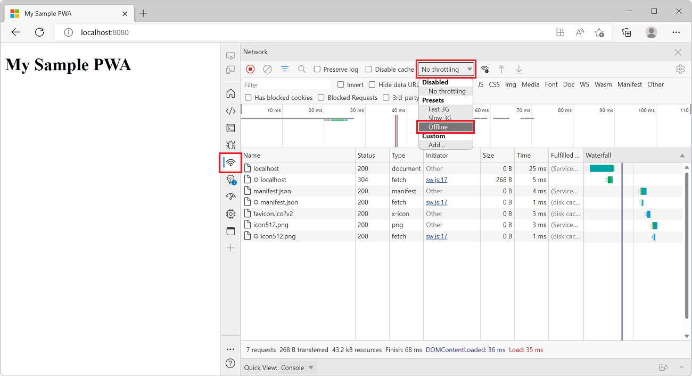

# Get started with Progressive Web Apps  

Progressive Web Apps \(PWAs\) are web apps that are [progressively enhanced][WikiProgressiveEnhancement] with app-like features, such as installation, offline support, and push notifications. PWAs can also be packaged for app stores, including the Microsoft Store, Google Play, Mac App Store and more.

This guide gives you an overview of PWA basics by creating a simple web app and extending it to be a PWA. The finished product works similarly across modern browsers.

> [!TIP]
> You can use [PWABuilder][PwaBuilder] to create a new PWA, enhance your existing PWA, or package your PWA for app stores.

## Prerequisites  

In this article we'll be using [VSCode](https://code.visualstudio.com) to edit our PWA source code. 

Additionally, we'll use [Node.js](https://nodejs.org/en/) as our local web server.

## Set up a basic web app  

To get started with an empty web app, we'll generate one using [Node Express App Generator](https://expressjs.com/en/starter/generator.html). Create a new directory, `MySamplePwa` and open a new PowerShell prompt there.

In the prompt, type the following commands:

```
npx express-generator --no-view
```
```
npm install
```

This will create an empty web app and install its dependencies.

Now we have a simple, functional web app. To run it, type the following command: 

```
npm start
```

You can now browse to `http://localhost:3000` to view your new web app.
    
![Running your new web PWA on localhost][ImageVsNodejsExpressIndex]  

## Turn your app into a PWA  

Now that we have a simple web app, let's extend it to be a PWA by adding the [3 requirements for PWAs][PwaEdgehtmlIndexRequirements]: *HTTPS*, a *Web App Manifest*, and a *Service Worker*.  

### HTTPS  

Key parts of the PWA platform, such as [Service Workers][MDNServiceWorkerApi], require the use of HTTPS. When your PWA goes live, you'll need to publish it to an HTTPS URL.

For debugging purposes, Edge also permits `http://localhost` to use the PWA APIs.

If you [publish this web app as a live site][VisualStudioNodejsTutorialPublishAzureAppService] \(for example, by setting up an [Azure free account][AzureCreateFreeAccount]\), you must ensure your server is configured for HTTPS.  If you use the [Microsoft Azure App Service][AzureWebApps] to host your site, it is served over HTTPS by default.  

For this guide, we'll use `http://localhost` to build our PWA.  

### Web App Manifest  

A [Web App Manifest][MDNWebAppManifest] is a JSON file containing metadata about your app, such as name, description, icons, and more.

To add an app manifest to the web app:

1. In VS Code, go **File** > **Open Folder** and choose the `MySamplePwa` directory you created earlier.
2. Ctrl+N to create a new file, and paste in the following:


    ```json
    {
        "lang": "en-us",
        "name": "My Sample PWA",
        "short_name": "SamplePWA",
        "description": "A sample PWA for testing purposes",
        "start_url": "/",
        "background_color": "#2f3d58",
        "theme_color": "#2f3d58",        
        "orientation": "any",
        "display": "standalone",
        "icons": [
            {
                "src": "/icon512.png",
                "sizes": "512x512"
            }
        ]
    }
    ```  

3. Save the file as `/MySamplePwa/public/manifest.json`.

4. Add a 512x512 app icon image named `icon512.png` to `/MySamplePwa/public/images`. You may use [this image][ImagePwa] for testing.

5. In VS Code, open `/public/index.html`, and add the following code inside the `<head>`
    ```html
    <link rel="manifest" href="/manifest.json">
    ``` 

### Service Worker  

Service workers are the key technology behind PWAs, enabling scenarios like offline support, advanced caching, and background tasks previously limited to native apps.

A service worker is a special JavaScript file that intercepts network requests from your web app and can serve the requested resources from a cache. Service workers run in the background and can perform tasks like push notifications, background fetch, icon badging, and more -- even when your PWA isn't running.

For more info, see the comprehensive [Using Service Workers][MDNUsingServiceWorkers] guide and [Service Worker API][MDNServiceWorkerApi] reference.  

For this tutorial, we'll use the **Cache-first network** service worker recipe from [PWA Builder][PwaBuilderServiceWorker].

1.  Open [pwabuilder.com/serviceworker][PwaBuilderServiceWorker] and select the **Cache-first network** service worker and click the **Download** button.  
1.  The download contains 2 files:

    *   pwabuilder-sw-register.js  
    *   pwabuilder-sw.js  
    
    Copy those files to the `public` folder in VS Code web app project.
    
1.  In VS Code, open `/public/index.html` and append the following line to your `<head>`:  
    
    ```html
    <script src="/pwabuilder-sw-register.js"></script>
    ```  
    
Your web app now has a service worker that uses the cache-first strategy: fetching resources like images, JS, CSS, and HTML from the cache first, and falling back to the network as needed. 

Let's try it out:
    
1. Your app should already be running on `localhost:3000`. If not, go ahead and run `npm start` from the command line. 
    
2. With the web app opened in Edge, press F12 to open the dev tools. Click **Application**, then **Service Workers** to view the service worker:
        
    ![Edge DevTools Service Worker overview][ImageDevtoolsSwOverview]

    If you don't see the service worker, you may need to refresh the page.
    
3. View the service worker cache by expanding **Cache Storage** and clicking **pwabuilder-precache**:
    ![Service Worker cache in F12 dev tools][ImageDevtoolsSwCache]
    You should see all the resources cached by the service worker, such as the app icon, app manifest, CSS and JS files.

4.  Try your PWA as an offline app. In F12 dev tools, choose **Network** then change the **Online** status to **Offline**:
    
    

5. Reload your app - you will see it's working offline, still serving your app's resources from the cache:
    ![PWA running offline thanks to service worker][ImageVsNodejsExpressIndex] 


## Add push notifications  

Make your PWA more app-like by adding client-side support for push notifications using the [Push API][MDNPushApi] to subscribe to a messaging service and the [Notifications API][MDNNotificationsApi] to display a toast message upon receiving a message.  As with Service Workers, these are standards-based APIs that work cross-browser, so you only have to write the code once for it to work everywhere PWAs are supported.  On the server side, use the [Web-Push][NPMWebPush] open-source library to handle the differences involved in delivering push messages to various browsers.  

The following is adapted from the Push Rich Demo in [Service Worker Cookbook][ServiceWorkerCookbookPushRichDemo] provided by Mozilla, which is worth checking out for a number of other useful Web Push and service worker recipes.  

### Step 1 - Generate VAPID keys 

Push notifications require VAPID \(Voluntary Application Server Identification\) keys in order to send push messages to the PWA client.

There are several VAPID key generators available online; you may use [vapidkeys.com](https://vapidkeys.com). 

The output should result in a JSON object containing a public and private key. Copy those, we'll need them in a moment. 

The [Mozilla Services engineering blog][MozillaServicesSendingVapidWebPushNotificationsPush] has a nice explainer on VAPID and WebPush if you are interested in the details of how it works behind the scenes.  

### Step 2 - Subscribe to push notifications  

As part of their role as PWA network proxies, service workers handle push events and toast notification interactions.  However, as it is with first setting up \(or registering\) a service worker, subscribing the PWA to server push notifications happens on the main UI thread of the PWA and requires network connectivity.  Subscribing to push notifications requires an active service worker registration, so you must first verify that your service worker is installed and active before trying to subscribe it to push notifications.  

Before a new push subscription is created, Microsoft Edge check if the user granted the PWA permission to receive notifications.  If not, the user is prompted by the browser for permission.  If the permission is denied, the request to `registration.pushManager.subscribe` throws a `DOMException`, so you must handle it.  For more on permission management, see [Push Notifications in Microsoft Edge][WindowsBlogsWebNotificationsEdge].  

In your `pwabuilder-sw-register.js` file, append the following code:  

```javascript
// Ask the user for permission to send push notifications.
navigator.serviceWorker.ready
    .then(function (registration) {
        // Check if the user has an existing subscription
        return registration.pushManager.getSubscription()
            .then(function (subscription) {
                if (subscription) {
                    return subscription;
                }
                
                const vapidPublicKey = "PASTE YOUR PUBLIC VAPID KEY HERE";             
                return registration.pushManager.subscribe({
                    userVisibleOnly: true,
                    applicationServerKey: urlBase64ToUint8Array(vapidPublicKey)
                });
            });
    });

// Utility function for browser interoperability
function urlBase64ToUint8Array(base64String) {
    var padding = '='.repeat((4 - base64String.length % 4) % 4);
    var base64 = (base64String + padding)
        .replace(/\-/g, '+')
        .replace(/_/g, '/');
        
    var rawData = window.atob(base64);
    var outputArray = new Uint8Array(rawData.length);
    
    for (var i = 0; i < rawData.length; ++i) {
        outputArray[i] = rawData.charCodeAt(i);
    }
    return outputArray;
}
```  

Review the MDN documentation on the [PushManager][MDNPushManager] interface and NPM docs on the [Web-Push][NPMWebPushUsage] library for more details on how the APIs work and various related options.  

### Step 3 - Listen for push notifications

With our push subscription set up, the remainder of the work happens in the service worker.  First you must set up a handler for server-sent push events, and respond with a toast notification \(if permission was granted\) displaying the push data payload.  Next you add a click handler for the toast to dismiss the notification and sort through a list of currently open windows to open, focus, or open and focus the intended PWA client page.  

In your `pwabuilder-sw.js` file, append the following handlers.  

```javascript
//Respond to a server push with a user notification
self.addEventListener('push', function (event) {
    if (Notification.permission === "granted") {
        const notificationText = event.data.text();
        const shotNotification = self.registration.showNotification('Sample PWA', {
            body: notificationText,
            icon: 'images/icon512.png'
        });
        //Ensure the toast notification is displayed before exiting this function
        event.waitUntil(shotNotification);
    }
});
    
//Respond to the user clicking the toast notification
self.addEventListener('notificationclick', function (event) {
    console.log('On notification click: ', event.notification.tag);
    event.notification.close();
    
    // This looks to see if the current is already open and focuses it
    event.waitUntil(clients.matchAll({
        type: 'window'
    }).then(function (clientList) {
        for (var i = 0; i < clientList.length; i++) {
            var client = clientList[i];
            if (client.url == 'http://localhost:1337/' && 'focus' in client)
                return client.focus();
        }
        if (clients.openWindow)
            return clients.openWindow('/');
    }));
});
```  

### Step 4 - Try it out  

Time to test push notifications in your PWA!  

1.  Run your PWA in your browser at `localhost:3000`.
    
    As your service worker activates and attempts to subscribe your PWA to push notifications, Edge will ask if this PWA can show notifications: 
    
    ![Permission dialog for enabling notifications][ImageNotificationPermission]  
    
    Choose **Allow** to enable notifications.  
    
2.  Simulate a server-side push notification. 

    With your PWA opened at `localhost:3000`, press F12 to open dev tools. Go to **Application**, then **Service Worker**, then click **Push** to send a test push notification to your PWA. You should see a push notification appear near the taskbar.
    
    ![Push a notification from DevTools][ImageDevtoolsPush]  
     
    If you do not click \(or activate\) a toast notification, it is dismissed after several seconds and queue up in your Windows Action Center.  
    
    ![Notifications in Windows Action Center][ImageWindowsActionCenter]  
    
    You have the basics of PWA push notifications.  In a real app, the next steps are implemented in a way to manage and store push subscriptions and to properly [encrypt][NPMWebPushEncrypt] payload data being sent across the wire.  
    
## Going further  

This guide demonstrated the basic anatomy of a Progressive Web App and PWA development tools including Visual Studio Code, PWA Builder, and Edge F12 dev tools.

Of course, there is a lot more that goes into [making a great PWA][PwaEdgehtmlIndexRequirements] beyond what you read here, including responsive design, deep-linking, [cross-browser testing][BrowserStackTestEdgeBrowser] and other [best practices][Webhint] \(not to mention your app functionality!\), but hopefully this guide gave you a solid introduction of PWA basics and some ideas on getting started.  If you have further questions on PWA development with Windows or with Visual Studio, please leave a comment!  

Review the other PWA guides to learn how to increase customer engagement and provide a more seamless, OS-integrated app experience.  

## See also  

*   [Progressive Web Apps on MDN web docs][MDNProgressiveWebApps] - Excellent guide on Progressive Web Apps.  
*   [Progressive Web Apps on web.dev][WebDevProgressiveWebApps] - Excellent guide on Progressive Web Apps.  
*   [Progressive Web Apps rocks][ProgressiveWebApps] - Showcases real-world examples of PWAs.  
*   [Hacker News readers as Progressive Web Apps][HackerNewsProgressiveWebApps] - Compares different frameworks and performance patterns for implementing a sample \(Hacker News reader\) PWA.  

<!-- image links -->  

[ImageDevtoolsPush]: ./media/devtools-push.png  
[ImageDevtoolsSwCache]: ./media/devtools-cache.png  
[ImageDevtoolsSwOverview]: ./media/devtools-sw-overview.png  
[ImageNotificationPermission]: ./media/notification-permission.png  
[ImageOfflineHtml]: ./media/offline-html.png  
[ImagePwa]: ./media/pwa.png  
[ImagePwaPush]: ./media/pwa-push.png  
[ImageVsNodejsExpressIcon]: ./media/vs-nodejs-express-icon.png  
[ImageVsNodejsExpressIndex]: ./media/vs-nodejs-express-index.png  
[ImageVsNodejsExpressManifest]: ./media/vs-nodejs-express-manifest.png  
[ImageVsNodejsExpressPublic]: ./media/vs-nodejs-express-public.png  
[ImageVsNodejsExpressTemplate]: ./media/vs-nodejs-express-template.png  
[ImageWindowsActionCenter]: ./media/windows-action-center.png  

<!-- links -->  

[PwaEdgehtmlIndexRequirements]: ../progressive-web-apps-edgehtml/index.md#requirements "Requirements - Progressive Web Apps \(EdgeHTML\) on Windows"  
[PwaEdgehtmlMicrosoftStore]: ../progressive-web-apps-edgehtml/microsoft-store.md "Progressive Web Apps \(EdgeHTML\)in the Microsoft Store"  
[PwaEdgehtmlWindowsFeatures]: ../progressive-web-apps-edgehtml/windows-features.md "Tailor your PWA \(EdgeHTML\) for Windows"  

[LegalWindowsAgrementsMicrosoftStorePolicies]: /legal/windows/agreements/store-policies "Microsoft Store Policies | Microsoft Docs"  

[VisualStudioNodeJsTutorial]: /visualstudio/nodejs/tutorial-nodejs "Tutorial: Create a Node.js and Express app in Visual Studio | Microsoft Docs"  
[VisualStudioNodejsTutorialPublishAzureAppService]: /visualstudio/nodejs/tutorial-nodejs#optional-publish-to-azure-app-service "Publish to Azure App Service - Create a Node.js and Express app in Visual Studio | Microsoft Docs"  

[WindowsUwpGetStartedWhat]: /windows/uwp/get-started/whats-a-uwp "What's a Universal Windows Platform \(UWP\) app?  | Microsoft Docs"  

[AzureCreateFreeAccount]: https://azure.microsoft.com/free "Create Azure free account | Microsoft Azure"  
[AzureWebApps]: https://azure.microsoft.com/services/app-service/web "Web Apps | Microsoft Azure"  

<!--[DeveloperEdgeToolsRemote]: https://developer.microsoft.com/microsoft-edge/tools/remote/ "page not found"  -->  

[WindowsBlogsPwaEdge]: https://blogs.windows.com/msedgedev/2018/02/06/welcoming-progressive-web-apps-edge-windows-10/#4UOdrDJj3124VIkc.97 "Welcoming Progressive Web Apps to Microsoft Edge and Windows 10 | Windows Blogs"  
[WindowsBlogsWebNotificationsEdge]: https://blogs.windows.com/msedgedev/2016/05/16/web-notifications-microsoft-edge#UAbvU2ymUlHO8EUV.97 "Web Notifications in Microsoft Edge | Windows Blogs"  

[VisualStudioDownloads]: https://www.visualstudio.com/downloads "Downloads | Visual Studio"  
[VisualStudioFree]: https://visualstudio.microsoft.com/free-developer-offers "Free Developer Software & Services | Visual Studio"  
[VisualStudioPreview]: https://www.visualstudio.com/vs/preview "Visual Studio Preview"  

[BrowserStackTestEdgeBrowser]: https://www.browserstack.com/test-on-microsoft-edge-browser "Free Microsoft Edge Browser Testing on Windows 10 | BrowserStack"  

[HackerNewsProgressiveWebApps]: https://hnpwa.com "Hacker News readers as Progressive Web Apps"  

[MDNCache]: https://developer.mozilla.org/docs/Web/API/Cache "Cache | MDN"  
[MDNDedicatedWorkerGlobalScopePostMessage]: https://developer.mozilla.org/docs/Web/API/DedicatedWorkerGlobalScope/postMessage "DedicatedWorkerGlobalScope.postMessage\(\) | MDN"  
[MDNNotificationsApi]: https://developer.mozilla.org/docs/Web/API/Notifications_API "Notifications API | MDN"  
[MDNProgressiveWebApps]: https://developer.mozilla.org/Apps/Progressive "Progressive web apps \(PWAs) | MDN"  
[MDNPushApi]: https://developer.mozilla.org/docs/Web/API/Push_API "Push API | MDN"  
[MDNPushManager]: https://developer.mozilla.org/docs/Web/API/PushManager "PushManager | MDN"  
[MDNServiceWorkerApi]: https://developer.mozilla.org/docs/Web/API/Service_Worker_API "Service Worker API | MDN"  
[MDNSyncManager]: https://developer.mozilla.org/docs/Web/API/SyncManager "SyncManager | MDN"  
[MDNUsingServiceWorkers]: https://developer.mozilla.org/docs/Web/API/Service_Worker_API/Using_Service_Workers "Using Service Workers | MDN"  
[MDNWebAppManifest]: https://developer.mozilla.org/docs/Web/Manifest "Web App Manifest | MDN"  
[MDNWorkerPrototypePostMessage]: https://developer.mozilla.org/docs/Web/API/Worker/postMessage "Worker.prototype.postMessage\(\) | MDN"  

[MozillaServicesSendingVapidWebPushNotificationsPush]: https://blog.mozilla.org/services/2016/08/23/sending-vapid-identified-webpush-notifications-via-mozillas-push-service "Sending VAPID identified WebPush Notifications via Mozilla's Push Service | Mozilla Services"  

[NPMWebPush]: https://www.npmjs.com/package/web-push "web-push | npm"  
[NPMWebPushEncrypt]: https://www.npmjs.com/package/web-push#encryptuserpublickey-userauth-payload-contentencoding "encrypt(userPublicKey, userAuth, payload, contentEncoding) - web-push | NPM"  
[NPMWebPushUsage]: https://www.npmjs.com/package/web-push#usage "Usage - web-push | NPM"  

[ProgressiveWebApps]: https://pwa.rocks "Progressive Web Apps"  

[PugAttributes]: https://pugjs.org/language/attributes.html "Attributes | Pug"  

[PwaBuilder]: https://www.pwabuilder.com "PWA Builder"  
[PwaBuilderAppImageGenerator]: https://www.pwabuilder.com/imageGenerator "App Image Generator"  
[PwaBuilderServiceWorker]: https://www.pwabuilder.com/serviceworker "Service Worker | PWA Builder"  

[ServiceWorkerCookbook]: https://serviceworke.rs "ServiceWorker Cookbook"  
[ServiceWorkerCookbookPushRichDemo]: https://serviceworke.rs/push-rich_demo.html "Push Rich Demo | ServiceWorker Cookbook"  

[W3cWebAppManifest]: https://www.w3.org/TR/appmanifest "Web App Manifest | W3C"  

[Webhint]: https://sonarwhal.com "webhint, the hinting engine for web best practices" 
 
[MDNWebWorkers]: https://developer.mozilla.org/docs/Web/API/Web_Workers_API/Using_web_workers "Using Web Workers" 

[WebDevProgressiveWebApps]: https://developers.google.com/web/progressive-web-apps "Progressive Web Apps | web.dev"  

[WikiHttps]: https://en.wikipedia.org/wiki/HTTPS "HTTPS | Wikipedia"  
[WikiProgressiveEnhancement]: https://en.wikipedia.org/wiki/Progressive_enhancement "Progressive enhancement | Wikipedia"  
