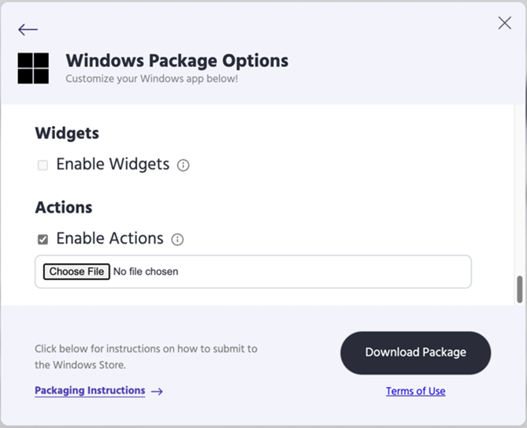
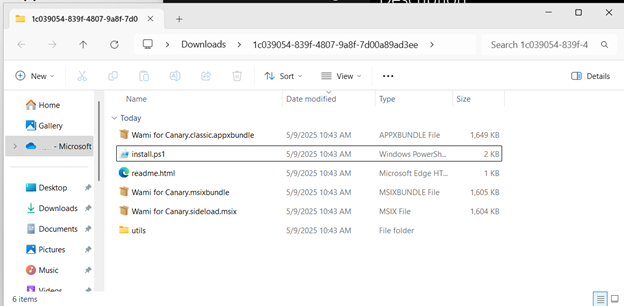
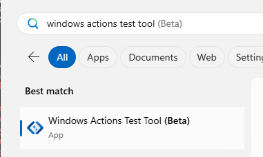
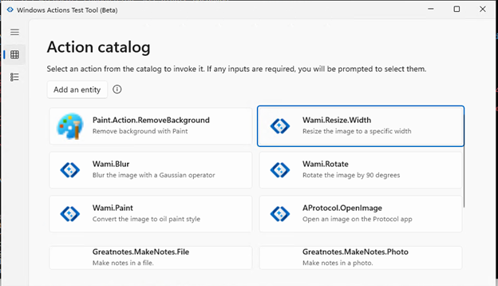

# Enable App Actions on Windows for PWA
<!-- h2/h4/h5/h6 -->

<!-- **Contents:** -->
<!-- todo: copy from WebToc from GH MD Preview -->


<!-- ====================================================================== -->
## Introduction

Here's how to author and test an app action for Windows App Actions framework, for a Progressive Web App (PWA) that you've created.


<!-- ------------------------------ -->
#### What’s App Actions on Windows

<!-- todo: reused Windows’ doc and need link to the public Windows doc -->

An App Action on Windows is an individual unit of behavior that a Windows app can implement and register.  The App Action can then be accessed from other apps and experiences, seamlessly integrating into user workflows.

An App Action is an atomic unit of functionality.  An app builds and registers actions, and then Windows or other apps can recommend registered actions to the user at contextually relevant times and locations within the user workflow.


<!-- ------------------------------ -->
#### Why should you build an Action?

App developers can build actions to increase discoverability and engagement for their features with app-to-app and agentic interactions.

The Windows App Actions is for exposing and executing key pieces of app functionality – it is not for generic user activities like opening context menus or right-clicking.

See [Recommended scenarios for App Actions](https://review.learn.microsoft.com/en-us/windows/ai/app-actions/?branch=pr-en-us-583#recommended-scenarios-for-app-actions).
<!-- todo: external link eg
https://learn.microsoft.com/windows/ai/app-actions/#recommended-scenarios-for-app-actions
ie:
/windows/ai/app-actions/#recommended-scenarios-for-app-actions
-->


<!-- ------------------------------ -->
#### Basic concepts: Action and Entity

See: 
* Windows’ doc: [What’s an Action?](https://aka.ms/AppActionsOnWindows) (The link to the specific section needs to be updated.)<!-- todo: scroll to a specific section?? -->
* [What’s an Entity?] (need link here).<!-- todo: link -->


<!-- ====================================================================== -->
## Get started


<!-- ------------------------------ -->
#### Define the actions your PWA supports

This guide illustrates how to author an action using one of the sample PWAs, Wami  (source code). Wami supports image manipulation tasks, such as resizing or applying post-processing styles. The following example demonstrates the creation of the Paint action, which generates an oil-painting-style version of the image.

The **Paint** action accepts the image file that user selected and returns the stylized output.  The next step is to define the action in a descriptive file that's named `ActionsManifest.json`.


<!-- -------------------- -->
##### Prepare ActionsManifest.json

`ActionsManifest.json` is the descriptive file that's used by Windows App Actions Runtime for an app to declare the actions that the app supports.  Below is the `ActionsManifest.json` populated with the information for the Paint feature of the Wami sample app.

```json
{
    "version": 1,
    "actions": [
      {
        "id": "Wami.Paint",
        "description": "Convert the image to oil paint style",
        "kind": "Search",
        "inputs": [
          {
            "name": "File",
            "kind": "Photo"
          }
        ],
        "outputs": [],
        "invocation": {
          "type": "Uri",
          "uri": "web+wami://paint"
        },
        "inputCombinations": [
          {
            "inputs": [ "File" ],
            "description": "Photo to be converted to oil paint style."
          }
        ]
      }
    ]
  }
```


<!-- ---------- -->
###### Understanding the fields in ActionsManifest

todo: this part needs further edit to quote Windows doc directly.  The below table refers to the Windows doc with edits that makes it only apply to PWA.  "WCAF Onboarding March 2025.docx"


<!-- ---------- -->
###### JSON Properties<!-- parent -->

The tables below outline the action definition JSON’s properties and their attributes.

| Property | Type | Description | Required |
|---|---|---|---|
| `version` | `string` | Schema version. When new functionality is added, the version increments by one. | Yes |
| `actions` | `Action[]` | Defines all actions provided by this application. | Yes |


<!-- ---------- -->
###### Action

| Property | Type | Description | Required |
|---|---|---|---|
| `id` | `string` | Package-unique action name.  Not localizable. | Yes |
| `description` | `string` | User-facing description for this action. Localizable. | Yes |
| `icon` | `string` | Localizable icon for the action.  You should provide an ms-resource string for an icon that's deployed with your app. | No |
| `inputs` | `Input[]` | List of entities that this action accepts as input. | Yes |
| `inputCombinations` | `InputCombination[]` | Provide descriptions for different instantiations of the actions. | No |
| `outputs` | `Output[]` | If specified, must be an empty array.<!-- todo: for now --> | No |
| `invocation` | `Invocation` | Describes how the action is to be executed. | Yes |
| `contentAgeRating` | `UserAgeConsentGroup` | Indicates the appropriate age rating for the action.  For example, `Adult` means content is suitable for adults and older.  If absent, the default behavior allows access to all ages. | No |


<!-- ---------- -->
###### Input

| Property | Type | Description | Required |
|---|---|---|---|
| `name` | `string` | This entity's variable name.  Not localizable. | Yes |
| `kind` | `ActionEntityKind` | Specifies this entity’s type.  Not localizable. | Yes |


<!-- ---------- -->
###### Output

| Property | Type | Description | Required |
|---|---|---|---|
| `name` | `string` | This entity's variable name. Not localizable. | Yes |
| `kind` | `ActionEntityKind` | Specifies this entity’s type.  Not localizable. | Yes |


<!-- ---------- -->
###### InputCombination

| Property | Type | Description | Required |
|---|---|---|---|
| `inputs` | `string[]` | List of inputs for this invocation (may be empty). | Yes |
| `description` | `string` | Localizable description for the action instantiation. | No |
| `where` | `string[]` | Conditionals describing when the action is applicable. | No |


<!-- ---------- -->
###### Invocation

| Property | Type | Description | Required |
|---|---|---|---|
| `type` | `string` | Type of instantiation. For PWA only uri type is supported. | Yes |
| `uri` | `string` | Specified absolute URI to launch. Can include entity usage within the string. | Yes |
| `clsid` | `string` | Class ID for the COM Action Provider. | Yes, for COM actions |
| `inputData` | `Dictionary<string, JsonValue>` | Additional data to provide for URI actions. | No; only valid for URI actions |


<!-- ---------- -->
###### Supported Entity types for PWA<!-- parent -->
<!-- reuse Windows’ doc, but removing entities that PWA don’t support yet -->


<!-- ---------- -->
###### ActionEntityKinds Definition

The entities that are supported for ActionEntityKinds are shown below and each entity type has properties that can be utilized in your JSON. This portion of the document will describe which properties are for each entity kind.

| Entity | Description |
|---|---|
| Photo | Supports JPG, JPEG, and PNG. |
| Document | Supports doc, docx, pdf, and txt file types. |
| File | Supports all file types that are not supported by photo or document entity types. |
| Text | Supports strings of text. |


<!-- ---------- -->
###### File

This also includes the subclasses:
* Photo
* Document

| Property | Type | Description |
|---|---|---|
| `FileName` | `string` | The name of the file. |
| `Path` | `string` | The path of the file. |
| `Extension` | `string` | The extension of the file name. |


<!-- ---------- -->
###### Document

The `Document` entity has the same properties as `File`.  See [File](#file), above.


<!-- ---------- -->
###### Photo

| Property | Type | Description |
|---|---|---|
| `IsTemporaryPath` | `Boolean` | Whether the photo is stored in a temporary path, for example the Photo was created from a bitmap, not a file path. |


<!-- ---------- -->
###### Text

| Property | Type | Description |
|---|---|---|
| `Text` | `String` | The full text. |
| `TextFormat` | `ActionEntityTextFormat` | The format of the text. |
| `ShortText` | `String` | A shortened version of the text, suitable for UI display. |
| `Title` | `String` | The title of the text. |
| `Description` | `String` | A description of the text. |
| `Length` | `Double` | The length of the text in characters. |
| `WordCount` | `Double` | The number of words in the text. |


<!-- -------------------- -->
##### How does it work with Windows App Actions framework


<!-- ---------- -->
###### PWA launch through URI Activation

A PWA action is launched by Windows through custom protocol URI activation.  A PWA must register for custom protocol handling with the `protocol_handlers` field in the web app manifest.  Windows’ `LaunchUriAsync(Uri, LauncherOptions, ValueSet)` method is used by the Action Framework for URI activation.

`LaunchUriAsync` doesn't yet return a value or error status.<!-- todo -->


<!-- ---------- -->
###### URI scheme

A custom protocol URI should be used, not an HTTPS URI.

For PWAs with many actions, use syntax:

```json
"uri": "web+{app name://}{custom action name}"
```

For example:

```json
"uri": "web+wami://paint".
```


<!-- ---------- -->
###### Receiving ValueSet data from Windows and mapping it to Share Target

The activated protocol URI will be mapped to the “url” field of the share target data.

The input `ValueSet` will be converted to a valid JSON string and mapped to the “text” field of the share target data. That way Edge would determine the protocol handler launch actually represents an Action.

The app’s web app manifest must correctly configure the `share_target` field to enable being launched as a share target for an Action.  See [Web Manifest validation](#web-manifest-validation), below.


<!-- -------------------- -->
##### Prerequisites for your PWA


<!-- ---------- -->
###### Web Manifest validation


**protocol_handlers:**

[Required] The `protocol_handlers` field must be present in the manifest, and the protocol field must be the same as the invocation uri in the `ActionsManifest.json` file.

Example `protocol_handlers` declaration:

```json
"protocol_handlers": [
    {
        "protocol": "web+wami",
        "url": "./?url=%s"
    }
]
```


**share_target:**

[Required] The `share_target` field must be present in the manifest:

* The method must be “POST”.
* The `enctype` must be `multipart/form-data`.
* `title`, `text` and `url` in `params` are required.  `files` is optional if you don’t want your PWA to support the normal _share target_ feature.

Example `share_target` declaration:

```json
"share_target": {
    "action": "./share-target",
    "method": "POST",
    "enctype": "multipart/form-data",
    "params": {
        "title": "title",
        "text": "text",
        "url": "url"
    }
}
```


**launch_handler:**

[Optional] You can set [launch_handler](https://developer.mozilla.org/docs/Web/Progressive_web_apps/Manifest/Reference/launch_handler) as `navigate-existing` into your PWA manifest, if you want to keep a single PWA window.

Example declaration:

```json
"launch_handler": {
    "client_mode": " navigate-existing"
}
```


<!-- ---------- -->
###### Accept entity info from Windows App Actions framework

You can do either of the following:

* Handle POST share data using server-side code.
* Use a fetch event listener to intercept the HTTP request which allows to access the data in a service worker.  This provides a better experience for offline users.

For action scenario, suggest using service worker to handle POST share data:
* [share_target - Receiving share data using POST](https://developer.mozilla.org/docs/Web/Progressive_web_apps/Manifest/Reference/share_target#receiving_share_data_using_post)
* [share_target - Receiving shared files](https://developer.mozilla.org/docs/Web/Progressive_web_apps/Manifest/Reference/share_target#receiving_shared_files)

Here is the example service worker handler: [Support AI Action launch for Wami Web App](https://github.com/MicrosoftEdge/Demos/pull/60/files#diff-f73bb02c23e00cfb5e2129d3772d77438b00c3edd1e1e5afd9f5bf91955cb0a6).<!-- todo: cleaner link -->

The meaning of all `formData` is as follows:

* `formData[<share_target.params.text>]`: All entity info with JSON format (the users’ file path will be sanitized).

* `formData[<share_target.params.url>]`: The invocation uri, through which you can know which action this launch came from and handle related parameters if needed.

* `FormData["windowsActionFiles"]`:<!-- todo: lowercase formData? --> All files' data from action.

```csharp
// Extract data
const data = {
  title: formData.get('title') || '',
  text: formData.get('text') || '',
  url: formData.get('url') || ''
};
const files = formData.getAll('windowsActionFiles');
```


<!-- ------------------------------ -->
#### Package your PWA

At the current stage, your PWA needs to be packaged as a Microsoft Store PWA, to be called by the Windows App Actions framework.  You would need an Edge browser with version number greater than 137.

The Stable release of Edge 137 will be available on May 29, 2025.  If you’d like to try it out before May 29, 2025, you can package your PWA in Edge Canary; see [How to package store PWA in Edge Canary](#how-to-package-store-pwa-in-edge-canary), below.


<!-- -------------------- -->
##### How to package store PWA in Edge Stable

1. Upgrade to Edge Stable 137 version.  (Edge 137 stable will be available after May 29, 2025.)

1. Package your PWA for [PWABuilder.com](https://www.pwabuilder.com); see [Package your PWA for the Store](./microsoft-store.md#package-your-pwa-for-the-store) in _Publish a PWA to the Microsoft Store_.

1. In **All settings**, scroll down to **Actions – Enable Actions** at the bottom.

1. Make sure your PWA has `protocol_handlers` and `share_target` fields.  PWABuilder.com will run a check, and if these two fields are absent from the web manifest, the **Enable Actions** checkbox will be greyed out.

1. In the **Actions** section, click **Choose File**, and upload the `ActionsManifest.json` file that you prepared for your PWA:

   

1. Click the **Download** button.

1. Unzip your download archive.  Then you can [publish your PWA to the Microsoft Store](./microsoft-store.md) and install it in<!-- todo: from within? --> the Store, or install it directly by running `install.ps1`.

1. Launch your PWA by clicking the PWA icon.


<!-- -------------------- -->
##### How to package store PWA in Edge Canary

Edge Canary gives a preview of the functionalities that’s not available in stable yet.

1. Install [Edge Canary](https://www.microsoft.com/edge/download/insider) and upgrade to the latest version.

1. Follow this guidance to get the **Package ID**, **Publisher ID**, and **Publisher display name** of your PWA: [Publish a PWA to the Microsoft Store](./microsoft-store.md).

1. Go to [PWABuilder.Windows.Chromium tester](https://pwabuilder-windows-docker.azurewebsites.net/).

1. Follow the configs below to input your PWA configs in the input box.

    * `name`: Your PWA’s name.
    * `packageId`: Not needed if you won’t publish the Canary-bind app to the store; can be an empty string.
    * `url`: Your PWA’s url.
    * `publisher` -> `displayName`: The publisher’s name.  Not needed if you won’t publish the Canary-bind app to the store; can be an empty string.
    * `publisher` -> `commonName`: Your Publisher ID.  Not needed if you won’t publish the Canary-bind app to the store; can be an empty string.
    * `startUrl`: Your PWA’s `startUrl`.

   Example:

    ```json
    {
        "name": "Wami for Canary",
        "packageId": "",
        "url": "https://microsoftedge.github.io/Demos/wami",
        "version": "1.0.2",
        "allowSigning": true,
        "classicPackage": {
            "generate": true,
            "version": "1.0.0"
        },
        "publisher": {
            "displayName": "",
            "commonName": ""
        },
        "edgeChannel": "canary",
        "appUserModelId": "Microsoft.Canary_8wekyb3d8bbwe!MSEDGE",
        "generateModernPackage": true,
        "resourceLanguage": "EN-US",
        "startUrl": "https://microsoftedge.github.io/Demos/wami"
    }
    ```

   Replace the above attributes with your app’s actual attributes.

1. Upload your `ActionsManifest.json` file, and then click the **Download** button.

1. Your download is a `.zip` archive that contains files such as `.msix` and `.msixbundle` files.  Unzip it and run `install.ps1` to install your PWA directly:

   

1. Launch your PWA by clicking on the PWA icon.

1. Launch Edge Canary and go to `edge://apps`, you will find your PWA.  Click the **Details** button, you can find that your PWA is installed from Microsoft Store.

Your PWA was successfully installed as a Store PWA in Edge Canary.


<!-- ------------------------------ -->
#### Testing your PWA in Windows

Before testing, make sure that you have set up and packaged your PWA successfully as discussed in the above sections.


<!-- -------------------- -->
##### Using Windows actions test tool

1. Make sure Windows is updated to support App Actions:

   * Update Windows version to _nnn_ (todo) (todo: link to Windows documentation for Windows system set up).

1. Make sure Microsoft Edge is updated to the latest version, and install your PWA successfully; see [Package your PWA](#package-your-pwa), above.

   1. Launch Edge Canary or Edge Stable, this depends on which channel you installed the PWA on.  Go to `edge://flags` and enable `#edge-webapp-windows-app-actions-framework`.

   1. Before being called by the Action runtime, you need to launch your PWA at least once, to initialize your PWA for action.

1. Download and install the Windows action testing tool:

   1. Go to [https://github.com/zhangkun902/WCAF-Test-Package](https://github.com/zhangkun902/WCAF-Test-Package) and download the **WindowsActionsTestApp** package.

   1. Install test app by running `add-appxpackage –path "<package path>" -allowunsigned` at a PowerShell command prompt.

   Then you will find the test tool:

   

1. Initiate an action from Windows action testing tool:

   1. Launch the Windows Actions Test Tool.

      You will see the actions from your installed PWA.

   1. Add an entity that action needs, Run action.<!-- todo: clarify -->

      The PWA will be launched and execute the action.

   <!-- todo: relate png to steps -->


<!-- ====================================================================== -->
<!-- ## See also -->

