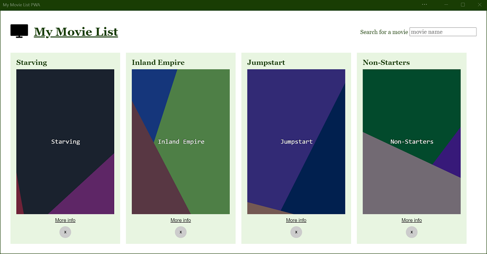
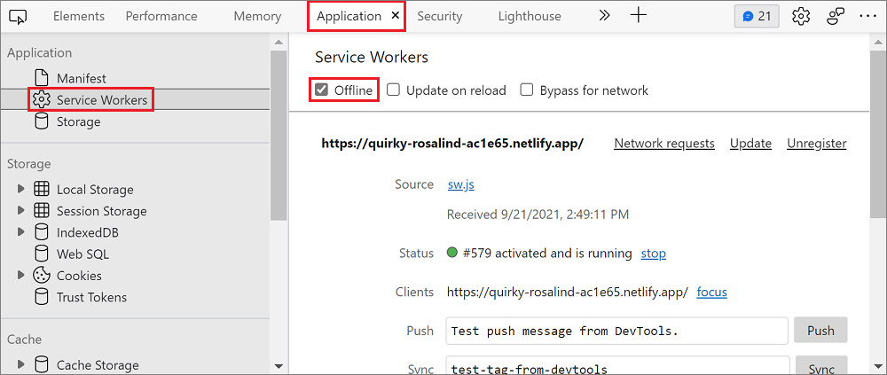
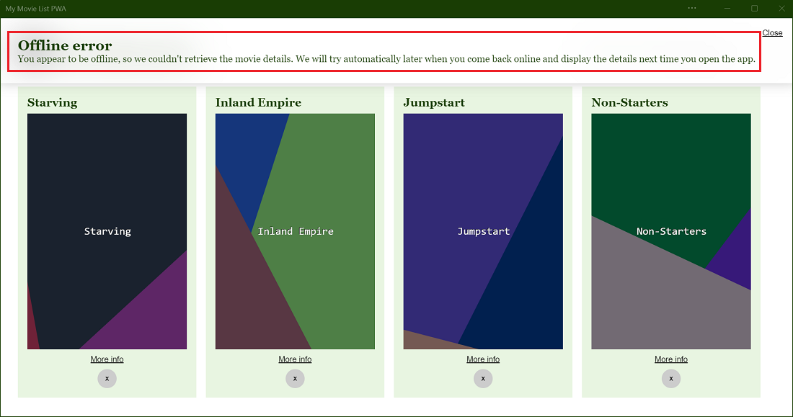
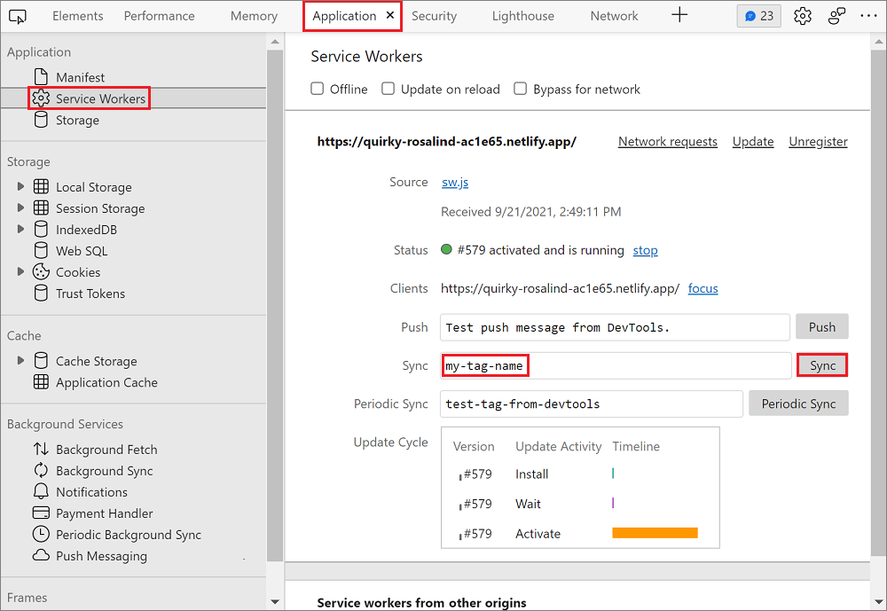
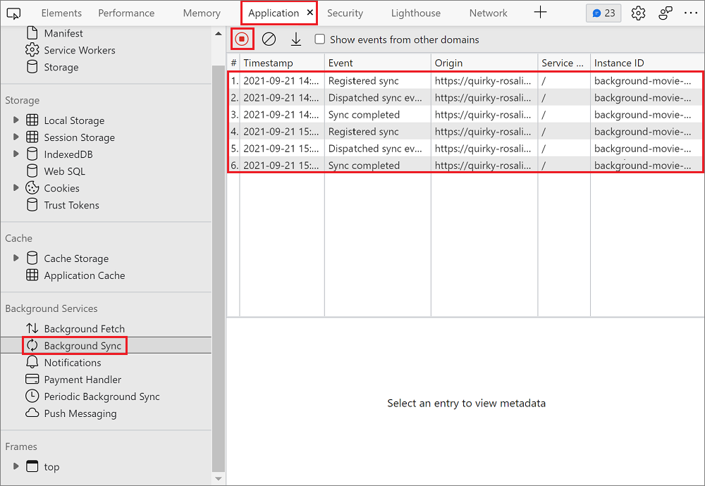
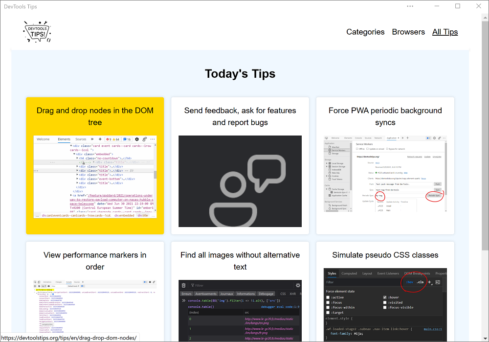
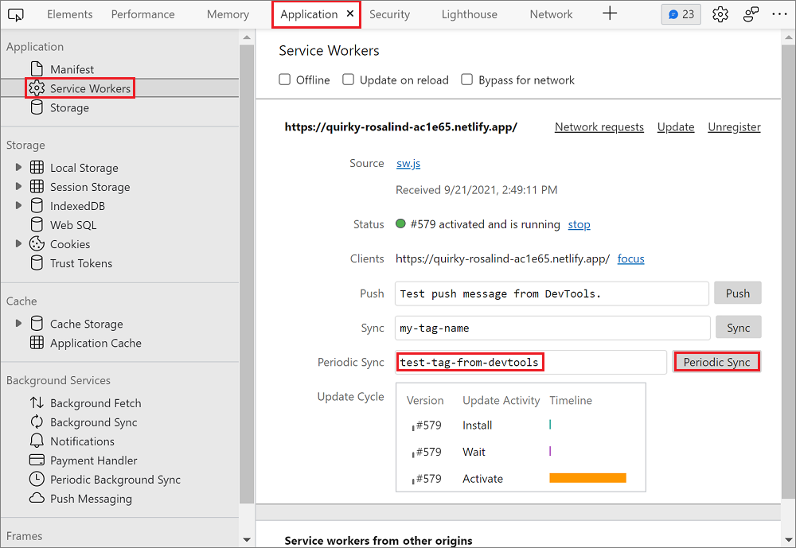
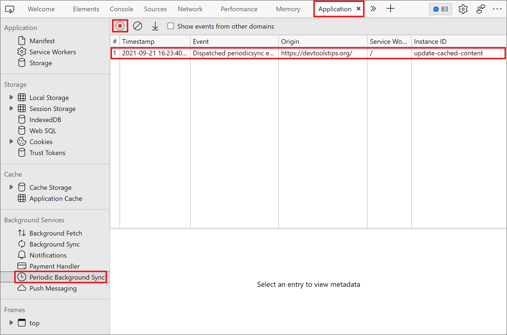

# Synchronize and update a PWA in the background

Using a service worker, a Progressive Web App (PWA) can do work in the background, even when the user isn't using the app.  Service workers used to be reserved for native apps, but they are now also available to PWAs, providing a better offline experience.

Consider the following use cases:
*  An email app that lets users compose messages and send them at any time, even when offline.
*  A news app that fetches new articles every day, for the user to read later when they open the app.
*  A music app that lets users download songs for listening offline.

All three of these use cases are possible with PWAs, by using the following APIs:
*  Background Sync API
*  Periodic Background Sync API
*  Background Fetch API

Although these APIs have similar names, they are different in nature.


<!-- ====================================================================== -->
## Use the Background Sync API to synchronize data with the server

Use the Background Sync API to allow users to continue using the app and perform actions even when they are offline.

For example, an email app can let its users compose and send messages at any time.  The app frontend can try to send the message right away, and if the device is offline, the service worker can catch the failed request and use the Background Sync API to defer the task until connected.

Another example for using the Background Sync API is loading content in the background for the user.

> [!NOTE]
> The Background Sync API should be used for small amounts of data.  The Background Sync API requires the service worker to be alive for the entire duration of the data transfer.  The Background Sync API shouldn't be used to fetch large files, because devices can decide to terminate service workers, to preserve battery life.  Instead, use the [Background Fetch API](#use-the-background-fetch-api-to-fetch-large-files-when-the-app-or-service-worker-isnt-running).

#### Check for support

The Background Sync API is available in Microsoft Edge, but you should make sure that Background Sync API is supported in the other browsers and devices that your app runs in.  To make sure that the Background Sync API is supported, test whether the `ServiceWorkerRegistration` object has a `sync` property:

```javascript
navigator.serviceWorker.ready.then(registration => {
    if (registration.sync) {
        // Background Sync is supported.
    } else {
        // Background Sync isn't supported.
    }
});
```

To learn more about the `ServiceWorkerRegistration` interface, see [ServiceWorkerRegistration](https://developer.mozilla.org/docs/Web/API/ServiceWorkerRegistration) at MDN.

#### Request a sync

The first thing to do is to request a sync. This can be done by your app frontend or your service worker.

*  Requesting the sync from the frontend is good when you want to leave the user in charge of synchronizing later or not.
*  Requesting the sync from the service worker is good when you want this to be transparent to the user. In this case, the service worker can detect the failed fetch request and request the sync right away.

To request a sync, you need a `ServiceWorkerRegistration` and a tag name. From the app frontend code, do the following:

```javascript
async function requestBackgroundSync() {
    const registration = await navigator.serviceWorker.ready;
    await registration.sync.register('my-tag-name');
}
```

Or, from the service worker, do this instead:

```javascript
async function requestBackgroundSync() {
    await self.registration.sync.register('my-tag-name');
}
```

The `my-tag-name` string above should be a unique tag that identifies this sync request, so that multiple requests can be done.

#### React to the sync event

As soon as a connection can be used and the service worker is running, a `sync` event is sent to the service worker, which can use it to synchronize the necessary data. The `sync` event can be listened to with the following code:

```javascript
self.addEventListener('sync', event => {
    if (event.tag === 'my-tag-name') {
        event.waitUntil(doTheWork());
    }
});
```

In the example code above, a `sync` event listener is added in the service worker. When the listener is called, the code checks if the tag is the one registered in the frontend, and then calls `doTheWork`. This function is expected to return a Promise.

Typically, the `doTheWork` function will send the information to the server that couldn't be sent when the user was offline. It may be useful to store this information in [IndexedDB](https://developer.mozilla.org/docs/Web/API/IndexedDB_API) storage from the frontend so that it can later be retrieved from the service worker when `doTheWork` runs.

For more information about the `Sync` event, the `ServiceWorkerRegistration`, and the `SyncManager` interface, see the [Background Synchronization draft specification](https://wicg.github.io/background-sync/spec/) and the [Background Synchronization API documentation](https://developer.mozilla.org/docs/Web/API/Background_Synchronization_API).

#### Demo app

[My Movie List PWA](https://quirky-rosalind-ac1e65.netlify.app/) is a demo app that uses the Background Sync API to fetch movie information later, if the user is offline.



To test background syncing:

1.  Install the app.

1.  Search for movies using the search input field.

1.  Go offline.  To do this, open DevTools (**F12**), and then select the **Application** > **Service Workers** > **Offline** checkbox.

    

1.  In one of the movie results, select **More info**.

1.  A message appears in the app informing you that you are offline, and that the movie details will be retrieved automatically later.

    

1.  Go online.  To do this, in DevTools, clear the **Application** > **Service Workers** > **Offline** checkbox.

1.  Reload the app. The movie details now appear.

To see the sample code, check out the [movies-db-pwa](https://github.com/captainbrosset/movies-db-pwa/) repo.

#### Debug background syncs with DevTools

To test your background sync code, you don't have to go offline, then go online, and then wait for Microsoft Edge to trigger a `sync` event.  Instead, DevTools lets you simulate the background sync event.

To simulate a `sync` event:

1. Open DevTools (**F12**).
1. Select **Application** > **Service Workers**.
1. Type the tag name you used when registering the sync in the **Sync** input field.
1. Select the **Sync** button.



You can also log the background sync activity generated by your app in DevTools, as follows:

1. Open DevTools (**F12**).
1. Select **Application** > **Background Sync**.
1. Select **Start recording events**.

Sync registrations and dispatches appear in the event log table:




<!-- ====================================================================== -->
## Use the Periodic Background Sync API to regularly get fresh content

The Periodic Background Sync API lets PWAs retrieve fresh content periodically, in the background, so users can immediately access it when they later open the app again.

Using the Periodic Background Sync API, PWAs don't have to download new content (such as new articles) while the user is using the app.  Downloading content could slow down the experience, so instead, retrieve the content at a more convenient time.

> [!NOTE]
> The periodic sync only occurs when the device is on a known network (that is, a network that the device has already been connected to before).  Microsoft Edge limits the frequency of the syncs to match how often the person uses the app.

#### Check for support

To check whether this API is supported in the browsers and devices that your app runs in, test whether the `ServiceWorkerRegistration` object has a `periodicSync` property:

```javascript
navigator.serviceWorker.ready.then(registration => {
    if (registration.periodicSync) {
        // Periodic Background Sync is supported.
    } else {
        // Periodic Background Sync isn't supported.
    }
});
```

#### Ask the user for permission

Periodic background synchronization requires the user's permission.  Requesting this permission occurs only one time, for a given application.

To ask the user for permission to do periodic background synchronization, use the Permissions API, as follows:

```javascript
const status = await navigator.permissions.query({name: 'periodic-background-sync'});
if (status.state === 'granted') {
  // Periodic background sync can be used.
} else {
  // Periodic background sync cannot be used.
}
```

To learn more about the Permissions API, see [Permissions API](https://developer.mozilla.org/docs/Web/API/Permissions_API) at MDN.

#### Register a periodic sync

To register a periodic sync, you need to define a minimum interval and a unique tag name.  The unique tag name enables registering multiple periodic background syncs.

```javascript
async function registerPeriodicSync() {
    await registration.periodicSync.register('get-daily-news', {
        minInterval: 24 * 60 * 60 * 1000
    });
}
```

The `minInterval` used in the code above corresponds to 1 day in milliseconds. This is a minimum interval only, and Microsoft Edge takes other factors into account before alerting your service worker with a periodic sync event, such as the network connection and whether the user regularly engages with the app.

#### React to periodic sync events

When Microsoft Edge decides it's a good time to run the periodic sync, Microsoft Edge sends a `periodicsync` event to your service worker. You can handle this `periodicsync` event by using the same tag name that was specified when registering the sync.

```javascript
self.addEventListener('periodicsync', event => {
    if (event.tag === 'get-daily-news') {
        event.waitUntil(getDailyNewsInCache());
    }
});
```

The `getDailyNewsInCache` function is where your service worker can fetch new content from the server and store it in the cache. This function is expected to return a Promise that signals whether the sync succeeded or failed.

For more information about the `PeriodicSync` event, the `ServiceWorkerRegistration`, and the `PeriodicSyncManager` interface, see:

* [Web Periodic Background Synchronization](https://wicg.github.io/periodic-background-sync/) - draft specification.
* [Web Periodic Background Synchronization API](https://developer.mozilla.org/docs/Web/API/Web_Periodic_Background_Synchronization_API).

#### Demo app

[DevTools Tips](https://devtoolstips.org/) is a PWA that uses the Periodic Background Sync API.  The [DevTools Tips] PWA fetches new developer tools tips daily and stores them in cache, so that users can access them next time they open the app, whether they are online or not.



Go to the [source code on GitHub](https://github.com/captainbrosset/devtools-tips/). In particular, the app registers the periodic sync in the [registerPeriodicSync](https://github.com/captainbrosset/devtools-tips/blob/a4a5277ee6b67e5cc61eee642bf3d9c68130094f/src/layouts/home.njk#L72) function.  The [service worker code](https://github.com/captainbrosset/devtools-tips/blob/ebfb2c7631464149ce3cc7700d77564656971ff4/src/sw.js#L115) is where the app listens to the `periodicsync` event.

#### Debug periodic background syncs with DevTools

You can use DevTools to simulate `periodicsync` events instead of waiting for the minimum interval.

To simulate the event:

1. Open DevTools (**F12**).
1. Select **Application** > **Service Workers**.
1. Type the tag name you used when registering the periodic sync in the **Periodic Sync** input field.
1. Select the **Periodic Sync** button.



You can also log the periodic background sync activity generated by your app in DevTools:

1. Open DevTools (**F12**).
1. Select **Application** > **Periodic Background Sync**.
1. Select **Start recording events**.

Periodic sync registrations and dispatches appear in the event log table.




<!-- ====================================================================== -->
## Use the Background Fetch API to fetch large files when the app or service worker isn't running

The Background Fetch API allows PWAs to completely delegate downloading large amounts of data to the browser engine. This way, the app and service worker don't have to be running at all while the download is in progress.

This API is useful for apps that let users download large files (like music, movies, or podcasts) for offline use cases. Because the download is delegated to the browser engine, which knows how to handle a flaky connection or even a complete loss of connectivity, it can pause and resume the download when necessary.

#### Check for support

To check whether this API is supported, test if the `BackgroundFetchManager` constructor exists on the global object:

```javascript
if (self.BackgroundFetchManager) {
    // Background Fetch is supported.
} else {
    // Background Fetch isn't supported.
}
```

#### Start a background fetch

To start a background fetch:

```javascript
navigator.serviceWorker.ready.then(async registration => {
    const fetch = await registration.backgroundFetch.fetch('my-download-id', 
                                                           fileUrls, options);
});
```

Above, `my-download-id` should be a unique string identifier for this background fetch. `fileUrls` is the list of files to download, this will be an array of string URLs. And `options` is an object that can be used to customize the appearance of the download activity in the browser.

For more information about the `fetch` function, see [BackgroundFetchManager.fetch()](https://developer.mozilla.org/docs/Web/API/BackgroundFetchManager/fetch) and [Introducing Background Fetch](https://developer.chrome.com/blog/background-fetch/).


<!-- ====================================================================== -->
## Use the App Badging API and Notifications API to re-engage users

Use the App Badging API and the Notifications API to let users know that background tasks, downloads, or fresh content have been completed, without interrupting their workflow.  Using badges and notifications can increase user re-engagement with your app.

With Microsoft Edge, badges appear on app icons in the taskbar, and notifications integrate with the system notification center.

To learn how to use these APIs, see [Re-engage users with badges, notifications, and push messages](notifications-badges.md).
