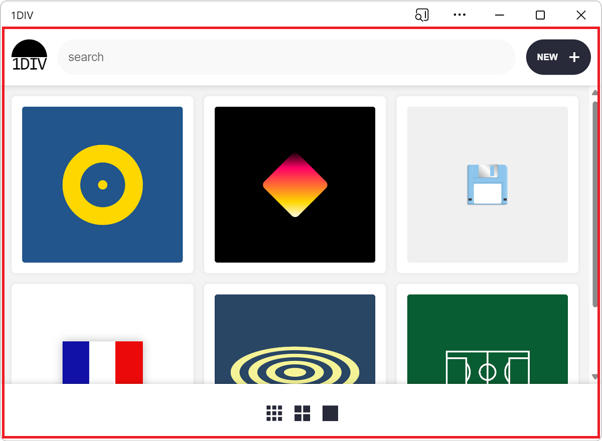

# Get Microsoft Store billing service using Digital Goods API

If your Progressive Web App (PWA) is listed in the Microsoft Store, you can provide in-app products and subscriptions through the [Digital Goods API](https://github.com/MicrosoftEdge/MSEdgeExplainers/blob/main/PwaDigitalGoods/explainer.md) and the [Payment Request API](https://www.w3.org/TR/payment-request/).

## Digital Goods API
The [Digital Goods API](https://github.com/MicrosoftEdge/MSEdgeExplainers/blob/main/PwaDigitalGoods/explainer.md) is an interface between your PWA app and Microsoft Store. It supports:
* Querying the details (e.g., name, description, regional price) of digital items from the Microsoft Store backend.
* Consuming or acknowledging purchases.
* Checking the digital items currently owned by the user.
* Checking the purchase history of the user.
Before making the Digital Goods API available in your app, please make sure that 

## Payment Request API
The [Payment Request API](https://www.w3.org/TR/payment-request/)⁠⁠ handles the actual payment transaction when a purchase is made. It uses the item details that the Digital Goods API provides to make the in-app purchase using the Microsoft Store Billing payment method.

A Progressive Web App (PWA) can define how it should be displayed on mobile platforms, by using the [display](https://developer.mozilla.org/docs/Web/Manifest/display) member in the web app manifest file.  However, to create an immersive, native-like experience, _desktop_ PWAs can use another approach.

By default, a PWA installed on desktop can display content in an area that starts immediately below the reserved title bar area:

Displaying content where the title bar normally is can help PWAs feel more native.  Many desktop applications, such as Visual Studio Code, Microsoft Teams, and Microsoft Edge already do this:

<!-- ====================================================================== -->
## See also

* [Simulate the Window Controls Overlay API without installing your PWA](../../devtools-guide-chromium/progressive-web-apps/simulate-window-controls-overlay.md) - DevTools feature.
* [Window Controls Overlay video tutorial](https://www.youtube.com/watch?v=NvClp35dFVI)
* [Customize the window controls overlay of your PWA's title bar](https://web.dev/window-controls-overlay/)
* [Breaking Out of the Box](https://alistapart.com/article/breaking-out-of-the-box/)
* [display_override](https://developer.mozilla.org/docs/Web/Manifest/display_override) at MDN.
