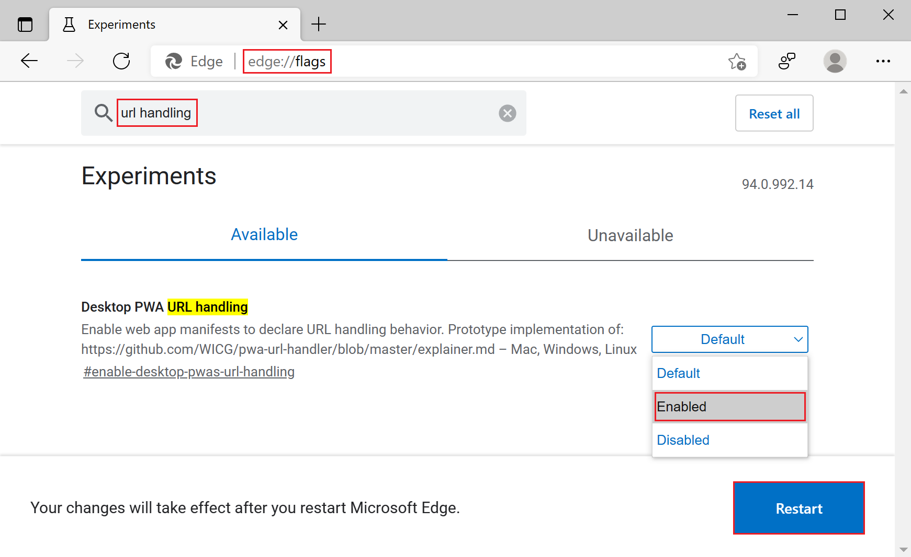
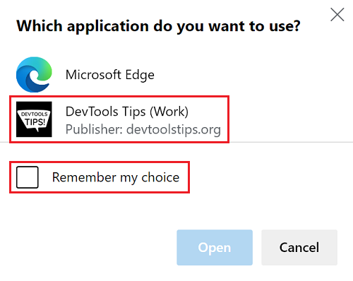

# Handle URLs in Progressive Web Apps

Native applications on many operating systems can be associated with URLs. They can request to be launched, instead of the browser, when associated URLs are activated.

Progressive Web Apps (PWAs) can also handle URLs in the same way, to create a more engaging experience.

> [!NOTE]
> Support for the experimental `url_handlers` manifest member, documented below, is being phased out.
> The `url_handlers` manifest member is being replaced by the new `handle_links` manifest member, which is currently being standardized and implemented.
> See the `handle_links` [explainer](https://github.com/WICG/pwa-url-handler/blob/main/handle_links/explainer.md).


<!-- ====================================================================== -->
## Enable URL handling

URL handling is an experimental feature. To enable the URL handling experiment:

1. In Microsoft Edge, go to `edge://flags`.

1. In the **Search flags** text box, type "url handling".  The **Desktop PWA URL handling** setting appears.

1. Change the setting from **Default** to **Enabled**, and then click the **Restart** button.

   > [!div class="mx-imgBorder"]
   > 

URL handling is an origin trial in Microsoft Edge. Learn [how to enroll your site in an origin trial](./origin-trials.md#enroll-your-site-in-an-origin-trial).


<!-- ====================================================================== -->
## Define which URLs your app handles

The first thing to do is declare which URLs your app handles. This is done in your app [manifest file](./web-app-manifests.md), using the `url_handlers` array member.

Each entry in the `url_handlers` array contains a `origin` string, which is a pattern for matching origins.

```json
{
    "url_handlers": [
        {
            "origin": "https://contoso.com"
        },
        {
            "origin": "https://*.contoso.com"
        },
        {
            "origin": "https://conto.so"
        }
    ]
}
```

In the above example, the app is registered to handle URLs that have their origins set to `contoso.com` or any of its subdomains, as well as `conto.so`.


<!-- ====================================================================== -->
## Verify the origin ownership

Microsoft Edge needs to verify the Progressive Web App's ownership of the handled URLs to successfully launch the app. This is required when the handled URL and the Progressive Web App (PWA) are both on the same origin and when they're not. In most cases, the PWA will handle URLs that have the same origin, but this isn't required.

Origin ownership is established with the `web-app-origin-association` JSON file, which is used by Microsoft Edge to validate the handshake between the PWA and the URL.

Let's take the example of a PWA hosted at `https://app.contoso.com` trying to handle `https://contoso.com` and `https://partnerapp.com` URLs.

*  To establish the PWA's ownership of the `contoso.com` origin, the following JSON content needs to be available at `https://contoso.com/.well-known/web-app-origin-association`.

    ```json
    {
        "web_apps": [
            {
                "manifest": "https://app.contoso.com/manifest.json",
                "details": {
                    "paths": [
                        "/*"
                    ]
                }
            }
        ]
    }
    ```

*  To establish the PWA's ownership of the `partnerapp.com` origin, the same JSON content needs to be available at `https://partnerapp.com/.well-known/web-app-origin-association`.

    ```json
    {
        "web_apps": [
            {
                "manifest": "https://app.contoso.com/manifest.json",
                "details": {
                    "paths": [
                        "/*"
                    ]
                }
            }
        ]
    }
    ```

To learn more about the valid members in `web-app-origin-association`, see the [URL Handlers explainer](https://github.com/WICG/pwa-url-handler/blob/main/explainer.md#web-app-origin-association-file).


<!-- ====================================================================== -->
## Testing URL handling

Testing your app's URL handling from a web browser won't work since in-browser page navigation does not trigger URL handling at the OS level.

To test the feature, send yourself a URL in a chat message app, or a desktop email client like Windows Mail. You can also use the Windows Run app:

*  Press `Windows logo key` + `R`.
*  Enter a URL your app handles.
*  Press `Enter`.

> [!NOTE]
> At the moment, only PWAs that were installed from the default system browser can handle URLs.


<!-- ====================================================================== -->
## Demo

[DevTools Tips](https://devtoolstips.org/) is a demo Progressive Web App (PWA) that handles URLs for its own domain, so that the app opens instead of the website when a URL for its domain is used.

To test URL handling on the DevTools Tips demo:

1. [Enable URL handling](#enable-url-handling) in Microsoft Edge.

1. Go to the [DevTools Tips](https://devtoolstips.org/) PWA.

1. Click the **App available. Install DevTools Tips** () icon in the Address bar to install the DevTools Tips app locally.

1. Press `Windows logo key` + `R` to open the Windows **Run** dialog.

1. Enter a URL for one of the tips on the site, such as https://devtoolstips.org/tips/en/find-css-changes/.

1. Press `Enter`.

Windows knows that your app can handle URLs, but since there may be other apps that can handle URLs, Windows asks you which app to use. Select the **DevTools Tips** app. If you want to avoid seeing this dialog every time, select **Remember my choice**.

> [!div class="mx-imgBorder"]
> 

The DevTools Tips app launches and displays the Tips page.

You can find the [source code on GitHub](https://github.com/captainbrosset/devtools-tips/).
* The DevTools Tips app registers the handled URLs in the [manifest.json](https://github.com/captainbrosset/devtools-tips/blob/main/src/manifest.json) file.
* The website establishes the app's ownership in the [web-app-origin-association](https://github.com/captainbrosset/devtools-tips/blob/main/src/.well-known/web-app-origin-association) file.


<!-- ====================================================================== -->
## See also

*  [Handling URLs in PWAs video](https://www.youtube.com/watch?v=jYc7ih9Xwqw).
*  [PWAs as URL Handlers](https://web.dev/pwa-url-handler/).
