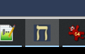
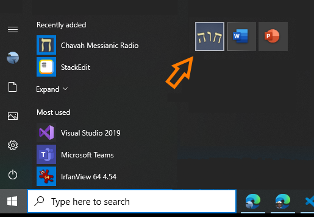
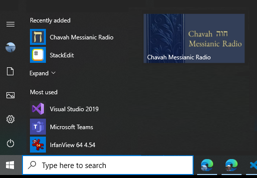
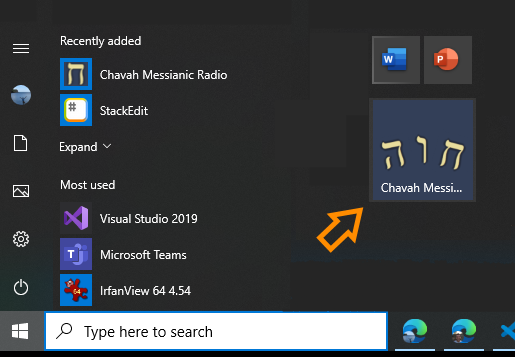
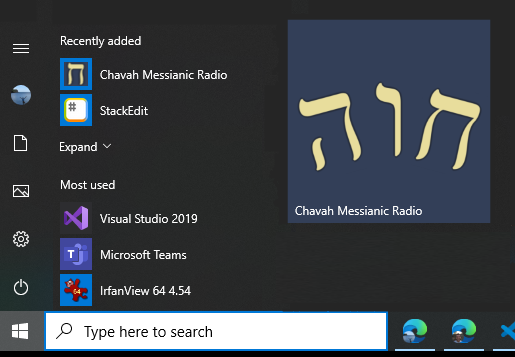
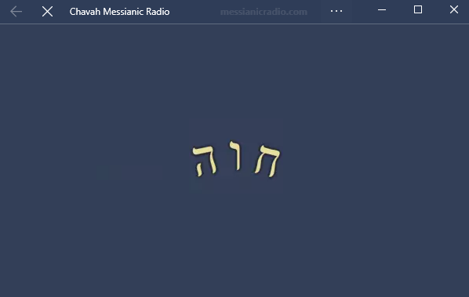
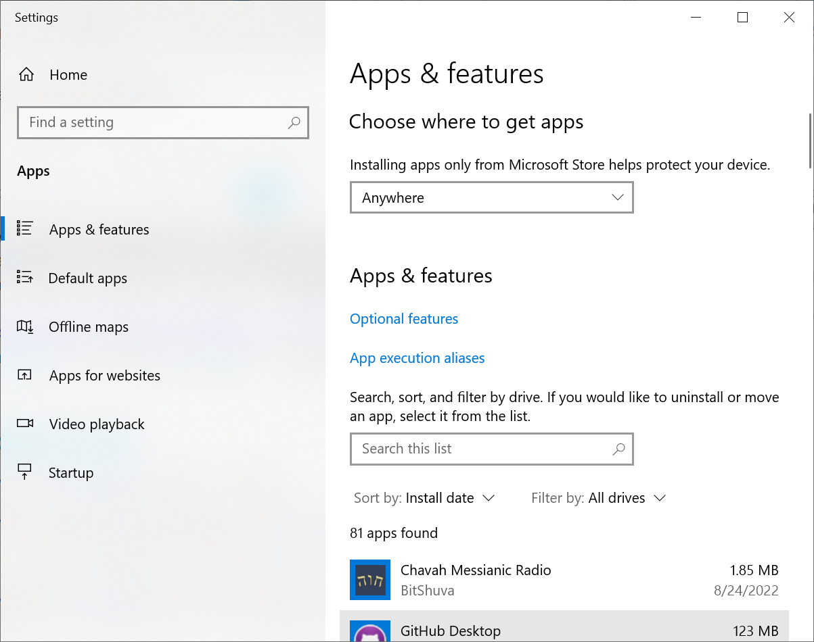
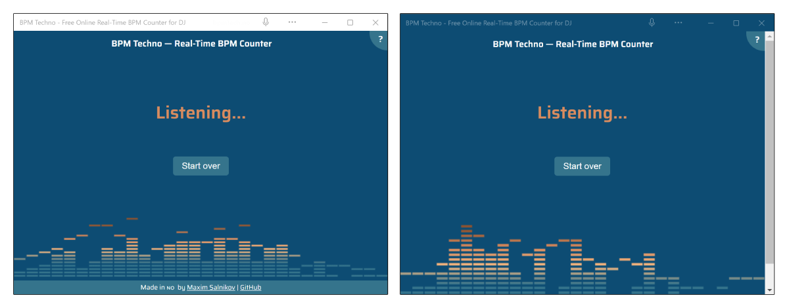

# Define icons and a theme color

PWAs that are installed on Windows can be customized in the way they appear in the operating system (OS).  A PWA can define a set of icons and a theme color for the title bar.


<!-- ====================================================================== -->
## Define icons

In Windows, apps are recognizable to users by their icons. Icons appear in the Taskbar, in the Start Menu, and in other places such as system settings.

A PWA can configure which image files the operating system should use to display an icon in these various places.  Multiple images can be provided for the OS to choose, depending on the context.

In the web app manifest file, app icons are defined with the `icons` member:

```json
{
    "icons": [
        {
            "src": "/icons/icon-192x192.png",
            "sizes": "192x192",
            "type": "image/png"
        },
        {
            "src": "/icons/icon-256x256.png",
            "sizes": "256x256",
            "type": "image/png"
        },
        {
            "src": "/icons/icon-384x384.png",
            "sizes": "384x384",
            "type": "image/png"
        },
        {
            "src": "/icons/icon-512x512.png",
            "sizes": "512x512",
            "type": "image/png"
        }
    ]
}
```

Each icon in the `icons` array should come with at least the `src` and `sizes` properties.  An icon can also have the `type` and `purpose` properties.

| Property | Description |
|:--- |:--- |
| `src` | The path to the image file, which can be a relative path from the app root folder, or an absolute URL. |
| `sizes` | A space-separated list of sizes that the corresponding image can be used for. |
| `type` | An optional hint for the OS to quickly detect the image type. |
| `purpose` | An optional hint to help the OS choose the right icon image, depending on the context.  The value can be `monochrome`, `maskable`, or `any`. |

Learn more about [the icons member](https://developer.mozilla.org/docs/Web/Manifest/icons).


<!-- ====================================================================== -->
## Icon image sizes

Your PWA can be enhanced on Windows by supplying the images with specific dimensions in your web app manifest. We recommend choosing one of the options below:

* Level 1: (Basic image support: 512x512) This is the base image from which to generate missing images.

* Level 2: (Tiles) At this level, your web app manifest contains tile images for the default (1x) display scale. Each of the images must be in PNG format and have the `any` purpose set. Here is a list of recommended images and sizes.

    * 44x44 - app icon
    * 71x71 - small tile
    * 150x150 - medium tile
    * 310x150 - wide tile
    * 310x310 - large tile
    * 50x50 - store logo
    * 620x300 - splash screen

* Level 3: (Tiles with display scales) At this level, your web app manifest should contain tile images for all Windows display scale sizes. Display scale is a user-configuration in Windows (users can change it by going to **Settings** > **Display** > **Scale**). Your web app manifest icons should include images with these dimensions:

    * 44x44 - app icon
    * 55x55 - app icon 1.25x display scale
    * 66x66 - app icon 1.5x display scale
    * 88x88 - app icon 2x display scale
    * 176x176 - app icon 4x display scale
    * 71x71 - small tile
    * 89x89 - small tile 1.25x display scale
    * 107x107 - small tile 1.5x display scale
    * 142x142 - small tile 2x display scale
    * 284x284 - small tile 4x display scale
    * 150x150 - medium tile
    * 188x188 - medium tile 1.25x display scale
    * 225x225 - medium tile 1.5x display scale
    * 300x300 - medium tile 2x display scale
    * 600x600 - medium tile 4x display scale
    * 310x150 - wide tile
    * 388x188 - wide tile 1.25x display scale
    * 465x225 - wide tile 1.5x display scale
    * 620x300 - wide tile 2x display scale
    * 1240x600 - wide tile 4x display scale
    * 310x310 - large tile
    * 388x388 - large tile 1.25x display scale
    * 465x465 - large tile 1.5x display scale
    * 620x620 - large tile 2x display scale
    * 1240x1240 - large tile 4x display scale
    * 50x50 - store tile
    * 63x63 - store tile 1.25x display scale
    * 75x75 - store tile 1.5x display scale
    * 100x100 - store tile 2x display scale
    * 200x200 - store tile 4x display scale
    * 620x300 - splash screen
    * 775x375 - splash screen 1.25x display scale  
    * 930x450 - splash screen 1.5x display scale
    * 1240x600 - splash screen 2x display scale
    * 2480x1200 - splash screen 4x display scale

* Level 4 (Tiles, display scales, and target sizes) At this level you supply images for tiles with display scales and target size images for display in various surfaces in Windows, including taskbar, start menu, task manager, ALT+Tab task switcher, and more. This provides the best experience for your users, but also requires the most developer effort. Your web app manifest icons should include images with these dimensions:

    * 44x44 - app icon
    * 55x55 - app icon 1.25x display scale
    * 66x66 - app icon 1.5x display scale
    * 88x88 - app icon 2x display scale
    * 176x176 - app icon 4x display scale
    * 71x71 - small tile
    * 89x89 - small tile 1.25x display scale
    * 107x107 - small tile 1.5x display scale
    * 142x142 - small tile 2x display scale
    * 284x284 - small tile 4x display scale
    * 150x150 - medium tile
    * 188x188 - medium tile 1.25x display scale
    * 225x225 - medium tile 1.5x display scale
    * 300x300 - medium tile 2x display scale
    * 600x600 - medium tile 4x display scale
    * 310x150 - wide tile
    * 388x188 - wide tile 1.25x display scale
    * 465x225 - wide tile 1.5x display scale
    * 620x300 - wide tile 2x display scale
    * 1240x600 - wide tile 4x display scale
    * 310x310 - large tile
    * 388x388 - large tile 1.25x display scale
    * 465x465 - large tile 1.5x display scale
    * 620x620 - large tile 2x display scale
    * 1240x1240 - large tile 4x display scale
    * 50x50 - store tile
    * 63x63 - store tile 1.25x display scale
    * 75x75 - store tile 1.5x display scale
    * 100x100 - store tile 2x display scale
    * 200x200 - store tile 4x display scale
    * 620x300 - splash screen
    * 775x375 - splash screen 1.25x display scale
    * 930x450 - splash screen 1.5x display scale
    * 1240x600 - splash screen 2x display scale
    * 2480x1200 - splash screen 4x display scale
    * 16x16 - target size for taskbar, start menu, task manager
    * 20x20 - target size for taskbar, start menu, task manager
    * 24x24 - target size for taskbar, start menu, task manager
    * 30x30 - target size for taskbar, start menu, task manager
    * 32x32 - target size for taskbar, start menu, task manager
    * 36x36 - target size for taskbar, start menu, task manager
    * 40x40 - target size for taskbar, start menu, task manager
    * 44x44 - target size for taskbar, start menu, task manager
    * 48x48 - target size for taskbar, start menu, task manager
    * 60x60 - target size for taskbar, start menu, task manager
    * 64x64 - target size for taskbar, start menu, task manager
    * 72x72 - target size for taskbar, start menu, task manager
    * 80x80 - target size for taskbar, start menu, task manager
    * 96x96 - target size for taskbar, start menu, task manager
    * 256x256 - target size for taskbar, start menu, task manager

### Image level summary

Consider, for example, how your app icon might show different content depending on the available surface area:

* Small surface: App icon (44x44) in taskbar, showing a small, abbreviated logo: 

 

* Larger surface: Medium tile (150x150) in start menu, showing the full logo of the app:  

 

* Wide surface: Wide tile in start menu, showing a more articulated app icon: 

 

Notice how the content of the icon changed. This is possible only through the use of higher levels of icon support. We recommend developers choose higher levels to give the best experience for your Windows users.  

### Icon descriptions

Below you'll find a description of each app icon and where they show up in Windows.

The normal app icon that's shown in the start menu, task bar, or task manager.

 

* 44x44
* 55x55 (1.25x scale)
* 66x66 (1.5x scale)
* 88x88 (2x scale)
* 176x176 (4x scale)

The small tile is shown in the start menu when the user set your app's tile to small size.

 

* 71x71
* 89x89 (1.25x scale)
* 107x107 (1.5x scale)
* 142x142 (2x scale)
* 284x284 (4x scale)

The medium tile icon is shown in the start menu when the user sets your app's tile to medium size.



* 150x150
* 188x188 (1.25x scale)
* 225x225 (1.5x scale)
* 300x300 (2x scale)
* 600x600 (4x scale)

The wide tile icon is shown in the start menu when the user sets your app's tile to wide size.


* 310x150
* 388x188 (1.25x scale)
* 465x225 (1.5x scale)
* 620x300 (2x scale)
* 1240x600 (4x scale)

The large tile icon is in the start menu when the user sets your app's tile to large size.



* 310x310
* 388x388 (1.25x scale)  
* 465x465 (1.5x scale)
* 620x620 (2x scale)
* 1240x1240 (4x scale)

The store logo icon is shown in app installer, Windows Partner Center, the "Report an app" option in the Store, and the "Write a review" option in the Store.


* 50x50
* 63x63 (1.25x scale)
* 75x75 (1.5x scale)
* 100x100 (2x scale)
* 200x200 (4x scale)

The splash screen asset is shown as the splash screen for your app. Currently supported only in classic package. In the future, we may add support for the modern hosted app package as well.



* 620x300
* 775x375 (1.25x scale)
* 930x450 (1.5x scale)
* 1240x600 (2x scale)
* 2480x1200 (4x scale)

### Target sized images

In addition to the standard scale factor sizes described above, we also recommend creating "target-size" assets. We call these assets target-size because they target specific sizes, such as 16 pixels, rather than specific scale factors, such as 400. Target-size assets are for Windows surfaces that don't use the scaling plateau system. 

For example, the **Apps & features** Windows setting uses app icons with specific sizes



* 16x16 (recommended)
* 20x20
* 24x24 (recommended)
* 30x30
* 32x32 (recommended)
* 36x36
* 40x40
* 48x48 (recommended)
* 60x60
* 64x64
* 72x72
* 80x80
* 96x96
* 256x256 (recommended)


<!-- ====================================================================== -->
## Choose a theme color

On Windows, PWAs have their own application window, with a title bar that contains the name of the app and the system **close**, **maximize**, and **minimize** icons.

The web content created by the PWA fills the entire surface area of the window, except for the title bar area, which can be customized with a theme color.

The following image shows what a PWA's title bar looks like when not using a theme color, and when using a theme color that matches the main color of the app:



To define a theme color, use the `theme_color` web app manifest member:

```json
{
    "theme_color": "#0d4c73"
}
```

Individual web pages can also define a theme color, by using the [`theme-color` meta tag](https://developer.mozilla.org/docs/Web/HTML/Element/meta/name/theme-color). When this meta tag is present on the page, its defined color overrides the color that's found in the web app manifest.

> [!NOTE]
> You can use the [Window Controls Overlay](window-controls-overlay.md) feature to display your app content in the title bar area.


<!-- ====================================================================== -->
## See also

* [PWABuilder Image Generator](https://www.pwabuilder.com/imageGenerator)
* [Image recommendations for Windows PWA packages](https://blog.pwabuilder.com/docs/image-recommendations-for-windows-pwa-packages/)
