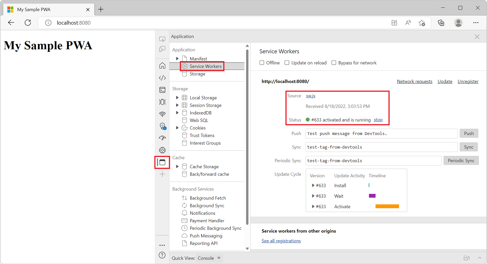
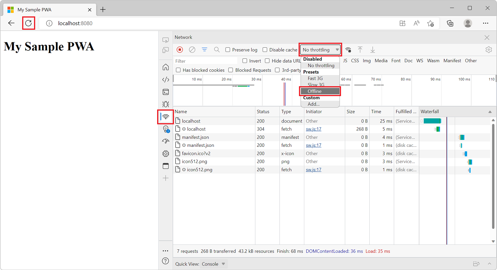
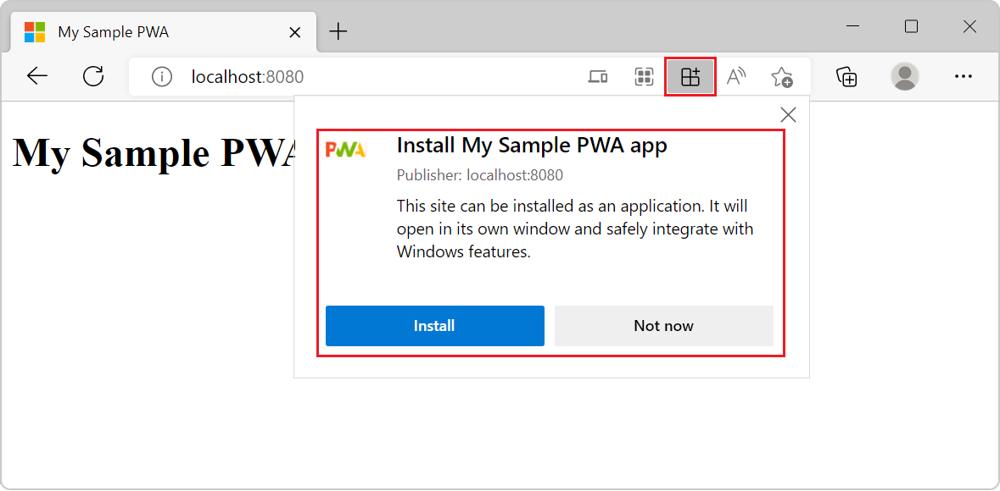

# Get started with Progressive Web Apps

Progressive Web Apps (PWAs) are websites that are [progressively enhanced](https://en.wikipedia.org/wiki/Progressive_enhancement).  The progressive enhancements include app-like features, such as installation, offline support, and push notifications.

You can also package your PWA for app stores, such as Microsoft Store, Google Play, and Mac App Store.  The Microsoft Store is the commercial app store that's built into Windows 10 and later.

In this overview of PWA basics, you create a simple website and extend it as a PWA.  The finished project works across modern browsers.

> [!TIP]
> You can use [PWABuilder](https://www.pwabuilder.com) to create a new PWA, enhance your existing PWA, or package your PWA for app stores.

<!-- link is placed here per https://github.com/MicrosoftDocs/edge-developer/issues/1974 -->
To install or run a PWA on Windows, see [Installing a PWA](../ux.md#installing-a-pwa) in _The user experience of PWAs_.


<!-- ====================================================================== -->
## Prerequisites

*   Install [Visual Studio Code](https://code.visualstudio.com) to edit your PWA source code.
*   Install [Node.js](https://nodejs.org) to use it as your local web server.


<!-- ====================================================================== -->
## Creating a basic website

In this step, you will create a simple HTML page to create a basic website, and will start a local web server to access the website in your browser.

1. Create a new directory called `MySamplePWA` on your computer.

1. Open Visual Studio Code, select **File** > **Open Folder** and then select the `MySamplePWA` directory to open your new project.

1. Create a new file in the project by pressing `Ctrl+N`, add the following content, and save the file as `index.html`:

   ```html
   <!DOCTYPE html>
   <html lang="en-US" dir="ltr">
     <head>
       <meta charset="UTF-8" />
       <meta name="viewport" content="width=device-width,initial-scale=1" />
       <link rel="shortcut icon" href="https://c.s-microsoft.com/favicon.ico?v2" />
       <title>My Sample PWA</title>
     </head>
     <body>
       <h1>My Sample PWA</h1>
     </body>
   </html>
   ```

1. Start a local web server by using the `http-server` Node.js library:

   ```shell
   cd path\to\MySamplePWA
   npx http-server
   ```
  
   In the above commands, replace `path\to\MySamplePWA` with the actual path where you create the `MySamplePWA` folder.

You now have a simple, functional website running on a local web server.

Now browse to `http://localhost:8080` to view your new website.


<!-- ====================================================================== -->
## Getting started building a PWA

Now that you have a simple website, extend it as a Progressive Web App (PWA) by adding the three requirements for PWAs:

*  [HTTPS](#step-1---use-https).
*  A [Web App Manifest](#step-2---create-a-web-app-manifest).
*  A [Service Worker](#step-3---add-a-service-worker).


<!-- ====================================================================== -->
## Step 1 - Use HTTPS

Key parts of the Progressive Web Apps platform, such as [Service Workers](https://developer.mozilla.org/docs/Web/API/Service_Worker_API), require using HTTPS.  When your PWA goes live, you must publish it to an HTTPS URL.  Many hosts now offer HTTPS by default, but if your host doesn't, [Let's Encrypt](https://letsencrypt.org/) offers a free alternative for creating the necessary certificates.

For example, you can create an [Azure free account](https://azure.microsoft.com/free).  If you host your website on the [Microsoft Azure App Service](https://azure.microsoft.com/services/app-service/web), it's served over HTTPS by default.

You can also host your website on [GitHub Pages](https://pages.github.com/) which supports HTTPS too.

For debugging purposes, Microsoft Edge also permits a `localhost` web server to use the PWA APIs without HTTPS.  In this tutorial, you use `http://localhost:8080` to build your PWA.


<!-- ====================================================================== -->
## Step 2 - Create a Web App Manifest

A [Web App Manifest](https://developer.mozilla.org/docs/Web/Manifest) is a JSON file containing metadata about your app, such as name, description, icons, and more.

To add an app manifest to the website:

1.  In Visual Studio Code, press `Ctrl`+`N` to create a new file with the following content, and save the file as `manifest.json`.

    ```json
    {
        "lang": "en-us",
        "name": "My Sample PWA",
        "short_name": "SamplePWA",
        "description": "A sample PWA for testing purposes",
        "start_url": "/",
        "background_color": "#2f3d58",
        "theme_color": "#2f3d58",
        "orientation": "any",
        "display": "standalone",
        "icons": [
            {
                "src": "/icon512.png",
                "sizes": "512x512"
            }
        ]
    }
    ```

1.  Add a 512x512 pixel app icon image named `icon512.png` to your project. You can use the [sample image](../media/progressive-web-app.png) for testing purposes.

1.  In Visual Studio Code, open `index.html`, and add the following code inside the `<head>` tag.

    ```html
    <link rel="manifest" href="/manifest.json">
    ```

   The above code snippet links the new web app manifest file to your website.

Your VS Code project should now look somewhat like this:


<!-- ====================================================================== -->
## Step 3 - Add a Service Worker

Service workers are the key technology behind PWAs.  Service workers enable scenarios that were previously limited to native apps, including:

*  Offline support.
*  Advanced caching.
*  Running background tasks.

Service workers are specialized [Web Workers](https://developer.mozilla.org/docs/Web/API/Web_Workers_API) that intercept network requests from your PWA.  Service workers can run tasks even when your PWA isn't running, including:

*   Serving requested resources from a cache.
*   Sending push notifications.
*   Running background fetch tasks.
*   Badging icons.

Service workers are defined in a special JavaScript file, described in [Using Service Workers](https://developer.mozilla.org/docs/Web/API/Service_Worker_API/Using_Service_Workers) and [Service Worker API](https://developer.mozilla.org/docs/Web/API/Service_Worker_API).

To add a service worker in your project:

1. In VS Code, create a new file (`Ctrl`+`N`), add the following content, and save the file as `sw.js`:

    ```javascript
    const CACHE_NAME = `my-sample-app-cache-v1`;
    
    // Use the install event to pre-cache all initial resources.
    self.addEventListener('install', event => {
      event.waitUntil((async () => {
        const cache = await caches.open(CACHE_NAME);
        cache.addAll(['/']);
      })());
    });
    
    self.addEventListener('fetch', event => {
      event.respondWith((async () => {
        const cache = await caches.open(CACHE_NAME);
    
        try {
          // Try to fetch the resource from the network.
          const fetchResponse = await fetch(event.request);
    
          // Save the resource in the cache.
          cache.put(event.request, fetchResponse.clone());
    
          // And return it.
          return fetchResponse;
        } catch (e) {
          // Fetching didn't work get the resource from the cache.
          const cachedResponse = await cache.match(event.request);
    
          // And return it.
          return cachedResponse;
        }
      })());
    });
    ```

   The `sw.js` file will act as your PWA's service worker. The code above listens to the `install` event and uses it to cache the request to the home page. The code also intercepts `fetch` events, which happen every time your app sends a request to the server, and applies a network-first strategy. The service worker relays requests to the server, and caches the result. When a network request fails, the cached response is used instead.

1.  Open `index.html` and add the following code at the end of the `<body>` tag to register your servier worker:

    ```html
    <script>
    if('serviceWorker' in navigator) {
      navigator.serviceWorker.register('/sw.js', { scope: '/' });
    }
    </script>
    ```

To confirm that your service worker is running:

1.  Go to your web app at `http://localhost:8080`.

1.  In Microsoft Edge, press `F12` to open DevTools.  Open the **Application** tool, then **Service Workers** to view the service workers.  If the service worker isn't displayed, refresh the page.

    

1.  View the service worker cache by expanding **Cache Storage** and selecting **my-sample-app-cache-v1**.  All of the resources cached by the service worker should be displayed.  The resources cached by the service worker include the app icon, app manifest, and the initial page.

    

1.  Try your PWA as an offline app. In DevTools, open the **Network** tool, and change the **Throttling** value to **Offline**.

1.  Refresh your app. It should still appear correctly in the browser, using cached resources served by the service worker.

    


<!-- ====================================================================== -->
## Install the app

Now that your simple website has a web app manifest and a service worker, supporting browsers can install it as a PWA.

In Microsoft Edge, once you refresh your app, the **App available** button appears in the address bar. Clicking the **App available** button prompts you to install the app locally.



Click **Install** to install the app locally. After the installation completes, your app is displayed in its own window, and its own application icon in the Taskbar.


To learn more about installing PWAs, see [The user experience of PWAs](../ux.md).


<!-- ====================================================================== -->
## Best practices and next steps

To build a robust, real-world PWA, consider the following best practices for web app development.

### Cross-browser compatibility

Test your app for [cross-browser compatibility](https://developer.mozilla.org/docs/Learn/Tools_and_testing/Cross_browser_testing).  Make sure your PWA works, by testing it in different browsers and environments.  See [Tools](https://developer.microsoft.com/microsoft-edge/tools/) at _Microsoft Edge Developer_.

### Responsive design

Use fluid layouts and flexible images.  [Responsive design](https://en.wikipedia.org/wiki/Responsive_web_design) includes the following elements that adapt your UX to your user's device:

*   CSS [grid](https://developer.mozilla.org/docs/Web/CSS/CSS_Grid_Layout).
*   [Flexbox](https://developer.mozilla.org/docs/Web/CSS/CSS_Flexible_Box_Layout).
*   [Media queries](https://developer.mozilla.org/docs/Web/CSS/Media_Queries).
*   [Responsive images](https://developer.mozilla.org/docs/Learn/HTML/Multimedia_and_embedding/Responsive_images).

To test your app locally, use [device emulation tools](../../devtools-guide-chromium/device-mode/testing-other-browsers.md) from your browser.  To test your app directly on a target device, create a remote debugging session on [Windows](../../devtools-guide-chromium/remote-debugging/windows.md) or [Android](../../devtools-guide-chromium/remote-debugging/index.md).

### Support deep linking

Support [Deep linking](https://en.wikipedia.org/wiki/Deep_linking).  Route each page of your site to a unique URL so existing users can help you engage an even broader audience through social media sharing.

### Provide a rich offline experience

Provide a rich [Offline experience](offline.md).  Make the app work even if the user's device is offline.  Provide a custom offline page rather than using the browser's default offline page.

### Use validation and testing practices

Use software validation and testing practices.  Use code quality tools such as [Webhint](https://webhint.io) to optimize the efficiency, robustness, safety, and accessibility of your app.  Use automated testing tools such as [Playwright](https://playwright.dev/) to create reliable end-to-end testing for your app.


<!-- ====================================================================== -->
## See also

*   [Progressive Web Apps on MDN web docs](https://developer.mozilla.org/Apps/Progressive)
*   [Progressive Web Apps on web.dev](https://developers.google.com/web/progressive-web-apps)
*   [Hacker News readers as Progressive Web Apps](https://hnpwa.com) - Compares different frameworks and performance patterns for implementing a sample PWA.
*   [Myth Busting PWAs](https://www.davrous.com/2019/10/18/myth-busting-pwas-the-new-edge-edition)
*   [A Progressive Roadmap for your Progressive Web App](https://cloudfour.com/thinks/a-progressive-roadmap-for-your-progressive-web-app)
*   [Offline POSTs with Progressive Web Apps](https://medium.com/web-on-the-edge/offline-posts-with-progressive-web-apps-fc2dc4ad895)
*   [PWA Q&A](https://www.aaron-gustafson.com/notebook/pwa-qa)
*   [Betting on the Web](https://joreteg.com/blog/betting-on-the-web)
*   [Naming Progressive Web Apps](https://fberriman.com/2017/06/26/naming-progressive-web-apps)
*   [Designing And Building A Progressive Web Application Without A Framework (Part 1)](https://www.smashingmagazine.com/2019/07/progressive-web-application-pwa-framework-part-1)
*   [Designing And Building A Progressive Web Application Without A Framework (Part 2)](https://www.smashingmagazine.com/2019/07/progressive-web-application-pwa-framework-part-2)
*   [Designing And Building A Progressive Web Application Without A Framework (Part 3)](https://www.smashingmagazine.com/2019/07/progressive-web-application-pwa-framework-part-3)
