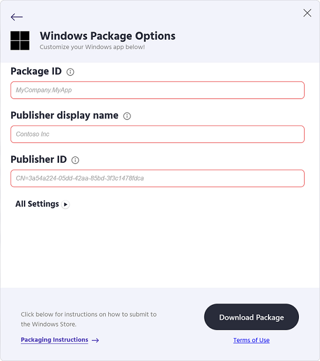
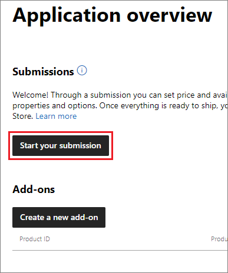

# Publish a Progressive Web App to the Microsoft Store

Publishing your Progressive Web App (PWA) to the [Microsoft Store](/windows/uwp/publish/index) brings the following advantages:

| Advantage | Description |
|---|---|
| **Discoverability** | Users naturally look for apps in the app store.  When you publish to the Microsoft Store, millions of Windows users can discover your PWA alongside other Windows apps.  The Store showcases apps through categories, curated collections, and more.  App discovery portals provide an easy browsing and shopping experience for potential users of your app.  You can even enhance your Store listing with screenshots, a hero image, and video trailers - see [App screenshots, images, and trailers](/windows/apps/publish/publish-your-app/screenshots-and-images). |
| **Trustworthiness** | Windows customers know they can trust their Microsoft Store purchases and downloads, because they adhere to the rigorous Microsoft [quality and safety standards](/legal/windows/agreements/store-policies). |
| **Easy install** | The Microsoft Store provides a consistent and user-friendly install experience across [all Windows 10 or later apps](https://www.microsoft.com/store/apps/windows). |
| **App analytics** | The [Microsoft Partner Center dashboard](/windows/uwp/publish/index) provides [detailed analytics](/windows/uwp/publish/analytics) about your app's health, usage, and more. |

To publish your PWA to the Microsoft Store, no code changes are required.  Instead, you create an app reservation in Microsoft Partner Center, package your PWA using PWA Builder, and then submit your package to the Microsoft Store.  The following sections explain these steps.


<!-- ====================================================================== -->
## Create an app reservation

To submit your app to the Microsoft Store, you use [Microsoft Partner Center](https://partner.microsoft.com/dashboard/windows/overview).

To create an app reservation:

1.  Before you can create an app reservation, you must have a **personal** Microsoft account (not a work Microsoft account or a school Microsoft account) that is enrolled in the Windows Developer Program.
    1.  If you don't already have one, create a personal Microsoft account at [account.microsoft.com](https://account.microsoft.com/).
    1.  Enroll in the Windows Developer program, by following the steps in [Open a developer account in Partner Center](/windows/apps/publish/partner-center/open-a-developer-account).

1.  Once your account is enrolled in the app developer program, follow these steps to create an app reservation:
    1.  Go to the [Partner Center Dashboard](https://partner.microsoft.com/dashboard/home). Sign in with the account you enrolled.
    1.  Under **Workspaces**, select **Apps and games**.  The **Apps and games | Overview** page appears.
    1.  Select **New product** > **MSIX or PWA app**.
    1.  When prompted, enter a name for your reservation, and then select **Reserve product name**.

    

1.  To display your publisher details for use in the [Package your PWA](#package-your-pwa-for-the-store) section, select **Product management** > **Product Identity**.

    
    <!-- lightbox justified because large detailed image -->

1.  Copy and save the following values.
    *   **Package ID**
    *   **Publisher ID**
    *   **Publisher display name**


<!-- ====================================================================== -->
## Package your PWA for the Store

Now that you've gathered the publishing information about your app, generate a Windows app package for your PWA by using PWA Builder.

To generate an app package:

1.  Go to [PWA Builder](https://www.pwabuilder.com).

1.  Under **Ship your PWA to app stores**, enter the URL of your PWA in the text box, and then click the **Start** button.

    Your PWA is evaluated to ensure it is store-ready.

1.  If the evaluation in the PWABuilder report card page indicates that your PWA is ready to be packaged, continue to the next step.  If the evaluation indicates that your PWA is not ready to be packaged, examine the **Action Items** section to see how to improve your PWA:

    

1.  Once your PWA is ready to be packaged, in the upper-right corner of the PWABuilder report card page, click the **Package For Stores** button. A dialog opens, showing the message **Awesome! Your PWA is store ready!**.

1.  Under **Windows**, click the **Generate Package** button. The **Windows Package Options** dialog opens.

1.  Paste the following values, which you saved in the [Create an app reservation](#create-an-app-reservation) section above:
    *  **Package ID**
    *  **Publisher display name**
    *  **Publisher ID**

    

1.  Click the **Download Package** button to download your Windows package.

Your download is a `.zip` archive that contains an `.msixbundle` file and a `.classic.appxbundle` file.  The two app packages allow your PWA to run on a wide variety of Windows versions.

See also:

* [What is a classic package?](https://github.com/pwa-builder/pwabuilder-windows-chromium-docs/blob/master/classic-package.md)<!-- changing "master" to "main" in that URL doesn't work, as of August 11, 2023 -->
* [Bundling MSIX packages](/windows/msix/package/bundling-overview).

#### Submit your app package to the Microsoft Store

To submit your app to the Microsoft Store:

1.  Go to [Microsoft Partner Center](https://partner.microsoft.com/dashboard/windows/overview).
1.  Select your app.
1.  Click the **Start your submission** button.

    

1.  When you're prompted, provide information about your app, such as pricing and age rating.

1.  On the **Packages** prompt, select the `.msixbundle` and the `.classic.appxbundle` files you generated in the [Package your PWA](#package-your-pwa-for-the-store) section.

After you complete your submission, your app is reviewed, typically within 24 to 48 hours.  After you receive approval, your PWA is available in the Microsoft Store.


<!-- ====================================================================== -->
## Measure usage of your PWA installed from the Microsoft Store

When your PWA is initially launched, if the PWA was installed from the Microsoft Store, Microsoft Edge includes the following `Referer` header with the request of the first navigation of your web app.

```
Referer: app-info://platform/microsoft-store
```

Use this feature to measure distinct traffic from your PWA that was installed from the Microsoft Store.  Based on the traffic, you can adjust your app's content to improve the user experience.  This feature is accessible to both client and server code. To access this information on the client side, you can query `document.referrer` in your JavaScript.


<!-- ====================================================================== -->
## Redirect to locale-specific domains without displaying additional UI

By default, a PWA that's installed from the Microsoft Store displays an additional UI when the app is redirected to a locale-specific domain.  The added UI shows the URL and page title.  This UI is added because navigation to the locale-specific domain is considered _out of scope_.

The following figure shows the UI that is introduced when a user moves outside the scope of a PWA. 


#### Domain redirection with PWAs installed from the browser

A Web App Manifest is tied to a single domain.  However, some PWAs use locale-specific domains for their customers in specific regions of the globe.  When visiting the PWA in a web browser, customers are seamlessly transitioned from the principal domain (for example, `contoso.com`) to a locale-specific domain (for example, `contoso.co.ke`), because the redirect happens during initial load of that website.

Customers who install the PWA from Microsoft Edge would therefore install the PWA from the locale-specific domain.  Subsequent launches of the PWA go directly to that locale-specific domain, instead of first going to the principal domain.

#### Domain redirection with PWAs installed from the Microsoft Store

PWAs that are installed from the Microsoft Store have a hard-coded start URL that is pointed at the principal domain.  When the PWA is launched, the PWA initially navigates to the principal domain, and then a customer may (as necessary) be redirected to their locale-specific domain. If that redirection occurs, the navigation is considered "out of scope".  As a result, the app displays the URL and page title at the top of the page.

Displaying the URL and page title is a security feature to ensure that users know they have left the context of the PWA.  This added UI makes sense when a user loads a page from another website in the context of the PWA.  However, that added UI may be inappropriate when a user moves among domains that are all part of the same website.

#### Prevent the locale-specific URL and title from being displayed

It's currently impossible, for apps installed from the Microsoft Store, to prevent displaying the additional URL and title UI when redirecting to a locale-specific domain.

In the future, _scope extensions_ will make it possible for a PWA to capture navigation to paths, subdomains, or even sites other than its own scope. The scope extensions feature is in active development and isn't ready to be used yet. To find out more about the state of development of this feature in Chromium, check out the [Web app scope extensions feature](https://chromestatus.com/feature/5746537956114432) at Chrome Platform Status.

Once the feature can be used in Microsoft Edge, we will document it here. In the meantime, to learn more about how scope extensions will work, see the [explainer document on the WICG repository](https://github.com/WICG/manifest-incubations/blob/gh-pages/scope_extensions-explainer.md).


<!-- ====================================================================== -->
## Make updates to your app

Generally, when you update your PWA code, you don't need to create a new app package and submit it to the Microsoft Store again. For example, suppose you make changes to your app's front-end HTML, CSS, or JavaScript code, or to your service worker. The next time the user launches the app, the changes are downloaded by the browser that's running your app from your web server.

However, if you make changes to the web app manifest file, you must create a new app package and submit it to the Microsoft Store again. For example, in the manifest, you might change the app icon or app name, or add manifest members such as `file_handlers`, `protocol_handlers`, or `share_target`. Creating and submitting a new app package is required when the manifest is changed, because the information in the web app manifest file is copied to the Windows app package, for better integration with Windows.


<!-- ====================================================================== -->
## See also

*   [Test and submit your PWA app package](https://github.com/pwa-builder/pwabuilder-windows-chromium-docs/blob/master/next-steps.md)
*   [Publish a new PWA to the Store](https://github.com/pwa-builder/pwabuilder-windows-chromium-docs/blob/master/publish-new-app.md)
*   [Update an existing Store app to a PWA](https://github.com/pwa-builder/pwabuilder-windows-chromium-docs/blob/master/update-existing-app.md)
*   [Image recommendations for PWAs in the Store](https://github.com/pwa-builder/pwabuilder-windows-chromium-docs/blob/master/image-recommendations.md)
*   [App packaging explainer](https://github.com/pwa-builder/pwabuilder-windows-chromium-docs/blob/master/classic-package.md)
