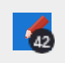
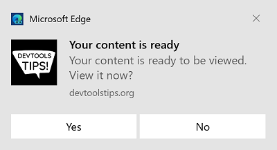

# Re-engage users with badges and notifications

Progressive Web Apps (PWAs) are able to do work when the app isn't running, such as updating data in the cache, or sending messages when the device regains connectivity.  To do this, use the following APIs, which are described in [Synchronize and update a PWA in the background](background-syncs.md):

*  Background Sync API
*  Periodic Background Sync API
*  Background Fetch API

To re-engage the user with the app after a background task has been completed, you can use notifications and badges.  To do this, use the following APIs:

*  App Badging API
*  Notifications API

Badges are user-friendly, and can be used frequently.  Badges don't interrupt the user's workflow, and are useful for displaying a small amount of information, such as the number of messages received.

Notifications are useful for apps to take part in the system's notification center and display images and text information.  Notifications are useful to alert the user about an important change of state in your app.  However, notifications should be used rarely, because they tend to be disruptive to the user's workflow.


<!-- ====================================================================== -->
## Display a badge on the app icon

PWAs can display a badge on their app icon by using the [App Badging API](https://developer.mozilla.org/docs/Web/API/Badging_API).  The badge can be empty or it can contain a number.

### Check for support

Before using the App Badging API, first check whether the App Badging API is supported in the browser engine that your app runs in, as follows:

```javascript
if (navigator.setAppBadge) {
    console.log("The App Badging API is supported!");
}
```

### Displaying the badge

To set the badge, use the following code from your app frontend or service worker.

```javascript
// To display an empty badge
navigator.setAppBadge();

// To display a number in the badge
navigator.setAppBadge(42);
```



The `setAppBadge` function returns a Promise, which can be used to know when the badge was added, and to catch potential errors, as follows:

```javascript
navigator.setAppBadge(42).then(() => {
    console.log("The badge was added");
}).catch(e => {
    console.error("Error displaying the badge", e);
});
```

### Clearing the badge

To remove the badge on the app icon, use the following code from your frontend or service worker:

```javascript
navigator.clearAppBadge();
```

The `clearAppBadge` also returns a Promise that can be used to handle potential errors.

Another way to clear a badge is to call `setAppBadge` again, but pass `0` as the value, this time:

```javascript
navigator.setAppBadge(0);
```


<!-- ====================================================================== -->
## Display notifications in the action center

PWAs can display notifications by using the [Notifications API](https://developer.mozilla.org/docs/Web/API/Notifications_API).

### Check for support

Before using the API, check that it is supported, as follows:

```javascript
if ("Notification" in window) {
    console.log("The Notifications API is supported");
}
```

### Request permission

The Notifications API can only be used after having requested the user's permission to display messages. To request permission, use the `requestPermission` function, as shown below.

Requesting permission should only be done in response to a user action. This is a best practice, to avoid interrupting the user with permission prompts when the user hasn't yet interacted with a feature that uses notifications.

```javascript
button.addEventListener("click", () => {
    Notification.requestPermission().then(permission => {
        if (permission === "granted") {
            console.log("The user accepted");
        }
    });
});
```

You can check the permission status again later:

```javascript
if (Notification.permission === "granted") {
    console.log("The user already accepted");
}
```

### Display the notification

Once you know that the API is supported and the user has accepted notifications, you can display a notification by creating a `Notification` object:

```javascript
const notification = new Notification("Hello World!");
```


The above code displays a text-only notification message, but you can also customize the message by including additional `body` and `icon` properties:

```javascript
const notification = new Notification("Hello World!", {
    body: "This is my first notification message",
    icon: "/assets/logo-192.png",
});
```


You can also display notifications from your app's service worker. This is useful because the service worker may be doing work while your app isn't running. To send a notification from your service worker, use the `ServiceWorkerRegistration.showNotification` function:

```javascript
self.registration.showNotification("Hello from the Service Worker!");
```

The `showNotification` function supports the same arguments as the `Notification` constructor used in the previous example.  The `showNotification` function also supports the `actions` property, which is described in the following section.

### Add actions to notifications

In a notification, it's possible to add actions for the user to perform.  This is only supported in persistent notifications which are shown by using the `ServiceWorkerRegistration.showNotification` function.

```javascript
self.registration.showNotification("Your content is ready", {
    body: "Your content is ready to be viewed. View it now?",
    icon: "/assets/logo-192.png",
    actions: [
        {
            action: "view-content",
            title: "Yes"
        },
        {
            action: "go-home",
            title: "No"
        }
    ]
});
```



When the user clicks one of the action buttons, your PWA can handle the click by listening for the `notificationclick` event.  When a `notificationclick` event is received, close the notification and run some code:

```javascript
self.addEventListener('notificationclick', event => {
    // Close the notification.
    event.notification.close();

    // React to the action.
    if (event.action === 'view-content') {
        console.log("view-content action was clicked");
    } else if (event.action === 'go-home') {
        console.log("go-home action was clicked");
    } else {
        console.log("main body of the notification was clicked");
    }
}, false);
```

To learn more about notification actions, see [Notification.actions](https://developer.mozilla.org/docs/Web/API/notification/actions) at MDN.
