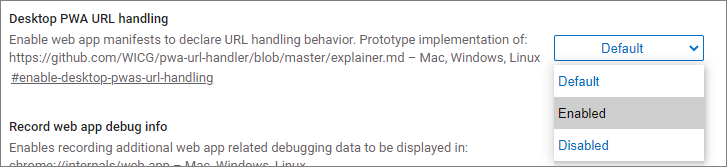

# Experimental features and origin trials for PWAs

Some of the PWA features in Microsoft Edge are still experimental.  You can turn on support for an experimental feature in your own Microsoft Edge browser for website development, and in the website user's Microsoft Edge browser:

* [Turn on the experimental feature in your own browser](#turn-on-the-experimental-feature-in-your-own-browser)
* [Register for an origin trial and turn on the experimental feature in users' browsers](#register-for-an-origin-trial-and-turn-on-the-experimental-feature-in-users-browsers)

<!-- ====================================================================== -->
## Turn on the experimental feature in your own browser

enabling the corresponding flag in Microsoft Edge.

To turn experimental features on or off:

1. Open Microsoft Edge.

1. Go to `edge://flags`.

1. Navigate to the relevant experiment.

1. In the dropdown menu next to the experiment description, select **Enabled** to turn on the feature, or **Disabled** to turn it off:

   

<!-- ====================================================================== -->
## Register for an origin trial and turn on the experimental feature in users' browsers

To test an experimental feature in production with your users, enroll your site in an origin trial.  To turn on support for an experimental feature in users' browsers, enroll your site in an origin trial, obtain a token, and then add the token to your website.

Microsoft Edge sometimes uses origin trials to test features for specific domains or websites.  You may want to use an origin trial for your website to apply a specific feature.  As a website owner, you can enroll in an origin trial.  An origin trial provides features to a percentage<!-- todo: which browsers/users? --> of Microsoft Edge users who visit your website.

To see what origin trials (experimental features) are available, go to [Microsoft Edge Origin Trials](https://developer.microsoft.com/microsoft-edge/origin-trials).

See also:
* [Use origin trials in Microsoft Edge](../../origin-trials/index.md)

<!-- ====================================================================== -->
## See also
<!-- all links in article -->

* [Use origin trials in Microsoft Edge](../../origin-trials/index.md)
   * [Microsoft Edge Origin Trials](https://developer.microsoft.com/microsoft-edge/origin-trials)
* [What's New in Progressive Web Apps](../whats-new/pwa.md)<!-- link not in article body -->
