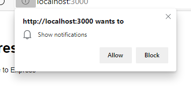
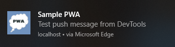
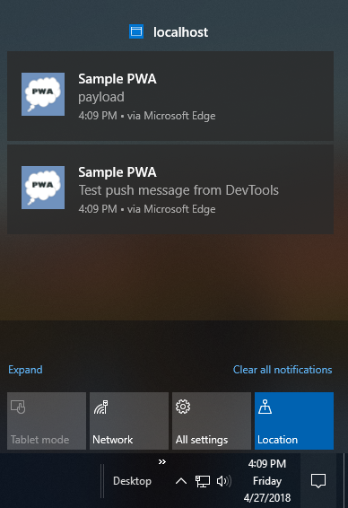

# Re-engage users with push messages

Push messages are a useful communication channel that lets applications update their users with relevant and timely content. Push messages can be used to re-engage users with your app.

One of the most significant advantages of push messages is that they can be delivered by your app's server even when the user isn't actively using your app.

Push message notifications are useful for apps to take part in the system's notification center and display images and text information.  Notifications are useful to alert the user about an important updates in your app.  However, notifications should be used rarely, because they tend to be disruptive to the user's workflow.

To create a PWA that supports push notifications:

1.  Subscribe to a messaging service using the [Push API](https://developer.mozilla.org/docs/Web/API/Push_API).
1.  Display a toast message when a message is received from the service, by using the [Notifications API](https://developer.mozilla.org/docs/Web/API/Notifications_API).

Like Service Workers, the push notification APIs are standards-based APIs.  The push notification APIs work across browsers, so your code should work everywhere that PWAs are supported.  For more information about delivering push messages to different browsers on your server, see [Web-Push](https://www.npmjs.com/package/web-push).


<!-- ====================================================================== -->
## Step 1 - Generate VAPID keys

Push notifications require VAPID (Voluntary Application Server Identification) keys in order to send push messages to the PWA client.  There are several VAPID key generators available online (for example, [vapidkeys.com](https://vapidkeys.com)).

After the keys are generated, you'll receive a JSON object that contains a public and private key.  Save the VAPID keys for later use in the tutorial below.

For information about VAPID and WebPush, see [Sending VAPID identified WebPush Notifications using the Mozilla Push Service](https://blog.mozilla.org/services/2016/08/23/sending-vapid-identified-webpush-notifications-via-mozillas-push-service).


<!-- ====================================================================== -->
## Step 2 - Subscribe to push notifications

Service workers handle push events and toast notification interactions in your PWA.  To subscribe the PWA to server push notifications:

*   Make sure your service worker is installed, active, and registered.
*   Make sure your code for completing the subscription task is on the main UI thread of the PWA.
*   Make sure you have network connectivity.

Before a new push subscription is created, Microsoft Edge checks whether the user has granted the PWA permission to receive notifications.

If the user has not granted the PWA permission to receive notifications, the user is prompted by the browser for permission.  If the user doesn't grant permission to the browser, the request to `registration.pushManager.subscribe` throws a `DOMException`, which must be handled.  For more on permission management, go to [Push Notifications in Microsoft Edge](https://blogs.windows.com/msedgedev/2016/05/16/web-notifications-microsoft-edge#UAbvU2ymUlHO8EUV.97).

In your `pwabuilder-sw-register.js` file, append the following code:

```javascript
// Ask the user for permission to send push notifications.
navigator.serviceWorker.ready
    .then(function (registration) {
        // Check if the user has an existing subscription
        return registration.pushManager.getSubscription()
            .then(function (subscription) {
                if (subscription) {
                    return subscription;
                }

                const vapidPublicKey = "PASTE YOUR PUBLIC VAPID KEY HERE";
                return registration.pushManager.subscribe({
                    userVisibleOnly: true,
                    applicationServerKey: urlBase64ToUint8Array(vapidPublicKey)
                });
            });
    });

// Utility function for browser interoperability
function urlBase64ToUint8Array(base64String) {
    var padding = '='.repeat((4 - base64String.length % 4) % 4);
    var base64 = (base64String + padding)
        .replace(/\-/g, '+')
        .replace(/_/g, '/');

    var rawData = window.atob(base64);
    var outputArray = new Uint8Array(rawData.length);

    for (var i = 0; i < rawData.length; ++i) {
        outputArray[i] = rawData.charCodeAt(i);
    }
    return outputArray;
}
```

See also [PushManager](https://developer.mozilla.org/docs/Web/API/PushManager) and [Web-Push](https://www.npmjs.com/package/web-push#usage).


<!-- ====================================================================== -->
## Step 3 - Listen for push notifications

After a subscription is created in your PWA, add handlers to the service worker to respond to push events.  Push event are sent from the server to display toast notifications.  Toast notifications display data for a received message.  To do any of the following tasks, you must add a `click` handler:

*   Dismissing the toast notification.
*   Opening a window.
*   Putting focus on a window.
*   Opening and putting focus on a new window to display a PWA client page.

To add a `click` handler, in your `pwabuilder-sw.js` file, add the following handlers for the `push` event and the `notificationclick` event:

```javascript
// Respond to a server push with a user notification.
self.addEventListener('push', function (event) {
    if (Notification.permission === "granted") {
        const notificationText = event.data.text();
        const showNotification = self.registration.showNotification('Sample PWA', {
            body: notificationText,
            icon: 'images/icon512.png'
        });
        // Make sure the toast notification is displayed.
        event.waitUntil(showNotification);
    }
});

// Respond to the user selecting the toast notification.
self.addEventListener('notificationclick', function (event) {
    console.log('On notification click: ', event.notification.tag);
    event.notification.close();

    // Display the current notification if it is already open, and then put focus on it.
    event.waitUntil(clients.matchAll({
        type: 'window'
    }).then(function (clientList) {
        for (var i = 0; i < clientList.length; i++) {
            var client = clientList[i];
            if (client.url == 'http://localhost:1337/' && 'focus' in client)
                return client.focus();
        }
        if (clients.openWindow)
            return clients.openWindow('/');
    }));
});
```

<!-- ====================================================================== -->
## Step 4 - Try it out

To test push notifications for your PWA:

1.  Go to your PWA at `http://localhost:3000`.  When your service worker activates and attempts to subscribe your PWA to push notifications, Microsoft Edge prompts you to allow your PWA to show notifications.  Select **Allow**.

    

1.  Simulate a server-side push notification, as follows.  With your PWA opened at `http://localhost:3000` in your browser, select **F12** to open DevTools.  Select **Application** > **Service Worker** > **Push** to send a test push notification to your PWA.

    The push notification is displayed near the taskbar.

    

    If you don't select (or _activate_) a toast notification, the system automatically dismisses it after several seconds and queues it in your Windows Action Center.

    


<!-- ====================================================================== -->
## See also

*   [Web Push Notifications Demo](https://webpushdemo.azurewebsites.net)
