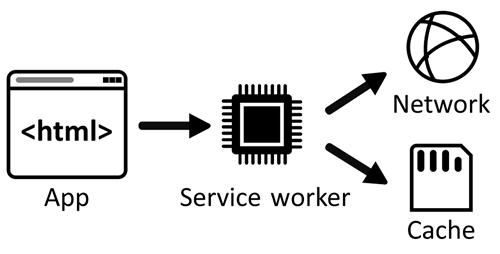

# Use a service worker to manage network requests

A _service worker_ is a special type of [web worker](https://developer.mozilla.org/docs/Web/API/Web_Workers_API) that's able to intercept, modify, and respond to network requests by using the `Fetch` API.  To store resources, a service worker can access the `Cache` API, and can access asynchronous client-side data stores, such as `IndexedDB`.

A service worker can make your PWA faster by caching resources locally, and can also make your PWA more reliable by enabling it to work even when the user's device is offline or has an intermittent network connection.

If your PWA has a service worker, the service worker is installed the first time the user accesses your PWA. The service worker then runs in parallel with your app, and can continue doing work even when your app isn't running.

A service worker is responsible for intercepting, modifying, and responding to network requests.  The service worker can be alerted when the app tries to load a resource from the server, or when the app sends a request to get data from the server.  When this happens, the service worker can decide to let the request go to the server, or intercept the request and return a response from the cache instead.




<!-- ====================================================================== -->
## Register a service worker

Similar to other web workers, a service worker must exist in a separate file.  The file contains a single service worker.  You reference this file when registering the service worker, as shown in the following code:

```javascript
if ("serviceWorker" in navigator) {
  navigator.serviceWorker.register("/serviceworker.js");
}
```

The web browser that's running your PWA can provide different levels of support for your service worker.  Also, the context in which your PWA is running might not be secure. Therefore, it's a good practice to test for the existence of the `navigator.serviceWorker` object before running any service worker-related code.  In the above code, a service worker is registered by using the `serviceworker.js` file that's located at the root of the site.

Make sure to place the service worker file in the highest-level directory that you want the service worker to manage.  Such a directory is called the _scope_ of the service worker.  In the previous code, the file is stored in the root directory of your app, and the service worker manages all pages that are under the app's domain name.

If the service worker file was stored in a `js` directory, the scope of the service worker would be limited to the `js` directory and any subdirectories.  As a best practice, place the service worker file in the root of your app, unless you need to reduce the scope of your service worker.


<!-- ====================================================================== -->
## Intercept requests

The main event that you use in a service worker is the `fetch` event. The `fetch` event runs every time the browser that your app runs in attempts to access content within the scope of the service worker.

The following code shows how to add a listener for the `fetch` event:

```javascript
self.addEventListener("fetch", event => {
  console.log("Fetching", event.request);
});
```

Within the `fetch` handler, you can control whether a request goes to the network, pulls from the cache, and so on.  The approach you take will likely vary, based on the type of resource being requested, how frequently it is updated, and other business logic that's unique to your application.

Here are a few examples of what you can do within the `fetch` handler:

* If available, return a response from the cache; otherwise, request the resource over the network.
* Fetch a resource from the network, cache a copy, and return the response.
* Allow users to specify a preference to save data.
* Supply a placeholder image for certain image requests.
* Generate a response directly in the service worker.


<!-- ====================================================================== -->
## The service worker lifecycle

The lifecycle of a service worker consists of multiple steps, with each step triggering an event. You can add listeners to these events to run code to perform an action. The following list presents a high-level view of the lifecycle and related events of a service worker:

1.  Register the service worker.

1.  The browser downloads the JavaScript file, installs the service worker, and triggers the `install` event. You can use the `install` event to pre-cache any important and long-lived files (such as CSS files, JavaScript files, logo images, or offline pages) from your app.

    ```javascript
    self.addEventListener("install", event => {
      console.log("Install event in progress.");
    });
    ```

1.  The service worker is activated, which triggers the `activate` event.  Use this event to clean up outdated caches.

    ```javascript
    self.addEventListener("activate", event => {
      console.log("Activate event in progress.");
    });
    ```

1.  The service worker is ready to run when the page is refreshed or when the user goes to a new page on the site. If you want to run the service worker without waiting, use the `self.skipWaiting()` method during the `install` event, as follows:

    ```javascript
    self.addEventListener("install", event => {
      self.skipWaiting();
    });
    ```

1.  The service worker is now running and can listen to `fetch` events.


<!-- ====================================================================== -->
## Pre-cache resources

When a user accesses your app for the first time, if you defined a service worker, the app's service worker is installed. Use the `install` event in your service worker code to detect when this occurs, and cache all the static resources your app needs. Caching your app's static resources (such as the HTML, CSS, and JavaScript code) that are needed by the start page makes it possible for your app to run even when the user's device is offline.

To cache your app's resources, use the global `caches` object and the `cache.addAll` method, as shown below:

```javascript
// The name of the cache your app uses.
const CACHE_NAME = "my-app-cache";
// The list of static files your app needs to start.
const PRE_CACHED_RESOURCES = ["/", "styles.css", "app.js"];

// Listen to the `install` event.
self.addEventListener("install", event => {
  async function preCacheResources() {
    // Open the app's cache.
    const cache = await caches.open(CACHE_NAME);
    // Cache all static resources.
    cache.addAll(PRE_CACHED_RESOURCES);
  }

  event.waitUntil(preCacheResources());
});
```

Note that after the initial installation, the `install` event does not run again. To update your service worker's code, see [Update your service worker](#update-your-service-worker).

Now you can use the `fetch` event to return the static resources from the cache, instead of loading them again from the network:

```javascript
self.addEventListener("fetch", event => {
  async function returnCachedResource() {
    // Open the app's cache.
    const cache = await caches.open(CACHE_NAME);
    // Find the response that was pre-cached during the `install` event.
    const cachedResponse = await cache.match(event.request.url);

    if (cachedResponse) {
      // Return the resource.
      return cachedResponse;
    } else {
      // The resource wasn't found in the cache, so fetch it from the network.
      const fetchResponse = await fetch(event.request.url);
      // Put the response in cache.
      cache.put(event.request.url, fetchResponse.clone());
      // And return the response.
      return fetchResponse.
    }
  }

  event.respondWith(returnCachedResource());
});
```

For brevity, the above code example doesn't handle the cases where getting the request URL from the network failed.


<!-- ====================================================================== -->
## Use a custom offline page

When your app uses multiple HTML pages, a common offline scenario is to redirect page navigation requests to a custom error page when the user's device is offline:

```javascript
// The name of the cache your app uses.
const CACHE_NAME = "my-app-cache";
// The list of static files your app needs to start.
// Note the offline page in this list.
const PRE_CACHED_RESOURCES = ["/", "styles.css", "app.js", "/offline"];

// Listen to the `install` event.
self.addEventListener("install", event => {
  async function preCacheResources() {
    // Open the app's cache.
    const cache = await caches.open(CACHE_NAME);
    // Cache all static resources.
    cache.addAll(PRE_CACHED_RESOURCES);
  }

  event.waitUntil(preCacheResources());
});

self.addEventListener("fetch", event => {
  async function navigateOrDisplayOfflinePage() {
    try {
      // Try to load the page from the network.
      const networkResponse = await fetch(event.request);
      return networkResponse;
    } catch (error) {
      // The network call failed, the device is offline.
      const cache = await caches.open(CACHE_NAME);
      const cachedResponse = await cache.match("/offline");
      return cachedResponse;
    }
  }

  // Only call event.respondWith() if this is a navigation request
  // for an HTML page.
  if (event.request.mode === 'navigate') {
    event.respondWith(navigateOrDisplayOfflinePage());
  }
});
```


<!-- ====================================================================== -->
## Update your service worker


<!-- ------------------------------ -->
#### Install a new service worker version

If you make changes to your service worker code and deploy the new service worker file to your web server, your users' devices will gradually start using the new service worker.

Every time a user navigates to one of your app's pages, the browser that's running the app checks if a new version of the service worker is available on the server. The browser detects new versions by comparing the contents between the existing service worker and the new service worker. When a change is detected, the new service worker is installed (its `install` event is triggered), and then the new service worker waits for the existing service worker to stop being used on the device.

In practice, this means that there can be two service workers running at the same time, but only the existing (original) service worker intercepts the app's network requests. When the app is closed, the existing service worker stops being used. The next time the app is opened, the new service worker is activated. The `activate` event is triggered, and the new service worker starts intercepting `fetch` events.

You can forcefully activate the new service worker as soon as it's installed, by using `self.skipWaiting()` in your service worker's `install` event handler.

To learn more about how a service worker gets updated, see [Updating the service worker](https://web.dev/service-worker-lifecycle#updates) on web.dev.


<!-- ------------------------------ -->
#### Update your cached static files

When pre-caching static resources such as CSS stylesheet files, as described in [Pre-cache resources](#pre-cache-resources), your app only uses the cached versions of the files, and doesn't try to download new versions.

To make sure users get the latest changes to the static resources that are used by your app, use a cache-busting naming convention and update your service worker code.

_Cache-busting_ means that each static file is named according to its version. This can be achieved in various ways, but usually involves using a build tool that reads the content of a file and generates a unique ID based on the content. That ID can be used to name the cached static file. 

Next, update your service worker code to cache the new static resources during `install`:

```javascript
// The name of the new cache your app uses.
const CACHE_NAME = "my-app-cache-v2";
// The list of static files your app needs to start.
const PRE_CACHED_RESOURCES = ["/", "styles-124656.css", "app-576391.js"];

// Listen to the `install` event.
self.addEventListener("install", event => {
  async function preCacheResources() {
    // Open the app's cache.
    const cache = await caches.open(CACHE_NAME);
    // Cache the new static resources.
    cache.addAll(PRE_CACHED_RESOURCES);
  }

  event.waitUntil(preCacheResources());
});

// Listen to the `activate` event to clear old caches.
self.addEventListener("activate", event => {
  async function deleteOldCaches() {
    // List all caches by their names.
    const names = await caches.keys();
    await Promise.all(names.map(name => {
      if (name !== CACHE_NAME) {
        // If a cache's name is the current name, delete it.
        return caches.delete(name);
      }
    }));
  }

  event.waitUntil(deleteOldCaches());
});
```

Compare the `CACHE_NAME` and `PRE_CACHED_RESOURCES` values between the above code snippet and the one in [Pre-cache resources](#pre-cache-resources). When this new service worker is installed, a new cache will be created and the new static resources will be downloaded and cached. When the service worker is activated, the old cache will be deleted. At this point, the user will have the new version of the app.

Making changes to your service worker can sometimes be complex. Use a library such as [Workbox](https://developer.chrome.com/docs/workbox/) to simplify your static resources build step and your service worker code.


<!-- ====================================================================== -->
## Test for network connections in your PWA

It's helpful to know when a network connection is available, in order to synchronize data or inform users that the network status has changed.

Use the following options to test for network connectivity:


<!-- ------------------------------ -->
#### navigator.onLine

The `navigator.onLine` property is a boolean that lets you know the current status of the network. If the value is `true`, the user is online; otherwise, the user is offline.

To learn more, see [navigator.onLine](https://developer.mozilla.org/docs/Web/API/NavigatorOnLine) on MDN.


<!-- ------------------------------ -->
#### Online and offline events

You can take action when your network connectivity changes.  You can listen and take action in response to network events.  The events are available on the `window`, `document`, and `document.body` elements, as shown below:

```javascript
window.addEventListener("online",  function(){
    console.log("You are online!");
});
window.addEventListener("offline", function(){
    console.log("Network connection lost!");
});
```

To learn more, see [Navigator.onLine](https://developer.mozilla.org/docs/Web/API/Navigator/onLine) on MDN.


<!-- ====================================================================== -->
## Other capabilities

A service worker's main responsibility is to make your app faster and more reliable in the event of an unstable network connection.  A service worker typically uses the `fetch` event and `Cache` API to do this, but a service worker can use other APIs for specialized scenarios, such as:

* Background synchronization of data.
* Periodic synchronization of data.
* Large background file downloads.
* Handling and notifications of Push messages.


<!-- ------------------------------ -->
#### Background synchronization

Use the Background Sync API to allow users to continue using your app and perform actions even when the user's device is offline.

For example, an email app can let its users compose and send messages at any time. The app frontend can try to send the message right away, and if the device is offline, the service worker can catch the failed request and use the Background Sync API to defer the task until connected.

To learn more, see [Use the Background Sync API to synchronize data with the server](background-syncs.md#use-the-background-sync-api-to-synchronize-data-with-the-server).


<!-- ------------------------------ -->
#### Period background synchronization

The Periodic Background Sync API lets PWAs retrieve fresh content periodically, in the background, so users can immediately access the content when they later open the app again.

By using the Periodic Background Sync API, PWAs don't have to download new content (such as new articles) while the user is using the app.  Downloading content could slow down the experience, so instead, the app can retrieve the content at a more convenient time.

To learn more, see [Use the Periodic Background Sync API to regularly get fresh content](background-syncs.md#use-the-periodic-background-sync-api-to-regularly-get-fresh-content).


<!-- ------------------------------ -->
#### Large background file downloads

The Background Fetch API allows PWAs to completely delegate downloading large amounts of data to the browser engine. This way, the app and service worker don't have to be running at all while the download is in progress.

This API is useful for apps that let users download large files (such as music, movies, or podcasts) for offline use cases. The download is delegated to the browser engine, which knows how to handle an intermittent connection or even a complete loss of connectivity.

To learn more, see [Use the Background Fetch API to fetch large files when the app or service worker isn't running](background-syncs.md#use-the-background-fetch-api-to-fetch-large-files-when-the-app-or-service-worker-isnt-running).


<!-- ------------------------------ -->
#### Push messages

Push messages can be sent to your users without them having to be using the app at the time. A service worker can listen to push messages that are sent by your server even if the app isn't running, and display a notification in the operating system's notification center.

To learn more, see [Re-engage users with push messages](push.md).


<!-- ====================================================================== -->
## Debug with DevTools

Using Microsoft Edge DevTools, you can see if your service worker has been registered correctly, and see which lifecycle state the service worker is currently in. Also, you can debug the JavaScript code in your service worker.

To learn more, see [Debug your service worker](./debug.md#debug-your-service-worker) in _Debug Progressive Web Apps_.


<!-- ====================================================================== -->
## See also

*   [Making PWAs work offline with Service workers](https://developer.mozilla.org/docs/Web/Progressive_web_apps/Offline_Service_workers)
*   [How to make PWAs re-engageable using Notifications and Push](https://developer.mozilla.org/docs/Web/Progressive_web_apps/Re-engageable_Notifications_Push)
*   [Workbox](https://developer.chrome.com/docs/workbox/)
