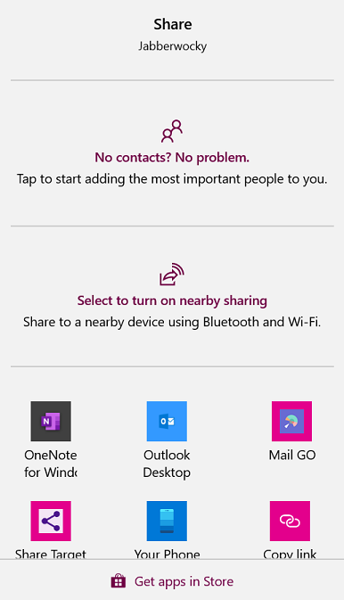
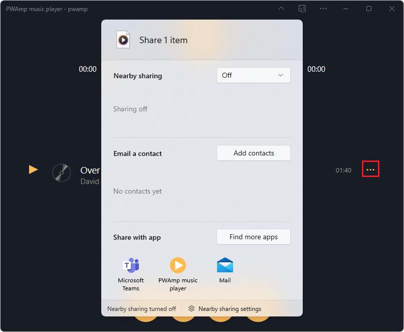

# Share content with other apps

Sharing content between apps was made popular by mobile devices where manipulating files or copying content is less intuitive than on desktop operating systems.  For example, on mobile, it's common to share an image with a friend by sending a text message.  But sharing content isn't reserved to mobile devices; it's possible to share between apps on Windows, too.

There are two directions to sharing content, and both directions can be handled by Progressive Web Apps (PWAs):

| Direction | Description |
|---|---|
| Sharing content | To share content, a PWA generates content (such as text, links, or files) and hands off the shared content to the operating system.  The operating system lets the user decide which app they want to use to receive that content. |
| Receiving shared content | To receive content, a PWA acts as a content target.  The PWA is registered with the operating system as a content-sharing target. |

PWAs that register as share targets feel natively integrated into the OS, and are more engaging to users.


<!-- ====================================================================== -->
## Sharing content

PWAs can use the [Web Share API](https://developer.mozilla.org/docs/Web/API/Web_Share_API) to trigger displaying the operating system share dialog.

> [!NOTE]
> Web sharing only works on sites served over HTTPS (which is the case for PWAs), and can only be invoked in response to a user action.

To share content such as links, text, or files, use the `navigator.share` function, as shown below.  The `navigator.share` function accepts an object that should have at least one of the following properties:

*   `title`: a short title for the shared content.
*   `text`: a longer description for the shared content.
*   `url`: the address of a resource to be shared.
*   `files`: an array of files to be shared.

```javascript
function shareSomeContent(title, text, url) {
  if (!navigator.share) {
    return;
  }

  navigator.share({title, text, url}).then(() => {
    console.log('The content was shared successfully');
  }).catch(error => {
    console.error('Error sharing the content', error);
  });
}
```

In the above code, we first check whether the browser supports Web sharing, by testing if `navigator.share` is defined.  The `navigator.share` function returns a [Promise](https://developer.mozilla.org/docs/Web/JavaScript/Reference/Global_Objects/Promise) object that resolves when sharing is successful, and rejects when an error occurred.

Because a Promise is used here, the above code can be rewritten as an `async` function, as follows:

```javascript
async function shareSomeContent(title, text, url) {
  if (!navigator.share) {
    return;
  }

  try {
    await navigator.share({title, text, url});
    console.log('The content was shared successfully');
  } catch (e) {
    console.error('Error sharing the content', e);
  }
}
```

On Windows, the above code will trigger the share dialog, allowing the user to pick an app to receive the shared content.  The share dialog is shown below:



Once the user has selected an app to receive the shared content, it is up to this app to handle it any way it chooses.  For example, an email app might use the `title` as the email subject, and use the `text` as the email body.


<!-- ------------------------------ -->
#### Sharing files

The `navigator.share` function also accepts a `files` array to share files with other apps.

It is important to test whether sharing files is supported by the browser before sharing them. To check whether sharing files is supported, use the `navigator.canShare` function:

```javascript
function shareSomeFiles(files) {
  if (navigator.canShare && navigator.canShare({files})) {
    console.log('Sharing files is supported');
  } else {
    console.error('Sharing files is not supported');
  }
}
```

The `files` sharing object member must be an array of `File` objects. Learn more about the [File interface](https://developer.mozilla.org/docs/Web/API/File).

One way to construct `File` objects is:
1. First, use the `fetch` API to request a resource.
1. Then, use the returned response to create a new `File`.

That approach is shown below.

```javascript
async function getImageFileFromURL(imageURL, title) {
  const response = await fetch(imageURL);
  const blob = await response.blob();
  return new File([blob], title, {type: blob.type});
}
```

In the above code:
1. The `getImageFileFromURL` function fetches an image by using a URL.
1. The `response.blob()` function converts the image into a binary large object (BLOB).
1. The code creates a `File` object by using the BLOB.


<!-- ------------------------------ -->
#### Demo of sharing content

PWAmp is a demo PWA that uses the `navigator.share` function to share text and links.

To test the Sharing feature:

1. Go to [PWAmp](https://microsoftedge.github.io/Demos/pwamp/).

1. In the right side of the Address bar, click the **App available. Install** () button to install PWAmp as a PWA.

1. In the installed PWAmp PWA, import a local audio file (by dragging it onto the app window). For example, if you've cloned the [MicrosoftEdge / Demos](https://github.com/MicrosoftEdge/Demos) repo, you have a local copy of `.mp3` files in the ([Demos repo > pwamp/songs directory](https://github.com/MicrosoftEdge/Demos/tree/main/pwamp/songs)), such as `C:\Users\username\GitHub\Demos\pwamp\songs`.

1. Next to the newly imported song, click the **Song actions** (**...**) button, and then select **Share**.  The Windows **Share** dialog is displayed:

   

1. Pick an app in which to share the content.

You can find the [PWAmp source code](https://github.com/MicrosoftEdge/Demos/tree/main/pwamp) on GitHub.  The PWAmp app uses the Web Share API in the [app.js](https://github.com/MicrosoftEdge/Demos/blob/main/pwamp/app.js#L328-L341) source file.


<!-- ====================================================================== -->
## Receiving shared content

By using the [Web Share Target](https://w3c.github.io/web-share-target/level-2/) API, a PWA can register to be displayed as an app in the system share dialog.  The PWA can then use the Web Share Target API to handle shared content coming in from other apps.

> [!NOTE]
> Only installed PWAs can register as share targets.


<!-- ------------------------------ -->
#### Register as a target

To receive shared content, the first thing to do is register your PWA as a share target.  To register, use the `share_target` manifest member.  Upon installation of your app, the operating system uses the `share_target` member to include your app in the system share dialog.  The operating system knows what to do when your app is picked by the user, to share the content.

The `share_target` member must contain the necessary information for the system to pass the shared content to your app.  Consider the following manifest code:

```json
{
    "share_target": {
        "action": "/handle-shared-content/",
        "method": "GET",
        "params": {
            "title": "title",
            "text": "text",
            "url": "url",
        }
    }
}
```

When your app is selected by the user as the target for shared content, the PWA is launched.  A `GET` HTTP request is made to the URL specified by the `action` property.  The shared data is passed as the `title`, `text`, and `url` query parameters.  The following request is made: `/handle-shared-content/?title=shared title&text=shared text&url=shared url`.

If you have existing code that uses other query parameter names, you can map the default `title`, `text`, and `url` query parameters to your other names.  In the following example, the `title`, `text`, and `url` query parameters are mapped to `subject`, `body`, and `address`:

```json
{
    "share_target": {
        "action": "/handle-shared-content/",
        "method": "GET",
        "params": {
            "title": "subject",
            "text": "body",
            "url": "address",
        }
    }
}
```


<!-- ------------------------------ -->
#### Handle GET shared data

To handle the data shared over the GET request in your PWA code, use the `URL` constructor to extract the query parameters:

```javascript
window.addEventListener('DOMContentLoaded', () => {
    console url = new URL(window.location);

    const sharedTitle = url.searchParams.get('title');
    const sharedText = url.searchParams.get('text');
    const sharedUrl = url.searchParams.get('url');
});
```


<!-- ------------------------------ -->
#### Handle POST shared data

If the shared data is meant to change your app in any way, such as by updating some of the content that's stored in the app, you must use the `POST` method and define an encoding type with `enctype`:

```json
{
    "share_target": {
        "action": "/post-shared-content",
        "method": "POST",
        "enctype": "multipart/form-data",
        "params": {
            "title": "title",
            "text": "text",
            "url": "url",
        }
    }
}
```

The `POST` HTTP request contains the shared data, encoded as `multipart/form-data`.  You can access this data on your HTTP server by using server-side code, but this won't work when the user is offline.  To provide a better experience, you can access the data in the service worker, using a `fetch` event listener, as follows:

```javascript
self.addEventListener('fetch', event => {
    const url = new URL(event.request.url);

    if (event.request.method === 'POST' && url.pathname === '/post-shared-content') {
        event.respondWith((async () => {
            const data = await event.request.formData();

            const title = data.get('title');
            const text = data.get('text');
            const url = data.get('url');

            // Do something with the shared data here.

            return Response.redirect('/content-shared-success', 303);
        })());
    }
});
```

In the above code:

1. The service worker intercepts the `POST` request.

1. Uses the data in some way (such as to store the content locally).

1. Redirects the user to a success page.  This way, the app can work even if the network is down.  The app can choose to only store the content locally, or can send the content to the server later, when connectivity is restored (such as by using [Background Sync](background-syncs.md)).


<!-- ------------------------------ -->
#### Handle shared files

Apps can also handle shared files. To handle files in your PWA, you must use the `POST` method and the `multipart/form-data` encoding type. Additionally, you must declare the types of files that your app can handle.

```json
{
    "share_target": {
        "action": "/store-code-snippet",
        "method": "POST",
        "enctype": "multipart/form-data",
        "params": {
            "title": "title",
            "files": [
                {
                    "name": "textFile",
                    "accept": ["text/plain", "text/html", "text/css", 
                               "text/javascript"]
                }
            ]
        }
    }
}
```

The above manifest code tells the system that your app can accept text files with various MIME types.  File name extensions, such as `.txt`, can also be passed in the `accept` array.

To access the shared file, use the request `formData` like before and use a `FileReader` to read the content, as follows:

```javascript
self.addEventListener('fetch', event => {
    const url = new URL(event.request.url);

    if (event.request.method === 'POST' && url.pathname === '/store-code-snippet') {
        event.respondWith((async () => {
            const data = await event.request.formData();

            const filename = data.get('title');
            const file = data.get('textFile');

            const reader = new FileReader();
            reader.onload = function(e) {
                const textContent = e.target.result;

                // Do something with the textContent here.

            };
            reader.readAsText(file);

            return Response.redirect('/snippet-stored-success', 303);
        })());
    }
});
```


<!-- ====================================================================== -->
## See also

*  [Integrate with the OS sharing UI with the Web Share API](https://web.dev/web-share/)
*  [Receiving shared data with the Web Share Target API](https://web.dev/web-share-target/)
