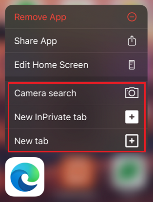
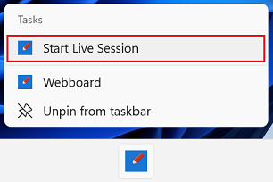
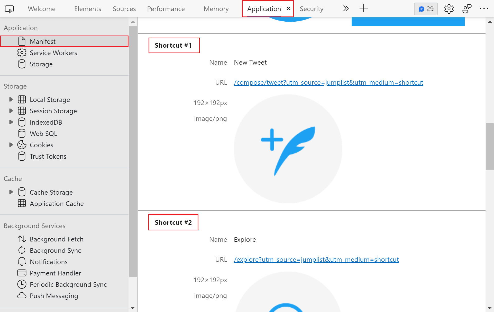

# Define app shortcuts

App shortcuts let users accomplish common tasks more quickly and easily and can increase their engagement with an app.

On mobile devices, shortcuts can usually be accessed by long-pressing an app icon.  On Windows, shortcuts are integrated as Jumplists.  Jumplists define popup menus that appear when you right-click a tile in the Start menu, or right-click an icon in the taskbar.

The next figure shows shortcuts on Microsoft Edge, on iOS:



The next figure shows a Jumplist on the Webboard app, on Windows:



Progressive Web Apps (PWAs) can also define common tasks as shortcuts in the [Web App Manifest](web-app-manifests.md).


<!-- ====================================================================== -->
## Define shortcuts

Defining shortcuts is done by using the `shortcuts` manifest member.  This member is an array that can contain multiple shortcuts.  Each shortcut is essentially a URL that gets requested when the shortcut is used and the app is launched.

```json
{
    "shortcuts" : [
        {
            "name": "Today's agenda",
            "url": "/today",
            "description": "List of events planned for today"
        },
        {
            "name": "New event",
            "url": "/create/event"
        },
        {
            "name": "New reminder",
            "url": "/create/reminder"
        }
    ]
}
```

The following properties can be used:

| Property | Details |
|---|---|
| `name` | A string that is displayed to the user on **Jumplists** or the context menu. |
| `short_name` | A string that is displayed when insufficient space exists to display the full name of the shortcut. |
| `description` | A string that describes the purpose of the shortcut.  The string can be accessed by assistive technology. |
| `url` | The URI in the web app that opens when the shortcut is activated. |
| `icons` | A set of icons that represents the shortcut. |

To learn more, see [shortcuts](https://developer.mozilla.org/docs/Web/Manifest/shortcuts) at MDN.


<!-- ====================================================================== -->
## Debug shortcuts

You can test that your shortcuts are configured correctly by using the **Application** panel of DevTools.

To test that your shortcuts are configured correctly:

1. In Microsoft Edge, go to your app.

1. To open DevTools, right-click the webpage, and then select **Inspect**.  Or, press **Ctrl+Shift+I** (Windows, Linux) or **Command+Option+I** (macOS).  DevTools opens.

1. In DevTools, on the main toolbar, select the **Application** tab.  If that tab isn't visible, click the **More tabs** () button, or else the **More Tools** () button.

1. In the **Application** tool, select **Manifest**.

1. Scroll down to reveal the list of shortcuts.

   > [!div class="mx-imgBorder"]
   > 

To learn more about using the Application panel to debug PWAs, see [Debug Progressive Web Apps (PWAs)](../../devtools-guide-chromium/progressive-web-apps/index.md).
