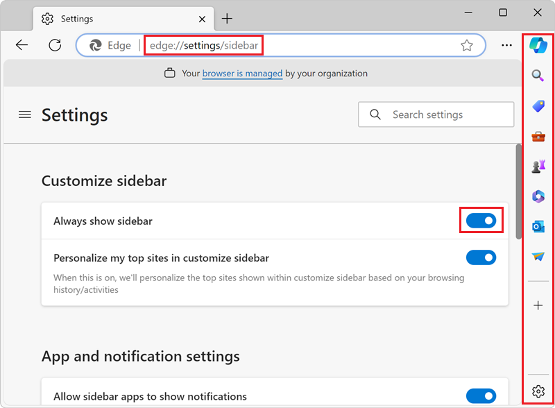
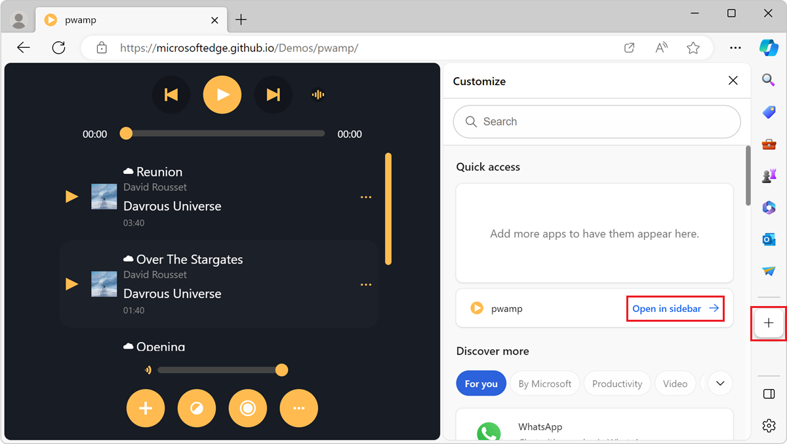

# Build PWAs for the sidebar in Microsoft Edge


Progressive Web Apps (PWAs) can opt-in to be pinned to the sidebar in Microsoft Edge.

The sidebar in Microsoft Edge allows users to easily access popular websites and utilities alongside their browser tabs. The content in the sidebar augments the user's primary task by enabling side-by-side browsing and minimizing the need to switch contexts between browser tabs.

By signaling intent to be pinned to the sidebar, your PWA gets the following benefits:

* Your PWA can be promoted in the Microsoft Edge sidebar store.
* Your PWA can detect whether it is running in the Microsoft Edge sidebar or not.
* Your PWA defines its own style and layout to provide a user-friendly sidebar experience.


<!-- ====================================================================== -->
## Enable sidebar support of PWAs in Microsoft Edge

Experimental support for PWAs that can target the sidebar in Microsoft Edge starts with Microsoft Edge 112. Some parts of the feature are available starting with Microsoft Edge 114, such as the ability to detect if your PWA is running in the sidebar by using User Agent Client Hints.

To locally enable PWA sidebar support in Microsoft Edge:

1. Download and install the Canary channel of Microsoft Edge from the [Microsoft Edge Insider website](https://www.microsoftedgeinsider.com/download).

1. Start Microsoft Edge with sidebar support for PWAs, as follows:

    * On Windows:
        
        1. Find the path where Microsoft Edge Canary is installed on your device. For example: `C:\Users\your_name\AppData\Local\Microsoft\Edge SxS\Application\msedge.exe`.
        1. Enter **cmd** in the Windows search text box, and then select the **Command Prompt** app.
        1. Enter the following command: `"C:\Users\your_name\AppData\Local\Microsoft\Edge SxS\Application\msedge.exe" --enable-features=msWebAppManifestSidePanel,msAddEdgeSidePaneBrandUA`

    * On macOS:

        1. Find the path where Microsoft Edge Canary is installed on your device. For example: `/Applications/Microsoft Edge Canary.app`.
        1. Open the **Terminal** app.
        1. Enter the following command: `/Applications/Microsoft Edge Canary.app --enable-features=msWebAppManifestSidePanel,msAddEdgeSidePaneBrandUA`


<!-- ====================================================================== -->
## Enable sidebar support in your PWA

To make your PWA ready for pinning to the sidebar in Microsoft Edge, use the `edge_side_panel` manifest member:

1. Make sure your PWA has a web app manifest file that contains at least the `name`, `short_name`, `description`, and `icons` members.

    To learn more, see [Use a web app manifest to integrate a Progressive Web App into the operating system](./web-app-manifests.md).

1. Add the `edge_side_panel` member to your web app manifest. For example:

    ```json
    {
      "name": "PWAmp music player",
      "lang": "en-US",
      "start_url": "/",
      "short_name": "PWAmp",
      "description": "A skinnable music player app to play your favorite mp3 files",
      "display": "standalone",
      "icons": [
        {
          "src": "./favicon-256.png",
          "sizes": "256x256"
        }
      ],
      "edge_side_panel": {}
    }
    ```


<!-- ====================================================================== -->
## Adapt your app to the minimum sidebar width

The sidebar in Microsoft Edge has a default minimum width of 376 pixels and can be resized by users. Therefore, your app's layout should support the 376 pixels minimum width, and should be responsive.

While building your app, you can test whether the app's layout is usable when narrow, and make sure the design is responsive at different widths, by using the **Device Emulation** tool in Microsoft Edge DevTools. To learn more, see [Verify that the webpage layout is usable when narrow](../../devtools-guide-chromium/accessibility/narrow.md).

If your app's layout can't support the 376 pixels minimum width, you can define your preferred width by using the `preferred_width` property in your web app manifest. For example:

```json
{
  "name": "PWAmp music player",
  "lang": "en-US",
  "start_url": "/",
  "short_name": "PWAmp",
  "description": "A skinnable music player app to play your favorite mp3 files",
  "display": "standalone",
  "icons": [
    {
      "src": "./favicon-256.png",
      "sizes": "256x256"
    }
  ],
  "edge_side_panel": {
    "preferred_width": 480
  }
}
```

When you define a preferred width in your app's manifest, the following happens:

* When your app is opened in the sidebar, the sidebar is automatically resized to your preferred width.
* Users can resize the sidebar to make it larger than your preferred width, or smaller, up to the 376 pixels minimum width.


<!-- ====================================================================== -->
## Build a sidebar-only app

One of the most important benefits of building an app as a PWA is that, from one code base, your app adapts to all devices and operating systems, whatever their capabilities and screen sizes.

The `edge_side_panel` manifest member makes your app installable as a standalone app and enables your app to be pinned to the sidebar in Microsoft Edge.

However, if you prefer to build an app that can only be pinned to the sidebar but cannot be installed as a standalone app, omit the `display` member from your web app manifest, or set its value to `browser`:

```json
{
  "name": "PWAmp music player",
  "lang": "en-US",
  "start_url": "/",
  "short_name": "PWAmp",
  "description": "A skinnable music player app to play your favorite mp3 files",
  "display": "browser",
  "icons": [
    {
      "src": "./favicon-256.png",
      "sizes": "256x256"
    }
  ],
  "edge_side_panel": {
    "preferred_width": 480
  }
}
```


<!-- ====================================================================== -->
## Detect usage in the sidebar

Detecting when your app is running in the sidebar can be useful to provide your users with the best possible experience when your app runs in this browser panel.

Starting with Microsoft Edge 114, you can detect when your app runs in the sidebar by using User-Agent Client Hints. To learn more about User-Agent Client Hints, see [Detecting Microsoft Edge from your website](../../web-platform/user-agent-guidance.md).

To detect when your app runs in the sidebar, do one of the following:

* On your web server, read the `Sec-CH-UA` HTTPS request header and look for the `Edge Side Panel` brand. For example:
    
    ```https
    Sec-CH-UA: "Microsoft Edge";v="112", "Edge Side Panel";v="1", "Placeholder;Browser Brand";v="99"
    ```

* In the browser, use the `navigator.userAgentData` JavaScript API and read the value of the `brands` property. For example:

    ```javascript
    const brands = navigator.userAgentData.brands;
    const sidebarBrandInfo = brands.find(b => b.brand === "Edge Side Panel");
    if (sidebarBrandInfo) {
      console.log(sidebarBrandInfo); // { brand: "Edge Side Panel", version: "1" }
    } else {
      console.log("App is not running in the Microsoft Edge sidebar");
    }
    ```

To detect whether your app is running in the sidebar, you can also use the User Agent string.

**Note**: we strongly recommend using User Agent Client Hints instead of the User Agent string. The User Agent string is an outdated mechanism for doing browser detection, and has website compatibility issues.

If you can't use User Agent Client Hints in your app, look for `Edge Side Panel` in the User Agent string. Here are some examples of User Agent strings containing the `Edge Side Panel` value:

```https
User-Agent: ... (Edge Side Panel)...
User-Agent: ... (..., Edge Side Panel)...
User-Agent: ... (Edge Side Panel, ...)...
```

#### Relationship with your mobile app

Suppose you create a desktop variant of your app and a mobile variant of your app. In this scenario, the desktop variant is used when your app is pinned to the sidebar. By default, apps in the sidebar that use the `edge_side_panel` manifest member receive the Microsoft Edge desktop User Agent Client Hint:

```https
Sec-CH-UA-Mobile: ?0
```

As explained in [Adapt your app to the minimum sidebar width](#adapt-your-app-to-the-minimum-sidebar-width), we recommend making your app's layout responsive so that it can adapt to multiple form factors using a single code base.

You can, however, use the `Edge Side Panel` User Agent Client Hint brand to reuse your app's mobile variant in the Microsoft Edge sidebar.

Follow these recommendations when using a mobile-variant of your app in the sidebar:

* Remove all "Open in App" messages instructing users to download your app from an app store.
* Test the accessibility and usability of your app with all input methods: mouse, keyboard, and touch. To learn about testing the accessibility of your app, see [Overview of accessibility testing using DevTools](../../devtools-guide-chromium/accessibility/accessibility-testing-in-devtools.md).


<!-- ====================================================================== -->
## Demo app

PWAmp is a music player PWA demo application that can be pinned to the sidebar in Microsoft Edge. To test PWAmp as a sidebar app:

1. Enable sidebar support as described in [Enable sidebar support of PWAs in Microsoft Edge](#enable-sidebar-support-of-pwas-in-microsoft-edge).

1. Open Microsoft Edge and make sure the sidebar is displayed. If the sidebar is not displayed, go to `edge://settings/sidebar` and then turn on the **Always show sidebar** toggle:

    

1. Go to [PWAmp](https://microsoftedge.github.io/Demos/pwamp/).

1. In the sidebar, click **Customize sidebar**, and then click **Add current page**:

    

1. The PWAmp music player app now appears in the sidebar. Click the PWAmp icon in the sidebar to open the app and use it alongside your other tabs:

    

The parts of the PWAmp demo app source code that are relevant to the Microsoft Edge sidebar support are:

* The `edge_side_panel` member in the [manifest.json](https://github.com/MicrosoftEdge/Demos/blob/main/pwamp/manifest.json) file.
* The `isSidebarPWA` variable, which uses the `navigator.userAgentData` JavaScript API in the [app.js](https://github.com/MicrosoftEdge/Demos/blob/main/pwamp/app.js#L14) file.

You can find the entire PWAmp demo source code at [MicrosoftEdge / Demos > pwamp](https://github.com/MicrosoftEdge/Demos/tree/main/pwamp). To download the source code locally, see [Download or clone the Demos repo](../../devtools-guide-chromium/sample-code/sample-code.md#download-or-clone-the-demos-repo) in _Sample code for DevTools_.


<!-- ====================================================================== -->
## Provide feedback

The Microsoft Edge team welcomes your feedback about this feature. Read the [Side Panel explainer](https://github.com/MicrosoftEdge/MSEdgeExplainers/blob/main/SidePanel/explainer.md) on the Microsoft Edge web platform explainer repo, and leave feedback by [creating a new issue](https://github.com/MicrosoftEdge/MSEdgeExplainers/issues/new/) on the repo or [searching for existing issues](https://github.com/MicrosoftEdge/MSEdgeExplainers/issues) and joining existing conversations.
