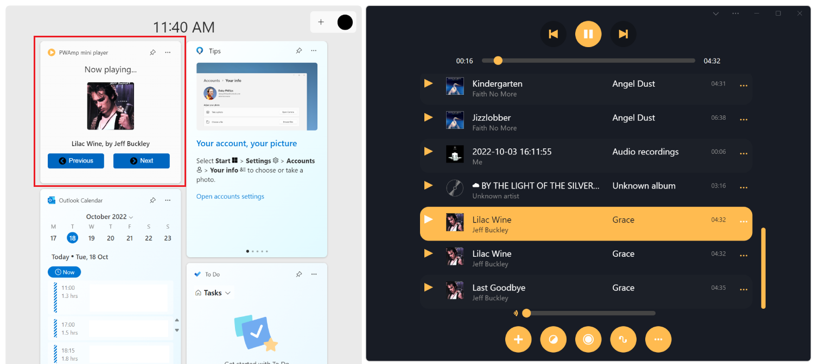

# Build PWA-driven Widgets
<!-- TODO: HAVEN'T FOUND A WAY TO REPRO. BUT AFTER RESTART, AND ADDING WIDGET, APP IS LAUNCHED AT LEAST 2 TIMES EVERYTIME I CLICK THE WIDGET, AND APP CRASHES WITH RESULT_CODE_KILLED_BAD_MESSAGE. -->
<!-- APP SEEMS TO CRASH WHEN: OPEN APP, ADD WIDGET, FINE, CLOSE APP, WIDGET IS STILL HERE, CLICK ON ACTION, APP OPENS UP, CLICK AGAIN ON ACTION, OTHER APP OPENS UP AGAIN, APP CRASHES. -->
<!-- SOMETIMES WIDGET DASHBOARD CRASHES TOO, AND RESTARTS. AND THEN MY WIDGET DOESN'T EVER GET REGISTERED. -->

Various operating systems have Widget dashboards that let users read content and perform tasks. Examples of this include Android Home Screen Widgets, macOS Dashboard and Today Panel Widgets, the Apple Touch Bar, Samsung Daily Cards, Mini App Widgets, and smart watch app companions.

On Windows 11, Widgets can be displayed from the Taskbar.

 

Progressive Web Apps (PWAs) can also define Widgets on Windows 11, update them, and handle user interactions within them.


**Note:** Support for the `widgets` manifest member and associated JavaScript APIs, documented below, is experimental and depends on Microsoft Windows functionality that's not widely available yet.


<!-- ====================================================================== -->
## Enable Widgets in Microsoft Edge

Widgets are experimentally supported for local testing starting with Microsoft Edge 108.

To test your Widgets PWA code locally, start Microsoft Edge from the command line with the `msWebAppWidgets` feature enabled:

```cmd
"C:\path\to\msedge.exe" --enable-features=msWebAppWidgets
```

In the above command, replace `C:\path\to\msedge.exe` with the correct path to the Microsoft Edge executable on your computer. Since Widgets are an experimental feature at the moment, we recommend using Microsoft Edge Canary which might be installed under the following location: `C:\Users\<your user name>\AppData\Local\Microsoft\Edge SxS\Application\msedge.exe`.

Widgets are also available as an origin trial in Microsoft Edge 108. Learn [how to enroll your site in an origin trial](origin-trials.md#enroll-your-site-in-an-origin-trial).
<!-- TODO: ARE WE STILL TARGETING 108 FOR THE ORIGIN TRIAL. -->


<!-- ====================================================================== -->
## Define Widgets

Widgets are defined in your PWA manifest file, by using the `widgets` manifest member. This manifest member is an array that can contain multiple Widget definitions.

```json
{
  "name": "app",
  "description": "An app that defines Widgets",
  "icons": [
    { "src": "img/icon-96.png", "sizes": "96x96" },
    { "src": "img/icon-128.png", "sizes": "128x128" },
    { "src": "img/icon-256.png", "sizes": "256x256" },
    { "src": "img/icon-512.png", "sizes": "512x512" }
  ],
  "widgets": [
    /* Widget definitions go here */
  ]
}
```

Each entry in the `widgets` array contains several fields, as shown below:

```json
{
  "name": "app",
  "description": "An app that defines Widgets",
  "icons": [
    { "src": "img/icon-96.png", "sizes": "96x96" },
    { "src": "img/icon-128.png", "sizes": "128x128" },
    { "src": "img/icon-256.png", "sizes": "256x256" },
    { "src": "img/icon-512.png", "sizes": "512x512" }
  ],
  "widgets": [
    {
      "name": "PWAmp mini player",
      "description": "Widget to control the PWAmp music player",
      "tag": "pwamp",
      "template": "pwamp-template",
      "ms_ac_template": "widgets/mini-player.json",
      "data": "widgets/mini-player-data.json",
      "type": "application/json",
      "screenshots": [
        {
          "src": "./screenshot-widget.png",
          "sizes": "600x400",
          "label": "The PWAmp mini-player widget"
        }
      ],
      "icons": [
        {
          "src": "./favicon-48.png",
          "sizes": "48x48"
        }
      ],
      "backgrounds": [
        {
          "src": "./widgets/background.png",
          "sizes": "600x400"
        }
      ],
      "auth": false,
      "update": 100
    }
  ]
}
```

In the above example, an music player Widget is defined by the PWA. Possible fields are documented below.

| Field | Description | Required |
|:--- |:--- |:--- |
| `name` | The title of the Widget, presented to users. | Yes |
| `short_name` | An alternative short version of the name. | No |
| `description` | A description of what the Widget does. | No |
| `tag` | A string used to reference the widget in the PWA Service Worker. | Yes |
| `template` | The template to use to display the Widget in the operating system Widget dashboard. Note: although `template` is a required field, its value is currently not used. See `ms_ac_template` below. | Yes |
| `ms_ac_template` | The URL to the custom Adaptive Cards template to use to display the Widget in the operating system Widget dashboard. See [Define a Widget template](#define-a-widget-template) below. | Yes |
| `data` | The URL where the data to fill the template with can be found. For now, this URL is required to return valid JSON. | Yes |
| `type` | The MIME type for the Widget data. Note that it is, for now, required to be `application/json`. | Yes |
| `auth` | A boolean indicating if the Widget requires authentication. | No |
| `update` | The frequency, in seconds, you want the Widget to be updated. Note that to actually update the Widget, [Periodic Background Sync](./background-syncs.md#use-the-periodic-background-sync-api-to-regularly-get-fresh-content) is used. | No |
| `icons` | An array of icons to be used for the Widget. If not present, the manifest `icons` member will be used. | No |
| `screenshots` | An array of screenshots that show what the widget looks like. Analogous to the [`screenshot` manifest member](https://developer.mozilla.org/docs/Web/Manifest/screenshots). | No |
| `backgrounds` | An array of alternative background images that can be used by the Widget host. | No |
<!-- TODO: IT SEEMS THAT SCREENSHOTS AND BACKGROUNDS ARE NEEDED, OTHERWISE THE WIDGET DOES NOT APPEAR ON WINDOWS. EVEN IF THEY AREN'T USED. -->
<!-- TODO: DO WE HAVE RECOMMENDATIONS FOR ICON SIZES? -->


<!-- ====================================================================== -->
## Define a Widget template

To make Widgets easy to create and adapt to various operating system Widget dashboards, they are displayed using templates. Two types of templates exist:

* Generic templates, defined by their names using the `template` field.
* Custom templates, defined by their URLs using a custom template field.

For the time being, only custom Adaptive Cards templates are supported. Adaptive Cards is an open card exchange format that can be used to exchange UI content in a common and consistent way. See [Adaptive Cards Overview](/adaptive-cards/).

To define a custom Adaptive Cards template, use the `ms_ac_template` field. Note that even if `template` is not used at the moment, it is a required field.

```json
{
  ...
  "template": "pwamp-template",
  "ms_ac_template": "widgets/mini-player.json",
  ...
}
```

The `ms_ac_template` field value should be a valid URL to a template file.

Here is an example of an Adaptive Cards template:

```json
{
  "type": "AdaptiveCard",
  "body": [
    {
      "type": "TextBlock",
      "size": "Medium",
      "text": "Now playing...",
      "horizontalAlignment": "Center"
    },
    {
      "type": "TextBlock",
      "spacing": "Large",
      "weight": "Bolder",
      "horizontalAlignment": "Center",
      "text": "${song}, by ${artist}",
    }
  ],
  "$schema": "http://adaptivecards.io/schemas/adaptive-card.json",
  "version": "1.5"
}
```

To learn more, see [Adaptive Cards Templating](/adaptive-cards/templating/).
<!-- TODO: THIS TEMPLATE DOES NOT SEEM TO BE USED AT ALL AT THE MOMENT. THE WIDGET ONLY APPEARS ONCE THE SW UPDATES IT. -->


<!-- ====================================================================== -->
## Bind data to your template

The template declares the user interface of a Widget.  Data then populates this user interface.

To bind data to your template, use the `data` field in your Widget definition. This field should be set to a URL that returns valid JSON data.

The template defined in [the previous section](#define-a-widget-template) contains two variables: `song` and `artist`, which are enclosed in the binding expression syntax: `${}`. The data that's returned by the `data` URL in your Widget definition should contain values for these variables.

Here is an example of what the `data` URL might return: 

```json
{
  "song": "I Will Always Love You",
  "artist": "Whitney Houston"
}
```
<!-- TODO: THE DATA FIELD DOES NOT SEEM TO BE USED AT THE MOMENT. THE WIDGET ONLY APPEARS ONCE THE SW UPDATES IT. -->


<!-- ====================================================================== -->
## Define Widget actions

If you want your Widget to let users perform tasks, define a template that supports actions.

Here is an example of an action defined in a custom Adaptive Cards template:

```json
{
  "type": "AdaptiveCard",
  "body": [
    {
      "type": "TextBlock",
      "size": "Medium",
      "text": "Now playing...",
      "horizontalAlignment": "Center"
    },
    {
      "type": "TextBlock",
      "spacing": "Large",
      "weight": "Bolder",
      "horizontalAlignment": "Center",
      "text": "${song}, by ${artist}",
    }
  ],
  "actions": [
    {
      "type": "Action.Execute",
      "title": "Previous",
      "verb": "previous-song"
    },
    {
      "type": "Action.Execute",
      "title": "Next",
      "verb": "next-song"
    }
  ],
  "$schema": "http://adaptivecards.io/schemas/adaptive-card.json",
  "version": "1.5"
}
```

Note the `verb` field in the above JSON. It will be used when handling Widget actions in your service worker code.


<!-- ====================================================================== -->
## Handle Widget actions

Once a user executes an action defined in a Widget, an event is triggered in the PWA's service worker. To handle the user action, listen to the `widgetclick` event in your service worker code:

```javascript
self.addEventListener('widgetclick', (event) => {
  switch (event.action) {
    case 'previous-song':
      // Application logic to play the previous song...
      break;
    case 'next-song':
      // Application logic to play the next song...
      break;
  }
});
```

Note that the `action` property of the `WidgetEvent` object passed to the event listener above matches the string defined in the `action.verb` field of the Widget template.

See the [Service Worker API reference](#service-worker-api-reference) below for more information about the `widgetclick` event and what information you can access from it.


<!-- ======================================================================
Widget settings are not supported in SV2. There is a plan to support them post-SV2, so let's keep this draft doc for now.
## Define Widget settings

Several instances of the same Widget can be enabled at the same time and configured differently by using setting definitions via the `settings` field.

Here is an example of a setting definition:

```json
{
  "name": "Agenda",
  "description": "Your day, at a glance",
  "tag": "agenda",
  "data": "/widgets/data/agenda",
  "type": "application/json",
  "ms_ac_template": "/widgets/template/agenda_template.ac.json",
  "settings": [
    {
      "label": "Select a calendar",
      "description": "The widget will display the meetings for the selected calendar",
      "type": "select",
      "options": "/widgets/data/calendars",
      "name": "calendarName"
    }
  ]
}
```

It is up to the operating system to provide access, and render, the right setting screen for the Widget, based on the setting definition. 

In the setting definition above, the `label` and `description` fields are presented in the Widget setting screen for the user to know what the setting does.

The `type` field instructs the operating system how to render the particular setting. The following types are available:

* Text field types: `text`, `email`, `password`, `number`.
* Date and time types: `date`, `datetime`.
* Selection types: `boolean`, `radio`, `select`, `checkbox`. These types require the `options` field.
* Auto-complete: `autocomplete`. This type requires the `options` field.

Some of the types above require extra information to be rendered correctly. This information is provided by the `options` field. The `options` field can either be an array of values, or a URL that returns an array of values.

Finally, the `name` field is used in the service worker code to know which setting was changed.


<!-- ======================================================================
## Handle Widget setting changes

For simplicity reasons, just like Widget actions are sent to the service worker as a `widgetclick` events (see [Handle Widget actions](#handle-widget-actions)), setting changes are also sent to the service worker as `widgetclick` events.

The `event.action` string can be used in the event handler function to know if the event originated from a Widget action or from a setting change:

```javascript
self.addEventListener('widgetclick', event => {
  const action = event.action;

  switch (action) {
    case "create-meeting":
      // This is a Widget action event.
      break;
    case "widget-save":
      // A Widget setting was changed.
      break;
  }
});
```

As shown in the above code snippet, the `widget-save` event is triggered in the service worker when a particular Widget instance has settings and one of the settings was changed.

See the [Service Worker API reference](#service-worker-api-reference) below for more information about the `widgetclick` event and what information you can access from it.
-->


<!-- ====================================================================== -->
## Access Widget instances at runtime

Widget instances can be accessed at runtime from your service worker code. This can be useful for updating Widgets proactively, even when there are no user interaction events. For example, you may wish to update a Widget instance on a push notification, a periodic sync, or when the user interacts with your application.

For more information about push notifications, see [Add push notifications to your PWA](notifications-badges.md#add-push-notifications-to-your-pwa) and for more information about periodic syncs, see [Use the Periodic Background Sync API to regularly get fresh content](background-syncs.md#use-the-periodic-background-sync-api-to-regularly-get-fresh-content).

In the following service worker code snippet, a listener for `widgetclick` is used to react to various lifecycle events of the application widget.

When a Widget installation is detected, a periodic sync is registered and when a Widget removal is detected, the periodic sync is unregistered.

When periodic sync events occur, Widget instances are updated using the `widgets.updateByTag` method (see [Service Worker API reference](#service-worker-api-reference) for more information).

The code also reacts to updates from the Widget host (using the `widget-resume` action) and uses it to update all Widget instances.

Finally, the code listens to a custom Widget action called `refresh`. This action needs to be defined in the PWA manifest file as explained in [Define Widget actions](#define-widget-actions). When this action occurs, the code uses the `widgets.updateByInstanceId` method to update the specific Widget the action originated from (see [Service Worker API reference](#service-worker-api-reference) for more information).
<!-- TODO: move this sample to the Demos repo when possible, and link from here. -->

```javascript
const periodicSync = self.registration.periodicSync;

/**
 * Register a periodic sync for a widget.
 */
async function registerPeriodicSync(widget) {
  // If the widget is not set up to auto-update, don't register a periodic sync.
  if ("update" in widget.definition) {
    return;
  }

  // Register a periodic sync, if this wasn't done already.
  // The same tag is used for both the sync registration and the widget here to
  // ensure this.
  const tags = await registration.periodicSync.getTags();
  if (! tags.includes(widget.definition.tag)) {
    await periodicSync.register(widget.definition.tag, { minInterval: widget.definition.update });
  }
}

/**
 * Unregister the periodic sync for a given widget.
 */
async function unregisterPeriodicSync(widget) {
  // If this was the last widget instance, then unregister the periodic sync.
  if (widget.instances.length === 1 && "update" in widget.definition) {
    await periodicSync.unregister(widget.definition.tag);
  }
}

/**
 * Update a given widget's instances.
 */
async function updateWidget(widget) {
  // Fetch the updated widget data.
  const response = await fetch(widget.definition.data);
  const data = await response.json();
  
  // Create the payload object.
  const payload = { data };
  
  // Update the widget by tag.
  await widgets.updateByTag(widget.definition.tag, payload);
}

/**
 * Update a specific widget instance.
 */
async function updateInstance(instance_id, widget) {
  // Fetch the updated widget data.
  const response = await fetch(widget.definition.data);
  const data = await response.json();
  
  // Create the payload object.
  const payload = { data };

  // Update the widget instance.
  await widgets.updateByInstanceId(instance_id, payload);
}

/**
 * React to widget-install events.
 */
async function onWidgetInstall(instance_id, widget) {
  // On install, update the instance and register the periodic sync.
  await updateInstance(instance_id, widget);
  await registerPeriodicSync(widget);
}

/**
 * React to widget-uninstall events.
 */
async function onWidgetUninstall(instance_id, widget) {
  // On uninstall, unregister the periodic sync if needed.
  await unregisterPeriodicSync(widget);
}

/**
 * React to widget-resume events, which happen when a host
 * requests all of its widgets to update.
 */
async function onWidgetResume(host_id) {
  // Find all the widgets the host is requesting to update.
  const widgetList = await widgets.matchAll({ hostId: host_id });

  // Update them all.
  await Promise.all(widgetList.map(widget => {
    return updateWidget(widget);
  }));
}

// Listen to the widgetclick event, to be able to react
// to several lifecycle events of the widget.
self.addEventListener("widgetclick", function(event) {
  const action = event.action;
  const host_id = event.hostId;
  const widget = event.widget;
  const instance_id = event.instanceId;

  switch (action) {
    // If a widget is being installed.
    case "widget-install":
      event.waitUntil(onWidgetInstall(instance_id, widget));
      break;

    // If a widget is being uninstalled.
    case "widget-uninstall":
      event.waitUntil(onWidgetUninstall(instance_id, widget));
      break;

    // If a widget host is requesting all its widgets update.
    case "widget-resume":
      event.waitUntil(onWidgetResume(host_id));
      break;

    // Custom Actions.
    case 'previous-song':
      // Application logic to play the previous song...
      // Update the widget to show the right information.
      event.waitUntil(updateInstance(instance_id, widget));
      break;

    case 'next-song':
      // Application logic to play the next song...
      // Update the widget to show the right information.
      event.waitUntil(updateInstance(instance_id, widget));
      break;
  }
});

// Listen to periodicsync events to update all widget instances
// periodically.
self.addEventListener("periodicsync", event => {
  const tag = event.tag;
  const widget = widgets.getByTag(tag);

  if (widget && "update" in widget.definition) {
    event.waitUntil(updateWidget(widget));
  }
});
```


<!-- ====================================================================== -->
## Demo app

PWAmp is a PWA demo app that defines a Widget.

1. Follow the instructions in [enable Widgets in Microsoft Edge](#enable-widgets-in-microsoft-edge).
1. Go to [PWAmp](https://microsoftedge.github.io/Demos/pwamp/) and install the app on Windows 11.
1. Open the Windows 11 Widget dashboard by pressing `Ctrl+W`.
1. Click **Add widgets** to open the **Widgets settings** screen, scroll to the **PWAmp mini player** Widget and add it.
1. Close the **Widgets settings** screen. The **PWAmp mini player** is now displayed in the Widget dashboard.

The PWAmp Widget displays the current song and buttons to play the previous or next song.




<!-- ====================================================================== -->
<!-- Widgets are too early in the making for MDN. But there is enough complexity with the APIs that a reference doc is needed.
For now we are documenting all functions and objects in this section. When Widgets become standard, move this to MDN and remove the section. -->
## Service Worker API reference

The service worker global object (or [ServiceWorkerGlobalScope](https://developer.mozilla.org/docs/Web/API/ServiceWorkerGlobalScope)) contains a `widgets` attribute that exposes the following Promise-based methods:

| Method | Description | Parameters | Return value |
|:--- |:--- |:--- |:--- |
| `getByTag(tag)` | Get a Widget by tag | The Widget tag | A Promise that resolves to the [Widget object](#widget-object) that matches the tag, or `undefined`. |
| `getByInstanceId(id)` | Get a Widget by instance ID | The Widget instance ID | A Promise that resolves to the corresponding [Widget object](#widget-object), or undefined.
| `getByHostId(id)` | Get Widgets by host ID  | The host ID | An array of [Widget objects](#widget-object) found in that host.
| `matchAll(options)` | Get Widgets by matching options | A [WidgetOptions object](#widgetoptions-object) | A Promise that resolves to an array of [Widget objects](#widget-object) that match the `options` criteria. |
| `updateByInstanceId(id, payload)` | Update a Widget by instance ID  | The instance ID, and a [WidgetPayload object](#widgetpayload-object) | A Promise that resolves to `undefined` or `Error`.
| `updateByTag(tag, payload)` | Update a Widget by tag | The Widget tag, and a [WidgetPayload object](#widgetpayload-object) | A Promise that resolves to undefined or Error.

The service worker global object also defines the `widgetclick` event that's fired when the widget is interacted with. For more information, see the [WidgetEvent object](#widgetevent-object) definition below.

#### Widget object

Each Widget is represented as a `Widget` object, which contains the following properties:

* `installable`: A Boolean indicating wither the Widget is installable.
* `definition`: A [WidgetDefinition object](#widgetdefinition-object).
* `instances`: An array of [WidgetInstance objects](#widgetinstance-object) representing the current state of each instance of the Widget.

#### WidgetOptions object

When using `matchAll(options)` to get multiple Widgets, a `WidgetOptions` object is necessary to filter which Widgets to return. The `WidgetOptions` object contains the following properties, all of which are optional:

* `installable`: A Boolean that indicates if the Widget is considered installable.
* `installed`: A Boolean that indicates if the Widget has been installed in the Widget host.
* `tag`: The tag of the Widget.
* `instance`: The Widget instance.
* `host`: The Widget host ID.

#### WidgetPayload object

When creating or updating a Widget instance, the service worker must send the data that's necessary to populate the Widget. This data is called the _payload_.  The payload includes content-related data.  The `WidgetPayload` object contains the following properties:

* `data`: The data to use with the Widget template, as a `String`.  This data can be stringified JSON data.

#### WidgetInstance object

This object represents a given instance of a Widget in a Widget host and contains the following properties:

* `id`: The internal GUID string used to reference the instance.
* `host`: An internal pointer to the Widget host that has installed this instance.
* `updated`: A `Date` object that represents the last time when data was sent to the instance.
* `payload`: A [WidgetPayload object](#widgetpayload-object) that represents the last payload that was sent to this instance.

#### WidgetDefinition object

This object represents the original definition of the Widget, found in the PWA manifest file. The properties of this object match the properties that are listed in [Define Widgets](#define-widgets), above.

#### WidgetEvent object

This object is passed as an argument to service worker `widgetclick` event listeners when the Widget is interacted with.

The `WidgetEvent` object has the following properties:

| Property | Description | Type |
|:--- |:--- |:--- |
| `widget` | The Widget instance that triggered the event. | [WidgetInstance](#widgetinstance-object) |
| `action` | The action that triggered the event. One of `widget-install`, `widget-uninstall`, `widget-resume`, or a custom action defined in a `actions.verb` field of the Widget template. See [Define Widget actions](#define-widget-actions). | String |
| `hostId` | The Widget host ID. | String |
| `instanceId` | The Widget instance ID. | String |
