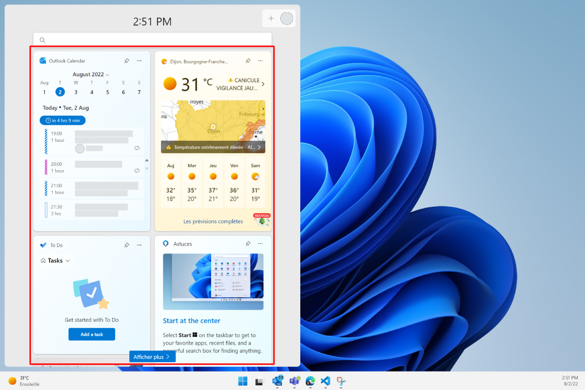

# Build PWA-driven Widgets

Native applications can expose information and let users perform tasks via Widgets in various operating systems' Widget dashboards. Examples of this include Android Home Screen Widgets, macOS Dashboard and Today Panel Widgets, the Apple Touch Bar, Samsung Daily Cards, Mini App Widgets, and smart watch app companions.

On Windows 11, Widgets can be displayed from the Taskbar.

 

Progressive Web Apps (PWAs) can also declare Widgets, update them, and handle user interactions within them.

> [!NOTE]
> Support for the `widgets` manifest member and associated JavaScript APIs, documented below, is experimental and depends on Microsoft Windows functionality that's not widely available yet.


<!-- ====================================================================== -->
## Enable Widgets in Microsoft Edge

Widgets are experimentally supported starting with Microsoft Edge 105.

To test your Widgets PWA code locally, start Microsoft Edge from the command line with the `msWebAppWidgets` feature enabled:

```cmd
"C:\Program Files (x86)\Microsoft\Edge\Application\msedge.exe" --enable-features=msWebAppWidgets
```

Widgets are also available as an origin trial in Microsoft Edge 105. Learn [how to enroll your site in an origin trial](origin-trials.md#enroll-your-site-in-an-origin-trial).


<!-- ====================================================================== -->
## Define Widgets

Widgets can be defined in your PWA manifest file, by using the `widgets` manifest member. This manifest member is an array which can contain multiple widget definitions.

```json
{
  "name": "app",
  "description": "An app that defines widgets",
  "icons": [
    { "src": "img/icon-96.png", "sizes": "96x96" },
    { "src": "img/icon-128.png", "sizes": "128x128" },
    { "src": "img/icon-256.png", "sizes": "256x256" },
    { "src": "img/icon-512.png", "sizes": "512x512" }
  ],
  "widgets": [
    /* Widget definitions go here */
  ]
}
```

Each entry in the `widgets` array contains several fields, as shown below:

```json
{
  "name": "app",
  "description": "An app that defines widgets",
  "icons": [
    { "src": "img/icon-96.png", "sizes": "96x96" },
    { "src": "img/icon-128.png", "sizes": "128x128" },
    { "src": "img/icon-256.png", "sizes": "256x256" },
    { "src": "img/icon-512.png", "sizes": "512x512" }
  ],
  "widgets": [
    {
      "name": "Agenda",
      "description": "Your day, at a glance",
      "tag": "agenda",
      "template": "agenda",
      "data": "/widgets/data/agenda",
      "type": "application/json",
      "auth": true,
      "update": 900
    }
  ]
}
```

In the above example, an agenda Widget is defined by the PWA. Possible fields are documented below.

| Field | Description | Required |
|:--- |:--- |:--- |
| `name` | The title of the Widget, presented to users. | Yes |
| `tag` | A string used to reference the widget in the PWA Service Worker. | Yes |
| `template` | The template to use to display the Widget in the operating system. To be installable, a Widget should either declare the name of the template to use with the `template` field, or specify the URL for a custom template by using a custom template field (such as `ms_ac_template`). See [Choose or define a Widget template](#choose-or-define-a-widget-template), below. | Yes |
| `data` | The URL where the data to fill the template with can be found. For now, this URL is required to return valid JSON. | Yes |
| `type` | The MIME type for the Widget data. Note that it is, for now, required to be `application/json`. | Yes |
| `auth` | A boolean indicating if the Widget requires authentication. | No |
| `update` | The frequency, in seconds, you want the widget to be updated. Note that to actually update the Widget, [Periodic Background Sync](./background-syncs.md#use-the-periodic-background-sync-api-to-regularly-get-fresh-content) is used. | No |
| `actions` | An array of actions exposed to users within the Widget (only if the template supports actions). | No |
| `settings` | An array of settings that can be used to configure different instances of the same Widget differently. | No |
| `short_name` | An alternative short version of the name. | No |
| `description` | A description of what the Widget does. | No |
| `icons` | An array of icons to be used for the Widget. If not present, the manifest `icons` member will be used. | No |
| `backgrounds` | An array of background images that can be used in the template (if the template supports it). | No |


<!-- ====================================================================== -->
## Choose or define a Widget template

**OPEN QUESTIONS: Are generic templates supported at all? Should they be documented?**

To make Widgets easy to create and adapt to various operating systems, they are displayed by using templates. Two types of templates exist:

* Generic templates, defined by their names using the `template` field.
* Custom templates, defined by their URLs using a custom template field.

For the time being, only custom Adaptive Cards templates are supported. Adaptive Cards are an open card exchange format that can be used to exchange UI content in a common and consistent way. See [Adaptive Cards Overview](/adaptive-cards/).

To define a custom Adaptive Cards template, use the `ms_ac_template` field:

```json
{
  "name": "Agenda",
  "description": "Your day, at a glance",
  "tag": "agenda",
  "data": "/widgets/data/agenda",
  "type": "application/json",
  "ms_ac_template": "/widgets/template/agenda_template.ac.json"
}
```

The `ms_ac_template` field value should be a valid URL to a template file.

Here is an example of an Adaptive Cards template:

```json
{
  "type": "AdaptiveCard",
  "body": [
    {
      "type": "TextBlock",
      "size": "Medium",
      "text": "Hello ${name}"
    },
    {
      "type": "TextBlock",
      "text": "You have ${meetingNb} meetings today"
    }
  ],
  "$schema": "http://adaptivecards.io/schemas/adaptive-card.json",
  "version": "1.5"
}
```

To learn more, see [Adaptive Cards Templating](/adaptive-cards/templating/).


<!-- ====================================================================== -->
## Bind data to your template

The template declares the user interface of a Widget.  Data then populates this user interface.

To bind data to your template, use the `data` field in your Widget definition. This field should be set to a URL that returns valid JSON data.

The template defined in [the previous section](#choose-or-define-a-widget-template) contains 2 variables: `name` and `meetingNb`, enclosed binding expression syntax: `${}`. So the data returned by the `data` URL in your Widget definition should contain values for these variables.

Here is an example of what the `data` URL might return: 

```json
{
  "name": "Amelie Garner",
  "meetingNb": 3
}
```


<!-- ====================================================================== -->
## Define Widget actions

**OPEN QUESTIONS: Are actions supported yet? How do actions from the manifest work with actions from the ac template? Maybe using the data.tag field in the ac action?**

If you want your Widget to let users perform tasks, use the `actions` field in your Widget definition, and define a template that supports actions.

The `actions` field is an array of action definitions. Here is an example:

```json
{
  "name": "Agenda",
  "description": "Your day, at a glance",
  "tag": "agenda",
  "data": "/widgets/data/agenda",
  "type": "application/json",
  "ms_ac_template": "/widgets/template/agenda_template.ac.json",
  "actions": [
    {
      "action": "create-meeting",
      "title": "Create a new meeting"
    }
  ]
}
```

Use the `action` field to give the action a name. This name will be used to handle the action in your service worker. The `title` field is presented to the user.

To actually trigger the action from the Widget, your template needs to support it. Here is an example of an action defined in a custom Adaptive Cards template:

```json
{
  "type": "AdaptiveCard",
  "body": [
    {
      "type": "TextBlock",
      "size": "Medium",
      "text": "Hello ${name}"
    },
    {
      "type": "TextBlock",
      "text": "You have ${meetingNb} meetings today"
    }
  ],
  "actions": [
    {
      "type": "Action.Execute",
      "title": "Create a new meeting",
      "data": {
        "tag": "create-meeting"
      }
    }
  ],
  "$schema": "http://adaptivecards.io/schemas/adaptive-card.json",
  "version": "1.5"
}
```

<!-- ====================================================================== -->
## Handle Widget actions

Once a user executes an action defined in a Widget, an event is triggered in the PWA's service worker. To handle the user action, listen to the `widgetclick` event in your service worker code:

```javascript
self.addEventListener('widgetclick', event => {
  const action = event.action;

  if (action === "create-meeting") {
    // Application logic code to create a meeting.
  }
});
```

See the [Service Worker API reference](#service-worker-api-reference) below for more information about the `widgetclick` event and what information you can access from it.


<!-- ====================================================================== -->
## Define Widget settings

**OPEN QUESTIONS: Are settings supported yet? If so, are all types implemented?**

Several instances of the same Widget can be enabled at the same time and configured differently by using setting definitions via the `settings` field.

Here is an example of a setting definition:

```json
{
  "name": "Agenda",
  "description": "Your day, at a glance",
  "tag": "agenda",
  "data": "/widgets/data/agenda",
  "type": "application/json",
  "ms_ac_template": "/widgets/template/agenda_template.ac.json",
  "settings": [
    {
      "label": "Select a calendar",
      "description": "The widget will display the meetings for the selected calendar",
      "type": "select",
      "options": "/widgets/data/calendars",
      "name": "calendarName"
    }
  ]
}
```

It is up to the operating system to provide access, and render, the right setting screen for the Widget, based on the setting definition. 

In the setting definition above, the `label` and `description` fields are presented in the widget setting screen for the user to know what the setting does.

The `type` field instructs the operating system how to render the particular setting. The following types are available:

* Text field types: `text`, `email`, `password`, `number`.
* Date and time types: `date`, `datetime`.
* Selection types: `boolean`, `radio`, `select`, `checkbox`. These types require the `options` field.
* Auto-complete: `autocomplete`. This type requires the `options` field.

Some of the types above require extra information to be rendered correctly. This information is provided by the `options` field. The `options` field can either be an array of values, or a URL that returns an array of values.

Finally, the `name` field is used in the service worker code to know which setting was change.


<!-- ====================================================================== -->
## Handle Widget setting changes

For simplicity reasons, just like Widget actions are sent to the service worker as a `widgetclick` events (see [Handle Widget actions](#handle-widget-actions)), setting changes are also sent to the service worker as `widgetclick` events.

The `event.action` string can be used in the event handler function to know if the event originated from a Widget action or from a setting change:

```javascript
self.addEventListener('widgetclick', event => {
  const action = event.action;

  switch (action) {
    case "create-meeting":
      // This is a Widget action event.
      break;
    case "widget-save":
      // A Widget setting was changed.
      break;
  }
});
```

As shown in the above code snippet, the `widget-save` event is triggered in the service worker when a particular Widget instance has settings and one of the settings was changed.

See the [Service Worker API reference](#service-worker-api-reference) below for more information about the `widgetclick` event and what information you can access from it.


<!-- ====================================================================== -->
## Access Widget instances at runtime

Widget instances can be accessed at runtime from your service worker code, which can be useful to update Widgets periodically for instance.

**TODO: Intro/tutorial.**


<!-- ====================================================================== -->
## Service Worker API reference

**TODO: Widgets are too early in the making for MDN. But there is enough complexity with the APIs that a reference doc is needed. The plan is to document all functions and objects right here in this section. Ultimately this would move to MDN and we'll remove this section.**

The service worker global object (or [ServiceWorkerGlobalScope](https://developer.mozilla.org/docs/Web/API/ServiceWorkerGlobalScope)) contains a `widgets` attribute that exposes the following Promise-based methods:

| Method | Description | Parameters | Return value |
|:--- |:--- |:--- |:--- |
| `getByTag(tag)` | Get a Widget by tag | The Widget tag | A Promise that resolves to the [Widget object](#widget-object) that matches the tag, or `undefined`. |
| `getByInstanceId(id)` | Get a Widget by instance id | The Widget instance id | A Promise that resolves to the corresponding [Widget object](#widget-object), or undefined.
| `getByHostId(id)` | Get Widgets by host id  | The host id | An array of [Widget objects](#widget-object) found in that host.
| `matchAll(options)` | Get Widgets by matching options | A [WidgetOptions object](#widgetoptions-object) | A Promise that resolves to an array of [Widget objects](#widget-object) that match the `options` criteria. |
| `updateByInstanceId(id, payload)` | Update a Widget by instance id  | The instance id, and a [WidgetPayload object](#widgetpayload-object) | A Promise that resolves to undefined or Error.
| `updateByTag(tag, payload)` | Update a Widget by tag | The Widget tag, and a [WidgetPayload object](#widgetpayload-object) | A Promise that resolves to undefined or Error.
| `removeByInstanceId(id)` | Remove a Widget by instance id | The instance id | A Promise that resolves to undefined or Error.
| `removeByTag()` | Remove a Widget by tag | The Widget tag | A Promise that resolves to undefined or Error.

### Widget object

Each Widget is represented as a `Widget` object, which contains the following properties:

* `installable`: A Boolean indicating wither the Widget is installable.
* `definition`: A [WidgetDefinition object](#widgetdefinition-object).
* `instances`: An array of [WidgetInstance objects](#widgetinstance-object) representing the current state of each instance of the Widget.

### WidgetOptions object

When using `matchAll(options)` to get multiple Widgets, a `WidgetOptions` object is necessary to filter which Widgets to return. The `WidgetOptions` object contains the following properties, all of which are optional:

* `installable`: A Boolean that indicates if the Widget is considered installable.
* `installed`: A Boolean that indicates if the Widget has been installed in the Widget host.
* `tag`: The Widget tag.
* `instance`: The Widget instance.
* `host`: The Widget host id.

### WidgetPayload object

When creating or updating a Widget instance, the service worker must send the data necessary to populate the Widget. This data is called the payload, it includes template- and content-related data and contains the following properties:

* `template`: The name of the template to use.
* `data`: The data, as a String, to use with the Widget template (note that this can be stringified JSON data).
* `settings`: The settings to use for the Widget instance, if any.

### WidgetInstance object

This object represents a given instance of a Widget in a Widget host and contains the following properties:

* `id`: The internal GUID string used to reference the instance.
* `host`: An internal pointer to the Widget Host that has installed this instance.
* `settings`: If the Widget has settings, the key/values pairs set for this instance.
* `updated`: A Date object that represents the last time data was sent to the instance.
* `payload`: A [WidgetPayload object](#widgetpayload-object) that represents the last payload that was sent to this instance.

### WidgetDefinition object

This object represents the original definition of the Widget, found in the PWA manifest file. The properties of this object match the ones documented in [Define Widgets](#define-widgets).
