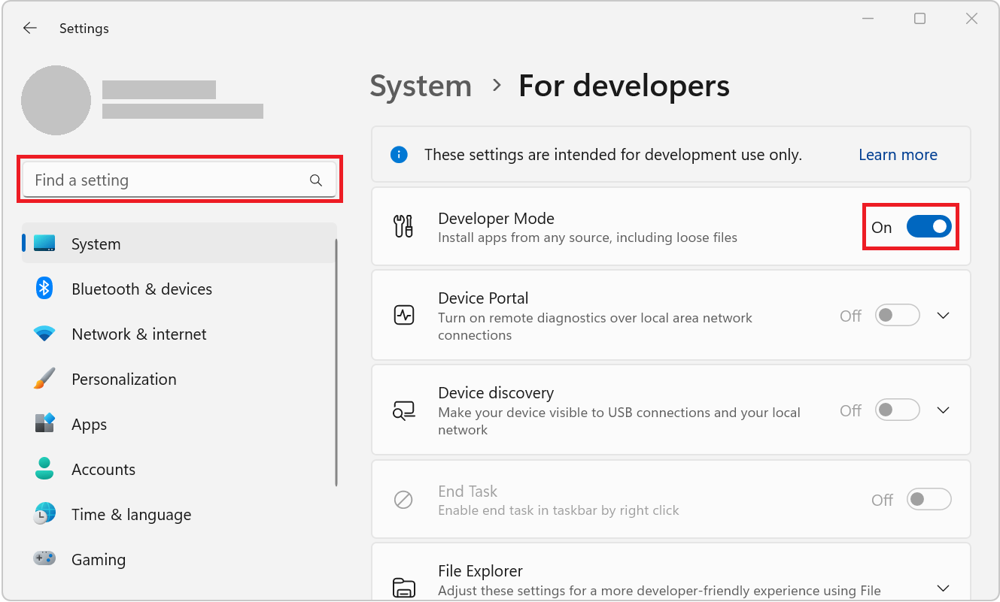

# Build PWA-driven widgets

Various operating systems have widgets dashboards that let users read content and perform tasks. Examples of this include Android Home Screen widgets, macOS Dashboard and Today Panel widgets, the Apple Touch Bar, Samsung Daily Cards, Mini App widgets, and smart watch app companions.

On Windows 11, widgets appear in the Widgets Board, which you open from the left side of the taskbar:


In Windows 11, Progressive Web Apps (PWAs) can define widgets, update them, and handle user interactions within them.


<!-- ------------------------------ -->
#### Requires building a custom widget for the PWA

An existing PWA cannot simply be placed into the widget dashboard as-is, like you can with the Microsoft Edge Sidebar.  Instead, you need to build a custom widget experience that's appropriate for the widget host, which currently is the Windows 11 Widgets Board.  (There may be other widget hosts in the future.)  The Windows 11 Widgets Board requires widgets to be built by using Adaptive Card templates instead of HTML and JavaScript, so the widget has to be designed separately from the rest of the app's UI.

See also:
* [Build PWAs for the sidebar in Microsoft Edge](./sidebar.md)

To build a PWA-driven widget and deliver it via the Microsoft store, no C++/C# code is required.  Once you've produced the widget, and can successfully install and run the widget from a public endpoint, you can package the app by using [PWABuilder.com](https://www.pwabuilder.com) and ship the app to the Microsoft store without requiring any additional code.  The PWA backing the widget must be installable from a public endpoint, because PWABuilder.com doesn't support packing apps from localhost.
<!-- The PWA (not the widget) is what is installable and packaged, because it's a standalone entity (unlike a widget). -->

See also:
* [Publish a Progressive Web App to the Microsoft Store](./microsoft-store.md)


<!-- ====================================================================== -->
## Install WinAppSDK and enable Developer Mode

To enable developing and testing widgets on your local machine:

* Install [WinAppSDK 1.2](/windows/apps/windows-app-sdk/older-downloads#windows-app-sdk-12).
* Enable Developer Mode in Windows 11:

  1. Open **Settings**.
  1. In the **Find a setting** textbox, enter `developer`, and then click **Use developer features**.
  1. Enable **Developer Mode**:

     


<!-- ====================================================================== -->
## Define widgets

Widgets are defined in your PWA manifest file, by using the `widgets` manifest member. This manifest member is an array that can contain multiple widget definitions.

```json
{
  "name": "PWAmp",
  "description": "A music player app",
  "icons": [
    { "src": "img/icon-96.png", "sizes": "96x96" },
    { "src": "img/icon-128.png", "sizes": "128x128" },
    { "src": "img/icon-256.png", "sizes": "256x256" },
    { "src": "img/icon-512.png", "sizes": "512x512" }
  ],
  "widgets": [
    /* widget definitions go here */
  ]
}
```

Each entry in the `widgets` array contains several fields, as shown below:

```json
{
  ...
  "widgets": [
    {
      "name": "PWAmp mini player",
      "description": "widget to control the PWAmp music player",
      "tag": "pwamp",
      "template": "pwamp-template",
      "ms_ac_template": "widgets/mini-player-template.json",
      "data": "widgets/mini-player-data.json",
      "type": "application/json",
      "screenshots": [
        {
          "src": "./screenshot-widget.png",
          "sizes": "600x400",
          "label": "The PWAmp mini-player widget"
        }
      ],
      "icons": [
        {
          "src": "./favicon-16.png",
          "sizes": "16x16"
        }
      ],
      "auth": false,
      "update": 86400
    }
  ]
}
```

In the above example, a music player application defines a mini player widget. A widget definition in the web app manifest has the following required and optional fields:

| Field | Description | Required |
|:--- |:--- |:--- |
| `name` | The title of the widget, presented to users. | Yes |
| `short_name` | An alternative short version of the name. | No |
| `description` | A description of what the widget does. | Yes |
| `icons` | An array of icons to be used for the widget. If missing, the `icons` manifest member is used instead. Icons larger than 1024x1024 are ignored. | No |
| `screenshots` | An array of screenshots that show what the widget looks like. Analogous to the [`screenshot` manifest member](https://developer.mozilla.org/docs/Web/Manifest/screenshots). The `platform` field of a screenshot item supports the `Windows` and `any` values. Images larger than 1024x1024 pixels are ignored. For screenshot requirements specific to the Windows 11 Widgets Board, see [Screenshot image requirements](/windows/apps/design/widgets/widgets-picker-integration#screenshot-image-requirements) in _Integrate with the widget picker_. | Yes |
| `tag` | A string used to reference the widget in the PWA service worker. | Yes |
| `template` | The template to use to display the widget in the operating system widgets dashboard. Note: this property is currently only informational and not used. See `ms_ac_template` below. | No |
| `ms_ac_template` | The URL of the custom Adaptive Cards template to use to display the widget in the operating system widgets dashboard. See [Define a widget template](#define-a-widget-template) below. | Yes |
| `data` | The URL where the data to fill the template with can be found. If present, this URL is required to return valid JSON. | No |
| `type` | The MIME type for the widget data. | No |
| `auth` | A boolean indicating if the widget requires authentication. | No |
| `update` | The frequency, in seconds, at which the widget will be updated. Code in your service worker must perform the updating; the widget is not updated automatically. See [Access widget instances at runtime](#access-widget-instances-at-runtime). | No |
| `multiple` | A boolean indicating whether to allow multiple instances of the widget. Defaults to `true`. | No |


<!-- ====================================================================== -->
## Define a widget template

To make widgets easy to create and adapt to various operating system widgets dashboards, they are displayed using templates. Two types of templates exist:

* Generic templates, defined by their names using the `template` field.
* Custom templates, defined by their URLs using a custom template field.

For the time being, only custom Adaptive Cards templates are supported. Adaptive Cards is an open card exchange format that can be used to exchange UI content in a common and consistent way. See [Adaptive Cards Overview](/adaptive-cards/).

To define a custom Adaptive Cards template on Windows 11, use the `ms_ac_template` field in the widget definition that's in your web app manifest. Although `template` is not currently used, it's a required field.

```json
{
  ...
  "template": "pwamp-template",
  "ms_ac_template": "widgets/mini-player.json",
  ...
}
```

The `ms_ac_template` field value should be a valid URL of a template file.

Here is an example of an Adaptive Cards template:

```json
{
  "type": "AdaptiveCard",
  "body": [
    {
      "type": "TextBlock",
      "size": "Medium",
      "text": "Now playing...",
      "horizontalAlignment": "Center"
    },
    {
      "type": "TextBlock",
      "spacing": "Large",
      "weight": "Bolder",
      "horizontalAlignment": "Center",
      "text": "${song}, by ${artist}",
    }
  ],
  "$schema": "http://adaptivecards.io/schemas/adaptive-card.json",
  "version": "1.5"
}
```

To learn more, see [Adaptive Cards Templating](/adaptive-cards/templating/).

Next, you need to bind data to your template.


<!-- ====================================================================== -->
## Bind data to your template

The template declares the user interface of a widget.  Data then populates this user interface.

To bind data to your template, use the `data` field in your widget definition. This field should be set to a URL that returns valid JSON data.

The template defined in [the previous section](#define-a-widget-template) contains two variables: `song` and `artist`, which are enclosed in the binding expression syntax: `${}`. The data that's returned by the `data` URL in your widget definition should contain values for these variables.

Here's an example of what the `data` URL might return:

```json
{
  "song": "I Will Always Love You",
  "artist": "Whitney Houston"
}
```


<!-- ====================================================================== -->
## Define widget actions

If you want your widget to let users perform tasks, define a template that supports actions.

Here is an example of an action defined in a custom Adaptive Cards template:

```json
{
  "type": "AdaptiveCard",
  "body": [
    {
      "type": "TextBlock",
      "size": "Medium",
      "text": "Now playing...",
      "horizontalAlignment": "Center"
    },
    {
      "type": "TextBlock",
      "spacing": "Large",
      "weight": "Bolder",
      "horizontalAlignment": "Center",
      "text": "${song}, by ${artist}",
    }
  ],
  "actions": [
    {
      "type": "Action.Execute",
      "title": "Previous",
      "verb": "previous-song"
    },
    {
      "type": "Action.Execute",
      "title": "Next",
      "verb": "next-song"
    }
  ],
  "$schema": "http://adaptivecards.io/schemas/adaptive-card.json",
  "version": "1.5"
}
```

Note the `verb` field in the above JSON template. It will be used when handling widget actions in your service worker code. See [Handle widget actions](#handle-widget-actions).


<!-- ====================================================================== -->
## Access widget instances at runtime

You can access widgets and update them from the PWA service worker code. Accessing widgets at runtime is useful in cases such as:

* [Rendering widgets on installation](#render-widgets-on-installation).
* [Updating widgets on service worker updates](#update-widgets-on-service-worker-updates).
* [Handling user actions on widgets](#handle-widget-actions).
* [Updating widgets when the application changes](#update-widgets-on-application-changes).

Service workers have access to the `self.widgets` object and several widget events which, together, constitute an API that you use to react to changes and access widgets at runtime.

The following sections provide code examples. For a reference of the API, see the [service worker API reference](#service-worker-api-reference).

#### Render widgets on installation

When a PWA is installed, the widgets that the app defines in its manifest are added to the widgets dashboard but not installed yet. A widget is only installed when the user chooses to add the widget from the dashboard.

When a widget is installed, it is not automatically rendered using the `ms_ac_template` and `data` fields of the widget definition.

To render the widget, listen to the `widgetinstall` event in your service worker, and update the widget by using the `widgets.updateByTag` function:

```javascript
// Listen to the widgetinstall event.
self.addEventListener("widgetinstall", event => {
  // The widget just got installed, render it using renderWidget.
  // Pass the event.widget object to the function.
  event.waitUntil(renderWidget(event.widget));
});

async function renderWidget(widget) {
  // Get the template and data URLs from the widget definition.
  const templateUrl = widget.definition.msAcTemplate;
  const dataUrl = widget.definition.data;

  // Fetch the template text and data.
  const template = await (await fetch(templateUrl)).text();
  const data = await (await fetch(dataUrl)).text();

  // Render the widget with the template and data.
  await self.widgets.updateByTag(widget.definition.tag, {template, data});
}
```

#### Update widgets on service worker updates

When the service worker code changes in a PWA, the browser detects that change, installs the new service worker, and then later activates it.

When this happens, it's important to update any widget instances that may already be running. Widgets may have been installed before the service worker `activate` event is emitted. To avoid displaying empty widgets, update your widgets when the `activate` event occurs

```javascript
// Update the widgets to their initial states
// when the service worker is activated.
self.addEventListener("activate", event => {
  event.waitUntil(updateWidgets());
});

async function updateWidgets() {
  // Get the widget that match the tag defined in the web app manifest.
  const widget = await self.widgets.getByTag("pwamp");
  if (!widget) {
    return;
  }

  // Using the widget definition, get the template and data.
  const template = await (await fetch(widget.definition.msAcTemplate)).text();
  const data = await (await fetch(widget.definition.data)).text();

  // Render the widget with the template and data.
  await self.widgets.updateByTag(widget.definition.tag, {template, data});
}
```

#### Handle widget actions

If the widget template contains actions, users can run those actions by clicking buttons in the rendered widget. For information about how to define actions in a template, see [Define widget actions](#define-widget-actions).

When a user runs a widget action, a `widgetclick` event is triggered in the PWA service worker. To handle the user action, listen to the event:

```javascript
self.addEventListener('widgetclick', (event) => {
  switch (event.action) {
    case 'previous-song':
      // Application logic to play the previous song...
      break;
    case 'next-song':
      // Application logic to play the next song...
      break;
  }
});
```

For brevity, the actual application code isn't shown in the above code snippet. When the `previous-song` or `next-song` actions are received, a message would probably need to be sent to the app by using [Client.postMessage](https://developer.mozilla.org/docs/Web/API/Client/postMessage) to let the app know that it should start playing the previous or next songs.

Note that the `action` property of the `widgetEvent` object passed to the event listener above matches the string defined in the `action.verb` field of the widget template.

For more information about the `widgetclick` event and what information you can access from it, see the [Service Worker API reference](#service-worker-api-reference) below.

#### Update widgets on application changes

In previous sections, you learnt how to update widgets when specific widget events, widget actions, and service worker updates occurred. It can also be useful to update widgets when something happens in the application, or when a push notification occurs, or periodically.

In this section, you'll learn to use the Periodic Background Sync API to update widgets periodically. For more information about the Periodic Background Sync API, see [Use the Periodic Background Sync API to regularly get fresh content](background-syncs.md#use-the-periodic-background-sync-api-to-regularly-get-fresh-content).

In the following code snippet, an event listener is used to react to various lifecycle events of the application widget. When a widget installation is detected, a periodic sync is registered and when a widget removal is detected, the periodic sync is unregistered.

When periodic sync events occur, widget instances are updated using the `widgets.updateByTag` function.

```javascript
self.addEventListener("widgetinstall", event => {
  event.waitUntil(onWidgetInstall(event.widget));
});

self.addEventListener("widgetuninstall", event => {
  event.waitUntil(onWidgetUninstall(event.widget));
});

async function onWidgetInstall(widget) {
  // Register a periodic sync, if this wasn't done already.
  // We use the same tag for the sync registration and the widget to
  // avoid registering several periodic syncs for the same widget.
  const tags = await self.registration.periodicSync.getTags();
  if (!tags.includes(widget.definition.tag)) {
    await self.registration.periodicSync.register(widget.definition.tag, {
      minInterval: widget.definition.update
    });
  }

  // And also update the instance.
  await updateWidget(widget);
}

async function onWidgetUninstall(widget) {
  // On uninstall, unregister the periodic sync.
  // If this was the last widget instance, then unregister the periodic sync.
  if (widget.instances.length === 1 && "update" in widget.definition) {
    await self.registration.periodicSync.unregister(widget.definition.tag);
  }
}

// Listen to periodicsync events to update all widget instances
// periodically.
self.addEventListener("periodicsync", async event => {
  const widget = await self.widgets.getByTag(event.tag);

  if (widget && "update" in widget.definition) {
    event.waitUntil(updateWidget(widget));
  }
});

async function updateWidget(widget) {
  // Get the template and data URLs from the widget definition.
  const templateUrl = widget.definition.msAcTemplate;
  const dataUrl = widget.definition.data;

  // Fetch the template text and data.
  const template = await (await fetch(templateUrl)).text();
  const data = await (await fetch(dataUrl)).text();

  // Render the widget with the template and data.
  await self.widgets.updateByTag(widget.definition.tag, {template, data});
}
```


<!-- ====================================================================== -->
## Demo app

PWAmp is a music player PWA demo application that defines a widget. The PWAmp widget lets users visualize the current song and play the previous or next songs.

1. If not done yet, install [WinAppSDK 1.2](/windows/apps/windows-app-sdk/older-downloads#windows-app-sdk-12) and enable Developer Mode in Windows 11.

1. Go to [PWAmp](https://microsoftedge.github.io/Demos/pwamp/) and install the app on Windows 11.

1. Open the Windows 11 Widgets Board by pressing **Windows logo key + W**.

1. Click **Add widgets** to open the **widgets settings** screen, scroll to the **PWAmp mini player** widget and add it.

1. Close the **widgets settings** screen. The **PWAmp mini player** is now displayed in the Widgets Board.

The PWAmp widget displays the current song and buttons to play the previous or next song.


<!-- ====================================================================== -->
<!-- widgets are too early in the making for MDN. But there is enough complexity with the APIs that a reference doc is needed.
For now we are documenting all functions and objects in this section. When widgets become standard, move this to MDN and remove the section. -->
## Service Worker API reference

The service worker global object (or [ServiceWorkerGlobalScope](https://developer.mozilla.org/docs/Web/API/ServiceWorkerGlobalScope)) contains a `widgets` attribute that exposes the following Promise-based methods:

| Method | Description | Parameters | Return value |
|:--- |:--- |:--- |:--- |
| `getByTag(tag)` | Get a widget by tag | The widget tag | A Promise that resolves to the [widget object](#widget-object) that matches the tag, or `undefined`. |
| `getByInstanceId(id)` | Get a widget by instance ID | The widget instance ID | A Promise that resolves to the corresponding [widget object](#widget-object), or `undefined`.
| `getByHostId(id)` | Get widgets by host ID  | The host ID | An array of [widget objects](#widget-object) found in that host.
| `matchAll(options)` | Get widgets by matching options | A [widgetOptions object](#widgetoptions-object) | A Promise that resolves to an array of [widget objects](#widget-object) that match the `options` criteria. |
| `updateByInstanceId(id, payload)` | Update a widget by instance ID  | The instance ID, and a [widgetPayload object](#widgetpayload-object) | A Promise that resolves to `undefined` or `Error`.
| `updateByTag(tag, payload)` | Update a widget by tag | The widget tag, and a [widgetPayload object](#widgetpayload-object) | A Promise that resolves to `undefined` or `Error`.

The service worker global object also defines the following events:

* `widgetinstall`: fired when the widget host is installing a widget.
* `widgetuninstall`: fired when the widget host is uninstalling a widget.
* `widgetresume`: fired when the widget host resumes the rendering of installed widgets, which can happen after the host suspended the rendering of widgets to preserve resources.
* `widgetclick`: fired when the user runs one of the widget actions.

For more information about the objects that are provided with these events, see the [widgetEvent object](#widgetevent-object) and the [widgetClickEvent object](#widgetclickevent-object) definitions below.

#### widget object

Each widget is represented as a `widget` object, which contains the following properties:

* `installable`: A Boolean indicating whether the widget is installable.
* `definition`: A [widgetDefinition object](#widgetdefinition-object).
* `instances`: An array of [widgetInstance objects](#widgetinstance-object) representing the current state of each instance of the widget.

#### widgetOptions object

When using `matchAll(options)` to get multiple widgets, a `widgetOptions` object is necessary to filter which widgets to return. The `widgetOptions` object contains the following properties, all of which are optional:

* `installable`: A Boolean indicating if the returned widgets should be installable.
* `installed`: A Boolean indicating if the returned widgets are installed in the widget host.
* `tag`: A string used to filter the returned widgets by tag.
* `instanceId`: A string used to filter the returned widgets by instance ID.
* `hostId`: A string used to filter the returned widgets by widget host ID.

#### widgetPayload object

When creating or updating a widget instance, the service worker must send the template and the data that are necessary to populate the widget. The template and data are called the _payload_. The `widgetPayload` object contains the following properties:

* `template`: The template, as a string, to use to render the widget. This will be the stringified JSON of an Adaptive Card template.
* `data`: The data, as a string, to use with the widget template.  This data can be stringified JSON data.

#### widgetInstance object

This object represents a given instance of a widget in a widget host and contains the following properties:

* `id`: The internal GUID string used to reference the instance.
* `host`: An internal pointer to the widget host that has installed this instance.
* `updated`: A `Date` object that represents the last time data was sent to the instance.
* `payload`: A [widgetPayload object](#widgetpayload-object) that represents the last payload that was sent to this instance.

#### widgetDefinition object

This object represents the original definition of the widget, found in the PWA manifest file. The properties of this object match the properties that are listed in [Define widgets](#define-widgets), above.

#### widgetEvent object

This object is passed as an argument to listeners of service worker widget events of type `widgetinstall`, `widgetuninstall`, and `widgetresume`.

For the `widgetinstall`, `widgetuninstall`, and `widgetresume` event types, the `widgetEvent` object has the following properties:

| Property | Description | Type |
|:--- |:--- |:--- |
| `widget` | The widget instance that triggered the event. | [widget](#widget-object) |
| `instanceId` | The widget instance ID. | `String` |
| `hostId` | The widget host ID. | `String` |

#### widgetClickEvent object

This object is passed as an argument to listeners of service worker widget events of type `widgetclick`. You can open your app's window in response to the `widgetclick` event, by using `clients.openWindow()`.

The `widgetClickEvent` object has the following properties:

| Property | Description | Type |
|:--- |:--- |:--- |
| `action` | The action that triggered the event, as defined in the `actions.verb` fields of the widget template. See [Define widget actions](#define-widget-actions). | `String` |
| `widget` | The widget instance that triggered the event. | [widgetInstance](#widgetinstance-object) |
| `hostId` | The widget host ID. | `String` |
| `instanceId` | The widget instance ID. | `String` |
