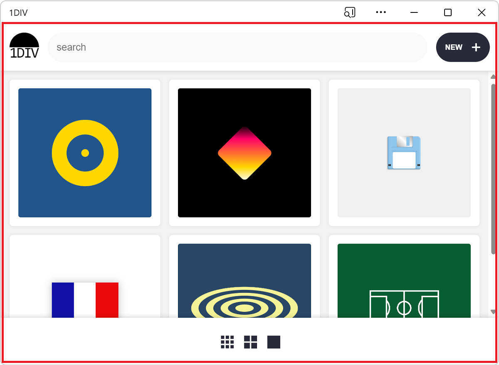
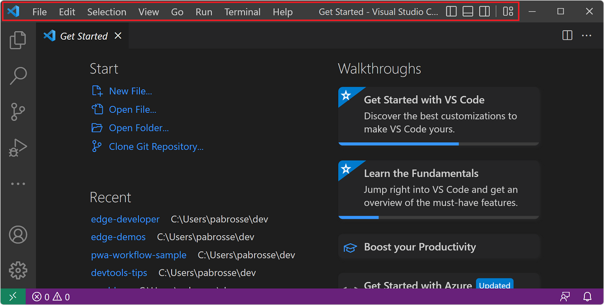
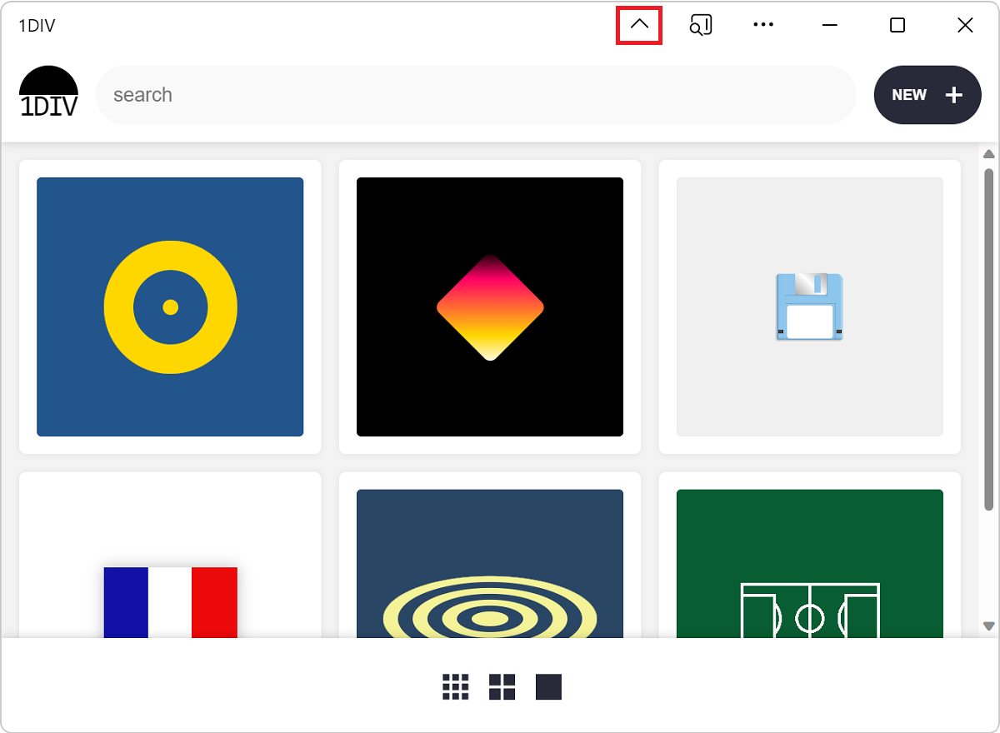
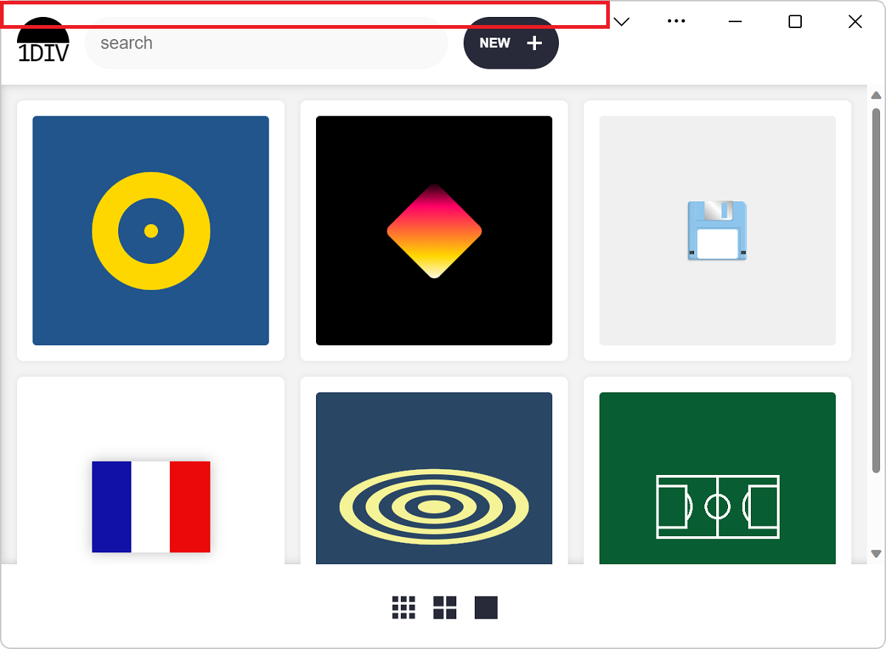

# Display content in the title bar

A PWA can define how it should be displayed on mobile platforms, by using the [display](https://developer.mozilla.org/docs/Web/Manifest/display) member in the web app manifest file.  However, to create an immersive, native-like experience, _desktop_ PWAs can use another  approach.

By default, a PWA installed on desktop can display content in an area that starts immediately below the reserved title bar area:



Displaying content where the title bar normally is can help PWAs feel more native.  Many desktop applications, such as Visual Studio Code, Microsoft Teams, and Microsoft Edge already do this:



The Window Controls Overlay API does the following:
*  Allows you to display web content over the entire surface area of the app.
*  Moves the critical system-required window controls into an overlay.
*  Makes it possible for your content to stay clear of this overlay.


<!-- ====================================================================== -->
## Enable the Window Controls Overlay in your app

The first thing to do is to enable the Window Controls Overlay feature in your app's [Web App Manifest file](web-app-manifests.md).  To do this, in the manifest file, set the `display_override` property:

```json
{
  "display_override": ["window-controls-overlay"]
}
```


<!-- ====================================================================== -->
## Toggle the title bar

When the Window Controls Overlay feature is enabled, the user can choose to have the title bar or not, by clicking the title bar toggle button:



Your code can't assume that the window controls overlay is displayed, because:
*  The user can choose whether to display the title bar.
*  Your app can also run in a web browser or on a mobile device, as well as running as a desktop app.

Therefore, your code needs to react to title bar geometry changes.  To learn more, see [React to overlay changes](#react-to-overlay-changes).


<!-- ====================================================================== -->
## Use CSS environment variables to stay clear of the overlay

The [`env()`](https://developer.mozilla.org/docs/Web/CSS/env) CSS function can be used to access environment variables that the user agent defines.

Four environment variables are added by the Window Controls Overlay feature:

| Variable | Description |
|:--- |:---
| `titlebar-area-x` | Distance, in `px`, of the area normally occupied by the title bar from the left side of the window |
| `titlebar-area-y` | Distance, in `px`, of the area normally occupied by the title bar from the top side of the window |
| `titlebar-area-width` | Width of the title bar area, in `px` |
| `titlebar-area-height` | Height of the title bar area, in `px` |

You can use these environment variables to position and size your own content where the title bar would normally appear, when the window controls overlay feature is disabled:

```css
#title-bar {
  position: fixed;
  left: env(titlebar-area-x, 0);
  top: env(titlebar-area-y, 0);
  height: env(titlebar-area-height, 50px);
  width: env(titlebar-area-width, 100%);
}
```

Using `position: fixed;` makes sure your title bar does not scroll with the rest of the content and instead stays aligned with the window controls overlay.

Knowing where the overlay is and how big it is is important.  The overlay might not always be on the same side of the window; on macOS, the overlay is on the left side, but on Windows, the overlay is on the right side.  Also, the overlay might not always be the same size.

The `env()` CSS function takes a second parameter that's useful for defining the position of your app content when the window controls overlay feature is missing or disabled.


<!-- ====================================================================== -->
## Make regions of your app drag handlers for the window

When the title bar is hidden, only the system-critical window controls remain visible (the **Maximize**, **Minimize**, **Close**, and **App Info** icons).  This means that there is very little space available for users to move the application window around.

You can use the `-webkit-app-region` CSS property to offer more ways for users to drag the app.  For example, if your app has its own titlebar, you can turn its titlebar into a window drag handler:

```css
#title-bar {
  position: fixed;
  left: env(titlebar-area-x, 0);
  top: env(titlebar-area-y, 0);
  height: env(titlebar-area-height, 50px);
  width: env(titlebar-area-width, 100%);
  -webkit-app-region: drag;
}
```


<!-- ====================================================================== -->
## React to overlay changes

A user can toggle the title bar or change the window dimensions while the app is running.  Knowing when these things happen can be important for your app.  Your app might need to rearrange some of the content that's displayed in the title bar, or rearrange the layout elsewhere on the page.

To listen for changes, use the `geometrychange` event on the `navigator.windowControlsOverlay` object.  To detect whether the title bar is visible, use the `visible` property on the `navigator.windowControlsOverlay` object.

Note that the `geometrychange` is fired very frequently when the user resizes the window.  To avoid running layout-changing code too often and causing performance problems in your app, use a `debounce` function to limit how many times the event is handled.  See [The Difference Between Throttling and Debouncing](https://css-tricks.com/the-difference-between-throttling-and-debouncing/).

```javascript
const debounce = (func, wait) => {
  let timeout;
  return function executedFunction(...args) {
    const later = () => {
      clearTimeout(timeout);
      func(...args);
    };
    clearTimeout(timeout);
    timeout = setTimeout(later, wait);
  };
};

if ('windowControlsOverlay' in navigator) {
  navigator.windowControlsOverlay.addEventListener('geometrychange', debounce(e => {
    // Detect if the Window Controls Overlay is visible.
    const isOverlayVisible = navigator.windowControlsOverlay.visible;

    // Get the size and position of the title bar area.
    const titleBarRect = e.titlebarAreaRect;

    console.log(`The overlay is ${isOverlayVisible ? 'visible' : 'hidden'}, the title bar width is ${titleBarRect.width}px`);
  }, 200));
}
```


<!-- ====================================================================== -->
## Demo app

1DIV is a PWA demo app that uses the Window Controls Overlay feature.

1. In Microsoft Edge, go to [1DIV](https://microsoftedge.github.io/Demos/1DIV/dist/) and install the app.

1. Click **Hide title bar** in the app title bar.

   The app now displays content all the way to the top of the window frame, where the title bar used to be.  The top area of the app is a drag handler, to let users move the window.

   

The source code for this demo app is in the [1DIV](https://github.com/MicrosoftEdge/Demos/tree/main/1DIV) repo.

* The [manifest.json](https://github.com/MicrosoftEdge/Demos/blob/main/1DIV/dist/manifest.json) source file declares the app's use of the Window Controls Overlay feature.

* The [app.js](https://github.com/MicrosoftEdge/Demos/blob/main/1DIV/src/app.js) source file uses the `navigator.windowControlsOverlay` object.

* The [app.css](https://github.com/MicrosoftEdge/Demos/blob/main/1DIV/dist/app.css) source file uses the `titlebar-area-*` CSS environment variables.


<!-- ====================================================================== -->
## See also

*   [Window Controls Overlay video tutorial](https://www.youtube.com/watch?v=NvClp35dFVI)
*   [Customize the window controls overlay of your PWA's title bar](https://web.dev/window-controls-overlay/)
*   [Breaking Out of the Box](https://alistapart.com/article/breaking-out-of-the-box/)
