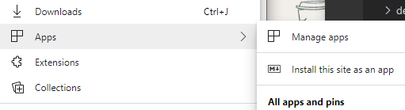

# Progressive Web Apps on Windows

With [Progressive Web Apps](https://developer.mozilla.org/en-US/Apps/Progressive) (or simply *PWA*s) you dont have to decide between using open web technologies for cross-platform interoperability and providing your users with a native app-like experience customized for their device. That's because PWAs are just websites that are [progressively enhanced](https://alistapart.com/article/understandingprogressiveenhancement) to function like native apps on supporting platforms. The qualities of a PWA combine the best of the web and native apps. 

:::row:::
    :::column:::
        
        ### [Discoverable](https://developer.mozilla.org/en-US/Apps/Progressive/Advantages#Discoverable)
        From web search results and supporting app stores
    :::column-end:::
    :::column:::
        
        ### [Installable](https://developer.mozilla.org/en-US/Apps/Progressive/Advantages#Installable)
        Pin and launch from the home screen
    :::column-end:::
    :::column:::
        
        ### [Re-engageable](https://developer.mozilla.org/en-US/Apps/Progressive/Advantages#Re-engageable)
        Send push notifications, even when the app isn't active
    :::column-end:::
    :::column:::
        
        ### [Network Independent](https://developer.mozilla.org/en-US/Apps/Progressive/Advantages#Network_independent)
        Works offline and in low-network conditions
    :::column-end:::
:::row-end:::
:::row:::
    :::column:::
        
        ### [Progressive](https://developer.mozilla.org/en-US/Apps/Progressive/Advantages#Progressive)
        Experience scales up (or down) with device capabilities
    :::column-end:::
    :::column:::
        
        ### [Safe](https://developer.mozilla.org/en-US/docs/Web/Apps/Progressive/Advantages#Progressive#Safe)
        Provides a secure HTTPS endpoint and other user safeguards    
    :::column-end:::
    :::column:::
        
        ### [Responsive](https://developer.mozilla.org/en-US/Apps/Progressive/Advantages#Responsive)
        Adapts to the user's screen size / orientation and input method
    :::column-end:::
    :::column:::
        
        ### [Linkable](https://developer.mozilla.org/en-US/Apps/Progressive/Advantages#Linkable)
        Share and launch from a standard hyperlink
    :::column-end:::
:::row-end:::

By building or converting your existing site to a PWA, you can better engage your existing audience with push notifications, app like integration and offline support. At the same time, you can continue building your audience on the open web, as users discover your PWA through search and link-sharing. Best of all, you can update your app by simply updating your web server code.

## PWAs on Microsoft Edge (Chromium)

When you build a *Progressive Web App* targeting web standard APIs, your application can be deployed across platforms and devices and take advantage of the device specific capabilities as available. PWAs in Microsoft Edge (Chromium) are completely standards based from a web platform perspective and enable users to install the app directly from within the browser without the need for Store based deployment or registration. Desktop PWAs are supported on any of the platforms Microsoft Edge (Chromium) is available, including Windows 7, Windows 10 and Mac OS.  Other benefits include:
   - Applications can be installed directly from within the browser via the "Install" icon in the navigation bar

   

   - Applications can also be installed, run and managed from the "Settings"->"Apps" menu
   
   - Web Notifications are integrated into the Windows notification system
   - Shared cookie store with the browser profile that installed the app
   - Access to other browser features via the "..." menu including certificate validation, site permissions, tracking protection and browser extensions
   - Full access to Microsoft [Edge DevTools](../devtools-guide-chromium/progressive-web-apps.md) for debugging your app 

> [!IMPORTANT]
> To tailor PWAs specifically for Windows 10 that call WinRT APIs from JavaScript, see the documentation specific to the EdgeHTML PWA features here: [Progressive Web Apps (EdgeHTML)](../progressive-web-apps/index.md). You can learn about testing your PWA on Windows 10, and distributing it in the Microsoft Store.

## Requirements

To run as a PWA, your server-hosted web app will at minimum require:

  - [X] [**HTTPS**](https://en.wikipedia.org/wiki/HTTPS). Protect your users by providing a secure connection for server/app communication. Service workers and other PWA technologies will only work with web resources served over a secure connection (or from *localhost* for debugging purposes).  
  
  - [X] [**Service workers**](https://developer.mozilla.org/docs/Web/API/Service_Worker_API). Use *service worker* threads to act as network proxies between your server and client app in order to provide offline support, resource caching, push notifications, background data sync, and  page load perf optimizations.  

  - [X] [**Web app manifest**](https://developer.mozilla.org/docs/Web/Manifest). Provide a JSON-based metadata file describing key information about your web app (such as icons, language, and URL entry point) so that Windows 10 and other host platforms can provide your PWA users with an installable, native app-like experience.  

To be a *great* PWA, your app will also need:

  - [X] [**Cross-browser compatibility**](https://developer.mozilla.org/docs/Learn/Tools_and_testing/Cross_browser_testing). Ensure your PWA works by [testing](https://developer.microsoft.com/microsoft-edge/tools/remote/) in different browsers and environments. 
  
  - [X] [**Responsive design**](https://en.wikipedia.org/wiki/Responsive_web_design). Employ fluid layouts and flexible images with CSS [grid](https://developer.mozilla.org/docs/Web/CSS/CSS_Grid_Layout) and/or [flexbox](https://developer.mozilla.org/docs/Web/CSS/CSS_Flexible_Box_Layout), [media queries](https://developer.mozilla.org/docs/Web/CSS/Media_Queries), and [responsive images](https://developer.mozilla.org/docs/Learn/HTML/Multimedia_and_embedding/Responsive_images) to adapt your UX to your user's device. Use device [emulation tools](../devtools-guide/emulation.md) from your browser to test locally, or set up a [remote debugging session](../devtools-protocol/0.1/clients.md#microsoft-edge-devtools-preview) to test directly on a target device.
  
  - [X] [**Deep linking**](https://en.wikipedia.org/wiki/Deep_linking). Route each page of your site to a unique URL so existing users can help you engage an even broader audience through social media sharing.

  - [X] [**Best practices**](https://webhint.io/). Use code quality tools like the [Webhint](https://webhint.io/) linter to optimize the efficiency, robustness, safety, and accessibility of your app.

  - [X] [**Chromium PWA Checklist**](https://developers.google.com/web/progressive-web-apps/checklist#baseline). Check your PWA against the Google baseline PWA checklist

If you'd like to turn your PWA into a [Microsoft Store](https://developer.microsoft.com/store) application, head to the [Progressive Web Apps (EdgeHTML)](../progressive-web-apps/microsoft-store.md) documentation.

## Current availability

Browser engine support for *Progressive Web Apps* calls for a number of architectural components, the most significant being the networking infrastructure underlying the [Fetch API](https://developer.mozilla.org/docs/Web/API/Fetch_API). 

For the upcoming Microsoft Edge (Chromium) release in 2020, the browser platform itself has full support for these features that will work across devices where Microsoft Edge (Chromium) browser is supported. Microsoft Edge (Chromium) is currently in it's final beta with a generally available stable release planned for January 2020 with broad distribution following. [More information on Microsoft Edge availability](https://www.microsoftedge.com)

<!-- image links -->  

<!-- links -->  

[DevToolsProtocolClientsEdgeDevToolsPreview]: ../devtools-protocol/0.1/clients.md#microsoft-edge-devtools-preview "Microsoft Edge DevTools Preview - DevTools Protocol Clients"  
[DevToolsGuideEmulation]: ../devtools-guide/emulation.md "Emulation"  
[DevGuideWhatsNewEdgeHtml17]: ../dev-guide/whats-new/edgehtml-17.md "What's new in EdgeHTML 17"  
[DevGuideWhatsNewEdgeHtml14]: ../dev-guide/whats-new/edgehtml-14.md "What's New in EdgeHTML 14"  
[ProgressiveWebAppsMicrosoftStore]: ../progressive-web-apps/microsoft-store.md "Progressive Web Apps in the Microsoft Store"
[ProgressiveWebAppsMicrosoftStoreCriteriaAutomaticSubmission]: ../progressive-web-apps/microsoft-store.md#criteria-for-automatic-submission "Criteria for automatic submission - Progressive Web Apps in the Microsoft Store"  

[WindowsUWPControlsPatternTilesNotificationsWns]: /windows/uwp/controls-and-patterns/tiles-and-notifications-windows-push-notification-services--wns--overview.md "Windows Push Notification Services \(WNS\) overview"  
[WindowsUWPDesignDevicesDesigningTv]: /windows/uwp/design/devices/designing-for-tv.md "Designing for Xbox and TV"  
[WindowsUWPDesignDevicesIndex]: /windows/uwp/design/devices/index.md "UI considerations for UWP devices"  
[WindowsUWPGetStartedGuide]: /windows/uwp/get-started/universal-application-platform-guide.md "What's a Universal Windows Platform (UWP) app?"  
[WindowsUWPLaunchResumeBackgroundTasks]: /windows/uwp/launch-resume/support-your-app-with-background-tasks.md "Support your app with background tasks"  
[WindowsUWPPublishIndex]: /windows/uwp/publish/index.md "Publish Windows apps and games"  
[WindowsUWPPublishDeveloperAccount]: /windows/uwp/publish/opening-a-developer-account.md "Opening a developer account"  

[WindowsBlogsWelcomingPWAsEdgeWindows]: https://blogs.windows.com/msedgedev/2018/02/06/welcoming-progressive-web-apps-edge-windows-10/#56z7mJwKsykfbR4I.97 "Welcoming Progressive Web Apps to Microsoft Edge and Windows 10 - Windows Blogs"  
[MicrosoftDeveloperEdgePlatformStatusBackgroundSync]: https://developer.microsoft.com/microsoft-edge/platform/status/backgroundsyncapi "Background Sync API - Microsoft Edge Platform Status"  
[MicrosoftDeveloperEdgePlatformStatusWebApplicationManifest]: https://developer.microsoft.com/microsoft-edge/platform/status/webapplicationmanifest "Web Application Manifest - Microsoft Edge Platform Status"  
[MicrosoftDeveloperEdgeToolsRemote]: https://developer.microsoft.com/microsoft-edge/tools/remote "Instant testing"  
[MicrosoftDeveloperWindowsMixedReality]: https://developer.microsoft.com/windows/mixed-reality "Mixed Reality for developers"  
[MicrosoftDeveloperWindowsSurfaceHub]: https://developer.microsoft.com/windows/surfacehub "Microsoft Surface Hub"  
[MicrosoftDeveloperStore]: https://developer.microsoft.com/store "Microsoft Developer Store"  
[MicrosoftSupportWindowsFocusAssist]: https://support.microsoft.com/help/4026996/windows-10-turn-focus-assist-on-or-off "Turn Focus assist on or off in Windows 10"  
[MicrosoftSupportWindowsNotificationSettings]: https://support.microsoft.com/help/4028678/windows-10-change-notification-settings "Change notification settings in Windows 10"  

[AListApartUnderstandingProgressiveEnhancement]: https://alistapart.com/article/understandingprogressiveenhancement "Understanding Progressive Enhancement - A List Apart"  

[MDNApps]: https://developer.mozilla.org/Apps/Progressive "apps | MDN"  
[MDNCache]: https://developer.mozilla.org/docs/Web/API/Cache "Cache | MDN"  
[MDNCrossBrowserTesting]: https://developer.mozilla.org/docs/Learn/Tools_and_testing/Cross_browser_testing "Cross browser testing | MDN"  
[MDNCssFlexibleBoxLayout]: https://developer.mozilla.org/docs/Web/CSS/CSS_Flexible_Box_Layout "CSS Flexible Box Layout | MDN"  
[MDNCssGridLayout]: https://developer.mozilla.org/docs/Web/CSS/CSS_Grid_Layout "CSS Grid Layout | MDN"  
[MDNFetchApi]: https://developer.mozilla.org/docs/Web/API/Fetch_API "Fetch API | MDN"  
[MDNMediaQueries]: https://developer.mozilla.org/docs/Web/CSS/Media_Queries "Media queries | MDN"  
[MDNNotificationsApi]: https://developer.mozilla.org/docs/Web/API/Notifications_API "Notifications API | MDN"  
[MDNPushApi]: https://developer.mozilla.org/docs/Web/API/Push_API "Push API | MDN"  
[MDNPwaAdvantagesDiscoverable]: https://developer.mozilla.org/docs/Web/Apps/Progressive/Advantages#Discoverable "Discoverable - Progressive web app advantages"  
[MDNPwaAdvantagesInstallable]: https://developer.mozilla.org/docs/Web/Apps/Progressive/Advantages#Installable "Installable - Progressive web app advantages"  
[MDNPwaAdvantagesLinkable]: https://developer.mozilla.org/Apps/Progressive/Advantages#Linkable "Linkable - Progressive web app advantages"  
[MDNPwaAdvantagesNetworkIndependent]: https://developer.mozilla.org/docs/Web/Apps/Progressive/Advantages#Network_independent "Network independent - Progressive web app advantages"  
[MDNPwaAdvantagesProgressive]: https://developer.mozilla.org/docs/Web/Apps/Progressive/Advantages#Progressive "Progressive - Progressive web app advantages"  
[MDNPwaAdvantagesReEngageable]: https://developer.mozilla.org/docs/Web/Apps/Progressive/Advantages#Re-engageable "Re-engageable - Progressive web app advantages"  
[MDNPwaAdvantagesResponsive]: https://developer.mozilla.org/Apps/Progressive/Advantages#Responsive "Responsive - Progressive web app advantages"  
[MDNPwaAdvantagesSafe]: https://developer.mozilla.org/docs/Web/Apps/Progressive/Advantages#Safe "Safe - Progressive web app advantages"  
[MDNResponsiveImages]: https://developer.mozilla.org/docs/Learn/HTML/Multimedia_and_embedding/Responsive_images "Responsive images | MDN"  
[MDNServiceWorkerApi]: https://developer.mozilla.org/docs/Web/API/Service_Worker_API "Service Worker API | MDN"  
[MDNSyncManager]: https://developer.mozilla.org/docs/Web/API/SyncManager "SyncManager | MDN"  
[MDNWebAppManifest]: https://developer.mozilla.org/docs/Web/Manifest "Web App Manifest | MDN"  

[PWABuilder]: https://www.pwabuilder.com "PWABuilder"  

[Webhint]: https://webhint.io "webhint"  

[WikiDeepLinking]: https://en.wikipedia.org/wiki/Deep_linking "Deep linking - Wikipedia"  
[WikiHttps]: https://en.wikipedia.org/wiki/HTTPS "HTTPS - Wikipedia"  
[WikiResponsiveWebDesign]: https://en.wikipedia.org/wiki/Responsive_web_design "Responsive web design - Wikipedia"  
