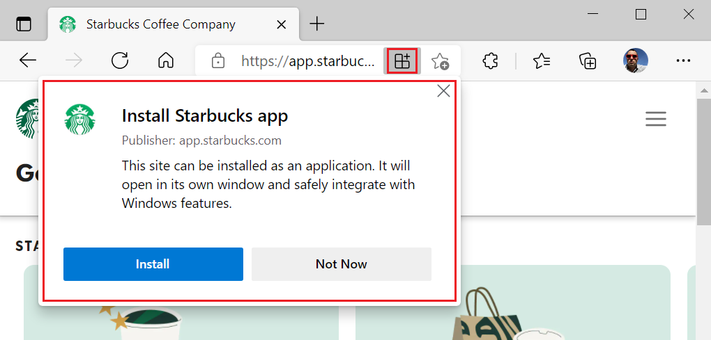
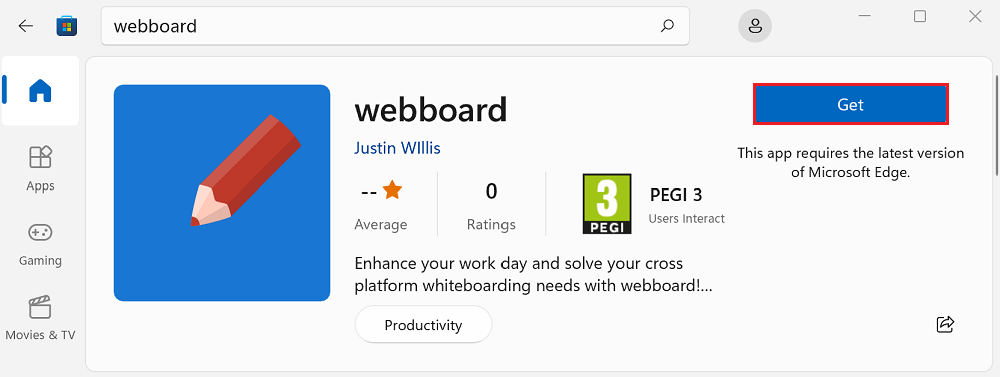
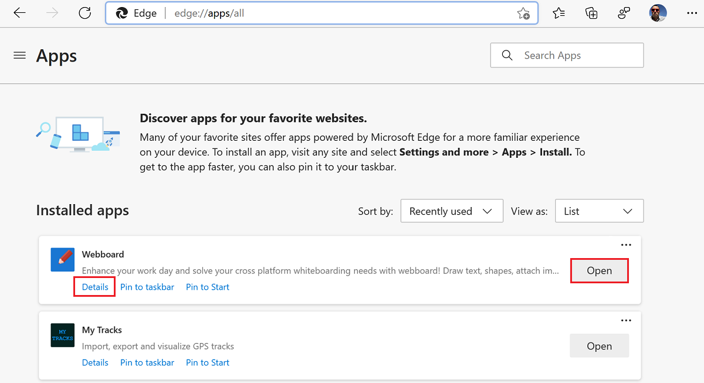
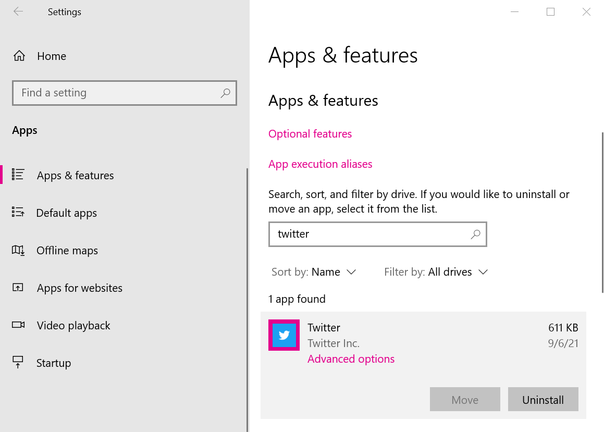
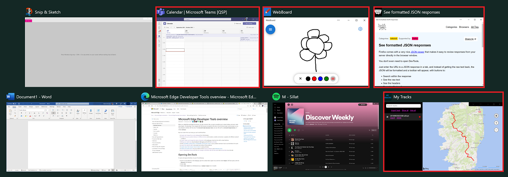
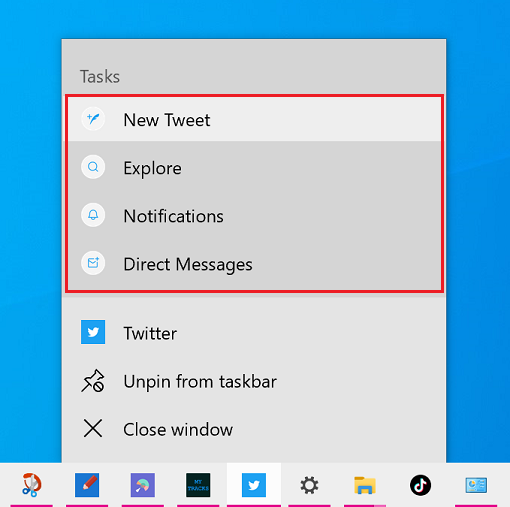
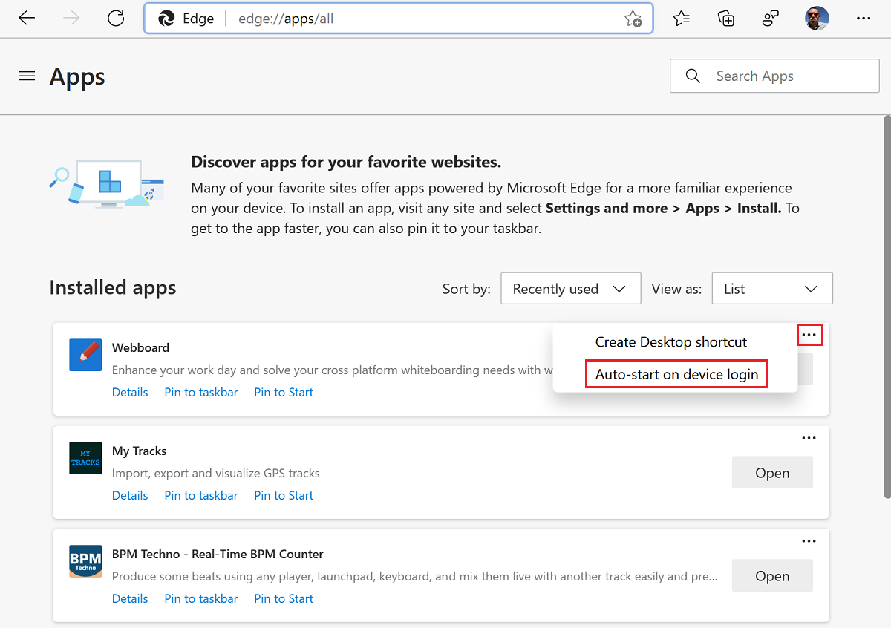
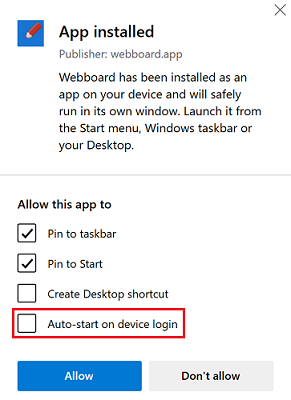
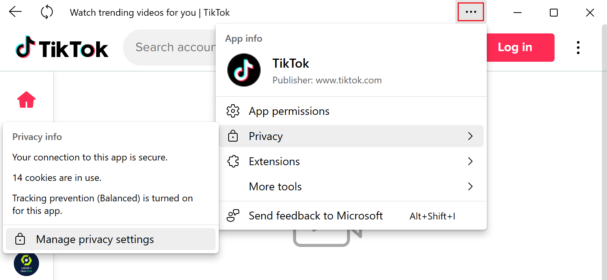

# The user experience of PWAs

On Windows, Progressive Web Apps (PWAs) are just like other apps.  Any device running Microsoft Edge gets full access to the technologies and characteristics of Progressive Web Apps.

<!-- ====================================================================== -->
## Installing a PWA

When Microsoft Edge determines that a website is an installable Progressive Web App (PWA), the **App available** () icon appears in the address bar.

1.  Click the **App available** () icon to install the PWA.

    

1.  Click **Install** to complete the installation and run the PWA in Windows.

Many PWAs are also present on the Microsoft Store, and can be installed directly from there, without needing to open Microsoft Edge.

To install a PWA from the Microsoft Store, select **Get** on the app page:

<!-- ====================================================================== -->
## Managing PWAs

To find the list of installed Progressive Web Apps (PWAs) in Microsoft Edge, go to `edge://apps`.  On this page, you can open any app by clicking **Open**.  To learn more about an app or uninstall it, click **Details**.

You can also manage PWAs in the **Apps & features** system setting, like other Windows apps.

1.  In Windows, select **Start** > **Settings**.
1.  Type "apps" in the **Find a setting** search field, and then select **Add or remove programs**.
1.  Find the PWA you want to manage in the list of apps and select it to find more information or remove it.

<!-- ====================================================================== -->
## Windows integration

Progressive Web Apps (PWAs) are displayed like native apps on Windows. They appear in the Taskbar (where they can be pinned), in the Start menu, or when switching between apps with `Alt`+`Tab`.

PWAs and native apps can reside side-by-side in the Taskbar (PWAs are indicated here by a red box):

PWAs and native apps are displayed when switching between windows with `Alt`+`Tab` (PWAs are indicated here by a red box):

PWAs can also expose common tasks to users as shortcuts that appear in the app's right-click menu:

Learn more about [defining shortcuts](how-to/shortcuts.md).

PWAs can also display notifications in the operating system's own notification service. This helps users re-engage with your app. Learn more about [using notifications, push messages, and badges](how-to/notifications-badges.md).

### Starting PWAs when the user signs in

PWAs on Windows can launch automatically when the user signs in, so they can immediately engage with the app.

To set an already installed PWA to automatically start when you sign in to Windows:

1.  Open Microsoft Edge.
1.  Go to `edge://apps`.  The **Apps** page lists the installed apps.
1.  On the app you want to configure, click the **More options** () button and then select **Auto-start on device login**.

During installing a PWA, users are also given a chance to set a PWA to automatically start.

To set a PWA to automatically start when you sign in to Windows, while installing the PWA:

1.  During installing an app, in the post-installation dialog, select **Auto-start on device login**:

<!-- ====================================================================== -->
## App info menu

When a user selects the ellipses (**...**) button in the title bar of a Progressive Web Apps (PWA), the **App info** menu is displayed:

The **App info** menu contains useful information about the app, such as:

*  The app icon, name, and publisher.
*  The various app permissions that have been granted.
*  Privacy information such as the number of cookies used.
*  Lists of extensions and tools that can be used in the app.
