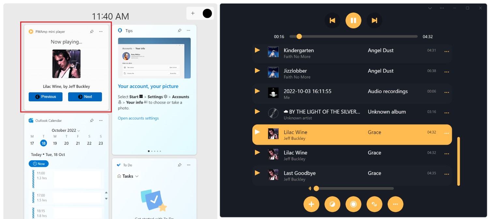

# What's New in Progressive Web Apps

This page lists the updates to Progressive Web Apps (PWAs) and Web Apps from the Microsoft Edge Web Apps team.  To try new features, read these announcements.  To stay up to date with the latest and greatest features, download the [Microsoft Edge preview channels](https://www.microsoft.com/edge/download/insider) (Beta, Dev, and Canary).

Sections of this document correspond to historical releases of Microsoft Edge, and are not updated over time.  For example, references below to "new features" or "origin trials" might become outdated as new versions of Microsoft Edge are released.

<!-- ====================================================================== -->
## What's New in Microsoft Edge 114

Starting with Microsoft Edge 114, you can detect when your PWA runs in the sidebar in Microsoft Edge by using User-Agent Client Hints.

To learn more, check out these resources:

* [Detect usage in the sidebar](../how-to/sidebar.md#detect-usage-in-the-sidebar), in _Build PWAs for the sidebar in Microsoft Edge_.
* [Detecting Microsoft Edge from your website](../../web-platform/user-agent-guidance.md).

<!-- ====================================================================== -->
## What's New in Microsoft Edge 112

Starting with Microsoft Edge 112, Progressive Web Apps can experimentally opt-in to be pinned to the sidebar in Microsoft Edge.

The sidebar in Microsoft Edge allows users to easily access popular websites and utilities alongside their browser tabs. The content in the sidebar augments the user's primary task by enabling side-by-side browsing and minimizing the need to switch contexts between browser tabs.

To make your PWA ready for pinning to the sidebar in Microsoft Edge, use the `edge_side_panel` manifest member.

To learn more, see [Build PWAs for the sidebar in Microsoft Edge](../how-to/sidebar.md).

<!-- ====================================================================== -->
## What's New in Microsoft Edge 108

Microsoft Edge 108 introduces experimental support for Progressive Web Apps to define their own widgets in the Widgets Board in Windows 11.

Widgets are defined in your PWA manifest file, by using the `widgets` manifest member. Widgets are displayed by using Adaptive Cards templates, which makes widgets easy to create, and makes them easy to adapt to various operating system widgets dashboards in the future. Microsoft Edge also makes it possible to handle user actions on PWA widgets from your service worker file.

The following screenshot shows the Windows Widgets Board on the left and the PWAmp demo app on the right. The Widgets Board contains the PWAmp mini player widget, showing the current song that's playing in the PWAmp app:

To learn more, see [Build PWA-driven widgets](../how-to/widgets.md).

<!-- ====================================================================== -->
## What's New in Microsoft Edge 105

Microsoft Edge 105 brings the following new features for Progressive Web Apps.

#### Window Controls Overlay API

The **Window Controls Overlay** API is now available by default, starting with Microsoft Edge 105. Use the Window Controls Overlay API to take control of the area that would normally be used by the title bar of an installed PWA window. The PWA code can use this area to render arbitrary web content such as a custom title area, navigation buttons, or a menu bar.

This feature makes PWAs that are installed on desktop operating systems such as Windows, macOS, and Linux, more similar to their native counterparts.

To learn more, check out these resources:

* [Display content in the title bar](../how-to/window-controls-overlay.md).
* [Closing a 30 pixel gap between native and web](https://blogs.windows.com/msedgedev/2022/09/27/closing-pixel-gap-native-web-window-controls-overlay/).
* [Window Controls Overlay API](https://developer.mozilla.org/docs/Web/API/Window_Controls_Overlay_API) on MDN.

#### Notifications from a PWA are now indicated as coming from the PWA

In earlier versions, the notifications that were created by PWAs looked like they were emitted by Microsoft Edge.

With Microsoft Edge 105, notifications from a PWA now display the name and icon of the PWA instead of displaying "Microsoft Edge":

<!-- ====================================================================== -->
## What's New in Microsoft Edge 101

Microsoft Edge 101 introduces the **sidebar search** feature for PWAs. **Sidebar search** lets users of installed PWAs search for and browse web content in a sidebar located in the PWA window.

To access **sidebar search**:

1. Click the **Open sidebar search** button in the title bar of the installed PWA:

   

1. Type a search query, and then press **Enter**. The search results are displayed, and you can go to a web page from there:

   

<!-- ====================================================================== -->
## What's New in Microsoft Edge 100

Microsoft Edge Dev and Canary channels moved to version 100 on February 9, 2022.  In this milestone, we're testing the following new web app features.  We expect to see these new features rolling out to Stable following the testing period.

#### App Sync

The sync service that powers features including Favorites, Settings, History, and more has been expanded to include your installed web apps - that is, PWAs and websites installed as apps.  The sync service works when you are signed in to your profile and have opted in to syncing.

As we test and gradually release this feature over the coming weeks, users who have opted in to sync will start to see a **Your available apps** section in the `edge://apps` page, and a redesigned **Apps** menu.

#### The _Your available apps_ section

The **Your available apps** section will show any apps you've installed on other devices with the same signed-in profile, that aren't currently installed in the Microsoft Edge instance you're using.  The available apps will be shown in their own section with gray icons.  Click the **Install** button on an app to install the app on that device:

App sync is available on desktop devices only, at this stage.  To keep your apps in sync across devices, adding an app on one device will add it to the **Your available apps** section on other devices.  Uninstalling an app on one device will remove it from other devices.

#### Redesigned Apps menu

In Microsoft Edge, the **Apps** command in the **Settings and more** menu is being redesigned:
*  The **Apps** menu icon can be added to the toolbar, for quick access.
*  The popup menu can be pinned open as a sidebar to show your apps alongside web content.
*  Customizable view and sort options have been added, along with a **My available apps** section to support the App Sync feature.

Users can show the **Apps** menu icon on the toolbar, for quick access:

> [!div class="mx-imgBorder"]
> 

Users can pin the **Apps** menu open as a sidebar:

> [!div class="mx-imgBorder"]
> 

Users can choose between a list or grid view:

> [!div class="mx-imgBorder"]
> 

Users can choose the sort order of their apps:

> [!div class="mx-imgBorder"]
> 

<!-- ====================================================================== -->
## What's New in Microsoft Edge 97

Microsoft Edge version 96 is scheduled to become the Stable release on November 18, 2021.  Microsoft Edge version 97 will move from Dev to Beta preview channel following that date.

#### Store apps registered as URL handlers hide custom tab UI 

Store-installed PWAs that are participating in the [URL Handler Origin Trial](#url-handlers-origin-trial) will no longer show the Chrome Custom Tab (CCT) when redirecting from the PWA's domain to a matching domain name with a different top-level domain (TLD). This redirecting often happens in apps with locale-specific domains; for example, redirecting from `contoso.com` to `contoso.ca` for users in Canada.

<!-- ====================================================================== -->
## What's New in Microsoft Edge 96

#### URL Protocol Handlers moves to Stable

The origin trial has been concluded.  The URL Protocol Handlers capability is now shipping in Microsoft Edge 96 Stable.

See also:
*  [Protocol handlers origin trial](#protocol-handlers-origin-trial)
*  [Handle protocols in Progressive Web Apps](../how-to/handle-protocols.md)
*  [URL protocol handler registration for PWAs](https://web.dev/url-protocol-handler/)

#### New hub design for managing your installed web apps

Microsoft Edge Canary reached version 96 on October 5, 2021.  With a subset of our users, we're testing a new design to better manage your installed web apps.  When you go to `edge://apps` in your browser, it now displays a redesigned hub that lists installed PWAs and websites as apps.

###### Sort order

You can sort your apps by any of the following:
*  Recently used.
*  Alphabetically, based on title.
*  Date of installation.

###### List view or grid view

You can arrange apps in a list or grid view, by using the **View as** dropdown list.  In this image, **Grid** view is selected:

_To zoom: right-click > Open image in new tab._

###### Pin apps, create shortcuts to apps, run app on login

You can easily pin apps to the taskbar or **Start** menu.  You can create a shortcut, and enable apps to run on user login.

###### App details page

There's now an app details page, which provides way to easily access the following:
*  Permissions and privacy details for the associated origin.
*  More details about the application.

The app details page:

<!-- ====================================================================== -->
## What's New in Microsoft Edge 95

Microsoft Edge version 95 moved to Beta channel on September 28, 2021.  The origin trials remain active for the following features:
*  [Window Controls Overlay for desktop PWAs](#window-controls-overlay-origin-trials).
*  [URL Handlers](#url-handlers-origin-trial).

We expect the [protocol handlers origin trial](#protocol-handlers-origin-trial) to end on October 21, 2021.

<!-- ====================================================================== -->
## What's New in Microsoft Edge 94

Microsoft Edge version 94 moved to Stable on September 23, 2021. This release cycle was short—just<!-- em dash --> 3 weeks from Microsoft Edge 93 Stable to Microsoft Edge 94 Stable, as we snapped to the new [4-week release cycle](https://blogs.windows.com/msedgedev/2021/03/12/new-release-cycles-microsoft-edge-extended-stable/).  This new release cadence matches the new cadence of Chromium milestones, described in [Speeding up Chrome's release cycle](https://blog.chromium.org/2021/03/speeding-up-release-cycle.html).

Due to the shortened release cycle of Microsoft Edge version 94, we focused on stabilizing the release cycle logistics, and we shifted feature development to Microsoft Edge version 95.

The origin trials remain active for the following features:
*  [Window Controls Overlay for desktop PWAs](#window-controls-overlay-origin-trials).
*  [URL Handlers](#url-handlers-origin-trial).

We expect the [protocol handlers origin trial](#protocol-handlers-origin-trial) to end with Microsoft Edge version 94 as we take final feedback and get ready to move the protocol handlers feature to Stable.  In case you are enrolled in the origin trial for protocol handlers, we plan to end the trial period after Microsoft Edge version 94.  We'll then determine when this feature will become Stable.

<!-- ====================================================================== -->
## What's New in Microsoft Edge 93

Microsoft Edge version 93 became the Stable channel of Microsoft Edge on September 2, 2021. This article lists updates we made to Progressive Web Apps (PWAs) from both a developer and consumer point of view.

#### Measure usage of your Store-installed PWA

Microsoft Edge now includes a referrer header with the request for the first navigation of your Microsoft Store-installed PWA.

This feature was first introduced in Microsoft Edge version 91, and we shipped a bug fix in Microsoft Edge version 93.

Learn more in [Publish a Progressive Web App to the Microsoft Store](../how-to/microsoft-store.md#measure-usage-of-your-pwa-installed-from-the-microsoft-store).

#### Window Controls Overlay origin trials

To have more control over the title bar area that's currently displayed in standalone display mode, you may want to experiment with Window Controls Overlay. Window Controls Overlay (WCO) is a set of features that work together to provide just the essential controls needed for the app window. This layout frees up more space for the web content layer. WCO is available for installed desktop PWAs.

Learn more about experimenting with Window Controls Overlay at [Display content in the title bar](../how-to/window-controls-overlay.md).

_2023 update: This feature is no longer in [Origin Trial](https://microsoftedge.github.io/MSEdgeExplainers/origin-trials/) and is available to all users, so the following no longer applies:_ Register your origin for the **Web App Window Controls Overlay** trial at the Origin Trials Developer Console.

#### URL Handlers origin trial

Developers can now use the experimental feature Web App URL Handlers in origin trial. This feature allows the registration of an installed PWA to open links from other apps that refer to its scope.

_2023 update: This feature is no longer in [Origin Trial](https://microsoftedge.github.io/MSEdgeExplainers/origin-trials/) and has been removed, so the following no longer applies, and the PWA URL Handlers feature was removed from the Chromium browser engine:_ Register your domain for the **Web App URL Handlers** trial at the Origin Trials Developer Console.

See also:
* [Handle links to your Progressive Web Apps](../how-to/handle-urls.md)
* [PWAs as URL Handlers](https://web.dev/pwa-url-handler/)

#### Support for the Share API on macOS

We have implemented support for the `navigator.share` API for macOS. The feature is rolling out to stable Microsoft Edge browsers on macOS over the coming weeks.

Learn more about the [navigator.share() API](https://developer.mozilla.org/docs/Web/API/Navigator/share).

<!-- ====================================================================== -->
## What's New in Microsoft Edge 92

Microsoft Edge version 92 became the stable channel of Microsoft Edge on July 22, 2021. This article lists updates we made to Progressive Web Apps (PWAs) from both a developer and consumer point of view.

#### Protocol handlers origin trial

You can now register your PWA to handle specific protocols with the host operating system.  Learn more about using protocol handlers with your PWA at [Handle protocols in Progressive Web Apps](../how-to/handle-protocols.md).

_2023 update: This feature is no longer in [Origin Trial](https://microsoftedge.github.io/MSEdgeExplainers/origin-trials/) and is available to all users, so the following no longer applies:_ The Windows trial for protocol handlers is now available. You can register your origin for the **Web App Protocol Handler** trial at the origin trial signup page.

#### Streamlined App Info menu

When a user selects the ellipses (**...**) button in the app's title bar, the **App info** menu is displayed.  We've updated the **App info** menu and streamlined the user experience in the following ways, to provide a user experience that's more like a desktop app than a browser UI:

*  Moved the app **Publisher** information to the top level and made it the first thing a user sees:

   

*  Moved the privacy information and controls into a dedicated 2nd-level **Privacy** menu:

   

*  Moved content-related tools into a dedicated 2nd-level **More tools** menu:

   

#### Post-install flyout dialog

After a PWA is installed from the Microsoft Edge browser on Windows, users can now select from four options to easily launch their apps:
*  **Pin to taskbar**
*  **Pin to Start**
*  **Create Desktop shortcut**
*  **Auto-start on device login**

For convenience, this flyout dialog is shown the first time the app is launched:

This feature is being rolled out gradually to all users.  In the meantime, if you'd like to use this feature, go to `edge://flags` and enable the flag **Web Apps Post Install Dialog**.

#### Restore Web Apps

Installed sites and PWAs that were running before an unexpected shutdown will now restore (that is, they will be restarted) when the system recovers.

An unexpected shutdown can occur due to process failure, system restart, or power outage. Before this change, installed sites and PWAs had indeterminate behavior upon system restore.

<!-- ====================================================================== -->
## See also

* [Experimental features and origin trials](../how-to/origin-trials.md)
* [Use Origin Trials in Microsoft Edge](../../origin-trials/index.md)
