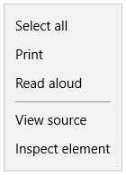

# Tailor your PWA (EdgeHTML) for Windows  

PWAs installed on Windows 10 enjoy [all the benefits][PwaIndexWindows10] of running as [Universal Windows Platform \(UWP\)][WindowsUWPGetStartedGuide] apps, including protection through Windows app sandboxing security and full access to [Windows Runtime \(WinRT\))][UwpApiIndex] APIs, including those for:  

*   Controlling device features \(such as camera, microphone, GPS\)  
*   Accessing user resources \(such as calendar, contacts, documents, music\)  
*   Launching / navigating your app through Cortana voice commands  
*   Integrating with the Windows OS \(through the Windows Action Center, desktop taskbar, and context menus\)  

... and these are only a few of the added possibilities for your PWA \(EdgeHTML\) on Windows!  

This guide shows you how to install, run, and enhance your PWA \(EdgeHTML\) as a Windows 10 app, while still ensuring cross-browser and cross-platform compatibility.  

## Prerequisites  

*   An existing PWA \(or hosted web app\), either a live or localhost site.  This guide uses the sample PWA from [Get started with Progressive Web Apps][PwaGetStarted].  
*   Download the \(free\) [Visual Studio Community 2017][MicrosoftVisualStudioDownloads].  You are also able to use the Professional, Enterprise, or [Preview][MicrosoftVisualStudioPreview] editions.  From the Visual Studio Installer, choose the following Workloads:  
    *   **Universal Windows Platform development**  

## Set up and run your Universal Windows app  

A PWA \(EdgeHTML\) installed as a Windows 10 app runs independently from the browser, in a standalone \(`WWAHost.exe` process\) window.  Enabling this simply requires a lightweight app wrapper that contains your hosted web app, which you are able to quickly set up using the Visual Studio `Progressive Web App (Universal Windows)` project template.  \(All your app logic, including sending native Windows Runtime API requests, still happens in your original web app code.\)  

Set up your Windows app development environment in Visual Studio.  

1.  In your Windows Settings, turn on [Developer mode][WindowsUWPGetStartedEnable].  \(Type `developer mode` in the Windows searchbar to find it.\)  
1.  Launch Visual Studio and **Create a new project...**  
1.  Select the C# **Windows Application Packaging Project** template.  If you are using a previous version of Visual Studio, find the equivalent template under **Hosted Web App (Universal Windows)** or **Progressive Web App (Universal Windows)**.  
1.  Select the default Windows 10 `Target version` \(most recent release\) and `Minimum version` \(build 10586 or higher\) and click **OK**.  

      

    Your new project loads with the package.appxmanifest designer open.  This is where you configure the details of your app, including package identity, package dependencies, required capabilities, visual elements, and extensibility points.  This is an easily configurable, temporary version of the app package manifest used during app development.  
    When you build your app project, [Visual Studio generates an AppxManifest.xml][UwpSchemasAppxpackageUapmanifestschemaGeneratePackageManifest] file from this metadata, which is used to install and run your app.  Whenever you update your `package.appxmanifest` file, be sure to rebuild the project so both are reflected in your `AppxManifest.xml` at runtime.  

1.  In the manifest designer **Application** panel, enter the URL of your PWA as the `Start page`.

    > [!NOTE]
    > Service workers are supported for all https \(secure, remote\) urls specified as the `StartPage`.  Service workers are not supported by default for web apps that specify a local start page.  To enable service worker support for these cases, add an explicit [ApplicationContentUriRules](#set-application-content-uri-rules-acurs) entry to the manifest, for example: `<uap:Rule Match="http://web-platform.test/" Type="include" uap5:ServiceWorker="true"/>`  
    
      
    
    You are able to also modify the `Display name` and `Description` as you like.  
1.  Save this file \(or another 512x512 image of your choosing\) to your desktop.  
    Then, in the manifest designer **Visual Assets** panel, click on the `Source` field **...** button, select it as your source file, and click **Generate**.  \(Then click **OK** to overwrite the default placeholder images\).  
    
      
    
    This generates the basic visual assets for installing, running, launching, and distributing your app in the store.  
    If you see any red \(`X`\) errors indicating missing images, you are able to click on the **...** buttons to manually select a file from the generated images.  
1.  In the manifest designer **Content URIs** panel, replace `http://example.com` with the location of your PWA \(such that `Rule` = `include` and `WinRT Access` = `All`\).  
    This grants your PWA permission to send native Windows Runtime \(WinRT\) API requests when running as a Windows 10 app, which is covered a bit later.   If your actual PWA does not require WinRT access, you are able to switch the `WinRT Access` value to `None`.  Either way, be sure to sub out the default `http://example.com` string with the URI of your PWA, or your app is not able to properly load at runtime.  
    You are ready to run and debug your PWA as a Windows 10 app.  If you are using a localhost site to step through this guide, make sure it is running.  Then,  
1.  Build \(`Ctrl`+`Shift`+`F5`\) and Run \(`F5`\) your PWA project.  Your website should now launch in a standalone app window.  Not only is it a hosted web app; it is running as a Progressive Web App installed on Windows 10!  

      

## Debug your PWA \(EdgeHTML\) as a Windows app  

Because a PWA \(EdgeHTML\) is simply a progressively enhanced hosted web app, you are able to debug your server-side code the same as any web app, using your usual IDE and workflow.  The changes you deploy live are reflected in your installed PWA the next time you launch it \(no need to redeploy your Universal Windows app package\).

For client-side debugging within your Windows 10 app, you must have the `Microsoft Edge DevTools Preview` app.  This standalone app includes all the functionality of the original in-browser [Microsoft Edge DevTools][DevToolsGuide] \(including [PWA tools][DevToolsGuideServiceWorkers]\), plus basic [remote debugging][DevToolsProtocol01ClientsEdgePreview] support and a [Debug Target chooser][DevToolsGuideMicrosoftStoreApp] for attaching to any running instance of the EdgeHTML engine, including add-ins for Office, Cortana, app webviews, and of course, PWAs running on Windows.  

Here is how to set up debugging for your PWA \(EdgeHTML\).  

1.  Install the [Microsoft Edge DevTools Preview][MicrosoftStoreEdgeDevtoolsPreview] app from the Microsoft Store if you do not already have it.  
1.  With your PWA site up and running, launch the DevTools app.  
1.  From Visual Studio, launch your Windows 10 app with the `Start Without Debugging` (`Ctrl`+`F5`) command.  \(The DevTools app does not attach properly if the Visual Studio debugger is active.\)  
1.  In the DevTools app, click the **Refresh** button in the Local debug target chooser.  Your PWA \(EdgeHTML\) site should now be listed.  \(If it is also running in a browser window, it is the last instance of that site in the list.\)  
1.  Click on your PWA \(EdgeHTML\) site listing to open a new DevTools instance tab and start debugging.  
    
      
    
1.  You are able to verify that DevTools is attached to your PWA-running-as-Windows-app.  In the DevTools **Console**, type:  
    
    ```shell
    window.Windows
    ```  
    
    This returns the global `Windows Runtime` object containing all of the [top-level WinRT namespaces](#find-windows-runtime-winrt-apis).  This is your PWA \(EdgeHTML\) entrypoint to the [Universal Windows Platform][WindowsUWPIndex], and only exposed to web apps that run as Windows 10 apps (running outside the browser, in a `WWAHost.exe` process).  
    
## Find Windows Runtime \(WinRT\) APIs  

As an installed Windows app, your [PWA \(EdgeHTML\) has full access to native Windows Runtime APIs][WindowsRuntime]; identify what you need to use, obtain the requisite permissions, and employ feature detection to send that API request on supported environments.  Walk through this process to add a progressive enhancement for Windows desktop users of your PWA.  

There are a number of ways to identify the Universal Windows Platform APIs you need for your Windows PWA, including searching the comprehensive [UWP docs on Windows Dev Center][uwp/api/], downloading and running [UWP code samples](#uwp-code-samples) with Visual Studio, and browsing code snippets for common tasks for PWAs on Windows.

There are a number of ways to identify the Universal Windows Platform APIs you need for your Windows PWA, including searching the comprehensive [UWP docs on Windows Dev Center][uwp/api/], downloading and running [UWP code samples](#uwp-code-samples) with Visual Studio, and browsing code snippets for common tasks for [PWAs on Windows 10 (EdgeHTML)][PwaIndexWindows10].  

Overall, WinRT APIs work in JavaScript the same way they do in C#, so you may follow the general [Universal Windows Platform documentation][WindowsUWPIndex] and [API Reference][UwpApiIndex] for usage.  However, please note the following differences:  

*   WinRT features in JavaScript use  [different casing conventions][ScriptingJsinrtUsingWinRTCasingConventions]  
*   [Events are represented as string identifiers][ScriptingJsinrtHandlingWinRTEvents] passed to class `addEventListener`/`removeEventListener` methods  
*   [Asynchronous methods][ScriptingJsinrtUsingWinRT] use the JavaScript Promise model  
*   APIs in the `Windows.UI.Xaml` namespace are not supported for JavaScript apps, which instead use the [EdgeHTML][DevGuideWhatsNew] engine web rendering stack \(HTML, CSS\)  

For more details, see [Using the Windows Runtime in JavaScript][WindowRuntimeUsingJavascript].  

### UWP code samples  

Check out the [Universal Windows Platform \(UWP\) Code Samples][MicrosoftDeveloperWindowsSamples] repo to browse JavaScript examples for common Windows 10 app scenarios.  Although the JS versions of these samples use the [WinJS][GithubWinjsWinjs] library to structure the sample template, WinJS is not required for sending the WinRT API requests demonstrated in these samples.  

> [!NOTE]
> If you need to listen for the [`activated`][UwpApiWindowsUiWebuiWebapplicationActivated] event for the app, you are able to do this using the following native WinRT API:  
> 
> **Use this**  
> 
> ```javascript
> Windows.UI.WebUI.WebUIApplication.addEventListener("activated", function (activatedEventArgs) {
>     // Check activatedEventArgs.kind and respond as needed
> });
> ```  
> 
> ... as opposed this type of WinJS request used in the samples:  
> 
> **Not this**  
> 
> ```javascript
>     var page = WinJS.UI.Pages.define("/html/scenario1-launched.html", {
>         ready: function (element, options) {
>             // Check options.activationKind and respond as needed
>         }
>     });
> ```  

## Send WinRT API requests from your PWA (EdgeHTML)  

At this point, pretend you want to add a custom context menu for Windows users of our PWA \(EdgeHTML\) and have identified the APIs you need in the [Windows.UI.Popups][UwpApiWindowsUiPopups] namespace.  

In order to send any WinRT APIs requests from our PWA \(EdgeHTML\), you first need to [establish the requisite permissions](#set-application-content-uri-rules-acurs) \(or, Application Content URI Rules\) in your Windows app package manifest \(`.appxmanifest`\) file.  

If any of these API requests involve access to user resources like pictures or music, or to device features like the camera or microphone, you also need to add [app capability declarations](#app-capability-declarations) to the app package manifest in order for Windows to prompt the user for permission.  If you later publish your PWA \(EdgeHTML\) to the Microsoft Store, these required [App permissions][MicrosoftSupportWindowsAppPermissions] are also noted in your store listing.  

#### Set Application Content URI Rules (ACURs)  

Through ACURs, otherwise known as a URL allow list, you are able to give the URLs of your PWA \(EdgeHTML\) direct access to Windows Runtime APIs.  At the Windows OS level, the right policy bounds are set to allow code hosted on your web server to directly send platform API requests.  You define these bounds in the app package manifest file when you specify your PWA URLs as `ApplicationContentUriRules`.  

Your rules should include the start page for your app and any other pages you want included as app pages.  If your user navigates to a URL that is not included in your rules, Windows opens the target URL in the Microsoft Edge browser rather than your standalone PWA \(EdgeHTML\) window \(`WWAHost.exe` process\).  You may also exclude specific URLs.  

There are several ways to specify a URL `Match` in your rules:  

*   An exact hostname  
*   A hostname for which a URI with any subdomain of that hostname is included or excluded  
*   An exact URI  
*   An exact URI containing a query property  
*   A partial path and a wildcard to indicate a particular file extension for an include rule  
*   Relative paths for exclude rules  

Here are a few examples of ACURs in a `.appxmanifest` file:  

```xml
<Application
Id="App"
StartPage="https://contoso.com/home">
<uap:ApplicationContentUriRules>
    <uap:Rule Type="include" Match="https://contoso.com/" WindowsRuntimeAccess="all" />
    <uap:Rule Type="include" Match="https://*.contoso.com/" WindowsRuntimeAccess="all" />
    <uap:Rule Type="exclude" Match="https://contoso.com/excludethispage.aspx" />
</uap:ApplicationContentUriRules>
```  

URLs defined within the ACURs for your app are able to be granted permission to the Windows Runtime through the `WindowsRuntimeAccess` attribute, which accepts the following values:  

*   `all`: Remote JavaScript code has access to all WinRT APIs and any local packaged components.  The [Windows \(WinRT\))][UwpApiIndex] namespace is injected and present in the script engine.  
*   `allowForWeb`: Remote JavaScript code access is limited to local packaged components, including custom C++/C# components.  
*   `none`: Default.  The specified URL has no platform access.  

In this tutorial, you already set the only ACUR that you need \(Step 6 of the previous [Set up and run your app](#set-up-and-run-your-universal-windows-app) section\) for your single-page app.  You are able to confirm this from the **Content URIs** panel of the Visual Studio `package.appxmanifest` designer.  

  

You are also able to view the raw XML of your manifest by right-clicking your `package.appxmanifest` file in Visual Studio Solution Explorer and selecting **View Code** \(`F7`\).  To toggle back to the Designer view, select **View Designer** \(`Shift`+`F7`\).  

#### App capability declarations  

If your app needs programmatic access to user resources like pictures or music, or to devices like a camera or a microphone, you must include the corresponding [App capability declarations][WindowsUwpPackagingAppCapabilities] in your app package manifest file.  There are three app capability declaration categories:  

*   [General-use capabilities][WindowsUwpPackagingAppCapabilitiesGeneralUse] that apply to most common app scenarios.  
*   [Device capabilities][WindowsUwpPackagingAppCapabilitiesDevice] that allow your app to access peripheral and internal devices.  
*   [Special-use capabilities][WindowsUwpPackagingAppCapabilitiesSpecialRestricted] that support enterprise scenarios and require a Microsoft Store company account.  For more info about company accounts, see [Account types, locations, and fees][WindowsUwpPublishAccountTypesLocationsFees].

Your Microsoft Store app page lists all the capabilities you declare in your app package manifest, so be sure to only specify the capabilities that your app actually uses.

Some capabilities provide apps access to sensitive resources.  These resources are considered sensitive because each is able to access the user's personal data or cost the user money.  Privacy settings, managed by the Windows 10 [Settings][BingResultsWindows10Settings] app, let the user dynamically control access to sensitive resources.  Thus, it is important that your app does not assume a sensitive resource is always available.  For more info about accessing sensitive resources, see [Guidelines for privacy-aware apps][WindowsUwpSecurityIndex].  

You request access by declaring capabilities in the package manifest for your app.  In Visual Studio, you are able to do this from the **Capabilities** panel of the package.appxmanifest designer.  

  

In this tutorial, only the default Internet \(Client\) capability is required, so no further action is needed.  

### Use feature detection to invoke WinRT  

To ensure a quality baseline experience for your PWA audience across all platforms, you progressively enhance your PWA experience on Windows using WinRT feature detection.  This way, you are able to be sure your Windows-specific code is only run in a context where WinRT APIs are available and applicable.  

Feature detection may be as simple as looking for the `Windows` object \(the entrypoint to the [WinRT namespace][UwpApiIndex]\) as below:  

```javascript
if(window.Windows){
    /*Run code that sends Windows API requests */
}
```  

However, given that not all Windows APIs are available on all [Windows 10 device types][UwpExtensionSdkDeviceFamiliesOverview], it is generally useful to use more specific feature detection to further qualify the namespace of the API request you are sending:  

```javascript
if(window.Windows && Windows.Media.SpeechRecognition){
    /*Run code that sends Windows API requests */
}
```  

With that background, you are ready to add some WinRT code to implement a custom context menu.  If you are using the sample PWA from [Get started with Progressive Web Apps][PwaGetStarted]:

1.  Open Visual Studio to your PWA site project.

1.  In Solution Explorer, open the `views\layout.pug` file and add the following line, right below the `script` reference for your service worker:
    
    ```xml
    script(src='/javascripts/site.js')
    ```  

1.  In Solution Explorer, right-click on the `javascripts` folder and **Add** > **New File...**.

1.  Name your file: `site.js`, and copy in the following code:
    
    ```javascript
    if (window.Windows && Windows.UI.Popups) {
        document.addEventListener('contextmenu', function (e) {

            // Build the context menu
            var menu = new Windows.UI.Popups.PopupMenu();
            menu.commands.append(new Windows.UI.Popups.UICommand("Option 1", null, 1));
            menu.commands.append(new Windows.UI.Popups.UICommandSeparator);
            menu.commands.append(new Windows.UI.Popups.UICommand("Option 2", null, 2));

            // Convert from webpage to WinRT coordinates
            function pageToWinRT(pageX, pageY) {
                var zoomFactor = document.documentElement.msContentZoomFactor;
                return {
                    x: (pageX - window.pageXOffset) * zoomFactor,
                    y: (pageY - window.pageYOffset) * zoomFactor
                };
            }

            // When the menu is invoked, execute the requested command
            menu.showAsync(pageToWinRT(e.pageX, e.pageY)).done(function (invokedCommand) {
                if (invokedCommand !== null) {
                    switch (invokedCommand.id) {
                        case 1:
                            console.log('Option 1 selected');
                            // Invoke code for option 1
                            break;
                        case 2:
                            console.log('Option 2 selected');
                            // Invoke code for option 2
                            break;
                        default:
                            break;
                    }
                } else {
                    // The command is null if no command was invoked.
                    console.log("Context menu dismissed");
                }
            });
        }, false);
    }
    ```

1.  Compare the context menu behavior when you run your PWA in the browser \(`F5` from your PWA site project\) versus from inside the Windows app window \(`F5` from your Universal Windows app project\).  In the browser, right-clicking gives you the Microsoft Edge default context menu, whereas in the `WWAHost.exe` process, your custom menu now appears.  

    | Microsoft Edge | Windows 10 app |  
    |:--- |:---- |  
    |  |  |  

Hopefully you now have a solid foundation for progressively enhancing your PWAs on Windows.  If you run into questions or anything is unclear, please send a comment!  

## Going further

The [Windows Dev Center][MicrosoftDeveloperWindowsApps] is your complete reference for all stages of Windows app building, from [getting started][MicrosoftDeveloperWindowsAppsGetStarted], to [designing][MicrosoftDeveloperWindowsAppsDesign], [developing][MicrosoftDeveloperWindowsAppsDevelop], and [publishing][MicrosoftDeveloperStorePublishApps] to the Microsoft Store.  

For a general overview on the Universal Windows Platform \(UWP\) and how to target different Windows 10 device families, see [Intro to the Universal Windows Platform][WindowsUWPGetStartedGuide].  

And when you are ready, here is how \(and why!\) to [Submit your PWA to the Microsoft Store](./microsoft-store.md).  

<!-- image links -->  

<!-- links -->  

[PwaGetStarted]: ./get-started.md "Get started with Progressive Web Apps"  
[PwaIndexWindows10]: ./index.md#pwas-on-windows-10-edgehtml "PWAs on Windows 10 (EdgeHTML) - Progressive Web Apps on Windows"  
[DevToolsGuide]: ../devtools-guide.md "Microsoft Edge (EdgeHTML) Developer Tools"  
[DevToolsGuideMicrosoftStoreApp]: ../devtools-guide.md#microsoft-store-app "Microsoft Store app - Microsoft Edge (EdgeHTML) Developer Tools"  
[DevToolsGuideServiceWorkers]: ../devtools-guide/service-workers.md "Service Workers"  
[DevToolsProtocol01ClientsEdgePreview]: ../devtools-protocol/0.1/clients.md#microsoft-edge-devtools-preview "Microsoft Edge DevTools Preview - DevTools Protocol Clients"  
[DevGuideWhatsNew]: ../dev-guide/whats-new.md "What's New in EdgeHTML"  
[WindowsRuntime]: ../windows-runtime/index.md "Windows Runtime (WinRT) for JavaScript"  
[WindowRuntimeUsingJavascript]: ../windows-runtime/using-the-windows-runtime-in-javascript.md "Using the Windows Runtime in JavaScript"  

[ScriptingJsinrtHandlingWinRTEvents]: /scripting/jswinrt/handling-windows-runtime-events-in-javascript "Handling Windows Runtime Events in JavaScript"  
[ScriptingJsinrtUsingWinRT]: /scripting/jswinrt/using-windows-runtime-asynchronous-methods "Using Windows Runtime Asynchronous Methods"  
[ScriptingJsinrtUsingWinRTCasingConventions]:  /scripting/jswinrt/using-the-windows-runtime-in-javascript#casing-conventions-with-windows-runtime-features "Casing Conventions with Windows Runtime Features - Using the Windows Runtime in JavaScript"  
[UwpApiIndex]: /uwp/api/index "Windows UWP Namespaces"  
[UwpApiWindowsUiPopups]: /uwp/api/windows.ui.popups "Windows.UI.Popups Namespace"  
[UwpApiWindowsUiWebuiWebapplicationActivated]: /uwp/api/windows.ui.webui.webuiapplication.activated "WebUIApplication.Activated Event"  
[UwpExtensionSdkDeviceFamiliesOverview]: /uwp/extension-sdks/device-families-overview "Device families overview"  
[UwpSchemasAppxpackageUapmanifestschemaGeneratePackageManifest]: /uwp/schemas/appxpackage/uapmanifestschema/generate-package-manifest "How Visual Studio generates an app package manifest"  
[WindowsUWPIndex]: /windows/uwp/index "Universal Windows Platform documentation"  
[WindowsUWPGetStartedGuide]: /windows/uwp/get-started/universal-application-platform-guide "What's a Universal Windows Platform (UWP) app?"  
[WindowsUWPGetStartedEnable]: /windows/uwp/get-started/enable-your-device-for-development "Enable your device for development"  
[WindowsUwpSecurityIndex]: /windows/uwp/security/index "Security"  
[WindowsUwpPublishAccountTypesLocationsFees]: /windows/uwp/publish/account-types-locations-and-fees "Account types, locations, and fees"  
[WindowsUwpPackagingAppCapabilitiesSpecialRestricted]: /windows/uwp/packaging/app-capability-declarations#special-and-restricted-capabilities "Restricted capabilities"  
[WindowsUwpPackagingAppCapabilitiesDevice]: /windows/uwp/packaging/app-capability-declarations#device-capabilities "Device capabilities"  
[WindowsUwpPackagingAppCapabilitiesGeneralUse]: /windows/uwp/packaging/app-capability-declarations#general-use-capabilities "General-use capabilities"  
[WindowsUwpPackagingAppCapabilities]: /windows/uwp/packaging/app-capability-declarations "App capability declarations"  

[BingResultsWindows10Settings]: https://binged.it/2lOGSH0 "windows 10 settings - Bing"  
[GithubWinjsWinjs]: https://github.com/winjs/winjs "winjs/winjs | GitHub"  
[MicrosoftDeveloperStorePublishApps]: https://developer.microsoft.com/store/publish-apps/index "Publish Windows apps and games"  
[MicrosoftDeveloperWindowsApps]: https://developer.microsoft.com/windows/apps/index "Universal Windows Platform documentation"  
[MicrosoftDeveloperWindowsAppsDesign]: https://developer.microsoft.com/windows/apps/design/index "Design and code Windows apps"  
[MicrosoftDeveloperWindowsAppsDevelop]: https://developer.microsoft.com/windows/apps/develop/index "Develop UWP apps"  
[MicrosoftDeveloperWindowsAppsGetStarted]: https://developer.microsoft.com/windows/apps/getstarted/index "Get started with Windows 10 apps"  
[MicrosoftDeveloperWindowsSamples]: https://developer.microsoft.com/windows/samples "Code samples"  
[MicrosoftStoreEdgeDevtoolsPreview]: https://www.microsoft.com/store/p/microsoft-edge-devtools-preview/9mzbfrmz0mnj "Microsoft Edge DevTools Preview"  
[MicrosoftSupportWindowsAppPermissions]: https://support.microsoft.com/help/10557/windows-10-app-permissions "App permissions"  
[MicrosoftVisualStudioDownloads]: https://visualstudio.microsoft.com/downloads "Downloads"  
[MicrosoftVisualStudioPreview]: https://visualstudio.microsoft.com/vs/preview "Visual Studio Preview"  
