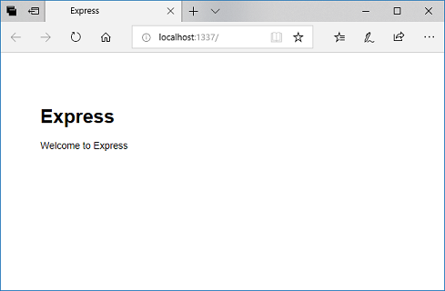
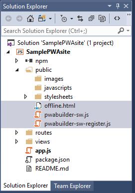

# Get started with Progressive Web Apps  

Progressive Web Apps (PWAs) are simply web apps that are [progressively enhanced](https://en.wikipedia.org/wiki/Progressive_enhancement) with native app-like features on supporting platforms and browser engines, such as launch-from-homescreen installation, offline support, and push notifications.  On Windows 10 with the Microsoft Edge (EdgeHTML) engine, PWAs enjoy the added advantage of running independently of the browser window as [Universal Windows Platform](https://docs.microsoft.com/windows/uwp/get-started/whats-a-uwp) apps.

This guide will give you an overview of PWA basics by building a simple *localhost* web app as a PWA using *Microsoft Visual Studio* and some *PWA Builder* utilities.  The "finished" product will work similarly across any browser that supports PWAs.

> [!TIP]
> For a quick way to convert an existing site to a PWA and package it for Windows 10 and other app platforms, check out [PWA Builder](https://www.pwabuilder.com/).  

## Prerequisites  

You can build PWAs with any web development IDE.  The following are only prerequisites for this guide, which will walk you through PWA tooling support in the Windows developer ecosystem.

*   Download the (free) [Visual Studio Community 2017](https://www.visualstudio.com/downloads/).  You can also use the *Professional*, *Enterprise*, or [*Preview*](https://www.visualstudio.com/vs/preview/) editions).  From the *Visual Studio Installer*, choose the following Workloads:

    *   **Universal Windows Platform development**
    *   **Node.js development**

## Set up a basic web app  

For the sake of simplicity, we'll use the Visual Studio [Node.js and Express app](https://docs.microsoft.com/visualstudio/nodejs/tutorial-nodejs) template to create a basic, localhost web app that serves up an *index.html* page.  Imagine this as a placeholder for the compelling, full-featured web app you'll be developing as a PWA.

1.  Launch Visual Studio, and start a new project (**File** > **New** > **Project...** *or* `Ctrl`+`Shift`+`N`).

1.  Under **javascript**, select **Basic Node.js Express 4 Application**.  Set the name and location and click **OK**.

    

1.  Once your new project loads, **Build** (`Ctrl`+`Shift`+`B`) and **Start Debugging** (`F5`).  Verify that your *index.html* file is loading on *http://localhost:1337*.

    

## Turn your app into a PWA  

Now its time to wire up the basic [PWA requirements](index.md#requirements) for your web app: a *Web App Manifest*, *HTTPS* and *Service Workers*.

### Web App Manifest  

A [*Web App Manifest*](https://developer.mozilla.org/docs/Web/Manifest) is a JSON metadata file describing your app, including its name, author, entry page URL, and icon(s).  Because it follows a [standards-based schema](https://www.w3.org/TR/appmanifest/), you need only supply a single web app manifest for your PWA to be installable on any platform / OS / device that supports PWAs.  In the Windows ecosystem, your web app manifest signals to the Bing web indexer that your PWA is a candidate for [automatic inclusion in the Microsoft Store](./microsoft-store.md), where it can reach nearly 700 million active monthly users as a Windows 10 app.

If this were an existing live site, you could quickly generate a web app manifest using [PWA Builder](https://www.pwabuilder.com/).  Since its still an unpublished project, we'll copy in a sample manifest.

1.  In the Visual Studio *Solution Explorer*, right-click the *public* folder and select **Add** > **New File...**, specifying `manifest.json` as the item name.

1.  In the *manifest.json* file, copy in the following boilerplate:

    ```json
    {
        "dir": "ltr",
        "lang": "en-us",
        "name": "My Sample PWA",
        "scope": "/",
        "display": "browser",
        "start_url": "https://PLACEHOLDER-FOR-PWA-URL",
        "short_name": "SamplePWA",
        "theme_color": "transparent",
        "description": "A sample PWA for testing purposes",
        "orientation": "any",
        "background_color": "transparent",
        "related_applications": [],
        "prefer_related_applications": false,
        "icons": []
    }
    ```  

    If this were a real PWA, you'd obviously want to customize at least the *name*, *start_url*, *short_name*, and *description*, as well as the *icons* (we'll get to those next...).  

    See the [Web App Manifest](https://developer.mozilla.org/docs/Web/Manifest
) reference on *MDN web docs* to learn more about the different member values and their purpose.

1.  Next, let's fill in the empty `icons` array with actual image paths.  For that, we'll use PWA Builder's *App Image Generator*.

    1.  Using a web browser, download this [sample 512x512 PWA image](./media/pwa.png).

    1.  Go to the PWA Builder [App Image Generator](https://www.pwabuilder.com/imageGenerator), and select the *pwa.png* image you just saved as the **Input Image** and then click the **Download** button.

    1.  **Open** and **Extract** the zip file.
    
    1.  In the Visual Studio *Solution Explorer*, right-click the *public* folder and **Open Folder in File Explorer**.  Create a **New folder** named *images*.
    
    1.  Copy all of the platform folders (*android*, *chrome*, ...*windows10*) from your extracted zip to the *images* folder and close the file explorer window.  Add these folders to your Visual Studio project (in *Solution Explorer*, right-click *images* folder and select **Add** > **Existing folder...** for each of the folders.)

    1.  Open (with Visual Studio or any editor) the *icons.json* file from the extracted zip and copy the `"icons": [...]` array into your project's *manifest.json* file.

1.  Now we just need to associate our web app manifest with the app itself.  Open the *layout.pug* file (in *views* folder) for editing, and add this line right after the stylesheet link.  (Its simply Node's [pug](https://pugjs.org/language/attributes.html) template shorthand for `<link rel='manifest' href='/manifest.json'>`).
    
    ```html
    link(rel='manifest', href='/manifest.json')
    ```  
    
With all that in place, your web app is now serving up a manifest and homescreen-ready app icons! Try running your app (`F5`) and loading up the manifest:


And one of your icons:


If you publish the app live (with an actual `start_url`), the Bing search engine could now identify it as a candidate for [automatic packaging and submission to the Microsoft Store](./microsoft-store.md) as an installable Windows 10 app.  Just make sure that your manifest includes the [*Quality signals for Progressive Web Apps*](https://blogs.windows.com/msedgedev/2018/02/06/welcoming-progressive-web-apps-edge-windows-10/#4UOdrDJj3124VIkc.97) that Bing will be scanning for:

*   `name`

*   `description`
 
*   At least one icon 512px square or larger (to ensure an image source of sufficient resolution for auto-generating you app's splash screen, store listing, tile image, and so on.)

 ...in addition to being [HTTPS](#https), using [service workers](#service-workers), complying with [Microsoft Store Policies](https://docs.microsoft.com/legal/windows/agreements/store-policies).

### HTTPS

[Service Workers](https://developer.mozilla.org/docs/Web/API/Service_Worker_API) and other key PWA technologies that work with service workers (such as the [Cache](https://developer.mozilla.org/docs/Web/API/Cache), [Push](https://developer.mozilla.org/docs/Web/API/Push_API), and [Background Sync](https://developer.mozilla.org/docs/Web/API/SyncManager) APIs) only work across secure connections, which means [*HTTPS*](https://en.wikipedia.org/wiki/HTTPS) for live sites or *localhost* for  debugging purposes.

If you were to [publish this web app as a live site](https://docs.microsoft.com/visualstudio/nodejs/tutorial-nodejs#optional-publish-to-azure-app-service) (for example, by setting up an [*Azure free account*](https://azure.microsoft.com/free/)), you'll want to ensure your server is configured for HTTPS.  If you're using the [Microsoft Azure App Service](https://azure.microsoft.com/services/app-service/web/) to host your site, it will will be served over HTTPS by default.

For this guide we'll continue using *http://localhost* as a placeholder for a live site served over *https://*.

### Service Workers

*Service Workers* is the key technology behind PWAs.  They act as a proxy between your PWA and the network, enabling your website to act as an installed native app: serving up offline scenarios, responding to server push notifications, and running background tasks.  Service workers also open up all kinds of new performance strategies; and website need not even be full-blown web app to take advantage of the service worker cache for fine-tuned page load performance.

Service workers are event-driven background threads that run from javascript files served up alongside the regular scripts that power your web app.  Because they don't run on the main UI thread, service workers don't have DOM access, though the [UI thread](https://developer.mozilla.org/docs/Web/API/Worker/postMessage) and a [worker thread](https://developer.mozilla.org/docs/Web/API/DedicatedWorkerGlobalScope/postMessage) can communicate using `postMessage()` and `onmessage` event handlers.  

You associate a service worker with your app by *registering* it to your site's URL origin (or a specified path within it).  Once registered, the service worker file is then *downloaded*, *installed*, and *activated* on the client machine.  For more, *MDN web docs* has a comprehensive guide on [Using Service Workers](https://developer.mozilla.org/docs/Web/API/Service_Worker_API/Using_Service_Workers) and a detailed [Service Worker API](https://developer.mozilla.org/docs/Web/API/Service_Worker_API) reference.

For this tutorial, we'll use a ready-made "Offline page" service worker script courtesy of [PWA Builder](https://www.pwabuilder.com/serviceworker).  From this, you can go on to customize it with more elaborate functionality according to your needs for performance, network bandwidth, and so on.  Check out Mozilla's [Service Worker Cookbook](https://serviceworke.rs/) for a number of useful service worker caching "recipe" ideas.

1.  Open https://www.pwabuilder.com/serviceworker and select the (default) **Offline page** service worker and click the **Download service worker** button.

1.  Open the download folder and copy these two files:

    *   ServiceWorker1\pwabuilder-sw-register.js
    *   ServiceWorker1\pwabuilder-sw.js
    
    ...to the *public* folder of your Visual Studio web app project.  (From Visual Studio, use Ctrl+O to open file explorer to your project and navigate to the *public* folder).  

    Its worth reviewing the code in both of these files, to get the gist of how to register a service worker that caches a designated page (*offline.html*) and serves it when a network fetch fails.  Next, we need to create a simple "offline.html" page as a placeholder for our app's offline functionality.

1.  In *Solution Explorer*, open the *views/layout.pug* file, and add the following line below your link tags:
    
    ```html
    script(src='/pwabuilder-sw-register.js')
    ```  
    
   So that your site will load and run your service worker registration script.
   
1.  In *Solution Explorer*, right-click on the *public* folder and select **Add** > **New File...**.  Name it **offline.html**, and add a `<title>` and some body content, for example:
    
    ```html
    <!DOCTYPE html>

    <html xmlns="http://www.w3.org/1999/xhtml">
    <head>
        <meta charset="utf-8" />
        <title>Offline mode</title>
    </head>
    <body>
        You are now offline.
    </body>
    </html>
    ```  
    
    At this point, your *public* folder should have three new files:
    
    
    
1.  In *Solution Explorer*, open the *routes\index.js* file, and add the following code just before the final command (`module.exports = router;`):
    
    ```javascript
    router.get('/offline.html', function (req, res) {
        res.sendFile('public/offline.html');
    });
    ```  
    
    This instructs your app to serve the *offline.html* file (when your service worker fetches it for the offline cache).

1.  Let's test out your PWA! Build (`Ctrl`+`Shift`+`B`) and Run (`F5`) your web app to launch Microsoft Edge and open your *localhost* page.  Then,

    1.  Open the Edge DevTools **Console** (`Ctrl`+`Shift`+`J`) and verify the *Service worker was registered*.
    1.  In the **Debugger** panel, expand the **Service Workers** control and click on your origin.  In the *Service Worker Overview*, verify your service worker is activated and running:

        
    1.  Still in the Debugger, expand the **Cache** control and verify that the *offline.html* page has been cached.

        

1.  Time to try your PWA as an offline app! In Visual Studio, **Stop Debugging** (Shift+F5) your web app, then open Microsoft Edge (or reload) to your website's localhost address.  It should now load the *offline.html* page (thanks to your service worker and offline cache)!

    

## Add push notifications

Let's make our PWA even more "app-like" by adding client-side support for push notifications using the [Push API](https://developer.mozilla.org/docs/Web/API/Push_API) to subscribe to a messaging service and the [Notifications API](https://developer.mozilla.org/docs/Web/API/Notifications_API) to display a toast message upon receiving a message.  As with Service Workers, these are standards-based APIs that work cross-browser, so you only have to write the code once for it to work everywhere PWAs are supported.  On the server side, we'll use the [Web-Push](https://www.npmjs.com/package/web-push) open-source library to handle the differences involved in delivering push messages to various browsers.

The following is adapted from the *Push Rich Demo* in Mozilla's [Service Worker Cookbook](https://serviceworke.rs/push-rich_demo.html), which is worth checking out for a number of other useful *Web Push* and service worker recipes.

1.  **Install the NPM *web-push* library.**
    
    In Visual Studio *Solution Explorer*, right-click your project and **Open Node.js Interactive Window...**.  In it, type: 
    
    ```javascript
    .npm install web-push
    ```  
    
    ...  to install the [Web-Push](https://www.npmjs.com/package/web-push) library.  Then, open up your *index.js* file, and add the following line to the top of your file after the other requirement statements:
    
    ```javascript
    var webpush = require('web-push');
    ```  
   
1.  **Generate VAPID keys for your server.**
    
    Next we'll need to generate VAPID (*Voluntary Application Server Identification*) keys for your server to send push messages to the PWA client.  You'll only have to do this once (that is, your server only requires a single pair of VAPID keys).  In the *Node.js Interactive Window*, type: 
    
    ```javascript
    var webpush = require('web-push');
    webpush.generateVAPIDKeys();
    ```  
    
    The output should result in a JSON object containing a public and private key, which we'll copy into our server logic.
    
    In your *index.js* file, just before the final  (*module.exports = router*) line, add the following:
    
    ```javascript
    const vapidKeys = {
        publicKey: '',
        privateKey: ''
    };
    
    webpush.setVapidDetails(
        'mailto:pwa@example.com',
        vapidKeys.publicKey,
        vapidKeys.privateKey
    );
    ```  
    
    ...  and then copy in the *publicKey* and *privateKey* values that you just generated.  Feel free to customize the *mailto* address as well (though its not required to run this sample).
    
    The [Mozilla Services engineering blog](https://blog.mozilla.org/services/2016/08/23/sending-vapid-identified-webpush-notifications-via-mozillas-push-service/) has a nice explainer on VAPID and WebPush if you're interested in the details of how it works behind the scenes.

1.  **Handle push-related server requests.**  

    Now its time to set up routes for handling push-related requests from the PWA client, including serving up the VAPID public key and registering the client to receive pushes.

    In a real scenario, a push notification would likely originate from an event in your server logic.  To simplify things here, we'll add a "Push Notification" button to our PWA homepage for generating pushes from our server, and a */sendNotification* server route for handling those requests.

    Still in your *index.js* file, append the following routes just after the VAPID initialization code you added in *Step 2* above.
    
    ```javascript
    router.get('/vapidPublicKey', function (req, res) {
        res.send(vapidKeys.publicKey);
    });

    router.post('/register', function (req, res) {
        // A real world application would store the subscription info.
        res.sendStatus(201);
    });

    router.post('/sendNotification', function (req, res) {
        const subscription = req.body.subscription;
        const payload = 'payload';
        const options = null;

        webpush.sendNotification(subscription, payload, options)
            .then(function () {
                res.sendStatus(201);
            })
            .catch(function (error) {
                res.sendStatus(500);
                console.log(error);
            });
    });
    ```  

    With the server-side code in place, let's plumb in push notifications on the PWA client.

1.  **Subscribe to push notifications.**  

    As part of their role as PWA network proxies, service workers handle push events and toast notification interactions.  However, as it is with first setting up (or *registering*) a service worker, subscribing the PWA to server push notifications happens on the PWA's main UI thread and requires network connectivity.  Subscribing to push notifications requires an active service worker registration, so you'll first want to check that your service worker is installed and *active* before trying to subscribe it to push notifications.

    Before a new push subscription is created, Microsoft Edge will check whether the user granted the PWA permission to receive notifications.  If not, the user will be prompted by the browser for permission.  If the permission is *denied*, the call to *registration.pushManager.subscribe* will throw a DOMException, so you'll want to handle that.  For more on permission management, see [*Push Notifications in Microsoft Edge*](https://blogs.windows.com/msedgedev/2016/05/16/web-notifications-microsoft-edge/#UAbvU2ymUlHO8EUV.97).

    In your *pwabuilder-sw-register.js* file, append this code:

    ```javascript
    // Subscribe this PWA to push notifications from the server
    navigator.serviceWorker.ready
        .then(function (registration) {
            // Check if the user has an existing subscription
            return registration.pushManager.getSubscription()
                .then(async function (subscription) {
                    if (subscription) {
                        return subscription;
                    }

                    // Otherwise subscribe with the server public key
                    const response = await fetch('./vapidPublicKey');
                    const vapidPublicKey = await response.text();
                    const convertedVapidKey = urlBase64ToUint8Array(vapidPublicKey);

                    return registration.pushManager.subscribe({
                        userVisibleOnly: true,
                        applicationServerKey: convertedVapidKey
                    });
                });
        }).then(function (subscription) {
            // Send the subscription details to the server
            fetch('./register', {
                method: 'post',
                headers: {
                    'Content-type': 'application/json'
                },
                body: JSON.stringify({
                    subscription: subscription
                }),
            });

            // Create a button to mimic server pushes for testing purposes
            var button = document.createElement('input');
            button.type = 'button';
            button.id = 'notify';
            button.value = 'Send Notification';
            document.body.appendChild(button);
            document.getElementById('notify').addEventListener('click', function () {
                fetch('./sendNotification', {
                    method: 'post',
                    headers: {
                        'Content-type': 'application/json'
                    },
                    body: JSON.stringify({
                        subscription: subscription
                    }),
                });
            });
        });
    
    // Utility function for browser interoperability
    function urlBase64ToUint8Array(base64String) {
        var padding = '='.repeat((4 - base64String.length % 4) % 4);
        var base64 = (base64String + padding)
            .replace(/\-/g, '+')
            .replace(/_/g, '/');

        var rawData = window.atob(base64);
        var outputArray = new Uint8Array(rawData.length);

        for (var i = 0; i < rawData.length; ++i) {
            outputArray[i] = rawData.charCodeAt(i);
        }
        return outputArray;
    }
    ```  
    
    Check out the MDN documentation on [`PushManager`](https://developer.mozilla.org/docs/Web/API/PushManager) and NPM docs on [`Web-Push`](https://www.npmjs.com/package/web-push#usage) for more details on how these APIs work and their various options.

1.  **Set up push and notificationclick event handlers.**

    With our push subscription set up, the remainder of the work happens in the service worker.  First we need to set up a handler for server-sent push events, and respond with a toast notification (if permission was granted) displaying the push data payload.  Next we'll add a click handler for the toast to dismiss the notification and sort through a list of currently open windows to open and/or focus the intended PWA client page.

    In your *pwabuilder-sw.js* file, append the following handlers:

    ```javascript
    //Respond to a server push with a user notification
    self.addEventListener('push', function (event) {
        if ("granted" === Notification.permission) {
            var payload = event.data ? event.data.text() : 'no payload';
            const promiseChain = self.registration.showNotification('Sample PWA', {
                body: payload,
                icon: 'images/windows10/Square44x44Logo.scale-100.png'
            });
            //Ensure the toast notification is displayed before exiting this function
            event.waitUntil(promiseChain);
        }
    });
    
    //Respond to the user clicking the toast notification
    self.addEventListener('notificationclick', function (event) {
        console.log('On notification click: ', event.notification.tag);
        event.notification.close();

        // This looks to see if the current is already open and focuses it
        event.waitUntil(clients.matchAll({
            type: 'window'
        }).then(function (clientList) {
            for (var i = 0; i < clientList.length; i++) {
                var client = clientList[i];
                if (client.url == 'http://localhost:1337/' && 'focus' in client)
                    return client.focus();
            }
            if (clients.openWindow)
                return clients.openWindow('/');
        }));
    });
    ```  
    
1.  **Try it out.**  
    
    Time to test push notifications in your PWA!
    
    1.  Run (`F5`) your PWA in the browser.  Because we modified the service worker code (*pwabuilder-sw.js*), we'll need to open the DevTools Debugger (`F12`) to the **Service Worker Overview** panel and and **Unregister** the service worker and reload (`F5`) the page to re-register it (or you can simply click **Update**).  In a production scenario, the browser will check regularly check for service worker updates and install them in the background.  We're just forcing it here for immediate results.
        
        As your service worker activates and attempts to subscribe your PWA to push notifications, you'll see a permission dialog at the bottom of the page:
        
        
        
        Click **Yes** to enable toast notifications for your PWA.
        
    1.  From the *Service Worker Overview* pane, try clicking the  **Push** button.  A toast notification with the (hard-coded "Test push message from DevTools") payload should appear:
        
        
        
    1.  Next try clicking the **Send Notification** button on your PWA's homepage.  This time a toast with the "payload" from our server will appear:
        
        
        
        If you don't click (or *activate*) a toast notification, it will dismiss itself after several seconds and queue up in your Windows *Action Center*:
        
        
        
        ... and with that you have the basics of PWA push notifications.  In a real app, the next steps would be to implement a way to manage and store push subscriptions and to properly [encrypt](https://www.npmjs.com/package/web-push#encryptuserpublickey-userauth-payload-contentencoding) payload data being sent across the wire.

## Going further

This guide demonstrated the basic anatomy of a Progressive Web App and Microsoft PWA development tools including Visual Studio, PWA Builder, and Edge DevTools.

Of course, there's a lot more that goes into [making a great PWA](index.md#requirements) beyond what we covered, including responsive design, deep-linking, [cross-browser testing](https://developer.microsoft.com/microsoft-edge/tools/remote/) and other [best practices](https://sonarwhal.com/) (not to mention *actual* app functionality!), but hopefully this guide gave you a solid introduction of PWA basics and some ideas on getting started.  If you have further questions on PWA development with Windows and/or Visual Studio, please leave a comment!

Check out our other PWA guides to learn how to increase customer engagement and provide a more seamless, OS-integrated app experience:

*   [**Windows tailoring.**](./windows-features.md) Using simple feature detection, you can progressively enhance your PWA for Windows 10 customers through native Windows Runtime (WinRT) APIs, such as those for customizing Windows **Start** menu tile notifications and taskbar jumplists, and (upon permission) working with user resources, such as photos, music and calendar.

*   [**PWAs in the Microsoft Store.**](./microsoft-store.md) Learn more about the benefits of app store distribution and how to submit your PWA.

Also be sure to explore the great resources from around the dev community! [MDN web docs](https://developer.mozilla.org/Apps/Progressive/) and [Google Developers](https://developers.google.com/web/progressive-web-apps/) have excellent guides on Progressive Web Apps.  https://pwa.rocks/ showcases real-world examples of PWAs, and https://hnpwa.com/ compares different frameworks and performance patterns for implementing a sample (*Hacker News* reader) PWA.
