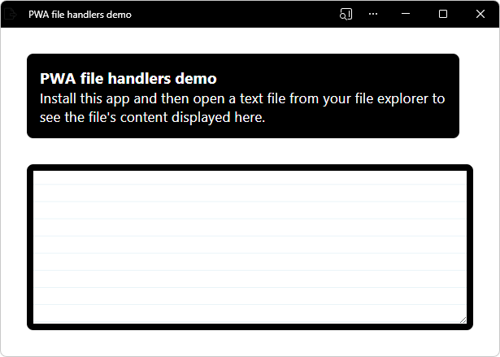
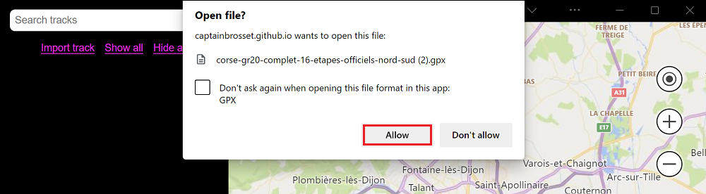
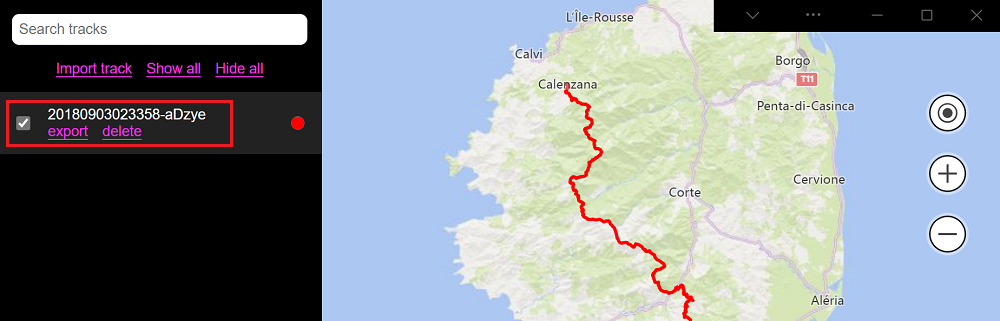

# Handle files in a PWA

A Progressive Web App (PWA) that can handle files feels more native to users and better integrated in the operating system.

Websites can already let users upload files by [using the `<input type="file">` or drag and drop](https://developer.mozilla.org/docs/Web/API/File/Using_files_from_web_applications), but PWAs go one step further and can register as file handlers on the operating system.

When a PWA is registered as a file handler for certain file types, the operating system can automatically launch the app when those files are opened by the user, similar to how Microsoft Word handles `.docx` files.

<!-- ====================================================================== -->
## Define which files your app handles

The first thing to do is to declare which types of files your app handles. This is done in your app manifest file, by using the `file_handlers` array member.  Each entry in the `file_handlers` array needs to have two properties:

*  `action`: The URL the operating system should navigate to when launching your PWA.
*  `accept`: An object of accepted file types. Keys are MIME-types (partial types, using the wildcard symbol `*`, are accepted), and values are arrays of accepted file extensions.

Consider the following example:

```json
{
    "file_handlers": [
        {
            "action": "/openFile",
            "accept": {
                "text/*": [
                    ".txt"
                ]
            }
        }
    ]
}
```

In this example, the app registers a single file handler for that accepts text files. When a `.txt` file is opened by the user by, for example, double-clicking its icon on the desktop, then the operating system launches the app using the `/openFile` URL.

See also:
* [Associate files with your PWA](https://developer.mozilla.org/docs/Web/Progressive_web_apps/How_to/Associate_files_with_your_PWA) at MDN > References > Progressive web apps.
* [file_handlers](https://developer.mozilla.org/docs/Web/Manifest/file_handlers) at MDN > References > Web app manifests.


<!-- ====================================================================== -->
## Detect whether the File Handling API is available

Before handling the files, your app needs to check whether the File Handling API is available on the device and browser.

To check whether the File Handling API is available, test whether the `launchQueue` object exists, as follows:

```javascript
if ('launchQueue' in window) {
    console.log('File Handling API is supported!');
} else {
    console.error('File Handling API is not supported!');
}
```


<!-- ====================================================================== -->
## Handle files on launch

When your app is launched by the OS after a file was opened, you can use the `launchQueue` object to access the file content.

Use the following JavaScript code to process the text content:

```javascript
if ('launchQueue' in window) {
    console.log('File Handling API is supported!');

    launchQueue.setConsumer(launchParams => {
        handleFiles(launchParams.files);
    });
} else {
    console.error('File Handling API is not supported!');
}

async function handleFiles(files) {
    for (const file of files) {
        const blob = await file.getFile();
        blob.handle = file;
        const text = await blob.text();

        console.log(`${file.name} handled, content: ${text}`);
    }
}
```

The `launchQueue` object queues all the launched files until a consumer is set with `setConsumer`. To learn more about the `launchQueue` and `launchParams` objects, go to the [File Handling explainer](https://github.com/WICG/file-handling/blob/main/explainer.md#launch).


<!-- ====================================================================== -->
## Demo



* [/pwa-file-handlers/](https://github.com/MicrosoftEdge/Demos/tree/main/pwa-file-handlers/) - Readme and source code.
* [PWA file handlers demo](https://microsoftedge.github.io/Demos/pwa-file-handlers/) - live demo.

To use the demo:

1. Go to the [PWA file handlers demo](https://microsoftedge.github.io/Demos/pwa-file-handlers/) in a new window or tab.

1. In the Address bar, click the **App available. Install PWA file handlers demo** () button.

   The **Install PWA file handlers demo app** dialog opens in Edge.

1. Click the **Install** button.

   The **PWA file handlers demo** app window opens.  The **App installed** dialog opens.

1. Click the **Allow** button.

   The Windows **Apps** dialog prompts whether to pin the demo to the taskbar.

1. Click the **Yes** button.

1. Close the **PWA file handlers demo** app.

1. In File Explorer, find a `.txt` file.

   Or, create a `.txt` file.

1. In File Explorer, double-click the `.txt` file.

   Or, right-click the `.txt` file, and then select **Open with**.

   Windows prompts you, asking which app to use to view the file.

1. If it doesn't on double-click, right-click and then select **Open with PWA file handlers demo**.

1. If prompted by a second permission dialog, select the checkbox to avoid seeing this dialog next time, and then click the **todo** button.

   The **PWA file handlers demo** app opens, and displays the `.txt` file name and its text content.


#### old

My Tracks is a PWA demo app that uses the File Handling feature to handle `.gpx` files. To try the feature with this demo app:

*  Go to [My Tracks](https://captainbrosset.github.io/mytracks/) and install the app.
*  Download a GPX file on your computer. You can use this [test GPX file](https://www.visugpx.com/download.php?id=okB1eM4fzj).
*  Open the downloaded GPX file.

Notice that the app launches automatically and that Microsoft Edge requests your permission to handle this file.



If you allow the app to handle the file, a new entry appears in the app's sidebar, and you can click the checkbox next to it to visualize the corresponding GPS track.



The source code for this app can be accessed on the [My Tracks GitHub repository](https://github.com/captainbrosset/mytracks).

* The [manifest.json](https://github.com/captainbrosset/mytracks/blob/main/mytracks/manifest.json) source file uses the `file_handlers` array to request handling `.gpx` files.
* The [file.js](https://github.com/captainbrosset/mytracks/blob/main/src/file.js) source file uses the `launchQueue` object to handle incoming files.
