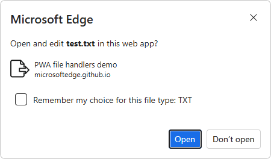

# Handle files in a PWA

A Progressive Web App (PWA) that can handle files feels more native to users and better integrated in the operating system.

Websites can already let users upload files by [using the `<input type="file">` or drag and drop](https://developer.mozilla.org/docs/Web/API/File/Using_files_from_web_applications), but PWAs go one step further and can register as file handlers on the operating system.

When a PWA is registered as a file handler for certain file types, the operating system can automatically launch the app when those files are opened by the user, similar to how Microsoft Word handles `.docx` files.

<!-- ====================================================================== -->
## Define which files your app handles

The first thing to do is to declare which types of files your app handles. This is done in your app manifest file, by using the `file_handlers` array member.  Each entry in the `file_handlers` array needs to have two properties:

*  `action`: The URL the operating system should navigate to when launching your PWA.
*  `accept`: An object of accepted file types. Keys are MIME-types (partial types, using the wildcard symbol `*`, are accepted), and values are arrays of accepted file extensions.

Consider the following example:

```json
{
    "file_handlers": [
        {
            "action": "/openFile",
            "accept": {
                "text/*": [
                    ".txt"
                ]
            }
        }
    ]
}
```

In this example, the app registers a single file handler for that accepts text files. When a `.txt` file is opened by the user by, for example, double-clicking its icon on the desktop, then the operating system launches the app using the `/openFile` URL.

See also:
* [Associate files with your PWA](https://developer.mozilla.org/docs/Web/Progressive_web_apps/How_to/Associate_files_with_your_PWA) at MDN > References > Progressive web apps.
* [file_handlers](https://developer.mozilla.org/docs/Web/Manifest/file_handlers) at MDN > References > Web app manifests.


<!-- ====================================================================== -->
## Detect whether the File Handling API is available

Before handling the files, your app needs to check whether the File Handling API is available on the device and browser.

To check whether the File Handling API is available, test whether the `launchQueue` object exists, as follows:

```javascript
if ('launchQueue' in window) {
    console.log('File Handling API is supported!');
} else {
    console.error('File Handling API is not supported!');
}
```


<!-- ====================================================================== -->
## Handle files on launch

When your app is launched by the OS after a file was opened, you can use the `launchQueue` object to access the file content.

Use the following JavaScript code to process the text content:

```javascript
if ('launchQueue' in window) {
    console.log('File Handling API is supported!');

    launchQueue.setConsumer(launchParams => {
        handleFiles(launchParams.files);
    });
} else {
    console.error('File Handling API is not supported!');
}

async function handleFiles(files) {
    for (const file of files) {
        const blob = await file.getFile();
        blob.handle = file;
        const text = await blob.text();

        console.log(`${file.name} handled, content: ${text}`);
    }
}
```

The `launchQueue` object queues all the launched files until a consumer is set with `setConsumer`. To learn more about the `launchQueue` and `launchParams` objects, go to the [File Handling explainer](https://github.com/WICG/file-handling/blob/main/explainer.md#launch).


<!-- ====================================================================== -->
## PWA file handlers demo app

The **PWA file handlers** demo app:


* [/pwa-file-handlers/](https://github.com/MicrosoftEdge/Demos/tree/main/pwa-file-handlers/) - Readme and source code.
* [PWA file handlers demo](https://microsoftedge.github.io/Demos/pwa-file-handlers/) - live demo.


To use the demo:

1. Go to the [PWA file handlers demo](https://microsoftedge.github.io/Demos/pwa-file-handlers/) in a new window or tab.


   **Install the demo app:**

1. In the Address bar, click the **App available. Install PWA file handlers demo** () button.

   The **Install PWA file handlers demo app** dialog opens in Edge.

1. Click the **Install** button.

   The **PWA file handlers demo** app window opens.  The **App installed** dialog opens.

1. Click the **Allow** button.

   The Windows **Apps** dialog prompts you whether to pin the demo to the taskbar.

1. Click the **Yes** button.

1. Close the **PWA file handlers demo** app.


   **Create a text file:**

   If you have an existing text file, you can use it.  In the following steps, we'll use Visual Studio Code to create a text file named `test.txt` in the `Documents` folder.

1. Open Visual Studio Code.

1. Click the **File** menu, and then click **New Text File**.

1. Add text in the file, such as:

   ```
   Lorem ipsum dolor sit amet, consectetur adipiscing elit, sed do eiusmod tempor incididunt ut labore et dolore magna aliqua. Ut enim ad minim veniam, quis nostrud exercitation ullamco laboris nisi ut aliquip ex ea commodo consequat.

   * Duis aute irure dolor in reprehenderit in voluptate velit esse cillum dolore eu fugiat nulla pariatur. 

   * Excepteur sint occaecat cupidatat non proident, sunt in culpa qui officia deserunt mollit anim id est laborum.

   ```

1. Click the **File** menu, and then click **Save**.

   The **Save As** dialog opens.

1. Navigate to a directory such as `C:\Users\localAccount\Documents\`.

1. In the **File name** combo box, type `test`.

1. In the **Save as type** combo box, select **Plain text (*.txt)**.

1. Click the **Save** button.

   The dialog closes.

1. On the **test.txt** tab, click the **Close** () button.


   **Open the text file and specify the Open With app:**

1. In the Windows Taskbar, click the **Start** button, type **File Explorer**, and then click **Open**.

   **File Explorer** opens.

1. Navigate to the directory that contains the text file, such as `C:\Users\localAccount\Documents\`.

1. Right-click the text file (such as `test.txt`), and then select **Open with** > **PWA file handlers demo**.

   Or, double-click the text file.

   A **Microsoft Edge** dialog opens, asking whether to open and edit the text file in this web app:

   

1. Click the **Open** button.

   The **PWA file handlers demo** app opens, displaying the `.txt` file name and the file's text content:

   
