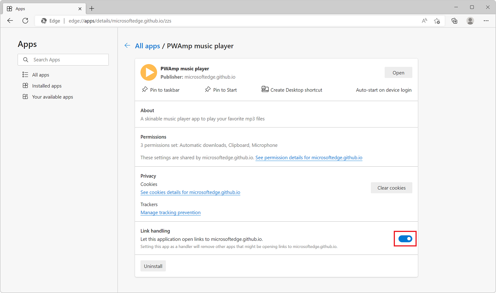

# Handle links to a PWA

A Progressive Web App (PWA) on the device's operating system can handle links, so that when an associated URL is activated, the PWA can request to be launched instead of the web browser, to create a more engaging experience.

This link handling is like how native apps handle links on many operating systems.

<!--
link handling vs. url handling:
Although the present file name is handle-urls.md, this file was repurposed to cover link handling rather than URL handlers.
The PWA URL handlers feature was removed from Chromium.
See also [PWAs as URL Handlers](https://web.dev/pwa-url-handler/).
-->


<!-- ====================================================================== -->
## Automatic link handling

The operating system that your PWA is installed on automatically launches your PWA for any link that refers to content that's within the scope of the PWA, when either of the following conditions are met:

* The PWA was installed from the Microsoft Store on Windows.
* The PWA was installed by using Microsoft Edge, and Microsoft Edge is the default browser on the device.

No code is required for automatic link handling to work, but end users can opt-out of automatic link handling. To opt-out of automatic link handling:

1. In Microsoft Edge, navigate to `edge://apps`.

1. Find the PWA you want to disable automatic link handling for and click **Details**.

1. On the PWA details page, under the **Link handling** section, click the toggle button.




<!-- ====================================================================== -->
## Handle links from other origins by using scope extensions

Scope extensions make it possible for a Progressive Web App (PWA) to capture navigation to domains, subdomains, or paths other than its own scope.  Scope extensions allow web apps that rely on multiple top-level domains, multiple subdomains, or multiple paths to be presented as a single web app.

Scope extension can be useful for localization purposes, for a PWA that spans multiple domains, subdomains, or paths.


<!-- ------------------------------ -->
#### PWA scope when not using scope extensions

The manifest of a PWA defines which part of the hosting domain, such as a specific path, the PWA is scoped to.  For example, the `www.contoso.com` domain name may have a PWA defined under the path `www.contoso.com/app`, with its scope set to `/app`.

In that case, all webpages within the `www.contoso.com/app` path are part of the PWA scope.  However, if you don't use scope extensions:

* Webpages at a different domain, such as `www.contoso.co.uk`, are not part of that PWA scope.
* Webpages at a different subdomain, such as `bar.contoso.com/app`, are not part of that PWA scope.
* Webpages at a different path, such as `www.contoso.com/foo`, are not part of the PWA scope.


<!-- ------------------------------ -->
#### Extending scope to other domains

By using scope extensions, a PWA may span all of the following top-level domains:
* `contoso.com`
* `contoso.co.uk`
* `contoso.fr`


<!-- ------------------------------ -->
#### Extending scope to other subdomains

By using scope extensions, a PWA may span all of the following subdomains:
* `www.contoso.com`
* `bar.contoso.com`
* `www.contoso.co.uk`


<!-- ------------------------------ -->
#### Extending scope to other paths

By using scope extensions, a PWA may span all of the following paths:
* `www.contoso.com/app`
* `www.contoso.com/foo`


<!-- ------------------------------ -->
#### The `scope_extensions` web app manifest member

The `scope_extensions` web app manifest member enables a web app to extend its scope to other origins.  For example, this web app manifest file resides at `sample-app.com`, and extends the scope to a different origin, `example.com`:

```json
{
  "name": "Example app",
  "display": "standalone",
  "start_url": "/index.html",
  "scope_extensions": [
    {
      "type": "type",
      "origin": "https://example.com"
    }
  ]
}
```

The origins that are listed in the `scope_extensions` member must confirm that they are associated with the web app by hosting a configuration file named `.well-known/web-app-origin-association`.  The configuration file must list the web app's origin.

For example, this `.well-known/web-app-origin-association` configuration file resides at `example.com`, and lists the web app's origin as `sample-app.com`:

```json
{
  "https://sample-app.com/": {
    "scope": "/"
  }
}
```


<!-- ====================================================================== -->
## See also

* [PWAs as URL Handlers](https://web.dev/pwa-url-handler/)
