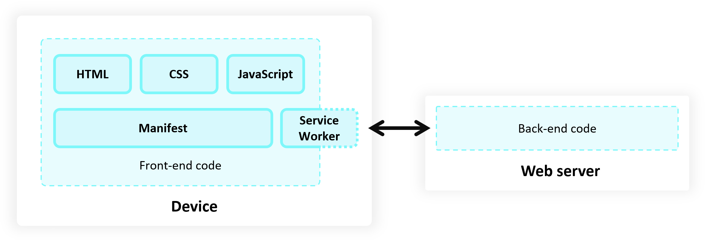

# Get started developing a PWA

A Progressive Web App (PWA) is an app that you build by using web technologies such as HTML, CSS, and JavaScript, and that can also be installed and run on various device operating systems, from a single codebase.

By using this article along with the Temperature converter sample, which is made for learning how to build a PWA, you'll be able to:

* Customize the Temperature converter PWA by making minor modifications of the sample's code.

* Create your own PWA by copying and pasting the entire sample directory and extensively modifying the code.

See also:
* [Temperature converter sample](../samples/temperature-converter.md)


<!-- ====================================================================== -->
## The architecture of a Progressive Web App
<!-- https://learn.microsoft.com/microsoft-edge/progressive-web-apps/how-to/#the-architecture-of-a-pwa -->

The following diagram shows the high-level architecture of a Progressive Web App (PWA):



On the left, the device that runs the front-end of the PWA has the files for the front-end code of a PWA.

On the right, the web server runs the back-end code (or database content) of a PWA.

The device contains the front-end code, including HTML, CSS, JavaScript, the service worker, and the manifest.  This is true regardless of whether the Progressive Web App (PWA) is used as a web app in the browser, or as a local app that's installed on the device.

Like a regular web app, a Progressive Web App is written using the programming languages of the web: HTML, CSS, and JavaScript, and is distributed to your users by using a web server.  If the web app is a Progressive Web App, the user initially sees the web app within a web browser, and the Address bar also has an **App available** button that prompts the user to install the app locally.


<!-- ====================================================================== -->
## Deploying a PWA on a production web server

To make a Progressive Web App (PWA) available to users, you deploy the Progressive Web App (PWA) on a web server that's accessible via HTTPS (unlike a local development environment).  The web server sends the front-end code to users, and runs the back-end code for the web app.

Some parts of the Progressive Web Apps (PWAs) platform, such as service workers, require using HTTPS.

If the Progressive Web App (PWA) has no backend code, the Progressive Web App (PWA) can be served out from a static web server.  For example, the [Temperature converter](https://microsoftedge.github.io/Demos/temperature-converter/) at `https://microsoftedge.github.io/Demos/temperature-converter/` uses the github.io static server from GitHub.

The article [Temperature converter sample](../samples/temperature-converter.md) has you run and test the sample Progressive Web App on your local server.  When your own Progressive Web App has been tested and is ready to distribute, you distribute the tested PWA to your users via a web server (a web hosting provider).

To update your Progressive Web App, you deploy the new version to your web server again.


<!-- ------------------------------ -->
#### Example web server hosts

When your Progressive Web App (PWA) goes live, you must publish it to an HTTPS URL.  Many hosts use HTTPS by default, but if your host doesn't offer HTTPS, [Let's Encrypt](https://letsencrypt.org/) offers a free alternative for creating the necessary certificates.

For example, you can create an [Azure free account](https://azure.microsoft.com/free).  If you host your website on the [Microsoft Azure App Service](https://azure.microsoft.com/services/app-service/web), it's served over HTTPS by default.

You can also host your website on GitHub Pages (`pages.github.com`), which supports HTTPS.  See [GitHub Pages documentation](https://docs.github.com/pages).


<!-- ------------------------------ -->
#### About localhost (http) vs. production server (https)

When using a local development web server at the `localhost` address, the URL usually begins with `http`, not `https`.  Key parts of the Progressive Web Apps platform, such as service workers, require using HTTPS, not HTTP.

For development and debugging purposes, Microsoft Edge (or a window hosting a PWA local app) permits the `localhost` address to run the Progressive Web App (PWA) APIs without HTTPS.


<!-- ====================================================================== -->
## Front-end code files (UI code)

A Progressive Web App (PWA) has front-end code files that are sent by the web server to the browser on the local device.

Front-end code is the resources needed for the app to be installed on the user's device, such as HTML, CSS, and JavaScript code.

A Progressive Web App (PWA) typically includes the following front-end code files:

* An HTML file to describe the content in your app, such as the text, images, text fields, or buttons that appear in the user interface.

* A CSS file to organize the HTML content in a layout, and provide styles to elements.

* A JavaScript file to add user interactions to your user interface.

* A JSON manifest file to describe your app to the host operating system.

* A JavaScript service worker file to cache the app's front-end code files and run background tasks.

The front-end code for a Progressive Web App (PWA) runs by using the device's web browser.  The browser's own UI is not visible when the app is run in a standalone window, which is a streamlined browser window with minimal browser UI controls.


<!-- ====================================================================== -->
## Back-end code, files, endpoints, and data (server-side code)

A Progressive Web App (PWA) potentially has back-end code that resides and runs on the web server.

Like a web app, a Progressive Web App can include some _back-end code_ (_server-side code_) that implements any web service API endpoints that are needed by your app, when connected to the internet, to retrieve dynamic content that may be stored in a database on your server.

The back-end code for a Progressive Web App can use the server-side languages of your choice, such as:
* ASP.NET
* Java
* Node.js
* PHP

Server-side web service API endpoints might not be required, depending on the app your're building.

The [Temperature converter sample](../samples/temperature-converter.md) PWA doesn't have any server-side code, because the app exclusively runs on the device it's installed on, and doesn't need any server-side data.

The remaining sections explain the files that make up the PWA sample.


<!-- ====================================================================== -->
## The web app manifest (`manifest.json`)
<!-- a modified version of this section is in /how-to/index.md & /samples/temperature-converter.md -->

A regular web app only runs in the browser.  By adding a web app manifest, the web app becomes a Progressive Web App (PWA).  The web app manifest enables browsers that support PWAs to install the web app as a Progressive Web App on the device.

A _web app manifest_ is a JSON file containing metadata about the Progressive Web App, such as its name, description, icons, and the various operating system features it uses.  The JSON code describes the app to the host operating system.  The manifest file provides basic information about the Progressive Web App, for the device's operating system to use.  

The file name `manifest.json` is a common convention, not a strict requirement.

Example `manifest.json`:

```json
{
  "lang": "en-us",
  "name": "Temperature converter app",
  "short_name": "Temperature converter",
  "description": "A basic temperature converter application that can convert to and from Celsius, Kelvin, and Fahrenheit",
  "start_url": "./",
  "background_color": "#2f3d58",
  "theme_color": "#2f3d58",
  "orientation": "any",
  "display": "standalone",
  "icons": [
      {
          "src": "./icon512.png",
          "sizes": "512x512"
      }
  ]
}
```

See also:
* [The web app manifest](https://developer.mozilla.org/docs/Web/Progressive_web_apps/Guides/Making_PWAs_installable#the_web_app_manifest) in _Making PWAs installable_ at MDN.
* [Web app manifests](https://developer.mozilla.org/docs/Web/Manifest) at MDN.


<!-- ====================================================================== -->
## The service worker to cache the app's files on the local device (`sw.js`)
<!-- a modified version of this section is in /how-to/index.md & /samples/temperature-converter.md -->

A Progressive Web App (PWA) can use a service worker JavaScript file (such as `sw.js`), to cache front-end, UI files to the local device.  A service worker is defined in a dedicated JavaScript file that's loaded by the app (distinct from the main `.js` file containing app logic).

A service worker is a specialized web worker that can intercept network requests from your Progressive Web App.  The service worker enables scenarios such as:
* Offline support, including intermittent connection to the internet.
* Advanced caching on the device.
* Running background tasks such as receiving PUSH messages, adding badges to the app icon, or fetching data from a server.

A service worker is a key technology that help make a Progressive Web App fast and independent of network conditions.  The service worker makes the app:
* Faster.
* More reliable.
* Network-independent; the app continues to work (in some way), even with a missing or intermittent internet connection.

This sample [sw.js](https://github.com/MicrosoftEdge/Demos/blob/main/temperature-converter/sw.js) file is a service worker that manages caching files that are part of the Temperature converter PWA, caching the files to the local drive and serving them out when there's no internet connection.

`sw.js`:

```javascript
const CACHE_NAME = `temperature-converter-v1`;
    
// Use the install event to pre-cache all initial resources.
self.addEventListener('install', event => {
  event.waitUntil((async () => {
    const cache = await caches.open(CACHE_NAME);
    cache.addAll([
      './',
      './converter.js',
      './converter.css'
    ]);
  })());
});

self.addEventListener('fetch', event => {
  event.respondWith((async () => {
    const cache = await caches.open(CACHE_NAME);

    // Get the resource from the cache.
    const cachedResponse = await cache.match(event.request);
    if (cachedResponse) {
      return cachedResponse;
    } else {
        try {
          // If the resource was not in the cache, try the network.
          const fetchResponse = await fetch(event.request);
    
          // Save the resource in the cache and return it.
          cache.put(event.request, fetchResponse.clone());
          return fetchResponse;
        } catch (e) {
          // The network failed
        }
    }
  })());
});
```

This service worker explicitly caches three files:
* `./` means `index.html`
*  `./converter.js`
* `./converter.css`

Two additional files are are cached automatically by the browser: 
* The icon file (`.png`).
* The manifest file (`.json`).


<!-- ------------------------------ -->
#### Listening for the `install` event

The service worker listens to the `install` event, which is triggered when the user installs the app, and uses it to cache the resources that your app needs to function offline, such as:
* The initial HTML page.
* The app's main JavaScript file that contains the app logic.
* The app's CSS file.

To enable installing the app, a JavaScript service worker file makes the app able to work offline (without always having an internet connection), by caching needed front-end files on the local device.


<!-- ------------------------------ -->
#### Listening for the `fetch` event

The service worker intercepts `fetch` events, which happen every time your app sends a request to the server, and applies a cache-first strategy.

The service worker returns cached resources so your app can work offline, and if that fails, the service worker attempts to download the file from the server instead.


<!-- ------------------------------ -->
#### A service worker is optional

A Progressive Web App (PWA) doesn't need to have a service worker for Microsoft Edge to be able to install the app.  However, we recommend including a service worker in your own Progressive Web App to make it faster, and to make the app more reliable, such as when your device has an intermittent network connection or is offline.


See also:
* [Step 9: Examine the service worker handling offline caching](../samples/temperature-converter.md#step-9-examine-the-service-worker-handling-offline-caching) in _Temperature converter sample_.
* [Service Worker API](https://developer.mozilla.org/docs/Web/API/Service_Worker_API) at MDN.


<!-- ====================================================================== -->
## Next steps

Do the steps in [Temperature converter sample](../samples/temperature-converter.md).  Then to create your own Progressive Web App (PWA), you can copy, paste, and modify the `Demos\temperature-converter` directory.  The temperature converter sample demonstrates only a small sample of what Progressive Web Apps (PWAs) can do.  The sample demonstrates code that's important for any Progressive Web App (PWA), such as working when there's no internet connection.

There are additional [Best practices for PWAs](./best-practices.md) to make a Progressive Web App (PWA) feel like a native app:

* Integrate the app into the operating system, such as by handling files.

* Perform nontrivial computing tasks.

* Upload the app to app stores.


<!-- ====================================================================== -->
## See also
<!-- all links in article -->

<!-- Local: in toc order -->
* [Use PWAs in Microsoft Edge](../ux.md)
   * [Installing a PWA](../ux.md#installing-a-pwa) in _Use PWAs in Microsoft Edge_.
* [Temperature converter sample](../samples/temperature-converter.md)
   * [Step 9: Examine the service worker handling offline caching](../samples/temperature-converter.md#step-9-examine-the-service-worker-handling-offline-caching) in _Temperature converter sample_.
* [Best practices for PWAs](./best-practices.md)

MDN:
* [The web app manifest](https://developer.mozilla.org/docs/Web/Progressive_web_apps/Guides/Making_PWAs_installable#the_web_app_manifest) in _Making PWAs installable_ at MDN.
* [Web app manifests](https://developer.mozilla.org/docs/Web/Manifest) at MDN.
* [Service Worker API](https://developer.mozilla.org/docs/Web/API/Service_Worker_API) at MDN.

Hosting:
* [GitHub Pages documentation](https://docs.github.com/pages)
* [Microsoft Azure App Service](https://azure.microsoft.com/services/app-service/web)
   * [Azure free account](https://azure.microsoft.com/free)
* [Let's Encrypt](https://letsencrypt.org)

Sample:
* [Temperature converter](https://microsoftedge.github.io/Demos/temperature-converter/) - live demo.
   * [sw.js](https://github.com/MicrosoftEdge/Demos/blob/main/temperature-converter/sw.js) - source file.
