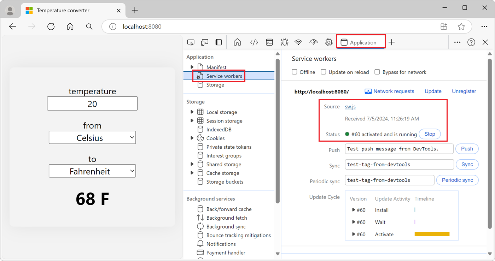

# Temperature convertor sample

The Temperature Convertor sample is a Progressive Web App (PWA).

This article covers how to obtain the sample, install it on Windows<!-- per https://github.com/MicrosoftDocs/edge-developer/issues/1974 -->, and run the sample.


<!-- ====================================================================== -->
## Preview the sample

To examine the user interface of the app:

1. On Windows, in Microsoft Edge, go to the [Temperature converter](https://microsoftedge.github.io/Demos/pwa-getting-started/) live sample web app in a new window or tab.

   This instance of the sample app is hosted at github.io.  The sections below use your own, localhost server, instead, to show how to locally test a PWA.  Your own, actual PWA, after testing it, would be hosted at your web server that your users can access.

1. In the **temperature** text box, type **22**.

   As you type, the displayed temperature is updated to **71.6 F**.

1. Click the **from** and **to** dropdown lists.

   Available units are:
   * **Celsius**
   * **Fahrenheit**
   * **Kelvin**

1. Go to [Temperature converter - PWA getting started demo app](https://github.com/MicrosoftEdge/Demos/tree/main/pwa-getting-started) in a new window or tab, and briefly inspect the source code files.

   The sample consists of the following files:
   * `README.md` - brief information about the app: a link to open the app webpage, and a link to the present article.
   * `converter.css` - styling for the webpage of the app.
   * `converter.js` - app logic.
   * `icon512.png` - image file to represent the app.
   * `index.html` - webpage layout of the app.
   * `manifest.json` - basic information about the app, for the device's operating system to use.
   * `sw.js` - service worker.

These code in these files is explained later, in [How the sample code works](#how-the-sample-code-works), below.

Follow the steps in the next sections to obtain a local copy of the code and install and run the sample on your local server.


<!-- ====================================================================== -->
## Install Visual Studio Code

Visual Studio Code enables modifying the sample, or copying the sample and modifying it to create your own PWA.

Start or install Visual Studio Code, as follows:

1. Press the **Windows** key, enter **Visual Studio Code**, and then click **Open**.

1. If Visual Studio Code isn't installed, go to [Visual Studio Code](https://code.visualstudio.com) and then download and install it.

Continue with the next section.


<!-- ====================================================================== -->
## Install or update Node.js

Node.js includes a web server that you'll use to run and test the sample locally.

Install or update Node.js as follows:

<!-- todo: use Windows Command Prompt, not PowerShell, not git bash - or maybe Terminal within VS Code -->

1. Press the **Windows** key, type **PowerShell**, and then for Windows PowerShell, click **Run as Administrator**.

   Windows PowerShell command prompt opens.

1. Enter the command: `node -v`

   If Node.js has been installed, a version number is output, such as v22.14.0.

1. Go to [Node.js](https://nodejs.org).

   Note the version number in the lower left **Latest LTS** button, such as v22.20.0.

1. Click the **Get Node.js** button.

   You end up at a page such as [Download Node.js](https://nodejs.org/download).

1. Click the **Windows Installer (.msi)** button.

   The **Downloads** window of Microsoft Edge opens, and displays a file name such as `node-v22.20.0-x64.msi`.

1. Click the **open file** link under the file name.

   The **Node.js Setup Wizard** window opens.

1. Click the **Next** button, and follow the prompts.  You can accept the defaults, then click the **Install** button.

1. Follow the prompts.

   The **Node.js Setup Wizard** window closes.

1. In PowerShell, enter the command: `node -v`

   The latest version number is displayed, such as v22.20.0.

Continue with the next section.


<!-- ====================================================================== -->
## Clone the Edge Demos repo to your drive
<!-- derived from 
https://learn.microsoft.com/microsoft-edge/devtools/sample-code/sample-code#clone-the-edge-demos-repo-to-your-drive
-->

Clone the **MicrosoftEdge / Demos** repo to your local drive, as follows:

1. See whether the repo is already cloned to your local drive: 

1. Press **Windows+E**.

   File Explorer opens.

1. Navigate to where you want the repo cloned to, such as:

   `C:\Users\localAccount\GitHub`

1. See whether the `\Demos\` repo is listed.

1. In PowerShell that's opened using **Run as Administrator**, enter `git`.

   If git has been installed, usage instructions are displayed.

1. If git is not installed, go to [Download git](https://git-scm.com/downloads) and install it.

1. Go to [MicrosoftEdge / Demos](https://github.com/MicrosoftEdge/Demos) in a new window or tab.

1. Click the **Code** drop-down button, and then click the **Copy url to clipboard** button.

   The URL is copied to the clipboard: `https://github.com/MicrosoftEdge/Demos.git`

1. In PowerShell, change to the directory where you want to clone the Demos repo:

   ```console
   cd ~/GitHub
   cd c:/users/localAccount/GitHub/  # alt format
   ```

1. Enter `git clone` followed by the copied URL for the Demos repo, and then press **Enter**:

   ```console
   git clone https://github.com/MicrosoftEdge/Demos.git
   ```

1. In File Explorer, go to the new, `/Demos/` repo directory, such as:

   `C:\Users\localAccount\GitHub\Demos`

1. In File Explorer, open the `/Demos/pwa-getting-started/` directory.

   Files are listed, such as `converter.js`.

See also:
* [Cloning a repository](https://docs.github.com/en/repositories/creating-and-managing-repositories/cloning-a-repository) - GitHub docs.

Continue with the next section.


<!-- ====================================================================== -->
## Start the localhost server

While developing or testing a PWA, you use a local web server.  `http-server` is a local web server that's included with the Node.js library.

Change to the `/pwa-getting-started/` directory of the cloned Demos repo, and start the `http-server` from there, as follows:

1. In PowerShell that's opened using **Run as Administrator**, change to the directory where you want to clone the Demos repo:

   ```console
   cd Demos
   cd pwa-getting-started
   ```

   You're now in a directory such as `C:\users\localAccount\GitHub\Demos\pwa-getting-started`.

1. In PowerShell, enter the following command:

   ```console
   npx http-server
   ```

1. If you get the message "File C:\Program Files\nodejs\npx.ps1 cannot be loaded because running scripts is disabled on this system", you can run a command such as:

   ```console
   Set-ExecutionPolicy -ExecutionPolicy Bypass -Scope CurrentUser
   ```

  For details, see [about_Execution_Policies](https://learn.microsoft.com/en-us/powershell/module/microsoft.powershell.core/about/about_execution_policies?view=powershell-7.5) in the PowerShell docs.

  Then again enter the command:

   ```console
   npx http-server
   ```

   Output is displayed, such as:

   ```console
   Starting up http-server, serving ./
   Available on:
     http://10.0.1.12:8080
     http://127.0.0.1:8080
   ```

1. In Microsoft Edge, go to: `http://localhost:8080`

   The URL starts with http, not https.  Key parts of the Progressive Web Apps platform, such as service workers, require using HTTPS.  For debugging purposes, Microsoft Edge permits a `localhost` web server to use the PWA APIs without HTTPS.

Continue with the next section.


<!-- ====================================================================== -->
## Install the sample

Install the sample on Windows<!-- per https://github.com/MicrosoftDocs/edge-developer/issues/1974 -->, as follows:

1. In the Address bar, click the **App available. Install temperature convertor app** () button.

   An **Install app** dialog opens:

   

   The sample's web app manifest enables the browser to install the app as a PWA.  The **App available** button installs the app locally.

1. Click the **Install** button.

   The app is installed locally.  The **App installed** dialog opens within the app:

   

1. In the **App installed** dialog, click the **Allow** button, and then click the **Close** (X) button.

   The app is displayed within its own app window:

   

   The app's icon is displayed in the Windows taskbar:

   

1. Close the standalone **Temperature converter app** window.

See also:
* [Installing a PWA](../ux.md#installing-a-pwa) in _Use PWAs in Microsoft Edge_.

Continue with the next section.


<!-- ====================================================================== -->
## Run the sample as a local app

1. Press the **Windows** key, start typing **Temperature convertor app**, and then click **Open**.

   The installed **Temperature converter app** opens.

1. In the **temperature** text box, type **22**.

   As you type, the displayed temperature is updated to **71.6 F**.

1. Click the **from** and **to** dropdown lists.

   Available units are:
   * **Celsius**
   * **Fahrenheit**
   * **Kelvin**

Continue with the next section.


<!-- ====================================================================== -->
## How the sample code works

The remaining sections of this article explain how the temperature convertor PWA sample works.

This PWA sample is built by using web technologies.  This sample, being a PWA, can be installed and run on all devices, from a single codebase.

The sample consists of the following files:

* `README.md` - brief information about the app: a link to open the app webpage, and a link to the present article.
* `converter.css` - styling for the webpage of the app.
* `converter.js` - app logic.
* `icon512.png` - image file to represent the app.
* `index.html` - webpage layout of the app.
* `manifest.json` - basic information about the app, for the device's operating system to use.
* `sw.js` - service worker.

These files are explained below.


<!-- ====================================================================== -->
## `README.md`

Brief information about the app: a link to open the app webpage, and a link to the present article.


<!-- ====================================================================== -->
## `converter.css`

Styling for the webpage of the app.

* `converter.css` uses CSS to organize the HTML content in a layout, and to provide styles for elements.


<!-- ====================================================================== -->
## `converter.js`

App logic.

* `converter.js` uses JavaScript to add user interactions to the user interface.


<!-- ====================================================================== -->
## `icon512.png`

image file to represent the app.

A 512x512 pixel app icon image named `icon512.png`.

You can use the [sample image](./index-images/icon512.png) for testing purposes.


<!-- ====================================================================== -->
## `index.html`

webpage layout of the app.

`index.html` uses HTML to describe the content in the app, including the text, images, text fields, and buttons that appear in the user interface.


<!-- ====================================================================== -->
## `manifest.json`

basic information about the app, for the device's operating system to use.

`manifest.json` uses JSON to describe the app to the host operating system.


<!-- ====================================================================== -->
## `sw.js`

A service worker.


<!-- ====================================================================== -->
## PWA architecture

Progressive Web Apps are written using the programming languages of the web: HTML, CSS, and JavaScript, and are distributed to your users by using web servers.

To make your app available to users, you deploy it on a web server that's accessible via HTTPS. Your server contains:

* **Back-end code**: the endpoints needed by your app, when connected to the internet, to retrieve dynamic content that may be stored in a database on your server.
* **Front-end code**: the resources needed for the app to be installed on the user's device, such as HTML, CSS, and JavaScript code.

Your back-end code can use the server-side languages of your choice such as ASP.NET, Java, Node.js, or PHP.  Server-side endpoints might not be required, depending on the app your're building.  This temperature convertor sample app doesn't have any server-side code, because the app exclusively runs on the device it's installed on, and doesn't need any server-side data.

The app's front-end code uses HTML, CSS, JavaScript, and a JSON manifest:

* `index.html` uses HTML to describe the content in the app, including the text, images, text fields, and buttons that appear in the user interface.

* `converter.css` uses CSS to organize the HTML content in a layout, and to provide styles for elements.

* `converter.js` uses JavaScript to add user interactions to the user interface.

* `manifest.json` uses JSON to describe the app to the host operating system.

Although your front-end code runs by using the device's web browser, the browser user interface might not be visible, because your app can choose to run in a standalone window.

On top of the user interface code, you can also use JavaScript to make the app faster, more reliable, and network-independent by using a service worker file. Finally, your front-end code also contains a JSON manifest file that describes your app to the host operating system.

The following diagram shows the high-level architecture of a PWA.  The web server is on one side of the PWA, and the device is on the other side. The device contains the front-end code, including HTML, CSS, JavaScript, the service worker, and the manifest:


<!-- ====================================================================== -->
## The app start page

`index.html` defines the layout of the temperature converter app, as a webpage:

```html
<!DOCTYPE html>
<html lang="en-US" dir="ltr">
  <head>
    <meta charset="UTF-8" />
    <meta name="viewport" content="width=device-width,initial-scale=1" />
    <link rel="icon" type="image/png" href="https://edgestatic.azureedge.net/welcome/static/favicon.png">
    <link rel="stylesheet" href="./converter.css">
    <link rel="manifest" href="./manifest.json">
    <title>Temperature converter</title>
  </head>
  <body>
    <form id="converter">
      <label for="input-temp">temperature</label>
      <input type="text" id="input-temp" name="input-temp" value="20" />
      <label for="input-unit">from</label>
      <select id="input-unit" name="input-unit">
        <option value="c" selected>Celsius</option>
        <option value="f">Fahrenheit</option>
        <option value="k">Kelvin</option>
      </select>
      <label for="output-unit">to</label>
      <select id="output-unit" name="output-unit">
        <option value="c">Celsius</option>
        <option value="f" selected>Fahrenheit</option>
        <option value="k">Kelvin</option>
      </select>
      <output name="output-temp" id="output-temp" for="input-temp input-unit output-unit">68 F</output>
    </form>
    <script src="./converter.js"></script>
    <script>
      if('serviceWorker' in navigator) {
        navigator.serviceWorker.register('./sw.js', { scope: './' });
      }
    </script>
  </body>
</html>
```


<!-- ====================================================================== -->
## The web app manifest

For the app to be installable, the app has a web app manifest.

A _web app manifest_ is a JSON file containing metadata about your app, such as its name, description, icons, and the various operating system features it uses.

See:
* [The web app manifest](https://developer.mozilla.org/docs/Web/Progressive_web_apps/Guides/Making_PWAs_installable#the_web_app_manifest) in _Making PWAs installable_ at MDN > References > Progressive web apps > Guides.
* [Web app manifests](https://developer.mozilla.org/docs/Web/Manifest) at MDN > References.

To add an app manifest to your app:

1.  In Visual Studio Code, press **Ctrl+N** to create a new file with the following content, and save the file as `manifest.json`.

    ```json
    {
      "lang": "en-us",
      "name": "Temperature converter app",
      "short_name": "Temperature converter",
      "description": "A basic temperature converter application that can convert to and from Celsius, Kelvin, and Fahrenheit",
      "start_url": "./",
      "background_color": "#2f3d58",
      "theme_color": "#2f3d58",
      "orientation": "any",
      "display": "standalone",
      "icons": [
          {
              "src": "./icon512.png",
              "sizes": "512x512"
          }
      ]
    }
    ```

1.  Add a 512x512 pixel app icon image named `icon512.png` to your project. You can use the [sample image](./index-images/icon512.png) for testing purposes.

1.  In Visual Studio Code, open `index.html`, and add the following code inside the `<head>` tag.

    ```html
    <link rel="manifest" href="/manifest.json">
    ```

   The above code snippet links the new web app manifest file to your website.

Your VS Code project should now look somewhat like this:


<!-- ====================================================================== -->
## The user interface

Now that your app has a web app manifest file, and a start page, it's time to build out the main app functionality.

In this step of the tutorial, we'll create a temperature unit conversion app.

1. To create the main user interface content, copy the following HTML code and paste it into the `index.html` file, replacing the `<h1>` HTML tag:

    ```html
    <form id="converter">
      <label for="input-temp">temperature</label>
      <input type="text" id="input-temp" name="input-temp" value="20" />
      <label for="input-unit">from</label>
      <select id="input-unit" name="input-unit">
        <option value="c" selected>Celsius</option>
        <option value="f">Fahrenheit</option>
        <option value="k">Kelvin</option>
      </select>
      <label for="output-unit">to</label>
      <select id="output-unit" name="output-unit">
        <option value="c">Celsius</option>
        <option value="f" selected>Fahrenheit</option>
        <option value="k">Kelvin</option>
      </select>
      <output name="output-temp" id="output-temp" for="input-temp input-unit output-unit">68 F</output>
    </form>
    ```

    The above HTML code contains a form with multiple input elements that your app will use to convert a temperature value from one unit to another unit.

1. To make the converter work, you use JavaScript code. Create a new file named `converter.js` in your project and add the following code to it:

    ```javascript
    const inputField = document.getElementById('input-temp');
    const fromUnitField = document.getElementById('input-unit');
    const toUnitField = document.getElementById('output-unit');
    const outputField = document.getElementById('output-temp');
    const form = document.getElementById('converter');
    
    function convertTemp(value, fromUnit, toUnit) {
      if (fromUnit === 'c') {
        if (toUnit === 'f') {
          return value * 9 / 5 + 32;
        } else if (toUnit === 'k') {
          return value + 273.15;
        }
        return value;
      }
      if (fromUnit === 'f') {
        if (toUnit === 'c') {
          return (value - 32) * 5 / 9;
        } else if (toUnit === 'k') {
          return (value + 459.67) * 5 / 9;
        }
        return value;
      }
      if (fromUnit === 'k') {
        if (toUnit === 'c') {
          return value - 273.15;
        } else if (toUnit === 'f') {
          return value * 9 / 5 - 459.67;
        }
        return value;
      }
      throw new Error('Invalid unit');
    }
    
    form.addEventListener('input', () => {
      const inputTemp = parseFloat(inputField.value);
      const fromUnit = fromUnitField.value;
      const toUnit = toUnitField.value;
    
      const outputTemp = convertTemp(inputTemp, fromUnit, toUnit);
      outputField.value = (Math.round(outputTemp * 100) / 100) + ' ' + toUnit.toUpperCase();
    });
    ```

1. Open the `index.html` file again and add the following code after the closing `</form>` tag, to load the JavaScript file:

    ```html
    <script src="converter.js"></script>
    ```

1. Now add some CSS style to the app, to make it more visually appealing. Create a new file called `converter.css` in your project and add the following code to it:

    ```css
    html {
      background: rgb(243, 243, 243);
      font-family: system-ui, -apple-system, BlinkMacSystemFont, 'Segoe UI', Roboto, Oxygen, Ubuntu, Cantarell, 'Open Sans', 'Helvetica Neue', sans-serif;
      font-size: 15pt;
    }
    
    html, body {
      height: 100%;
      margin: 0;
    }
    
    body {
      display: grid;
      place-items: center;
    }
    
    #converter {
      width: 15rem;
      padding: 2rem;
      border-radius: .5rem;
      box-shadow: 0 0 2rem 0 #0001;
      display: flex;
      flex-direction: column;
      align-items: center;
    }
    
    #converter input, #converter select {
      font-family: inherit;
      font-size: inherit;
      margin-block-end: 1rem;
      text-align: center;
      width: 10rem;
    }
    
    #converter #output-temp {
      font-size: 2rem;
      font-weight: bold;
    }
    ```

1. Open `index.html` again and reference the new CSS file in it by adding the following code inside the `<head>` tag:

    ```html
    <link rel="stylesheet" href="converter.css">
    ```

    Your Visual Studio Code project should now look something like this:

    

1. Go to `http://localhost:8080` to view your app:

    

Your app does something useful now, and it can be installed as a standalone app by users.  Before installing the app, create a service worker to make the app work offline.


<!-- ====================================================================== -->
## The service worker

Service workers are a key technology that help make PWAs fast and independent of network conditions.

A service worker is a specialized web worker that can intercept network requests from your PWA, and enables scenarios such as:
*  Offline support, including intermittent connections.
*  Advanced caching.
*  Running background tasks such as receiving PUSH messages, adding badges to the app icon, or fetching data from a server.

See [Service Worker API](https://developer.mozilla.org/docs/Web/API/Service_Worker_API) at MDN.

A PWA doesn't need to have a service worker for Microsoft Edge to be able to install the app.  However, we recommend adding a service worker to your PWA to make it faster, and to make your PWA more reliable, such as when your device has an intermittent network connection or is offline.

A service worker is defined in a JavaScript file that's loaded by your app. To add a service worker to your project:

1. In Visual Studio Code, create a new file (**Ctrl+N**), add the following content, and save the file as `sw.js`:

    ```javascript
    const CACHE_NAME = `temperature-converter-v1`;
    
    // Use the install event to pre-cache all initial resources.
    self.addEventListener('install', event => {
      event.waitUntil((async () => {
        const cache = await caches.open(CACHE_NAME);
        cache.addAll([
          '/',
          '/converter.js',
          '/converter.css'
        ]);
      })());
    });
    
    self.addEventListener('fetch', event => {
      event.respondWith((async () => {
        const cache = await caches.open(CACHE_NAME);
    
        // Get the resource from the cache.
        const cachedResponse = await cache.match(event.request);
        if (cachedResponse) {
          return cachedResponse;
        } else {
            try {
              // If the resource was not in the cache, try the network.
              const fetchResponse = await fetch(event.request);
        
              // Save the resource in the cache and return it.
              cache.put(event.request, fetchResponse.clone());
              return fetchResponse;
            } catch (e) {
              // The network failed.
            }
        }
      })());
    });
    ```

    The `sw.js` file will act as your PWA's service worker. The code above listens to the `install` event, which is triggered when the user installs your app, and uses it to cache the resources that your app needs to function offline, such as the initial HTML page, the converter JavaScript file, and the converter CSS file.

    The code also intercepts `fetch` events, which happen every time your app sends a request to the server, and applies a cache-first strategy. The service worker returns cached resources so your app can work offline, and if that fails attempts to download from the server.

1.  Open `index.html` and add the following code at the end of the `<body>` tag to register your service worker:

    ```html
    <script>
    if('serviceWorker' in navigator) {
      navigator.serviceWorker.register('/sw.js', { scope: '/' });
    }
    </script>
    ```

To confirm that your service worker is running:

1. In Microsoft Edge, go to `http://localhost:8080`.

1. To open DevTools, right-click the webpage, and then select **Inspect**.  Or, press **Ctrl+Shift+I** (Windows, Linux) or **Command+Option+I** (macOS).  DevTools opens.

1. Open the **Application** tool, and then click **Service workers**.  If the service worker isn't displayed, refresh the page.

    

1.  View the service worker cache by expanding **Cache Storage** and selecting **temperature-converter-v1**.  All of the resources cached by the service worker should be displayed.  The resources cached by the service worker include the app icon, app manifest, and the initial page.

    

1.  Try your PWA as an offline app. In DevTools, open the **Network** tool, and change the **Throttling** value to **Offline**.

1.  Refresh your app. It should still appear correctly in the browser, using cached resources served by the service worker.

    


<!-- ====================================================================== -->
## Uninstall the sample


<!-- ====================================================================== -->
## Next steps

To modify the sample, you can change to a different branch of the Demos repo.

To create your own PWA, you can copy, paste, and modify the `Demos\pwa-getting-started` directory.


The above steps show how to run and test the sample PWA on your local server.  When your own PWA app has been tested and is ready to distribute, you distribute the tested PWA to your users via a web server (a web hosting provider).

After that, to update your PWA, you deploy the new version to your web server again.


<!-- ------------------------------ -->
#### Hosting a PWA on a web server
<!-- informational beyond the sample, out of scope? -->

Key parts of the Progressive Web Apps platform, such as service workers, require using HTTPS.  For debugging purposes, Microsoft Edge permits a `localhost` web server to use the PWA APIs without HTTPS.

When your PWA goes live, you must publish it to an HTTPS URL.  Many hosts use HTTPS by default, but if your host doesn't offer HTTPS, [Let's Encrypt](https://letsencrypt.org/) offers a free alternative for creating the necessary certificates.

For example, you can create an [Azure free account](https://azure.microsoft.com/free).  If you host your website on the [Microsoft Azure App Service](https://azure.microsoft.com/services/app-service/web), it's served over HTTPS by default.

You can also host your website on [GitHub Pages](https://pages.github.com/) which supports HTTPS too.


<!-- ====================================================================== -->
## See also
<!-- all links in article -->

<!-- Local: -->
* [Overview of Progressive Web Apps (PWAs)](../index.md)
* [Use PWAs in Microsoft Edge](../ux.md)
* [Installing a PWA](../ux.md#installing-a-pwa) in _Use PWAs in Microsoft Edge_.
* [Best practices for PWAs](./best-practices.md)

Demos repo:
* [Temperature converter](https://microsoftedge.github.io/Demos/pwa-getting-started/) - sample app hosted at github.io (rather than localhost).
* [Temperature converter - PWA getting started demo app](https://github.com/MicrosoftEdge/Demos/tree/main/pwa-getting-started) - source code.

MDN:
* [Web app manifests](https://developer.mozilla.org/docs/Web/Manifest) at MDN.
* [Service Worker API](https://developer.mozilla.org/docs/Web/API/Service_Worker_API) at MDN.

External Microsoft sites:
* [Visual Studio Code](https://code.visualstudio.com)
* [Azure free account](https://azure.microsoft.com/free)
* [Microsoft Azure App Service](https://azure.microsoft.com/services/app-service/web)

External sites:
* [Getting Started with Progressive Web Apps (Workshop)](https://noti.st/aarongustafson/co3b5z/getting-started-with-progressive-web-apps-workshop).
* [GitHub Pages](https://pages.github.com/)
* [Node.js](https://nodejs.org)
* [Let's Encrypt](https://letsencrypt.org/)
