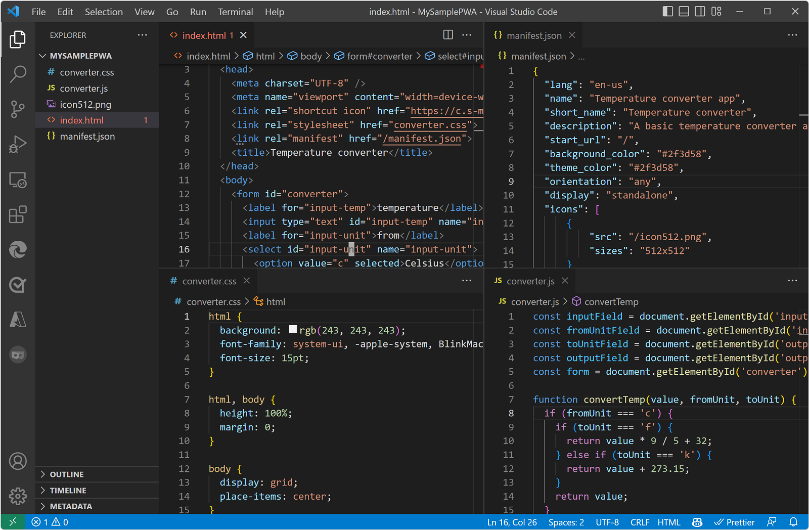

# Get started with PWAs

todo:
* remove action steps/ wording about creating the sample app from scratch
   * scrub "your", "you", "your app"
   * division of concerns for the two articles:
      * Getstart article has no action steps, just discuss code.  Getstart has actions indirectly, in the Getstart's Sample article.
      * Sample article is strictly action steps, to run/use/install/test the PWA.
* condense
   * remove dup code listings
* scrub "project", or increase the "project" framing & pngs; _project_ = the `/Demos/pwa-getting-started/` dir opened in VS Code?
* demote some headings/sections
* reconcile equivalent sections across the two articles

A Progressive Web App (PWA) is a web app that you build by using web technologies such as HTML, CSS, and JavaScript, and can also be installed and run on various device operating systems, from a single codebase.

This guide is about writing code for PWAs.  To learn about installing and running an existing PWA, see [Installing a PWA](../ux.md#installing-a-pwa)<!-- link is placed here per https://github.com/MicrosoftDocs/edge-developer/issues/1974 --> in _Use PWAs in Microsoft Edge_.

See also:
* [Temperature converter sample](../samples/temperature-converter.md) - steps to use the sample that's explained below.


<!-- ====================================================================== -->
## The architecture of a PWA

Progressive Web App (PWA)

The following diagram shows the high-level architecture of a Progressive Web App (PWA):


The web server is on one side of the PWA, and the device is on the other side.  The device contains the front-end code, including HTML, CSS, JavaScript, the service worker<!-- todo: not listed above -->, and the manifest.

Like a regular web app, a Progressive Web App is written using the programming languages of the web: HTML, CSS, and JavaScript, and is distributed to your users by using a web server.  If the web app is a Progressive Web App, the user initially sees the web app within a web browser, and the Address bar also has an **App available** button that prompts the user to install the app locally.

To make a PWA available to users, you deploy the PWA on a web server that's accessible via HTTPS (unlike localhost).  The web server contains front-end code and back-end code for the web app.  If the PWA has no backend code, the PWA can be served out from github.io, such as [Temperature converter](https://microsoftedge.github.io/Demos/pwa-getting-started/) at `https://microsoftedge.github.io/Demos/pwa-getting-started/`.


<!-- ------------------------------ -->
#### Files of a PWA

The sample PWA has the following files, in the `/Demos/pwa-getting-started/` source code directory:

Go to the [/pwa-getting-started/](https://github.com/MicrosoftEdge/Demos/tree/main/pwa-getting-started) source code directory in a new window or tab, and briefly inspect the source code files in the repo at GitHub.

| File | Description | Section below |
|---|---|---|
| `README.md` | Brief information about the app, for people who are looking at the directory of source code; contains a link to access the live app from the github.io web server, and a link to the present article. | [File 7: README.md](#file-7-readmemd) |
| `converter.css` | Cascading Style Sheets (CSS) file, defining layout styling of each UI control in the main page of the app. | [File 2: converter.css](#file-2-convertercss) |
| `converter.js` | App logic, as JavaScript code. | [File 3: converter.js](#file-3-converterjs) |
| `icon512.png` | The icon file to represent this app within the browser and on the local device. | [File 5: icon512.png](#file-5-icon512png) |
| `index.html` | The initial webpage defining the UI controls.  This sample app only has a single webpage. | [File 1: index.html](#file-1-indexhtml) |
| `manifest.json` | Manifest file that makes the Progressive Web App (PWA) installable on the device, unlike a regular web app. | [File 4: manifest.json](#file-4-manifestjson) |
| `sw.js` | Service worker that caches files on the local device and serves out the cached files when there's no internet connection. | [File 6: sw.js](#file-6-swjs) |

The files are listed here in the same order as shown at GitHub.


<!-- ------------------------------ -->
#### Front-end code (UI code)

Progressive Web App (PWA)

Front-end code is the resources needed for the app to be installed on the user's device, such as HTML, CSS, and JavaScript code.

A PWA's front-end code uses HTML, CSS, JavaScript, and a JSON manifest.

A PWA includes the following front-end code files:

* An HTML file to describe the content in your app, such as the text, images, text fields, or buttons that appear in the user interface.

* A CSS file to organize the HTML content in a layout, and provide styles to elements.

* A JavaScript file to add user interactions to your user interface.

* A JSON manifest file to describe your app to the host operating system.

A PWA's front-end code runs by using the device's web browser.  The browser's own UI is not visible when the app is run in a standalone window, which is a streamlined browser window with minimal browser UI controls.


<!-- ------------------------------ -->
#### Back-end code (server-side code)

Progressive Web App (PWA)

The temperature converter sample doesn't have any server-side code, because the app exclusively runs on the device it's installed on, and doesn't need any server-side data.

Like a web app, a Progressive Web App (PWA) can include some _back-end code_ (_server-side code_) that implements any web service API endpoints that are needed by your app, when connected to the internet, to retrieve dynamic content that may be stored in a database on your server.

The PWA's back-end code can use the server-side languages of your choice such as ASP.NET, Java, Node.js, or PHP.  Server-side endpoints might not be required, depending on the app your're building.


<!-- ------------------------------ -->
#### Service worker

Progressive Web App (PWA)

Separate from the UI code, a PWA can use JavaScript in a service worker file (such as `sw.js`).

The service worker makes the app:

* Faster.
* More reliable.
* Network-independent; the app continues to work (in some way), even with a missing or intermittent internet connection.


<!-- ====================================================================== -->
## How the temperature converter sample code works

This article explains how the temperature converter Progressive Web App (PWA) sample works.

To run the sample as you would during development, and to explore the user experience (UX) of a PWA, see [Temperature converter sample](../samples/temperature-converter.md).

By reading that article and the present article, you'll be able to:
* Customize the sample by making minor modifications of the sample's code.
* Create your own, different PWA by copying and pasting the entire sample directory and extensively modifying the code.

This PWA sample is built by using web technologies.  This sample, being a PWA, can be installed and run on all devices, from a single codebase.

The sample consists of the following files:

* `README.md` - brief information about the app: a link to open the app webpage, and a link to the present article.
* `converter.css` - styling for the webpage of the app.
* `converter.js` - app logic.
* `icon512.png` - image file to represent the app.
* `index.html` - webpage layout of the app.
* `manifest.json` - basic information about the app, for the device's operating system to use.
* `sw.js` - service worker.

These files are explained below.


<!-- ====================================================================== -->
## File 1: `index.html`

Progressive Web App (PWA)

[index.html](https://github.com/MicrosoftEdge/Demos/blob/main/pwa-getting-started/index.html) defines the webpage layout of the app.  It uses HTML to describe the content in the app, including the text, images, text fields, and buttons that appear in the user interface.

```html
<!DOCTYPE html>
<html lang="en-US" dir="ltr">
  <head>
    <meta charset="UTF-8" />
    <meta name="viewport" content="width=device-width,initial-scale=1" />
    <link rel="icon" type="image/png" href="https://edgestatic.azureedge.net/welcome/static/favicon.png">
    <link rel="stylesheet" href="./converter.css">
    <link rel="manifest" href="./manifest.json">
    <title>Temperature converter</title>
  </head>
  <body>
    <form id="converter">
      <label for="input-temp">temperature</label>
      <input type="text" id="input-temp" name="input-temp" value="20" />
      <label for="input-unit">from</label>
      <select id="input-unit" name="input-unit">
        <option value="c" selected>Celsius</option>
        <option value="f">Fahrenheit</option>
        <option value="k">Kelvin</option>
      </select>
      <label for="output-unit">to</label>
      <select id="output-unit" name="output-unit">
        <option value="c">Celsius</option>
        <option value="f" selected>Fahrenheit</option>
        <option value="k">Kelvin</option>
      </select>
      <output name="output-temp" id="output-temp" for="input-temp input-unit output-unit">68 F</output>
    </form>
    <script src="./converter.js"></script>
    <script>
      if('serviceWorker' in navigator) {
        navigator.serviceWorker.register('./sw.js', { scope: './' });
      }
    </script>
  </body>
</html>
```


<!-- ------------------------------ -->
#### The app's initial webpage (index.html)

Progressive Web App (PWA)

So far, there is no content available on your web server. Start by creating the first page that users will see when they access your temperature converter app.

1. Open Visual Studio Code, select **File** > **Open Folder** and then select the `MySamplePWA` directory you created in the previous step.

1. Create a new file in the project by pressing **Ctrl+N**, add the following content, and save the file as `index.html`:

   ```html
   <!DOCTYPE html>
   <html lang="en-US" dir="ltr">
     <head>
       <meta charset="UTF-8" />
       <meta name="viewport" content="width=device-width,initial-scale=1" />
       <link rel="shortcut icon" href="https://c.s-microsoft.com/favicon.ico?v2" />
       <title>Temperature converter</title>
     </head>
     <body>
       <h1>Temperature converter</h1>
     </body>
   </html>
   ```

1. Go to `http://localhost:8080` to view your app:

   <!--  removed -->

The app runs in the browser for now, and can't be installed. To make the app installable, the app needs a web app manifest.


<!-- ------------------------------ -->
#### The app's user interface defined as a form in index.html

The app's user interface defined in index.html defines the main app functionality.

The `index.html` file contains a form, instead of an `<h1>` HTML tag:

1. To create the main user interface content, copy the following HTML code and paste it into the `index.html` file, replacing the `<h1>` HTML tag:

    ```html
    <form id="converter">
      <label for="input-temp">temperature</label>
      <input type="text" id="input-temp" name="input-temp" value="20" />
      <label for="input-unit">from</label>
      <select id="input-unit" name="input-unit">
        <option value="c" selected>Celsius</option>
        <option value="f">Fahrenheit</option>
        <option value="k">Kelvin</option>
      </select>
      <label for="output-unit">to</label>
      <select id="output-unit" name="output-unit">
        <option value="c">Celsius</option>
        <option value="f" selected>Fahrenheit</option>
        <option value="k">Kelvin</option>
      </select>
      <output name="output-temp" id="output-temp" for="input-temp input-unit output-unit">68 F</output>
    </form>
    ```

    The above HTML code contains a form with multiple input elements that your app will use to convert a temperature value from one unit to another unit.


<!-- ------------------------------ -->
#### How index.html references the CSS file

`index.html` references the CSS file via the following code that's inside the `<head>` tag:

```html
<link rel="stylesheet" href="converter.css">
```

The project (directory) in Visual Studio Code looks as follows:




At `http://localhost:8080`, the app looks as follows, like a regular web app in a web browser:

<!-- todo: delete the "App available" icon from Address bar? -->


<!-- ------------------------------ -->
#### How index.html loads the JavaScript file

The `index.html` file has the following code after the closing `</form>` tag, to load the JavaScript file:

    ```html
    <script src="converter.js"></script>
    ```


<!-- ------------------------------ -->
#### How index.html references the service worker

1.  Open `index.html` and add the following code at the end of the `<body>` tag to register your service worker:

    ```html
    <script>
    if('serviceWorker' in navigator) {
      navigator.serviceWorker.register('/sw.js', { scope: '/' });
    }
    </script>
    ```


<!-- ====================================================================== -->
## File 2: `converter.css`

Progressive Web App (PWA)

[converter.css](https://github.com/MicrosoftEdge/Demos/blob/main/pwa-getting-started/converter.css) defines the styling for the webpage of the app, by using CSS to organize the HTML content in a layout, and to provide styles for elements.

```css
html {
  background: rgb(243, 243, 243);
  font-family: system-ui, -apple-system, BlinkMacSystemFont, 'Segoe UI', Roboto, Oxygen, Ubuntu, Cantarell, 'Open Sans', 'Helvetica Neue', sans-serif;
  font-size: 15pt;
}

html, body {
  height: 100%;
  margin: 0;
}

body {
  display: grid;
  place-items: center;
}

#converter {
  width: 15rem;
  padding: 2rem;
  border-radius: .5rem;
  box-shadow: 0 0 2rem 0 #0001;
  display: flex;
  flex-direction: column;
  align-items: center;
}

#converter input, #converter select {
  font-family: inherit;
  font-size: inherit;
  margin-block-end: 1rem;
  text-align: center;
  width: 10rem;
}

#converter #output-temp {
  font-size: 2rem;
  font-weight: bold;
}
```


<!-- ------------------------------ -->
#### The CSS file (converter.css)

The web app has CSS style rules, to make the app visually appealing.

The file is `converter.css` in the project<!-- todo: "project"? -->, including the following code:

```css
html {
  background: rgb(243, 243, 243);
  font-family: system-ui, -apple-system, BlinkMacSystemFont, 'Segoe UI', Roboto, Oxygen, Ubuntu, Cantarell, 'Open Sans', 'Helvetica Neue', sans-serif;
  font-size: 15pt;
}

html, body {
  height: 100%;
  margin: 0;
}

body {
  display: grid;
  place-items: center;
}

#converter {
  width: 15rem;
  padding: 2rem;
  border-radius: .5rem;
  box-shadow: 0 0 2rem 0 #0001;
  display: flex;
  flex-direction: column;
  align-items: center;
}

#converter input, #converter select {
  font-family: inherit;
  font-size: inherit;
  margin-block-end: 1rem;
  text-align: center;
  width: 10rem;
}

#converter #output-temp {
  font-size: 2rem;
  font-weight: bold;
}
```


<!-- ====================================================================== -->
## File 3: `converter.js`

Progressive Web App (PWA)

[converter.js](https://github.com/MicrosoftEdge/Demos/blob/main/pwa-getting-started/converter.js) contains app logic.  It uses JavaScript to add user interactions to the user interface.

```javascript
const inputField = document.getElementById('input-temp');
const fromUnitField = document.getElementById('input-unit');
const toUnitField = document.getElementById('output-unit');
const outputField = document.getElementById('output-temp');
const form = document.getElementById('converter');

function convertTemp(value, fromUnit, toUnit) {
  if (fromUnit === 'c') {
    if (toUnit === 'f') {
      return value * 9 / 5 + 32;
    } else if (toUnit === 'k') {
      return value + 273.15;
    }
    return value;
  }
  if (fromUnit === 'f') {
    if (toUnit === 'c') {
      return (value - 32) * 5 / 9;
    } else if (toUnit === 'k') {
      return (value + 459.67) * 5 / 9;
    }
    return value;
  }
  if (fromUnit === 'k') {
    if (toUnit === 'c') {
      return value - 273.15;
    } else if (toUnit === 'f') {
      return value * 9 / 5 - 459.67;
    }
    return value;
  }
  throw new Error('Invalid unit');
}

form.addEventListener('input', () => {
  const inputTemp = parseFloat(inputField.value);
  const fromUnit = fromUnitField.value;
  const toUnit = toUnitField.value;

  const outputTemp = convertTemp(inputTemp, fromUnit, toUnit);
  outputField.value = (Math.round(outputTemp * 100) / 100) + ' ' + toUnit.toUpperCase();
});
```


<!-- ------------------------------ -->
#### The JavaScript file (converter.js)

To make the converter work, the sample uses JavaScript code, in `converter.js`, in the project.<!-- todo: is there a "project" in a tangible concrete UI sense?  does the word "project" appear in a dev ui? -->

```javascript
const inputField = document.getElementById('input-temp');
const fromUnitField = document.getElementById('input-unit');
const toUnitField = document.getElementById('output-unit');
const outputField = document.getElementById('output-temp');
const form = document.getElementById('converter');

function convertTemp(value, fromUnit, toUnit) {
  if (fromUnit === 'c') {
    if (toUnit === 'f') {
      return value * 9 / 5 + 32;
    } else if (toUnit === 'k') {
      return value + 273.15;
    }
    return value;
  }
  if (fromUnit === 'f') {
    if (toUnit === 'c') {
      return (value - 32) * 5 / 9;
    } else if (toUnit === 'k') {
      return (value + 459.67) * 5 / 9;
    }
    return value;
  }
  if (fromUnit === 'k') {
    if (toUnit === 'c') {
      return value - 273.15;
    } else if (toUnit === 'f') {
      return value * 9 / 5 - 459.67;
    }
    return value;
  }
  throw new Error('Invalid unit');
}

form.addEventListener('input', () => {
  const inputTemp = parseFloat(inputField.value);
  const fromUnit = fromUnitField.value;
  const toUnit = toUnitField.value;

  const outputTemp = convertTemp(inputTemp, fromUnit, toUnit);
  outputField.value = (Math.round(outputTemp * 100) / 100) + ' ' + toUnit.toUpperCase();
});
```


<!-- ====================================================================== -->
## File 4: `manifest.json`

Progressive Web App (PWA)

[manifest.json](https://github.com/MicrosoftEdge/Demos/blob/main/pwa-getting-started/manifest.json) provides basic information about the app, for the device's operating system to use.  It uses JSON to describe the app to the host operating system.

```json
{
  "lang": "en-us",
  "name": "Temperature converter app",
  "short_name": "Temperature converter",
  "description": "A basic temperature converter application that can convert to and from Celsius, Kelvin, and Fahrenheit",
  "start_url": "./",
  "background_color": "#2f3d58",
  "theme_color": "#2f3d58",
  "orientation": "any",
  "display": "standalone",
  "icons": [
      {
          "src": "./icon512.png",
          "sizes": "512x512"
      }
  ]
}
```


<!-- ------------------------------ -->
#### The web app manifest

Progressive Web App (PWA)

A _web app manifest_ is a JSON file containing metadata about your app, such as its name, description, icons, and the various operating system features it uses.

See:
* [The web app manifest](https://developer.mozilla.org/docs/Web/Progressive_web_apps/Guides/Making_PWAs_installable#the_web_app_manifest) in _Making PWAs installable_ at MDN > References > Progressive web apps > Guides.
* [Web app manifests](https://developer.mozilla.org/docs/Web/Manifest) at MDN > References.

To add an app manifest to your app:

1.  In Visual Studio Code, press **Ctrl+N** to create a new file with the following content, and save the file as `manifest.json`.

    ```json
    {
        "lang": "en-us",
        "name": "Temperature converter app",
        "short_name": "Temperature converter",
        "description": "A basic temperature converter application that can convert to and from Celsius, Kelvin, and Fahrenheit",
        "start_url": "/",
        "background_color": "#2f3d58",
        "theme_color": "#2f3d58",
        "orientation": "any",
        "display": "standalone",
        "icons": [
            {
                "src": "/icon512.png",
                "sizes": "512x512"
            }
        ]
    }
    ```

1.  Add a 512x512 pixel app icon image named `icon512.png` to your project. <!-- You can use the [sample image](./index-images/icon512.png) for testing purposes. -->

1.  In Visual Studio Code, open `index.html`, and add the following code inside the `<head>` tag.

    ```html
    <link rel="manifest" href="/manifest.json">
    ```

   The above code snippet links the new web app manifest file to your website.

Your VS Code project should now look somewhat like this:


<!-- ====================================================================== -->
## File 5: `icon512.png`

Progressive Web App (PWA)

[icon512.png](https://github.com/MicrosoftEdge/Demos/blob/main/pwa-getting-started/icon512.png) is a 512x512 pixel app icon image.  This image file represents the app, such as in the Windows taskbar and Windows Start Menu:


<!-- ====================================================================== -->
## File 6: `sw.js`

Progressive Web App (PWA)

[sw.js](https://github.com/MicrosoftEdge/Demos/blob/main/pwa-getting-started/sw.js) is a service worker that manages caching files that are part of the app, caching them to the local drive and serving them out if there's no internet connection.

```javascript
const CACHE_NAME = `temperature-converter-v1`;
    
// Use the install event to pre-cache all initial resources.
self.addEventListener('install', event => {
  event.waitUntil((async () => {
    const cache = await caches.open(CACHE_NAME);
    cache.addAll([
      './',
      './converter.js',
      './converter.css'
    ]);
  })());
});

self.addEventListener('fetch', event => {
  event.respondWith((async () => {
    const cache = await caches.open(CACHE_NAME);

    // Get the resource from the cache.
    const cachedResponse = await cache.match(event.request);
    if (cachedResponse) {
      return cachedResponse;
    } else {
        try {
          // If the resource was not in the cache, try the network.
          const fetchResponse = await fetch(event.request);
    
          // Save the resource in the cache and return it.
          cache.put(event.request, fetchResponse.clone());
          return fetchResponse;
        } catch (e) {
          // The network failed
        }
    }
  })());
});
```

The service worker explicitly caches three files:
* `./` means `index.html`
*  `./converter.js`
* `./converter.css`

Two additional files are are cached automatically by the browser: 
* The icon file (`.png`).
* The manifest file (`.json`).

See [Monitor the service worker handling offline caching](../samples/temperature-converter.md#monitor-the-service-worker-handling-offline-caching) in _Temperature converter sample_.


<!-- ------------------------------ -->
#### The service worker (sw.js)

The sample app does something useful, and it can be installed as a standalone app by users.  To enable installing the app, a JavaScript service worker file makes the app able to work offline (without always having an internet connection), by caching needed files on the local device.

A service worker is a key technology that help make a Progressive Web App (PWA) fast and independent of network conditions.

A service worker is a specialized web worker that can intercept network requests from your PWA, and enables scenarios such as:
* Offline support, including intermittent connection to the internet.
* Advanced caching on the device.
* Running background tasks such as receiving PUSH messages, adding badges to the app icon, or fetching data from a server.

See [Service Worker API](https://developer.mozilla.org/docs/Web/API/Service_Worker_API) at MDN.

A PWA doesn't need to have a service worker for Microsoft Edge to be able to install the app.  However, we recommend adding a service worker to your PWA to make it faster, and to make your PWA more reliable, such as when your device has an intermittent network connection or is offline.

A service worker is defined in a JavaScript file that's loaded by your app.  To add a service worker to your project:

In Visual Studio Code, view the file `sw.js`:

```javascript
const CACHE_NAME = `temperature-converter-v1`;

// Use the install event to pre-cache all initial resources.
self.addEventListener('install', event => {
  event.waitUntil((async () => {
    const cache = await caches.open(CACHE_NAME);
    cache.addAll([
      '/',
      '/converter.js',
      '/converter.css'
    ]);
  })());
});

self.addEventListener('fetch', event => {
  event.respondWith((async () => {
    const cache = await caches.open(CACHE_NAME);

    // Get the resource from the cache.
    const cachedResponse = await cache.match(event.request);
    if (cachedResponse) {
      return cachedResponse;
    } else {
        try {
          // If the resource was not in the cache, try the network.
          const fetchResponse = await fetch(event.request);
    
          // Save the resource in the cache and return it.
          cache.put(event.request, fetchResponse.clone());
          return fetchResponse;
        } catch (e) {
          // The network failed.
        }
    }
  })());
});
```

The `sw.js` file acts as the PWA's service worker.  The code above listens to the `install` event, which is triggered when the user installs the app, and uses it to cache the resources that your app needs to function offline, such as the initial HTML page, the converter JavaScript file, and the converter CSS file.

The code also intercepts `fetch` events, which happen every time your app sends a request to the server, and applies a cache-first strategy.  The service worker returns cached resources so your app can work offline, and if that fails, (todo) attempts to download from the server.


<!-- ------------------------------ -->
#### Confirming that the service worker is running

To confirm that the service worker is running:

1. In Microsoft Edge, go to `http://localhost:8080`.

1. To open DevTools, right-click the webpage, and then select **Inspect**.  Or, press **Ctrl+Shift+I** (Windows, Linux) or **Command+Option+I** (macOS).  DevTools opens.

1. Open the **Application** tool, then click **Service workers**.  If the service worker isn't displayed, refresh the page.

    

1.  View the service worker cache by expanding **Cache Storage** and selecting **temperature-converter-v1**.  All of the resources cached by the service worker should be displayed.  The resources cached by the service worker include the app icon, app manifest, and the initial page.

    

1.  Try your PWA as an offline app. In DevTools, open the **Network** tool, and change the **Throttling** value to **Offline**.

1.  Refresh the app. It should still appear correctly in the browser, using cached resources served by the service worker.

    


<!-- ====================================================================== -->
## File 7: `README.md`

[README.md](https://github.com/MicrosoftEdge/Demos/tree/main/pwa-getting-started#readme) is technically not part of the sample's source code.

The Readme contains brief information about the Progressive Web App (PWA):
* A link to open the app webpage.
* A link to the [Temperature converter sample](../samples/temperature-converter.md) article.

todo: Is it recommended that a PWA's main dir contain a Readme?  assume that the PWA's end-users don't see the source code dir or the Readme file.


<!-- ====================================================================== -->
## Start the development web server

This section is action steps and is dup with [Start the localhost server and web app](../samples/temperature-converter.md#start-the-localhost-server-and-web-app) in _Temperature converter sample_.

Like a regular web app, a Progressive Web App (PWA) is distributed to users by using web servers. Once the app is ready, you deploy it to the web by using a web hosting provider. You can then update the app by deploying the new version of the app to your web server.

To start developing the PWA, you can use a local web server instead.  To start a local server:

1. Create a new folder on your computer where the web server will run.

    You can do this by opening a command prompt and typing:
    
    ```console
    cd path/to/your/dev/folder
    mkdir MySamplePWA
    cd MySamplePWA
    ```

1. Start the server by using the `http-server` Node.js library:

   ```console
   npx http-server
   ```

You now have a simple local web server running at `http://localhost:8080`.

Key parts of the Progressive Web Apps platform, such as service workers, require using HTTPS.  When your PWA goes live, you must publish it to an HTTPS URL.  Many hosts use HTTPS by default, but if your host doesn't offer HTTPS, [Let's Encrypt](https://letsencrypt.org/) offers a free alternative for creating the necessary certificates.

For example, you can create an [Azure free account](https://azure.microsoft.com/free).  If you host your website on the [Microsoft Azure App Service](https://azure.microsoft.com/services/app-service/web), it's served over HTTPS by default.

You can also host your website on [GitHub Pages](https://pages.github.com/) which supports HTTPS too.

For debugging purposes, Microsoft Edge also permits a `localhost` web server to use the PWA APIs without HTTPS.


<!-- ====================================================================== -->
## Install the app on the device

This section is action steps and is dup with [Install the web app as a local app](../samples/temperature-converter.md#install-the-web-app-as-a-local-app) in _Temperature converter sample_.

The sample's web app manifest enables browsers that support PWAs to install the web app as a Progressive Web App (PWA) on the device.

In Microsoft Edge, once you refresh your app, the **App available** button appears in the Address bar.  Clicking the **App available** button prompts you to install the app locally.


Click **Install** to install the app locally. After the installation completes, your app is displayed in its own window, and its own app icon in the Taskbar.


To learn more about installing PWAs, see [Use PWAs in Microsoft Edge](../ux.md).


<!-- ====================================================================== -->
## Hosting the PWA on a web server for users

This section is not action steps, but is explanatory.

Some parts of the Progressive Web Apps (PWAs) platform, such as service workers, require using HTTPS.  For debugging purposes, Microsoft Edge permits a `localhost` web server to use the PWA APIs without HTTPS.

When your PWA goes live, you must publish it to an HTTPS URL.  Many hosts use HTTPS by default, but if your host doesn't offer HTTPS, [Let's Encrypt](https://letsencrypt.org/) offers a free alternative for creating the necessary certificates.

For example, you can create an [Azure free account](https://azure.microsoft.com/free).  If you host your website on the [Microsoft Azure App Service](https://azure.microsoft.com/services/app-service/web), it's served over HTTPS by default.

You can also host your website on [GitHub Pages](https://pages.github.com/) (`pages.github.com`) which supports HTTPS too.

todo: capabilities of pages.github.com vs. github.io - just a different URL?


<!-- ====================================================================== -->
## Next steps

To create your own Progressive Web App (PWA), you can copy, paste, and modify the `Demos\pwa-getting-started` directory.

The above steps show how to run and test the sample PWA on your local server.  When your own PWA app has been tested and is ready to distribute, you distribute the tested PWA to your users via a web server (a web hosting provider).

After that, to update your PWA, you deploy the new version to your web server again.

The temperature converter sample demonstrates only a small sample of what PWAs can do.  The sample demonstrates code that's important for any PWA, such as working when there's no internet connection.

There are additional [Best practices for PWAs](./best-practices.md) to make a PWA feel like a native app:

* Integrate within the operating system, such as by handling files.
* Perform non-trivial computing tasks.
* Get the app from app stores.


<!-- ====================================================================== -->
## See also
<!-- todo: all links in article -->

<!-- Local: -->
* [Temperature converter sample](../samples/temperature-converter.md)
* [Overview of Progressive Web Apps (PWAs)](../index.md)
* [Use PWAs in Microsoft Edge](../ux.md)
* [Installing a PWA](../ux.md#installing-a-pwa) in _Use PWAs in Microsoft Edge_.
* [Best practices for PWAs](./best-practices.md)

MDN:
* [Web app manifests](https://developer.mozilla.org/docs/Web/Manifest) at MDN.
* [Service Worker API](https://developer.mozilla.org/docs/Web/API/Service_Worker_API) at MDN.

External Microsoft:
* [PWA getting started demo app repository](https://github.com/MicrosoftEdge/Demos/tree/main/pwa-getting-started)
* [Visual Studio Code](https://code.visualstudio.com)
* [Azure free account](https://azure.microsoft.com/free)
* [Microsoft Azure App Service](https://azure.microsoft.com/services/app-service/web)

External:
* [Getting Started with Progressive Web Apps (Workshop)](https://noti.st/aarongustafson/co3b5z/getting-started-with-progressive-web-apps-workshop).
* [GitHub Pages](https://pages.github.com/)
* [Node.js](https://nodejs.org)
* [Let's Encrypt](https://letsencrypt.org/)


