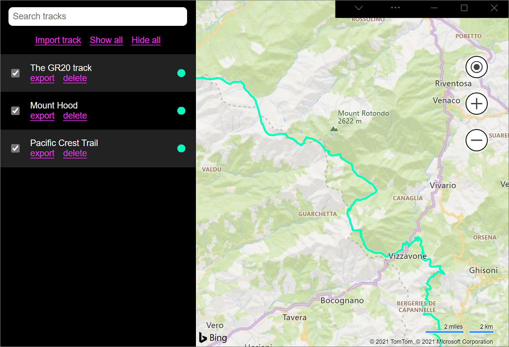

# Progressive Web App demos
<!-- sync:
https://learn.microsoft.com/microsoft-edge/progressive-web-apps/demo-pwas
https://github.com/MicrosoftEdge/Demos/blob/main/README.md#progressive-web-apps-pwas
sync'd July 30, 2025
-->

These demo PWAs show how to use features and APIs that can progressively enhance your apps when installed on devices.

Most of these demos are in the [MicrosoftEdge / Demos](https://github.com/MicrosoftEdge/Demos) repo.
<!-- section order:
by repo dir, per https://github.com/MicrosoftEdge/Demos/blob/main/README.md#progressive-web-apps-pwas
followed by other repos
-->

<!-- ====================================================================== -->
## 1DIV

1DIV is a CSS editor that lets users create drawings by creating just one HTML element and CSS code.

[App](https://microsoftedge.github.io/Demos/1DIV/dist/), [source code and Readme file](https://github.com/MicrosoftEdge/Demos/tree/main/1DIV/).

1DIV uses the following features:

| Feature | Description | Documentation |
|:--- |:--- |:--- |
| Window Controls Overlay | 1DIV uses the space normally reserved by the title bar to display a logo, search field, and button. | [Display content in the title bar area using Window Controls Overlay](../how-to/window-controls-overlay.md) |

<!-- ====================================================================== -->
## Email client

A simulated email client PWA that demonstrates how to use PWA protocol handlers.

[App](https://microsoftedge.github.io/Demos/email-client/), [source code and Readme file](https://github.com/MicrosoftEdge/Demos/tree/main/email-client/).

Email client uses the following features:

| Feature | Description | Documentation |
|:--- |:--- |:--- |
| Protocol Handling | `mailto` links are handled by the app to start composing a new email. | [Handle protocols in a PWA](../how-to/handle-protocols.md) |

<!-- ====================================================================== -->
## My Movie List

This simple PWA demo lets you search for made-up movies and store them locally.

[App](https://quirky-rosalind-ac1e65.netlify.app/), [source code](https://github.com/captainbrosset/movies-db-pwa/).<!-- todo: link to readme when exists --><!-- todo: move to Demos repo, then update repo's Readme and the article and demo-pwas.md -->

[App](https://quirky-rosalind-ac1e65.netlify.app/), [source code](https://github.com/captainbrosset/movies-db-pwa/).

 [My Movie List](https://quirky-rosalind-ac1e65.netlify.app/)
[/movies-db-pwa/](https://github.com/captainbrosset/movies-db-pwa/)

My Movies uses the following features:

| Feature | Description | Documentation |
|:--- |:--- |:--- |
| Background Sync | If the user is offline when displaying more information about a movie, the app uses Background Sync to retrieve the information later when the user is back online. | [Use the Background Sync API to synchronize data with the server](../how-to/background-syncs.md#use-the-background-sync-api-to-synchronize-data-with-the-server) |
| Notifications | When the information about a movie is retrieved, a notification is sent so the user can re-engage with the app. | [Display notifications in the action center](../how-to/notifications-badges.md#display-notifications-in-the-action-center) |

<!-- ====================================================================== -->
## My Tracks

My Tracks is useful for visualizing GPS tracks (`*.gpx` files) on a map.

[App](https://captainbrosset.github.io/mytracks/),<!-- todo: move demo to Demos repo--> [source code and Readme file](https://github.com/captainbrosset/mytracks/).

My Tracks uses the following features:

| Feature | Description | Documentation |
|:--- |:--- |:--- |
| Window Controls Overlay | The space normally reserved to the title bar is used by My Tracks to display its own search bar. | [Display content in the title bar area using Window Controls Overlay](../how-to/window-controls-overlay.md) |
| Protocol Handling | My Tracks handles URIs that start with the `geo:` protocol to show locations on the map. | [Handle protocols in a PWA](../how-to/handle-protocols.md) |
| File Handling | My Tracks natively handles `*.gpx` files. | [Handle files in a PWA](../how-to/handle-files.md) |
| Shortcuts | My Tracks defines shortcuts to easily hide and show all tracks from the map. | [Define app shortcuts (long-press or right-click menus)](../how-to/shortcuts.md) |

<!-- ====================================================================== -->
## Application Title Meta Tag

A demo web app to showcase the `application-title` meta tag.

[App](https://github.com/MicrosoftEdge/Demos/tree/main/pwa-application-title), [source code and Readme file](https://microsoftedge.github.io/Demos/pwa-application-title/).

Application Title Meta Tag uses the following features:

| Feature | Description | Documentation |
|:--- |:--- |:--- |
| `application-title` meta tag | The PWA makes runtime changes to the `<meta name="application-title" content="">` element. | [application-title](https://developer.mozilla.org/docs/Web/HTML/Reference/Elements/meta/name#application-name) in _&lt;meta&gt; name attribute_ at MDN. |

<!-- ====================================================================== -->
## Temperature converter

A simple PWA demo app that converts temperatures.  See [Temperature converter sample](./temperature-converter.md).

[App](https://microsoftedge.github.io/Demos/pwa-getting-started/), [source code and Readme file](https://github.com/MicrosoftEdge/Demos/tree/main/pwa-getting-started).

<!-- ====================================================================== -->
## PWA installer

A PWA that uses the Web Install API to install other PWAs.  Also uses CSS Masonry.

[App](https://microsoftedge.github.io/Demos/pwa-pwastore/), [source code and Readme file](https://github.com/MicrosoftEdge/Demos/tree/main/pwa-pwastore).
<!-- todo: new:
[App](https://microsoftedge.github.io/Demos/pwa-installer/), [source code and Readme file](https://github.com/MicrosoftEdge/Demos/tree/main/pwa-installer/).
-->

PWA installer uses the following features:

| Feature | Description | Documentation |
|:--- |:--- |:--- |
| Web Install API | PWA installer uses the `navigator.install()` API to install other PWAs on the device. | [Web Install API](https://github.com/MicrosoftEdge/MSEdgeExplainers/blob/main/WebInstall/explainer.md) |
| CSS Masonry | Instead of a strict grid that has gaps below shorter items, the items in the following row are raised up to fill the gaps. | [Masonry layout](https://developer.mozilla.org/en-US/docs/Web/CSS/CSS_grid_layout/Masonry_layout) |

<!-- ====================================================================== -->
## Timer PWA

Has a **Set timer** button, and you can set the duration of the timer.

[App](https://microsoftedge.github.io/Demos/pwa-timer/), [source code and Readme file](https://github.com/MicrosoftEdge/Demos/tree/main/pwa-timer).

<!-- ====================================================================== -->
## PWA To Do

Create lists of tasks locally in your browser, or by installing the app.  Click the **About** link in the rendered demo.

[App](https://microsoftedge.github.io/Demos/pwa-to-do/), [source code and Readme file](https://github.com/MicrosoftEdge/Demos/tree/main/pwa-to-do).

<!-- ====================================================================== -->
## PWAmp

PWAmp is a desktop music player that plays local and remote audio files.

[App](https://microsoftedge.github.io/Demos/pwamp/), [source code and Readme file](https://github.com/MicrosoftEdge/Demos/tree/main/pwamp/).

PWAmp uses the following features:

| Feature | Description | Documentation |
|:--- |:--- |:--- |
| Window Controls Overlay | The space normally reserved to the title bar can be used by PWAmp to display a visualization of the current song. | [Display content in the title bar area using Window Controls Overlay](../how-to/window-controls-overlay.md) |
| Protocol Handling | Links that start with `web+amp:` can be used to share remote songs. | [Handle protocols in a PWA](../how-to/handle-protocols.md) |
| File Handling | Audio files can be opened with PWAmp directly. Right-click on a file ending with `.mp3` for example and click **Open with**. | [Handle files in a PWA](../how-to/handle-files.md) |
| Web Share | Songs can be shared with other apps through the operating system sharing dialog. | [Sharing content](../how-to/share.md#sharing-content) |
| Share Target | Other apps can share audio files with PWAmp, through the operating system sharing dialog. | [Receiving shared content](../how-to/share.md#receiving-shared-content) |
| Widget | A mini-player Widget can be installed in Windows 11 Widgets dashboard to see the current song. | [Display a PWA widget in the Windows Widgets Board](../how-to/widgets.md) |
| Sidebar | PWAmp can be pinned to the sidebar in Microsoft Edge. | [Build a PWA for the sidebar in Microsoft Edge](../how-to/sidebar.md) |

<!-- ====================================================================== -->
## wami

wami can apply a sequence of image manipulation steps such as cropping, resizing, rotating, or adding effects on batch of images.

[App](https://microsoftedge.github.io/Demos/wami/), [source code and Readme file](https://github.com/MicrosoftEdge/Demos/tree/main/wami/).

wami uses the following features:

| Feature | Description | Documentation |
|:--- |:--- |:--- |
| Window Controls Overlay | The space normally reserved to the title bar can be used by wami. | [Display content in the title bar area using Window Controls Overlay](../how-to/window-controls-overlay.md) |
| File System Access | wami can save transformed images back to disk. | [File System Access API](https://developer.mozilla.org/docs/Web/API/File_System_Access_API) |

<!-- /Demos repo -->

<!-- ====================================================================== -->
<!-- ## Demos in a repo other than the Demos repo -->

<!-- ====================================================================== -->
## BPM Techno

BPM Techno analyzes audio via the device microphone and displays a real-time beats-per-minute (BPM) counter.

[App](https://bpmtech.no/), [source code and Readme file](https://github.com/webmaxru/bpm-counter/).

This demo is in the [webmaxru / bpm-counter](https://github.com/webmaxru/bpm-counter/) repo.

BPM Techno uses the following features:

| Feature | Description | Documentation |
|:--- |:--- |:--- |
| Shortcuts | BPM Techno defines a shortcut that lets users upload an audio file in the app. | [Define app shortcuts (long-press or right-click menus)](../how-to/shortcuts.md) |
| File Handling | BPM Techno natively handles `*.mp3` files. | [Handle files in a PWA](../how-to/handle-files.md) |
| Share Target | Other apps can share audio files with BPM Techno, through the operating system sharing dialog. | [Receiving shared content](../how-to/share.md#receiving-shared-content) |
| Protocol Handling | The app handles `web+bpm:` URIs which can be used to send links to a song to be analyzed. | [Handle protocols in a PWA](../how-to/handle-protocols.md) |

<!-- ====================================================================== -->
## Webboard

Webboard is a drawing application.

[App](https://webboard.app/), [source code and Readme file](https://github.com/pwa-builder/web-whiteboard/).

This demo is in the [pwa-builder / web-whiteboard](https://github.com/pwa-builder/web-whiteboard/) repo.

Webboard uses the following features:

| Feature | Description | Documentation |
|:--- |:--- |:--- |
| Web Share | Drawings can be shared with other apps through the operating system sharing dialog. | [Sharing content](../how-to/share.md#sharing-content) |

<!-- ====================================================================== -->
## See also

* [Clone the Edge Demos repo to your drive](../../devtools/samples/index.md#clone-the-edge-demos-repo-to-your-drive) in _Sample code for DevTools_.
