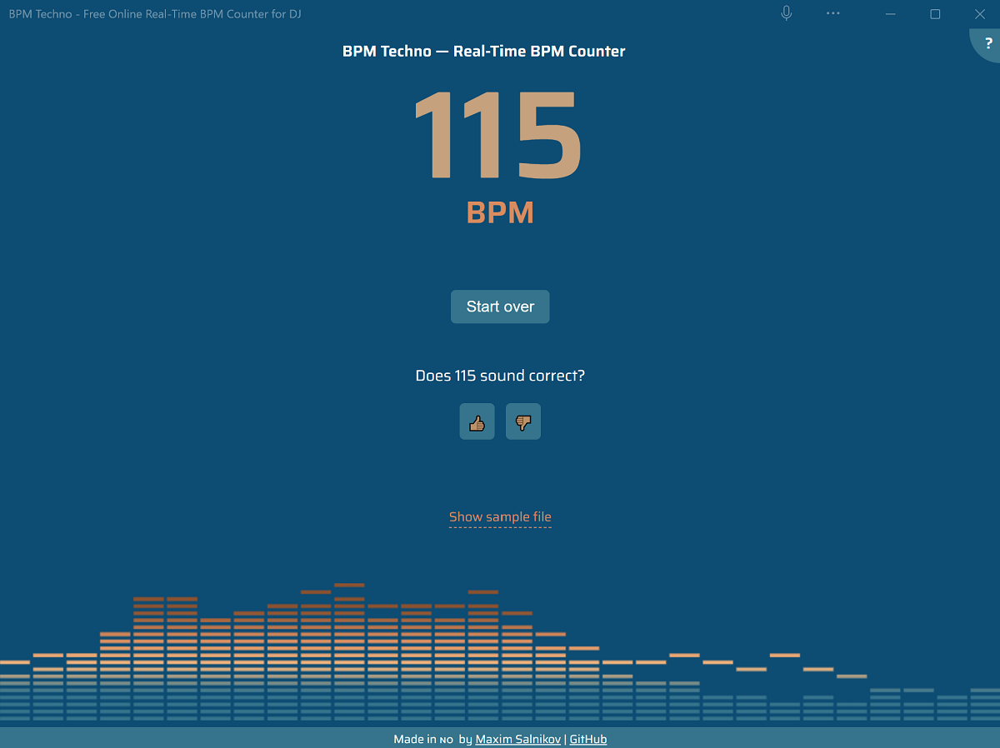
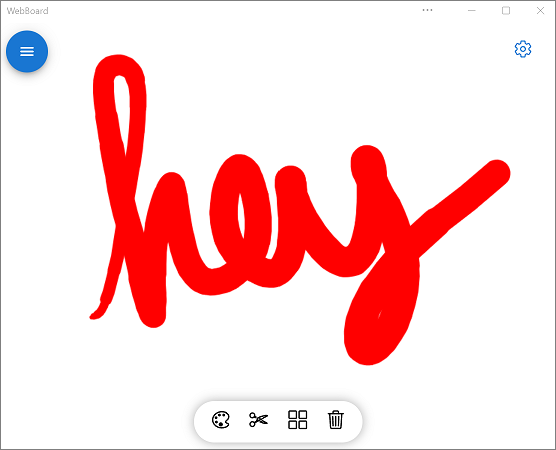

# Progressive Web App samples

The sample Progressive Web Apps (PWAs) show how to use features and APIs that can progressively enhance your app when installed on a device.

For overviews of most of the PWA samples, see [Progressive Web Apps (PWAs)](https://github.com/MicrosoftEdge/Demos/blob/main/README.md#progressive-web-apps-pwas) in the Readme for the "MicrosoftEdge / Demo" repo.

The first sample to use when getting started is the [Temperature converter sample](./temperature-converter.md).

See the Readme file for a given sample.  Some samples require setup and don't work if you just click the app's GitHub.io demo link.

The following samples are in a repo other than the "MicrosoftEdge / Demo" repo.

<!-- ====================================================================== -->
## BPM Techno
<!-- "webmaxru / bpm-counter" repo -->

BPM Techno analyzes audio via the device microphone and displays a real-time beats-per-minute (BPM) counter.

[Readme and source code](https://github.com/webmaxru/bpm-counter/), [App](https://bpmtech.no).

This demo is in the [webmaxru / bpm-counter](https://github.com/webmaxru/bpm-counter/) repo.

BPM Techno uses the following features:

| Feature | Description | Documentation |
|:--- |:--- |:--- |
| Shortcuts | BPM Techno defines a shortcut that lets users upload an audio file in the app. | [Define app shortcuts (long-press or right-click menus)](../how-to/shortcuts.md) |
| File Handling | BPM Techno natively handles `*.mp3` files. | [Handle files in a PWA](../how-to/handle-files.md) |
| Share Target | Other apps can share audio files with BPM Techno, through the operating system sharing dialog. | [Receiving shared content](../how-to/share.md#receiving-shared-content) |
| Protocol Handling | The app handles `web+bpm:` URIs which can be used to send links to a song to be analyzed. | [Handle protocols in a PWA](../how-to/handle-protocols.md) |

<!-- ====================================================================== -->
## Webboard
<!-- "pwa-builder / web-whiteboard" repo -->

Webboard is a drawing application.

[Readme and source code](https://github.com/pwa-builder/web-whiteboard/), [App](https://webboard.app).

This demo is in the [pwa-builder / web-whiteboard](https://github.com/pwa-builder/web-whiteboard/) repo.

Webboard uses the following features:

| Feature | Description | Documentation |
|:--- |:--- |:--- |
| Web Share | Drawings can be shared with other apps through the operating system sharing dialog. | [Sharing content](../how-to/share.md#sharing-content) |

<!-- ======================================================================
## Web Install Sample
"Kbhlee2121 / pwa" repo

* [App](https://kbhlee2121.github.io/pwa/web-install/index.html) - requires the web-app-installation-api flag.
* [/web-install/](https://github.com/Kbhlee2121/pwa/tree/master/web-install) - source code directory.  no readme
* [/pwa-web-install-api/](https://github.com/MicrosoftEdge/Demos/tree/main/pwa-web-install-api/)
   * [Readme file](https://github.com/MicrosoftEdge/Demos/blob/main/pwa-web-install-api/README.md)
-->

<!-- ====================================================================== -->
## See also

* [Clone the "MicrosoftEdge / Demos" repo to your drive](../../devtools/samples/index.md#clone-the-edge-demos-repo-to-your-drive) in _Sample code for DevTools_.
