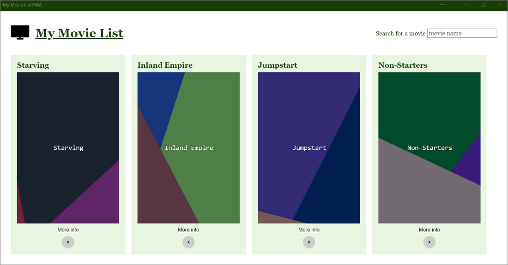

# Progressive Web App samples
<!-- sync:
https://learn.microsoft.com/microsoft-edge/progressive-web-apps/samples/index
https://github.com/MicrosoftEdge/Demos/blob/main/README.md#progressive-web-apps-pwas
sync'd Oct. 17, 2025
-->

These demo PWAs show how to use features and APIs that can progressively enhance your apps when installed on devices.

The first sample to use when getting started is the [Temperature converter sample](./temperature-converter.md).

See the Readme file for the sample; some samples require setup and don't work if you just click the app's link below.

Most of these PWA demos are in the [MicrosoftEdge / Demos](https://github.com/MicrosoftEdge/Demos?tab=readme-ov-file#progressive-web-apps-pwas) repo.

<!-- sort h2's by repo then by dir name, to match https://github.com/MicrosoftEdge/Demos?tab=readme-ov-file#progressive-web-apps-pwas -->

<!-- ====================================================================== -->
## 1DIV
<!-- "MicrosoftEdge / Demos" repo -->

1DIV is a CSS editor that lets users create drawings by creating just one HTML element and CSS code.

* [App](https://microsoftedge.github.io/Demos/1DIV/dist/)
* [/1DIV/](https://github.com/MicrosoftEdge/Demos/tree/main/1DIV/) - source code directory.
   * [Readme file](https://github.com/MicrosoftEdge/Demos/blob/main/1DIV/README.md)

1DIV uses the following features:

| Feature | Description | Documentation |
|:--- |:--- |:--- |
| Window Controls Overlay | 1DIV uses the space normally reserved by the title bar to display a logo, search field, and button. | [Display content in the title bar area using Window Controls Overlay](../how-to/window-controls-overlay.md) |

<!-- ====================================================================== -->
## Email client
<!-- "MicrosoftEdge / Demos" repo -->

A simulated email client PWA that demonstrates how to use PWA protocol handlers.

* [App](https://microsoftedge.github.io/Demos/email-client/)
* [/email-client/](https://github.com/MicrosoftEdge/Demos/tree/main/email-client/) - source code directory.
   * [Readme file](https://github.com/MicrosoftEdge/Demos/blob/main/email-client/README.md)

Email client uses the following features:

| Feature | Description | Documentation |
|:--- |:--- |:--- |
| Protocol Handling | `mailto` links are handled by the app to start composing a new email. | [Handle protocols in a PWA](../how-to/handle-protocols.md) |

<!-- ====================================================================== -->
## Application Title Meta Tag
<!-- "MicrosoftEdge / Demos" repo -->

A demo web app to showcase the `application-title` meta tag.

* [App](https://microsoftedge.github.io/Demos/pwa-application-title/)
* [/pwa-application-title/](https://github.com/MicrosoftEdge/Demos/tree/main/pwa-application-title/) - source code directory.
   * [Readme file](https://github.com/MicrosoftEdge/Demos/blob/main/pwa-application-title/README.md)

Application Title Meta Tag uses the following features:

| Feature | Description | Documentation |
|:--- |:--- |:--- |
| `application-title` meta tag | The PWA makes runtime changes to the `<meta name="application-title" content="">` element. | [application-title](https://developer.mozilla.org/docs/Web/HTML/Reference/Elements/meta/name#application-name) in _&lt;meta&gt; name attribute_ at MDN. |

<!-- ====================================================================== -->
## Temperature converter
<!-- "MicrosoftEdge / Demos" repo -->

A simple PWA demo app that converts temperatures.  See [Temperature converter sample](./temperature-converter.md).

* [App](https://microsoftedge.github.io/Demos/temperature-converter/)
* [/temperature-converter/](https://github.com/MicrosoftEdge/Demos/tree/main/temperature-converter/) - source code directory.
   * [Readme file](https://github.com/MicrosoftEdge/Demos/blob/main/temperature-converter/README.md)

<!-- ====================================================================== -->
## PWA installer

A PWA that uses the Web Install API to install other PWAs.  Also uses CSS Masonry.

* [PWA installer app](https://microsoftedge.github.io/Demos/pwa-installer/)
* [/pwa-installer/](https://github.com/MicrosoftEdge/Demos/tree/main/pwa-installer/) - source code directory.
   * [Readme file](https://github.com/MicrosoftEdge/Demos/blob/main/pwa-installer/README.md)

PWA installer uses the following features:

| Feature | Description | Documentation |
|:--- |:--- |:--- |
| Web Install API | PWA installer uses the `navigator.install()` API to install other PWAs on the device. | [Web Install API](https://github.com/MicrosoftEdge/MSEdgeExplainers/blob/main/WebInstall/explainer.md) |
| CSS Masonry | Instead of a strict grid that has gaps below shorter items, the items in the following row are raised up to fill the gaps. | [Masonry layout](https://developer.mozilla.org/en-US/docs/Web/CSS/CSS_grid_layout/Masonry_layout) |

See also:
* [Microsoft Edge: Web Install API Dev Trial Live](https://www.linkedin.com/feed/update/urn:li:activity:7348768177993998337/)
* [Web Install API](https://github.com/MicrosoftEdge/MSEdgeExplainers/blob/main/WebInstall/explainer.md) - explainer.

<!-- ======================================================================
## Web Install Sample
"Kbhlee2121 / pwa" repo

* [App](https://kbhlee2121.github.io/pwa/web-install/index.html) - requires the web-app-installation-api flag.
* [/web-install/](https://github.com/Kbhlee2121/pwa/tree/master/web-install) - source code directory.  no readme
* [/pwa-web-install-api/](https://github.com/MicrosoftEdge/Demos/tree/main/pwa-web-install-api/)
   * [Readme file](https://github.com/MicrosoftEdge/Demos/blob/main/pwa-web-install-api/README.md)
-->

<!-- ====================================================================== -->
## Timer PWA
<!-- "MicrosoftEdge / Demos" repo -->

Has a **Set timer** button, and you can set the duration of the timer.

* [App](https://microsoftedge.github.io/Demos/pwa-timer/)
* [/pwa-timer/](https://github.com/MicrosoftEdge/Demos/tree/main/pwa-timer/) - source code directory.
   * [Readme file](https://github.com/MicrosoftEdge/Demos/blob/main/pwa-timer/README.md)

<!-- ====================================================================== -->
## PWA To Do
<!-- "MicrosoftEdge / Demos" repo -->

Create lists of tasks locally in your browser, or by installing the app.  Click the **About** link in the rendered demo.

* [App](https://microsoftedge.github.io/Demos/pwa-to-do/)
* [/pwa-to-do/](https://github.com/MicrosoftEdge/Demos/tree/main/pwa-to-do/) - source code directory.
   * [Readme file](https://github.com/MicrosoftEdge/Demos/blob/main/pwa-to-do/README.md)

<!-- ====================================================================== -->
## PWAmp
<!-- "MicrosoftEdge / Demos" repo -->

PWAmp is a desktop music player that plays local and remote audio files.

* [App](https://microsoftedge.github.io/Demos/pwamp/)
* [/pwamp/](https://github.com/MicrosoftEdge/Demos/tree/main/pwamp/) - source code directory.
   * [Readme file](https://github.com/MicrosoftEdge/Demos/blob/main/pwamp/README.md)

PWAmp uses the following features:

| Feature | Description | Documentation |
|:--- |:--- |:--- |
| Window Controls Overlay | The space normally reserved to the title bar can be used by PWAmp to display a visualization of the current song. | [Display content in the title bar area using Window Controls Overlay](../how-to/window-controls-overlay.md) |
| Protocol Handling | Links that start with `web+amp:` can be used to share remote songs. | [Handle protocols in a PWA](../how-to/handle-protocols.md) |
| File Handling | Audio files can be opened with PWAmp directly. Right-click on a file ending with `.mp3` for example and click **Open with**. | [Handle files in a PWA](../how-to/handle-files.md) |
| Web Share | Songs can be shared with other apps through the operating system sharing dialog. | [Sharing content](../how-to/share.md#sharing-content) |
| Share Target | Other apps can share audio files with PWAmp, through the operating system sharing dialog. | [Receiving shared content](../how-to/share.md#receiving-shared-content) |
| Widget | A mini-player Widget can be installed in Windows 11 Widgets dashboard to see the current song. | [Display a PWA widget in the Windows Widgets Board](../how-to/widgets.md) |
| Sidebar | PWAmp can be pinned to the sidebar in Microsoft Edge. | [Build a PWA for the sidebar in Microsoft Edge](../how-to/sidebar.md) |

<!-- ====================================================================== -->
## wami
<!-- "MicrosoftEdge / Demos" repo -->

wami can apply a sequence of image manipulation steps such as cropping, resizing, rotating, or adding effects on batch of images.

* [App](https://microsoftedge.github.io/Demos/wami/)
* [/wami/](https://github.com/MicrosoftEdge/Demos/tree/main/wami/) - source code directory.
   * [Readme file](https://github.com/MicrosoftEdge/Demos/blob/main/wami/README.md)

wami uses the following features:

| Feature | Description | Documentation |
|:--- |:--- |:--- |
| Window Controls Overlay | The space normally reserved to the title bar can be used by wami. | [Display content in the title bar area using Window Controls Overlay](../how-to/window-controls-overlay.md) |
| File System Access | wami can save transformed images back to disk. | [File System Access API](https://developer.mozilla.org/docs/Web/API/File_System_Access_API) |

<!-- end of "MicrosoftEdge / Demos" repo -->

<!-- ====================================================================== -->
<!-- ## Demos in a repo other than the Demos repo -->

<!-- ====================================================================== -->
## My Movie List
<!-- "captainbrosset / movies-db-pwa" repo -->
<!-- planned: "MicrosoftEdge / Demos" repo -->

This simple PWA demo lets you search for made-up movies and store them locally.

* [App](https://quirky-rosalind-ac1e65.netlify.app)<!-- - see Readme for setup. -->
* [/movies-db-pwa/](https://github.com/captainbrosset/movies-db-pwa/)<!-- todo: move to Demos repo, then update repo's Readme and this article; move this section up --> - source code directory.
   * No Readme file.<!-- https://github.com/captainbrosset/movies-db-pwa/issues/1 --><!-- todo: link to readme -->

My Movie List uses the following features:

| Feature | Description | Documentation |
|:--- |:--- |:--- |
| Background Sync | If the user is offline when displaying more information about a movie, the app uses Background Sync to retrieve the information later when the user is back online. | [Use the Background Sync API to synchronize data with the server](../how-to/background-syncs.md#use-the-background-sync-api-to-synchronize-data-with-the-server) |
| Notifications | When the information about a movie is retrieved, a notification is sent so the user can re-engage with the app. | [Display notifications in the action center](../how-to/notifications-badges.md#display-notifications-in-the-action-center) |

<!-- ====================================================================== -->
## My Tracks
<!-- "captainbrosset / mytracks" repo -->
<!-- planned: "MicrosoftEdge / Demos" repo -->

My Tracks is useful for visualizing GPS tracks (`*.gpx` files) on a map.

* [App](https://captainbrosset.github.io/mytracks/)<!-- todo: move demo to Demos repo; move this section up --> - see Readme for setup.
* [/mytracks/](https://github.com/captainbrosset/mytracks/) - source code directory.
   * [Readme file](https://github.com/captainbrosset/mytracks/blob/main/README.md)

My Tracks uses the following features:

| Feature | Description | Documentation |
|:--- |:--- |:--- |
| Window Controls Overlay | The space normally reserved to the title bar is used by My Tracks to display its own search bar. | [Display content in the title bar area using Window Controls Overlay](../how-to/window-controls-overlay.md) |
| Protocol Handling | My Tracks handles URIs that start with the `geo:` protocol to show locations on the map. | [Handle protocols in a PWA](../how-to/handle-protocols.md) |
| File Handling | My Tracks natively handles `*.gpx` files. | [Handle files in a PWA](../how-to/handle-files.md) |
| Shortcuts | My Tracks defines shortcuts to easily hide and show all tracks from the map. | [Define app shortcuts (long-press or right-click menus)](../how-to/shortcuts.md) |

<!-- ====================================================================== -->
## BPM Techno
<!-- "webmaxru / bpm-counter" repo -->

BPM Techno analyzes audio via the device microphone and displays a real-time beats-per-minute (BPM) counter.

* [App](https://bpmtech.no)
* [/bpm-counter/](https://github.com/webmaxru/bpm-counter/) - source code directory.
   * [Readme file](https://github.com/webmaxru/bpm-counter/blob/main/README.md)

This demo is in the [webmaxru / bpm-counter](https://github.com/webmaxru/bpm-counter/) repo.

BPM Techno uses the following features:

| Feature | Description | Documentation |
|:--- |:--- |:--- |
| Shortcuts | BPM Techno defines a shortcut that lets users upload an audio file in the app. | [Define app shortcuts (long-press or right-click menus)](../how-to/shortcuts.md) |
| File Handling | BPM Techno natively handles `*.mp3` files. | [Handle files in a PWA](../how-to/handle-files.md) |
| Share Target | Other apps can share audio files with BPM Techno, through the operating system sharing dialog. | [Receiving shared content](../how-to/share.md#receiving-shared-content) |
| Protocol Handling | The app handles `web+bpm:` URIs which can be used to send links to a song to be analyzed. | [Handle protocols in a PWA](../how-to/handle-protocols.md) |

<!-- ====================================================================== -->
## Webboard
<!-- "pwa-builder / web-whiteboard" repo -->

Webboard is a drawing application.

* [App](https://webboard.app)
* [/web-whiteboard/](https://github.com/pwa-builder/web-whiteboard/) - source code directory.
   * [Readme file](https://github.com/pwa-builder/web-whiteboard/blob/main/readme.md)

This demo is in the [pwa-builder / web-whiteboard](https://github.com/pwa-builder/web-whiteboard/) repo.

Webboard uses the following features:

| Feature | Description | Documentation |
|:--- |:--- |:--- |
| Web Share | Drawings can be shared with other apps through the operating system sharing dialog. | [Sharing content](../how-to/share.md#sharing-content) |

<!-- ====================================================================== -->
## See also

* [Clone the Edge Demos repo to your drive](../../devtools/samples/index.md#clone-the-edge-demos-repo-to-your-drive) in _Sample code for DevTools_.
