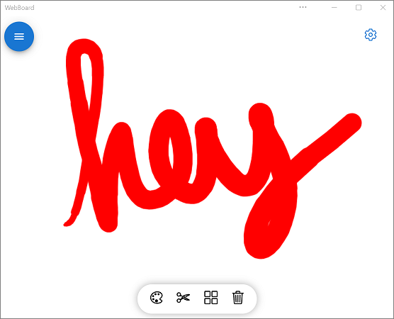

# Progressive Web App samples
<!-- sync:
https://learn.microsoft.com/microsoft-edge/progressive-web-apps/samples/index
https://github.com/MicrosoftEdge/Demos/blob/main/README.md#progressive-web-apps-pwas
sync'd Oct. 17, 2025
-->

These demo PWAs show how to use features and APIs that can progressively enhance your apps when installed on devices.

The first sample to use when getting started is the [Temperature converter sample](./temperature-converter.md).

See the Readme file for the sample; some samples require setup and don't work if you just click the app's link below.

Most of these PWA demos are in the [MicrosoftEdge / Demos](https://github.com/MicrosoftEdge/Demos?tab=readme-ov-file#progressive-web-apps-pwas) repo.

<!-- sort h2's by repo then by dir name, to match https://github.com/MicrosoftEdge/Demos?tab=readme-ov-file#progressive-web-apps-pwas -->

<!-- ====================================================================== -->
## 1DIV
<!-- "MicrosoftEdge / Demos" repo -->

1DIV is a CSS editor that lets users create drawings by creating just one HTML element and CSS code.

[Readme and source code](https://github.com/MicrosoftEdge/Demos/tree/main/1DIV/), [App](https://microsoftedge.github.io/Demos/1DIV/dist/).

1DIV uses the following features:

| Feature | Description | Documentation |
|:--- |:--- |:--- |
| Window Controls Overlay | 1DIV uses the space normally reserved by the title bar to display a logo, search field, and button. | [Display content in the title bar area using Window Controls Overlay](../how-to/window-controls-overlay.md) |

<!-- ====================================================================== -->
## Email client
<!-- "MicrosoftEdge / Demos" repo -->

A simulated email client PWA that demonstrates how to use PWA protocol handlers.

[Readme and source code](https://github.com/MicrosoftEdge/Demos/tree/main/email-client/), [App](https://microsoftedge.github.io/Demos/email-client/).

Email client uses the following features:

| Feature | Description | Documentation |
|:--- |:--- |:--- |
| Protocol Handling | `mailto` links are handled by the app to start composing a new email. | [Handle protocols in a PWA](../how-to/handle-protocols.md) |

<!-- ====================================================================== -->
## Application Title Meta Tag
<!-- "MicrosoftEdge / Demos" repo -->

A demo web app to showcase the `application-title` meta tag.

[Readme and source code](https://github.com/MicrosoftEdge/Demos/tree/main/pwa-application-title), [App](https://microsoftedge.github.io/Demos/pwa-application-title/).

Application Title Meta Tag uses the following features:

| Feature | Description | Documentation |
|:--- |:--- |:--- |
| `application-title` meta tag | The PWA makes runtime changes to the `<meta name="application-title" content="">` element. | [application-title](https://developer.mozilla.org/docs/Web/HTML/Reference/Elements/meta/name#application-name) in _&lt;meta&gt; name attribute_ at MDN. |

<!-- ====================================================================== -->
## PWA Background Sync
<!-- "MicrosoftEdge / Demos" repo -->

The PWA Background Sync demo lets you send messages even when offline.  If you're offline when sending a message, the app uses Background Sync to send the message later, when you're back online.<!-- todo: update/sync main Readme to be less general, more specific to this demo: https://github.com/MicrosoftEdge/Demos/blob/main/README.md#progressive-web-apps-pwas -->

[Readme and source code](https://github.com/MicrosoftEdge/Demos/tree/main/pwa-background-sync/), [App](https://microsoftedge.github.io/Demos/pwa-background-sync/).

The PWA Background Sync API demo uses the following features:

| Feature | Description | Documentation |
|:--- |:--- |:--- |
| Background Sync | Enables using the PWA when offline; synchronizes data with the server when the network connection is restored. | [Synchronize and update a PWA in the background](../how-to/background-syncs.md) |

<!-- ====================================================================== -->
## PWA file handlers
<!-- "MicrosoftEdge / Demos" repo -->

The PWA file handlers app handles `*.txt` files like a native application does.

[Readme and source code](https://github.com/MicrosoftEdge/Demos/tree/main/pwa-file-handlers/), [App](https://microsoftedge.github.io/Demos/pwa-file-handlers/).

The PWA file handlers app uses the following features:

| Feature | Description | Documentation |
|:--- |:--- |:--- |
| File Handling | The `file_handlers` web app manifest member enables a PWA to handle file types like a native application does. | [Handle files in a PWA](../how-to/handle-files.md) |

<!-- ====================================================================== -->
## PWA installer

A PWA that uses the Web Install API to install other PWAs.  Also uses CSS Masonry.

[Readme and source code](https://github.com/MicrosoftEdge/Demos/tree/main/pwa-installer/), [App](https://microsoftedge.github.io/Demos/pwa-installer/).

PWA installer uses the following features:

| Feature | Description | Documentation |
|:--- |:--- |:--- |
| Web Install API | PWA installer uses the `navigator.install()` API to install other PWAs on the device. | [Web Install API](https://github.com/MicrosoftEdge/MSEdgeExplainers/blob/main/WebInstall/explainer.md) |
| CSS Masonry | Instead of a strict grid that has gaps below shorter items, the items in the following row are raised up to fill the gaps. | [Masonry layout](https://developer.mozilla.org/en-US/docs/Web/CSS/CSS_grid_layout/Masonry_layout) |

See also:
* [Microsoft Edge: Web Install API Dev Trial Live](https://www.linkedin.com/feed/update/urn:li:activity:7348768177993998337/)
* [Web Install API](https://github.com/MicrosoftEdge/MSEdgeExplainers/blob/main/WebInstall/explainer.md) - explainer.

<!-- ======================================================================
## Web Install Sample
"Kbhlee2121 / pwa" repo

* [App](https://kbhlee2121.github.io/pwa/web-install/index.html) - requires the web-app-installation-api flag.
* [/web-install/](https://github.com/Kbhlee2121/pwa/tree/master/web-install) - source code directory.  no readme
* [/pwa-web-install-api/](https://github.com/MicrosoftEdge/Demos/tree/main/pwa-web-install-api/)
   * [Readme file](https://github.com/MicrosoftEdge/Demos/blob/main/pwa-web-install-api/README.md)
-->

<!-- ====================================================================== -->
## Timer PWA
<!-- "MicrosoftEdge / Demos" repo -->

Has a **Set timer** button, and you can set the duration of the timer.

[Readme and source code](https://github.com/MicrosoftEdge/Demos/tree/main/pwa-timer/), [App](https://microsoftedge.github.io/Demos/pwa-timer/).

<!-- ====================================================================== -->
## PWA To Do
<!-- "MicrosoftEdge / Demos" repo -->

Create lists of tasks locally in your browser, or by installing the app.  Click the **About** link in the rendered demo.

[Readme and source code](https://github.com/MicrosoftEdge/Demos/tree/main/pwa-to-do/), [App](https://microsoftedge.github.io/Demos/pwa-to-do/).

<!-- ====================================================================== -->
## PWAmp
<!-- "MicrosoftEdge / Demos" repo -->

PWAmp is a desktop music player that plays local and remote audio files.

[Readme and source code](https://github.com/MicrosoftEdge/Demos/tree/main/pwamp/), [App](https://microsoftedge.github.io/Demos/pwamp/).

PWAmp uses the following features:

| Feature | Description | Documentation |
|:--- |:--- |:--- |
| Window Controls Overlay | The space normally reserved to the title bar can be used by PWAmp to display a visualization of the current song. | [Display content in the title bar area using Window Controls Overlay](../how-to/window-controls-overlay.md) |
| Protocol Handling | Links that start with `web+amp:` can be used to share remote songs. | [Handle protocols in a PWA](../how-to/handle-protocols.md) |
| File Handling | Audio files can be opened with PWAmp directly. Right-click on a file ending with `.mp3` for example and click **Open with**. | [Handle files in a PWA](../how-to/handle-files.md) |
| Web Share | Songs can be shared with other apps through the operating system sharing dialog. | [Sharing content](../how-to/share.md#sharing-content) |
| Share Target | Other apps can share audio files with PWAmp, through the operating system sharing dialog. | [Receiving shared content](../how-to/share.md#receiving-shared-content) |
| Widget | A mini-player Widget can be installed in Windows 11 Widgets dashboard to see the current song. | [Display a PWA widget in the Windows Widgets Board](../how-to/widgets.md) |
| Sidebar | PWAmp can be pinned to the sidebar in Microsoft Edge. | [Build a PWA for the sidebar in Microsoft Edge](../how-to/sidebar.md) |

<!-- ====================================================================== -->
## Temperature converter
<!-- "MicrosoftEdge / Demos" repo -->

A simple PWA demo app that converts temperatures.  See [Temperature converter sample](./temperature-converter.md).

[Readme and source code](https://github.com/MicrosoftEdge/Demos/tree/main/temperature-converter/), [App](https://microsoftedge.github.io/Demos/temperature-converter/).

<!-- ====================================================================== -->
## wami
<!-- "MicrosoftEdge / Demos" repo -->

wami can apply a sequence of image manipulation steps such as cropping, resizing, rotating, or adding effects on batch of images.

[Readme and source code](https://github.com/MicrosoftEdge/Demos/tree/main/wami/), [App](https://microsoftedge.github.io/Demos/wami/).

wami uses the following features:

| Feature | Description | Documentation |
|:--- |:--- |:--- |
| Window Controls Overlay | The space normally reserved to the title bar can be used by wami. | [Display content in the title bar area using Window Controls Overlay](../how-to/window-controls-overlay.md) |
| File System Access | wami can save transformed images back to disk. | [File System Access API](https://developer.mozilla.org/docs/Web/API/File_System_Access_API) |

<!-- end of "MicrosoftEdge / Demos" repo -->

<!-- ====================================================================== -->
<!-- ## Demos in a repo other than the Demos repo -->
<!-- ====================================================================== -->
## BPM Techno
<!-- "webmaxru / bpm-counter" repo -->

BPM Techno analyzes audio via the device microphone and displays a real-time beats-per-minute (BPM) counter.

[Readme and source code](https://github.com/webmaxru/bpm-counter/), [App](https://bpmtech.no).

This demo is in the [webmaxru / bpm-counter](https://github.com/webmaxru/bpm-counter/) repo.

BPM Techno uses the following features:

| Feature | Description | Documentation |
|:--- |:--- |:--- |
| Shortcuts | BPM Techno defines a shortcut that lets users upload an audio file in the app. | [Define app shortcuts (long-press or right-click menus)](../how-to/shortcuts.md) |
| File Handling | BPM Techno natively handles `*.mp3` files. | [Handle files in a PWA](../how-to/handle-files.md) |
| Share Target | Other apps can share audio files with BPM Techno, through the operating system sharing dialog. | [Receiving shared content](../how-to/share.md#receiving-shared-content) |
| Protocol Handling | The app handles `web+bpm:` URIs which can be used to send links to a song to be analyzed. | [Handle protocols in a PWA](../how-to/handle-protocols.md) |

<!-- ====================================================================== -->
## Webboard
<!-- "pwa-builder / web-whiteboard" repo -->

Webboard is a drawing application.

[Readme and source code](https://github.com/pwa-builder/web-whiteboard/), [App](https://webboard.app).

This demo is in the [pwa-builder / web-whiteboard](https://github.com/pwa-builder/web-whiteboard/) repo.

Webboard uses the following features:

| Feature | Description | Documentation |
|:--- |:--- |:--- |
| Web Share | Drawings can be shared with other apps through the operating system sharing dialog. | [Sharing content](../how-to/share.md#sharing-content) |

<!-- ====================================================================== -->
## See also

* [Clone the Edge Demos repo to your drive](../../devtools/samples/index.md#clone-the-edge-demos-repo-to-your-drive) in _Sample code for DevTools_.
