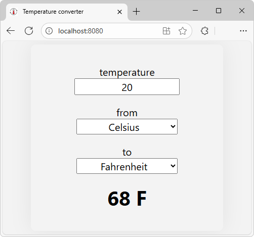
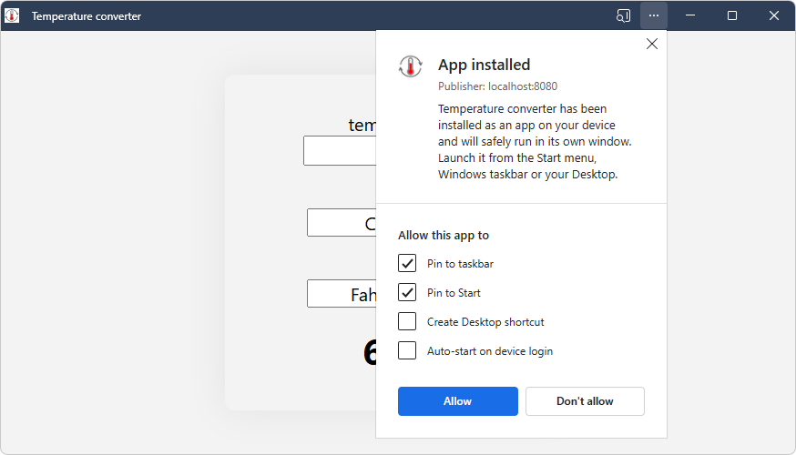
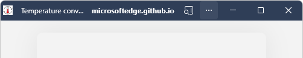
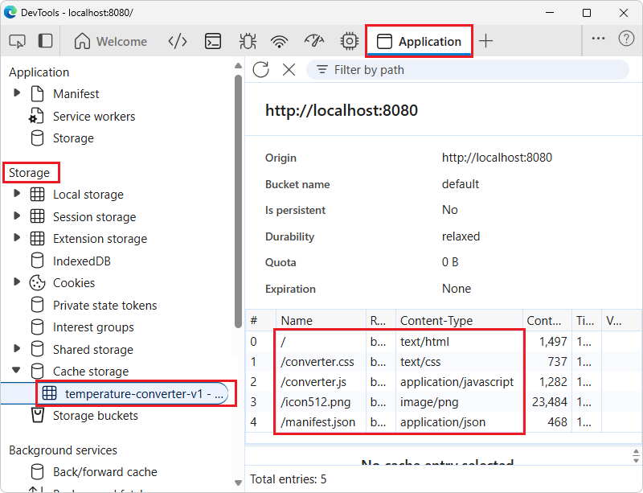

# Temperature converter sample

The Temperature converter sample is a Progressive Web App (PWA) that demonstrates the basics of how to build a PWA.  You can modify this sample to start creating your own PWA.

This article covers how to obtain the sample, install it on Windows, run the sample, and modify it.  This sample works with multiple operating systems, including Windows.  This article provides steps for Windows; other platforms have similar steps.

See also:
* [Get started developing a PWA](../how-to/index.md).


<!-- ====================================================================== -->
## Step 1: Preview the app running in a browser window

To examine the user interface of the app:

1. In Microsoft Edge, go to the live [Temperature converter](https://microsoftedge.github.io/Demos/temperature-converter/) sample web app in a new window or tab (hosted at github.io):

   

   The sample Progressive Web App (PWA) is initially shown in the browser, as a web app, but also has an **App available** () button in the Address bar (don't click it yet).

1. In the **temperature** text box, type **22**.

   The displayed temperature changes to **71.6 F**.

1. Click the **from** dropdown list, and then click outside of it.

1. Click the **to** dropdown list, and then click outside of it.

   Available units are:
   * **Celsius**
   * **Fahrenheit**
   * **Kelvin**

1. Close the browser tab for the app.

In a later step, after the sample Progressive Web App (PWA) is installed as a local app, the app runs in its own window:


The sample is a Progressive Web App, rather than a regular web site.  Therefore, you can install the Progressive Web App (PWA) as an app on the device, and the app's window contains the same app UI as within the full web browser.

The installed app's window is a browser-based window, without most of the browser UI.  The installed app is integrated into the device's UI, such as the Windows taskbar and Windows Start menu.

The above instance of the sample app is hosted at `github.io`.  In the sections below, you use a local server instead, to show how to locally test a Progressive Web App (PWA) while developing it.  You'll access the web app from your local server (`localhost`) instead, and install it to your device from there.


<!-- ====================================================================== -->
## Step 2: Install Visual Studio Code

Visual Studio Code enables viewing the sample code, modifying the sample, and creating your own Progressive Web App (PWA) by using the sample as a starting point.

Install (or optionally update) VS Code, as follows:

1. Press the **Windows** key, enter **Visual Studio Code**, and then click **Open**.

1. If Visual Studio Code isn't installed, go to [Visual Studio Code](https://code.visualstudio.com) and then download and install it.


<!-- ====================================================================== -->
## Step 3: Install git

Install or update git, as follows:

1. Open Visual Studio Code.

1. In the **View** menu, select **Terminal**.<!-- For details, see [Terminal Basics](https://code.visualstudio.com/docs/terminal/basics) in the VS Code docs. -->

1. Enter the command: `git -v`

   If git is installed, a version number is displayed, such as `git version 2.51.0.windows.2`.

1. Go to [Downloads](https://git-scm.com/downloads) at git-scm.com.

   In the upper right, note the **Latest version** number, such as **2.51.1**.

1. If git isn't installed yet, or you want to update it, download and install the latest version of git, from [Downloads](https://git-scm.com/downloads) at git-scm.com.  Otherwise, skip to the next section, below.

1. During installation, you can accept the defaults, except it's recommended that you change the default editor from vim to Visual Studio Code:

   


<!-- ====================================================================== -->
## Step 4: Install Node.js

Node.js includes a web server that you'll use to run and test the sample locally.

Install or update Node.js, as follows:

1. Open Visual Studio Code.

1. In the **View** menu, select **Terminal**.

1. Enter the command: `node -v`

   If Node.js has been installed, a version number is output, such as v22.19.0.

1. Go to [Node.js](https://nodejs.org).

1. In the lower left, in the **Latest LTS** button, note the version number, such as v22.20.0.

1. If Node.js isn't installed yet, or you want to update it, click the **Get Node.js** button.  Otherwise, skip to the next section, below.

   You end up at a page such as [Download Node.js](https://nodejs.org/download).

1. Click the **Windows Installer (.msi)** button.

   The **Downloads** window of Microsoft Edge opens, and displays a file name such as `node-v22.20.0-x64.msi`.

1. Click the **open file** link under the file name.

   The **Node.js Setup Wizard** window opens.

1. Click the **Next** button, and follow the prompts.  You can accept the defaults, and then click the **Install** button.

   The **Node.js Setup Wizard** window closes.

1. In VS Code's terminal, enter the command: `node -v`

   The latest version number is displayed, such as v22.20.0.


<!-- ====================================================================== -->
## Step 5: Fork and clone the "MicrosoftEdge / Demos" repo
<!-- compare: https://learn.microsoft.com/microsoft-edge/devtools/sample-code/sample-code#clone-the-edge-demos-repo-to-your-drive -->

Next, you'll get a local copy of the sample code, by forking the Microsoft Edge / Demos repo.  Because you don't have permissions to directly push commits to the Demos open-source repo, you'll _fork_ the Demos repo to create your own copy of the repo, instead of _cloning_ the Demos repo.

You might be able to download the "main" branch of the Demos repo, and edit the files in the "main" branch, rather than forking and cloning the repo and then creating a working branch (test1) in which to edit the files.  This article shows the more complex but flexible way: forking the repo.

Fork and clone the **MicrosoftEdge / Demos** repo, as follows:

1. Press **Windows+E**.

   File Explorer opens.

   **Check whether Demos repo has been cloned:**

1. Navigate to where you want the repo cloned to, such as:

   `C:\Users\localAccount\GitHub\`

   If the repo hasn't been cloned yet, such as ``C:\Users\localAccount\GitHub\Demos\``, do the following steps; otherwise, skip to the next section.

   **Fork the repo:**

1. Open the [MicrosoftEdge / Demos](https://github.com/MicrosoftEdge/Demos) repo in a new window or tab.

1. In the upper right, click the down-arrow on the **Fork** button, and then select **Create a new fork**.

   For more information, see [Forking a repository](https://docs.github.com/pull-requests/collaborating-with-pull-requests/working-with-forks/fork-a-repo#forking-a-repository) in _Fork a repository_ in GitHub Docs.

1. Click the **Create fork** button.

   **Clone your fork to the local drive:**

1. On GitHub, navigate to your fork of the **MicrosoftEdge / Demos** repository.

1. Above the list of files, click the **Code** button.

1. In the **HTTPS** tab, click the **Copy to clipboard** () button.

   <!-- Or, to clone the repository using an SSH key, including a certificate issued by your organization's SSH certificate authority, click the **SSH** tab, and then click the **Copy to clipboard** () button. -->

   <!-- Or, to clone a repository using GitHub command-line interface, click the **GitHub CLI** tab, and then click the **Copy to clipboard** () button. -->

1. Open Visual Studio Code.

1. In the **View** menu, select **Terminal**.

1. Change to the directory where you want to clone the Demos repo:

   ```console
   cd ~/GitHub
   ```

   Or enter the following command, specifying your local account:

   ```console
   cd c:/users/localAccount/GitHub/
   ```

1. Type `git clone`, and then paste the URL you copied earlier.  It will look like this, with your GitHub username instead of YOUR-USERNAME:

   ```console
   git clone https://github.com/YOUR-USERNAME/Demos.git
   ```

1. Press **Enter**.

   A local clone of your forked Demos repo is created.

See also:
* [Fork a repository](https://docs.github.com/pull-requests/collaborating-with-pull-requests/working-with-forks/fork-a-repo)
   * [Forking a repository](https://docs.github.com/pull-requests/collaborating-with-pull-requests/working-with-forks/fork-a-repo#forking-a-repository) in _Fork a repository_.
   * [Cloning your forked repository](https://docs.github.com/pull-requests/collaborating-with-pull-requests/working-with-forks/fork-a-repo#cloning-your-forked-repository) in _Fork a repository_.
* [Cloning a repository](https://docs.github.com/repositories/creating-and-managing-repositories/cloning-a-repository)


<!-- ====================================================================== -->
## Step 6: Run the PWA as a web app on your local web server

Next, you'll run and test the sample Progressive Web App (PWA) on your local web server, in Microsoft Edge.  You'll use `http-server`, a local development web server that can be run in Node.js.

While developing or testing a web site or app, including a PWA, you can use a local web server.  However, when the app is ready for users, you deploy the app to the web by using a web hosting provider.  Like a regular web site or app, a PWA is distributed to users by using a web server.

Change to the `/temperature-converter/` directory of the cloned Demos repo, and start the `http-server` from there, as follows:

1. Open Visual Studio Code.

1. In the **File** menu, select **Open Folder**.

   The **Open Folder** dialog opens.

1. Navigate to the cloned Demos repo folder, such as `C:\Users\localAccount\GitHub\Demos\`, select the `\temperature-converter\` folder in it, and then click the **Select Folder** button.

1. In the **View** menu, select **Terminal**.

   The **Terminal** pane opens, with the prompt at `Demos\temperature-converter\`, such as `C:\users\localAccount\GitHub\Demos\temperature-converter`.

1. Enter the following command:

   ```console
   npx http-server
   ```

   The local development web server starts, using the `http-server` NPM package:

   

1. If you get a "running scripts is disabled" error (if VS Code's Terminal is using PowerShell), enter the execution policy PowerShell command, and then issue the npx command again:

   ```console
   Set-ExecutionPolicy -ExecutionPolicy Bypass -Scope CurrentUser
   npx http-server
   ```

   Example output:

   ```console
   Need to install the following packages:
   http-server@14.1.1
   Ok to proceed? (y)
   ```

1. If needed, press **Y** and then **Enter**.

   Output is displayed, such as:

   ```console
   Starting up http-server, serving ./
   ...
   Available on:
     http://10.0.1.2:8080
     http://127.0.0.1:8080
   Hit CTRL-C to stop the server
   ```

1. In Microsoft Edge, go to [http://localhost:8080](http://localhost:8080) (or an equivalent URL that was output in the terminal, from the `npx http-server` command).

   The temperature convertor app is displayed in the browser:

   


<!-- ====================================================================== -->
## Step 7: Install the PWA from your localhost web server as a local app

Install the sample Progressive Web App (PWA) from your localhost web server as an app on Windows, as follows:

1. In the Address bar, click the **App available. Install temperature converter** () button.

   An **Install app** dialog opens:

   

1. Click the **Install** button.

   The app is installed locally.  The **App installed** dialog opens within the app:

   

1. Click the **Allow** button.

   A Windows **Apps** dialog asks "Would you like to pin Temperature convertor to your taskbar?  This request is coming from Temperature convertor."

1. Click the **Yes** button.

   The **Temperature convertor** app's icon () appears on the Windows taskbar.

   The Temperature convertor app is displayed within its own app window:

   

   The window is a browser window without most of the browser UI.

1. Close the **Temperature converter** app window.

<!-- See also:
* [Installing a PWA](../ux.md#installing-a-pwa) in _Use PWAs in Microsoft Edge_.
-->


<!-- ====================================================================== -->
## Step 8: Open the installed app

Run the sample Progressive Web App (PWA) as a local app on the device.

1. Press the **Windows** key, start typing **Temperature converter**, and then click **Open**.

   The installed **Temperature converter** app opens in its own window.

   Because you installed the app from `localhost`, when you start the app, the right side of the title bar displays **localhost:8080** for a few seconds:

   

   If you had installed the app from the `github.io` server, when you start the app, the right side of the title bar would instead display **microsoftedge.github.io** for a few seconds:

   

   You can also open the installed app by other ways that are supported by the device, such as the **Temperature convertor** () button pinned to the Windows taskbar.

1. In the **temperature** text box, enter **22**.

   The displayed temperature is updated to **71.6 F**.

1. Click the **from** and **to** dropdown lists.

   Available units are:
   * **Celsius**
   * **Fahrenheit**
   * **Kelvin**


<!-- ====================================================================== -->
## Step 9: Examine the service worker handling offline caching

The local app window for a Progressive Web App (PWA) is a browser-based window, so Microsoft Edge DevTools can be used to work with the PWA.

Confirm that the service worker (`sw.js`) is running when you open the PWA as a local app, as follows:

1. Open the installed **Temperature converter** app.

1. Right-click in the app window (below the title bar), and then select **Inspect**.

   DevTools opens, in a separate window; undocked.  (Other docking options are dimmed and not available.)  The app window is a browser window that includes the DevTools **Inspect** command.

1. In DevTools, select the **Application** () tool.

1. In the tree on the left, in the **Application** section, select **Service workers**.

   Information about the service worker is displayed:

   

   The service worker's **Source** is `sw.js`, with **Status** of **activated and is running**.

1. In the tree on the left, in the **Storage** major section, expand **Cache storage**, and then select **temperature-converter-v1**:

   

   The service worker cache is displayed.  All of the resources that are cached by the service worker (or cached automatically by the browser) are listed:
   * `/` (`index.html`) - The HTML webpage of the app, defining layout of controls.
   * `/converter.css` - The styling for the webpage of the app.
   * `/converter.js` - The JavaScript file containing the app logic.
   * `/icon512.png` - The app icon image file to represent the app.
   * `/manifest.json` - The app manifest, containing basic information about the app, for the device's operating system to use.

   The service worker adds three files to the cache, explicitly (`.html`, `.css`, and `.js`).  The icon (`.png`) and manifest (`.json`) are cached automatically by the browser.


<!-- ====================================================================== -->
## Step 10: Use DevTools to turn off the internet connection and test the PWA offline

Try the Progressive Web App (PWA) as an offline app, as follows:
 
1. In the DevTools window, open the **Network** () tool.

1. Near the top, in the **Throttling**<!-- no tooltip --> menu to the right of the **Disable cache** checkbox, change from **No throttling** to **Offline**:

   

   The **Network** tab adds a warning icon to remind you of this throttling.

1. In the Temperature convertor window, right-click and then select **Refresh**.<!-- Detail: Don't select "Hard refresh and empty cache", because if you were to empty the cache, the app would stop working.  The job of a service worker is to put resources in the cache so that the app can work offline.  If you empty the cache, the files that the app needs aren't there anymore, and need to be downloaded again. -->

1. In the **temperature** text box, type **22**.

   The displayed temperature changes to **71.6 F**.  The app is still displayed correctly and still works correctly, by using locally cached resources that are managed by the service worker.

1. In the DevTools window, in the **Throttling**<!-- no tooltip --> menu to the right of the **Disable cache** checkbox, change from **Offline** back to **No throttling**.

   The throttling warning icon is removed from the **Network** tab.

1. Close the DevTools window.

1. Close the **Temperature converter** app window.

This same use of DevTools also works when the app is in Microsoft Edge as a web app, rather than an installed app.  For more information, see [Emulate offline](../../devtools/network/reference.md#emulate-offline) in _Network features reference_.


<!-- ====================================================================== -->
## Step 11: Uninstall the installed app

Uninstall the Progressive Web App (PWA), as follows:

1. Click the **Temperature converter** button pinned on the Windows taskbar.

   The installed **Temperature converter** app opens.

1. In the title bar, click the **Settings and more** () button, and then click **App settings**.

   In Microsoft Edge, the **Apps** tab opens (`edge://apps`), displaying details about the **Temperature converter** app:

   

1. At the bottom, click the **Uninstall** button.

   The **Uninstall app from Microsoft Edge on all synced devices?** dialog opens.

1. Select the **Delete app history and data** checkbox, and then click the **Uninstall** button.


<!-- ------------------------------ -->
#### Uninstalling a local app from the Windows Start menu

Note: As an example of OS integration, you could uninstall the app via the Windows Start menu, as follows:

1. Press the **Windows** key.

1. Start typing "temperature converter".

1. Click **Uninstall**:

   


<!-- ------------------------------ -->
#### Uninstalling a local app by starting from Microsoft Edge

Note: As an alternative, you could uninstall the sample Progressive Web App (PWA) by starting from Microsoft Edge, as follows:

1. In Microsoft Edge, select **Settings and more** (**...**) > **More tools** > **Apps** > **View apps**.

   The **Apps** dialog opens within Microsoft Edge, listing any installed PWAs:

   

1. Right-click the **Temperature converter** card, and then click **Manage app**.

   The **All apps / Temperature converter** page opens, at `edge://apps`.

1. At the bottom, click the **Uninstall** button.

Continue with the steps below.


<!-- ====================================================================== -->
## Step 12: Modify the sample

You can modify the sample as a starting point for your own Progressive Web App (PWA).  You'll change the name of the app from "Temperature converter" to "TC", in a working branch of the repo, and then install the modified app locally.

Create a working branch and switch to it, as follows:

1. Open Visual Studio Code.

   **Open the folder in VS Code**

1. In the **File** menu, select **Open Folder**.

   The **Open Folder** dialog opens.

1. Navigate to the cloned Demos repo folder, such as `C:\Users\localAccount\GitHub\Demos\`, select the `temperature-converter` folder inside it, and then click the **Select Folder** button.

1. In the **Explorer** pane, open `\temperature-converter\index.html`.

   

   In the lower left corner of Visual Studio Code, the **main** branch is indicated.

   **Create a working branch and switch to it**

1. In Visual Studio Code, in the **View** menu, select **Terminal**.

1. Press **Ctrl+C**.

   The localhost web server (http-server) stops, if it was running.  The prompt shows the current path, such as: `PS C:\Users\localAccount\GitHub\Demos\temperature-converter>`

   It's not necessary to stop the server, to modify the code and view the result.  We're just temporarily stopping the server in **Terminal** in order to return to the prompt, to enter some git commands.

1. Enter the following command, to create a working branch of the repo and switch to it:

   ```console
   git checkout -b test1
   ```

   If the branch already exists, the command outputs: "fatal: a branch named 'test1' already exists".

1. If the branch already exists, enter the following command, to switch to the branch:

   ```console
   git checkout test1
   ```

   Example output: `Switched to a new branch 'test1'`

   In the lower left of Visual Studio Code, the branch changes from **main** to **test1**.

1. Close the **Terminal** pane.

   In the lower left corner of Visual Studio Code, the **test1** branch is indicated:

   

   **Modify the files**

1. In Visual Studio Code, in the **Explorer** pane, open `/temperature-converter/index.html`.

1. In `index.html`, change the app's name in two lines from "Temperature converter" to "TC", as follows:

   Change from:

   ```html
   <title>Temperature converter</title>
   <meta name="application-name" content="Temperature converter">
   ```

   to:

   ```html
   <title>TC</title>
   <meta name="application-name" content="TC">
   ```

1. Save the file.

1. In the **Explorer** pane, open `/temperature-converter/manifest.json`.

1. In `manifest.json`, change the app's name in two lines from "Temperature converter" to "TC", as follows:
   
   Change from:

   ```json
   "name": "Temperature converter",
   "short_name": "Temperature converter",
   ```

   to:

   ```json
   "name": "TC",
   "short_name": "TC",
   ```

1. Save the file.


<!-- ====================================================================== -->
## Step 13: View the modified app in the browser

View the modified app in the browser, as follows:

1. In Visual Studio Code, in the **View** menu, select **Terminal**.

   **Start the server**

   We previously stopped the web server in **Terminal**, just to enter some git commands to switch to a working branch.

1. Enter the following command:

   ```console
   npx http-server
   ```

   The local development web server starts again.

   **View the web app**

1. In Microsoft Edge, go to [http://localhost:8080](http://localhost:8080) (or an equivalent URL that was output in the terminal, from the `npx http-server` command).

1. Refresh (**F5**) the webpage.

   This doesn't give the desired result.  Refresh reloads the webpage from the browser's cache, so you see the app that was cached before at that URL (the tab title is **Temperature converter**).

1. Hard refresh (**Shift+F5**) the webpage.

   Hard refresh shows the current content directly from the web server.

   The tab title changes from **Temperature converter** to **TC**:

   


<!-- ====================================================================== -->
## Step 14: Re-install the modified sample as a local app

Install the modified app from `localhost` in the browser onto the device, as follows:

1. Continuing from above: In Microsoft Edge, in the Address bar, click the **App available. Install TC** () button.

   An **Install TC app** dialog opens within the browser:

   

1. Click the **Install** button.

   The modified app is installed locally.  The **App installed** dialog opens within the app:

   

1. Click the **Allow** button.

   A Windows **Apps** dialog asks "Would you like to pin TC to your taskbar?  This request is coming from TC."

1. Click the **Yes** button.

   The **TC** app's icon () appears on the Windows taskbar.

   The TC app is displayed within its own window, and the title bar now reads **TC**:

   


<!-- ====================================================================== -->
## Step 15: Uninstall the modified local app

Uninstall the modified local app as follows:

1. In the TC app window, select **Settings and more** (**...**) > **App settings**.

   In Microsoft Edge, the **Apps** tab opens, displaying details about the **TC** app.

1. At the bottom, click the **Uninstall** button.

   The **Uninstall app from Microsoft Edge on all synced devices?** dialog opens.

1. Select the **Delete app history and data** checkbox, and then click the **Uninstall** button.


<!-- ====================================================================== -->
## Step 16: Stop the development web server

1. In Visual Studio Code, in the **View** menu, select **Terminal**.

1. Press **Ctrl+C**.

   The server stops, with output message: `http-server stopped.`

This is the end of the steps for the sample.


<!-- ====================================================================== -->
## Speeding up the modify/re-install cycle

You can skip some of the above steps each time you modify the app, depending on which files you modify:

* If you modify an HTML file, CSS file, or the main JavaScript file, you can skip uninstalling and re-installing the app.  Empyting the cache and refreshing the page is enough to reload HTML, CSS, and JavaScript changes.

* If you modify the manifest file, you must uninstall and re-install the app.


<!-- ------------------------------ -->
#### PWA button in the Address bar

After the app has been installed, if you go to the web app in the browser, the PWA button in the Address bar has changed from an **App available** () button to an **Open in app** () button.

If you click the **Open in app** () button, the **Open Temperature converter** dialog opens in the browser:


<!-- ====================================================================== -->
## Next steps

Next, you can:

* Study the code; see [Temperature converter source files](./temperature-converter-source-files.md).

* Make additional minor modifications of the sample's code.

* Copy and paste the entire sample directory `/Demos/temperature-converter/` and modify the code to create your own Progressive Web App (PWA).


<!-- ====================================================================== -->
## See also
<!-- all links in article -->

* [Use PWAs in Microsoft Edge](../ux.md)
   * [Installing a PWA](../ux.md#installing-a-pwa) in _Use PWAs in Microsoft Edge_.
* [Get started developing a PWA](../how-to/index.md)
* [Temperature converter source files](./temperature-converter-source-files.md)
* [Emulate offline](../../devtools/network/reference.md#emulate-offline) in DevTools _Network features reference_.

Localhost:
* [http://localhost:8080](http://localhost:8080) - or equivalent URLs output by the `npx http-server` command.

GitHub:
* [MicrosoftEdge / Demos](https://github.com/MicrosoftEdge/Demos) repo.
   * [Temperature converter](https://microsoftedge.github.io/Demos/temperature-converter/) sample hosted at github.io.
* [Fork a repository](https://docs.github.com/pull-requests/collaborating-with-pull-requests/working-with-forks/fork-a-repo)
   * [Forking a repository](https://docs.github.com/pull-requests/collaborating-with-pull-requests/working-with-forks/fork-a-repo#forking-a-repository) in _Fork a repository_.
   * [Cloning your forked repository](https://docs.github.com/pull-requests/collaborating-with-pull-requests/working-with-forks/fork-a-repo#cloning-your-forked-repository) in _Fork a repository_.
* [Cloning a repository](https://docs.github.com/repositories/creating-and-managing-repositories/cloning-a-repository)

VS Code:
* [Visual Studio Code](https://code.visualstudio.com)

git:
* [Downloads](https://git-scm.com/downloads) at git-scm.com.

Node.js:
* [Node.js](https://nodejs.org)
* [Download Node.js](https://nodejs.org/download)
