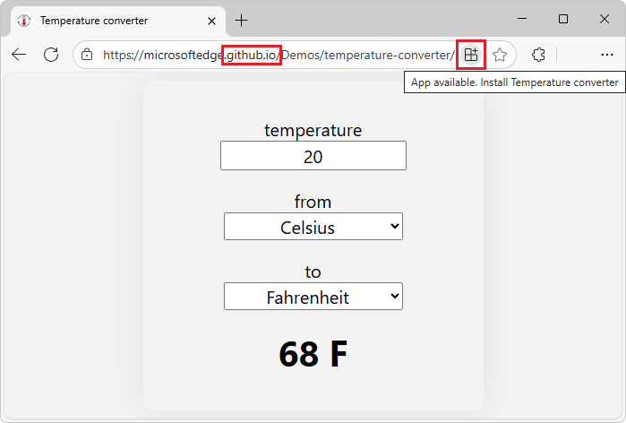
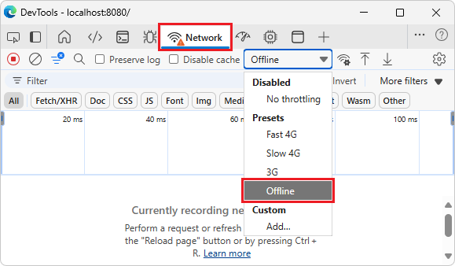

# Temperature converter sample

The Temperature converter sample is a Progressive Web App (PWA).

This article covers how to obtain the sample, install it on Windows<!-- per https://github.com/MicrosoftDocs/edge-developer/issues/1974 -->, and run the sample.

The sample PWA is initially shown in the browser, with an **App available** button in the Address bar:



Below, you'll access the web app from `localhost` (as you'd do during development) instead of from `github.io`, and install it to the local machine from there.

The sample PWA installed locally:


<!-- ====================================================================== -->
## Preview the sample

To examine the user interface of the app:

1. On Windows, in Microsoft Edge, go to the [Temperature converter](https://microsoftedge.github.io/Demos/pwa-getting-started/) live sample web app in a new window or tab:

   

   This instance of the sample app is hosted at github.io.  The sections below use your own, localhost server, instead, to show how to locally test a PWA.  Your own, actual PWA, after testing it, would be hosted at your web server that users can access.

1. In the **temperature** text box, type **22**.

   As you type, the displayed temperature is updated to **71.6 F**.

1. Click the **from** and **to** dropdown lists.

   Available units are:
   * **Celsius**
   * **Fahrenheit**
   * **Kelvin**

   In the Address bar, the button **App available. Install temperature converter app** () is present, for this web app that's served at `github.io` - but we'll click that button later, when running the web app from your localhost server, which is the workflow while developing and testing a PWA.

1. Go to the [/pwa-getting-started/](https://github.com/MicrosoftEdge/Demos/tree/main/pwa-getting-started) source code directory in a new window or tab, and briefly inspect the source code files in the repo at GitHub:

   * `README.md` - Brief information about the app, for people who are looking at the directory of source code; contains a link to access the live app from the github.io web server, and a link to the present article.
   * `converter.css` - Cascading Style Sheets (CSS) file, defining layout styling of each UI control in the main page of the app.
   * `converter.js` - App logic, as JavaScript code.
   * `icon512.png` - The icon file to represent this app within the browser and on the local device.
   * `index.html` - The initial webpage defining the UI controls.  This app only has a single webpage.
   * `manifest.json` - Manifest file that makes the Progressive Web App (PWA) installable on the device, unlike a regular web app.
   * `sw.js` - Service worker that caches files on the local device and serves out the cached files when there's no internet connection.

   These files are explained in [Get started with PWAs](../how-to/index.md).

In the sections below, you'll:

1. Clone the **MicrosoftEdge / Demos** repo, to obtain a local copy of the code.

1. Run and test the sample on your localhost server, in Microsoft Edge.

1. Install the sample as an app on Windows, by clicking the **App available. Install temperature converter app** () button in the Address bar.


<!-- ====================================================================== -->
## Install Visual Studio Code

Visual Studio Code enables viewing the sample code, modifying the sample, and creating your own PWA by using the sample as a starting point.

Start or install Visual Studio Code, as follows:

1. Press the **Windows** key, enter **Visual Studio Code**, and then click **Open**.

1. If Visual Studio Code isn't installed, go to [Visual Studio Code](https://code.visualstudio.com) and then download and install it.

Continue with the next section.


<!-- ====================================================================== -->
## Install or update Node.js
<!-- todo: which shell: change article from PowerShell to Terminal within VS Code -->

Node.js includes a web server that you'll use to run and test the sample locally.

Install or update Node.js as follows:

1. Press the **Windows** key, type **PowerShell**, and then for Windows PowerShell, click **Run as Administrator**.

   Windows PowerShell command prompt opens.

1. Enter the command: `node -v`

   If Node.js has been installed, a version number is output, such as v22.14.0.

1. Go to [Node.js](https://nodejs.org).

   Note the version number in the lower left **Latest LTS** button, such as v22.20.0.

1. Click the **Get Node.js** button.

   You end up at a page such as [Download Node.js](https://nodejs.org/download).

1. Click the **Windows Installer (.msi)** button.

   The **Downloads** window of Microsoft Edge opens, and displays a file name such as `node-v22.20.0-x64.msi`.

1. Click the **open file** link under the file name.

   The **Node.js Setup Wizard** window opens.

1. Click the **Next** button, and follow the prompts.  You can accept the defaults, then click the **Install** button.

1. Follow the prompts.

   The **Node.js Setup Wizard** window closes.

1. In PowerShell, enter the command: `node -v`

   The latest version number is displayed, such as v22.20.0.

Continue with the next section.


<!-- ====================================================================== -->
## Clone the Edge Demos repo to your drive
<!-- derived from 
https://learn.microsoft.com/microsoft-edge/devtools/sample-code/sample-code#clone-the-edge-demos-repo-to-your-drive
-->

Clone the **MicrosoftEdge / Demos** repo to your local drive, as follows:

1. See whether the repo is already cloned to your local drive: 

1. Press **Windows+E**.

   File Explorer opens.

1. Navigate to where you want the repo cloned to, such as:

   `C:\Users\localAccount\GitHub`

1. See whether the `\Demos\` repo is listed.

1. In PowerShell that's opened using **Run as Administrator**, enter `git`.

   If git has been installed, usage instructions are displayed.

1. If git is not installed, go to [Download git](https://git-scm.com/downloads) and install it.

1. Go to [MicrosoftEdge / Demos](https://github.com/MicrosoftEdge/Demos) in a new window or tab.

1. Click the **Code** drop-down button, and then click the **Copy url to clipboard** button.

   The URL is copied to the clipboard: `https://github.com/MicrosoftEdge/Demos.git`

1. In PowerShell, change to the directory where you want to clone the Demos repo:

   ```console
   cd ~/GitHub
   cd c:/users/localAccount/GitHub/  # alt format
   ```

1. Enter `git clone` followed by the copied URL for the Demos repo, and then press **Enter**:

   ```console
   git clone https://github.com/MicrosoftEdge/Demos.git
   ```

1. In File Explorer, go to the new, `/Demos/` repo directory, such as:

   `C:\Users\localAccount\GitHub\Demos`

1. In File Explorer, open the `/Demos/pwa-getting-started/` directory.

   Files are listed, such as `converter.js`.

See also:
* [Cloning a repository](https://docs.github.com/en/repositories/creating-and-managing-repositories/cloning-a-repository) - GitHub docs.

Continue with the next section.


<!-- ====================================================================== -->
## Start the localhost server and web app

While developing or testing a PWA, you use a local web server.  `http-server` is a local web server that's included with the Node.js library.

Change to the `/pwa-getting-started/` directory of the cloned Demos repo, and start the `http-server` from there, as follows:

1. In PowerShell that's opened using **Run as Administrator**, change to the directory where you want to clone the Demos repo:

   ```console
   cd Demos
   cd pwa-getting-started
   ```

   You're now in a directory such as `C:\users\localAccount\GitHub\Demos\pwa-getting-started`.

1. In PowerShell, enter the following command:

   ```console
   npx http-server
   ```

1. If you get the message "File C:\Program Files\nodejs\npx.ps1 cannot be loaded because running scripts is disabled on this system", you can run a command such as:

   ```console
   Set-ExecutionPolicy -ExecutionPolicy Bypass -Scope CurrentUser
   ```

  For details, see [about_Execution_Policies](/powershell/module/microsoft.powershell.core/about/about_execution_policies) in the PowerShell docs.

  Then again enter the command:

   ```console
   npx http-server
   ```

   Output is displayed, such as:

   ```console
   Starting up http-server, serving ./
   Available on:
     http://10.0.1.12:8080
     http://127.0.0.1:8080
   ```

1. In Microsoft Edge, go to: `http://localhost:8080`

   The URL starts with http, not https.  Key parts of the Progressive Web Apps platform, such as service workers, require using HTTPS.  For debugging purposes, Microsoft Edge permits a `localhost` web server to use the PWA APIs without HTTPS.

Continue with the next section.


<!-- ====================================================================== -->
## Install the web app as a local app

Install the sample on Windows<!-- per https://github.com/MicrosoftDocs/edge-developer/issues/1974 -->, as follows:

1. In the Address bar, click the **App available. Install temperature converter app** () button.

   An **Install app** dialog opens:

   

   The sample's web app manifest enables the browser to install the app as a PWA.  The **App available** button installs the app locally.

1. Click the **Install** button.

   The app is installed locally.  The **App installed** dialog opens within the app:

   

1. In the **App installed** dialog, click the **Allow** button, and then click the **Close** (X) button.

   The app is displayed within its own app window:

   

   The app's icon is displayed in the Windows taskbar:

   

1. Close the standalone **Temperature converter app** window.

See also:
* [Installing a PWA](../ux.md#installing-a-pwa) in _Use PWAs in Microsoft Edge_.

Continue with the next section.


<!-- ====================================================================== -->
## Open the sample as a local app

1. Press the **Windows** key, start typing **Temperature converter app**, and then click **Open**.

   The installed **Temperature converter app** opens:

   

   The service worker (`sw.js`) is running.  The localhost server is automatically running<!-- todo: is npx server auto-started? -->.  When you first open the local app, the right side of the title bar displays **localhost:8080** for a few seconds.

1. In the **temperature** text box, type **22**.

   As you type, the displayed temperature is updated to **71.6 F**.

1. Click the **from** and **to** dropdown lists.

   Available units are:
   * **Celsius**
   * **Fahrenheit**
   * **Kelvin**

Continue with the next section.


<!-- ====================================================================== -->
## Monitor the service worker handling offline caching

To confirm that the service worker (`sw.js`) is running:

1. Right-click the app, and then select **Inspect**.

   DevTools opens, in a separate window<!-- todo: what type of window is this?  browser yet not browser - a webview? -->; undocked.  Other docking options are dimmed and not available.

1. In DevTools, select the **Application** () tool.

1. In the tree on the left, select **Application** > **Service workers**.

   Information about the service worker is displayed.  The service worker's **Source** is `sw.js`, with **Status** of **activated and is running**:

    

   todo: change png, or add new png: show the DevTools undocked window.

   If the service worker isn't displayed, refresh the page.

1. In the tree on the left, in the **Storage** section, expand **Cache storage**, and then select **temperature-converter-v1 - http://localhost:8080/**.

   The service worker cache is displayed.  All of the resources that are cached by the service worker are listed:
   * `/` (`index.html`) - The HTML page of the app; the initial page of the app - `index.html` - webpage layout of the app.
   * `/converter.css` - The styling for the webpage of the app.
   * `/converter.js` - The JavaScript file containing the app logic.
   * `/icon512.png` - The app icon image file to represent the app.
   * `/manifest.json` - The app manifest, containing basic information about the app, for the device's operating system to use.

   

   The service worker adds three files to the cache, explicitly (`.html`, `.css`, and `.js`).  The icon (`.png`) and manifest (`.json`) are cached automatically by the browser.

   The sample's directory includes two files that aren't cached by the service worker: 
   * `README.md` - brief information about the sample.
   * `sw.js` - the service worker that manages caching of needed files.
    
1. Try the PWA as an offline app.  In DevTools, open the **Network** tool, and change the **Throttling** value to **Offline**:

   

1. Refresh the app.  The app still appears correctly in the browser, by using cached resources that are served out by the service worker.


<!-- ====================================================================== -->
## Uninstall the sample

Uninstalling the sample by starting from the running **Temperature converter app** window:

1. Select **Settings and more** (**...**) > **App settings**.

   In Microsoft Edge, the **Apps** tab opens, displaying details about the **Temperature converter app**.

1. Click the **Uninstall** button.


Uninstalling the sample by starting from Microsoft Edge:

1. In Microsoft Edge, select **Settings and more** (**...**) > **More tools** > **Apps** > **View apps** > **Installed apps**.

1. In the **Temperature converter app** section, select **Details**, and then click the **Uninstall** button.


<!-- ====================================================================== -->
## Modify the sample
<!-- todo -->

To modify the sample, you can change to a different branch of the Demos repo.


<!-- ====================================================================== -->
## Re-install the sample, modified
<!-- todo -->


<!-- ====================================================================== -->
## Next steps

Study the code of this sample by reading [Get started with PWAs](../how-to/index.md).

Then you can:
* Make minor modifications of the sample's code.
* Copy and paste the entire sample directory and extensively modify the code to create your own PWA.


<!-- ====================================================================== -->
## See also
<!-- todo: all links in article -->

<!-- Local: -->
* [Get started with PWAs](../how-to/index.md).
* [Overview of Progressive Web Apps (PWAs)](../index.md)
* [Use PWAs in Microsoft Edge](../ux.md)
* [Installing a PWA](../ux.md#installing-a-pwa) in _Use PWAs in Microsoft Edge_.
* [Best practices for PWAs](../how-to/best-practices.md)

Demos repo:
* [Temperature converter](https://microsoftedge.github.io/Demos/pwa-getting-started/) - sample app hosted at github.io (rather than localhost).
* [Temperature converter - PWA getting started demo app](https://github.com/MicrosoftEdge/Demos/tree/main/pwa-getting-started) - source code.

MDN:
* [Web app manifests](https://developer.mozilla.org/docs/Web/Manifest) at MDN.
* [Service Worker API](https://developer.mozilla.org/docs/Web/API/Service_Worker_API) at MDN.

External Microsoft sites:
* [Visual Studio Code](https://code.visualstudio.com)
* [Azure free account](https://azure.microsoft.com/free)
* [Microsoft Azure App Service](https://azure.microsoft.com/services/app-service/web)

External sites:
* [Getting Started with Progressive Web Apps (Workshop)](https://noti.st/aarongustafson/co3b5z/getting-started-with-progressive-web-apps-workshop).
* [GitHub Pages](https://pages.github.com/)
* [Node.js](https://nodejs.org)
* [Let's Encrypt](https://letsencrypt.org/)
