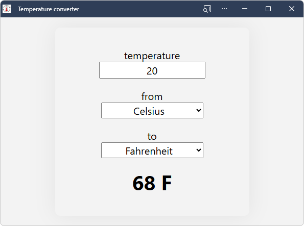
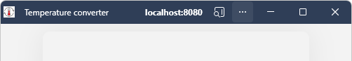

# Temperature converter sample

The Temperature converter sample is a Progressive Web App (PWA).

This article covers how to obtain the sample, install it on Windows<!-- per https://github.com/MicrosoftDocs/edge-developer/issues/1974 -->, and run the sample.

See also:
* [Get started developing a PWA](../how-to/index.md) - explains the source code of the Temperature converter sample.


<!-- ====================================================================== -->
## Preview the app running as a web app at the github.io web server

To examine the user interface of the app:

1. On Windows, in Microsoft Edge, go to the [Temperature converter](https://microsoftedge.github.io/Demos/pwa-getting-started/) live sample web app in a new window or tab:

   

   The sample Progressive Web App (PWA) is initially shown in the browser, with an **App available** button in the Address bar.

   Below, you'll access the web app from `localhost` (as you'd do during development) instead of from `github.io`, and install it to the local machine from there.

   The sample Progressive Web App (PWA) runs in its own window when it's installed locally:

   

   The window is a browser-based window, without most of the browser UI.

   This instance of the sample app is hosted at github.io.  The sections below use your own, localhost server, instead, to show how to locally test a Progressive Web App (PWA) while developing it.  Your own, actual Progressive Web App (PWA), after testing it, would be hosted at your web server that users can access.

1. In the preview of the web app at the `github.io` server, in the **temperature** text box, type **22**.

   As you type, the displayed temperature is updated to **71.6 F**.

1. Click the **from** and **to** dropdown lists.

   Available units are:
   * **Celsius**
   * **Fahrenheit**
   * **Kelvin**

   The sample is a Progressive Web App, rather than a regular web app.  Therefore, you can install the Progressive Web App (PWA) as an app on the device, and the app's window contains the same UI as within the full web browser.

   In the Address bar, the button **App available. Install temperature converter app** () is present, for this web app that's served at `github.io`.  You'll click that button later, when running the web app from your localhost server, which is the workflow while developing and testing a Progressive Web App (PWA).


<!-- ====================================================================== -->
## Install or update Visual Studio Code

Visual Studio Code enables viewing the sample code, modifying the sample, and creating your own Progressive Web App (PWA) by using the sample as a starting point.

Install or update VS Code, as follows:

1. Press the **Windows** key, enter **Visual Studio Code**, and then click **Open**.

1. If Visual Studio Code isn't installed, go to [Visual Studio Code](https://code.visualstudio.com) and then download and install it.

Continue with the next section.


<!-- ====================================================================== -->
## Install or update git

Install or update git, as follows:

1. Open Visual Studio Code.

1. In the **View** menu, select **Terminal**. <!-- For details, see [Terminal Basics](https://code.visualstudio.com/docs/terminal/basics) in the VS Code docs. -->

1. In a command prompt, enter `git -v` to check whether git is installed, and which version is installed.

   If git is installed, a version number is displayed, such as `git version 2.51.0.windows.2`.

1. If not done yet, download and install the latest version of git, from [Downloads](https://git-scm.com/downloads) at git-scm.com.

1. During installation, you can accept the defaults, except it's recommended that you change the default editor from vim to Visual Studio Code:

   

Continue with the next section.


<!-- ====================================================================== -->
## Install or update Node.js

Node.js includes a web server that you'll use to run and test the sample locally.

Install or update Node.js, as follows:

1. Open Visual Studio Code.

1. In the **View** menu, select **Terminal**.

1. Enter the command: `node -v`

   If Node.js has been installed, a version number is output, such as v22.19.0.

1. Go to [Node.js](https://nodejs.org).

   Note the version number in the lower left **Latest LTS** button, such as v22.20.0.

1. If you want to update Node.js, click the **Get Node.js** button.  Otherwise, skip to the next section, below.

   You end up at a page such as [Download Node.js](https://nodejs.org/download).

1. Click the **Windows Installer (.msi)** button.

   The **Downloads** window of Microsoft Edge opens, and displays a file name such as `node-v22.20.0-x64.msi`.

1. Click the **open file** link under the file name.

   The **Node.js Setup Wizard** window opens.

1. Click the **Next** button, and follow the prompts.  You can accept the defaults, then click the **Install** button.

1. Follow the prompts.

   The **Node.js Setup Wizard** window closes.

1. In VS Code's terminal, enter the command: `node -v`

   The latest version number is displayed, such as v22.20.0.

Continue with the next section.


<!-- ====================================================================== -->
## Clone the Edge Demos repo, to get a local copy of the code

<!-- derived from 
https://learn.microsoft.com/microsoft-edge/devtools/sample-code/sample-code#clone-the-edge-demos-repo-to-your-drive
-->

Next, you'll clone (or update) the **MicrosoftEdge / Demos** repo, to obtain a local copy of the code in the `/Demos/pwa-getting-started/` directory.

Clone (or update) the **MicrosoftEdge / Demos** repo, as follows:


If the Demos repo has already been cloned to your drive (for use by your current local machine account), you'll use VS Code > Source Control UI) fetch/pull commits, in the "main" branch?

1. See whether the repo is already cloned to your local drive, as follows:

1. Press **Windows+E**.

   File Explorer opens.

1. Navigate to where you want the repo cloned to, such as:

   `C:\Users\localAccount\GitHub`

1. See whether the `\Demos\` repo is listed.

1. Open the [MicrosoftEdge / Demos](https://github.com/MicrosoftEdge/Demos) repo in a new window or tab.

1. Click the **Code** drop-down button, and then click the **Copy url to clipboard** button.

   The URL is copied to the clipboard: `https://github.com/MicrosoftEdge/Demos.git`

1. In VS Code's terminal, change to the directory where you want to clone the Demos repo:

   ```console
   cd ~/GitHub
   cd c:/users/localAccount/GitHub/  # alt format
   ```

1. Enter `git clone` followed by the copied URL for the Demos repo, and then press **Enter**:

   ```console
   git clone https://github.com/MicrosoftEdge/Demos.git
   ```

1. In File Explorer, go to the new, `/Demos/` repo directory, such as:

   `C:\Users\localAccount\GitHub\Demos`

1. In File Explorer, open the `/Demos/pwa-getting-started/` directory.

   Files are listed, such as `converter.js`.

See also:
* [Cloning a repository](https://docs.github.com/en/repositories/creating-and-managing-repositories/cloning-a-repository) - GitHub docs.

Continue with the next section.


<!-- ====================================================================== -->
## Run the PWA as a web app on your localhost web server; Start the development web server

Run and test the sample Progressive Web App (PWA) as a web app on your localhost web server, in Microsoft Edge.

While developing or testing a Progressive Web App (PWA), you use a local web server.  `http-server` is a local web server that's included with the Node.js library.

Like a regular web app, a Progressive Web App (PWA) is distributed to users by using a web server.  When the app is ready for users, you deploy the app to the web by using a web hosting provider.  You can then update the app by deploying the new version of the app to your web server.

To start developing a Progressive Web App (PWA), you can use a local web server instead of a production web server.

Change to the `/pwa-getting-started/` directory of the cloned Demos repo, and start the `http-server` from there, as follows:

1. In VS Code's terminal, change to the directory where you want to start the localhost npx web server as `./`:

   ```console
   cd Demos
   cd pwa-getting-started
   ```

   You're now in a directory such as `C:\users\localAccount\GitHub\Demos\pwa-getting-started\`.

1. In VS Code's terminal, enter the following command:

   ```console
   npx http-server
   ```

   The above command starts the local development web server by using the `http-server` Node.js library.

1. If you get a "running scripts is disabled" error (if VS Code's Terminal is using PowerShell), enter the execution policy PowerShell command and then issue the npx command again:

   ```console
   Set-ExecutionPolicy -ExecutionPolicy Bypass -Scope CurrentUser
   npx http-server
   ```

   Example output:

   ```console
   Need to install the following packages:
   http-server@14.1.1
   Ok to proceed? (y)
   ```

1. If needed, press **Y** and then **Enter**.

   Output is displayed, such as:

   ```console
   Starting up http-server, serving ./
   ...
   Available on:
     http://10.0.1.12:8080
     http://127.0.0.1:8080
   Hit CTRL-C to stop the server
   ```

1. In Microsoft Edge, go to [http://localhost:8080](http://localhost:8080) (or an equivalent URL that was output in the terminal, from the `npx http-server` command).

1. If needed (such as to reflect custom edits of the sample code), Refresh the page.

   Use whichever level of Refresh is required to refresh the PWA UI during development:
   * Refresh (**F5**).
   * Hard refresh (**Ctrl+F5**, or **Shift+F5**).
   * Empty cache and hard refresh (**F12** > right-click the **Refresh** button, and then select **Empty cache and hard reset** > **F12**).

Continue with the next section.


<!-- ====================================================================== -->
## Install the PWA from your localhost web server as a local app

Install the sample Progressive Web App (PWA) from your localhost web server as an app on Windows, by clicking the **App available. Install temperature converter app** () button in the Address bar.

Install the sample Progressive Web App (PWA) on Windows<!-- per https://github.com/MicrosoftDocs/edge-developer/issues/1974 -->, as follows:

1. In the Address bar, click the **App available. Install temperature converter app** () button.

   An **Install app** dialog opens:

   

   The sample's web app manifest enables the browser to install the app as a Progressive Web App (PWA).  The **App available** button installs the app locally.

1. Click the **Install** button.

   The app is installed locally.  The **App installed** dialog opens within the app:

   

1. In the **App installed** dialog, click the **Allow** button, and then click the **Close** (X) button.

   The app is displayed within its own app window:

   

   The window is a browser window without most of the browser UI.

   The app's icon is displayed in the Windows taskbar:

   

1. Close the standalone **Temperature converter app** window.

See also:
* [Installing a PWA](../ux.md#installing-a-pwa) in _Use PWAs in Microsoft Edge_.

Continue with the next section.


<!-- ====================================================================== -->
## Run the sample PWA as a local app

Run the sample Progressive Web App (PWA) as a local app on the device.

1. Press the **Windows** key, start typing **Temperature converter app**, and then click **Open**.

   The installed **Temperature converter app** opens:

   

   The service worker (`sw.js`) is running.  The localhost server is automatically running<!-- todo: is npx server auto-started? -->.

   Because you installed the app from `localhost`, when you start the app, the right side of the title bar displays **localhost:8080** for a few seconds:

   

   If you had installed the app from the `github.io` server, when you start the app, the right side of the title bar would instead display **microsoftedge.github.io** for a few seconds:

   

1. In the **temperature** text box, type **22**.

   As you type, the displayed temperature is updated to **71.6 F**.

1. Click the **from** and **to** dropdown lists.

   Available units are:
   * **Celsius**
   * **Fahrenheit**
   * **Kelvin**

Continue with the next section.


<!-- ====================================================================== -->
## Examine the service worker handling offline caching

The local app window for a Progressive Web App (PWA) is a browser-based window, so Microsoft Edge DevTools can be used to work with the PWA.


<!-- ------------------------------ -->
#### When viewing the app as a web app in the browser

Confirm that the service worker (`sw.js`) is running when you view the sample PWA as a web app in the browser:

1. In Microsoft Edge, go to `http://localhost:8080`.

1. Right-click the webpage, and then select **Inspect**.

   DevTools opens.

1. Select the **Application** () tool.

   **Service workers:**

1. In the tree on the left, select **Application** > **Service workers**.

   Information about the service worker is displayed.  The service worker's **Source** is `sw.js`, with **Status** of **activated and is running**:

   

   If the service worker isn't displayed, refresh the page.  Use whichever level of Refresh is required to refresh the PWA UI during development:
   * Refresh (**F5**).
   * Hard refresh (**Ctrl+F5**, or **Shift+F5**).
   * Empty cache and hard refresh (**F12** > right-click the **Refresh** button, and then select **Empty cache and hard reset** > **F12**).

   **Cache storage:**

1. In the tree on the left, in the **Storage** section, expand **Cache storage**, and then select **temperature-converter-v1 - http://localhost:8080/**.

   All of the resources that are cached by the service worker are displayed:

   

   The resources cached by the service worker include the app icon, app manifest, and the initial page.

   The app as a web app within the browser, with DevTools' **Application** tool showing the **Service workers** panel, with the `sw.js` worker running:

   

   DevTools when viewing the sample as a web app in the browser: 

   


<!-- ------------------------------ -->
#### When viewing the sample PWA as an installed app

Confirm that the service worker (`sw.js`) is running when you open the PWA as a local app:

1. Open the installed **Temperature converter** sample PWA.

1. Right-click in white space in the window, or right-click a specific UI control, and then select **Inspect**.

   The window is a minimal browser window, supporting the DevTools **Inspect** command.

   DevTools opens, in a separate window; undocked.  Other docking options are dimmed and not available.

1. In DevTools, select the **Application** () tool.

   **Service workers:**

1. In the tree on the left, select **Application** > **Service workers**.

   Information about the service worker is displayed.  The service worker's **Source** is `sw.js`, with **Status** of **activated and is running**:

   

   If the service worker isn't displayed, refresh the page.  Use whichever level of Refresh is required to refresh the PWA UI during development:
   * Refresh (**F5**).
   * Hard refresh (**Ctrl+F5**, or **Shift+F5**).
   * Empty cache and hard refresh (**F12** > right-click the **Refresh** button, and then select **Empty cache and hard reset** > **F12**).

   **Cache storage:**

1. In the tree on the left, in the **Storage** section, expand **Cache storage**, and then select **temperature-converter-v1 - http://localhost:8080/**.

   

   The service worker cache is displayed.  All of the resources that are cached by the service worker (or cached automatically by the browser) are listed:
   * `/` (`index.html`) - The HTML page of the app; the initial page of the app - `index.html` - webpage layout of the app.
   * `/converter.css` - The styling for the webpage of the app.
   * `/converter.js` - The JavaScript file containing the app logic.
   * `/icon512.png` - The app icon image file to represent the app.
   * `/manifest.json` - The app manifest, containing basic information about the app, for the device's operating system to use.

   The service worker adds three files to the cache, explicitly (`.html`, `.css`, and `.js`).  The icon (`.png`) and manifest (`.json`) are cached automatically by the browser.

   The sample's directory includes two files that aren't cached by the service worker: 
   * `README.md` - brief information about the sample.
   * `sw.js` - the service worker that manages caching of needed files.

Continue with the next section.


<!-- ====================================================================== -->
## Use DevTools to turn off the internet connection and test the PWA offline

Try the Progressive Web App (PWA) as an offline app, as follows.   
 
1. In DevTools, open the **Network** tool, and change the **Throttling** value to **Offline**:

   

1. Refresh the app.

   Use whichever level of Refresh is required to refresh the PWA UI during development:
   * Refresh (**F5**).
   * Hard refresh (**Ctrl+F5**, or **Shift+F5**).
   * Empty cache and hard refresh (**F12** > right-click the **Refresh** button, and then select **Empty cache and hard reset** > **F12**).

   The app still appears correctly in the browser-based local app window, by using cached resources that are served out by the service worker.

Continue with the next section.


<!-- ====================================================================== -->
## Modify the sample

Switching from the **main** branch to a working branch preserves the original code in the "main" branch, so that you can modify a copy of the sample code.

Create a working branch and switch to it, as follows:

1. In Visual Studio Code, in the **View** menu, select **Terminal**.

   The prompt shows the current path, such as: `PS C:\Users\localAccount\GitHub\Demos>`

1. Change to the `/Demos/pwa-getting-started/` directory, by entering commands such as the following:

   ```console
   cd Demos
   cd pwa-getting-started
   ```

1. In the lower left corner of Visual Studio Code, look at the branch name.

   The **main** branch is indicated.

1. In VS Code's terminal, enter the following commands, to create a working branch of the repo and switch to it:

   ```console
   git branch test1
   git checkout test1
   ```

   Example output: `Switched to branch 'test1'`

   The lower left corner of Visual Studio Code now shows the branch name **test1** instead of **main**.

1. In Visual Studio Code, open `/Demos/pwa-getting-started/index.html`.

   Change the title element text from:
   `<title>Temperature converter</title>`
   to:
   `<title>My temperature converter</title>`

1. Save the file.


<!-- ====================================================================== -->
## View the modified web app in the browser

1. In Microsoft Edge, go to [http://localhost:8080](http://localhost:8080) (or an equivalent URL that was output in the terminal, from the `npx http-server` command).

1. Refresh the webpage.

   Use whichever level of Refresh is required to refresh the PWA UI during development:
   * Refresh (**F5**).
   * Hard refresh (**Ctrl+F5**, or **Shift+F5**).
   * Empty cache and hard refresh (**F12** > right-click the **Refresh** button, and then select **Empty cache and hard reset** > **F12**).

   The tab text changes from **Temperature converter** to **My temperature converter**.

   Because you have installed the sample as a local app, the Address bar contains an **Open in app** () button instead of an **App available** button (regardless of whether the local app is open).

Continue with the next section.


<!-- ====================================================================== -->
## Re-install the modified sample as a local app

At this point, your device still has the original version of the sample Progressive Web App (PWA) installed (from localhost, not from github.io).  To update the local app after you modified the code, you don't need to uninstall and reinstall; just open the modified web app from the address bar, as follows.

1. In the Address bar, click the **Open in app** () button.

   A dialog opens within the browser, titled **Open Temperature converter a...**:

   

1. Click the **Open** button.

   The local app's title bar now reads **Temperature converter app - My temperature converter**, since you added the word "My":

   

   The title bar of the local app is populated by strings from two files:

   1. `manifest.json`: `"name": "Temperature converter app",`

   1. `index.html`: `<title>My temperature converter</title>`

Continue with the next section.


<!-- ====================================================================== -->
## Switch back to the "main" branch of the Demos repo

1. In the lower left corner of Visual Studio Code, look at the branch name.

   The **test1** branch is indicated.

1. In Visual Studio Code, in the **View** menu, select **Terminal**.

1. Enter the following command:

   ```console
   git checkout main
   ```

   Example output: `Switched to branch 'main'`

   The lower left corner of Visual Studio Code now shows the branch name **main** instead of **test1**.


<!-- ====================================================================== -->
## Uninstall the local app

You can uninstall the sample as a local app on the device, by starting from the running **Temperature converter app** window.

Uninstall the local app as follows:

1. In the running local app window, select **Settings and more** (**...**) > **App settings**.

   In Microsoft Edge, the **Apps** tab opens, displaying details about the **Temperature converter app**:

   

1. Click the **Uninstall** button.


You could also uninstall the sample PWA by starting from Microsoft Edge; you'd do the following:

1. In Microsoft Edge, select **Settings and more** (**...**) > **More tools** > **Apps** > **View apps** > **Installed apps**.

1. In the **Temperature converter app** section, select **Details**, and then click the **Uninstall** button.


<!-- ====================================================================== -->
## Stop the development web server

1. In Visual Studio Code, in the **View** menu, select **Terminal**.

1. Press **Ctrl+C**.

   The npx localhost web server stops, with output message: `http-server stopped.`


<!-- ====================================================================== -->
## Next steps

Study the code of this sample by reading [Get started developing a PWA](../how-to/index.md).

Then you can:

* Make additional minor modifications of the sample's code.

* Copy and paste the entire sample directory `/Demos/pwa-getting-started/` and modify the code to create your own Progressive Web App (PWA).


<!-- ====================================================================== -->
## See also
<!-- todo: all links in article -->
