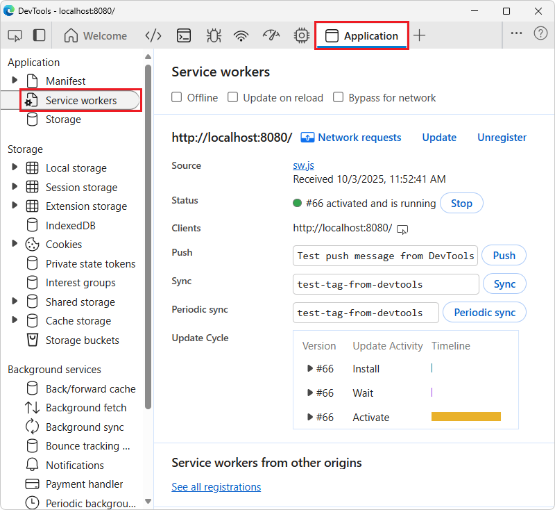

# Temperature converter sample

<!-- todo: update pngs: renamed sample in Demos repo from /temperature-converter/ to /temperature-converter/ -->

<!-- todo: figure out git add or git commit in test1 branch to not affect "main" branch, using VS Code > Terminal (not GH Desktop) -->

<!-- todo: 3rd test pass of steps -->

The Temperature converter sample is a Progressive Web App (PWA) that demonstrates the basics of how to build a PWA.  You can modify this sample to start creating your own PWA.

This article covers how to obtain the sample, install it on Windows<!-- per https://github.com/MicrosoftDocs/edge-developer/issues/1974 -->, and run the sample.  This sample works with multiple operating systems, including Windows.  This article provides steps for Windows; other platforms have similar steps.

See also:
* [Get started developing a PWA](../how-to/index.md).


<!-- ====================================================================== -->
## Step 1: Preview the app running in a browser window

To examine the user interface of the app:

1. In Microsoft Edge, go to the live [Temperature converter](https://microsoftedge.github.io/Demos/temperature-converter/) sample web app in a new window or tab (hosted at github.io):

   

   todo: update png to show new dir name

   The sample Progressive Web App (PWA) is initially shown in the browser, as a web app, but also has an **App available** () button (don't click it yet).

1. In the **temperature** text box, type **22**.

   The displayed temperature changes to **71.6 F**.

1. Click the **from** and **to** dropdown lists.

   Available units are:
   * **Celsius**
   * **Fahrenheit**
   * **Kelvin**

   In a later step, after the sample Progressive Web App (PWA) is installed as a local app, the app runs in its own window:

   

   The window is a browser-based window, without most of the browser UI.  The local app is integrated into the device's UI, such as the Windows taskbar and Windows Start menu.

   This instance of the sample app is hosted at `github.io`.  In the sections below, you use a local server instead, to show how to locally test a Progressive Web App (PWA) while developing it.

   The sample is a Progressive Web App, rather than a regular web site.  Therefore, you can install the Progressive Web App (PWA) as an app on the device, and the app's window contains the same UI as within the full web browser.

1. Close the tab that contains the live [Temperature converter](https://microsoftedge.github.io/Demos/temperature-converter/) sample web app.

   In a later step, you'll access the web app from your local server (`localhost`) instead, and install it to your device from there.


<!-- ====================================================================== -->
## Step 2: Install Visual Studio Code

Visual Studio Code enables viewing the sample code, modifying the sample, and creating your own Progressive Web App (PWA) by using the sample as a starting point.

Install (or optionally update) VS Code, as follows:

1. Press the **Windows** key, enter **Visual Studio Code**, and then click **Open**.

1. If Visual Studio Code isn't installed, go to [Visual Studio Code](https://code.visualstudio.com) and then download and install it.


<!-- ====================================================================== -->
## Step 3: Install git

Install or update git, as follows:

1. Open Visual Studio Code.

1. In the **View** menu, select **Terminal**.<!-- For details, see [Terminal Basics](https://code.visualstudio.com/docs/terminal/basics) in the VS Code docs. -->

1. Enter the command: `git -v`

   If git is installed, a version number is displayed, such as `git version 2.51.0.windows.2`.

1. If not done yet, download and install the latest version of git, from [Downloads](https://git-scm.com/downloads) at git-scm.com.

1. During installation, you can accept the defaults, except it's recommended that you change the default editor from vim to Visual Studio Code:

   


<!-- ====================================================================== -->
## Step 4: Install Node.js

Node.js includes a web server that you'll use to run and test the sample locally.

Install or update Node.js, as follows:

1. Open Visual Studio Code.

1. In the **View** menu, select **Terminal**.

1. Enter the command: `node -v`

   If Node.js has been installed, a version number is output, such as v22.19.0.

1. Go to [Node.js](https://nodejs.org).

   Note the version number in the lower left **Latest LTS** button, such as v22.20.0.

1. If you want to update Node.js, click the **Get Node.js** button.  Otherwise, skip to the next section, below.

   You end up at a page such as [Download Node.js](https://nodejs.org/download).

1. Click the **Windows Installer (.msi)** button.

   The **Downloads** window of Microsoft Edge opens, and displays a file name such as `node-v22.20.0-x64.msi`.

1. Click the **open file** link under the file name.

   The **Node.js Setup Wizard** window opens.

1. Click the **Next** button, and follow the prompts.  You can accept the defaults, then click the **Install** button.

1. Follow the prompts.

   The **Node.js Setup Wizard** window closes.

1. In VS Code's terminal, enter the command: `node -v`

   The latest version number is displayed, such as v22.20.0.


<!-- ====================================================================== -->
## Step 5: Clone (fork) the Edge Demos repo
<!-- derived from 
https://learn.microsoft.com/microsoft-edge/devtools/sample-code/sample-code#clone-the-edge-demos-repo-to-your-drive
-->

Next, you'll get a local copy of the sample code, by forking the Microsoft Edge / Demos repo.

Fork the **MicrosoftEdge / Demos** repo, as follows:

1. Press **Windows+E**.

   File Explorer opens.

   **Check whether Demos repo has been cloned:**

1. Navigate to where you want the repo cloned to, such as:

   `C:\Users\localAccount\GitHub\`

1. See whether the `\Demos\` repo is listed.

   The following steps assume that the Demos repo hasn't been cloned yet.

   **Clone (fork) the repo:**

1. Open the [MicrosoftEdge / Demos](https://github.com/MicrosoftEdge/Demos) repo in a new window or tab.

1. In the upper right, click the down-arrow on the **Fork** button, and then select **Create a new fork**.<!-- 1. Click the **Code** drop-down button, and then click the **Copy url to clipboard** button. -->

   todo: update steps

   The URL is copied to the clipboard: `https://github.com/MicrosoftEdge/Demos.git`

1. Open Visual Studio Code.

1. In the **View** menu, select **Terminal**.<!-- For details, see [Terminal Basics](https://code.visualstudio.com/docs/terminal/basics) in the VS Code docs. -->

1. Change to the directory where you want to clone the Demos repo:

   ```console
   cd ~/GitHub
   ```

   Or enter the following command, specifying your local account:

   ```console
   cd c:/users/localAccount/GitHub/
   ```

1. Enter `git clone` followed by the copied URL for the Demos repo, and then press **Enter**:

   ```console
   git clone https://github.com/MicrosoftEdge/Demos.git
   ```

1. In File Explorer, go to the new, `/Demos/` repo directory, such as:

   `C:\Users\localAccount\GitHub\Demos`

1. In File Explorer, open the `/Demos/temperature-converter/` directory, such as `C:\Users\localAccount\GitHub\Demos\temperature-converter\`.

   Files are listed, such as `converter.js`.

See also:
* [Cloning a repository](https://docs.github.com/en/repositories/creating-and-managing-repositories/cloning-a-repository) - GitHub docs.


<!-- ====================================================================== -->
## Step 6: Run the PWA as a web app on your localhost web server; Start the development web server

Next, you'll run and test the sample Progressive Web App (PWA) on your local web server, in Microsoft Edge.  You'll use `http-server`, a local development web server that can be run in Node.js.

While developing or testing a web site or app, including a PWA, you can use a local web server.  However, when the app is ready for users, you deploy the app to the web by using a web hosting provider.  Like a regular web site or app, a PWA is distributed to users by using a web server.

Change to the `/temperature-converter/` directory of the cloned Demos repo, and start the `http-server` from there, as follows:

1. In VS Code's terminal, change to the `\Demos\temperature-converter\` directory:

   ```console
   cd Demos
   cd temperature-converter
   ```

   You're now in a directory such as `C:\users\localAccount\GitHub\Demos\temperature-converter\`.

1. In VS Code's terminal, enter the following command:

   ```console
   npx http-server
   ```

   The above command starts the local development web server by using the `http-server` NPM package.

1. If you get a "running scripts is disabled" error (if VS Code's Terminal is using PowerShell), enter the execution policy PowerShell command, and then issue the npx command again:

   ```console
   Set-ExecutionPolicy -ExecutionPolicy Bypass -Scope CurrentUser
   npx http-server
   ```

   Example output:

   ```console
   Need to install the following packages:
   http-server@14.1.1
   Ok to proceed? (y)
   ```

1. If needed, press **Y** and then **Enter**.

   Output is displayed, such as:

   ```console
   Starting up http-server, serving ./
   ...
   Available on:
     http://10.0.1.12:8080
     http://127.0.0.1:8080
   Hit CTRL-C to stop the server
   ```

1. In Microsoft Edge, go to [http://localhost:8080](http://localhost:8080) (or an equivalent URL that was output in the terminal, from the `npx http-server` command).

   The temperature convertor app is displayed in the browser at `localhost:8080`:

   


<!-- ====================================================================== -->
## Step 7: Install the PWA from your localhost web server as a local app

Install the sample Progressive Web App (PWA) from your localhost web server as an app on Windows<!-- per https://github.com/MicrosoftDocs/edge-developer/issues/1974 -->, as follows:

1. In the Address bar, click the **App available. Install temperature converter** () button.

   An **Install app** dialog opens:

   

1. Click the **Install** button.

   The app is installed locally.  The **App installed** dialog opens within the app:

   

1. Click the **Allow** button.

   A Windows **Apps** dialog asks "Would you like to pin Temperature convertor to your taskbar?  This request is coming from Temperature convertor."

1. Click the **Yes** button.

   The **Temperature convertor** app's icon () appears on the Windows taskbar.

   The Temperature convertor app is displayed within its own app window:

   

   The window is a browser window without most of the browser UI.

1. Close the **Temperature converter** app window.

See also:
* [Installing a PWA](../ux.md#installing-a-pwa) in _Use PWAs in Microsoft Edge_.


<!-- ====================================================================== -->
## Step 8: Run the sample PWA as a local app

Run the sample Progressive Web App (PWA) as a local app on the device.

1. Press the **Windows** key, start typing **Temperature converter**, and then click **Open**.

   The installed **Temperature converter** app opens in its own window.

   Because you installed the app from `localhost`, when you start the app, the right side of the title bar displays **localhost:8080** for a few seconds:

   

   If you had installed the app from the `github.io` server, when you start the app, the right side of the title bar would instead display **microsoftedge.github.io** for a few seconds:

   

1. In the **temperature** text box, enter **22**.

   The displayed temperature is updated to **71.6 F**.

1. Click the **from** and **to** dropdown lists.

   Available units are:
   * **Celsius**
   * **Fahrenheit**
   * **Kelvin**


<!-- ====================================================================== -->
## Step 9: Examine the service worker handling offline caching

The local app window for a Progressive Web App (PWA) is a browser-based window, so Microsoft Edge DevTools can be used to work with the PWA.

Confirm that the service worker (`sw.js`) is running when you open the PWA as a local app, as follows:

1. Open the installed **Temperature converter** app.

1. Right-click in the app window (below the title bar), and then select **Inspect**.

   DevTools opens, in a separate window; undocked.  (Other docking options are dimmed and not available.)  The app window is a browser window, so supports the DevTools **Inspect** command, even though the app window doesn't have the UI which normally appears in a browser window.

1. In DevTools, select the **Application** () tool.

1. In the tree on the left, in the **Application** section, select **Service workers**.

   Information about the service worker is displayed:

   

   The service worker's **Source** is `sw.js`, with **Status** of **activated and is running**.

   If the service worker isn't displayed, right-click in the Temperature convertor window and then select **Refresh**.

1. In the tree on the left, in the **Storage** section, expand **Cache storage**, and then select **temperature-converter-v1**:

   

   The service worker cache is displayed.  All of the resources that are cached by the service worker (or cached automatically by the browser) are listed:
   * `/` (`index.html`) - The HTML webpage of the app, defining layout of controls.
   * `/converter.css` - The styling for the webpage of the app.
   * `/converter.js` - The JavaScript file containing the app logic.
   * `/icon512.png` - The app icon image file to represent the app.
   * `/manifest.json` - The app manifest, containing basic information about the app, for the device's operating system to use.

   The service worker adds three files to the cache, explicitly (`.html`, `.css`, and `.js`).  The icon (`.png`) and manifest (`.json`) are cached automatically by the browser.


<!-- ====================================================================== -->
## Step 10: Use DevTools to turn off the internet connection and test the PWA offline

Try the Progressive Web App (PWA) as an offline app, as follows:
 
1. In the DevTools window, open the **Network** () tool.

1. Near the top, in the menu to the right of the **Disable cache** checkbox, change from **No throttling** to **Offline**:

   

   The **Network** tab adds a warning icon to remind you of this throttling.

1. In the Temperature convertor window, right-click and then select **Refresh**.<!-- Don't select  Not "Hard refresh and empty cache", because if you were to empty the cache, the app would stop working.  The job of a service worker is to put resources in the cache so that the app can work offline.  If you empty the cache, the files that the app needs aren't there anymore, and need to be downloaded again. -->

1. In the **temperature** text box, type **22**.

   The displayed temperature changes to **71.6 F**.  The app is still displayed correctly and still works correctly, by using locally cached resources that are served out by the service worker.

1. In the DevTools window, near the top, in the menu to the right of the **Disable cache** checkbox, change from **Offline** back to **No throttling**.

   The throttling warning icon is removed from the **Network** tab.

1. Close the DevTools window.


<!-- ====================================================================== -->
## Step 11: Uninstall the sample

Uninstall the sample as a local app on the device, by starting from the running **Temperature converter** window, as follows:

1. In the running local app window, select **Settings and more** (**...**) > **App settings**.

   In Microsoft Edge, the **Apps** tab opens, displaying details about the **Temperature converter** app:

   <!-- todo: redo w/o "app" in name -->

1. At the bottom, click the **Uninstall** button.

   The **Uninstall app from Microsoft Edge on all synced devices?** dialog opens.

1. Select the **Delete app history and data** checkbox, and then click the **Uninstall** button.


<!-- ------------------------------ -->
#### Other ways to uninstall a PWA

Note: As an alternative, you could uninstall the sample PWA by starting from Microsoft Edge, as follows:

1. In Microsoft Edge, select **Settings and more** (**...**) > **More tools** > **Apps** > **View apps**.<!-- need png showing UI, which varies depending on approach -->

   The **Apps** dialog opens within Microsoft Edge.

1. Right-click the **Temperature converter** card, and then click **Manage app**.

   The **All apps / Temperature converter** page opens, at `edge://apps`.

1. Scroll down, and then click the **Uninstall** button.

<!--
1. In the **Temperature converter app** section, select **Details**, and then click the **Uninstall** button.
-->

Note: As an example of OS integration, you could uninstall the app via the Windows Start menu, as follows:

1. Press the **Windows** key.

1. Start typing "temperature converter".

1. Click **Uninstall**:

   


<!-- ====================================================================== -->
## Step 12: Modify the sample

You can modify the sample as a starting point for your own Progressive Web App (PWA).  You'll change the name of the app from "Temperature converter" to "TC", in a working branch of the repo, and then install the modified app locally.

Create a working branch and switch to it, as follows:

   **Open the folder in VS Code**

1. Open Visual Studio.

1. Click the **File** menu, and then click **Open folder**.

   The **Open Folder** dialog opens.

1. Navigate to the cloned Demos repo folder, such as `C:\Users\localAccount\GitHub\Demos\`, select the **Demos** folder, and then click the **Select Folder** button.

1. In the **Explorer** pane, open `\Demos\temperature-converter\index.html`.

   

   todo: update png to show new dir name

   In the lower left corner of Visual Studio Code, the **main** branch is indicated.

   **Create a working branch and switch to it**

1. In Visual Studio Code, in the **View** menu, select **Terminal**.

1. Press **Ctrl+C** to stop the `http-server` localhost server.

   The prompt shows the current path, such as: `PS C:\Users\localAccount\GitHub\Demos\temperature-converter>`

1. If you aren't in that directory already, change to the `/Demos/temperature-converter/` directory, by entering commands such as the following:

   ```console
   cd Demos
   cd temperature-converter
   ```

1. In VS Code's terminal, enter the following commands, to create a working branch of the repo and switch to it:

   ```console
   git branch test1
   git checkout test1
   ```

   Or, enter the combined command:

   ```console
   git checkout -b test1
   ```

   If the branch already exists, the "create branch" command or option outputs "fatal: a branch named 'test1' already exists".

   Example output: `Switched to a new branch 'test1'`

1. Close the **Terminal** pane.

   In the lower left corner of Visual Studio Code, the **test1** branch is indicated:

   

   todo: update png to show new dir name

   **Modify the files**

1. In Visual Studio Code, in the **Explorer** pane, open `/Demos/temperature-converter/index.html`.

1. In `index.html`, change the app's name in two lines from "Temperature converter" to "TC", as follows:

   Change from:

   ```html
    <title>Temperature converter</title>
    <meta name="application-name" content="Temperature converter">
   ```

   to:

   ```html
    <title>TC</title>
    <meta name="application-name" content="TC">
   ```

1. Save the file.

1. In Visual Studio Code, in the **Explorer** pane, open `/Demos/temperature-converter/manifest.json`.

1. In `manifest.json`, change the app's name in two lines from "Temperature converter" to "TC", as follows:
   
   Change from:

   ```json
   "name": "Temperature converter",
   "short_name": "Temperature converter",
   ```

   to:

   ```json
   "name": "TC",
   "short_name": "TC",
   ```

1. Save the file.

1. Enter the command: `git add .`

1. Enter the command: `git commit`

<!-- todo: test: switch to "main", expect VS Code to show name 4x "Temperature converter" not "TC" like in test1 branch -->


<!-- ====================================================================== -->
## Step 13: View the modified web app in the browser

<!-- todo: is server running, or not?  address both scenarios -->

1. In Microsoft Edge, go to [http://localhost:8080](http://localhost:8080) (or an equivalent URL that was output in the terminal, from the `npx http-server` command).

1. Refresh the page.

   If the page isn't available, start the server as follows.

1. In Visual Studio Code, in the **View** menu, select **Terminal**.

1. In VS Code's terminal, change to the `\Demos\temperature-converter\` directory:

   ```console
   cd Demos
   cd temperature-converter
   ```

   You're now in a directory such as `C:\users\localAccount\GitHub\Demos\temperature-converter\`.

1. In VS Code's terminal, enter the following command:

   ```console
   npx http-server
   ```

1. In Microsoft Edge, go to [http://localhost:8080](http://localhost:8080) (or an equivalent URL that was output in the terminal, from the `npx http-server` command).

1. Refresh the webpage.<!-- Refresh (**F5**).  Hard refresh (**Ctrl+F5**, or **Shift+F5**).  Press **F12** to open DevTools, right-click the **Refresh** button, select **Empty cache and hard reset**, and then press **F12** to close DevTools. -->

   The tab text changes from **Temperature converter** to **TC**:

   


<!-- ====================================================================== -->
## Step 14: Re-install the modified sample as a local app

Install the modified app from `localhost` in the browser onto the device, as follows:

1. Continuing from above: In Microsoft Edge, in the Address bar, click the **App available. Install TC** ( button.

   An **Install TC app** dialog opens within the browser:

   

1. Click the **Install** button.

   The modified app is installed locally.  The **App installed** dialog opens within the app:

   

1. Click the **Allow** button.  TODO: resume testing here

   A Windows **Apps** dialog asks "Would you like to pin TC to your taskbar?  This request is coming from TC."

1. Click the **Yes** button.

   The **TC** app's icon () appears on the Windows taskbar.

   The TC app is displayed within its own window, and the title bar now reads **TC**:

   


<!-- ====================================================================== -->
## Step 15: Uninstall the modified local app

Uninstall the modified local app as follows:

1. In the TC app window, select **Settings and more** (**...**) > **App settings**.

   In Microsoft Edge, the **Apps** tab opens, displaying details about the **TC** app.

1. At the bottom, click the **Uninstall** button.

   The **Uninstall app from Microsoft Edge on all synced devices?** dialog opens.

1. Select the **Delete app history and data** checkbox, and then click the **Uninstall** button.


<!-- ====================================================================== -->
## Step 16: Stop the development web server

1. In Visual Studio Code, in the **View** menu, select **Terminal**.

1. Press **Ctrl+C**.

   The npx localhost web server stops, with output message: `http-server stopped.`


<!-- ====================================================================== -->
## Step 17: Switch back to the "main" branch of the Demos repo

<!-- todo: test: expect VS Code to show name 4x "Temperature converter" not "TC" like in test1 branch -->

1. In the lower left corner of Visual Studio Code, look at the branch name.

   The **test1** branch is indicated.

1. In Visual Studio Code, in the **View** menu, select **Terminal**.

1. Enter the following command:

   ```console
   git checkout main
   ```

   Example output: `Switched to branch 'main'`

   The lower left corner of Visual Studio Code now shows the branch name **main** instead of **test1**.

This is the end of the steps for the sample.


<!-- ====================================================================== -->
## Speeding up the modify/re-install cycle

You might be able to skip some of the above steps each time you modify the app, depending on which files you modify:

* If you modify an HTML file, CSS file, or the main JavaScript file, you might be able to skip some of the above steps such as uninstalling the app.

* If you modify the manifest file or the service worker file, you might not be able to skip some of the above steps.

After the app has been installed and you go to the web app in the browser, the PWA icon in the Address bar is no longer "App available", it's changed to "Open in app".  Because you have installed the sample as a local app, the Address bar contains an **Open in app** () button instead of an **App available** button (regardless of whether the local app is open).

1. In Microsoft Edge, in the Address bar, click the **Open in app** () button.

   


<!-- ====================================================================== -->
## Next steps

Next, you can:

* Study the code; see [Temperature converter source files](./temperature-converter-source-files.md).

* Make additional minor modifications of the sample's code.

* Copy and paste the entire sample directory `/Demos/temperature-converter/` and modify the code to create your own Progressive Web App (PWA).


<!-- ====================================================================== -->
## See also
<!-- all links in article -->

* [Use PWAs in Microsoft Edge](../ux.md)
* [Get started developing a PWA](../how-to/index.md)
* [Temperature converter source files](./temperature-converter-source-files.md)

Localhost:
* [http://localhost:8080](http://localhost:8080) - or equivalent URLs output by the `npx http-server` command.

GitHub:
* [Temperature converter](https://microsoftedge.github.io/Demos/temperature-converter/) sample hosted at github.io.
* [MicrosoftEdge / Demos](https://github.com/MicrosoftEdge/Demos) repo.
* [Cloning a repository](https://docs.github.com/repositories/creating-and-managing-repositories/cloning-a-repository)

VS Code:
* [Visual Studio Code](https://code.visualstudio.com) and then download and install it.

git:
* [Downloads](https://git-scm.com/downloads) at git-scm.com.

Node.js:
* [Node.js](https://nodejs.org)
* [Download Node.js](https://nodejs.org/download)
