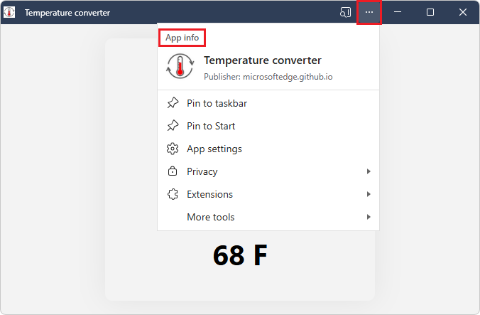

# Use PWAs in Microsoft Edge

Any device that's running Microsoft Edge gets full access to the technologies and characteristics of Progressive Web Apps (PWAs).  On Windows, PWAs are just like other apps.

This article covers preliminary, end-user information about how to use PWAs.

See also:
* [Get started developing a PWA](./how-to/index.md)

<!-- ====================================================================== -->
## Installing a PWA

When Microsoft Edge determines that a website is an installable Progressive Web App (PWA), the **App available** () icon appears in the Address bar.

1.  Click the **App available** () icon to install the PWA.

    

1.  Click **Install** to complete the installation and run the PWA in Windows.

Many PWAs are also present on the [Microsoft Store](https://apps.microsoft.com), and can be installed directly from there, without needing to open Microsoft Edge.

To install a PWA from the Microsoft Store, select **Get** on the app page:

<!-- ====================================================================== -->
## Managing PWAs

There are several ways to view the list of installed PWAs, view information about the PWAs, or uninstall them.

<!-- ------------------------------ -->
#### From "Settings and more" (...) in Microsoft Edge

To find the list of installed Progressive Web Apps (PWAs) in Microsoft Edge:

1. Select **Settings and more** > **More tools** > **Apps** > **View apps**.

1. Right-click an app, and then select **Manage app**:

   

1. View information about the app, or uninstall the app.

<!-- ------------------------------ -->
#### From the `edge://apps` special page

1. In Microsoft Edge, go to `edge://apps`.

1. On an app, click **Open**, and then click **Details**:

   

1. View information about the app, or uninstall the app.

<!-- ------------------------------ -->
#### From Settings on Windows

You can manage PWAs in the **Apps & features** system setting, like other Windows apps:

1. In Windows, select **Start**, type **Settings**, and then click **Open**.

   The **Settings** window opens.

1. In the **Find a setting** text box, start typing **Add or remove programs**, and then select **Add or remove programs**.

   The list of installed apps is displayed:

   

1. Select a PWA, and then view its information or uninstall it.

<!-- ====================================================================== -->
## Windows integration

A Progressive Web App (PWA) is displayed like a native app on Windows.  When running, the PWA appears:

* In the Taskbar (where it can be pinned).
* In the Start menu.
* When switching between apps with **Alt+Tab**.

The following sections cover details.

<!-- ====================================================================== -->
## Windows Taskbar

PWAs and native apps can reside side-by-side in the Taskbar:

PWAs are indicated in this screenshot by red boxes.

<!-- ====================================================================== -->
## Start menu

When installing a PWA, there's a **Pin to Start** checkbox:

An installed PWA has a **Settings and more** (**...**) menu that includes a **Pin to start** command:

<!-- ====================================================================== -->
## Alt+Tab

PWAs and native apps are displayed when switching between windows with **Alt+Tab**:

PWAs are indicated in this screenshot by red boxes.

<!-- ====================================================================== -->
## Shortcut on a right-click menu

A PWA can expose a common task as a shortcut that appears in the app's right-click menu (context menu):

The above screenshot shows **Start Live Session**, a custom menuitem.

See:
* [Define app shortcuts (long-press or right-click menus)](./how-to/shortcuts.md)

<!-- ====================================================================== -->
## Notifications

A PWA can display notifications in the operating system's own notification service.  This helps users re-engage with your app.

See:
* [Re-engage users with badges and notifications](./how-to/notifications-badges.md)

<!-- ====================================================================== -->
## Starting a PWA automatically during startup

A PWA on Windows can launch automatically when the user signs in, so they can immediately engage with the app.

To set an already installed PWA to automatically start when you sign in to Windows:

1.  Open Microsoft Edge.

1.  Go to `edge://apps`.  The **Apps** page lists the installed apps.

1.  On the app you want to configure, click the **More options** () button and then select **Auto-start on device login**.

<!-- ------------------------------ -->
#### During installing a PWA

During installing a PWA, users are given a chance to set a PWA to automatically start.

To set a PWA to automatically start when you sign in to Windows, while installing the PWA:

1.  During installing an app, in the post-installation dialog, select the **Auto-start on device login** checkbox:

<!-- ====================================================================== -->
## App info menu (Settings and more)

When a user selects the **Settings and more** (**...**) button in the title bar of a Progressive Web App (PWA), the **App info** menu/dialog is displayed:

The **App info** menu contains the following:

* Basic information about the app:
   * The app icon.
   * The app name.
   * The app publisher, such as the app server's domain.

* Commands:
   * **Pin to taskbar**
   * **Pin to Start**
   * **App settings**

* Submenus:
   * **Privacy** - Privacy information, such as the number of cookies used:

      

   * **Extensions** - List of extensions that Microsoft Edge has installed.

   * **More tools**
    

<!-- ====================================================================== -->
## Limitations

Progressive Web Apps (PWAs) have the following limitations.

<!-- ------------------------------ -->
#### FSLogix environments

Progressive Web Apps (PWAs) aren't supported in FSLogix environments.  In an FSLogix environment, you can install a PWA, but when you log off and then log back in, the installed PWA is gone.  This is a known restriction.

FSLogix enhances and enables a consistent experience for Windows user profiles in virtual desktop computing environments.  For more information, see [FSLogix documentation](/fslogix/).

<!-- ====================================================================== -->
## See also
<!-- all links in article -->

<!-- toc order -->
* [Get started developing a PWA](./how-to/index.md)<!-- bucket 1 sibling 2 -->
* [Temperature converter sample](./samples/temperature-converter.md)<!-- link not in article --><!-- bucket 1 sibling 3 -->
* [Define app shortcuts (long-press or right-click menus)](./how-to/shortcuts.md)<!-- bucket 3 -->
* [Re-engage users with badges and notifications](./how-to/notifications-badges.md)<!-- bucket 5 -->

External:
* [Microsoft Store](https://apps.microsoft.com)
